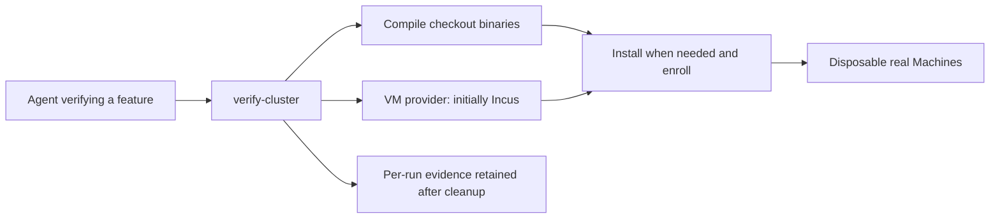

# Verify a server feature

Run from `core/` on the Linux development host. From a Mac, SSH to that host and run the same commands there. `up` boots one Machine. Pass `--machines N` only when a check needs N distinct Machines, for example a move that needs a source and a target, or a refusal that needs a Machine holding no copy, and name that check in your evidence. Each VM costs 2 GiB of RAM and two vCPUs on a host that other sessions share. Choose the checks from the feature being implemented; the helper provides the environment. Read `DESIGN.md` and the relevant `../docs/user/` behavior before choosing expected outcomes.



## Launch and doctor

Choose `stable` for dashboard or client work against a published daemon. Use `checkout` when the feature changes daemon behavior; use `beta` or an exact version when that is the required baseline.

```bash
run=$(scripts/verify-cluster up --daemon stable)
scripts/verify-cluster doctor "$run"
```

`--daemon checkout` is the command's default; it builds and installs this checkout's runtime. `PLOYZ_VERIFY_CARGO_ARGS` appends to that `cargo build`; `PLOYZ_VERIFY_CARGO_ARGS="--features ployz/verify-faults,ployzd/verify-faults"` builds the fault hooks and `ployz debug volume-rpc` that Volume switch verification drives. `--daemon stable`, `beta` or an exact version uses a cached published runtime image and skips daemon compilation, per-Machine binary uploads and installation. Channel selection resolves to an exact version recorded in the manifest. The host CLI still comes from this checkout because the released CLI enrolls through Cloud rather than supporting standalone enrollment.

`up` returns an absolute manifest path on stdout. Each invocation creates a separate cluster, SSH credentials, CLI context, Config Store and application workspace. The manifest records the selected daemon, Machines, artifact hashes and timings. Incus is the initial provider; its image, bridge and VM commands stay in `scripts/verify/incus.py`.

The first run for an image recipe prepares Ubuntu with Docker, real ZFS, Corrosion, Caddy and nginx. Later runs boot clones with cached dependencies. Published daemons and their systemd units stay installed in release images; checkout runs install their own binaries and units. The host CLI drives both and reads each Entry Machine over SSH. Machine identities are created after cloning. Compilation overlaps image preparation and VM boot; installation and enrollment wait for the required binaries. Phase timings overlap; `total` records elapsed startup time.

`doctor` checks active services, the running daemon's executable hash, ZFS, and each Entry Machine's observation of the expected peers. Run it before driving and after an unexpected failure. A deliberate fault can make doctor fail; restore that fault or start a fresh run before continuing unrelated checks.

A committed enrollment can return a startup follow-up failure. The helper retains that failure in `setup_follow_up_errors`, checks readiness for up to 30 seconds and completes the public ingress recovery command. It reports setup failures in stderr and evidence; inspect and report these when enrollment itself is the feature under verification.

## Drive the feature

```bash
scripts/verify-cluster cli "$run" -- --json server ls
scripts/verify-cluster cli "$run" -- project new verify
scripts/verify-cluster cli "$run" -- service add web --image nginx:1.29-alpine
scripts/verify-cluster cli "$run" -- deploy
scripts/verify-cluster cli "$run" -- --json ps
scripts/verify-cluster exec "$run" machine-1 -- zpool status
scripts/verify-cluster exec "$run" machine-2 -- journalctl -u ployz --no-pager -n 100
```

Managed Volumes work on every run. Enrollment says `--storage none` only because `--no-install` requires it; the image already ran the real installer with `--storage zfs`. As on a real Server, the daemon creates the file-backed `ployz` Machine Pool under `/var/lib/ployz-machine-pool` when the first managed Volume deploys. Do not create a pool yourself. Each Machine's 24 GiB root disk bounds the Pool.

Use `cli` for product actions; it isolates ambient Ployz credentials and runs in the manifest's sibling `workspace/`. Use `exec` for diagnostics or faults inside a selected Machine. Arguments are passed directly; use `-- bash -ec '...'` when a shell is needed. Both commands capture stdout, stderr and exit status and return the underlying command's status. Read the current CLI's `--help` for the feature's actual interface.

Select checks that can expose the feature's failures. For a ZFS migration, run a stateful workload with durable numbered writes and an external request trace, trigger the actual migration, then compare acknowledged writes with destination data and measure the outage. Exercise relevant transfer interruption, destination capacity, startup and retry cases against the intended contract. Report observed downtime; a migration that finishes does not alone prove minimal downtime. A recipe for a feature still being implemented comes from its requirements and current interface.

## Faults and the ack probe

```bash
scripts/verify-cluster probe "$run" db &        # numbered inserts into Postgres Service db
probe=$!
scripts/verify-cluster power off "$run" machine-1
scripts/verify-cluster power on "$run" machine-1
scripts/verify-cluster partition on "$run" machine-2
scripts/verify-cluster partition off "$run" machine-2
scripts/verify-cluster runner kill "$run"       # --cloud runs only
scripts/verify-cluster runner start "$run"
kill "$probe"; wait "$probe"                   # prints the report; exits 1 when an acknowledged id is lost
```

`power off` cuts the VM's power with no shutdown, so unflushed writes are lost as on a real power failure. `power on` boots it and returns once Docker and `ployz` are active; it fails if the Machine's address changed. `partition on` drops the Machine's traffic with every peer's address, which carries WireGuard and so the whole mesh. The host can still reach the Machine, so `exec`, `cli --connect` and Cloud keep working. The rules do not survive a reboot. Each action is idempotent.

`runner kill` sends SIGKILL to the Inngest worker that the dashboard of a `--cloud` run started. Inngest keeps its function runs, and a step the worker was running is retried after a worker connects again. `runner start` starts the worker again with `../dashboard/scripts/verify/worker.sh` and waits until it connects.

`probe` streams `INSERT … RETURNING id` through `ployz exec -T <service> -- psql` into table `ackprobe`, 200 per second by default (`--rate`). Postgres's default `synchronous_commit=on` holds a commit's reply until the commit is durable. An id counts as acknowledged only after psql prints its row, and each one is logged with its time in `evidence/ackprobe-<service>-<time>.jsonl`. A session that dies or waits longer than `--stall` seconds is replaced, and the ids it left in flight are not retried, so they count as unknown. Each new session runs through `ployz exec`, so it reaches the Service on whichever Machine runs it now. On SIGINT or SIGTERM the probe reads the table back from the current writer and prints one JSON report: `lost` lists acknowledged ids missing there, and `longest_gap_seconds` with `longest_gap_between` gives the longest wait between two acknowledgements, a measure of downtime. While the writer is unreachable a session hangs until `--stall` ends it, so the gap can overstate the outage by up to `--stall` (2 s by default) plus one reconnect through `ployz exec`. `scripts/test-verify-faults.py [daemon] [--cloud]` runs the power-cut case under the probe and, with `--cloud`, kills the runner while a Deploy is `running` and checks that the Deploy applies after `runner start`.

After correcting the implementation, keep the Machines and their data while updating binaries. `update` keeps the run's daemon selection; a channel is resolved again:

```bash
scripts/verify-cluster update "$run"
```

To switch a release cluster to a modified daemon, use `scripts/verify-cluster update "$run" --daemon checkout` explicitly.

## Evidence and cleanup

Every helper command saves its argv, exit code, duration, stdout and stderr beside the manifest in `evidence/`. Save client traffic traces, feature-specific assertions and any additional proof there too. Capture each Entry Machine separately when replicated observations matter. Name the behavior exercised and report failures or untested cases precisely.

```bash
scripts/verify-cluster down "$run"
```

Run cleanup after failed attempts as well as successful verification. It collects journals, ZFS and WireGuard state where reachable, deletes only this run's provider resources and private credentials, and retains the manifest and evidence. Confirm the evidence remains after teardown. Shared prepared images and the storage pool remain cached.

The Incus host needs KVM, passwordless sudo, Python 3, Rust, `strip`, OpenSSH, Incus and QEMU/OVMF. The backend uses the shared `ployz-verify` directory pool here. Set `PLOYZ_VERIFY_INCUS_POOL` before launch to use another existing Incus pool; the manifest binds subsequent commands to that pool. A copy-on-write pool cuts disk cloning time, but measure total startup on the actual host: loop-backed ZFS made complete VM startup slower on this VM. Prepared images and the first pool import are shared cache costs. Agents may install missing development dependencies under this VM's environment instructions. Docker's host forwarding rules can block guest networking; the Incus backend adds and removes rules scoped to this run's bridge. The lab enrolls standalone by default.

## Cloud pairing

```bash
run=$(scripts/verify-cluster up --daemon stable --cloud)
```

`--cloud` starts this checkout's dashboard (`../dashboard/scripts/verify/up.sh`) with Inngest and the worker. It then enrolls the Machines through it with the seed's Organization Token rather than `--standalone`. `cli` then goes through Cloud with that token, and `doctor` also checks that Cloud lists exactly this run's Machines. `down` stops the dashboard it started. When the dashboard's `SERVERS=N up.sh` started the cluster instead, the dashboard owns it and its `down.sh` removes the cluster. Cloud enrollment needs the daemon version to equal this checkout's CLI version, so use `stable` on a release commit and `checkout` otherwise. In this mode the daemon advertises its discovered endpoints, so the provider's `--public-ip` and `--wg-endpoint` choices do not apply.
