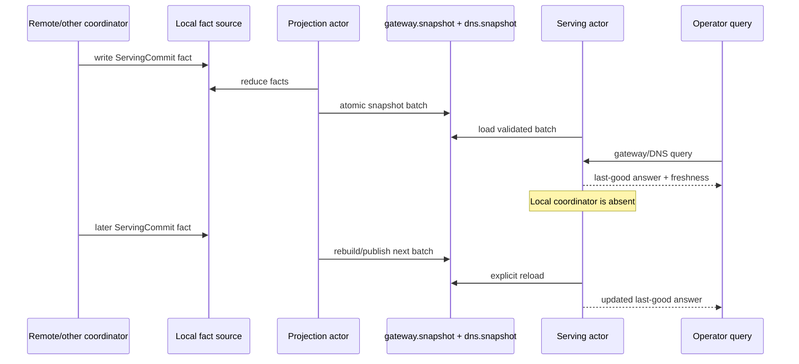

# Slice 011 Steady-State Serving While Coordinator Is Down Plan

## Summary

Prove the first coordinator-down steady-state serving contract under `MVP/`:
gateway and DNS serving state loads from local snapshots, keeps last-good state
after unsafe reloads, survives coordinator absence, and can receive new
projected serving facts through a projection actor plus serving-actor snapshot
apply path that does not depend on the command coordinator.

---

## Problem Frame

Slice 010 proved that deploy cutover is a local durable `ServingCommit` fact and
that drain is gated on projection catch-up. The next missing proof is that
serving state is not fate-bound to the command coordinator: killing the
coordinator should remove mutation authority, not typed gateway/DNS
serving-state queries or local application of already-committed serving facts.
Those typed queries are the semantic stand-in for later wire HTTP/DNS serving.

This slice is the semantic serving-role proof before a later OS-process and
wire-protocol proof. It must not revive the superseded Slice 006 plan as a
commitment to old gateway/DNS shape, but it should reuse the useful invariants:
validate before replace, keep last good in memory, make staleness visible, and
load from local snapshots before serving.

---

## Requirements

- R1. Serving state loads from `gateway.snapshot` and `dns.snapshot` without a
  live coordinator.
- R2. Gateway and DNS queries read from actor-owned last-good state, not from
  SQLite, the bus, or the coordinator hot path.
- R3. Reload validates the gateway/DNS snapshot batch before replacing in-memory
  serving state; corrupt, wrong-island, missing, or symlinked next snapshots
  preserve last good state.
- R4. Serving status exposes freshness, loaded revisions, snapshot age, reload
  attempts, and structured last failure so stale-state serving is visible.
- R5. Projection, snapshot publication, and explicit serving-actor snapshot
  apply can continue while the local coordinator role is absent.
- R6. Deleting `projections.sqlite` while serving continues does not interrupt
  gateway/DNS queries; projection rebuilds from facts and republishes snapshots.
- R7. A serving role can restart from last-good snapshot files while the
  coordinator is still absent.
- R8. The E2E harness emits metrics for data-plane query success during
  coordinator outage, projection rebuild duration, reload duration, and stale
  snapshot age.

---

## Scope Boundaries

- Keep all implementation under `MVP/`.
- Do not modify existing `crates/ployz-gateway`, `crates/ployz-dns`,
  `crates/ployzd`, root workspace membership, or existing non-MVP code.
- Do not preserve the old gateway/DNS input model as a constraint.
- Do not introduce a controller/reconciler loop that rewrites durable truth.
- Do not add quorum, witness acknowledgements, `store.pin_fact`, or lease
  ownership to serving-state application.
- Do not add automatic filesystem watching in this slice; use explicit reload
  commands so the last-good contract is deterministic.
- Do not add Pingora or Hickory wire serving in this slice; typed gateway/DNS
  queries prove the local serving-state semantics first.
- Do not claim full E2E-7 completion. This slice proves actor/process-role
  independence inside the MVP harness; OS process restart, real HTTP, real DNS,
  WireGuard, and workload traffic remain follow-up proof.

### Deferred to Follow-Up Work

- OS-process role proof: separate MVP-local coordinator, projection, serving
  apply, gateway, and DNS processes with process kill/restart.
- Wire-level HTTP serving: evaluate Pingora/axum once route semantics and
  last-good state are proven.
- Wire-level DNS serving: evaluate Hickory protocol/server once typed DNS
  queries are proven.
- File watcher reload: evaluate `notify` after explicit reload semantics are
  correct.
- Hot-path shared snapshot optimization: evaluate `arc-swap` when real
  concurrent request handlers exist.

---

## Context & Research

### Relevant Code and Patterns

- `MVP/projection/src/snapshot.rs`: validates snapshot schema/island/symlink
  targets and writes gateway/DNS snapshots as an atomic batch.
- `MVP/projection/src/actor.rs`: Kameo actor ownership, typed status,
  projection deadlines, last-success/last-failure visibility.
- `MVP/projection/src/sqlite.rs`: projection state is rebuildable and
  disposable.
- `MVP/deploy/src/serving_commit.rs`: writes aggregate `ServingCommit` facts.
- `MVP/e2e/src/deploy_commit_drain_contract.rs`: writes serving facts, runs
  projection, asserts gateway/DNS snapshots, and proves old backends are alive
  before cleanup.
- `MVP/e2e/src/projection_harness.rs`: existing helper for projection actors in
  E2E scenarios.
- `MVP/slice-006-gateway-dns-serving-plan.md`: superseded plan; reuse only its
  last-good and validation invariants, not its old role-shape assumptions.

### Institutional Learnings

- `VISION.md`: the daemon is disposable; data-plane behavior must outlive it.
- `MVP/overall-plan.md`: "kill the daemon" means kill the coordinator role, not
  the steady-state serving or applier roles.
- `MVP/architecture.md`: fact-sync, projection, and snapshot applier roles keep
  consuming already-authorized replicated serving facts while the coordinator is
  down.
- `MVP/slice-005-fact-projection.md`: SQLite is disposable and snapshots are
  atomic last-good files.
- `MVP/slice-010-deploy-commit-drain.md`: `ServingCommit` is the local durable
  route/gateway/DNS boundary and drain gate.
- `docs/solutions/architecture-patterns/authority-status-separates-truth-from-observation-2026-05-08.md`:
  status must separate stored truth, live observation, and uncertainty.
- `docs/solutions/architecture-patterns/preflight-authority-promotions-before-mutation-2026-05-08.md`:
  validate final inputs before mutation; do not partly replace serving state
  from an unsafe snapshot batch.

### External References

- `notify`: good later fit for cross-platform file watching, but deferred
  because explicit reloads are easier to reason about first.
  <https://docs.rs/notify/>
- `pingora` / `pingora-proxy`: strong HTTP serving/proxy candidates once a
  wire-level serving slice is ready; deferred here.
  <https://docs.rs/pingora> and <https://docs.rs/pingora-proxy>
- `hickory-server`: correct family for full DNS serving; deferred here in
  favor of typed DNS queries.
  <https://docs.rs/hickory-server/latest/hickory_server/>
- `axum`: useful for small future HTTP health/serving surfaces; deferred here.
  <https://docs.rs/axum/latest/axum/>
- `arc-swap`: useful for future concurrent hot-path snapshot reads; deferred
  until wire-serving introduces real concurrent readers.
  <https://docs.rs/arc-swap/latest/arc_swap/>

---

## Key Technical Decisions

- Add an MVP-local `mvp-serving` crate: serving-state behavior needs a reusable
  boundary instead of living inside E2E test code.
- Use a Kameo actor for serving state: this keeps the slice aligned with the
  actor-first local runtime and gives one owner for last-good state, reload
  status, and typed query replies.
- Treat the serving actor as the in-scope snapshot applier: this slice does not
  add a third applier component between projection and serving. Later
  process-role work may split that responsibility once wire serving exists.
- Load gateway and DNS snapshots as one validated batch before replacement:
  split replacement could make HTTP and DNS disagree after a partial/corrupt
  reload.
- Keep typed gateway/DNS query APIs instead of wire HTTP/DNS in this slice:
  the current proof target is local state survival and reload semantics, not
  Pingora/Hickory integration.
- Use explicit reload commands, not file watching: watcher timing would obscure
  the deterministic last-good contract.
- Model coordinator absence as command-health evidence in the E2E scenario:
  serving and projection continue, while mutation/coordinator availability is
  reported as unavailable rather than hidden.

---

## Open Questions

### Resolved During Planning

- Should this revive the superseded Slice 006 plan? No. Reuse its invariants
  but plan fresh against the current strategy and Slice 010 serving facts.
- Should this import Pingora, Hickory, notify, or axum now? No. They solve
  later wire/process plumbing; explicit typed reload/query APIs better prove
  the semantic boundary first.
- Should the serving role depend on leases or quorum? No. Last-good serving is
  local application of committed facts and snapshots, not an ownership problem.

### Deferred to Implementation

- Exact actor message names and helper names: choose the smallest readable names
  that match existing MVP actor style.
- Final status timestamp representation: use a simple deterministic/testable
  representation unless implementation shows a better local pattern.
- Whether gateway and DNS actor internals should remain one combined actor or
  split behind one batch apply method: preserve atomic batch replacement either
  way.

---

## Output Structure

    MVP/serving/
      Cargo.toml
      src/lib.rs
      src/error.rs
      src/model.rs
      src/actor.rs
      src/tests.rs
    MVP/e2e/src/steady_state_serving_contract.rs

The tree is expected shape, not a hard constraint. Keep any adjusted structure
equally small and self-contained under `MVP/`.

---

## High-Level Technical Design

> *This illustrates the intended approach and is directional guidance for
> review, not implementation specification. The implementing agent should treat
> it as context, not code to reproduce.*

---

## Implementation Units

### U1. Serving State Domain

**Goal:** Add the small `mvp-serving` crate and shared types for last-good
serving state, snapshot batch loading, status, freshness, and structured
failures.

**Requirements:** R1, R3, R4

**Dependencies:** None

**Files:**
- Create: `MVP/serving/Cargo.toml`
- Create: `MVP/serving/src/lib.rs`
- Create: `MVP/serving/src/error.rs`
- Create: `MVP/serving/src/model.rs`
- Create: `MVP/serving/src/tests.rs`
- Modify: `MVP/Cargo.toml`

**Approach:**
- Depend on `mvp-projection` for `GatewaySnapshotFile`,
  `DnsSnapshotFile`, and snapshot loaders.
- Model a `ServingSnapshotBatch` that loads both snapshot files and validates
  them for the expected island before any in-memory replacement.
- Model `ServingFreshness` as an enum, not booleans. Expected states include
  fresh, aged last-good, and last-good-after-failure.
- Model reload failures as structured variants for missing, invalid,
  wrong-island, symlink/path, and projection-loader failure where possible.
- Keep snapshot payloads typed; no raw JSON plumbing leaks into serving code.

**Execution note:** Implement domain tests first so replacement semantics stay
small before actor code exists.

**Patterns to follow:**
- `MVP/projection/src/snapshot.rs`
- `MVP/projection/src/error.rs`
- `MVP/deploy/src/domain.rs`

**Test scenarios:**
- Happy path: valid gateway and DNS snapshots for the expected island load as
  one batch with both revisions recorded.
- Error path: missing gateway or DNS snapshot returns a structured load failure.
- Error path: wrong-island gateway or DNS snapshot returns a structured load
  failure and does not produce a partial batch.
- Error path: symlinked snapshot path is rejected through the projection loader.
- Edge case: empty routes or records remain valid when represented by a valid
  snapshot file.

**Verification:**
- `mvp-serving` compiles and domain tests prove all load outcomes are typed.

### U2. Actor-Owned Last-Good Serving

**Goal:** Add an actor-owned serving state that can answer gateway and DNS
queries from memory, reload validated snapshot batches, and preserve last good
on unsafe reloads.

**Requirements:** R1, R2, R3, R4

**Dependencies:** U1

**Files:**
- Create: `MVP/serving/src/actor.rs`
- Modify: `MVP/serving/src/lib.rs`
- Test: `MVP/serving/src/tests.rs`

**Approach:**
- Spawn a Kameo actor with expected island, gateway path, DNS path, and
  last-good `ServingSnapshotBatch`.
- Expose typed handle methods for gateway route lookup, DNS record lookup,
  reload from files, and status.
- Make startup require a valid initial snapshot batch; startup without a valid
  last-good state fails loudly.
- On reload failure, keep the previous batch in memory and update status with
  last attempt and failure details.
- Compute freshness from loaded time, last reload failure, and a caller-supplied
  stale threshold so tests can prove aged serving without sleeps where possible.

**Execution note:** Keep the actor API intentionally narrow; it is the future
surface Pingora/DNS roles should read from, not a miniature gateway framework.

**Patterns to follow:**
- `MVP/projection/src/actor.rs`
- `MVP/bus/src/actor.rs`
- `MVP/e2e/src/projection_harness.rs`

**Test scenarios:**
- Happy path: actor starts from valid snapshots and gateway host lookup returns
  the committed route.
- Happy path: DNS lookup returns matching name/type records from memory.
- Happy path: reload to a newer valid snapshot replaces gateway and DNS answers
  together.
- Error path: corrupt reload keeps old gateway and DNS answers and records
  `ServingLastGoodAfterFailure`.
- Error path: wrong-island reload keeps old answers.
- Error path: deleting one snapshot keeps old answers; no partial replacement.
- Edge case: stale threshold classifies an old loaded snapshot as aged while
  still serving.
- Edge case: status reports the loaded gateway/DNS revisions before and after a
  successful reload.
- Edge case: status increments or otherwise exposes reload attempts after both
  successful and failed reloads.

**Verification:**
- Actor unit tests prove last-good state, batch replacement, status, and query
  semantics without needing E2E harness code.

### U3. Coordinator-Down Serving E2E Contract

**Goal:** Add an E2E scenario that proves serving continues and can update from
projected facts while the local coordinator role is absent.

**Requirements:** R1, R2, R3, R4, R5, R6, R7, R8

**Dependencies:** U1, U2

**Files:**
- Create: `MVP/e2e/src/steady_state_serving_contract.rs`
- Modify: `MVP/e2e/src/main.rs`
- Modify: `MVP/e2e/Cargo.toml`
- Test: `MVP/e2e/src/steady_state_serving_contract.rs`

**Approach:**
- Use existing bus/projection harnesses to write a `ServingCommit`, project it,
  and produce `gateway.snapshot`/`dns.snapshot`.
- Start the serving actor from snapshot files, then drop or avoid constructing
  the local deploy coordinator to represent coordinator absence.
- Query gateway and DNS through serving actor handles and assert success during
  coordinator absence.
- Write a second `ServingCommit` through a separate "remote coordinator" fact
  writer, run projection, reload serving, and assert gateway and DNS update
  without local coordinator involvement.
- Delete `projections.sqlite` while serving actor remains live, rebuild
  projection from facts, and assert serving continues during rebuild and can
  reload the rebuilt snapshots.
- Restart the serving actor from snapshot files while the coordinator is still
  absent and assert it serves the same last-good state.
- Exercise corrupt, wrong-island, symlink, and deleted next-snapshot reloads
  and assert old gateway/DNS answers remain.
- Emit metrics JSON for query success during outage, reload duration,
  projection rebuild duration, restart-from-file duration, and stale snapshot
  age.

**Execution note:** Start with the E2E happy path before adding failure cases,
then keep failures as small variants rather than a generic scenario framework.

**Patterns to follow:**
- `MVP/e2e/src/deploy_commit_drain_contract.rs`
- `MVP/e2e/src/projection_contract.rs`
- `MVP/e2e/src/metrics.rs`
- `MVP/e2e/src/assertions.rs`

**Test scenarios:**
- Integration: first serving commit projects snapshots, serving actor starts
  from files, gateway route and DNS record queries succeed.
- Integration: while coordinator is absent, existing gateway and DNS queries
  keep succeeding.
- Integration: remote serving commit plus projection reload updates both
  gateway and DNS answers without local coordinator involvement.
- Integration: deleting `projections.sqlite` does not interrupt serving; a new
  projection actor rebuilds SQLite and snapshots from facts.
- Integration: serving actor restart from files works while coordinator is
  absent.
- Error path: corrupt gateway or DNS next snapshot preserves old answers and
  reports structured failure.
- Error path: wrong-island next snapshot preserves old answers.
- Error path: symlinked next snapshot preserves old answers.
- Error path: deleted next snapshot preserves old answers.
- Integration: status after the scenario includes loaded gateway/DNS revisions,
  reload-attempt evidence, snapshot age, and the last structured reload failure.

**Verification:**
- `steady-state-serving-contract` is included in the E2E scenario table and in
  the `all` run.
- Metrics prove data-plane query success during coordinator outage and record
  reload/rebuild/restart timing.

### U4. Slice Documentation And Decision Ledger

**Goal:** Record the slice result, crate decisions, semantic leverage, and the
remaining gap to full E2E-7 process/wire proof.

**Requirements:** R4, R8

**Dependencies:** U3

**Files:**
- Create: `MVP/slice-011-steady-state-serving.md`
- Modify: `MVP/primitive-decisions.md`
- Modify: `MVP/e2e-proof-plan.md`

**Approach:**
- Add a "Changed Since Last Slice" entry for actor-owned last-good serving and
  coordinator-down projection plus serving-apply independence.
- Mark this as a partial E2E-7 proof: semantic role independence and last-good
  snapshots are covered; real process and wire-protocol restarts remain.
- Include crate research decisions and explicitly deferred crates.
- Compare new serving code shape with the old gateway/DNS paths qualitatively
  and with a small LOC baseline where useful.

**Patterns to follow:**
- `MVP/slice-010-deploy-commit-drain.md`
- `MVP/primitive-decisions.md`
- `MVP/e2e-proof-plan.md`

**Test scenarios:**
- Test expectation: none -- documentation-only unit, verified by consistency
  with implemented behavior and command output.

**Verification:**
- Slice report lists all checks run and observed E2E metrics.
- E2E proof plan clearly shows which E2E-7 bullets are covered versus deferred.

---

## System-Wide Impact

- **Interaction graph:** serving state becomes a new consumer of projection
  snapshots and the in-scope snapshot applier; deploy and projection do not
  call serving internals as authority.
- **Error propagation:** unsafe reloads return structured serving failures and
  update status, while preserving last-good answers for callers.
- **State lifecycle risks:** snapshot batch replacement must stay atomic at the
  serving-state level, not just at the file-write level.
- **API surface parity:** future Pingora/DNS wire roles should consume the
  same typed serving-state boundary or an equivalent last-good batch API.
- **Integration coverage:** E2E must prove projection rebuild and reload while
  serving continues; actor tests alone are not enough.
- **Unchanged invariants:** facts remain authoritative, SQLite remains
  disposable, and coordinator absence does not imply node death.

---

## Risks & Dependencies

| Risk | Mitigation |
|------|------------|
| The slice is mistaken for full E2E-7 completion | Document it as the actor/role semantic proof and keep OS-process/wire restarts deferred. |
| Gateway and DNS update independently and disagree | Load and replace a validated gateway/DNS batch together. |
| Last-good serving hides stale state | Status includes freshness, snapshot age, and last failure; E2E asserts those fields. |
| Typed query APIs under-prove real serving | Keep Pingora/Hickory deferred but explicit; this slice proves the state boundary they will consume. |
| Reload tests become timing-sensitive | Use explicit reload commands and deterministic stale thresholds instead of file watchers. |

---

## Documentation / Operational Notes

- Keep the docs clear that "coordinator down" means mutation/coordinator
  unavailable, not node dead.
- Record that existing gateway/DNS binaries are still references, not
  migration targets.
- Make stale-state health visible in metrics and slice report; do not rely on
  logs as the audience.

---

## Sources & References

- [VISION.md](../VISION.md)
- [MVP/overall-plan.md](overall-plan.md)
- [MVP/architecture.md](architecture.md)
- [MVP/e2e-proof-plan.md](e2e-proof-plan.md)
- [MVP/primitive-decisions.md](primitive-decisions.md)
- [MVP/slice-005-fact-projection.md](slice-005-fact-projection.md)
- [MVP/slice-006-gateway-dns-serving-plan.md](slice-006-gateway-dns-serving-plan.md)
- [MVP/slice-010-deploy-commit-drain.md](slice-010-deploy-commit-drain.md)
- [docs/solutions/architecture-patterns/authority-status-separates-truth-from-observation-2026-05-08.md](../docs/solutions/architecture-patterns/authority-status-separates-truth-from-observation-2026-05-08.md)
- [docs/solutions/architecture-patterns/preflight-authority-promotions-before-mutation-2026-05-08.md](../docs/solutions/architecture-patterns/preflight-authority-promotions-before-mutation-2026-05-08.md)
- `notify` docs: <https://docs.rs/notify/>
- `pingora` docs: <https://docs.rs/pingora>
- `pingora-proxy` docs: <https://docs.rs/pingora-proxy>
- `hickory-server` docs: <https://docs.rs/hickory-server/latest/hickory_server/>
- `axum` docs: <https://docs.rs/axum/latest/axum/>
- `arc-swap` docs: <https://docs.rs/arc-swap/latest/arc_swap/>
