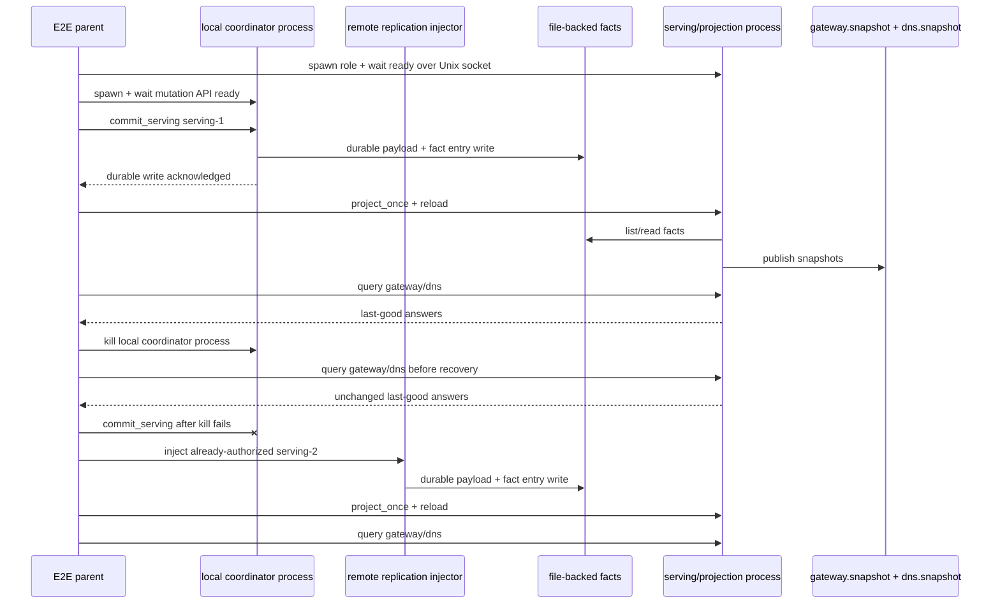

# Slice 012 Process-Role Serving While Coordinator Dies Plan

## Summary

Prove the next daemon-down boundary under `MVP/`: a real local coordinator OS
process can admit a serving mutation, write it durably, and die after the
serving/projection process has loaded the baseline. The separate
serving/projection OS process keeps answering typed gateway/DNS queries, can
apply later already-authorized facts, rebuilds projection state from durable
local facts, and keeps mutation unavailability separate from data-plane health.

This is still not the full wire-serving proof. It is the OS process-role proof
that the Slice 011 actor semantics survive fate separation.

---

## Problem Frame

Slice 011 proved the right state semantics inside one test process:
actor-owned last-good serving state, explicit reload, batch validation, fresh
projection rebuild, and serving queries during coordinator absence. The next
failure mode to eliminate is accidental in-process coupling. If the coordinator
is a separate role, killing it must not take the serving/projection role down or
remove the local facts the applier needs.

The smallest honest next proof is an MVP-local process harness:

- one local coordinator process exposes a tiny mutation/admission API, writes a
  serving commit to durable harness-local facts, acknowledges fsync, and remains
  alive until the parent kills it,
- one long-lived serving/projection process owns projection + serving actors and
  a small local IPC query/reload API,
- the parent harness projects/reloads the first commit, proves baseline serving,
  then kills the coordinator process,
- the serving/projection process continues answering before any recovery command
  runs,
- a separate remote-replication injector writes later already-authorized facts
  so the applier path can be proven without reviving local mutation authority.

The proof is process fate separation. It must not claim real cross-node
iroh-docs replication, Pingora HTTP serving, Hickory DNS serving, WireGuard, or
production process supervision.

---

## Requirements

- R1. A serving/projection OS process starts independently of the coordinator
  and answers typed gateway/DNS queries from last-good snapshot state.
- R2. A local coordinator OS process owns a minimal mutation/admission API,
  durably writes a serving commit to a local file-backed fact source, and can be
  killed after acknowledging the durable write.
- R3. Killing the coordinator after baseline projection/reload does not stop the
  serving process, corrupt facts, delete snapshots, or change serving answers;
  gateway/DNS query probes continue before any projection/reload recovery
  command runs.
- R4. A later serving commit injected as already-authorized remote replication
  can be projected and reloaded by the already-running serving process without
  reviving the killed local coordinator.
- R5. Deleting `projections.sqlite` while the serving process is live does not
  interrupt typed gateway/DNS queries. A fresh projection actor inside the
  serving process rebuilds from file-backed facts.
- R6. The serving/projection process can be restarted from snapshot files while
  the coordinator remains dead and still answer typed gateway/DNS queries.
- R7. The process harness reports structured metrics: coordinator killed,
  serving process still alive, query probes during outage, commit-to-reload
  duration, local mutation failure after coordinator death, projection rebuild
  duration, serving restart duration, and stale snapshot age.
- R8. The harness distinguishes local mutation unavailability after coordinator
  death from serving/projection health. The serving/projection role reports its
  own health and that mutation is unavailable in that role; it does not poll,
  watch, or infer local coordinator liveness.
- R9. All new code remains self-contained under `MVP/`.

---

## Scope Boundaries

- Keep all implementation under `MVP/`.
- Do not modify existing `crates/`, root workspace membership, existing
  gateway/DNS binaries, or existing daemon code.
- Do not add Pingora, Hickory, WireGuard, or workload runtime behavior in this
  slice.
- Do not claim docs-backed cross-node replication. The file-backed fact source
  is a harness for OS process fate separation.
- Do not add an active-member, memberlist, partition-view, quorum,
  witness-ack, or `store.pin_fact` commit boundary. Future reachability checks
  may become explicit command evidence only.
- Do not infer the node is dead just because its coordinator role is absent.
  A future memberlist or active-partition view may give the operator a better
  picture of which peers were reachable at command time, but that is pushed
  down the road and must not become a hidden quorum in this slice.
- Do not build a general production process supervisor. Use the smallest typed
  harness role protocol that proves the failure boundary.
- Do not let the serving/projection role monitor, poll, or infer coordinator
  process liveness. The parent harness owns child-exit evidence and failed
  local mutation-attempt evidence.
- Do not use a second local coordinator to apply later state after the first
  coordinator dies. Later state in this slice is a remote-replication injection
  harness for already-authorized facts.
- Do not add automatic file watching. Serving reload remains explicit so the
  last-good contract stays deterministic.
- Do not introduce a background reconciler that silently rewrites durable
  truth. Projection/reload happen through explicit harness commands.
- Do not preserve the old gateway/DNS input model as a constraint.

---

## Context & Research

### Relevant MVP Code

- `MVP/e2e/src/steady_state_serving_contract.rs`: semantic in-process proof to
  lift into real OS process roles.
- `MVP/serving/src/actor.rs`: actor-owned last-good serving state, explicit
  reload, typed query API, and structured status.
- `MVP/projection/src/actor.rs`: bounded `project_once`, fresh actor creation,
  visible status, and projection failure handling.
- `MVP/projection/src/source.rs`: `FactSource` seam for process-local
  file-backed facts without changing reducers.
- `MVP/projection/src/snapshot.rs`: atomic gateway/DNS snapshot writes,
  rollback on partial failure, symlink rejection, and loader validation.
- `MVP/deploy/src/serving_commit.rs`: serving commit payload shape and fact key
  convention.
- `MVP/e2e/src/main.rs`: existing scenario table and command dispatch.

### Institutional Learnings

- `VISION.md`: the data plane outlives the control plane.
- `MVP/overall-plan.md`: killing the daemon means killing the mutation
  coordinator role, not workloads, WireGuard, HTTP/DNS serving, or local
  serving-state appliers.
- `docs/solutions/architecture-patterns/authority-status-separates-truth-from-observation-2026-05-08.md`:
  status must separate durable truth, runtime observation, and unknown/stale
  health.
- `docs/solutions/architecture-patterns/preflight-authority-promotions-before-mutation-2026-05-08.md`:
  validate final restart/process inputs before mutation; do not silently
  replace local authority state.
- `docs/solutions/integration-issues/drain-aware-deploy-self-target-drain-nats-timeout-2026-05-10.md`:
  local mutation and remote coordination need separate lanes; self-target work
  should not accidentally route through remote-only paths.
- `docs/solutions/performance-issues/machine-add-timeout-tests-2026-05-10.md`:
  tests should inject short wait policies and bounded timeouts instead of
  sleeping through production-scale deadlines.

### Dependency Scout

Use now:

- `tokio::process::Command` for child process lifecycle.
- `tokio::net::UnixListener` / `UnixStream` for harness-local IPC on Unix.
- `tokio::time::timeout` for readiness, request, shutdown, and process wait
  deadlines.
- Concrete `mvp-e2e` Tokio feature update: add `process`, `net`, `io-util`, and
  `macros`; add `signal` only if the implementation directly handles Unix
  signals, and add `sync` only if the rebuild job uses Tokio one-shot/watch
  channels.
- `tempfile` if needed for isolated process-role integration tests; `mvp-e2e`
  already uses target scenario directories and may not need a new dependency.
- Existing `serde_json` for newline JSON or one-request-per-connection command
  payloads.

Defer:

- `interprocess`: useful for portable local sockets, but this repo and current
  harness are Unix-heavy. Add it when Windows process-role IPC is a real
  requirement.
- `assert_cmd`: useful for one-shot CLI assertions, but long-running process
  role tests need `tokio::process::Command`.
- `clap`: useful for future user-facing CLI role parsing, but manual parsing is
  acceptable if the role command surface is tiny and harness-only. Use `clap`
  only if role arguments already start to sprawl.
- `tokio-util::sync::CancellationToken` / `TaskTracker`: likely future fit for
  long-lived production roles, but this slice can use explicit request
  shutdown, child kill, and bounded waits.
- `nix` or process-supervision frameworks: defer until process groups, sessions,
  or richer signal handling are needed.

External references:

- Tokio Unix sockets:
  <https://docs.rs/tokio/latest/tokio/net/struct.UnixListener.html>
- Tokio process management:
  <https://docs.rs/tokio/latest/tokio/process/struct.Command.html>
- Tokio child process behavior:
  <https://docs.rs/tokio/latest/tokio/process/struct.Child.html>
- `tokio-util` cancellation:
  <https://docs.rs/tokio-util/latest/tokio_util/sync/struct.CancellationToken.html>
- Cargo binary environment variables:
  <https://doc.rust-lang.org/cargo/reference/environment-variables.html>
- `interprocess` local sockets:
  <https://docs.rs/interprocess>
- `clap` derive:
  <https://docs.rs/clap/latest/clap/_derive/>

---

## Key Technical Decisions

- Add a process-role E2E harness rather than a production supervisor. The proof
  target is OS fate separation, not service manager design.
- Use `mvp-e2e` as both parent scenario runner and child role binary. This
  avoids a new crate while keeping process code under `MVP/`.
- Spawn child roles from the parent process with `std::env::current_exe()`.
  Cargo binary environment variables are useful for integration tests, but this
  scenario runs inside the already-built `mvp-e2e` binary.
- Use a file-backed fact source for the process harness. `BusFactSource`
  depends on in-memory state and cannot cross OS process boundaries; iroh-docs
  replication is already a separate proof track.
- Require the local coordinator child to acknowledge that its fact entry and
  payload are durably written before the parent projects/reloads the baseline
  and then kills the coordinator.
- Treat later facts as remote-replication injection, not local mutation. The
  injector role may be a short-lived process, but it is not the killed
  coordinator returning under another name.
- Keep serving/projection role IPC intentionally small: one command per
  connection or newline JSON requests for `project_once`, `reload`,
  `begin_rebuild`, `await_rebuild`, `query_gateway`, `query_dns`, `status`, and
  `shutdown`.
- The serving/projection role owns `Option<ServingActorHandle>` plus explicit
  status. Before snapshots exist, `status` and queries return structured
  serving-unavailable/missing-snapshot responses; after projection creates
  snapshots, `reload` spawns the serving actor if absent or reloads it if
  present.
- Treat coordinator absence as parent-harness evidence, not as serving-role
  supervision. The serving/projection role reports serving/projection health and
  `mutation_unavailable_in_this_role`; the parent separately records child exit
  and a failed local mutation request after kill.
- Keep active-member and active-partition awareness out of the process-role
  contract. This slice records coordinator child-exit evidence and serving
  health; future membership evidence can enrich command results without
  changing the local commit boundary.
- Require a process harness guard that owns every child and socket path,
  kills/waits children on every error path, and uses per-scenario deadlines
  shorter than `MVP_E2E_ALL_TIMEOUT`.
- Use explicit bounded deadlines for readiness, IPC requests, projection,
  reload, child shutdown, and forced kill cleanup.

---

## Output Structure

Expected shape:

```text
MVP/e2e/src/process_role_serving_contract.rs
MVP/e2e/src/process_role_harness.rs
MVP/e2e/src/process_fact_source.rs
MVP/e2e/src/main.rs
MVP/e2e/Cargo.toml
MVP/slice-012-process-role-serving.md
MVP/primitive-decisions.md
MVP/e2e-proof-plan.md
```

Adjust the exact file split during implementation if a smaller shape stays
clearer, but keep it self-contained under `MVP/`.

---

## High-Level Technical Design

Directional sketch only:



---

## Implementation Units

### U1. File-Backed Process Fact Source

**Goal:** Add a tiny MVP E2E file-backed fact source and writer for process
role tests.

**Requirements:** R2, R4, R5, R9

**Dependencies:** None

**Files:**
- Create: `MVP/e2e/src/process_fact_source.rs`
- Test: `MVP/e2e/src/process_fact_source.rs`

**Approach:**
- Store fact entries and payload blobs under a scenario-local directory.
- Write payload bytes by BLAKE3-derived content hash, write an entry containing
  island, key, author, content hash, and enough metadata for
  `classify_fact_key`.
- Use an exact durable write sequence before reporting "durable" to the parent:
  write payload temp file, `sync_all`, rename to content hash, fsync the payload
  directory, write entry temp file, `sync_all`, rename to entry path, then fsync
  the entry directory.
- Implement `FactSource` by reading entries, filtering by island/pattern, and
  reading payloads by requested key/hash.
- Readers ignore orphan payloads, entries whose payload is missing, and entries
  whose payload hash does not match the entry hash.
- Treat duplicate key + different hash as conflict candidates, matching the
  existing fact contract.

**Execution note:** Keep this harness-only. Do not create a new production fact
backend abstraction.

**Patterns to follow:**
- `MVP/projection/src/bus_source.rs`
- `MVP/projection/src/source.rs`
- `MVP/bus/src/facts.rs`
- `MVP/e2e/src/bus_syntax.rs`

**Test scenarios:**
- Happy path: a serving commit written by the file writer appears as one
  verified `ServingCommit` candidate with readable payload.
- Error path: wrong-island list returns no candidates.
- Conflict path: two payloads for the same fact key return two conflict
  candidates and both payloads are readable.
- Durability path: after constructing a new file source over the same
  directory, the written fact still projects.
- Partial-write path: orphan payloads, missing payload entries, and hash
  mismatches are ignored and never produce a false successful commit.
- Pre-ack failure path: killing or aborting before the durable acknowledgement
  leaves no successful commit claim.

**Verification:**
- `cd MVP && cargo test -p mvp-e2e process_fact_source`

### U2. Serving/Projection Role IPC

**Goal:** Add a child-process role mode that owns projection + serving actors
and exposes a minimal typed IPC surface for the E2E parent.

**Requirements:** R1, R5, R6, R7, R8, R9

**Dependencies:** U1

**Files:**
- Create: `MVP/e2e/src/process_role_harness.rs`
- Modify: `MVP/e2e/src/main.rs`
- Test: `MVP/e2e/src/process_role_harness.rs`

**Approach:**
- Add an internal `role serving-projection` dispatch to `mvp-e2e`.
- Start a Unix socket listener under the scenario root and report readiness
  only after the listener is bound.
- Commands:
  - `project_once`
  - `reload`
  - `begin_rebuild`
  - `await_rebuild`
  - `query_gateway`
  - `query_dns`
  - `status`
  - `shutdown`
- Each command returns structured JSON success/error. Do not expose logs as the
  assertion surface.
- The role owns `Option<ServingActorHandle>` plus explicit status. Before
  snapshots exist, `status` reports serving unavailable and gateway/DNS queries
  return a structured missing-snapshot error. After `project_once` creates
  snapshots, `reload` spawns the serving actor if absent; later reloads reuse
  the existing actor.
- The role creates fresh projection actors when asked to rebuild after SQLite
  deletion, so the proof does not rely on stale in-memory projection state.
- `begin_rebuild` starts a fresh projection rebuild in the role and returns a
  token once rebuild status is visible. `await_rebuild` waits for that token to
  complete. The E2E must assert at least one gateway/DNS query succeeds while
  status reports that token as in progress. If the rebuild is too fast to make
  this deterministic, add a harness-only pause gate inside
  `process_role_harness`, not in `mvp-serving` or `mvp-projection`.
- Status includes serving/projection health plus
  `mutation_unavailable_in_this_role`. It must not include coordinator process
  liveness, and the role must not poll or watch the coordinator.

**Execution note:** Use one-request-per-connection if that keeps framing
smaller than a general line protocol. This is a harness protocol, not PloyzBus.

**Patterns to follow:**
- `MVP/e2e/src/steady_state_serving_contract.rs`
- `MVP/projection/src/actor.rs`
- `MVP/serving/src/actor.rs`
- `MVP/e2e/src/metrics.rs`

**Test scenarios:**
- Happy path: role starts, responds to `status`, and reports serving unavailable
  until snapshots exist.
- Happy path: after file facts project, role reloads and answers gateway/DNS.
- Happy path: `begin_rebuild`/`await_rebuild` expose an in-progress rebuild
  token while last-good gateway/DNS queries continue to succeed.
- Error path: querying before readiness or before snapshots returns structured
  error instead of panic.
- Shutdown path: `shutdown` returns success and the child exits within the
  bounded deadline.

**Verification:**
- `cd MVP && cargo test -p mvp-e2e process_role_harness`

### U3. Local Coordinator And Remote Injection Roles

**Goal:** Add a local coordinator mutation role that admits serving commits and
can be killed, plus a separate remote-replication injection role for later
already-authorized facts.

**Requirements:** R2, R3, R4, R7, R9

**Dependencies:** U1

**Files:**
- Modify: `MVP/e2e/src/process_role_harness.rs`
- Modify: `MVP/e2e/src/main.rs`
- Test: `MVP/e2e/src/process_role_harness.rs`

**Approach:**
- Add an internal `role local-coordinator` dispatch to `mvp-e2e`.
- The local coordinator binds a Unix socket and exposes a tiny harness-only
  mutation API: `commit_serving`, `status`, and `shutdown`.
- `commit_serving` takes root, serving commit id, backend address, DNS value,
  and epoch arguments, writes through the file-backed fact source, and returns a
  machine-parseable durable acknowledgement only after the U1 write protocol
  completes.
- The local coordinator is single-process mutation authority for the first
  commit and remains alive after acknowledgement until the parent kills or
  shuts it down. Both the first and any later local mutation attempts use this
  same lifecycle.
- Add an internal `role remote-replication-injector` dispatch for `serving-2`.
  It writes one already-authorized fact through the same durable file protocol
  and exits after acknowledgement. It is explicitly not local mutation
  authority and does not revive the killed coordinator.
- Parent tests kill the local coordinator after baseline serving is loaded,
  assert the serving/projection process remains alive, and assert a later local
  mutation attempt through the coordinator path fails as mutation unavailable.

**Execution note:** This is still not a production daemon. It is the smallest
local mutation/admission role needed to prove coordinator process death. The
remote injector is a replication harness, not another local coordinator.

**Patterns to follow:**
- `MVP/deploy/src/serving_commit.rs`
- `MVP/e2e/src/steady_state_serving_contract.rs`

**Test scenarios:**
- Happy path: local coordinator accepts `commit_serving`, writes a serving
  commit, and emits durable acknowledgement.
- Failure path: invalid mutation arguments fail before writing any fact entry.
- Kill path: parent can kill the local coordinator after acknowledgement; facts
  remain readable from a new file source.
- Mutation-unavailable path: a local mutation attempt after coordinator death
  fails through the coordinator path while serving/projection remains healthy.
- Remote-injection path: remote-replication injector writes `serving-2`, exits,
  and does not mark local mutation authority as available.

**Verification:**
- `cd MVP && cargo test -p mvp-e2e process_role_harness`

### U4. Process-Role Serving E2E Contract

**Goal:** Add the process-role E2E scenario that kills the local coordinator
and proves the serving/projection process keeps serving and applying
already-authorized facts.

**Requirements:** R1-R9

**Dependencies:** U1, U2, U3

**Files:**
- Create: `MVP/e2e/src/process_role_serving_contract.rs`
- Modify: `MVP/e2e/src/main.rs`
- Modify: `MVP/e2e/Cargo.toml` to add Tokio `process`, `net`, `io-util`, and
  `macros` features, plus `signal` only if direct signal handling is used

**Approach:**
- Parent starts the serving/projection process and waits for readiness.
- Parent starts the local coordinator process and waits for its mutation API to
  be ready.
- Parent asks the local coordinator to commit `serving-1`, waits for durable
  acknowledgement, asks the serving/projection process to project + reload, and
  queries gateway/DNS to establish baseline last-good answers.
- Parent kills the local coordinator after baseline is loaded.
- Parent continuously probes gateway/DNS after coordinator kill and before any
  later `project_once`, `reload`, or rebuild command. Answers must remain
  `serving-1`.
- Parent attempts a local mutation through the killed coordinator path and
  asserts mutation unavailable while serving/projection status remains healthy.
- Parent starts a remote-replication injector for `serving-2`, waits for durable
  acknowledgement, and asserts the already-running serving/projection process
  can project + reload the new state without reviving local mutation authority.
- Parent deletes `projections.sqlite`, calls `begin_rebuild`, asserts
  gateway/DNS queries succeed while the rebuild token is in progress, then
  calls `await_rebuild` and verifies rebuilt projection state.
- Parent restarts the serving/projection process from snapshot files while no
  coordinator process is running and asserts last-good gateway/DNS answers.
- Metrics record coordinator death, serving role liveness, query probes,
  local mutation failure after death, commit-to-reload, rebuild, restart, stale
  snapshot age, and role status.

**Execution note:** This scenario should be marked Unix-only if it uses Tokio
Unix sockets and signals directly. Do not add `interprocess` until portable IPC
is required.

**Patterns to follow:**
- `MVP/e2e/src/steady_state_serving_contract.rs`
- `MVP/e2e/src/deploy_commit_drain_contract.rs`
- `MVP/e2e/src/metrics.rs`

**Test scenarios:**
- Integration: serving/projection process survives local coordinator kill.
- Integration: serving/projection process answers typed gateway/DNS queries
  after the coordinator is killed and before any recovery command runs.
- Integration: local mutation attempt through the killed coordinator path fails
  without changing serving health.
- Integration: remote-replication injector commits later serving state; the
  still-running serving/projection process projects and reloads it.
- Integration: SQLite deletion does not interrupt serving queries; fresh
  projection actor rebuilds from file-backed facts while `begin_rebuild` status
  is in progress.
- Integration: serving/projection process restart from snapshot files succeeds
  while coordinator is absent.
- Error path: killing the coordinator before durable acknowledgement leaves no
  partial successful commit claim.
- Status path: serving/projection role status reports its own health and
  mutation unavailable in that role; parent harness reports coordinator child
  death and failed local mutation separately.

**Verification:**
- `process-role-serving-contract` is included in `mvp-e2e -- all`.
- `cd MVP && cargo run -p mvp-e2e -- process-role-serving-contract`
- `cd MVP && MVP_E2E_ALL_TIMEOUT=120s cargo run -p mvp-e2e -- all`

### U5. Slice Documentation And Decision Ledger

**Goal:** Record the process-role proof, dependency choices, remaining gaps,
and semantic-leverage evidence.

**Requirements:** R7, R8, R9

**Dependencies:** U4

**Files:**
- Create: `MVP/slice-012-process-role-serving.md`
- Modify: `MVP/primitive-decisions.md`
- Modify: `MVP/e2e-proof-plan.md`

**Approach:**
- Add "Changed Since Last Slice" entries for process-role proof and the
  file-backed process fact source harness.
- Record why `interprocess`, `assert_cmd`, `clap`, `tokio-util`, and process
  supervisor crates were deferred or adopted.
- Mark E2E-7 as further covered by OS process fate separation, while still
  deferring real HTTP/DNS wire serving, WireGuard, workload traffic, and
  docs-backed cross-node replication.
- Include LOC and semantic-shape comparison against old gateway/DNS service
  references and Slice 011.

**Test scenarios:**
- Documentation-only; verify by consistency with implemented behavior and
  command output.

**Verification:**
- Slice report lists all commands run and observed process-role metrics.

---

## System-Wide Impact

- **Process boundary:** The MVP gains the first real OS fate-separation proof
  for coordinator versus serving/projection.
- **Fact source:** A file-backed `FactSource` appears as a harness, not as a
  production substrate. It must be clearly named and documented so future code
  does not choose it over iroh-docs.
- **Status model:** Local mutation availability is parent-harness evidence and
  serving/projection health remains role-owned, so coordinator death is not
  inferred from serving state.
- **E2E runtime:** The `all` scenario grows by one process-spawning contract and
  must remain inside the existing 120s budget.
- **Future process roles:** This slice should make the next Pingora/Hickory
  wire-serving slice smaller by proving the process role control surface first.

---

## Risks & Mitigations

| Risk | Mitigation |
| --- | --- |
| File-backed facts are mistaken for real replication | Name it as `process_fact_source`, document it as harness-only, and keep iroh-docs replication proof separate. |
| Process harness becomes a production supervisor | Keep role protocol in `mvp-e2e`, not `mvp-serving` or a daemon crate. |
| Test flakiness from process readiness | Use bounded readiness probes over the IPC socket and durable coordinator acknowledgement before kill. |
| Killing coordinator before fsync causes ambiguous failure | Require explicit ack before the main kill-path proof; add a separate pre-ack kill variant that expects no success claim. |
| One-request IPC cannot prove in-flight rebuild queries | Add explicit `begin_rebuild`/`await_rebuild` commands rather than weakening the proof. |
| Child processes outlive a failed `all` run | Use a process harness guard with unique scenario roots that kills/waits children and removes socket paths on every error path. |
| Unix-only IPC surprises future maintainers | Mark the scenario Unix-only and record `interprocess` as the future portability candidate. |
| Active-member checks creep back in as commit gates | Keep parent-observed coordinator child exit and serving role health as evidence only; no quorum or peer acks. |

---

## Review Focus

- Correctness: does the coordinator process truly die while serving/projection
  keeps working, or is the proof still in-process?
- Reliability: are process waits, IPC requests, and cleanup bounded?
- Maintainability: is the process harness small and scenario-local, or is it
  becoming a production process manager?
- Data integrity: do file-backed fact writes avoid partial success claims?
- Test quality: does the E2E prove process fate separation and not merely
  scripted command counts?
- Scope: does the slice clearly avoid claiming real wire HTTP/DNS or iroh-docs
  cross-node replication?

---

## Sources & References

- [VISION.md](../VISION.md)
- [MVP/overall-plan.md](overall-plan.md)
- [MVP/architecture.md](architecture.md)
- [MVP/e2e-proof-plan.md](e2e-proof-plan.md)
- [MVP/primitive-decisions.md](primitive-decisions.md)
- [MVP/slice-011-steady-state-serving.md](slice-011-steady-state-serving.md)
- [docs/solutions/architecture-patterns/authority-status-separates-truth-from-observation-2026-05-08.md](../docs/solutions/architecture-patterns/authority-status-separates-truth-from-observation-2026-05-08.md)
- [docs/solutions/architecture-patterns/preflight-authority-promotions-before-mutation-2026-05-08.md](../docs/solutions/architecture-patterns/preflight-authority-promotions-before-mutation-2026-05-08.md)
- [docs/solutions/integration-issues/drain-aware-deploy-self-target-drain-nats-timeout-2026-05-10.md](../docs/solutions/integration-issues/drain-aware-deploy-self-target-drain-nats-timeout-2026-05-10.md)
- [docs/solutions/performance-issues/machine-add-timeout-tests-2026-05-10.md](../docs/solutions/performance-issues/machine-add-timeout-tests-2026-05-10.md)
- Tokio Unix sockets: <https://docs.rs/tokio/latest/tokio/net/struct.UnixListener.html>
- Tokio process management: <https://docs.rs/tokio/latest/tokio/process/struct.Command.html>
- Tokio child process behavior: <https://docs.rs/tokio/latest/tokio/process/struct.Child.html>
- `tokio-util` cancellation: <https://docs.rs/tokio-util/latest/tokio_util/sync/struct.CancellationToken.html>
- Cargo binary environment variables:
  <https://doc.rust-lang.org/cargo/reference/environment-variables.html>
- `interprocess`: <https://docs.rs/interprocess>
- `clap` derive: <https://docs.rs/clap/latest/clap/_derive/>
