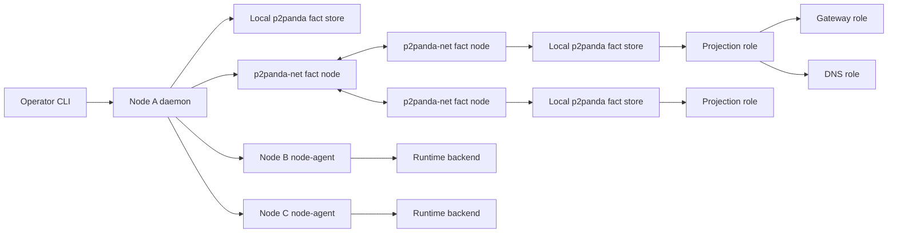

# Three-Server Product Vertical Plan

## Problem Frame

The MVP foundation has strong local proofs, but it is not yet something an
operator can ship to three servers and use. The current executable surface is
mostly `mvp-e2e` and process-role harness commands. The missing work is the
product vertical that composes the existing primitives into a real node:

- install one MVP binary on three Linux servers,
- initialize the first node,
- invite and join two more nodes,
- replicate membership and serving/deploy facts over the real p2panda-net path,
- apply enough networking for nodes to communicate,
- run a minimal deploy through real node-agent participants,
- keep steady-state service, gateway, DNS, and mesh behavior alive when the
  coordinator daemon is killed.

This plan intentionally deprioritizes more substrate hardening unless it is
required to make the three-server vertical work.

## Scope Boundary

In scope:

- a shippable MVP binary and role commands under `MVP/`,
- persistent node config/state layout,
- real `init`, `invite`, `join`, `status`, `daemon`, serving, and deploy command
  surfaces,
- p2panda-net-backed fact replication across three real hosts,
- node-agent request/reply services for deploy participation,
- a minimal runtime backend sufficient to run one stateless service,
- a Linux networking backend sufficient for the three-host proof,
- black-box three-host smoke tests that can be run repeatedly by an operator or
  CI runner with provisioned hosts.

Out of scope for this milestone:

- ACME production issuance,
- ZFS/volume production migration,
- Pingora/hickory-server production replacement work,
- cloud provisioning automation,
- 200-node real topology,
- active-member/quorum/partition-view semantics,
- broad packaging polish beyond a repeatable binary plus systemd-friendly
  process model.

## Success Criteria

The milestone is complete when a clean three-server run can prove:

1. Node A initializes a new island/cluster and persists its identity.
2. Nodes B and C join using invite tokens generated by node A.
3. All three nodes converge on the same membership projection from signed facts.
4. The deploy command can inspect node capacity through node-agent services.
5. The deploy command starts a trivial service on one node and publishes serving
   facts that gateway/DNS roles project.
6. A second deploy moves or updates the service and drains the old backend only
   after the route/serving commit is projected.
7. Killing the coordinator daemon does not stop the service, HTTP gateway, DNS
   role, or node-to-node service traffic from last applied state.
8. Restarting the coordinator can read durable local facts/projections and
   report or resume visible pending work.

## Current Grounding

Already available and proven locally:

- `mvp-bus`: NATS-shaped subjects, requests, no responders, queues, authority,
  and bridge semantics.
- `mvp-p2panda-facts`: signed fact store, persistent store, authority checks,
  conflict candidates, and sync/import semantics.
- `mvp-p2panda-transport`: p2panda-net fact-node transport with reliability
  diagnostics.
- `mvp-projection`, `mvp-routing`, `mvp-serving`: projection and last-good
  serving snapshot semantics.
- `mvp-deploy`, `mvp-deploy-p2panda`: commit-before-drain deploy coordinator
  and p2panda-backed deploy/serving facts.
- `mvp-mesh`: join/tombstone domain facts and WireGuard snapshot planning.
- `mvp-commands`: phased command primitive for command state bookkeeping.
- `mvp-e2e`: local contracts for bus, facts, deploy, serving, process roles,
  p2panda-net, membership, machine remove, volume transfer, and scale.

Main gaps:

- no installable product binary,
- no persistent product node state directory,
- no real multi-host join command path,
- no real node-agent participant process,
- no real runtime backend,
- no real Linux network apply proof,
- no black-box three-host E2E.

## High-Level Technical Design

This illustrates the intended approach and is directional guidance for review,
not implementation specification. The implementing agent should treat it as
context, not code to reproduce.

The product binary is the composition layer. Domain crates stay below it; they
must not learn about CLI parsing, process layout, systemd, or host provisioning.

## Key Technical Decisions

- Build a new MVP product binary instead of stretching `mvp-e2e`.
  `mvp-e2e` remains the proof harness; the product binary owns operator-facing
  commands and long-running roles.
- Keep the first deploy backend intentionally small. A stateless process or
  container backend is enough to prove deploy semantics. Volumes and ACME do not
  belong in the first three-host vertical.
- Prefer real p2panda-net for facts before adding more local harness behavior.
  If a fact does not cross hosts through the same transport the product uses,
  the proof does not count for this milestone.
- Make WireGuard a milestone decision, not an assumption. If the three servers
  have routable private addresses, the first deploy proof can use that and add
  kernel WireGuard in the next unit. If not, kernel WireGuard apply becomes a
  blocker before deploy.
- Treat daemon death as a required black-box proof. The steady-state appliers
  and serving roles must not depend on an in-memory coordinator handle.

## Implementation Units

### U1. Product Binary And State Layout

**Goal:** Create a shippable MVP executable surface with persistent node state
and role commands.

**Requirements:** Enables installable three-server operation and separates
product roles from the E2E harness.

**Dependencies:** None.

**Files:**

- `MVP/Cargo.toml`
- `MVP/node/Cargo.toml`
- `MVP/node/src/main.rs`
- `MVP/node/src/config.rs`
- `MVP/node/src/state.rs`
- `MVP/node/src/error.rs`
- `MVP/node/src/tests.rs`
- `MVP/e2e/src/three_server_product_contract.rs`

**Approach:** Add a new `mvp-node` crate with commands for `init`, `invite`,
`join`, `daemon`, `gateway`, `dns`, `status`, and `deploy`. Keep this crate as
composition/wiring only: config parsing, state paths, role startup, and calls
into existing domain crates. Persist node identity, island identity, p2panda
author key material, p2panda-net node info, WireGuard key material, fact store
path, projection path, and snapshot paths.

**Patterns to follow:** `MVP/e2e/src/process_role_harness.rs` for role
separation; `MVP/mesh/src/domain.rs` for typed node identity; `MVP/README.md`
for state/role non-negotiables.

**Test scenarios:**

- Happy path: `init` creates a complete state directory and `status` reports one
  initialized node with persisted IDs.
- Restart path: reopening the same state directory returns the same node id,
  island id, p2panda author, and network identity.
- Error path: running `join` against an already initialized node returns a
  structured error without mutating state.
- Error path: missing or corrupt state files produce structured diagnostics that
  name the failed state component.

**Verification:** A locally spawned product binary can initialize, restart, and
report status without using E2E-only configuration shortcuts.

### U2. Product Fact Node And Membership Join

**Goal:** Implement real multi-host `init`, `invite`, and `join` over the
p2panda-net fact-node path.

**Requirements:** Nodes can discover each other, exchange membership facts, and
project the same cluster membership.

**Dependencies:** U1.

**Files:**

- `MVP/node/src/membership.rs`
- `MVP/node/src/facts.rs`
- `MVP/node/src/net.rs`
- `MVP/node/src/tests.rs`
- `MVP/e2e/src/three_server_product_contract.rs`
- `MVP/e2e/src/three_server_harness.rs`

**Approach:** Wire `mvp-mesh` join facts into `mvp-p2panda-facts` and
`mvp-p2panda-transport`. `invite` should emit a token containing the island id,
bootstrap p2panda-net node info, invite id, secret, and expiry. `join` should
start or contact the local fact node, insert bootstrap peer info, validate the
invite through a bootstrap request path, write the joined fact locally, and
wait for membership projection evidence.

**Patterns to follow:** `MVP/mesh/src/invite.rs` for join/tombstone facts;
`MVP/e2e/src/p2panda_net_fact_node_contract.rs` for p2panda-net peer exchange;
`MVP/e2e/src/p2panda_auth_membership_contract.rs` for membership-backed fact
authority.

**Test scenarios:**

- Happy path: node A initializes, emits two invite tokens, nodes B and C join,
  and all three project exactly the same active node set.
- Expiry path: an expired invite fails before writing a node-joined fact.
- Tombstone path: a tombstoned node id cannot rejoin through a normal invite.
- Transport path: a joined node can restart and resync membership from a peer
  without the original process still holding in-memory state.

**Verification:** The local black-box contract uses product commands and
p2panda-net, not direct store import, to prove three membership projections
converge.

### U3. Long-Running Node Agent Services

**Goal:** Run node-local deploy participant services as part of the daemon role.

**Requirements:** The deploy coordinator can inspect capacity and issue
prepare/start/drain/stop requests to real node-agent handlers.

**Dependencies:** U1, U2.

**Files:**

- `MVP/node/src/daemon.rs`
- `MVP/node/src/node_agent.rs`
- `MVP/node/src/service_registry.rs`
- `MVP/node/src/tests.rs`
- `MVP/e2e/src/three_server_product_contract.rs`

**Approach:** Register node-agent service endpoints on daemon startup using the
existing bus subject shape: `node.<id>.capacity`,
`node.<id>.rpc.prepare_instance`, `node.<id>.rpc.start_instance`,
`node.<id>.rpc.drain_instance`, and `node.<id>.rpc.stop_instance`. Services
should read local runtime state, return typed replies, and expose visible
failure variants. The daemon can coordinate mutations, but the runtime state
needed to keep already-started services alive must be owned below it.

**Patterns to follow:** deploy participant handlers in
`MVP/e2e/src/deploy_commit_drain_contract.rs`; actor boundaries in
`MVP/bus/src/actor.rs`; deploy request types in `MVP/deploy/src/wire.rs`.

**Test scenarios:**

- Happy path: a running node daemon responds to capacity, prepare, start, drain,
  and stop requests with typed replies.
- No responder path: targeting a stopped node-agent returns the existing
  bus-level no-responder or timeout error without writing deploy facts.
- Restart path: restarting the daemon recreates service registrations and can
  report already-running local instances.
- Authorization path: a principal without node RPC permission cannot invoke
  node-agent handlers.

**Verification:** Deploy participant behavior is exercised through product
daemon services, not test-local handler closures.

### U4. Minimal Runtime Backend

**Goal:** Provide one real backend that can run a trivial stateless service on a
Linux host.

**Requirements:** The three-server deploy proof can start, readiness-check,
drain, and stop a real process or container.

**Dependencies:** U3.

**Files:**

- `MVP/runtime/Cargo.toml`
- `MVP/runtime/src/lib.rs`
- `MVP/runtime/src/process.rs`
- `MVP/runtime/src/model.rs`
- `MVP/runtime/src/error.rs`
- `MVP/runtime/src/tests.rs`
- `MVP/node/src/node_agent.rs`
- `MVP/e2e/src/three_server_product_contract.rs`

**Approach:** Add the narrowest runtime trait the node-agent needs:
inspect capacity, prepare instance, start instance, readiness, drain, stop, and
list local instances by labels. The first backend should run a local command or
container with explicit labels/state files. Avoid pulling in the old runtime
model until the three-server proof shows the new shape needs it.

**Patterns to follow:** deploy wire/domain types in `MVP/deploy`; process-role
supervision and orphan cleanup patterns in `MVP/e2e/src/process_role_harness.rs`.

**Test scenarios:**

- Happy path: prepare/start launches a test HTTP service and readiness returns
  ready.
- Idempotency path: repeating prepare/start for the same instance returns the
  existing instance state rather than launching duplicates.
- Drain path: drain marks the instance unavailable for new routing but does not
  kill it immediately.
- Stop path: stop terminates the instance and list no longer reports it active.
- Crash/restart path: a restarted node-agent can discover an already-running
  labeled instance.

**Verification:** A real local process receives traffic before and after daemon
restart.

### U5. Linux Networking Backend

**Goal:** Make node-to-node service connectivity real enough for three servers.

**Requirements:** Services on different nodes can communicate after join, and
the gateway can route to backend addresses produced by projection.

**Dependencies:** U2, U4.

**Files:**

- `MVP/mesh/src/wireguard.rs`
- `MVP/mesh/src/linux.rs`
- `MVP/mesh/src/tests.rs`
- `MVP/node/src/networking.rs`
- `MVP/e2e/src/three_server_product_contract.rs`

**Approach:** Implement a Linux `WireGuardBackend` if the test environment
needs private overlay networking. If three-server proof hosts already have
routable private addresses, first add an explicit `HostNetworkBackend` that
records node reachability and route endpoints without kernel mutation, then
ship WireGuard apply as the next unit. The plan must make this choice visible
in the slice report because it affects how strong the networking proof is.

**Patterns to follow:** `MVP/mesh/src/wireguard.rs` for snapshot equality and
typed peer fields; existing runtime-backend WireGuard code only as reference,
not a port target.

**Test scenarios:**

- Happy path: three active node facts produce an apply snapshot with exactly the
  expected peers for each node.
- Apply path: Linux backend applies or validates a peer snapshot and reports the
  resulting interface state.
- Tombstone path: tombstoned nodes are removed from future apply snapshots.
- Daemon-death path: already-applied networking continues to pass traffic when
  the coordinator daemon is killed.

**Verification:** A service request can cross from one node to another using the
networking mode selected for the three-host proof.

### U6. Product Deploy Command

**Goal:** Wire operator `deploy` to the existing deploy coordinator, product
fact writers, node-agent services, projection, and serving reload path.

**Requirements:** Operators can deploy a simple manifest to the three-node
cluster through product commands.

**Dependencies:** U2, U3, U4, U5.

**Files:**

- `MVP/node/src/deploy.rs`
- `MVP/node/src/manifest.rs`
- `MVP/node/src/projection.rs`
- `MVP/node/src/tests.rs`
- `MVP/deploy/src/domain.rs`
- `MVP/e2e/src/three_server_product_contract.rs`

**Approach:** Keep the command surface intentionally small: one service, one
revision, one or more candidate nodes, readiness URL or command, and optional
old backend drain. Convert the manifest into existing `DeployManifest` and
`ServingCommitPlan` values. Use p2panda-backed deploy and serving fact writers.
Require projection catch-up before finishing cleanup, preserving the existing
commit-before-drain invariant.

**Patterns to follow:** `MVP/deploy/src/coordinator.rs`; p2panda deploy restart
recovery in `MVP/e2e/src/deploy_restart_recovery_contract.rs`; serving fact
writer in `MVP/routing-p2panda/src/lib.rs`.

**Test scenarios:**

- Happy path: deploy starts a trivial service on node B, writes serving facts,
  projects gateway/DNS snapshots, and gateway routes traffic.
- Update path: second deploy starts a new backend, projects route change, then
  drains/stops the old backend.
- Conflict path: a concurrent conflicting deploy fact returns a structured
  conflict with principal and fact key.
- No capacity path: if no node reports capacity, deploy fails before writing
  serving commit facts.
- Daemon restart path: restart after serving commit but before cleanup resumes
  cleanup from durable facts.

**Verification:** The deploy path uses real product node-agent services and a
real runtime backend, with no E2E-local participant closures.

### U7. Serving Roles From Product State

**Goal:** Run gateway and DNS roles from product state and snapshots, not from
test-only process-role wiring.

**Requirements:** Gateway and DNS keep serving last-good state while daemon or
projection roles are restarted.

**Dependencies:** U1, U2, U6.

**Files:**

- `MVP/node/src/serving.rs`
- `MVP/node/src/gateway.rs`
- `MVP/node/src/dns.rs`
- `MVP/serving/src/actor.rs`
- `MVP/serving/src/http_gateway.rs`
- `MVP/serving/src/dns_server.rs`
- `MVP/e2e/src/three_server_product_contract.rs`

**Approach:** Reuse the existing `mvp-serving` actor and placeholder wire
servers through product commands. Do not polish placeholder HTTP/DNS internals
unless their interfaces block the three-server proof. The durable boundary is
snapshot loading, last-good state, reload validation, and status reporting.

**Patterns to follow:** `MVP/e2e/src/p2panda_net_process_serving_contract.rs`
and `MVP/e2e/src/wire_serving_contract.rs`.

**Test scenarios:**

- Happy path: gateway and DNS roles start from persisted snapshot paths and
  report readiness.
- Reload path: new serving facts project to snapshots and serving roles observe
  or accept reload without losing old state.
- Daemon-death path: killing the daemon leaves HTTP and DNS serving last-good
  values.
- Bad snapshot path: invalid snapshot content is rejected while last-good state
  remains available.

**Verification:** Gateway and DNS are started as product binary roles in the
three-server contract.

### U8. Three-Server Black-Box Harness

**Goal:** Add the acceptance harness that proves the product vertical outside
the in-process semantic harness.

**Requirements:** The milestone must be repeatable and falsifiable on three
servers.

**Dependencies:** U1, U2, U3, U4, U5, U6, U7.

**Files:**

- `MVP/e2e/src/three_server_product_contract.rs`
- `MVP/e2e/src/three_server_harness.rs`
- `MVP/e2e/src/main.rs`
- `MVP/scripts/three-server-smoke.sh`
- `MVP/README.md`
- `MVP/e2e-proof-plan.md`

**Approach:** Support two modes: local multi-process smoke for inner-loop
coverage and remote-host smoke driven by environment variables or a host file.
The harness should install or point to the built binary, allocate per-host state
dirs, run product commands over SSH or a clearly abstracted command runner, and
collect JSON proof artifacts. Keep provisioning out of scope; assume reachable
Linux hosts with the binary or SSH copy rights.

**Patterns to follow:** existing `mvp-e2e` scenario registry and JSON proof
artifacts; process role cleanup in `MVP/e2e/src/process_role_harness.rs`;
metrics style in `MVP/e2e/src/metrics.rs`.

**Test scenarios:**

- Happy path: three fresh hosts initialize/join, converge membership, deploy a
  service, and route traffic.
- Restart path: restart all product roles and verify membership, projection, and
  serving recover from local durable state.
- Daemon kill path: kill the coordinator daemon and verify service, gateway,
  DNS, and node-to-node connectivity continue.
- Failure path: stop one node before deploy and verify the deploy result reports
  visible nodes at decision time.
- Cleanup path: test harness tears down processes/state it created or reports
  exact cleanup instructions.

**Verification:** A single documented smoke command produces a JSON report with
membership convergence, deploy result, serving response, daemon-death response,
and cleanup status.

## Delivery Sequence

Recommended slice order:

1. U1: product binary and persistent state.
2. U2: real product join and membership convergence.
3. U3 plus U4: node-agent and minimal runtime backend.
4. U5: networking decision and Linux/host-network backend.
5. U6 plus U7: deploy command and product serving roles.
6. U8: black-box local and remote three-server harness.

Do not split off further code-quality-only slices until the three-server proof
exists, unless a failure directly blocks the vertical.

## Risk Analysis

- **p2panda-net transport flakiness:** Use existing diagnostics from Slice 046
  in product status and harness reports. Do not hide zero-import or stream
  refresh failures behind retries without surfacing them.
- **Runtime backend scope creep:** The first backend must run one trivial
  service. Volumes, image building, secrets, ACME, and rollback are deferred.
- **WireGuard uncertainty:** Decide early whether the smoke requires kernel
  WireGuard. If yes, the Linux backend is a blocker; if no, record that the
  first networking proof uses host networking and keep WireGuard as the next
  slice.
- **Harness becoming the product again:** Product commands must live in
  `mvp-node`; `mvp-e2e` should only drive them and assert outcomes.
- **Semantic leverage regression:** If product deploy requires feature-local
  sync/storage/authority code, stop and strengthen the primitive instead of
  copying harness glue.

## Documentation Plan

Update these docs as implementation lands:

- `MVP/README.md`: how to build and run the MVP product binary.
- `MVP/e2e-proof-plan.md`: mark the three-server product contract and metrics.
- `MVP/primitive-decisions.md`: record runtime backend, networking backend, and
  product binary decisions.
- `MVP/design-notes/semantic-leverage-loc.md`: report product LOC vs substrate
  LOC after deploy works on real hosts.

## Deferred Follow-Up Work

- Replace placeholder HTTP serving with Pingora if the product interface has
  proven itself.
- Replace placeholder DNS serving with hickory-server if the product interface
  has proven itself.
- Add ACME issuance on the product vertical.
- Add volume/ZFS deploy support.
- Add active-member or partition-view evidence at command entry.
- Add production packaging and CI provisioning.
- Add larger real-host topology tests after the three-server proof is stable.
