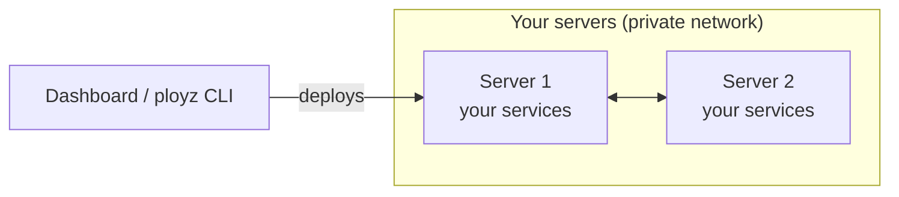

<p align="center">
  
</p>

<h1 align="center">Ployz</h1>

<p align="center">
  Git push deploys and preview environments, on servers you own.
  <br>
  <a href="https://ployz.dev">Website</a> · <a href="#quick-start">Quick start</a> · <a href="#self-hosting-the-dashboard">Self-host</a>
</p>

Ployz turns any Linux server into a deployment platform. It builds your app, gives it an
https address, runs your databases and workers next to it, and spins up an environment for
every pull request. Start with one server and add more when you need them.

## Features

- **Git push to deploy.** Every push to your main branch builds and ships.
- **Preview environments.** Every pull request gets its own copy of your app at its own https address.
- **Your whole app on one canvas.** Web, workers, databases, variables and logs in one dashboard.
- **Review before you deploy.** Dashboard edits are staged until you press Deploy.
- **No Dockerfile needed.** Ployz detects and builds Node, Python, Ruby, PHP, Go, Rust, Java, Elixir
  and more. It can also use your Dockerfile or run any Docker image.
- **HTTPS by default.** Every app gets an https address on its first deploy. Custom domains are supported.
- **More servers when you need them.** Add a server with one command. Servers share a private
  network, and a service can run up to 50 replicas across them. No Kubernetes.
- **Built for coding agents.** Anything the dashboard does, the `ployz` CLI does too, with JSON output.
- **No lock-in.** Your apps keep running on your servers if Ployz Cloud goes away. The engine
  and the dashboard are both open source.

## Quick start

You need a Linux server you can reach as root over SSH.

1. Install the CLI:

   ```sh
   curl -fsSL https://ployz.sh | sh
   # or
   brew install getployz/ployz/ployz
   ```

2. Sign in to Ployz Cloud:

   ```sh
   ployz login
   ```

3. From your app's directory, point Ployz at your server:

   ```sh
   ployz up --server root@your-server
   ```

   Ployz installs itself on the server, builds your app and prints its https address.

To deploy on every push and get preview environments, connect your repository with
`ployz github connect` or from the dashboard at [ployz.dev](https://ployz.dev).

Using a coding agent? Run `ployz setup agent` to teach it the CLI.

## How it works



Each server runs a small Ployz daemon alongside Docker. The servers form a private network and
keep each other up to date, so there is no central control server to run or lose. The dashboard
and the CLI tell your servers what to run; once deployed, your apps don't depend on either.

Ployz is built on proven parts: Docker for containers, WireGuard for the private network and Caddy
for https.

## Pricing

Ployz is free on your own servers. [Ployz Cloud](https://ployz.dev) charges $9 a month if you
want custom domains. Your hosting provider bills you for the servers.

## Self-hosting the dashboard

You can run the dashboard yourself instead of using Ployz Cloud. See
[dashboard/README.md](dashboard/README.md#self-host).

## Status

Ployz is young and changing quickly. Good to know before you move a production app:

- **You look after the server's OS.** Ployz doesn't install OS updates.
- **No database backups yet.** Keep your own dumps off the server, or keep your managed database
  and connect to it with a variable.
- **No automatic failover.** If a server dies, the services on it stop. Replicas on other servers
  keep running.
- **No Docker Compose files and no alerts.** Use an uptime monitor for alerts.

Planned: snapshots, backups and rollbacks, and moving a database to a bigger server without downtime.

## Contributing

Bug reports and feature requests go in [GitHub Issues](https://github.com/getployz/ployz/issues).

The repository has two projects: [core/](core/README.md) (the engine, CLI and daemon, in Rust)
and [dashboard/](dashboard/README.md) (Ployz Cloud, in TypeScript). Each README explains how to
build and test it.

## License

The engine in `core/` is [Apache-2.0](core/LICENSE). The dashboard in `dashboard/` is
[AGPL-3.0](dashboard/LICENSE).
