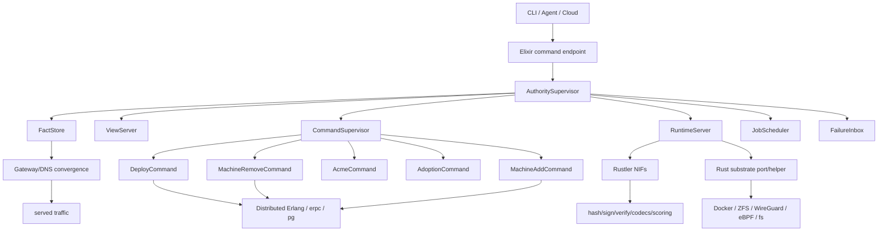
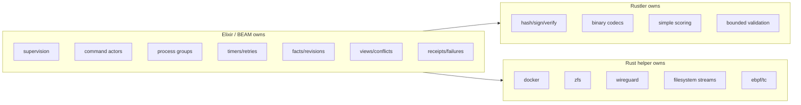

# Ployz v2 BEAM-First Rewrite

> Superseded by `docs/brainstorms/2026-05-16-ployz-v2-beam-mnesia-mvp.md`,
> which replaces the custom fact-store/adoption framing with the smaller
> Distributed Erlang + `:pg` + Mnesia architecture.

## Summary

Ployz v2 is a full rewrite that makes Elixir/OTP the control plane and keeps
Rust only for substrate/native work. The v2 target is a dead-simple happy path:
equal nodes, machine add/remove, manifest deploys with revisions, ACME, and
eventually consistent gateway/DNS.

---

## Problem Frame

Ployz v1 accumulated control-plane machinery while trying to make a small
cluster feel explicit and safe: NATS buckets, store facades, broad peer RPC,
pre-deploy/pre-commit phases, status tables, background-ish cleanup, and many
variant paths. That complexity fights the product thesis.

The rewrite should not preserve the old substrate behind cleaner wrappers. The
point is to delete most of it by leaning into OTP: supervisors, actors,
registries, process groups, timers, retries, receipts, and direct node
messaging.

---

## Actors

- A1. Operator: runs `machine add`, `machine remove`, and `deploy`.
- A2. Ployz node: runs the same BEAM daemon as every other node.
- A3. Authority process: owns membership and deploy revision facts.
- A4. Rust substrate helper: performs Docker, ZFS, WireGuard, filesystem, and
  privileged native work.
- A5. Gateway/DNS process: serves eventually consistent routing and certificate
  state from committed revisions.

---

## Architecture Shape





---

## Proposed Codebase Tree

```text
ployz/
  mix.exs
  config/
    config.exs
    runtime.exs

  apps/
    ployz/
      lib/ployz/application.ex
      lib/ployz/supervisor.ex
      lib/ployz/release.ex

    ployz_cluster/
      lib/ployz_cluster/supervisor.ex
      lib/ployz_cluster/membership.ex
      lib/ployz_cluster/node_registry.ex
      lib/ployz_cluster/process_groups.ex
      lib/ployz_cluster/remote.ex

    ployz_authority/
      lib/ployz_authority/supervisor.ex
      lib/ployz_authority/fact_store.ex
      lib/ployz_authority/revisions.ex
      lib/ployz_authority/view_server.ex
      lib/ployz_authority/failure_inbox.ex

    ployz_commands/
      lib/ployz_commands/supervisor.ex
      lib/ployz_commands/command.ex
      lib/ployz_commands/transcript.ex
      lib/ployz_commands/machine_add.ex
      lib/ployz_commands/machine_remove.ex
      lib/ployz_commands/deploy.ex
      lib/ployz_commands/acme.ex
      lib/ployz_commands/adopt.ex

    ployz_manifest/
      lib/ployz_manifest/manifest.ex
      lib/ployz_manifest/parser.ex
      lib/ployz_manifest/validator.ex

    ployz_runtime/
      lib/ployz_runtime/supervisor.ex
      lib/ployz_runtime/server.ex
      lib/ployz_runtime/adoption.ex
      lib/ployz_runtime/docker.ex
      lib/ployz_runtime/zfs.ex
      lib/ployz_runtime/wireguard.ex

    ployz_gateway/
      lib/ployz_gateway/supervisor.ex
      lib/ployz_gateway/routes.ex
      lib/ployz_gateway/dns.ex
      lib/ployz_gateway/certs.ex

    ployz_native/
      lib/ployz_native.ex
      native/ployz_native/
        Cargo.toml
        src/lib.rs

    ployz_substrate/
      lib/ployz_substrate/supervisor.ex
      lib/ployz_substrate/port.ex
      native/ployz_substrate_helper/
        Cargo.toml
        src/main.rs

    ployz_cli/
      lib/ployz_cli/main.ex
      lib/ployz_cli/output.ex
```

---

## Key Flows

- F1. Machine add
  - **Trigger:** Operator runs `machine add`.
  - **Actors:** A1, A2, A3
  - **Steps:** Existing node invites the new node; the new node joins BEAM
    distribution; authority writes a membership revision; every node eventually
    sees the new member.
  - **Outcome:** The node can receive deploy work and participate as an equal
    peer.
  - **Covered by:** R1, R2, R5

- F2. Machine remove
  - **Trigger:** Operator runs `machine remove`.
  - **Actors:** A1, A2, A3, A5
  - **Steps:** Authority writes a removal revision; live process groups stop
    selecting the removed node; gateway/DNS eventually stop routing to it; the
    node drops out if reachable, or is ignored if unreachable.
  - **Outcome:** The removed node is no longer part of committed membership.
  - **Covered by:** R1, R3, R7

- F3. Deploy manifest
  - **Trigger:** Operator runs `deploy <manifest>`.
  - **Actors:** A1, A2, A3, A4, A5
  - **Steps:** Manifest is parsed; reachable eligible nodes are asked to run the
    revision; Rust helper starts substrate work; authority commits a new deploy
    revision; gateway/DNS converge.
  - **Outcome:** The latest committed revision receives traffic.
  - **Covered by:** R4, R5, R6, R7

- F4. ACME issuance
  - **Trigger:** Deploy or explicit cert command needs a certificate.
  - **Actors:** A3, A4, A5
  - **Steps:** Authority starts an ACME command; gateway serves challenge state;
    cert material is written as a fact; gateway eventually serves the cert.
  - **Outcome:** Routes can serve TLS for the committed revision.
  - **Covered by:** R8, R9

---

## Requirements

**Core product**
- R1. Every node must run the same BEAM daemon and be capable of accepting
  operator commands.
- R2. `machine add` must add a reachable node through a single happy path and
  write a membership revision.
- R3. `machine remove` must remove a node by writing a membership revision; the
  removed node may simply drop out or be ignored when unreachable.
- R4. `deploy` must accept one manifest format and publish a new deploy revision.
- R5. Deploy revisions must be the commit boundary for traffic and operator
  status.
- R6. v2 must support one simple placement path: choose from reachable eligible
  nodes and start the revision there.
- R7. Gateway and DNS must converge eventually from committed membership and
  deploy revisions; brief lag is acceptable.
- R8. v2 must issue ACME certificates for routes in the happy path.
- R9. Certificate state must be tied to committed route/revision facts, not a
  separate controller-shaped queue.

**Architecture**
- R10. Elixir/OTP must own orchestration, supervision, command lifecycle,
  membership view, facts/revisions, timers, retries, receipts, and gateway/DNS
  convergence.
- R11. Rust must own only substrate/native work: Docker, ZFS, WireGuard,
  filesystem/eBPF, codecs, crypto, and bounded validation/scoring.
- R12. Rustler NIFs must be limited to bounded native helpers; blocking,
  privileged, streaming, or crash-prone work must run in supervised Rust
  helpers/ports.
- R13. v2 should lean into Erlang distribution, process groups, monitors, and
  supervised processes rather than rebuilding those concepts in Rust.
- R14. Durable truth must be small: membership revisions, deploy revisions,
  command receipts, and certificate facts.
- R15. Runtime state must be adopted from local reality on boot instead of
  reconciled by a standing desired-state controller.

**Manifest**
- R16. v2 must define a tiny Ployz-native manifest, not a Compose-compatible
  surface.
- R17. The first manifest shape must cover app name, services, image or build
  source, env/secrets references, ports, routes/domains, ACME enablement, and
  simple named volumes.
- R18. The first manifest shape must exclude advanced placement, deploy phases,
  multiple source modes, branch/promotion policy, service portals, provider
  integrations, and compatibility shims.

**Deletion / simplification**
- R19. v2 must drop pre-deploy/pre-commit machinery from the product model.
- R20. v2 must drop HA/DR/quorum, advanced authority promotion, multi-region
  policy, and complex placement for the first version.
- R21. v2 must not carry forward NATS buckets, broad store facades, or broad
  public-request-shaped node RPC as core architecture.
- R22. v2 must prefer manual, visible recovery over autonomous self-healing.
- R23. v2 must optimize for the smallest end-to-end working system, not
  compatibility with v1 internals.

---

## Acceptance Examples

- AE1. **Covers R1, R2.** Given one running node and one fresh node, when the
  operator runs `machine add`, the fresh node joins and the authority publishes
  a new membership revision.
- AE2. **Covers R3, R7.** Given three nodes and one running service, when the
  operator removes one node, new routing eventually excludes it and future
  deploys do not select it.
- AE3. **Covers R4, R5, R6, R16, R17.** Given a valid manifest and at least one reachable
  node, when the operator deploys it, Ployz starts the workload and commits a new
  deploy revision.
- AE4. **Covers R7, R8, R9.** Given a deployed route that needs TLS, when ACME
  succeeds, gateway/DNS eventually serve the certificate for the committed
  revision.
- AE5. **Covers R12.** Given Docker or ZFS hangs, the BEAM daemon remains alive
  and reports helper failure rather than being blocked by a NIF.

---

## Success Criteria

- A small cluster can add nodes, remove nodes, deploy a manifest, issue certs,
  and serve traffic using the v2 model.
- A removed node can disappear without forcing global repair machinery.
- A deploy has one obvious committed revision and one status story.
- Gateway/DNS lag is visible but not treated as deploy failure.
- The v2 codebase is dramatically smaller than v1 and has fewer product nouns.
- A downstream planner can build a first milestone without reintroducing v1's
  store, pre-commit, or reconciliation complexity.

---

## Scope Boundaries

### Deferred for later

- HA, quorum, DR, automatic failover, and authority promotion.
- Sophisticated placement, bin-packing, resource scoring, and policy knobs.
- Multiple manifest dialects or compatibility with every existing v1 manifest
  option.
- Advanced branch/preview/promote workflows.
- Deep migration compatibility from v1 state.
- Distributed process relocation beyond what is needed for simple node
  membership and RPC.

### Outside this product's identity

- Rebuilding Kubernetes-style controllers on the BEAM.
- Keeping NATS as the product's control-plane store.
- Hiding a Rust daemon behind an Elixir shell.
- Moving Docker/ZFS/WireGuard orchestration fully into Rust.
- Making every failure self-heal in the background.

---

## Key Decisions

- BEAM owns the control plane because OTP already provides the supervision,
  actor, timer, monitor, and process-group model Ployz kept rebuilding.
- Rust remains substrate-only because blocking native work should be isolated
  behind ports/helpers, not embedded into the VM.
- Revisions remain because they are the simple commit boundary for membership
  and deploys.
- v2 gets a tiny Ployz-native manifest because Compose compatibility and v1
  manifest compatibility would reintroduce option-surface complexity.
- Gateway/DNS are eventually consistent because traffic convergence does not
  need the same commit semantics as deploy revision truth.
- The first version optimizes for one path that works rather than many options
  that make the architecture harder to reason about.

---

## Dependencies / Assumptions

- Erlang distribution can run acceptably over the Ployz WireGuard mesh for the
  intended small-cluster scale.
- A single authority/fact store per cluster is enough for the first v2 target.
- Manual recovery is acceptable for the first release when commands fail after
  partial substrate work.
- Existing Rust substrate code can be reused by extracting or wrapping the
  low-level Docker/ZFS/WireGuard pieces, not by preserving Rust orchestration.

---

## Outstanding Questions

### Deferred to Planning

- [Affects R13][Needs research] Which Erlang distribution setup is simplest and
  safest over WireGuard for single-node, LAN, and small WAN clusters?
- [Affects R14][Technical] Should the first fact store be plain files, CubDB, or
  another BEAM-native local store?
- [Affects R12][Technical] Which existing Rust crates can be retained as
  substrate helpers without dragging v1 orchestration across the boundary?
