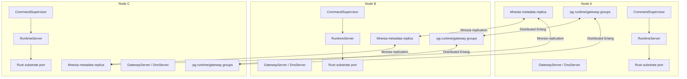
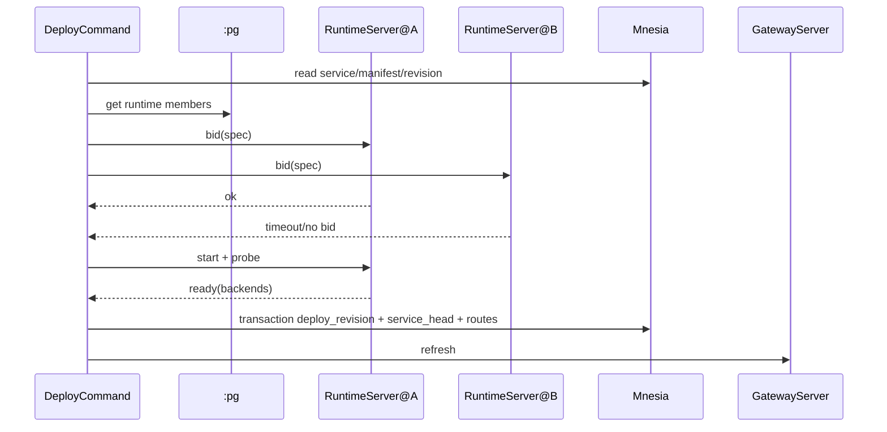

# Ployz v2 BEAM/Mnesia MVP

## Goal

Build a BEAM-first Ployz v2 MVP.

Do not preserve v1 architecture. Use the BEAM runtime as the simple distributed
system instead of rebuilding one.

The MVP must support:

- machine add
- machine remove
- deploy from a tiny native manifest
- committed deploy revisions
- ZFS volume migration
- ACME issuance
- stale runtime classification
- eventually consistent gateway/DNS from latest committed revision

The code should optimize for the happy path and delete complexity. No
pre-deploy/pre-commit model, no custom fact sync, no Chitchat, no custom
distributed KV, no controllers, no reconcilers, no durable job queues, no broad
store facades, and no v1 compatibility layer.

---

## Architecture

The small version:

```text
Distributed Erlang = live node messaging
:pg                = live role groups
Mnesia             = tiny replicated metadata store
GenServer/Task     = commands
Rust port          = Docker/ZFS/WireGuard
Gateway/DNS        = read latest committed revision
```



Every node runs the same code. Every node can accept commands. Every node can
store metadata. There is no god node.

Mnesia stores committed cluster metadata. `:pg` tells commands who is alive
right now. RPC proves what a node can actually do.

---

## What Each Layer Owns

**BEAM / OTP**

- supervision
- command processes
- Distributed Erlang node messaging
- `:pg` live runtime/gateway groups
- Mnesia schema, transactions, and replicated metadata
- timers, leases, retries, and visible command receipts
- gateway/DNS refresh orchestration

**Rust port/helper**

- Docker start/stop/inspect/pull
- ZFS snapshot/send/recv/verify
- WireGuard apply/read
- filesystem and privileged OS work
- eBPF/tc work if needed

**Rustler**

- bounded helpers only: hashing, signing, verification, codecs, scoring
- no blocking Docker/ZFS/WireGuard calls
- no long-running loops
- no hidden daemon inside the VM

---

## Mnesia Tables

Use `disc_copies` on every node for tiny metadata tables only.

```text
machines
  machine_id
  roles
  state        # active | draining | removed
  public_key
  joined_at

invites
  invite_id
  token_hash
  state        # issued | redeemed | expired
  issued_by
  redeemed_by
  expires_at

commands
  command_id
  kind
  status       # running | committed | failed
  result
  started_at
  finished_at

services
  name
  manifest
  current_revision

deploy_revisions
  service
  revision
  manifest_hash
  placements
  routes
  status       # committed | failed

service_heads
  service
  revision

routes
  host
  service
  revision
  backends
  cert_ref

certs
  hostname
  cert_ref
  key_ref
  expires_at
  revision

volumes
  name
  generation
  primary_node
  dataset
  snapshot

leases
  resource
  owner
  token
  expires_at
```

Do not store runtime health, logs, observations, or app data in Mnesia.

---

## Proposed Codebase Tree

```text
ployz/
  mix.exs
  config/
    config.exs
    runtime.exs

  lib/
    mix/tasks/ployz.ex
    ployz/
      application.ex
      supervisor.ex
      auth.ex
      command_endpoint.ex
      cluster/
      metadata/
      commands/
      manifest/
      runtime/
      gateway/
      substrate/

  crates/
    ployz-substrate-helper/
```

---

## Core Flows

### Machine Add

```text
machine add:
  1. new node connects over WireGuard
  2. new node joins Distributed Erlang
  3. sponsor writes machines[new] = joining
  4. new node receives Mnesia table copies
  5. new node joins :pg runtime/gateway/store groups
  6. sponsor marks machines[new] = active
```

### Machine Remove

```text
machine remove:
  1. mark machines[target] = draining or removed in Mnesia
  2. future deploys ignore it
  3. routes no longer include it after remove/deploy refresh
  4. if reachable, tell it to leave
  5. if unreachable, ignore it
```

A removed node that returns is no longer eligible for scheduling or routing. If
it still has old containers, they are stale local runtime state, not cluster
truth.

### Deploy



Offline nodes are absent from `:pg` or fail RPC. They give no bid and are not
selected.

### ZFS Volume Migration

```text
migrate volume:
  1. source snapshot via Rust port
  2. zfs send/recv via Rust port
  3. verify destination snapshot
  4. stop source instance
  5. start destination instance
  6. transaction:
       volumes[name].generation += 1
       volumes[name].primary_node = destination
       deploy_revisions[new_revision]
       service_heads[service] = new_revision
```

If the source dies mid-transfer, no volume generation is committed and no deploy
revision is promoted.

### ACME

No durable cert queue. Use one Mnesia lease row per hostname. The first
implementation may expose this as an explicit `cert issue` command; scheduled
renewal can be added later as a visible timer that runs the same command path.

```text
cert issue:
  1. try acquire leases["acme:<hostname>"] in a Mnesia transaction
  2. if won, run AcmeCommand
  3. write certs[hostname] after success
  4. gateways refresh from committed route/cert rows
```

If the issuer dies, the lease expires and another node can retry.

### Stale Runtime State

```text
runtime inspect:
  1. inspect local Docker/ZFS when asked
  2. compare local resources with service_heads and volumes
  3. report current, stale, unknown, or removed-machine resources
  4. do not mutate anything
```

Old containers are allowed to keep running. They are not proof of current deploy
truth, and gateways should not route to stale revisions once routes refresh.

The next explicit deploy/remove operation may schedule stale namespace cleanup
as part of that command. There is no boot cleanup pass and no background
reconciler.

---

## Requirements

- R1. Every node runs the same BEAM daemon.
- R2. Every node can accept operator commands.
- R3. Distributed Erlang over WireGuard is the node messaging layer.
- R4. `:pg` is the live role/group mechanism.
- R5. Mnesia with `disc_copies` on every node is the replicated metadata store.
- R6. Mnesia stores only tiny committed metadata, not runtime health or app data.
- R7. `machine add` joins a node to the BEAM cluster, writes a pre-active
  joining row, copies Mnesia tables, observes live role readiness, and only then
  writes an active machine row.
- R8. `machine remove` marks a node draining/removed; future deploys ignore it.
- R9. Deploy parses one tiny Ployz-native manifest format.
- R10. Deploy chooses from reachable active `:pg` runtime nodes.
- R11. Deploy commits `deploy_revisions`, `service_heads`, and `routes` in one
  Mnesia transaction after start/probe succeeds.
- R12. Gateway/DNS read latest committed route rows and converge eventually.
- R13. ZFS migration commits a new volume generation only after destination
  verification.
- R14. ACME uses a Mnesia lease row per hostname, not a durable job queue.
- R15. Offline nodes are absent from `:pg` or fail RPC and are not selected.
- R16. Local runtime inspection reports stale/unknown resources without mutating
  them.
- R17. The next explicit deploy/remove operation may schedule stale namespace
  cleanup.
- R18. Rust ports/helpers own Docker, ZFS, WireGuard, filesystem, and eBPF work.
- R19. Rustler is limited to bounded helpers.

---

## Hard Code-Quality Constraints

- No command should have more than one obvious process/module.
- No hidden background state mutation.
- No state machine spread across many layers.
- No duplicate representations of deploy truth.
- No runtime health stored as durable truth.
- No boot-time cleanup pass.
- No compatibility with v1 internals.
- Prefer direct GenServer/Task code over abstractions.

---

## Acceptance Tests

- A. Three nodes deploy one service and a gateway serves it.
- B. One node offline during deploy: deploy succeeds without selecting it.
- C. Node returns after old revision: old containers keep running but are
  reported as stale.
- D. ZFS migration succeeds and commits a new volume generation.
- E. ZFS migration interrupted before verify: no volume promotion is committed.
- F. ACME issuer dies mid-command: lease expires and retry can succeed.
- G. Next deploy/remove command schedules stale namespace cleanup when the target
  node is reachable.

---

## Explicit Non-Goals

- No custom fact sync.
- No Chitchat.
- No custom distributed KV.
- No immutable fact DAG.
- No "every node full fact log" ceremony.
- No controllers or reconcilers.
- No boot-time cleanup pass.
- No durable job queues.
- No broad store facades.
- No NATS-shaped control-plane abstractions.
- No pre-deploy/pre-commit machinery.
- No v1 internal compatibility.

---

## HA Semantics

For the MVP:

- One node means dev/small server mode, not HA.
- Two nodes means replicated-ish metadata, not real HA.
- Three nodes is the first serious shape for majority-style critical writes.

If the cluster cannot make a safe metadata write, the command fails visibly.
That is better than conflict algebra or fake availability.
