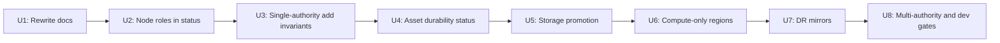

# feat: Authority and region roadmap

## Summary

Build the multi-region story in layers: first make the single-authority system legible, then add explicit storage durability, then add compute-only regions, and only later add DR mirrors, multi-authority ownership, and local dev authorities.

The near-term gain is clarity without fake safety: an operator or agent can see which nodes are control-plane disposable, which NATS assets are source-of-truth, and what will be lost if a machine or region dies.

## Problem Frame

Ployz wants the Uncloud feeling that every server can participate and be an entry point, but not Uncloud's AP/CRDT global truth model. Ployz should use NATS as the long-term substrate while keeping authority explicit.

An authority is the active durable owner for a slice of control-plane truth. A region is a placement, latency, routing, and failure-domain label. Durability is not authority: R=3/R=5 replicas make one authority safer; they do not create regional ownership.

The roadmap must preserve the product shape in `VISION.md`: small orchestration kernel, no invisible reconcilers, no inferred liveness in stored truth, foreground mutations fail fast, and failures have an audience.

## Requirements

R1. Replace the current NATS doc sprawl with one concise authority/region roadmap.

R2. Make each node's role, failure impact, and control-plane disposability visible at status time.

R3. Make each NATS stream/KV role, durability, and loss impact visible at status time.

R4. Keep first install simple: one cloud machine starts as `auth-default`, R=1, not control-plane disposable.

R5. Adding machines must not silently change authority, quorum, or storage durability.

R6. Storage durability upgrades are explicit: promote selected candidates into R=3/R=5 replicas for one authority.

R7. Compute-only regions are valid: workloads and gateways can be global while durable writes stay owned by `auth-default`.

R8. Remote mutations never queue. If the target authority is unreachable, the operation fails now.

R9. DR mirrors, regional authorities, and dev authorities are gated by real autonomy or loss-reduction benefits, not by topology aesthetics.

## Assumptions

- No upstream `docs/brainstorms/*-requirements.md` or prior `docs/plans/` plan exists for this topic.
- NATS JetStream remains the durable event/state substrate.
- NATS supercluster, gateways, leaf nodes, streams, mirrors, and promotion are implementation tools, not user-facing product vocabulary.
- Current code already has useful authority primitives: `AuthorityId`, `AuthorityTier`, `RegionRole`, `AuthorityParticipationRole`, `StorageParticipation`, authority-scoped NATS asset names, and authority/root domains.
- Dev-machine authority is a later product capability. It should not block the first single-authority clarity work.
- Volume backups are out of scope for this plan and tracked in a sibling plan. NATS orchestrates schedule and metadata (work queue stream, `volume_backups` KV); the data path is ZFS send over the existing `zfs_transfer_port`. This plan covers control-plane durability only — when an operator says "we're HA," that means the control plane survives node loss, not that user volume data is replicated.

## Scope Boundaries

### In Scope

- One concise architecture roadmap document.
- Node role/status vocabulary.
- NATS asset classification and status.
- Single-authority machine-add invariants.
- Explicit storage replica promotion path.
- Compute-only regions under one authority.
- Deferred design gates for mirrors, multi-authority, and dev authority.

### Deferred to Follow-Up Work

- Async DR mirrors and manual mirror promotion.
- Regional authority ownership and cross-authority RPC.
- Local dev authorities that can deploy to remote authorities while connected.
- Route export/import between authorities.

### Out of Scope

- CRDT/AP global writes.
- Queued remote operator intent.
- Automatic failover that rewrites authority ownership.
- Background reconcilers that silently mutate stored truth.
- Full replacement of NATS with a non-NATS coordination system.

## Key Decisions

D1. Keep Ployz vocabulary centered on authority, region, role, and durability. "Supercluster" describes a NATS topology, not the product model.

D2. Copy Uncloud's operator UX, not its consistency model. Any node can feel useful, but only the owning authority can accept durable writes for its truth.

D3. Treat complexity as justified only when it buys one of three things: visible disposability, lower data-loss risk, or local autonomy.

D4. Ship steps 1-6 before mirrors or multi-authority. Those steps give most of the value with much less operational surface.

D5. Model DR as async replication with visible lag and explicit promotion. No hidden failover, no queued intent.

D6. Cluster posture vocabulary is a 2×2 of independent binaries: HA on/off (storage promotion, U5) and DR on/off (mirror setup, U7). The four resulting postures — `pre-HA · no-DR`, `pre-HA · DR`, `HA · no-DR`, `HA · DR` — are first-class and surface per authority in status output. HA and DR are not bundled into one promotion event; an operator can choose either, both, or neither for a given authority.

D7. The roadmap leads with a four-bucket data model — **stored intent** (operator-written, replicated when HA), **projections** (derived, rebuilt on startup, never authoritative), **live facts** (NATS request/reply; no-responder is the offline signal, no liveness reconciler), **health metrics** (status surface, never written back as truth). Every per-role and per-asset claim flattens against these buckets; disposability collapses to "live fact (fully disposable) or durable-state role (disposable only under conditions named in U2/U4)."

## Roadmap

| Phase | Units | Outcome |
| --- | --- | --- |
| 1. Clarity | U1-U4 | The current system is explainable and auditable. |
| 2. Durability + global compute | U5-U6 | Operators can add safer storage and edge regions without changing authority. |
| 3. Optional autonomy | U7-U8 | Add mirrors and authorities only when they buy DR or local ownership. |

## Implementation Units

### U1. Replace NATS Docs With Authority Roadmap

Goal: Create one short source of truth for authority, region, node roles, asset roles, durability, and the staged roadmap.

Files:

- Create `docs/authority-roadmap.md`
- Update `docs/routing-and-deploys.md`
- Delete `docs/nats_future.md`
- Delete `docs/nats-native-control-plane.md`
- Replace `docs/nats.md` with a short substrate reference that points to `docs/authority-roadmap.md`
- Delete obsolete diagrams after confirming no remaining references: `docs/nats-future-topology.*`, `docs/nats-route-sharing.*`, `docs/nats-subsystem.*`

Approach:

- Lead with the four-bucket data model (D7) and the core rule: one authority spans many regions; many regions do not imply many authorities.
- Enumerate the four HA/DR postures (D6), each tied to its U5/U7 outcome.
- Tables for node roles and asset classes; each row tagged with its data bucket.
- Target ≤300 lines total. Preserve only NATS details that affect Ployz decisions; cut anything that reads as feature encyclopedia.

Test scenarios:

- Test expectation: none. Docs-only unit.
- Verification: `rg -n "nats_future|nats-native-control-plane|supercluster" docs` shows only intentional references.
- Verification: the roadmap covers every NATS stream/KV class from `crates/ployz-nats/src/buckets.rs`, tagged with its D7 bucket.
- Verification: D6's four postures and D7's four buckets each appear with at least one concrete example.
- Verification: doc length is ≤300 lines.

### U2. Expose Node Roles and Disposability in Status

Goal: `ployz status` can answer "what is this node, what authority does it serve, and what happens if I lose it?"

Files:

- Update `crates/ployz-types/src/model.rs`
- Update `crates/ployz-api/src/status.rs`
- Update `crates/ployzd/src/daemon/handlers/status.rs`
- Update CLI rendering in `crates/ployzd/src/cli_io.rs`

Approach:

- Reuse existing authority and participation types before adding new ones.
- Separate durable role from live health: role is stored intent, health is observed status.
- Prefer explicit enum values for role and disposability, not booleans.

Test scenarios:

- In `crates/ployz-types/src/model.rs`, a storage authority node reports the owning authority and non-disposable control-plane status.
- In `crates/ployz-types/src/model.rs`, a candidate/compute node reports no storage authority and explicit failure impact.
- In `crates/ployzd/src/daemon/handlers/status.rs`, status still returns useful node role data when NATS asset inspection fails.
- In `crates/ployzd/src/daemon/handlers/status.rs`, stale or unknown health does not rewrite durable role.
- In `crates/ployzd/src/cli_io.rs`, CLI output distinguishes `authority storage`, `candidate`, `compute`, `gateway`, and `dns` without parsing free-form strings.

### U3. Harden Single-Authority Machine-Add Semantics

Goal: adding a machine joins it to the cluster as a participant/candidate unless the operator explicitly promotes storage.

Files:

- Update `crates/ployzd/src/daemon/handlers/machine/join/target.rs`
- Update `crates/ployzd/src/daemon/handlers/machine/join/bootstrap.rs`
- Update `crates/ployzd/src/services/nats.rs`
- Update `crates/ployz-nats/src/config.rs`
- Update tests in `crates/ployzd/src/daemon/handlers/machine/tests.rs`
- Update tests in `crates/ployz-nats/src/config.rs`

Approach:

- Preserve first-node bootstrap as `auth-default`, storage authority, R=1.
- Keep later joins as `StorageParticipation::Candidate` by default.
- Fail fast if a mutating add path cannot reach the owning authority.

Test scenarios:

- First bootstrap creates `auth-default` as the only storage authority.
- Adding a second cloud machine does not change NATS asset replica count.
- Adding a machine in another region records region placement but keeps durable writes owned by `auth-default`.
- A join attempt that cannot reach the owning authority returns a structured error and does not persist partial authority truth.
- Candidate NATS config uses leaf/remotes and does not enable local JetStream authority storage.

### U4. Classify NATS Assets and Surface Durability

Goal: every stream/KV tells operators whether it is source-of-truth, lease/work, projection, mirror, or cache-like, plus its replica health.

Files:

- Update `crates/ployz-nats/src/buckets.rs`
- Update `crates/ployz-api/src/status.rs`
- Update `crates/ployzd/src/daemon/handlers/status.rs`
- Update `crates/ployzd/src/cli_io.rs`
- Update tests in `crates/ployz-nats/src/buckets.rs`
- Update tests in `crates/ployzd/src/daemon/handlers/status.rs`

Approach:

- Add asset metadata near `NatsAssetSpec`, not in CLI presentation code.
- Classify current assets:
  - Root membership KV: installation-root source-of-truth.
  - Deploy commits, routing events, certificates: authority-local durable truth/events.
  - Instances/deploy status/cert challenge buckets: mutable authority-local state.
  - Locks and work cert stream: coordination/work, not durable business truth.
- Status should say what loss means, not just whether replicas are online.

Test scenarios:

- `crates/ployz-nats/src/buckets.rs` maps every current asset to exactly one asset class.
- `crates/ployzd/src/daemon/handlers/status.rs` reports configured replicas, current replicas, offline replicas, max lag, leader, and asset class.
- A missing optional asset is `unknown` or `stale` with context, not silently healthy.
- CLI output separates asset role from observed health.

### U5. Add Explicit Storage Promotion Planning

Goal: operators can see and execute an intentional path from R=1 to R=3/R=5 inside one authority.

Files:

- Update `crates/ployz-types/src/model.rs`
- Update `crates/ployz-api/src/machine.rs`
- Update `crates/ployz-api/src/status.rs`
- Update `crates/ployzd/src/daemon/handlers/machine/update.rs`
- Update `crates/ployzd/src/services/nats.rs`
- Update `crates/ployz-nats/src/buckets.rs`
- Update tests in `crates/ployz-types/src/model.rs`
- Update tests in `crates/ployzd/src/daemon/handlers/machine/tests.rs`
- Update tests in `crates/ployz-nats/src/buckets.rs`

Approach:

- Introduce explicit storage intent such as target replica count and selected members.
- Require preflight checks before changing storage participation or asset replica count.
- Make promotion a foreground operation with structured failure variants.
- Do not make region creation imply storage promotion.

Test scenarios:

- Promoting from R=1 to R=3 requires at least three eligible storage-capable candidates.
- Promotion refuses duplicate members, disabled machines, or machines outside allowed authority participation.
- Successful promotion updates storage participation and desired replica policy together.
- Partial promotion failure leaves prior authority storage intent visible and unchanged.
- Status reports "desired R=3, current R=2" as degraded, not healthy.

### U6. Add Compute-Only Regions

Goal: support global workload placement and gateways without creating new durable owners.

Files:

- Update `crates/ployz-types/src/model.rs`
- Update `crates/ployz-api/src/machine.rs`
- Update `crates/ployzd/src/daemon/handlers/machine/join/target.rs`
- Update `crates/ployz-orchestrator/src/machine_policy.rs`
- Update `crates/ployz-orchestrator/src/deploy/plan.rs`
- Update tests in `crates/ployz-types/src/model.rs`
- Update tests in `crates/ployz-orchestrator/src/machine_policy.rs`
- Update tests in `crates/ployz-orchestrator/src/deploy/tests.rs`

Approach:

- Treat region as placement metadata plus role: home_data, compute, disabled, draining.
- Allow compute placement in non-home regions while all durable writes still target the owning authority.
- Fail placement or deploy decisions when the owning authority is unreachable.

Test scenarios:

- A compute-region machine can be selected for workload placement when healthy and eligible.
- Deploy planning still writes commits/events to `auth-default`.
- Disabling or draining a region removes it from new placement without rewriting historical deployment truth.
- A disconnected compute region cannot accept queued control-plane mutations.

### U7. Add DR Mirrors and Read-Local Projections

Goal: reduce catastrophic loss risk with async copies that are observable, not authority peers.

Files:

- Update `crates/ployz-nats/src/buckets.rs`
- Update `crates/ployz-nats/src/subjects.rs`
- Update `crates/ployz-api/src/status.rs`
- Update `crates/ployzd/src/daemon/handlers/status.rs`
- Update `docs/authority-roadmap.md`
- Update tests in `crates/ployz-nats/src/buckets.rs`
- Update tests in `crates/ployz-nats/src/subjects.rs`
- Update tests in `crates/ployzd/src/daemon/handlers/status.rs`

Approach:

- Mirror only assets whose NATS semantics support the needed recovery behavior.
- Report mirror lag, source authority, and promotion eligibility.
- Keep manual promotion separate from mirror creation.

Test scenarios:

- A mirrored source stream reports source authority and lag.
- A mirror lagging behind source is degraded and names the loss window.
- Mirror presence does not make the mirror region an authority.
- A mirror status failure does not change the source authority's durable role.

### U8. Gate Multi-Authority and Dev Authority Work

Goal: define the next architecture step without committing to unnecessary complexity early.

Files:

- Update `docs/authority-roadmap.md`
- Update `crates/ployz-types/src/model.rs`
- Update `crates/ployz-nats/src/subjects.rs`
- Update `crates/ployz-nats/src/buckets.rs`
- Update tests in `crates/ployz-types/src/model.rs`
- Update tests in `crates/ployz-nats/src/subjects.rs`

Approach:

- Add clear promotion criteria for a region becoming its own authority:
  - local writes need to continue during partition,
  - ownership boundary matters,
  - failure isolation matters,
  - dev/team authority matters.
- Model dev authority as local ownership plus connected remote RPC, never queued remote mutation.
- Keep cross-authority route exports/imports as explicit projections.

Test scenarios:

- `AuthorityTier::Dev` can own local-only truth without implying cloud authority privileges.
- Cross-authority subject naming remains unambiguous by installation and authority.
- A remote write from dev authority fails when the target authority is unreachable.
- Route projection metadata names its source authority and does not become source-of-truth.

## System-Wide Impact

- API: `status` and machine APIs gain explicit role/durability fields.
- CLI: output becomes more operational: node role, failure impact, control-plane disposable/not, asset class, desired/current replicas, lag.
- NATS: initial topology stays simple; later phases add replica policy, mirrors, and cross-authority naming.
- Docs: old NATS implementation notes stop being the primary explanation.
- Operators/agents: failures become actionable because the affected authority, node, and asset class are visible.

## Risks

| Risk | Mitigation |
| --- | --- |
| Multi-authority vocabulary leaks too early | Keep U8 as gated design until U1-U6 are done. |
| Status becomes noisy | Prefer terse role/class fields and hide deep NATS detail behind drill-down. |
| Storage promotion causes partial truth | Make promotion foreground, preflighted, and rollback-aware; preserve prior intent on failure. |
| Mirrors imply safety they do not provide | Always show async lag and require manual promotion. |
| Dev authority becomes queued sync | Hard rule: remote authority unreachable means fail now. |

## Verification Plan

- For docs-only U1: review rendered docs and search for stale duplicate NATS architecture claims.
- For model/API units: run `cargo test -p ployz-types`, `cargo test -p ployz-api`, and affected crate tests.
- For NATS units: run `cargo test -p ployz-nats`.
- For daemon/status/machine units: run `cargo test -p ployzd`.
- Before shipping phases that touch `ployzd` or NATS config, run `just test-all`.

## External References

- NATS JetStream clustering: https://docs.nats.io/running-a-nats-service/configuration/clustering/jetstream_clustering
- NATS gateways/superclusters: https://docs.nats.io/running-a-nats-service/configuration/gateways
- NATS streams: https://docs.nats.io/nats-concepts/jetstream/streams
- NATS sources and mirrors: https://docs.nats.io/nats-concepts/jetstream/source_and_mirror
- NATS leaf-node JetStream guidance: https://docs.nats.io/running-a-nats-service/configuration/leafnodes/jetstream_leafnodes
- NATS 2.12 mirror promotion notes: https://docs.nats.io/release-notes/whats_new/whats_new_212
