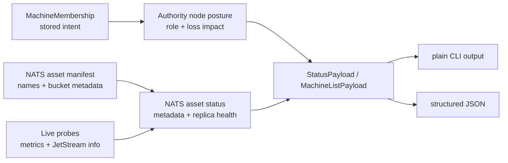

# feat: Authority status first slice

## Summary

Implement the first authority roadmap slice by making the current single-authority system legible in read-only status surfaces. This plan adds typed node-role and NATS asset-bucket metadata to API payloads and CLI output, without changing machine-add behavior, storage replica policy, region placement, or authority ownership.

---

## Problem Frame

`docs/authority-roadmap.md` says authority is ownership, not geography: stored intent belongs to one authority, regions are placement metadata, and live health must not be promoted into durable truth. The current code already has authority-scoped NATS assets, storage participation, topology, and status probes, but the operator-facing status surfaces do not yet explain which data is durable truth, which data is projection, and what control-plane loss means.

The first useful slice should improve diagnosis and agent safety before adding storage promotion, compute regions, DR, or multi-authority behavior.

---

## Assumptions

*This plan was authored without a separate synchronous scope confirmation. The items below are agent inferences that should be reviewed before implementation proceeds.*

- The first slice should be read-only observability and vocabulary, not a mutating storage-promotion or machine-add change.
- `ployz status` and `ployz machine ls` are the right initial operator surfaces because they already expose local daemon health, machine inventory, and NATS asset health.
- Existing persisted membership fields are sufficient for this slice; it should derive status from stored machine records plus live probes rather than introduce new persisted authority records.
- The broader roadmap plan at `docs/plans/2026-05-08-001-feat-authority-roadmap-plan.md` remains the parent arc; this file is a smaller execution plan for the first implementation step.

---

## Requirements

- R1. Status surfaces must show each relevant node's authority role and control-plane loss impact, tracing to the roadmap's "Status" and "Node Roles" sections.
- R2. NATS asset status must classify each current stream/KV as stored intent, projection, or live facts, with replica health kept as health metrics rather than promoted into asset truth. This traces to the roadmap's "Data Buckets" and "Current NATS Assets" sections.
- R3. The first slice must preserve the single-authority invariant: adding machines, changing regions, and reading health must not change authority ownership or replica count.
- R4. Live probes, stale health, and missing NATS inspection must remain observations in status payloads, not writes back into membership or asset truth.
- R5. CLI plain output and structured JSON payloads must both carry the new role and bucket information so humans and agents see the same facts.

---

## Scope Boundaries

- No HA storage promotion, R=3/R=5 mutation, or selected storage-member workflow.
- No DR mirrors, mirror promotion, or async replica lag model beyond reporting existing JetStream replica health.
- No new regional placement behavior or compute-only region scheduling.
- No multi-authority RPC, dev authority, route export/import, or queued remote mutation.
- No durable schema migration for authority records unless implementation proves an existing API type cannot express read-only status cleanly.

### Deferred to Follow-Up Work

- Single-authority machine-add hardening from the broad roadmap's U3: follow this slice once status can prove current posture.
- Explicit storage promotion from the broad roadmap's U5: follow after operators can see candidates, stored-intent assets, and current replica health.
- Compute-only regions from the broad roadmap's U6: follow after the single-authority status vocabulary is stable.

---

## Context & Research

### Relevant Code and Patterns

- `crates/ployz-types/src/model.rs` already defines `AuthorityId`, `AuthorityTier`, `RegionRole`, `AuthorityParticipationRole`, and `StorageParticipation`.
- `crates/ployz-api/src/status.rs` contains `StatusPayload`, `NatsAssetStatus`, `NatsAssetHealthState`, and `ControlPlaneStatus`, with serde-friendly enum tagging for structured status states.
- `crates/ployzd/src/daemon/handlers/status.rs` builds the daemon status payload from stored self-record data, sidecar metrics, component health files, mesh task health, and NATS asset probes.
- `crates/ployzd/src/cli_io.rs` renders stable plain output for `StatusPayload` and has focused tests for status, NATS assets, edge sync, and control-plane health.
- `crates/ployz-nats/src/buckets.rs` owns the NATS asset manifest and asset configuration tests, making it the right place to attach asset bucket/loss-impact metadata near the source of asset naming.
- `crates/ployzd/src/daemon/handlers/machine/list.rs`, `crates/ployzd/src/daemon/handlers/machine/types.rs`, and `crates/ployzd/src/daemon/handlers/machine/render.rs` already convert `MachineMembership` into machine-list API rows and human-readable tables.
- `docs/authority-roadmap.md` is now the source of truth for the authority story; `docs/routing-and-deploys.md` already points deploy/routing readers back to it.

### Institutional Learnings

- No `docs/solutions/` directory was present during planning, so there were no local learning docs to incorporate.

### External References

- External research is intentionally skipped for this slice. The work extends existing local Rust/API/CLI/NATS patterns and does not introduce new NATS topology, storage promotion, mirrors, or third-party behavior.

---

## Key Technical Decisions

- Keep the first slice read-only: it should report authority posture, data buckets, and loss impact without mutating machine records, asset replica settings, or region ownership.
- Model bucket, node role, and loss impact as typed enums in the API/model layer rather than free-form strings in CLI rendering.
- Derive local node posture from existing `MachineMembership.storage`, `MachineMembership.storage_participation`, lifecycle, topology, and known sidecar/runtime roles; do not persist inferred health into membership records.
- Attach NATS asset classification to `NatsAssetSpec` or an adjacent manifest type in `crates/ployz-nats/src/buckets.rs` so status and CLI presentation consume shared metadata.
- Treat probe failures as status uncertainty: the payload should still include the attempted asset or local authority context with `Unknown`/`Stale` health, not omit the surface or report false health.

---

## Open Questions

### Resolved During Planning

- Should the first slice include storage promotion? No. The roadmap's early value comes from making current truth visible before changing durability.
- Should asset classification live in CLI output code? No. It belongs with the NATS asset manifest so JSON, plain output, and future status consumers share one classification.
- Should status rewrite stored truth based on live probes? No. This would violate the roadmap and `VISION.md`; live probes remain observations only.

### Deferred to Implementation

- Exact enum names and serialized values: implementation should choose names that fit existing API naming conventions while preserving roadmap vocabulary.
- Whether machine-list role fields need a new shared helper or can be derived inline: decide after touching the existing report-row construction.
- How much plain-output column width to allocate for new machine-list fields: decide in rendering tests so output remains readable.

---

## High-Level Technical Design

> *This illustrates the intended approach and is directional guidance for review, not implementation specification. The implementing agent should treat it as context, not code to reproduce.*

The design separates stored intent (`MachineMembership` and asset manifest metadata) from live observations (health files, metrics, JetStream replica state). Status combines them at read time and returns uncertainty explicitly.

---

## Implementation Units

### U1. Add Typed Authority Posture Vocabulary

**Goal:** Define the status vocabulary for node authority role, data bucket, disposability/loss impact, and storage participation without changing persisted behavior.

**Requirements:** R1, R3, R4

**Dependencies:** None

**Files:**
- Modify: `crates/ployz-types/src/model.rs`
- Modify: `crates/ployz-api/src/status.rs`
- Test: `crates/ployz-types/src/model.rs`
- Test: `crates/ployz-api/src/runtime.rs`

**Approach:**
- Prefer explicit enums for role and loss-impact concepts; avoid booleans except for facts that are genuinely binary.
- Reuse existing `AuthorityId`, `StorageParticipation`, `AuthorityParticipationRole`, and `RegionRole` concepts where they already fit.
- Keep durable-role posture separate from health state. A node can be an authority-storage node even when its local probe is stale; stale health must not erase the role.
- Preserve serde compatibility style used by current status enums: tagged enums where state matters, simple serializable enums where a fixed vocabulary is enough.

**Execution note:** Implement the enum and serialization coverage test-first so downstream units can depend on stable API vocabulary.

**Patterns to follow:**
- `StorageParticipation` in `crates/ployz-types/src/model.rs` for variant-specific authority data.
- `NatsAssetHealthState` and `ControlPlaneHealthState` in `crates/ployz-api/src/status.rs` for structured status state.
- Status serialization tests in `crates/ployz-api/src/runtime.rs`.

**Test scenarios:**
- Happy path: an authority storage participation maps to a role that includes the owning authority and names non-disposable R=1 control-plane impact.
- Happy path: a storage candidate maps to candidate posture and does not claim ownership of durable control-plane truth.
- Edge case: unknown or absent local self-record data can be represented as status uncertainty without inventing authority ownership.
- Error path: API deserialization of a status payload with stale health preserves the node role instead of replacing it with an error string.

**Verification:**
- New status vocabulary is typed, serializable, and does not require parsing display strings to branch on role or loss impact.

---

### U2. Surface Local Authority Posture in `ployz status`

**Goal:** Make `ployz status` answer "what authority role is this daemon playing, and what happens to control-plane truth if this node is lost?"

**Requirements:** R1, R3, R4, R5

**Dependencies:** U1

**Files:**
- Modify: `crates/ployz-api/src/status.rs`
- Modify: `crates/ployzd/src/daemon/handlers/status.rs`
- Modify: `crates/ployzd/src/cli_io.rs`
- Test: `crates/ployzd/src/daemon/handlers/status.rs`
- Test: `crates/ployzd/src/cli_io.rs`
- Test: `crates/ployz-api/src/runtime.rs`

**Approach:**
- Extend `StatusPayload` with local authority posture derived from the active network config and authoritative self-record when available.
- Keep the existing status response useful when NATS asset inspection or control-plane health reads fail; those failures should populate health fields, not suppress role information.
- Render the new plain-output fields in stable key/value form so agents can parse them without relying on prose.
- Do not add machine-add, region, or replica-count mutation paths in this unit.

**Patterns to follow:**
- `handle_status` in `crates/ployzd/src/daemon/handlers/status.rs`, which already gathers local machine lifecycle before live status probes.
- `render_plain_status` and its tests in `crates/ployzd/src/cli_io.rs`.
- `daemon_status_response_preserves_edge_and_control_plane_uncertainty` in `crates/ployz-api/src/runtime.rs`.

**Test scenarios:**
- Happy path: active local authority storage node returns authority id, storage role, data bucket `stored_intent`, and loss impact in JSON and plain output.
- Happy path: active local candidate node returns candidate role and does not report itself as durable owner.
- Edge case: inactive daemon returns no fabricated authority role and keeps existing idle status behavior.
- Error path: NATS asset probe timeout still returns local authority posture plus an unknown NATS asset health entry.
- Integration: plain `StatusPayload` rendering includes the same role/loss-impact fields present in structured JSON.

**Verification:**
- `ployz status --plain` and JSON status both expose local role information without changing any stored membership or NATS asset configuration.

---

### U3. Classify NATS Assets at the Manifest Source

**Goal:** Attach roadmap data-bucket and loss-impact metadata to every current NATS stream/KV asset in the shared asset manifest.

**Requirements:** R2, R3, R4

**Dependencies:** U1

**Files:**
- Modify: `crates/ployz-nats/src/buckets.rs`
- Modify: `crates/ployz-api/src/status.rs`
- Modify: `crates/ployzd/src/daemon/handlers/status.rs`
- Test: `crates/ployz-nats/src/buckets.rs`
- Test: `crates/ployzd/src/daemon/handlers/status.rs`
- Test: `crates/ployz-api/src/runtime.rs`

**Approach:**
- Extend the asset manifest so each `NatsAssetSpec` carries its roadmap bucket and operator-facing loss impact.
- Classify current assets from `docs/authority-roadmap.md`: deploy commits, deploy status, instances, invites, ACME/certificate buckets, and root machines as stored intent; routing events and cert work stream as projections; locks as live facts.
- Preserve existing replica-health reporting as a live observation layered onto static asset metadata.
- Keep metadata close to asset names/configuration so future asset additions fail tests if they are not classified.

**Execution note:** Add manifest completeness tests before wiring the new metadata into daemon status.

**Patterns to follow:**
- `asset_manifest_matches_ensured_streams_and_buckets` in `crates/ployz-nats/src/buckets.rs`.
- `read_nats_asset_status` and `nats_asset_status` in `crates/ployzd/src/daemon/handlers/status.rs`.
- `NatsAssetStatus` serde patterns in `crates/ployz-api/src/status.rs`.

**Test scenarios:**
- Happy path: every asset returned by `NatsAssetNames::stream_assets` and `kv_assets` has exactly one data bucket and one loss-impact description.
- Happy path: stored-intent assets include `machines_<installation>`, deploy commits, deploy status, instances, invites, ACME accounts, certificates, active challenges, and challenge readiness.
- Happy path: `routing_events_<authority>` is classified as projection, and `cp_locks_<authority>` is classified as live facts.
- Edge case: adding a new stream/KV to ensured configs without classifying it fails the manifest-completeness test.
- Error path: failed JetStream inspection returns static asset metadata plus unknown health, not an unclassified asset.

**Verification:**
- NATS asset status names both "what this asset is" and "what its current replica health is," with those concepts represented separately in JSON.

---

### U4. Add Authority Role Columns to Machine Inventory

**Goal:** Make machine inventory show each node's authority/storage posture so an operator can see which nodes are control-plane disposable before any promotion work exists.

**Requirements:** R1, R3, R5

**Dependencies:** U1

**Files:**
- Modify: `crates/ployz-api/src/machine.rs`
- Modify: `crates/ployzd/src/daemon/handlers/machine/list.rs`
- Modify: `crates/ployzd/src/daemon/handlers/machine/types.rs`
- Modify: `crates/ployzd/src/daemon/handlers/machine/render.rs`
- Modify: `crates/ployzd/src/cli_io.rs`
- Test: `crates/ployzd/src/daemon/handlers/machine/tests.rs`
- Test: `crates/ployzd/src/cli_io.rs`

**Approach:**
- Extend machine-list report rows from existing `MachineMembership` fields rather than performing live probes.
- Show authority/storage role and control-plane loss impact alongside lifecycle, region, and topology.
- Keep machine-list output as inventory, not health. If a node is stale or unreachable, that belongs to existing or future live observation surfaces, not this derived durable-role row.
- Preserve existing compact plain rendering style while adding stable fields for agent parsing.

**Patterns to follow:**
- `MachineListReportRow::payload` in `crates/ployzd/src/daemon/handlers/machine/types.rs`.
- `render_machine_list_report` in `crates/ployzd/src/daemon/handlers/machine/render.rs`.
- `plain_machine_list_renders_stable_lines` in `crates/ployzd/src/cli_io.rs`.

**Test scenarios:**
- Happy path: a machine with `StorageParticipation::Authority` renders as authority storage with owning authority and non-disposable control-plane impact.
- Happy path: a machine with `StorageParticipation::Candidate` renders as candidate and does not claim durable authority ownership.
- Edge case: machine in a non-local region still reports role from storage participation, not geography.
- Integration: daemon machine-list payload and plain CLI output carry the same role fields.
- Regression: existing lifecycle, region, availability-zone, overlay, subnet, and created-at fields remain present.

**Verification:**
- `ployz machine ls --plain` and JSON machine-list output reveal authority/storage posture without probing or mutating remote nodes.

---

## System-Wide Impact

- **Interaction graph:** `StatusPayload` and `MachineListPayload` gain new read-only fields consumed by CLI rendering and downstream agents; NATS asset metadata flows from `ployz-nats` into daemon status.
- **Error propagation:** Probe failures remain `Unknown` or `Stale` health states with context. They do not erase static asset metadata or node-role posture.
- **State lifecycle risks:** No stored state should be rewritten by this slice. The main risk is accidentally treating health as truth; unit boundaries explicitly avoid that.
- **API surface parity:** JSON and plain output must expose equivalent authority role and asset bucket information.
- **Integration coverage:** CLI rendering tests are required because API-only tests will not prove agent-readable plain output.
- **Unchanged invariants:** Machine add, storage participation mutation, replica count, region placement, NATS asset creation, and authority ownership remain unchanged.

---

## Risks & Dependencies

| Risk | Mitigation |
|------|------------|
| Status vocabulary becomes stringly and hard for agents to branch on | Use typed enums in model/API layers and render strings only at presentation boundaries. |
| Live health accidentally changes perceived durable role | Derive durable role from stored membership/config and keep health in separate state fields. |
| CLI output becomes too noisy | Add concise key/value fields and preserve stable plain-output tests. |
| NATS asset classifications drift as assets are added | Add manifest completeness tests near `NatsAssetNames` and ensured configs. |
| API consumers see surprising payload changes | Add serde tests in `crates/ployz-api/src/runtime.rs` and keep fields additive. |

---

## Documentation / Operational Notes

- Update `docs/authority-roadmap.md` only if implementation reveals vocabulary drift; otherwise this slice implements the existing roadmap rather than expanding it.
- Mention in release/PR notes that HA is still not implemented: R=1 authority storage remains non-disposable, but now status says so plainly.
- Verification should include crate-local tests for `ployz-types`, `ployz-api`, `ployz-nats`, and `ployzd`; before pushing, use the repo's full-build test gate because the plan touches `ployzd` and shared API types.

---

## Sources & References

- **Origin document:** [docs/authority-roadmap.md](docs/authority-roadmap.md)
- **Parent roadmap plan:** [docs/plans/2026-05-08-001-feat-authority-roadmap-plan.md](docs/plans/2026-05-08-001-feat-authority-roadmap-plan.md)
- Related code: `crates/ployz-types/src/model.rs`
- Related code: `crates/ployz-api/src/status.rs`
- Related code: `crates/ployz-nats/src/buckets.rs`
- Related code: `crates/ployzd/src/daemon/handlers/status.rs`
- Related code: `crates/ployzd/src/cli_io.rs`
- Related code: `crates/ployzd/src/daemon/handlers/machine/list.rs`
