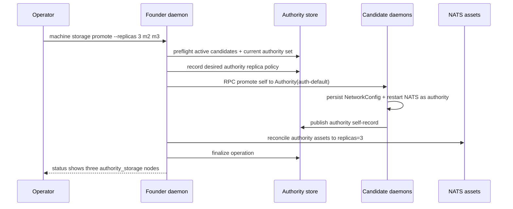

# feat: Add explicit NATS storage promotion

## Summary

Add the first functional NATS authority expansion path: ordinary `machine add` still creates storage candidates, but an explicit operator command can promote selected candidates into the default authority and raise NATS durable asset replicas to R=3 or R=5. Status and machine-list output become the proof surface for the before/after posture.

---

## Problem Frame

The status slice made authority posture visible. The next valuable slice should let an operator do something meaningful with that visibility: add machines as safe candidates, then deliberately turn a candidate set into replicated authority storage without accidental promotion during ordinary cluster growth.

---

## Assumptions

- This slice supports the existing single authority, `auth-default`; it does not introduce multiple authorities or region-local authority ownership.
- Promotion is explicit and operator-commanded. Machine count alone never changes durable truth ownership or replica count.
- The first functional target supports R=3 and R=5, with R=3 as the natural default. Promotion requires enough active storage-capable machines to satisfy the requested replica count.
- If promotion cannot verify candidate readiness, remote restart, or asset replica reconciliation, it fails visibly and preserves or rolls back prior durable intent where practical.

---

## Requirements

- R1. `machine add` continues to join new machines as `StorageParticipation::Candidate` by default.
- R2. A new operator command promotes selected active storage candidates into authority storage for `auth-default`.
- R3. Promotion accepts an explicit desired replica count of 3 or 5 and rejects unsupported counts.
- R4. Promotion refuses to proceed unless the final authority set has exactly enough active storage-authority participants for the requested replica count.
- R5. Promoted machines persist authority storage intent locally, restart NATS with authority cluster routing, and publish authority membership back to the store.
- R6. Durable NATS assets are reconciled to the requested replica count only through explicit promotion intent.
- R7. Failed promotion is reported to the operator with structured failure state and does not silently leave candidate machines misrepresented as healthy authority storage.
- R8. `status` and `machine list` show candidates before promotion and authority storage plus updated NATS replica observations after promotion.

---

## Scope Boundaries

- Do not add multiple authority IDs, authority sharding, or region-local control planes.
- Do not auto-promote candidates based on count, region, uptime, or health observations.
- Do not build disaster recovery, authority export/import, or restore workflows.
- Do not add background reconciliation that silently rewrites authority membership after promotion.
- Do not make deploy/routing/certificate behavior depend on multiple authorities; assets remain scoped to `auth-default`.

### Deferred to Follow-Up Work

- Region-aware compute policy and placement-driven scheduling.
- Disaster recovery export/import and authority restore workflows.
- Operator UX for demoting storage authorities and shrinking replicas.
- Fully automated promotion repair after a partially failed remote restart; this slice should surface failures and preserve visible operation state.

---

## Context & Research

### Relevant Code and Patterns

- `docs/authority-roadmap.md` sequences this after status: single-authority add safety, then explicit R=3/R=5 storage promotion.
- `docs/plans/2026-05-08-001-feat-authority-roadmap-plan.md` U3 and U4 define the original NATS authority behavior.
- `crates/ployzd/src/cli.rs` and `crates/ployzd/src/request_builder.rs` already map machine subcommands into typed `DaemonRequest` variants.
- `crates/ployz-api/src/request.rs` is the request contract for daemon/CLI/RPC parity.
- `crates/ployzd/src/daemon/handlers/machine/join/target.rs` seeds add joiners as storage candidates.
- `crates/ployzd/src/daemon/handlers/mesh/bootstrap.rs` writes joiner `NetworkConfig` as `StorageParticipation::Candidate`.
- `crates/ployzd/src/mesh_state/bootstrap.rs` filters bootstrap NATS peers to authority participants.
- `crates/ployzd/src/services/nats.rs` renders NATS node config from `StorageParticipation`.
- `crates/ployz-nats/src/config.rs` already separates authority JetStream config from candidate leafnode config.
- `crates/ployz-nats/src/buckets.rs` already centralizes `AssetPolicy { replicas }`, but default startup uses replicas 1.

### Institutional Learnings

- `docs/solutions/architecture-patterns/authority-status-separates-truth-from-observation-2026-05-08.md` is directly relevant: promotion should change stored authority truth only through explicit operator intent, while NATS probe results remain observations layered onto that truth.

### External References

- External research intentionally skipped. This slice is mostly repo-specific orchestration policy over already-selected NATS/JetStream primitives, and the codebase has direct local patterns to follow.

---

## Key Technical Decisions

- Introduce explicit storage promotion rather than adding more hardening-only tests. This gives the slice real operator value while still preserving the roadmap boundary that ordinary add does not imply HA.
- Store desired authority replica count as durable network intent, not as an inference from current machine count or live NATS observations.
- Keep `auth-default` as the only authority ID for this slice. Promotion expands the storage participant set inside that authority.
- Prefer an operator-facing command under the existing machine surface, such as `machine storage promote`, because the operation targets machines and should sit near `machine add`, `machine activate`, and `machine standby`.
- Treat promotion as a staged machine operation with visible failure state, not a background self-healing loop.

---

## Open Questions

### Resolved During Planning

- Whether to keep this as hardening only: no. The slice should include explicit promotion to R=3/R=5 because candidate behavior already exists and the user wants more functionality.
- Whether promotion should be automatic after enough machines exist: no. That violates the roadmap and operations guidance; promotion must be explicit.

### Deferred to Implementation

- Exact command spelling: choose the most ergonomic CLI shape while editing, with `machine storage promote --replicas 3 <machine-id>...` as the directional target.
- Exact operation-stage names: define them alongside the machine operation model so interrupted promotion can be surfaced consistently.
- Exact NATS update mechanics for existing stream/KV replica changes: validate against `async-nats` APIs while implementing and keep the behavior behind focused tests.

---

## High-Level Technical Design

> *This illustrates the intended approach and is directional guidance for review, not implementation specification. The implementing agent should treat it as context, not code to reproduce.*

| Operation | Membership outcome | NATS outcome | Status proof |
|---|---|---|---|
| First founder start | one `auth-default` storage authority | local JetStream, replicas 1 | founder is `authority_storage` |
| Ordinary `machine add` | active storage candidates | leafnode remotes, no local JetStream | joiners are `storage_candidate` |
| Explicit R=3 promotion | founder + two targets are authority storage | authority cluster routes, replicas 3 | three authority nodes and assets report 3 replicas |
| Explicit R=5 promotion | five authority storage participants | authority cluster routes, replicas 5 | five authority nodes and assets report 5 replicas |

---

## Implementation Units

### U1. Preserve Add-As-Candidate Invariants

**Goal:** Keep ordinary machine growth safe by proving `machine add` does not promote storage or raise NATS replicas.

**Requirements:** R1, R8

**Dependencies:** None

**Files:**
- Modify: `crates/ployzd/src/daemon/handlers/machine/join/target.rs`
- Modify: `crates/ployzd/src/daemon/handlers/mesh/bootstrap.rs`
- Test: `crates/ployzd/src/daemon/handlers/machine/tests.rs`
- Test: `crates/ployz-nats/src/config.rs`

**Approach:**
- Retain founder-issued joiner records as storage-capable candidates.
- Validate the remote self-record does not claim authority storage during ordinary add.
- Keep candidate NATS config leafnode-only and ensure the test suite proves no local JetStream/cluster route is rendered for candidates.
- Use the resulting machine-list/status posture as the baseline before promotion.

**Execution note:** Start with the regression that a joiner claiming authority during ordinary add is rejected.

**Patterns to follow:**
- `validate_joined_machine_subnet` in `crates/ployzd/src/daemon/handlers/machine/join/target.rs`
- Candidate config tests in `crates/ployz-nats/src/config.rs`

**Test scenarios:**
- Happy path: `machine add` accepts a joiner with `StorageParticipation::Candidate`, activates it, and stores it as a candidate.
- Error path: `machine add` rejects a joiner self-record that reports `StorageParticipation::Authority`.
- Integration: after add, `machine list` shows the founder as authority storage and the joiner as storage candidate.
- Integration: rendered candidate NATS config has leafnode remotes and no local JetStream stanza.

**Verification:**
- Existing add behavior remains usable.
- No successful ordinary add creates a second authority-storage record.

---

### U2. Add Promotion Intent to API, CLI, and Network Config

**Goal:** Introduce an explicit operator contract and durable replica intent for storage promotion.

**Requirements:** R2, R3, R4, R6

**Dependencies:** U1

**Files:**
- Modify: `crates/ployzd/src/cli.rs`
- Modify: `crates/ployzd/src/request_builder.rs`
- Modify: `crates/ployz-api/src/request.rs`
- Modify: `crates/ployz-api/src/response.rs`
- Modify: `crates/ployzd/src/mesh_state/network.rs`
- Test: `crates/ployzd/src/main.rs`
- Test: `crates/ployz-api/src/runtime.rs`

**Approach:**
- Add a machine storage promotion request that carries target machine IDs and an explicit replica count.
- Validate allowed replica counts at request handling time: 3 and 5 only.
- Add durable network-level storage replica intent, preferably as an enum rather than a loose integer. The default remains the current single-authority policy.
- Add a response payload that reports requested replicas, promoted machines, skipped/rejected machines, and operation ID or failure stage when available.

**Patterns to follow:**
- Existing `MachineAction::{Add,Activate,Drain,Standby}` request-builder mapping.
- Existing machine operation payload shape in `crates/ployz-api/src/machine.rs`.
- AGENTS.md Rust guidance to prefer enums over booleans or unstructured mode values.

**Test scenarios:**
- Happy path: parsing `machine storage promote --replicas 3 m2 m3` builds the promotion request with two targets and replica count 3.
- Happy path: omitting `--replicas` uses the default R=3.
- Error path: `--replicas 2` or `--replicas 4` is rejected before daemon mutation.
- Serialization: the new request and response payload round-trip through JSON.
- Backward compatibility expectation: existing machine commands keep their request shapes.

**Verification:**
- CLI/API exposes explicit promotion without changing `machine add`.
- Durable network intent can represent single, R=3, and R=5 storage policies.

---

### U3. Implement Promotion Orchestration and Operation State

**Goal:** Promote selected active candidates into authority storage through a visible, staged daemon operation.

**Requirements:** R2, R4, R5, R7, R8

**Dependencies:** U2

**Files:**
- Modify: `crates/ployzd/src/daemon/handlers/mod.rs`
- Modify: `crates/ployzd/src/daemon/handlers/machine.rs`
- Modify: `crates/ployzd/src/daemon/handlers/machine/operations.rs`
- Create or Modify: `crates/ployzd/src/daemon/handlers/machine/storage.rs`
- Test: `crates/ployzd/src/daemon/handlers/machine/tests.rs`

**Approach:**
- Add a handler that preflights local authority ownership, current active membership, requested targets, and final authority count.
- Reuse the machine operation store so promotion has stages, artifacts, failure state, and interrupted-operation visibility.
- Publish the intended authority participant set deliberately rather than deriving it from live liveness observations.
- Use NATS node RPC for remote self-promotion, then wait for each promoted machine to publish an authority self-record.
- On failure, return structured promotion failure output and preserve visible operation state. Roll back remote targets to candidate only where the operation can do so safely and explicitly.

**Patterns to follow:**
- `handle_machine_add` orchestration in `crates/ployzd/src/daemon/handlers/machine/join.rs`
- `handle_machine_activate_remote` for target RPC, readiness waiting, and cleanup shape.
- Machine operation persistence in `crates/ployzd/src/daemon/handlers/machine/operations.rs`

**Test scenarios:**
- Happy path: founder plus two active candidates promoted with `--replicas 3` end with three authority-storage membership records.
- Happy path: founder plus four active candidates promoted with `--replicas 5` end with five authority-storage membership records.
- Error path: requesting R=3 with only one target candidate fails before remote mutation.
- Error path: targeting a compute-only or inactive machine fails preflight.
- Error path: remote promotion RPC failure leaves the operation failed with target-level error context.
- Integration: interrupted promotion operation is visible through machine operation list/get and does not masquerade as succeeded.

**Verification:**
- Promotion changes authority membership only through the explicit command.
- Failed promotion has an operator-visible audience beyond logs.

---

### U4. Promote Remote Nodes and Restart NATS as Authority Storage

**Goal:** Let promoted candidates persist authority participation locally and restart NATS with authority cluster routing.

**Requirements:** R5, R7

**Dependencies:** U2, U3

**Files:**
- Modify: `crates/ployz-api/src/request.rs`
- Modify: `crates/ployzd/src/daemon/handlers/mod.rs`
- Modify: `crates/ployzd/src/daemon/handlers/mesh/participation.rs`
- Modify: `crates/ployzd/src/mesh_state/bootstrap.rs`
- Modify: `crates/ployzd/src/services/nats.rs`
- Test: `crates/ployzd/src/daemon/handlers/machine/tests.rs`
- Test: `crates/ployzd/src/mesh_state/bootstrap.rs`

**Approach:**
- Add an internal/self RPC request for changing the local machine's storage participation to `Authority { authority_id: auth-default }` under explicit promotion evidence.
- Persist the updated `NetworkConfig`, restart the local runtime from config, and update the authoritative self-record.
- Ensure bootstrap peer records include the promoted authority participants before or during restart so route generation has the intended authority peer set.
- Keep candidates that are not promoted as leafnode clients.

**Patterns to follow:**
- `transition_local_machine` in `crates/ployzd/src/daemon/handlers/mesh/participation.rs`
- `restart_active_runtime_from_config` usage during lifecycle transitions.
- `resolve_bootstrap_addrs` authority filtering in `crates/ployzd/src/mesh_state/bootstrap.rs`

**Test scenarios:**
- Happy path: promoted candidate saves `StorageParticipation::Authority { auth-default }` in network config and self-record.
- Happy path: promoted authority NATS config includes JetStream and cluster routes to other authority peers.
- Edge case: candidates not included in promotion remain leafnode-only and excluded from authority route lists.
- Error path: restart failure restores prior network config when possible and reports `NETWORK_RESTART_FAILED`.
- Integration: after remote promotion, the founder observes the target membership as authority storage.

**Verification:**
- Promoted candidates become real authority storage participants locally and durably.
- Non-promoted candidates retain candidate posture.

---

### U5. Reconcile NATS Durable Asset Replicas

**Goal:** Raise authority-local durable NATS assets to the explicit promotion replica count and expose failures as promotion failures.

**Requirements:** R3, R6, R7, R8

**Dependencies:** U2, U3, U4

**Files:**
- Modify: `crates/ployz-nats/src/lib.rs`
- Modify: `crates/ployz-nats/src/buckets.rs`
- Modify: `crates/ployzd/src/services/nats.rs`
- Modify: `crates/ployzd/src/daemon/handlers/status.rs`
- Test: `crates/ployz-nats/src/buckets.rs`
- Test: `crates/ployzd/src/daemon/handlers/status.rs`

**Approach:**
- Derive `AssetPolicy` from durable network replica intent instead of hard-coding startup/reconnect to replicas 1.
- Extend asset reconciliation so existing streams and KV buckets can be updated when the desired replica count changes.
- Keep direct asset observations in status separate from stored authority truth: observed `replicas=3` proves asset reconciliation, while membership/config remains the source of authority role truth.
- Fail promotion if replica reconciliation cannot reach the requested count; do not silently mark the operation successful on membership changes alone.

**Patterns to follow:**
- `AssetPolicy { replicas }` and `asset_configs_in` in `crates/ployz-nats/src/buckets.rs`
- Current NATS asset status manifest handling in `crates/ployzd/src/daemon/handlers/status.rs`

**Test scenarios:**
- Happy path: asset configs for R=3 and R=5 set `num_replicas` consistently across streams and durable KV buckets.
- Error path: invalid replica counts cannot construct or apply an asset policy.
- Update path: existing KV/stream configs that differ in replica count are detected as needing reconciliation.
- Integration: status reports promoted authority assets with the requested replica observation after reconciliation.

**Verification:**
- Replica count changes only when durable promotion intent requests it.
- Promotion completion requires both membership promotion and NATS asset replica reconciliation.

---

### U6. Surface Promotion Results in Status, Machine List, and Docs

**Goal:** Make the new functionality understandable and verifiable from operator surfaces.

**Requirements:** R7, R8

**Dependencies:** U3, U4, U5

**Files:**
- Modify: `crates/ployzd/src/cli_io.rs`
- Modify: `crates/ployzd/src/daemon/handlers/machine/list.rs`
- Modify: `crates/ployzd/src/daemon/handlers/status.rs`
- Modify: `docs/authority-roadmap.md`
- Test: `crates/ployzd/src/cli_io.rs`
- Test: `crates/ployzd/src/daemon/handlers/machine/tests.rs`
- Test: `crates/ployzd/src/daemon/handlers/status.rs`

**Approach:**
- Ensure machine list clearly distinguishes storage candidates from authority storage after promotion.
- Ensure status shows local authority posture, asset replica observations, and any warnings when assets are not yet at requested replicas.
- Add concise roadmap/doc notes that R=3/R=5 promotion now exists but demotion, DR, and multi-authority are still deferred.

**Patterns to follow:**
- Plain output authority keys in `crates/ployzd/src/cli_io.rs`
- Status payload construction in `crates/ployzd/src/daemon/handlers/status.rs`

**Test scenarios:**
- Happy path: plain machine-list output renders promoted machines as `authority_storage:auth-default`.
- Happy path: JSON status payload includes promoted authority posture and NATS assets with replica observations.
- Error/health path: status shows warnings when stored promotion intent expects R=3/R=5 but asset observations are unavailable or below requested replicas.
- Documentation: roadmap marks single-authority add safety and explicit storage promotion as delivered or partially delivered according to the final implementation.

**Verification:**
- Operators can verify candidate-before and authority-after states without reading logs.
- Docs accurately state what this slice does and does not make highly available.

---

## System-Wide Impact

- **Interaction graph:** This touches CLI request construction, daemon request routing, machine operation persistence, remote daemon RPC, local network config, NATS runtime restart, bootstrap peer seed records, NATS asset reconciliation, status, and machine-list rendering.
- **Error propagation:** Promotion failures must return structured daemon errors and persist operation state. Logs remain evidence, not the operator audience.
- **State lifecycle risks:** The main risk is partial promotion: membership may change before NATS asset replicas reconcile, or a remote node may restart successfully while another fails. The plan requires staged operation state and visible failure instead of silent background repair.
- **API surface parity:** New request/response variants need CLI, RPC-stdio, SDK/runtime JSON parity, and metrics labels.
- **Integration coverage:** Config rendering tests are necessary but insufficient. Promotion needs orchestration tests proving membership, config, operation state, and status behavior together.
- **Unchanged invariants:** Ordinary `machine add` remains candidate-only. `auth-default` remains the only authority ID. NATS observations do not become durable truth.

---

## Risks & Dependencies

| Risk | Mitigation |
|------|------------|
| NATS stream/KV replica updates are more constrained than expected | Isolate replica reconciliation behind `ployz-nats` tests and surface failure rather than pretending promotion succeeded. |
| Partial promotion leaves mixed local configs across machines | Use staged operation state, remote rollback where explicit and safe, and status warnings when desired replicas and observed replicas diverge. |
| CLI surface grows awkwardly under `machine` | Keep command shape near existing lifecycle operations and test clap parsing before implementing handler behavior. |
| Promotion accidentally becomes automatic reconciliation | Store explicit promotion intent and trigger mutation only from the operator command path. |
| R=5 makes the slice too large | Keep R=5 as validation/policy support over the same path; if implementation reveals materially different behavior, land R=3 first and explicitly defer R=5 in the plan before coding beyond it. |

---

## Documentation / Operational Notes

- The PR should state plainly that HA begins only after explicit promotion and successful replica reconciliation.
- Operators should verify with both `machine list` and `status`; membership proves authority posture, while NATS asset observations prove replica reconciliation.
- A failed promotion should direct operators to machine operation details rather than relying on log spelunking.

---

## Sources & References

- Roadmap: `docs/authority-roadmap.md`
- Original NATS authority plan: `docs/plans/2026-05-08-001-feat-authority-roadmap-plan.md`
- Previous status slice plan: `docs/plans/2026-05-08-002-feat-authority-status-slice-plan.md`
- Related learning: `docs/solutions/architecture-patterns/authority-status-separates-truth-from-observation-2026-05-08.md`
- CLI machine actions: `crates/ployzd/src/cli.rs`
- CLI request builder: `crates/ployzd/src/request_builder.rs`
- Daemon request contract: `crates/ployz-api/src/request.rs`
- Machine add orchestration: `crates/ployzd/src/daemon/handlers/machine/join.rs`
- Remote mesh participation: `crates/ployzd/src/daemon/handlers/mesh/participation.rs`
- Bootstrap peer records: `crates/ployzd/src/mesh_state/bootstrap.rs`
- NATS config rendering: `crates/ployz-nats/src/config.rs`
- NATS asset policy: `crates/ployz-nats/src/buckets.rs`
