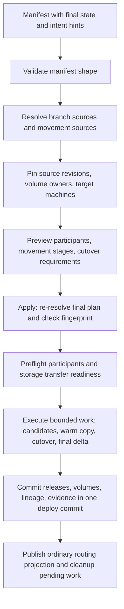
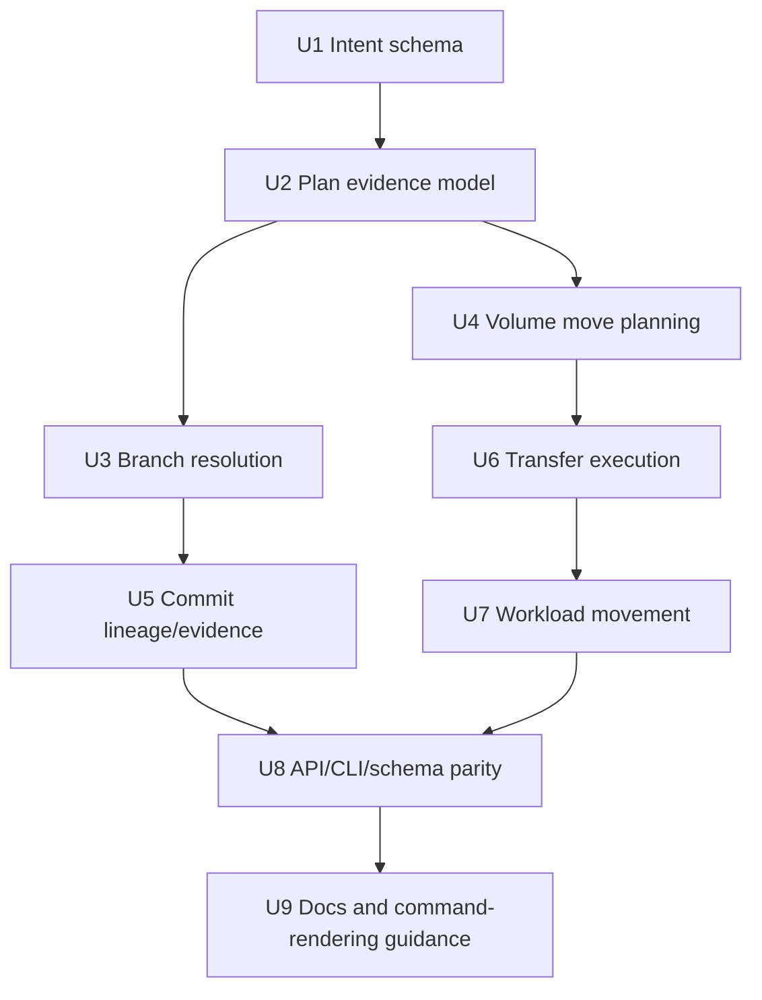

# feat: Add deploy intent hints for branching and movement

## Summary

Teach deploy manifests to carry explicit operation intent: this service is
fresh, this one is branched from another namespace, this volume/service should
move from its current machine, and later this service may be a portal to another
namespace. The manifest still contains the final target shape. The hints tell
Ployz what extra validation, data movement, lineage, and commit evidence are
required to safely reach that shape.

This makes future commands such as `ployzctl branch`, `ployzctl migrate`, and
cloud PR environment actions mostly renderers over deploy manifests. The core
primitive remains `deploy preview/apply`: inspect the supplied plan, validate
source truth, execute bounded work, and commit one durable deploy event.

---

## Problem Frame

Today's deploy manifest describes final namespace state: services, volumes, and
placement. That is good for ordinary deploys, but not enough for higher-level
operations:

- A PR branch may want `pr-39/web` created from `prod/web`, with durable lineage.
- A stateful branch may want fresh Postgres data, a snapshot clone, or an
  intentionally empty database.
- A machine drain or low-disk event may want `prod/postgres` moved to
  `machine-b` with warm copy, short cutover, and one deploy commit.
- A branch environment may want to portal a service from production rather than
  owning a copy.

If each command invents a private workflow, Ployz gets several near-duplicate
truth paths. If deploy owns the declarative hints, those commands can produce
ordinary manifests and let the orchestrator enforce the same preview, preflight,
execution, and commit semantics.

The important shift from the prior version of this plan: service branching is
one use case of a more general deploy intent layer, not the whole feature.

---

## Requirements

- R1. A deploy manifest can describe final target services/volumes plus optional
  typed intent hints for how each target should be reached.
- R2. Fresh remains the default behavior. Existing manifests with no hints keep
  today's deploy semantics.
- R3. Branch hints declare a committed source namespace/service/revision lineage
  to validate and record; they do not define config merge or override behavior.
- R4. Movement hints can ask deploy to relocate an existing managed volume, and
  later a workload using that volume, as part of reaching the final manifest.
- R5. Movement planning proves current owner, target machine, participants,
  writer safety, and storage transfer readiness before mutation.
- R6. Movement execution uses bounded stages: warm copy where possible, writer
  stop/drain for cutover, final delta, target verification, then commit durable
  ownership/release changes.
- R7. Preview shows intent evidence: branch source pins, movement source/target,
  required participants, cutover requirements, and unsupported policies.
- R8. Apply rejects stale or changed source truth before mutation. Branch source
  changes, volume owner changes, and target machine lifecycle changes require a
  fresh plan.
- R9. Deploy commit is still the durable point of truth: releases, volume
  ownership, deploy status, and lineage/evidence commit together.
- R10. Future commands and cloud flows can render these hints into manifests;
  policy and override rendering stay outside core.
- R11. Unsupported hints are rejected explicitly. Ployz should not accept a
  `portal` or snapshot-clone policy until its safety semantics are implemented.

---

## Scope Boundaries

- No background movement based on metrics, disk pressure, or drain status. Those
  can suggest a command, but the state change is still an explicit deploy apply.
- No core config override DSL. Cloud, CLI, or an agent renders the final target
  service spec before calling deploy.
- No instant production promotion switch in this plan. Promotion can later render
  a production deploy from a selected branch target.
- No live cross-namespace portal routing in v1. Portal remains vocabulary and a
  future mode until routing/dependency semantics are designed.
- No multi-volume atomic workload migration in the first movement slice. Start
  with one single-scope managed volume, then wrap service movement around it.
- No immediate source dataset deletion after movement. Cleanup is explicit or
  retention-based so rollback evidence survives the commit.

### Deferred to Follow-Up Work

- Snapshot/fork volume branching for stateful PR environments.
- Portal services that borrow live services across namespaces.
- Namespace-level branch capsules that render many per-service hints at once.
- Full workload migration command UX over the deploy manifest primitive.
- Machine drain automation that proposes, but does not silently apply, movement
  deploys.

---

## Context & Research

### Relevant Code and Patterns

- `VISION.md` defines deploy, branch, migrate, promote, rollback, and
  fork-volume as explicit primitives driven by operator commands.
- `docs/routing-and-deploys.md` defines deploy truth: preview, namespace lease,
  participant probe, candidate startup, immutable deploy commit, routing events,
  and cleanup.
- `docs/architecture.md` says operations should inspect, plan, fail before
  mutation, execute bounded steps, commit durable facts at the point of no
  return, and report cleanup/failure visibly.
- `crates/ployz-types/src/spec.rs` owns `DeployManifest`, `ServiceSpec`,
  `VolumeDeclaration`, manifest validation, and generated schema shape.
- `crates/ployz-orchestrator/src/deploy/plan.rs` lowers a manifest plus current
  store state into `ResolvedPlan` and `DeployPreview`.
- `crates/ployz-orchestrator/src/deploy/execute.rs` already performs an initial
  plan, participant probe, final plan, plan-stability check, candidate startup,
  deploy commit, and cleanup.
- `crates/ployz-orchestrator/src/deploy/lifecycle.rs` builds revisions,
  releases, volumes, deploy records, and the `DeployCommit`.
- `crates/ployz-store-api/src/traits.rs` and
  `crates/ployz-store-api/src/deploy_commit_facts.rs` define deploy commit
  facts and routing projections.
- `crates/ployzd/src/daemon/handlers/volume/zfs.rs` and
  `crates/ployzd/src/daemon/handlers/volume/transfer_listener.rs` already have
  ZFS snapshot/send/receive pieces that can become the transfer substrate for
  movement hints.
- `packages/deploy/index.d.ts` is generated from the deploy schema and must stay
  in parity with public manifest changes.

### Institutional Learnings

- `docs/solutions/architecture-patterns/preflight-authority-promotions-before-mutation-2026-05-08.md`:
  build and validate final participant sets before mutation when an operation
  changes coordination, placement, or storage.
- `docs/solutions/architecture-patterns/authority-status-separates-truth-from-observation-2026-05-08.md`:
  keep durable truth, status, and live observations separate. Intent hints and
  lineage are durable deploy facts; transfer progress and readiness probes are
  operation evidence or live observations.

---

## Key Technical Decisions

- Put intent hints in the deploy manifest. Later commands should render deploy
  manifests with hints instead of owning separate mutation paths.
- Keep final target state explicit. Hints never replace `ServiceSpec` or
  `VolumeDeclaration`; they explain source lineage, movement source, and safety
  requirements for reaching the supplied target.
- Consume hints during deploy apply, then commit durable evidence. Hints are not
  desired state for a background reconciler to keep reapplying.
- Treat branch and move as different intent kinds over the same deploy pipeline.
  Branch creates a new target identity with lineage. Move preserves an existing
  identity while changing placement or volume ownership.
- Add movement at the volume layer first, then wrap workload movement once volume
  handoff is proven. This keeps the first PRs tractable and gives `migrate`
  something solid to render later.
- Make stale source truth part of the plan fingerprint. Branch source revisions,
  volume ownership, target machine lifecycle, and movement participants must be
  stable between initial and final plan.
- Keep routing consumers ordinary. Gateway and DNS read committed releases and
  instances; they do not need to understand whether a release came from branch,
  move, or fresh deploy intent.
- Reject unsupported intent modes rather than accepting future-looking shapes
  that imply safety Ployz cannot provide yet.

---

## Open Questions

### Resolved During Planning

- Should move live outside deploy? No for the current direction. `migrate` can be
  a command, but it should render a deploy manifest with movement hints so the
  core commit path stays unified.
- Should overrides live in core? No. Core receives the final target spec and
  validates it. Cloud/CLI/agents decide how source specs are copied or changed.
- Should movement happen just because a machine is draining or disk is low? No.
  Those are reasons an operator or cloud workflow may choose to render a
  movement deploy, not background policy in the cluster.
- Should promotion be instant? No for this plan. Promote can render a normal
  production deploy and let deploy preview/apply do the work.

### Deferred to Implementation

- Exact manifest field names. Candidate shape is an optional `intent` or
  `source` object on services/volumes, but implementation should choose the
  clearest generated TypeScript shape.
- Whether movement hints attach primarily to volumes, services, or both in the
  public v1. The implementation should start at the volume layer if that keeps
  the first PR smaller.
- Exact persistence shape for intent evidence: extend `DeployCommit`, add
  lineage/evidence records, or both. The invariant is that evidence commits at
  the same boundary as releases and volumes.
- Exact cutover controls for writer stop/drain. The first workload movement
  slice may require recreate rollout and a single attached service.

---

## High-Level Technical Design

> *This section is directional guidance for review, not implementation
> specification. Implementers should preserve the invariants, not copy a shape
> blindly.*

### Intent Vocabulary

| Intent | Identity | First-class now? | Meaning |
|--------|----------|------------------|---------|
| Fresh | Target namespace/service or volume | Existing/default | Use the supplied manifest directly. |
| Branch | New target identity with lineage | First slice | Validate a committed source and record target lineage. |
| Move volume | Same volume identity, new machine | Planned slice | Transfer volume data and commit new `VolumeRecord.machine_id`. |
| Move workload | Same service identity, new placement | Later slice | Wrap volume movement, instance stop/start, readiness, and routing. |
| Portal | Borrowed source identity | Deferred | Target environment references another namespace's live service. |

### Deploy Flow With Hints



### Example Directional Manifest Shape

```yaml
namespace: prod
volumes:
  - name: pgdata
    scope: single
    quota: 100GiB
    mode: zfs
    owner: postgres
    intent:
      move:
        from_machine: machine-a
        to_machine: machine-b
services:
  - name: postgres
    placement:
      replicated:
        count: 1
    intent:
      move:
        to_machine: machine-b
    template:
      image: postgres:17
      mounts:
        - source:
            volume: pgdata
          target: /var/lib/postgresql/data
```

```yaml
namespace: pr-39
services:
  - name: web
    intent:
      branch:
        source_namespace: prod
        source_service: web
    placement:
      replicated:
        count: 1
    template:
      image: example/web:pr-39
```

The field names above are illustrative. The plan requires a typed schema with
these semantics, not this exact YAML.

---

## Implementation Units



### U1. Define Deploy Intent Schema

**Goal:** Add public, typed manifest vocabulary for deploy intent hints while
preserving existing fresh deploy behavior.

**Requirements:** R1, R2, R3, R4, R10, R11

**Dependencies:** None

**Files:**
- Modify: `crates/ployz-types/src/spec.rs`
- Modify: `crates/ployz-api/src/runtime.rs`
- Modify: `scripts/generate-deploy-types.sh`
- Modify: `packages/deploy/index.d.ts`
- Test: `crates/ployz-types/src/spec.rs`
- Test: `crates/ployz-api/src/runtime.rs`

**Approach:**
- Add optional intent/source objects to the manifest model, scoped so services
  and volumes can express the intent that belongs to them.
- Keep absence of intent equivalent to today's fresh/direct behavior.
- Represent only modes implemented in the current slice. If future modes are
  included for schema visibility, validation must reject them with explicit
  unsupported errors.
- Do not add merge, override, or cloud-specific policy fields.
- Keep serialized shapes compatible with generated TypeScript deploy types.

**Patterns to follow:**
- Enum modeling in `Placement`, `NetworkMode`, `RolloutStrategy`, and
  `VolumeScope` in `crates/ployz-types/src/spec.rs`.
- Manifest validation tests and API runtime serialization tests.

**Test scenarios:**
- Happy path: a manifest with no intent validates and serializes as before.
- Happy path: a service branch intent with non-empty source namespace/service
  validates when the target spec is otherwise valid.
- Happy path: a volume move intent with source and target machine IDs validates
  at schema level.
- Error path: empty source namespace, empty source service, or empty machine ID
  is rejected.
- Error path: unsupported portal/snapshot-clone intent is rejected until the
  corresponding planner exists.
- Integration: generated TypeScript deploy types include the implemented intent
  shapes.

**Verification:**
- Existing fresh deploy schema users are unaffected, and new intent fields are
  typed rather than stringly.

### U2. Add Plan Evidence for Intent Hints

**Goal:** Extend resolved plans and previews so intent-specific decisions are
visible, fingerprinted, and available at commit time.

**Requirements:** R5, R7, R8, R9

**Dependencies:** U1

**Files:**
- Modify: `crates/ployz-types/src/model.rs`
- Modify: `crates/ployz-orchestrator/src/deploy/plan.rs`
- Modify: `crates/ployz-orchestrator/src/deploy/execute.rs`
- Test: `crates/ployz-orchestrator/src/deploy/tests.rs`

**Approach:**
- Add deploy preview evidence for branch and movement intent without changing
  ordinary `ServicePlan` slot behavior.
- Include pinned source facts in `PlanFingerprint`: source release/revision,
  current volume owner machine, target machine lifecycle/storage eligibility,
  and participants.
- Keep live observations, such as storage reachability and transfer progress,
  out of durable truth until execution records them as operation evidence.
- Ensure `ensure_plan_stable` fails before mutation when pinned facts change.

**Patterns to follow:**
- Existing `PlanFingerprint`, participant probing, and warning handling in
  `crates/ployz-orchestrator/src/deploy`.
- Authority status learning about separating durable truth from live observation.

**Test scenarios:**
- Happy path: preview includes branch source evidence and volume movement
  evidence for hinted resources.
- Error path: source release changes between initial and final plan, so apply
  fails before candidate startup.
- Error path: volume owner changes between initial and final plan, so apply
  fails before transfer or deploy status commit.
- Error path: target machine loses deploy/storage eligibility between initial
  and final plan, so apply fails before mutation.
- Edge case: ordinary fresh deploy previews remain byte-for-byte compatible
  except for explicitly versioned additive fields.

**Verification:**
- Intent hints are inspectable in preview and protected by the same
  preview/apply stability boundary as ordinary deploy placement.

### U3. Implement Branch Source Resolution

**Goal:** Support the first source-derived deploy mode: create a target service
from a committed source service with durable lineage.

**Requirements:** R3, R7, R8, R9

**Dependencies:** U1, U2

**Files:**
- Modify: `crates/ployz-orchestrator/src/deploy/plan.rs`
- Modify: `crates/ployz-orchestrator/src/deploy/lifecycle.rs`
- Modify: `crates/ployz-types/src/model.rs`
- Test: `crates/ployz-orchestrator/src/deploy/tests.rs`

**Approach:**
- During plan resolution, load the committed source release and source revision.
- Pin the source revision hash as evidence; do not use the source spec to build
  the target spec.
- Plan the supplied target service through existing manifest validation, slot
  planning, readiness, route, and volume checks.
- Reject missing, undecodable, or same-target ambiguous sources before mutation.

**Patterns to follow:**
- Current release/revision lookup in deploy planning.
- Existing route/readiness/rollout validation in `ServiceSpec::validate`.

**Test scenarios:**
- Happy path: `pr-39/web` branches from committed `prod/web` and previews as a
  target namespace create.
- Error path: source namespace/service has no committed release.
- Error path: source release references a missing or undecodable revision.
- Error path: target spec is invalid even though the source exists.
- Edge case: two target services can branch from the same source and keep
  distinct evidence records.

**Verification:**
- Branching is a normal target deploy plus source pinning and lineage, not a
  core override engine.

### U4. Plan Volume Movement Hints

**Goal:** Let a deploy manifest ask for an existing managed volume to move to a
specific machine, with all safety checks visible before execution.

**Requirements:** R4, R5, R7, R8, R11

**Dependencies:** U1, U2

**Files:**
- Modify: `crates/ployz-orchestrator/src/deploy/plan.rs`
- Modify: `crates/ployz-types/src/error.rs`
- Modify: `crates/ployz-types/src/model.rs`
- Test: `crates/ployz-orchestrator/src/deploy/tests.rs`

**Approach:**
- Extend `PlannedVolume` to represent `Create`, `Update`, `Skip`, and
  `Move` rather than treating machine changes as ordinary rejected drift.
- Validate that movement applies only to existing single-scope managed volumes.
- Validate source owner matches the current `VolumeRecord.machine_id`.
- Validate target machine exists, is active/deployable, participates in storage,
  and can be reached during apply preflight.
- Pin services that mount the moved volume to the target machine in the final
  plan, or reject the manifest if the service placement conflicts with the
  moved volume.
- Reject shared volumes, unknown modes, multi-writer attachments, quota shrink,
  owner changes, and implicit source data inheritance.

**Patterns to follow:**
- Existing volume pinning in `service_volume_pin`.
- Existing structured deploy errors for volume scope/mode/owner/quota changes.

**Test scenarios:**
- Happy path: an existing single-scope volume moves from `machine-a` to
  `machine-b`, and attached service slots plan on `machine-b`.
- Error path: requested source machine does not match current volume owner.
- Error path: target machine is missing, inactive, not storage-capable, or not a
  placement candidate.
- Error path: moved volume is shared or mounted by incompatible services.
- Error path: movement plus quota shrink or owner change is rejected.
- Edge case: target equals source produces either `Skip` or a no-op warning, not
  transfer work.

**Verification:**
- Deploy preview can explain exactly what will move, from where, to where, and
  what service placement changes follow from it.

### U5. Commit Intent Lineage and Evidence

**Goal:** Persist branch lineage and movement evidence atomically with normal
deploy facts.

**Requirements:** R7, R9

**Dependencies:** U2, U3, U4

**Files:**
- Modify: `crates/ployz-types/src/model.rs`
- Modify: `crates/ployz-store-api/src/traits.rs`
- Modify: `crates/ployz-store-api/src/deploy_commit_facts.rs`
- Modify: `crates/ployz-store-api/src/memory.rs`
- Modify: `crates/ployz-nats/src/store/deploys/mod.rs`
- Modify: `crates/ployz-orchestrator/src/deploy/lifecycle.rs`
- Test: `crates/ployz-store-api/src/deploy_commit_facts.rs`
- Test: `crates/ployz-store-api/src/memory.rs`
- Test: `crates/ployz-nats/src/store/deploys/mod.rs`
- Test: `crates/ployz-orchestrator/src/deploy/tests.rs`

**Approach:**
- Add durable deploy records for intent evidence, queryable by deploy ID and
  namespace/service or namespace/volume.
- Carry evidence from `ResolvedPlan` through `StartedCandidates` into
  `DeployCommit`.
- Commit branch lineage, movement source/target, transfer snapshot IDs, final
  volume owner, and related release changes at the same boundary.
- Keep routing events based on ordinary committed releases; do not project
  lineage into gateway/DNS state.

**Patterns to follow:**
- `DeployCommit` construction in `StartedCandidates::into_commit_plan`.
- `DeployCommitFacts` deterministic namespace-scoped commit behavior.

**Test scenarios:**
- Happy path: branch lineage commits with target revision/release.
- Happy path: volume movement evidence commits with updated `VolumeRecord`.
- Error path: failed commit does not expose partial lineage or movement success.
- Edge case: cleanup failure after commit leaves durable evidence intact and
  deploy status moves to cleanup pending.
- Integration: memory and NATS stores expose equivalent evidence reads.

**Verification:**
- Operators can answer "why is this service here?" and "why is this volume on
  this machine?" from deploy truth, not logs.

### U6. Execute Volume Movement During Deploy Apply

**Goal:** Use existing ZFS transfer pieces to execute a planned volume movement
inside the deploy apply lifecycle.

**Requirements:** R5, R6, R8, R9

**Dependencies:** U4, U5

**Files:**
- Modify: `crates/ployz-orchestrator/src/deploy/execute.rs`
- Modify: `crates/ployzd/src/daemon/handlers/deploy.rs`
- Modify: `crates/ployzd/src/daemon/handlers/volume/zfs.rs`
- Modify: `crates/ployzd/src/daemon/handlers/volume/transfer_listener.rs`
- Modify: `crates/ployz-api/src/request.rs`
- Modify: `crates/ployz-api/src/response.rs`
- Test: `crates/ployz-orchestrator/src/deploy/tests.rs`
- Test: `crates/ployzd/src/daemon/handlers/volume/zfs.rs`
- Test: `crates/ployzd/src/daemon/handlers/volume/transfer_listener.rs`

**Approach:**
- Add deploy participant operations for transfer preflight and transfer stages,
  reusing ZFS snapshot/send/receive logic where possible.
- For the first slice, support stopped-writer or no-attached-writer movement.
  Warm live copy can be planned next once cutover semantics are proven.
- Record snapshot names/GUIDs and source/target responses as execution evidence.
- Verify target dataset before commit and retain the source dataset after
  commit.
- Fail visibly before committing if transfer, final delta, or target verification
  fails.

**Patterns to follow:**
- Participant preflight and startup flow in deploy apply.
- Existing transfer authorization in `transfer_listener.rs`, especially source
  machine and volume ownership checks.

**Test scenarios:**
- Happy path: planned volume transfer succeeds, target verifies, deploy commits
  updated `VolumeRecord.machine_id`.
- Error path: target transfer listener rejects source authorization, so deploy
  fails before commit.
- Error path: snapshot GUID mismatch fails before commit.
- Error path: source or target participant is unreachable during apply.
- Edge case: transfer succeeds but commit fails; source remains retained and
  target cleanup is reported as operator-visible follow-up.

**Verification:**
- A volume move deploy never reports success unless durable volume ownership and
  transfer evidence committed together.

### U7. Add Workload Movement Over Volume Movement

**Goal:** Allow a deploy to move a single stateful workload by combining service
placement, writer cutover, volume movement, candidate startup, readiness, and
routing commit.

**Requirements:** R4, R5, R6, R7, R9

**Dependencies:** U4, U5, U6

**Files:**
- Modify: `crates/ployz-orchestrator/src/deploy/plan.rs`
- Modify: `crates/ployz-orchestrator/src/deploy/execute.rs`
- Modify: `crates/ployz-orchestrator/src/deploy/lifecycle.rs`
- Modify: `crates/ployz-runtime-api/src/deploy.rs`
- Modify: `crates/ployz-runtime-backends/src/deploy/local.rs`
- Test: `crates/ployz-orchestrator/src/deploy/tests.rs`
- Test: `crates/ployz-runtime-backends/src/deploy/local.rs`

**Approach:**
- Start with one service, one replica, one single-scope managed volume, recreate
  rollout.
- Require the final service slot to land on the moved volume's target machine.
- Stop or drain the old writer before final delta.
- Start the target candidate after target volume verification, then run normal
  readiness checks.
- Commit service release and volume ownership together. Routing still follows
  normal deploy commit projection.

**Patterns to follow:**
- Existing `run_phase_startup`, readiness, and cleanup behavior.
- Existing managed-volume pinning that forces volume-attached services onto the
  volume machine.

**Test scenarios:**
- Happy path: `prod/postgres` moves from `machine-a` to `machine-b`, starts on
  `machine-b`, passes readiness, and commits one deploy.
- Error path: service has multiple replicas with a single-scope volume, so
  movement is rejected.
- Error path: blue-green or published host-port configuration conflicts with the
  cutover contract, so movement is rejected until designed.
- Error path: readiness fails on target; deploy fails before routing commit and
  reports retained source state.
- Edge case: cleanup of old instance fails after commit and deploy status becomes
  cleanup pending.

**Verification:**
- `migrate workload` can later be a thin renderer over this deploy manifest
  shape.

### U8. Preserve API, CLI, SDK, and Export Parity

**Goal:** Make deploy intent hints visible and usable through all external
surfaces that accept or report deploys.

**Requirements:** R1, R7, R10, R11

**Dependencies:** U1, U2, U5, U6, U7

**Files:**
- Modify: `crates/ployz-api/src/request.rs`
- Modify: `crates/ployz-api/src/response.rs`
- Modify: `crates/ployz-api/src/runtime.rs`
- Modify: `crates/ployz-sdk/src/lib.rs`
- Modify: `crates/ployzd/src/daemon/handlers/deploy.rs`
- Modify: `crates/ployzd/src/request_builder.rs`
- Modify: `crates/ployzd/src/cli_io.rs`
- Modify: `packages/deploy/index.d.ts`
- Test: `crates/ployz-api/src/runtime.rs`
- Test: `crates/ployzd/src/daemon/handlers/deploy.rs`
- Test: `crates/ployzd/src/request_builder.rs`

**Approach:**
- Keep deploy preview/apply request shape based on manifest JSON.
- Extend preview/apply responses with structured intent evidence.
- Ensure deploy export includes enough evidence for cloud and agents to inspect
  branch/move origins.
- Add CLI output for intent evidence without making the CLI command UX too rich
  before the primitive is stable.

**Patterns to follow:**
- Existing deploy preview/apply/export handler tests.
- Generated TypeScript deploy schema workflow.

**Test scenarios:**
- Happy path: daemon preview/apply accepts intent manifest JSON and returns
  evidence in structured payloads.
- Happy path: deploy export includes branch and movement evidence.
- Error path: malformed intent JSON returns structured deploy validation failure.
- Integration: SDK/API serialization round-trips preview evidence.

**Verification:**
- Cloud, CLI, and agents can drive the same primitive without private store
  access or command-specific hidden behavior.

### U9. Document Command Rendering and Future Modes

**Goal:** Explain how branch, migrate, portal, promote, and cloud PR workflows
compose through deploy intent hints.

**Requirements:** R10, R11

**Dependencies:** U8

**Files:**
- Modify: `VISION.md`
- Modify: `docs/routing-and-deploys.md`
- Create: `docs/future/deploy-intent-hints.md`
- Test: none -- documentation-only unit.

**Approach:**
- Document that `ployzctl branch`, `ployzctl migrate`, and cloud PR actions can
  render deploy manifests with hints.
- Document fresh, branch, move-volume, move-workload, and portal vocabulary.
- Document that portal and snapshot-clone are intentionally rejected until their
  safety semantics exist.
- Document promotion as rendering a normal target deploy, not teleporting a live
  service.

**Test scenarios:**
- Test expectation: none -- documentation-only unit.

**Verification:**
- Future PRs have a clear place to add command UX without forking deploy truth.

---

## System-Wide Impact

- **Interaction graph:** deploy manifest parsing, deploy planning, transfer
  participant RPCs, deploy commit, store backends, daemon preview/apply/export,
  generated package types, and cloud schema rendering all need parity.
- **Error propagation:** missing branch sources, stale source revisions, changed
  volume owners, unreachable transfer participants, unsupported portal/snapshot
  policies, and writer-safety violations need structured errors.
- **State lifecycle risks:** movement evidence and lineage must share the deploy
  commit boundary. A failed deploy cannot leave a volume appearing moved or a
  service appearing branch-derived.
- **API surface parity:** Rust API payloads, SDK exports, CLI JSON, and generated
  TypeScript deploy types all need the same intent vocabulary.
- **Integration coverage:** planner tests prove intent resolution; transfer tests
  prove movement safety; store tests prove evidence persistence; daemon/API tests
  prove external parity.
- **Unchanged invariants:** gateway and DNS route committed releases and
  instances as before. Intent hints do not create a reconciler or hidden policy
  engine.

---

## Risks & Dependencies

| Risk | Mitigation |
|------|------------|
| Intent hints become hidden desired state | Consume hints only during explicit deploy apply and commit resulting evidence. |
| Core grows a cloud override DSL | Keep final target spec rendered by callers; core validates sources and safety. |
| Movement commits without data safety | Require transfer verification and pinned source/target facts before commit. |
| Volume transfer leaves ambiguous partial state | Retain source, report target cleanup as visible follow-up, and commit only after verification. |
| Runtime consumers need intent awareness | Commit ordinary releases/volumes; keep intent evidence below routing projection. |
| Public schema promises unimplemented portal/snapshot modes | Reject unsupported modes explicitly or omit them until implemented. |
| First slice is too large | Ship branch evidence first, then volume move planning, then movement execution, then workload movement. |

---

## Documentation / Operational Notes

- Update docs to say deploy manifests may include operation hints that explain
  how to reach final state.
- Document that `branch`, `migrate`, and future cloud actions can be renderers
  over deploy manifests.
- Document that movement is explicit and deploy-scoped, even when the reason is
  drain or low disk.
- Document that portal services and snapshot-clone state branching are future
  modes, not accidental behavior in the first implementation.

---

## Alternative Approaches Considered

- **Separate command-specific workflows:** rejected because branch, migrate, and
  cloud actions would each create their own truth path, evidence model, and
  rollback semantics.
- **Cloud-only hints:** rejected because the open core should own the primitive
  that validates, executes, and commits operational work.
- **Branch-only deploy source model:** superseded by this plan because movement
  and portal use the same manifest-plus-intent structure.
- **Move outside deploy entirely:** rejected for this direction. A `migrate`
  command can exist, but it should render a deploy manifest so release, volume,
  routing, and evidence commit together.
- **Instant promote:** rejected because rendering and applying a production
  deploy keeps promotion testable and less magical.

---

## Phased Delivery

### Phase 1: Intent Schema and Branch Evidence

- U1, U2, U3, and branch portions of U5.
- Enables cloud to render PR services with source lineage while preserving
  ordinary deploy behavior.

### Phase 2: Volume Move Planning

- U4 and movement portions of U2.
- Preview can explain volume movement and reject unsafe plans before transfer
  execution exists.

### Phase 3: Volume Move Execution

- U5 and U6 for one single-scope managed volume.
- Commits new volume ownership with transfer evidence in the deploy commit.

### Phase 4: Workload Movement

- U7 wraps volume movement with service stop/start, readiness, and routing.
- Unlocks `ployzctl migrate <workload> --to <machine>` as a manifest renderer.

### Phase 5: External Parity and Docs

- U8 and U9 make the primitive usable by cloud, CLI, SDK, generated deploy
  types, and docs.

---

## Sources & References

- Origin document: `docs/ideation/2026-05-08-deploy-process-ideation.md`
- Product direction: `VISION.md`
- Architecture: `docs/architecture.md`
- Deploy truth: `docs/routing-and-deploys.md`
- Authority/truth vocabulary: `docs/authority-roadmap.md`
- Relevant learning: `docs/solutions/architecture-patterns/preflight-authority-promotions-before-mutation-2026-05-08.md`
- Relevant learning: `docs/solutions/architecture-patterns/authority-status-separates-truth-from-observation-2026-05-08.md`
- Deploy manifest and model: `crates/ployz-types/src/spec.rs`
- Deploy records and preview types: `crates/ployz-types/src/model.rs`
- Deploy planning: `crates/ployz-orchestrator/src/deploy/plan.rs`
- Deploy apply lifecycle: `crates/ployz-orchestrator/src/deploy/execute.rs`
- Deploy commit lifecycle: `crates/ployz-orchestrator/src/deploy/lifecycle.rs`
- Store contracts: `crates/ployz-store-api/src/traits.rs`
- ZFS transfer handlers: `crates/ployzd/src/daemon/handlers/volume/zfs.rs`
- ZFS transfer listener: `crates/ployzd/src/daemon/handlers/volume/transfer_listener.rs`
