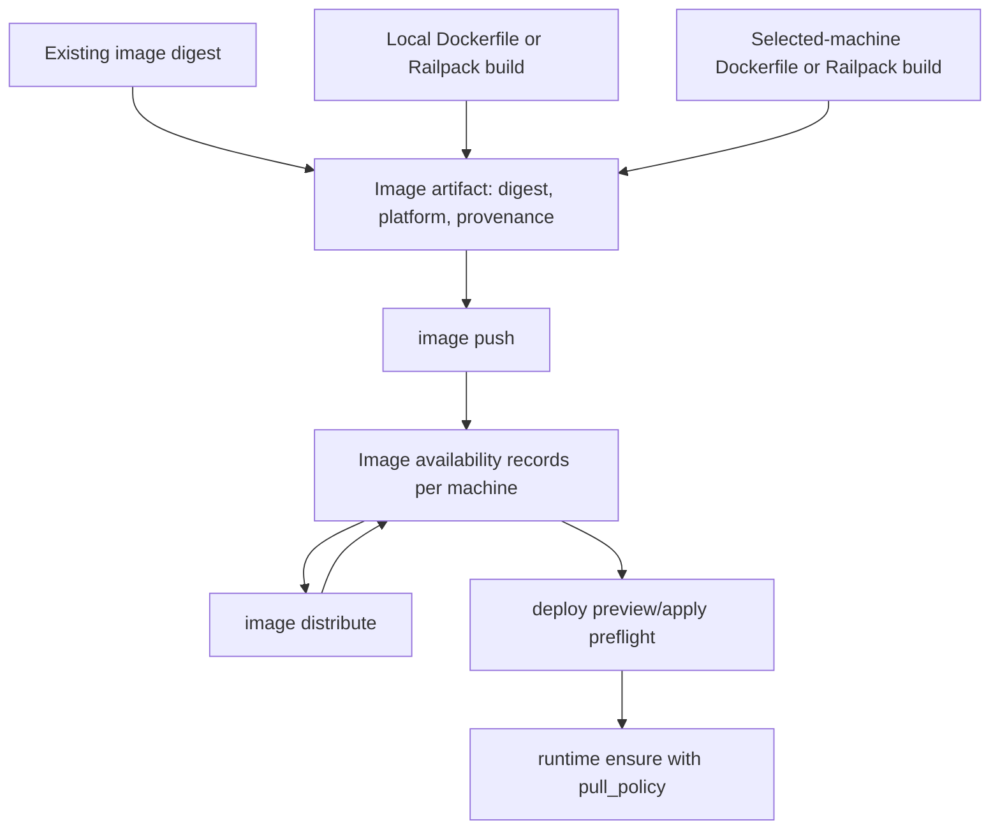
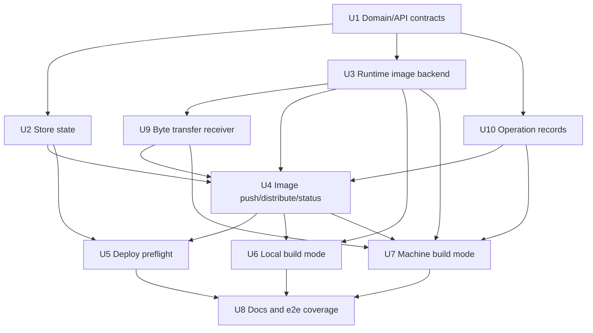
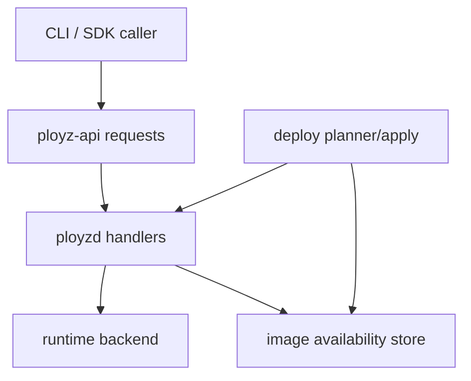

# feat: Core build and image availability primitives

## Summary

Add explicit core primitives for producing, moving, recording, and consuming container images without making Ployz Cloud builders part of the open-core product. The three supported modes are: use an existing image, build on the operator's machine and push it to the cluster, or bundle source and build on a selected user-owned machine.

Ployz-built and directly pushed images converge on an immutable image digest plus per-machine availability evidence. Deploy planning consumes that evidence and fails fast when a target machine does not already have the required image instead of silently building, pulling, or distributing during production deploy. Explicit registry-pull policies keep the existing pull path, but they are not used as a hidden fallback for Ployz-built images.

| Mode | Where build runs | Core responsibility | Deploy requirement |
|---|---|---|---|
| Use image | Outside Ployz | Accept a digest-pinned image reference and optional explicit pull policy | Image is pullable by explicit registry policy or already present |
| Build on my computer | Operator workstation | Run Dockerfile or Railpack locally, then push the result to selected machines | Digest is present on every planned target |
| Build on my server | User-owned cluster machine | Upload a source bundle, run Dockerfile or Railpack on that machine, record the resulting digest | Digest is present on every planned target |

---

## Problem Frame

Coolify/Dokploy-style local builds can consume CPU, memory, disk, and network on the same host serving production traffic. Ployz should avoid that failure class without requiring a cloud product: builds and image transfers must become explicit foreground operations with visible preconditions, durable outcomes, and no hidden deploy-time side effects.

This follows `VISION.md`: Ployz is an orchestration core for small clusters, not an autoscaler, controller, CI service, or cloud scheduler. Cloud builders can later consume the same core contracts, but they should not define the core.

---

## Assumptions

*This plan was authored from the current discussion without a separate requirements document. The items below are unvalidated plan-time bets that should be checked before implementation proceeds.*

- The first implementation should support Docker Engine as the runtime backend and treat other container runtimes as unsupported until explicit backends exist.
- The initial direct image transport can be unregistry-style or tar-stream based as long as the public core contract remains `push`, `distribute`, and `status`.
- Multi-architecture manifest support can be modeled but does not need full UX polish in the first implementation.
- The CLI surface can live in the existing `ployzd` command structure for now, with SDK client helpers added for the new daemon request contracts in the same delivery.
- Cache optimization for user-owned machine builds should use BuildKit cache primitives where available, but cache storage is not durable truth and should not be required for deploy correctness.

---

## Requirements

- R1. Support three build/image modes in the core product: existing image, local workstation build, and selected machine build.
- R2. Support only Dockerfile and Railpack build methods initially, with both treated as OCI artifact producers rather than separate platform products.
- R3. Represent build output as a digest-pinned image artifact with provenance, platform, and build method evidence.
- R4. Track image availability per `(machine, digest)` as explicit durable state updated only by explicit build, push, distribute, inspect/refresh, or failure events.
- R5. Expose explicit foreground `image push`, `image distribute`, `image inspect`, and `image status` operations with per-machine results and partial-failure visibility.
- R6. Deploy preview/apply must validate image availability for concrete target machines and fail with structured errors when required images are absent.
- R7. Deploy must not implicitly build, pull, distribute, or repair image availability unless the manifest explicitly uses a registry pull policy that already exists today.
- R8. Machine builds must upload a source bundle that is bounded by one enforced config/default limit, run Dockerfile or Railpack on a chosen user-owned machine, and surface build-stage failure to the caller.
- R9. Failures need an audience: caller-facing result for foreground work, durable operation record for long-running work, and status surfaces for later inspection.
- R10. Ployz Cloud hosted builders are out of scope for this plan, but future cloud builders should be able to return the same image artifact contract.

---

## Scope Boundaries

- No Ployz Cloud builder fleet, hosted billing, warm-pool scheduling, or customer isolation model.
- No hidden background image gossip, reconciler, or "eventual distribution" loop.
- No deploy-time automatic image build or distribution.
- No durable registry product in the core. A transient direct-push transport is acceptable; a managed registry service is not part of this plan.
- No general CI workflow engine, git provider integration, or build trigger automation.
- No attempt to make builds safe on production machines by background throttling alone. Operators choose where builds run; deploy stays explicit.
- No generalized source-build platform inside core: Dockerfile and Railpack are supported only as direct ways to produce OCI image artifacts.

### Deferred to Follow-Up Work

- Hosted Ployz Cloud builders: separate product/repo work that consumes the core `BuildArtifact` and image availability contracts.
- Advanced fan-out strategies: peer-to-peer chunk sharing, layer dedupe across machines, and WAN-aware distribution can follow the explicit `distribute` contract later.
- Image garbage collection policy: record enough provenance now, but defer retention policy UX and automated cleanup.
- Full cache productization: BuildKit registry cache, S3 cache, and branch-scoped caches are future performance layers, not correctness primitives.

---

## Context & Research

### Relevant Code and Patterns

- `VISION.md`: core primitives, live state, explicit commands, bounded effects, no hidden controllers.
- `crates/ployz-types/src/spec.rs`: `ContainerSpec` already has `image` and `PullPolicy::{IfNotPresent, Always, Never}`.
- `crates/ployz-types/src/model.rs`: shared durable model types for deploy, machine, routing, volume, and lifecycle records.
- `crates/ployz-api/src/request.rs` and `crates/ployz-api/src/response.rs`: daemon request/response contracts to extend for build/image operations.
- `crates/ployz-store-api/src/traits.rs`, `crates/ployz-store-api/src/memory.rs`, and `crates/ployzd/src/services/nats.rs`: store traits/backends and forwarding pattern.
- `crates/ployz-orchestrator/src/deploy/plan.rs`: deploy target resolution and the right layer for availability preflight.
- `crates/ployz-runtime-backends/src/runtime/engine.rs`: Docker image pull and container ensure behavior; existing `PullPolicy::Never` avoids runtime pull.
- `crates/ployzd/src/daemon/handlers/volume/zfs.rs`: foreground transfer/status pattern for multi-node transfer work.
- `crates/ployzd/src/daemon/handlers/machine/operations.rs`: durable long-running operation record pattern.

### Institutional Learnings

- `docs/solutions/architecture-patterns/preflight-authority-promotions-before-mutation-2026-05-08.md`: prove eligibility and preconditions before mutating cluster state.
- `docs/solutions/architecture-patterns/authority-status-separates-truth-from-observation-2026-05-08.md`: keep durable truth separate from live observation.
- `docs/solutions/integration-issues/drain-aware-deploy-self-target-drain-nats-timeout-2026-05-10.md`: deploy-time intent should be explicit input surfaced in preview/apply, not background reconciliation.

### External References

- [unregistry](https://github.com/psviderski/unregistry): validates direct image push to remote servers without an external registry; useful as transport inspiration, not as the core abstraction.
- [Docker BuildKit cache backends](https://docs.docker.com/build/cache/backends/): cache export/import must be explicit; supports registry/local/GHA and multiple cache sources.
- [Railpack production guide](https://railpack.com/guides/running-railpack-in-production/): Railpack can prepare a build plan and run through BuildKit frontend.
- [Railpack CLI reference](https://railpack.com/reference/cli): `railpack build` builds a container image from a project directory using BuildKit.

---

## Key Technical Decisions

- Build and deploy are separate primitives: build/push/distribute creates image availability evidence; deploy consumes evidence only.
- The image identity is the content digest, not the mutable tag. Tags may be user-facing aliases, but deploy correctness keys off digest.
- `PullPolicy::Never` is the natural deploy policy for Ployz-built or directly pushed images. It prevents Docker from hiding missing images behind an implicit pull.
- Image availability is per-machine state, not cluster-global state. A digest present on one machine says nothing about another machine.
- Transfer/build operation state is explicit and caller-visible. Partial distribution is a first-class result, not a log-only event.
- The orchestrator depends on store/API contracts for image availability, not Docker or BuildKit. Runtime backends implement image operations behind seams.
- Railpack support should use Railpack's BuildKit path rather than a separate bespoke builder abstraction.
- Cache is performance data, not deploy truth. Cache hits can make builds fast, but a cache miss must not change deploy semantics.

---

## Open Questions

### Resolved During Planning

- Should Cloud builders be part of this core plan? No. The core should define artifacts and availability; Cloud can later become another artifact producer.
- Can direct push to one connected server then distribute across the cluster work? Yes, as explicit commands with per-machine results and deploy-time preflight.
- Should deploy auto-distribute absent images? No. That recreates hidden production-side work and violates the explicit-command model.

### Deferred to Implementation

- Exact direct-transfer implementation: choose unregistry-style transient registry, Docker save/load streaming, or both after inspecting current daemon transport constraints.
- Exact CLI command names: keep the concepts stable, but let implementation fit the existing `clap` structure.
- Source bundle ignore semantics: start with Docker/Railpack-compatible defaults, then refine after seeing local command structure.
- Source bundle size value: choose the default limit during implementation, but define it in one config/default source and enforce it before upload.
- Runtime platform enforcement: record artifact platform now, but defer hard compatibility validation until machine membership or runtime inspection publishes a reliable machine platform.
- Build progress encoding: choose JSON/event stream shape once handler plumbing and CLI rendering are in hand.

---

## High-Level Technical Design

> *This illustrates the intended approach and is directional guidance for review, not implementation specification. The implementing agent should treat it as context, not code to reproduce.*

Deploy does not call back into `Push`, `Distribute`, `LocalBuild`, or `MachineBuild`. For `PullPolicy::Never` and Ployz-built/direct images, it only reads the availability state that those commands produced. For explicit registry-pull policies, it preserves the current pull behavior and never uses that pull path as fallback for a missing direct-build digest.

---

## Implementation Units

### U1. Build and Image Domain Contracts

**Goal:** Define the shared model/API vocabulary for build methods, build artifacts, image digests, image availability, transfer status, and structured failure classes.

**Requirements:** R1, R2, R3, R4, R9, R10

**Dependencies:** None

**Files:**
- Modify: `crates/ployz-types/src/model.rs`
- Modify: `crates/ployz-types/src/error.rs`
- Modify: `crates/ployz-types/src/spec.rs`
- Create: `crates/ployz-api/src/image.rs`
- Create: `crates/ployz-api/src/build.rs`
- Modify: `crates/ployz-api/src/lib.rs`
- Modify: `crates/ployz-api/src/request.rs`
- Modify: `crates/ployz-api/src/response.rs`
- Modify: `crates/ployz-sdk/src/lib.rs`
- Test: `crates/ployz-types/src/model.rs`
- Test: `crates/ployz-api/src/request.rs`
- Test: `crates/ployz-sdk/src/lib.rs`

**Approach:**
- Add explicit enums for `BuildMethod` with `Dockerfile` and `Railpack`, and `BuildLocation` with local and machine variants. Keep both methods thin: they produce OCI artifacts and do not become a broader source-build platform abstraction.
- Add digest-first image types that preserve optional tag/display name without making tag the identity.
- Add `ImagePresence` variants such as present, absent, transferring, failed, and unknown/unobserved only if the distinction is needed for live inspection results.
- Add operation payloads for image transfer/build results that carry per-machine outcomes.
- Add structured errors for invalid digest, unsupported build method, missing image availability, digest mismatch, build failed, transfer failed, insufficient disk, and unreachable target.

**Execution note:** Implement domain behavior test-first because these types become API and persisted surface area.

**Patterns to follow:**
- `crates/ployz-types/src/spec.rs` enum style with explicit serde names.
- `crates/ployz-types/src/error.rs` structured error variants.
- `crates/ployz-api/src/volume.rs` request/payload modeling for transfer-like operations.

**Test scenarios:**
- Happy path: Dockerfile build artifact with digest, platform, and local provenance serializes and deserializes without losing identity.
- Happy path: Railpack build artifact records Railpack-specific plan/info metadata as optional provenance without requiring it for Dockerfile builds.
- Edge case: mutable tag without digest is rejected where a digest-pinned artifact is required.
- Edge case: digest refs with and without display tags normalize to the same digest identity.
- Error path: unsupported build method deserializes to a structured error or is rejected by validation, not a string parse failure.
- Integration: `DaemonRequest`, `DaemonPayload`, and SDK helpers can round-trip image/build request and result variants.

**Verification:**
- Shared contracts compile, serialize consistently, and can express all three user-facing modes without cloud-specific fields.

### U2. Image Availability Store

**Goal:** Persist and query image availability records per machine and digest without folding live liveness checks into stored truth.

**Requirements:** R4, R5, R6, R9

**Dependencies:** U1

**Files:**
- Modify: `crates/ployz-store-api/src/traits.rs`
- Modify: `crates/ployz-store-api/src/lib.rs`
- Modify: `crates/ployz-store-api/src/driver.rs`
- Modify: `crates/ployz-store-api/src/memory.rs`
- Modify: `crates/ployz-nats/src/buckets.rs`
- Create: `crates/ployz-nats/src/store/images.rs`
- Modify: `crates/ployz-nats/src/store/mod.rs`
- Modify: `crates/ployz-nats/src/backend.rs`
- Modify: `crates/ployzd/src/services/nats.rs`
- Test: `crates/ployz-store-api/src/memory.rs`
- Test: `crates/ployz-nats/src/store/images.rs`
- Test: `crates/ployz-nats/src/buckets.rs`
- Test: `crates/ployzd/src/services/nats.rs`

**Approach:**
- Add an `ImageAvailabilityStore` trait with operations to upsert presence, get a `(machine, digest)` record, list machines for a digest, and list digests for a machine.
- Keep availability separate from `RoutingState`; image presence is operational evidence, not routing policy.
- Add an authority-durable NATS bucket for image availability records and implement `ImageAvailabilityStore for NatsStore`; memory-only support is insufficient because deploy preflight must read records written by real commands.
- Persist operation timestamps and provenance so deploy errors can explain which command last touched the image.
- Preserve prior `Present` records unless an explicit inspect/build/transfer command records a contradictory outcome.

**Patterns to follow:**
- `DeployStore` trait forwarding through `StoreDriver`.
- `MemoryStore` sorted identity replacement helpers.
- NATS store forwarding in `crates/ployzd/src/services/nats.rs`.
- NATS bucket naming/classification in `crates/ployz-nats/src/buckets.rs`.

**Test scenarios:**
- Happy path: upserting `Present` for `(machine-a, digest-x)` makes it queryable by exact key, by digest, and by machine.
- Happy path: upserting `Failed` for one machine does not affect `Present` on another machine.
- Edge case: repeated upsert for the same key replaces by contract identity and keeps deterministic list order.
- Error path: store backend failure propagates as structured store/operation error.
- Integration: `StoreDriver` forwards image availability operations to the configured backend.
- Integration: `NatsStore` persists image availability records in the configured authority scope and `NatsRuntime` forwards through the store driver.

**Verification:**
- The store can answer deploy preflight questions without probing Docker, SSH, or peer daemons.

### U3. Runtime Image Backend Seam

**Goal:** Add backend operations for inspecting, receiving, and exporting images without letting orchestrator code depend on Docker details. Build-specific backend calls remain scoped to U6 and U7.

**Requirements:** R3, R4, R5, R9

**Dependencies:** U1

**Files:**
- Modify: `crates/ployz-runtime-api/src/lib.rs`
- Create: `crates/ployz-runtime-api/src/image.rs`
- Modify: `crates/ployz-runtime-backends/src/runtime/mod.rs`
- Modify: `crates/ployz-runtime-backends/src/runtime/engine.rs`
- Modify: `crates/ployz-runtime-backends/src/runtime/image_ref.rs`
- Test: `crates/ployz-runtime-backends/src/runtime/image_ref.rs`

**Approach:**
- Introduce runtime API traits for image inspection, image import/export or direct receive, and disk preflight.
- Implement Docker backend support for digest inspection and `PullPolicy::Never` presence checks before container start.
- Keep transport mechanics behind the runtime/daemon layer. Unregistry-style direct push is an implementation option, not the public abstraction.
- Leave BuildKit/Railpack invocation to the local and selected-machine build units so the core image backend can ship before build productization.

**Patterns to follow:**
- `ContainerEngine::pull_image` and `ContainerEngine::ensure` for Docker command boundaries.
- `parse_docker_image_ref` tests for image reference normalization.
- Runtime trait style in `ployz-runtime-api`.

**Test scenarios:**
- Happy path: digest-pinned image ref parses and reports the digest used for availability lookup.
- Happy path: Docker backend reports an existing local image as present without attempting pull.
- Edge case: tag-only image reference is valid for explicit registry pull but invalid for direct availability record creation.
- Error path: digest mismatch after import/export returns a hard structured error.
- Error path: backend without image receive/export support returns unsupported capability rather than starting a partial transfer.

**Verification:**
- Runtime APIs can be mocked by orchestrator/daemon tests and implemented by Docker without leaking Docker commands into core planning logic.

### U9. Byte Transfer Receiver

**Goal:** Choose and implement the first byte transport for image archives and source bundles so push/distribute/machine-build commands have a concrete, authenticated receiver path.

**Requirements:** R5, R8, R9

**Dependencies:** U1, U3

**Files:**
- Modify: `crates/ployzd/src/daemon/mod.rs`
- Modify: `crates/ployzd/src/daemon/setup.rs`
- Modify: `crates/ployzd/src/daemon/runtime.rs`
- Modify: `crates/ployzd/src/runtime_profile.rs`
- Modify: `crates/ployzd/src/main.rs`
- Modify: `crates/ployzd/src/cli.rs`
- Create: `crates/ployzd/src/daemon/handlers/image/transfer_listener.rs`
- Modify: `crates/ployzd/src/daemon/handlers/image.rs`
- Test: `crates/ployzd/src/daemon/setup.rs`
- Test: `crates/ployzd/src/daemon/handlers/image/transfer_listener.rs`

**Approach:**
- Use streamed OCI/Docker archive transfer as the first transport: sender exports image bytes, receiver imports through the runtime backend, then verifies the digest.
- Reuse the existing ZFS transfer listener lifecycle shape rather than introducing a durable registry. The listener binds according to runtime profile, starts/stops with mesh lifecycle, and uses overlay-reachable addressing for peer transfers.
- Use daemon peer requests to authorize and prepare a transfer before bytes flow. The receiver should reject unknown transfer IDs, wrong source machine IDs, oversized headers/bundles, digest mismatches, and stale claims.
- Keep unregistry-style transient registry as future optimization only. The public API remains push/distribute/status/inspect, so transport can change later.

**Patterns to follow:**
- `crates/ployzd/src/daemon/handlers/volume/transfer_listener.rs` for listener lifecycle, validation, and bounded headers.
- `crates/ployzd/src/daemon/setup.rs` for mesh-start listener startup/shutdown and rollback behavior.
- `crates/ployzd/src/runtime_profile.rs` for loopback vs overlay bind decisions.

**Test scenarios:**
- Happy path: authorized image transfer streams bytes, imports image, verifies digest, and returns success.
- Happy path: listener starts on loopback for Docker runtime profile and overlay address for host runtime profile.
- Edge case: duplicate transfer claim for the same operation is rejected or returns the existing terminal result deterministically.
- Error path: unauthorized transfer ID is rejected before reading the full stream.
- Error path: digest mismatch after import returns failure and does not mark image present.
- Error path: stream interrupted records an interrupted/failed operation outcome visible to the caller.
- Integration: mesh startup starts the image transfer listener and rolls it back if a later edge runtime startup step fails.

**Verification:**
- Image movement has a concrete transport that matches existing daemon lifecycle patterns and does not require a bundled registry.

### U10. Image and Build Operation Records

**Goal:** Add durable operation records for image transfers and builds so long-running and partial work remains visible after command return or daemon restart.

**Requirements:** R5, R8, R9

**Dependencies:** U1

**Files:**
- Modify: `crates/ployz-types/src/model.rs`
- Modify: `crates/ployz-api/src/image.rs`
- Modify: `crates/ployz-api/src/build.rs`
- Modify: `crates/ployz-api/src/request.rs`
- Modify: `crates/ployz-api/src/response.rs`
- Create: `crates/ployzd/src/daemon/handlers/image/operations.rs`
- Create: `crates/ployzd/src/daemon/handlers/build/operations.rs`
- Modify: `crates/ployzd/src/daemon/handlers/image.rs`
- Modify: `crates/ployzd/src/daemon/handlers/build.rs`
- Modify: `crates/ployzd/src/app.rs`
- Test: `crates/ployzd/src/daemon/handlers/image/operations.rs`
- Test: `crates/ployzd/src/daemon/handlers/build/operations.rs`

**Approach:**
- Add `ImageOperationRecord` for push/distribute/inspect refresh and `BuildOperationRecord` for local/machine builds where the daemon owns long-running state.
- Records include operation id, initiator, source, targets, digest/artifact when known, status enum, per-target outcomes, last error, timestamps, and terminal vs running state.
- Add get/list API and CLI surfaces for image/build operations.
- On daemon startup, mark running local records as interrupted unless an operation-specific recovery path can prove they are still active. Do not silently retry.

**Patterns to follow:**
- `crates/ployzd/src/daemon/handlers/volume/zfs.rs` `TransferRecord`, `TransferStore`, and startup recovery behavior.
- `crates/ployzd/src/daemon/handlers/machine/operations.rs` for operation persistence and status projection.

**Test scenarios:**
- Happy path: image distribute records per-target success/failure and list/get returns the same data.
- Happy path: machine build records build stages and final artifact when successful.
- Edge case: daemon startup converts stale running records to interrupted with previous context preserved.
- Error path: operation id collision is handled deterministically without overwriting unrelated records.
- Error path: partial target failure records failed target while successful targets remain successful.
- Integration: push/distribute/build handlers return operation payloads that match operation store contents.

**Verification:**
- Every foreground operation that can outlive a single RPC has a durable audience beyond logs.

### U4. Explicit Image Push, Distribute, and Status Commands

**Goal:** Expose foreground commands for inspecting and moving images into and across the cluster, with visible partial failure and operation records.

**Requirements:** R4, R5, R9

**Dependencies:** U1, U2, U3, U9, U10

**Files:**
- Create: `crates/ployzd/src/daemon/handlers/image.rs`
- Modify: `crates/ployzd/src/daemon/handlers/mod.rs`
- Modify: `crates/ployzd/src/daemon.rs`
- Modify: `crates/ployzd/src/cli.rs`
- Modify: `crates/ployzd/src/request_builder.rs`
- Modify: `crates/ployz-api/src/request.rs`
- Modify: `crates/ployz-api/src/response.rs`
- Test: `crates/ployzd/src/daemon/handlers/image.rs`
- Test: `crates/ployzd/src/request_builder.rs`

**Approach:**
- Add `image status` to report recorded per-machine presence for a digest or all digests without mutating durable state.
- Add `image inspect` or `image refresh` to explicitly probe one or more machines for a digest and update availability records from the observed result.
- Add `image push` for operator/local source to selected machine. The handler records transfer start, success, failure, and digest verification.
- Add `image distribute` for source machine to target machines. Distribution is explicit fan-out with per-target result; partial success is returned and stored.
- Validate preconditions before transfer: target machine exists, peer reachable at decision time, source image digest present, target disk preflight passes, and platform metadata is recorded. Platform compatibility enforcement is deferred until machines publish a reliable runtime platform source.
- Do not skip transfer silently based only on stale presence. If a transfer decides to skip because `Present` is already recorded, return that as an explicit per-target outcome.

**Patterns to follow:**
- `crates/ployzd/src/daemon/handlers/volume/zfs.rs` transfer request/status pattern.
- `crates/ployzd/src/daemon/handlers/machine/operations.rs` operation record persistence.
- Deploy peer request failure handling in `crates/ployzd/src/daemon/handlers/deploy.rs`.

**Test scenarios:**
- Happy path: inspect records present for an existing digest and absent for a missing digest on the requested machine.
- Happy path: push to one target records transferring then present with verified digest.
- Happy path: distribute from one present source to two targets records present for both targets.
- Edge case: target already present returns explicit skipped/present outcome and leaves record intact.
- Error path: missing source digest fails before contacting targets.
- Error path: inspect target unreachable returns a visible failure and does not rewrite unrelated availability records.
- Error path: one target unreachable produces partial result while successful targets remain recorded as present.
- Error path: digest verification mismatch records failure and does not mark target present.
- Integration: CLI request builder encodes image push/distribute/inspect/status requests and daemon handler returns typed payloads.

**Verification:**
- Operators can answer "which machines have this image?" and "what failed during distribution?" without reading logs.

### U5. Deploy Image Availability Preflight

**Goal:** Make deploy preview/apply fail fast when the selected target machines cannot run the required image under the chosen pull policy.

**Requirements:** R4, R6, R7, R9

**Dependencies:** U1, U2, U4

**Files:**
- Modify: `crates/ployz-orchestrator/src/deploy/mod.rs`
- Modify: `crates/ployz-orchestrator/src/deploy/plan.rs`
- Modify: `crates/ployz-orchestrator/src/deploy/execute.rs`
- Modify: `crates/ployz-types/src/model.rs`
- Modify: `crates/ployz-types/src/error.rs`
- Modify: `crates/ployzd/src/daemon/handlers/deploy.rs`
- Test: `crates/ployz-orchestrator/src/deploy/tests.rs`
- Test: `crates/ployzd/src/daemon/handlers/deploy.rs`

**Approach:**
- After placement resolution, collect every service slot that will start or replace a container and determine its image requirement.
- For `PullPolicy::Never`, require `Present` availability for the exact digest on every planned target.
- For registry-pull policies, preserve existing behavior but surface a warning when the manifest is tag-only and deploy reproducibility is weaker.
- Add deploy preview output that lists missing image availability by service, slot, machine, and digest.
- Apply must repeat the preflight at decision time and fail before participant mutation if availability changed or is missing.

**Patterns to follow:**
- Placement and volume preflight errors in `crates/ployz-orchestrator/src/deploy/plan.rs`.
- Managed domain validation in `crates/ployz-orchestrator/src/deploy/mod.rs`: plan first, then validate cross-cutting preconditions.
- Structured deploy failure payloads in `crates/ployzd/src/daemon/handlers/deploy.rs`.

**Test scenarios:**
- Happy path: service with `PullPolicy::Never` and present digest on selected machine previews and applies.
- Happy path: registry-pull service with `PullPolicy::IfNotPresent` keeps current behavior.
- Edge case: replicated service with two target machines and digest present on only one fails with the missing machine identified.
- Edge case: unchanged existing slot on same machine does not require redistributing when the exact digest is already present.
- Error path: missing digest for `PullPolicy::Never` fails during preview before runtime participant calls.
- Error path: availability present during preview but absent during apply fails apply before candidate start.
- Integration: daemon `DeployPreview` and `DeployApply` return structured missing-image details that CLI can render.

**Verification:**
- Deploy can never accidentally start a production-side build or transfer; absence is surfaced as an operator action item.

### U6. Local Workstation Build Mode

**Goal:** Let the operator build with Dockerfile or Railpack on their own machine, produce a digest artifact, and push/distribute it explicitly.

**Requirements:** R1, R2, R3, R5, R9

**Dependencies:** U1, U3, U4, U10

**Files:**
- Modify: `crates/ployzd/src/cli.rs`
- Modify: `crates/ployzd/src/request_builder.rs`
- Create: `crates/ployzd/src/build.rs`
- Create: `crates/ployzd/src/build/dockerfile.rs`
- Create: `crates/ployzd/src/build/railpack.rs`
- Test: `crates/ployzd/src/build.rs`
- Test: `crates/ployzd/src/request_builder.rs`

**Approach:**
- Add local build command flow that selects Dockerfile or Railpack, builds with BuildKit-compatible output, resolves the resulting digest, and then invokes `image push` to at least one cluster machine.
- Allow optional distribution only after the pushed image is present on a cluster machine; a workstation is not a valid `image distribute` source.
- Use `railpack build` or Railpack prepare plus BuildKit frontend depending on which gives better digest/provenance control in implementation.
- Default local build output should be digest-first and suitable for `PullPolicy::Never` deploys.
- Keep build logs foreground to the caller. Record only artifact evidence and image transfer outcomes in core state.

**Patterns to follow:**
- Existing `request_builder.rs` argument-to-manifest/request conversion.
- `crates/ployz-runtime-backends/src/runtime/engine.rs` process boundary and error conversion style.

**Test scenarios:**
- Happy path: Dockerfile local build produces a digest artifact and constructs push request for selected target.
- Happy path: Railpack local build produces a digest artifact with Railpack provenance.
- Edge case: missing Dockerfile for Dockerfile mode fails before starting transfer.
- Edge case: unsupported platform argument is rejected before build.
- Error path: build command exits non-zero and returns structured build failure with stage/context.
- Error path: build succeeds but digest cannot be resolved, so no image availability is recorded.
- Integration: local build followed by push uses the same `ImageArtifact` contract consumed by deploy preflight.
- Integration: local build with optional fan-out first pushes to one cluster source, then invokes `image distribute` from that cluster source to additional targets.

**Verification:**
- A user can keep heavy build CPU/RAM on their workstation while making the image explicitly available to deployment targets.

### U7. Selected Machine Build Mode

**Goal:** Let the operator bundle source and run Dockerfile or Railpack on a selected user-owned machine without blocking production deploy semantics.

**Requirements:** R1, R2, R3, R8, R9

**Dependencies:** U1, U3, U4, U9, U10

**Files:**
- Create: `crates/ployzd/src/daemon/handlers/build.rs`
- Modify: `crates/ployzd/src/daemon/handlers/mod.rs`
- Modify: `crates/ployzd/src/daemon.rs`
- Modify: `crates/ployzd/src/cli.rs`
- Modify: `crates/ployz-api/src/build.rs`
- Modify: `crates/ployz-api/src/request.rs`
- Modify: `crates/ployz-api/src/response.rs`
- Create: `crates/ployzd/src/build/source_bundle.rs`
- Test: `crates/ployzd/src/daemon/handlers/build.rs`
- Test: `crates/ployzd/src/build/source_bundle.rs`

**Approach:**
- Add source bundle creation with explicit include/exclude rules and a size preflight driven by one config/default limit.
- Add build request that names the selected machine, build method, context path, platform, optional build args, and desired image name. Do not add a general secrets workflow in this plan.
- Remote machine receives the bundle into an isolated build workspace, runs Dockerfile or Railpack build, verifies digest, records image availability for itself, and returns the artifact.
- Machine build should not imply distribution. The caller can run `image distribute` after success.
- Surface build-stage errors distinctly: bundle upload, unpack, dependency/tooling missing, build failed, digest verification failed, cleanup failed.

**Patterns to follow:**
- Peer request and participant precondition handling in deploy handlers.
- Volume transfer progress/status style for remote long-running operations.
- Machine operation record pattern for durable status.

**Test scenarios:**
- Happy path: source bundle sent to selected machine builds and records `Present` for resulting digest on that machine.
- Happy path: Railpack machine build records plan/info provenance when available.
- Edge case: selected machine is not a cluster member and request fails before upload.
- Edge case: source bundle exceeds the configured/default size limit and fails locally before remote mutation.
- Error path: remote machine lacks required build backend and returns unsupported capability.
- Error path: build fails after upload and records failed build status without marking image present.
- Error path: cleanup failure is visible but does not erase the primary build result.
- Integration: successful machine build artifact can be passed to `image distribute` and then satisfy deploy preflight.

**Verification:**
- A user can move build work off the production-serving machine they care about, while Ployz still treats the result as explicit image availability.

### U8. Documentation and End-to-End Coverage

**Goal:** Document the open-core build/image model and cover the core workflows end-to-end without pulling Cloud builder readiness into this plan.

**Requirements:** R1, R5, R6, R7, R9, R10

**Dependencies:** U4, U5, U6, U7, U9, U10

**Files:**
- Create: `docs/builds-and-images.md`
- Modify: `docs/routing-and-deploys.md`
- Modify: `crates/ployz-e2e/src/lib.rs`
- Create: `crates/ployz-e2e/tests/build_images.rs`
- Test: `crates/ployz-e2e/tests/build_images.rs`

**Approach:**
- Document the three modes, what each one records, and which commands operators run before deploy.
- Document only the open-core artifact and image availability contracts. Cloud builders remain a separate future plan that may consume those contracts.
- Add e2e coverage for local/direct image availability and deploy preflight. Keep machine build e2e bounded if runtime dependencies make it expensive.
- Include operator-facing failure examples: missing digest, partial distribution, unreachable target, and missing image at apply time.

**Patterns to follow:**
- `docs/routing-and-deploys.md` split between stored intent/status/live observation.
- Existing e2e scenario style under `crates/ployz-e2e`.

**Test scenarios:**
- Happy path: build or seed an image, push to one target, deploy with `PullPolicy::Never`, and verify deploy succeeds.
- Happy path: distribute a present digest to a second target and deploy a replicated service.
- Error path: deploy with `PullPolicy::Never` and missing target image fails before candidate start.
- Error path: partial distribution leaves one target present and one failed, and status reports both.
- Integration: documented CLI examples map to request/response behavior covered by daemon tests.

**Verification:**
- The docs describe the same contracts the tests exercise, and e2e proves deploy preflight blocks the original production-crashing failure mode.

---

## System-Wide Impact

- **Interaction graph:** CLI builds requests, daemon handlers perform image/build operations, transfer receivers move bytes, runtime backends touch Docker/BuildKit, operation stores record progress, availability stores record presence, and orchestrator deploy preflight reads availability.
- **Error propagation:** Foreground build/push/distribute returns structured failures to caller and records durable status for later status commands.
- **State lifecycle risks:** Partial distribution is expected state. Records must not be overwritten by unrelated liveness observations.
- **API surface parity:** Daemon API, CLI, SDK consumers, and docs need the same vocabulary for artifacts, digests, and machine presence.
- **Integration coverage:** Unit tests prove contracts; daemon tests prove request handling; e2e proves deploy no longer hides missing image work.
- **Unchanged invariants:** Existing registry-pull deploys continue to work. `PullPolicy::Never` becomes the explicit mode for preloaded/Ployz-built images.

---

## Alternative Approaches Considered

- Use GitHub Actions or external CI as the recommended path: good for avoiding production load, but it makes the core product depend on an external workflow and does not solve user-owned server builds.
- Add Ployz Cloud builders now: strategically attractive later, but wrong for open core because Cloud would define the primitive instead of consuming it.
- Bundle a durable private registry into core: simpler deploy pulls, but too much product and operations surface for this stage.
- Auto-distribute during deploy: convenient, but recreates the hidden production-side work that this plan is meant to eliminate.
- Only support local builds: fastest first slice, but it leaves "build on my server" unmodeled and makes later Cloud builders harder to fit cleanly.

---

## Success Metrics

- Deploying an image with `PullPolicy::Never` cannot start unless every planned target has the digest recorded as present.
- Operators can see image availability per machine before deploy.
- Local and machine build flows both produce the same artifact shape.
- A failed or partial image distribution is visible in command output and status records.
- No Cloud-specific concepts appear in core contracts.

---

## Dependencies / Prerequisites

- Docker Engine image inspect/import/export support on target machines.
- BuildKit available for Dockerfile builds that need modern features and for Railpack builds.
- Railpack CLI or Railpack BuildKit frontend availability for Railpack mode.
- Existing cluster membership and peer reachability mechanisms for remote transfer/build commands.
- A configured image transfer listener port/bind policy alongside the existing ZFS transfer listener configuration.
- Store backend support for new image availability records in memory and NATS-backed runtime.

---

## Risks & Dependencies

| Risk | Mitigation |
|------|------------|
| Streamed archive transfer is slower than layer-aware registry push | Keep public API at artifact/push/distribute/status level so an unregistry-style transport can replace the first transport later without changing deploy semantics. |
| Deploy preflight becomes stale between preview and apply | Repeat preflight during apply immediately before participant mutation. |
| Tag-only images weaken reproducibility | Require digest for Ployz-built/direct images and warn for tag-only registry-pull deploys. |
| Builds on selected production machines still affect traffic | Make machine choice explicit and visible; do not pretend throttling solves correctness. Future policies can recommend non-serving builders. |
| Partial distribution confuses deploy behavior | Model partial state explicitly and make deploy errors identify missing machines. |
| Cache complexity delays correctness work | Treat cache as optional performance metadata and defer productized cache management. |
| Railpack integration changes upstream | Use documented CLI/BuildKit frontend paths and isolate Railpack-specific behavior in one build module. |

---

## Phased Delivery

- Phase 1: U1, U2, U3, U10. Establish contracts, durable store state, operation records, SDK parity, and runtime image capabilities.
- Phase 2: U9, U4, U5. Ship byte transport, explicit image push/distribute/inspect/status, and deploy availability preflight.
- Phase 3: U6. Add local workstation build flow for Dockerfile and Railpack.
- Phase 4: U7. Add selected-machine source bundle build flow.
- Phase 5: U8. Complete docs and e2e coverage for the open-core contracts.

---

## Documentation / Operational Notes

- `docs/builds-and-images.md` should lead with operator workflow, not implementation internals.
- Docs should explicitly say image distribution is an operator command, not background reconciliation.
- Docs should recommend non-serving machines for selected-machine builds when users want to protect production traffic.
- Status output should give next actions: push missing digest, distribute from a present source, rebuild, or change pull policy.

---

## Sources & References

- Product direction: `VISION.md`
- Project instructions: `AGENTS.md`
- Related deploy state docs: `docs/routing-and-deploys.md`
- Existing deploy phasing plan: `docs/plans/2026-05-09-002-feat-deploy-phasing-plan.md`
- Existing migration command plan: `docs/plans/2026-05-10-001-feat-migrate-service-command.md`
- External direct-push reference: [unregistry](https://github.com/psviderski/unregistry)
- External cache reference: [Docker BuildKit cache backends](https://docs.docker.com/build/cache/backends/)
- External Railpack reference: [Running Railpack in Production](https://railpack.com/guides/running-railpack-in-production/)
- External Railpack CLI reference: [Railpack CLI Reference](https://railpack.com/reference/cli)
