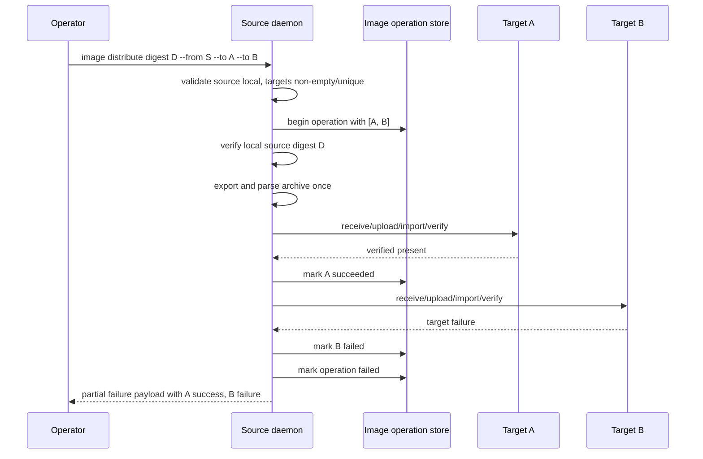

# Multi-target image distribute

## Summary

Expand `image distribute` from a single-target primitive into an explicit
multi-target fanout primitive.

The deploy and branch path now treats image availability as a preflighted,
durable prerequisite. That is correct, but it leaves operators and cloud
automation with an awkward remediation step: if one deploy needs the same digest
on several machines, the current daemon still forces one distribute request per
target. The public request and payload types already model multiple targets; the
daemon handler is the remaining single-target choke point.

This slice should make `image distribute --to ... --to ...` the supported
primitive for preparing a digest across all machines a deploy or branch plan
needs, while preserving the product direction:

- explicit command, no hidden deploy-time distribution;
- durable image availability only after verified runtime presence;
- typed per-target outcomes, including partial failure;
- source machine remains the local coordinating daemon for now.

## Problem Frame

Deploy image availability preflight can now tell the caller exactly which
machines are missing a digest. Branch preparation can compile service placements
that imply the same requirement across multiple target machines. Without a
multi-target distribute primitive, higher-level callers have to build their own
loop around single-target distribution.

That is the wrong ownership boundary. The orchestration core should own the unit
of work and evidence model:

- one operator intent: distribute digest `D` from source `S` to targets
  `[A, B, C]`;
- one operation record;
- ordered per-target results;
- one structured success, failure, or partial-failure response.

The cloud side can then call one core primitive and display one operation,
instead of reimplementing fanout, idempotency, and partial failure policy.

## Goals

1. Allow `ImageDistributeRequest.target_machines` to contain one or more unique
   machines.
2. Export and parse the source image archive once, then reuse that source
   artifact across target transfers.
3. Record durable image availability per target only after runtime digest
   verification on that machine. Remote targets get there through import and
   verify; a local source-as-target path may verify locally without receiver
   RPC.
4. Return ordered per-target evidence for success, skipped-present, and failure
   outcomes.
5. Preserve visible partial failure instead of collapsing it into a generic
   transport or daemon error.
6. Add an e2e scenario that proves multi-target distribute is usable as deploy
   preflight remediation.

## Non-goals

- Remote-source orchestration where the coordinator is not the source machine.
- Parallel fanout.
- Retry or resume of only failed targets.
- Hidden deploy or branch auto-distribution.
- Image layer deduplication beyond the existing receive/upload/import flow.
- Cloud UI or dashboard integration.

## Requirements

### Request validation

- `target_machines` must contain at least one target.
- Duplicate target machines must be rejected before operation creation.
- `source_machine` must still equal the local daemon machine.
- Validation failures must happen before operation side effects.
- Validation errors must be structured daemon errors with stable codes and
  actionable context.
- Zero-target, duplicate-target, non-local-source, and partial-failure errors
  must have stable error codes and context fields callers can branch on without
  parsing display text.

### Distribution semantics

- The source digest is verified locally before export.
- Target availability is checked before export. If every target is already
  present, the handler does not export or parse an archive.
- If any target needs transfer, the source image is exported once per distribute
  operation.
- The exported archive is parsed once and reused for each transfer target.
- Source-stage failures after operation creation, such as local verify, export,
  or archive parse failure, must finalize every requested target as `Failed`
  with the same source-stage context before the operation is marked `Failed`.
- Targets are processed serially in request order.
- Each target result is independent: after a target fails, fanout continues to
  remaining targets and every requested target receives a `Present`,
  `SkippedPresent`, or `Failed` result.
- A target that already has durable present availability for the digest is
  skipped and reported as `SkippedPresent`.
- A skipped-present target must not open a receive session, upload bytes, or
  rewrite availability evidence.
- A transferred target is reported as `Present` only after import and digest
  verification succeed.
- If the source machine is included as a target and durable availability is not
  already present, the handler may verify the local runtime digest and record
  `Present` without receiver RPC or import.
- A failed target is reported as `Failed` with target-specific error evidence.

### Operation record semantics

- One image operation is created with all requested targets.
- Target outcomes are updated incrementally as each target completes or fails.
- If every target is `Present` or `SkippedPresent`, the operation status is
  `Succeeded`.
- If any target fails, the operation status is `Failed`.
- Partial failure returns a typed partial-failure daemon error with an
  `ImageDistributePayload` containing both successes and failures.
- Runtime/image availability records are written only for verified present
  images. Remote target records require import plus digest verification; local
  source-as-target records require local runtime digest verification.

### CLI and API behavior

- The existing API shape is preserved: `ImageDistributeRequest` already carries
  `target_machines: Vec<MachineId>`.
- The CLI should accept repeated `--to` values as one distribute operation.
- Plain output should render all targets and make partial success visible.
- JSON output should preserve the existing payload structure.

### Deploy/branch relationship

- Deploy should continue to fail preflight when required image availability is
  missing. Branch consumers inherit this when compiled branch plans reach deploy
  preflight; branch-specific remediation UX is deferred.
- They should not silently distribute images during apply.
- The intended remediation is explicit: run `image distribute` to the missing
  target set, then retry preview/apply.

## High-level Design

## Implementation Units

### 1. Validate multi-target distribute requests

Files:

- `crates/ployzd/src/daemon/handlers/image/push.rs`
- `crates/ployzd/src/request_builder.rs`
- `crates/ployzd/src/main.rs`

Work:

- Replace the single-target destructuring guard with multi-target validation.
- Keep zero-target rejection before operation creation.
- Add duplicate-target rejection before operation creation.
- Keep non-local source rejection before operation creation.
- Add or update CLI/request-builder coverage for repeated `--to` arguments. The
  parser and request builder already carry a target vector; this is coverage and
  contract hardening, not new parser design.

Acceptance:

- Zero targets are rejected without operation side effects.
- Duplicate targets are rejected without operation side effects.
- Non-local source is rejected without operation side effects.
- Rejection errors expose stable codes and context: `source_machine` for
  non-local source, the duplicate target id for duplicates, and target count for
  empty requests.
- Multiple unique targets reach operation creation in request order.

### 2. Factor reusable per-target transfer execution

Files:

- `crates/ployzd/src/daemon/handlers/image/push.rs`

Work:

- Extract the current single-target receive/upload/import/verify path into a
  helper that executes one target and returns an `ImageTransferTargetResult`.
- Precheck durable availability for all targets before export.
- If at least one target needs transfer, verify the source digest, export, and
  parse the archive once before transfer attempts.
- Reuse the parsed archive metadata for every transfer target.
- Keep target-specific receive sessions and imports separate.
- Ensure failed target execution returns a target result instead of aborting the
  whole operation before aggregation.

Acceptance:

- The source export path is invoked once when at least one target needs
  transfer, and zero times when every target is already present.
- One target failure does not prevent later targets from being attempted.
- The response contains one ordered result for every requested target.
- Target-specific failures include the failing machine id and stage context.
- Source verify/export/parse failures mark every requested target failed and do
  not leave operation targets in a running state.

### 3. Add idempotent skipped-present behavior

Files:

- `crates/ployzd/src/daemon/handlers/image/push.rs`
- `crates/ployzd/src/daemon/handlers/image/operations.rs`

Work:

- Before opening a receive session for a target, check durable image
  availability using the same rule deploy preflight uses today:
  `(target_machine, digest)` with `ImagePresence::Present`.
- If present, return `ImageTransferTargetStatus::SkippedPresent`.
- Mark the operation target as succeeded with zero transfer/import side effects.
- Do not rewrite the existing availability record.
- If the source machine is a target and no durable record exists yet, verify the
  local runtime digest and record `Present` without receiver RPC.

Acceptance:

- Re-running distribute against an already-present target is cheap and visible.
- Existing availability evidence remains stable.
- Source-as-target can establish durable local availability from runtime digest
  verification without pretending a remote import happened.
- Skipped-present targets contribute to overall operation success.

### 4. Aggregate operation status and response payloads

Files:

- `crates/ployzd/src/daemon/handlers/image/push.rs`
- `crates/ployzd/src/cli_io.rs`

Work:

- Collect all target results in request order.
- Mark each target outcome incrementally in the operation store.
- Mark the whole operation `Succeeded` only when no target failed.
- Mark the whole operation `Failed` when any target failed.
- Return a typed partial-failure error that carries the full
  `ImageDistributePayload`.
- Update plain output rendering so multi-target distribute is readable and
  partial failures are obvious.
- Update the non-OK plain response path so `IMAGE_DISTRIBUTE_PARTIAL_FAILED`
  renders the embedded target payload instead of only printing the top-level
  message.

Acceptance:

- All-success distribute returns `Ok(ImageDistributePayload)`.
- Partial distribute failure returns a structured error with the same payload
  shape and all target outcomes.
- Partial failure uses a specific stable code, defaulting to
  `IMAGE_DISTRIBUTE_PARTIAL_FAILED`, with digest, failed target ids, and stage
  context.
- Plain error output for `IMAGE_DISTRIBUTE_PARTIAL_FAILED` includes the same
  target table/list as successful distribute output.
- Operation records show successful and failed target outcomes after a partial
  failure.

### 5. Add e2e deploy-preflight remediation coverage

Files:

- `crates/ployz-e2e/src/scenarios/*`
- `crates/ployz-e2e/src/main.rs`

Work:

- Add or rework an e2e scenario that starts with a deploy requiring a digest on
  multiple machines.
- Assert deploy preflight reports missing image availability.
- Run one multi-target `image distribute` command for the missing target set.
- Retry deploy and assert preflight passes.
- Include at least one skipped-present target if the source machine is also a
  deploy target.

Acceptance:

- The scenario proves the intended operator workflow:
  preview/apply reports missing image availability, explicit distribute fixes
  availability, deploy then proceeds.
- The scenario exercises repeated `--to` or the equivalent request shape.

## Test Plan

Focused tests:

- daemon image distribute request validation;
- daemon multi-target partial failure aggregation;
- daemon skipped-present idempotency;
- CLI/request-builder repeated target parsing;
- plain and JSON response rendering for multi-target payloads.

End-to-end:

- multi-target image distribute as deploy image availability remediation.

Full verification before PR:

- format check;
- focused crate tests for `ployzd` image handlers;
- affected e2e scenario;
- full repo test command required by `AGENTS.md` for daemon/runtime changes.

## Risks and Mitigations

### Archive lifetime and cleanup

Risk: exporting once and reusing the artifact across multiple targets could
leave temp files or cleanup responsibilities unclear.

Mitigation: keep archive ownership in the outer operation scope and drop/cleanup
after all target attempts complete.

### Partial failure can look like total failure

Risk: callers may only see an error and miss successful targets.

Mitigation: return a structured partial-failure error with full payload evidence,
and render target outcomes in plain output.

### Skipped-present can become stale-state laundering

Risk: skipping based on weak evidence would violate the availability model.

Mitigation: only skip from durable image availability records that were produced
by prior verified import/inspect/distribute paths. Do not infer presence from
live containers, transfer cache, or receiver blobs.

### Serial fanout can be slow

Risk: distributing to many machines serially is slower than necessary.

Mitigation: keep serial fanout for correctness and simpler operation evidence in
this slice; plan parallel fanout later once the failure model is proven.

### Duplicate target ambiguity

Risk: duplicate targets make operation status and payload evidence ambiguous.

Mitigation: reject duplicates before side effects instead of deduplicating
silently.

## Deferred Follow-ups

1. Parallel fanout with bounded concurrency and deterministic result ordering.
2. Remote-source orchestration where a caller can request distribution from a
   source daemon other than the coordinator.
3. Retry only failed targets from a prior operation id.
4. Deploy/branch preview output that emits a ready-to-run distribute remediation
   command.
5. Cloud workflow integration that turns missing image availability evidence
   into a single explicit `image distribute` operation.
6. Platform-aware image availability keys across the store, daemon, API, and
   deploy preflight. This slice intentionally follows the current deploy rule:
   `(machine, digest)` plus `ImagePresence::Present`.
