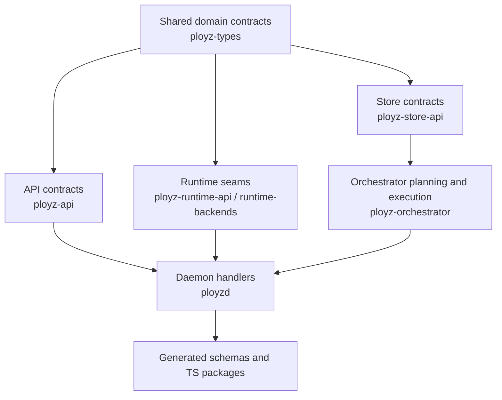
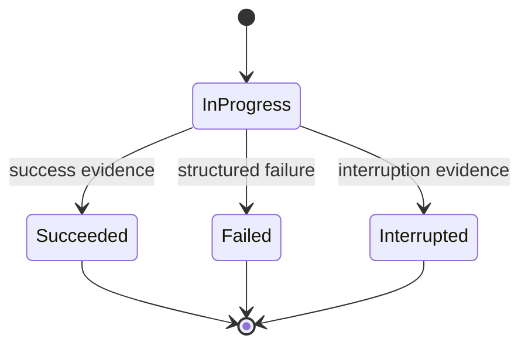
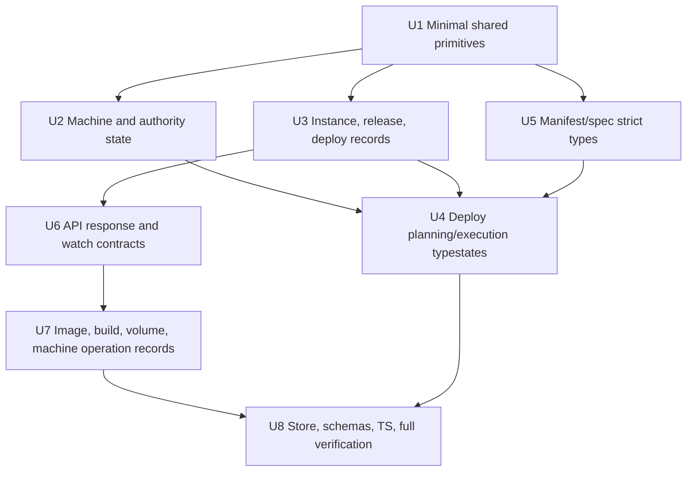

# refactor: Make invalid states unrepresentable

## Summary

Refactor the core domain, API, runtime, deploy, image, volume, and operation models in one sweeping greenfield change so invalid state combinations cannot be constructed. This intentionally does not preserve backwards-compatible JSON or transitional shims; the implementation should update all producers, consumers, stores, tests, generated schemas, and TypeScript surfaces to the new model in the same branch.

---

## Problem Frame

The audit found many important records modeled as `status + optional facts`, parallel `Option` fields, booleans, or free-form strings. Those shapes contradict the project direction: durable state should record operator intent and explicit lifecycle events, failures should be structured by audience, and defaults must not hide uncertainty.

Because this repo is greenfield and the user explicitly rejected backwards compatibility, the right fix is not adapter layering. The right fix is to tighten the model at the shared type boundaries and then force every caller to compile against the valid-state vocabulary.

---

## Requirements

- R1. Replace audited `status + optional facts` records with enums whose variants carry only the data valid for that state.
- R2. Replace parallel booleans/options that describe one concept with single domain enums or validated newtypes.
- R3. Remove greenfield-inappropriate compatibility shims, silent defaults, and permissive deserialization for the affected shared contracts.
- R4. Preserve the architecture boundary: domain state and protocols live in `crates/ployz-types`, `crates/ployz-api`, and seam crates; daemon/orchestrator code adapts to those contracts rather than inventing local truth.
- R5. Keep failures structured and branchable; do not replace invalid-state checks with display-string parsing.
- R6. Update all local producers, consumers, memory and NATS store behavior, generated schema/package surfaces, and tests in the same change.
- R7. Use characterization tests first where existing behavior is being intentionally broken so the implementation can distinguish deliberate contract changes from accidental regressions.
- R8. Preserve operator-facing command quality: each affected primitive must keep visible preconditions, bounded results, and a typed verification surface.
- R9. Treat secret-bearing and trust-boundary records as security-sensitive: typed state must include redaction, exposure, ownership, and authorization rules where applicable.

---

## Scope Boundaries

- No backwards-compatible JSON aliases, migration adapters, old-field fallbacks, or compatibility shims for the audited model changes.
- No new product features beyond making the existing modeled concepts stricter.
- No broad unrelated cleanup outside the audited invalid-state surfaces.
- No persistence migration path for old records; old durable data should either be reset by explicit dev/test namespace clearing or fail with a structured operator-visible stale-schema error.

### Deferred to Follow-Up Work

- Additional lint policy for banning future `status + Option` shapes: defer until the sweeping refactor lands and the remaining legitimate exceptions are visible.
- Documentation outside generated schemas and developer-facing references: update only where this refactor changes exported contracts used by local docs.

---

## Context & Research

### Relevant Code and Patterns

- `crates/ployz-types/src/model.rs` already uses useful enums for image presence, deploy phase state, storage participation, and lifecycle transitions; the refactor should extend that style into records that still keep terminal evidence outside the variant.
- `crates/ployz-types/src/spec.rs` validates manifests after construction today; this plan moves high-value validation into typed fields where possible.
- `crates/ployz-orchestrator/src/deploy/lifecycle.rs` has an existing typestate-like flow (`PreparedDeploy`, test-only `StartedCandidates`, `CommitPlan`) worth extending into non-test deploy execution shapes.
- `crates/ployz-orchestrator/src/deploy/plan.rs` is the main internal source of parallel `Option` state for planned services and volumes.
- `crates/ployz-api/src/response.rs`, `crates/ployz-api/src/deploy.rs`, `crates/ployz-api/src/runtime.rs`, `crates/ployz-api/src/image.rs`, `crates/ployz-api/src/machine.rs`, and `crates/ployz-api/src/volume.rs` expose several weak external contracts that should become tagged enums.
- `crates/ployz-api/src/request.rs` and `crates/ployz-api/src/build.rs` are also in scope because request construction and build operation payloads contain audited invalid states.
- `crates/ployz-store-api/src/memory.rs` is the fastest place to expose store contract fallout because it constructs and round-trips many domain records in tests.
- `crates/ployz-nats/src/store/machines.rs`, `crates/ployz-nats/src/store/deploys/mod.rs`, `crates/ployz-nats/src/store/images.rs`, `crates/ployz-nats/src/store/instances.rs`, and `crates/ployz-nats/src/store/routing.rs` are the production persistence boundary for the same shared records and must be updated explicitly.
- Shared records may also surface in `crates/ployz-gateway`, `crates/ployz-dns`, `crates/ployz-sim`, and `crates/ployzd/src/services/nats.rs`; the implementation should inventory affected crates with `rg` for each changed shared type and either update the crate or record why it remains unaffected.

### Institutional Learnings

- `docs/solutions/architecture-patterns/authority-status-separates-truth-from-observation-2026-05-08.md`: status surfaces must not fabricate truth from fallback config or fake rows; unknown observations should be attached to real objects.
- `docs/solutions/architecture-patterns/preflight-authority-promotions-before-mutation-2026-05-08.md`: persisted intent, compatibility, and placement eligibility should be proven before mutation; missing authority or placement intent should be rejected, not defaulted.

### External References

- No external research is needed. This is idiomatic Rust domain modeling using enums, newtypes, fallible deserialization, and typestate-style internal flows; the repo already has the necessary local patterns and constraints.

### Audited Surfaces

| Surface | Current invalid state | Operator / consumer impact | Unit |
|---------|-----------------------|----------------------------|------|
| `DaemonResponse` in `crates/ployz-api/src/response.rs` | `ok=true` with error code, or `ok=false` with success payload | Commands can appear successful and failed at once | U6 |
| `DeployFailurePayload` in `crates/ployz-api/src/deploy.rs` | Failure reason can omit required detail or carry unrelated detail | Agents/CLI cannot branch reliably on deploy failures | U6 |
| `RuntimeWatchFrame` in `crates/ployz-api/src/runtime.rs` | Collection and record can disagree | Runtime subscribers can receive incoherent events | U6 |
| `MachineTransitionSelf` in `crates/ployz-api/src/request.rs` | Activate can omit subnet; drain/standby can carry irrelevant subnet | Peer lifecycle commands rely on late validation | U2 |
| `MachineInstallOptions` in `crates/ployz-api/src/machine.rs` | Release can carry git fields; Git can omit URL | Install request construction is ambiguous | U6 |
| `ImageTransferTargetResult` in `crates/ployz-api/src/image.rs` | Failed can carry record; success can omit record | Image distribute status cannot be trusted | U7 |
| `ImageRef`, image/build operation records in `crates/ployz-types/src/model.rs` | Optional repository/tag/digest and kind/location/status fields can contradict | Image/build workflows expose ambiguous provenance and terminal state | U7 |
| `AuthorityNodePosture` and `MachineMembership` in `crates/ployz-types/src/model.rs` | Lifecycle/subnet/storage/authority fields can contradict | Placement, authority, and status surfaces can fabricate cluster truth | U2 |
| `InviteRecord` and `Identity` in `crates/ployz-types/src/model.rs` / `crates/ployz-runtime-api/src/identity.rs` | Consumed/revoked/key fields can contradict; secrets can leak if exposed raw | Invite and key material can become unsafe or misleading | U2 |
| `ServiceRelease`, `InstanceStatusRecord`, `DeployRecord`, `DeployPhaseRecord` in `crates/ployz-types/src/model.rs` | Terminal evidence lives outside state variants | Routing, cleanup, replay, and recovery can persist impossible truth | U3 |
| `DeployPreviewBaseline` in `crates/ployz-types/src/model.rs` | Fingerprint can disagree with components | Prepared deploy baseline validation can trust forged state | U3 |
| `DeployPhaseIntent`, `Placement`, `ServiceSpec`, `VolumeDeclaration` in `crates/ployz-types/src/spec.rs` | Invalid rollout, phase, replica, quota, owner, and mode shapes construct then fail late | Manifest authors get delayed errors and planner sees bad inputs | U5 |
| Planned service/slot/volume structs in `crates/ployz-orchestrator/src/deploy/plan.rs` | Action and optional evidence can disagree | Deploy preview/apply can silently skip malformed work | U4 |
| Phase execution state in `crates/ployz-orchestrator/src/deploy/execute.rs` | Progress evidence spread across parallel collections and booleans | Checkpoint/recovery can misclassify partial deploys | U4 |
| Lock-loss checkpoint evidence in `crates/ployzd/src/daemon/handlers/deploy.rs` | Unknown evidence collapses to false | Operator-visible deploy status can become falsely failed | U4 |
| ZFS transfer records in `crates/ployzd/src/daemon/handlers/volume/zfs.rs` and `crates/ployz-api/src/volume.rs` | Status, stage, success metrics, failure, and incremental base can contradict | Persistent data movement status can mislead operators | U7 |
| Machine operation records in `crates/ployzd/src/daemon/handlers/machine/operations.rs` | Kind, stage, artifacts, status, and errors can contradict | Machine add/update/remove operation history becomes ambiguous | U7 |
| `RuntimeContainerSpec` in `crates/ployz-runtime-backends/src/runtime/spec.rs` | Default creates blank invalid container spec; resource fields can be nonsensical | Runtime backend discovers invalid requests too late | U7 |

Nearby `Option`, string, or bool fields are out of scope unless they describe one of these audited surfaces or block compilation after the surface changes.

---

## Key Technical Decisions

- Greenfield contract break: update all affected serialized shapes directly and regenerate downstream schema/type outputs rather than accepting old shapes.
- Model one concept with one type: lifecycle state owns lifecycle facts, operation state owns terminal error/success facts, and source/kind variants own kind-specific data.
- Prefer fallible constructors and custom deserialization for public newtypes that must reject empty strings, zero counts, invalid ownership/quota strings, or non-canonical fingerprints.
- Keep public enum variants limited to states the system can produce today; do not add future-looking variants to make the refactor feel complete.
- Use characterization-first tests at the boundary of each old permissive shape, then replace those tests with strict rejection or compile-time construction tests as the new model lands.
- Treat store tests as contract tests: if `MemoryStore` or NATS store JSON helpers can persist an impossible record after this refactor, the type design is not done.
- Start with domain-specific enums; promote to a shared abstraction only after two current consumers prove they have identical semantics.
- Exported API enums should use one consistent serde tagging convention per surface family so CLI, generated schemas, and TypeScript declarations remain predictable.
- Each changed shared type family must update known consumers before the next family begins, or record the remaining compile failures and their owning unit.
- No-shim does not mean no consumer inventory: CLI, generated TypeScript, SDK/API examples, ployz-cloud-facing package contracts, fixtures, and stored NATS data must be updated, reset, or explicitly declared unaffected.
- Secret-bearing values use wrappers with redacted display/debug/public serialization. Raw private keys, raw invite tokens, registry upload tokens, and transfer nonces must not appear in API responses, generated public schemas, logs, or public fixtures unless the endpoint is explicitly private and tested as such.

---

## Open Questions

### Resolved During Planning

- Should backwards compatibility be preserved? No. The user explicitly confirmed this is greenfield and should be done in one sweeping change.
- Should this be split into many PRs? No. The plan uses multiple implementation units for sequencing, but the intended delivery is one sweeping refactor.

### Deferred to Implementation

- Exact enum and newtype names: choose concise names that fit local style once the affected call sites are being edited.
- Exact generated TypeScript diffs: regenerate after Rust types settle, then update packages to match the produced schema.
- Whether a few presentation-only strings remain: decide case-by-case during implementation, but durable state and API contracts should use typed variants.

---

## High-Level Technical Design

> *This illustrates the intended approach and is directional guidance for review, not implementation specification. The implementing agent should treat it as context, not code to reproduce.*

The sweeping refactor should move facts into the variant that proves them:

State-bearing records should follow the same pattern:

Terminal variants carry terminal evidence. In-progress variants carry only progress facts. Shared wrappers expose convenience methods such as `ready()`, `is_terminal()`, or `storage_capable()` when callers need derived booleans.

---

## Implementation Units

### U1. Add Minimal Shared Validated Primitives

**Goal:** Establish only the cross-cutting primitives needed before vertical domain slices can compile: non-empty identifiers, positive scalar wrappers, non-zero replica counts, and redacted secret wrappers.

**Requirements:** R1, R2, R3, R5, R7

**Dependencies:** None

**Files:**
- Modify: `crates/ployz-types/src/model.rs`
- Modify: `crates/ployz-types/src/spec.rs`
- Test: `crates/ployz-types/src/model.rs`
- Test: `crates/ployz-types/src/spec.rs`

**Approach:**
- Introduce small validated newtypes for values reused by multiple later units: non-empty identifiers, non-zero replica counts, positive scalar values, and redacted secret wrappers.
- Keep domain-specific scalar strictness with its owning unit: deploy baseline canonicalization belongs to U3, volume quota/mode/owner belongs to U5, runtime container resource/default cleanup belongs to U7, and traffic allocation totals belong to U3's release routing work.
- Do not introduce a generic operation-state abstraction in U1. Later units should start with domain-specific enums and extract only if identical current semantics appear in at least two domains.

**Execution note:** Start with characterization tests that construct the invalid values currently accepted, then invert those tests to assert rejection or impossible construction after the new primitives land.

**Patterns to follow:**
- `ImageDigest::try_new` and custom `Deserialize` in `crates/ployz-types/src/model.rs`.
- Exhaustive matching style in lifecycle transition helpers in `crates/ployz-types/src/model.rs`.

**Test scenarios:**
- Happy path: valid image digest, namespace, positive scalar values, redacted secret wrappers, and non-zero replica count deserialize and round-trip.
- Error path: empty names, zero replicas, negative shared scalar values, and attempts to display/serialize secret wrappers publicly are rejected or redacted.
- Integration: existing schema-generation tests and package generation accept the new primitive shapes after callers are updated.

**Verification:**
- Later units can depend on shared primitives without also inheriting deploy, runtime, or operation-specific policy from U1.
- Existing call sites compile only after supplying validated values.

### U2. Tighten Machine, Authority, Invite, and Identity State

**Goal:** Collapse independent machine membership, authority posture, invite status, and identity fields into valid-by-construction domain shapes.

**Requirements:** R1, R2, R3, R4, R5, R6

**Dependencies:** U1

**Files:**
- Modify: `crates/ployz-types/src/model.rs`
- Modify: `crates/ployz-runtime-api/src/identity.rs`
- Modify: `crates/ployz-api/src/request.rs`
- Modify: `crates/ployz-nats/src/store/machines.rs`
- Modify: `crates/ployz-nats/src/store/invites.rs`
- Modify: `crates/ployzd/src/daemon/handlers/machine/join/coordination.rs`
- Modify: `crates/ployzd/src/daemon/handlers/machine`
- Modify: `crates/ployzd/src/daemon/handlers/mesh`
- Modify: `crates/ployz-orchestrator/src/machine_policy.rs`
- Modify: `crates/ployz-store-api/src/memory.rs`
- Test: `crates/ployz-types/src/model.rs`
- Test: `crates/ployz-runtime-api/src/identity.rs`
- Test: `crates/ployz-nats/src/store/machines.rs`
- Test: `crates/ployz-nats/src/store/invites.rs`
- Test: `crates/ployzd/src/daemon/handlers/machine/tests.rs`
- Test: `crates/ployz-store-api/src/memory.rs`

**Approach:**
- Replace `MachineMembership.lifecycle + subnet` with lifecycle variants that own subnet when required.
- Replace `storage: bool + storage_participation` with a single storage role enum that can derive storage capability and authority posture.
- Replace `AuthorityNodePosture` parallel fields with variants such as authority storage, storage candidate, and compute, deriving bucket/loss impact from the variant.
- Replace `MachineTransitionSelf { goal, assigned_subnet, force }` with goal variants that carry only relevant fields.
- Replace invite consumed/revoked parallel option fields with `InviteStatus`.
- Store only key material needed to prove identity, or validate loaded public/private key consistency into a private-field `Identity`.
- Make `BootstrapSubnetClaim` release consume the held claim or use typestate so held-only APIs are unavailable after release.
- Add secret exposure rules for identity keys and invite tokens: use redacted display/debug/public serialization, avoid raw token/key material in API responses and generated public schemas, and prefer hashed/one-time verifier semantics for invite validation where the existing flow permits it.

**Execution note:** Characterize current machine/invite JSON records before changing deserialization, then deliberately update fixtures to strict greenfield shapes.

**Patterns to follow:**
- `MachineMembership::apply_lifecycle_transition` as the transition vocabulary to preserve.
- Authority-status learning in `docs/solutions/architecture-patterns/authority-status-separates-truth-from-observation-2026-05-08.md`.

**Test scenarios:**
- Happy path: active and draining machines always expose a subnet; standby machines expose none; storage authority derives authority posture and storage capability.
- Edge case: storage candidate and compute-only machine rows render distinct authority/status output without mixing stored-truth loss impact.
- Error path: deserializing authority participation on a non-storage role, active machine without subnet, standby machine with subnet, consumed invite without consumed timestamp, and mismatched identity keys fails.
- Error path: API/schema/log-facing serialization of invite tokens and private keys redacts or omits the raw secret value.
- Integration: machine list, mesh peer rendering, storage promotion validation, and memory-store routing snapshots all use the new lifecycle/storage role accessors.

**Verification:**
- Placement and coordination code no longer branches on loose combinations of lifecycle, subnet, storage, and participation.
- No caller can construct a released bootstrap subnet claim that still behaves like a held claim.

### U3. Tighten Instance, Service Release, Deploy, and Phase Records

**Goal:** Move lifecycle evidence, terminal timestamps, routing targets, and deploy summaries into state variants.

**Requirements:** R1, R2, R4, R5, R6, R7

**Dependencies:** U1

**Files:**
- Modify: `crates/ployz-types/src/model.rs`
- Modify: `crates/ployz-orchestrator/src/deploy/lifecycle.rs`
- Modify: `crates/ployz-orchestrator/src/deploy/execute.rs`
- Modify: `crates/ployz-orchestrator/src/deploy/plan.rs`
- Modify: `crates/ployzd/src/daemon/handlers/deploy`
- Modify: `crates/ployz-store-api/src/deploy_commit_facts.rs`
- Modify: `crates/ployz-store-api/src/memory.rs`
- Modify: `crates/ployz-nats/src/store/deploys/mod.rs`
- Modify: `crates/ployz-nats/src/store/instances.rs`
- Modify: `crates/ployz-nats/src/store/routing.rs`
- Test: `crates/ployz-types/src/model.rs`
- Test: `crates/ployz-orchestrator/src/deploy/tests.rs`
- Test: `crates/ployzd/src/daemon/handlers/deploy`
- Test: `crates/ployz-store-api/src/memory.rs`
- Test: `crates/ployz-nats/src/store/deploys/mod.rs`
- Test: `crates/ployz-nats/src/store/instances.rs`

**Approach:**
- Replace `InstanceStatusRecord.phase + ready + drain_state + error` with an instance lifecycle enum that derives readiness.
- Replace `ServiceRelease` parallel routing fields with a release routing target enum/builder that guarantees primary/referenced revisions and split allocations stay coherent.
- Replace `DeployRecord.state + committed_at + finished_at + summary_json` with progress variants carrying the data that proves each state.
- Replace `DeployPhaseRecord.state + commit_deploy_id + commit_policy` with phase-state variants carrying checkpoint/end/no-store commit evidence.
- Make `DeployPreviewBaseline` canonical by construction: callers use the constructor, and deserialization rejects mismatched `fingerprint + components`.
- Keep transition helpers, but make their output new typed records instead of mutating independent fields.

**Execution note:** Add failing tests for impossible records before the type rewrite; once fields move into variants, those tests should become deserialization rejection and transition tests.

**Patterns to follow:**
- Existing deploy transition helper style in `crates/ployz-types/src/model.rs`.
- `PreparedDeploy` flow in `crates/ployz-orchestrator/src/deploy/lifecycle.rs`.

**Test scenarios:**
- Happy path: runtime start produces a ready instance state, deploy commit produces a committed deploy state with summary and timestamp, and checkpoint phase success carries checkpoint commit evidence.
- Edge case: no-store phase success cannot carry a commit deploy ID; end-of-deploy phase success cannot pretend to be checkpoint committed.
- Error path: deserializing `Ready` with `ready=false`, `Failed` without error, committed deploy without commit timestamp, or checkpoint phase success without commit ID fails.
- Error path: deserializing a non-canonical deploy preview baseline fails.
- Integration: prepared deploy replay, durable commit recovery, phase repair from commit facts, and routing-state load all produce valid typed records.

**Verification:**
- No deploy/phase/instance terminal state can exist without its terminal evidence.
- Existing deploy apply and prepared apply tests pass after updating expected shapes.

### U4. Replace Deploy Planning and Execution Parallel State with Typestates

**Goal:** Make planned services, planned slots, planned volumes, phase execution, and lock-loss checkpoint classification structurally coherent.

**Requirements:** R1, R2, R4, R5, R7

**Dependencies:** U2, U3, U5

**Files:**
- Modify: `crates/ployz-orchestrator/src/deploy/plan.rs`
- Modify: `crates/ployz-orchestrator/src/deploy/execute.rs`
- Modify: `crates/ployz-orchestrator/src/deploy/lifecycle.rs`
- Modify: `crates/ployzd/src/daemon/handlers/deploy`
- Test: `crates/ployz-orchestrator/src/deploy/tests.rs`
- Test: `crates/ployzd/src/daemon/handlers/deploy`

**Approach:**
- Replace `PlannedService` optional fields with `Present` and `Removed` variants.
- Replace `PlannedSlot { current: Option<_>, action }` with slot variants for create, replace, keep, and remove.
- Replace `PlannedVolume { current, movement, clone_source }` with variants for existing/stay, existing/move, new/empty, and new/clone.
- First model phase execution with a domain enum/local struct in `execute.rs` so execution cannot mark a never-started phase succeeded or keep phase evidence in disconnected collections. Extract a ledger abstraction only if both execution and recovery need the same API.
- Replace boolean checkpoint detection with `CheckpointEvidence::{None, Found, Unknown}` or equivalent so lock loss cannot turn uncertain evidence into "safe failed".

**Execution note:** Characterize the current plan preview for representative create, replace, remove, move, clone, checkpoint, and no-store manifests before changing the internal representation.

**Patterns to follow:**
- Existing `DeployPhaseWork` variants in `crates/ployz-types/src/model.rs`.
- Existing phase-planning tests in `crates/ployz-orchestrator/src/deploy/tests.rs`.

**Test scenarios:**
- Happy path: create, replace, unchanged, and removed services each produce the expected preview and committed release without optional-field checks.
- Happy path: volume create, update, move, and clone each produce phase work from the variant directly.
- Edge case: removed service cannot carry a next revision; created service cannot lack a spec or next revision; unchanged slot always carries current slot evidence.
- Error path: lock-loss classification with phase-store read failure returns unknown evidence and does not mark deploy safely failed.
- Integration: deploy preview baseline, prepared apply baseline validation, phase records, and cleanup after durable commit all use the new plan variants without silent `continue` paths.

**Verification:**
- `plan.rs` no longer has planned-service or planned-volume structs with multiple independent optional facts for the same concept.
- Phase execution no longer relies on boolean "reached running" flags or disconnected mutable evidence collections.

### U5. Make Deploy Manifest Specs Strict by Construction

**Goal:** Move high-value manifest validation from post-hoc `validate()` checks into typed deployment spec shapes.

**Requirements:** R1, R2, R3, R4, R6, R7

**Dependencies:** U1

**Files:**
- Modify: `crates/ployz-types/src/spec.rs`
- Modify: `crates/ployz-orchestrator/src/deploy/plan.rs`
- Modify: `crates/ployzd/src/main.rs`
- Modify: `examples/test-deploy-manifest.json`
- Test: `crates/ployz-types/src/spec.rs`
- Test: `crates/ployz-orchestrator/src/deploy/tests.rs`

**Approach:**
- Replace `Placement::Replicated { count: u16 }` with a non-zero replica count.
- Replace deploy phase intent work/policy combinations with a commit-mode enum that cannot combine `NoStoreCommit` with work or `Checkpoint` with reversible rollback.
- Replace raw volume quota/mode/owner strings with typed values.
- Model blue-green rollout constraints in the rollout/network/mount shape so invalid combinations are unrepresentable rather than rejected late.
- Keep `DeployManifest::validate()` for cross-reference checks that need whole-manifest context, such as duplicate names, unknown references, dependency cycles, and self-clone prevention.
- Do not update generated schema or TypeScript artifacts in this unit; U8 owns regeneration after all Rust/API source contracts settle.

**Execution note:** Use existing `spec.rs` validation tests as a checklist. Tests that currently expect validation errors for local field shape should move to deserialization/newtype rejection; cross-reference tests should remain in `validate()`.

**Patterns to follow:**
- Existing manifest validation organization in `crates/ployz-types/src/spec.rs`.
- `ImageDigest` fallible deserialization in `crates/ployz-types/src/model.rs`.

**Test scenarios:**
- Happy path: valid replicated placement, phase commit mode, volume declaration, and blue-green service deserialize and validate.
- Edge case: empty checkpoint/no-store phases behave according to the new commit-mode variants without special policy combinations.
- Error path: zero replicas, invalid volume quota/mode/owner, reversible checkpoint rollback, no-store phase with work, and blue-green without readiness fail at deserialization or construction.
- Integration: deploy planning still catches duplicate names, unknown service/volume references, phase cycles, and self-clone references.

**Verification:**
- Invalid local field combinations cannot reach orchestrator planning.
- Whole-manifest validation remains focused on relationships, not scalar/domain primitive validation.

### U6. Replace Generic API Response, Request, and Watch Framing

**Goal:** Make generic response, request, and runtime-watch framing tagged and variant-specific, with required data attached to the matching variant.

**Requirements:** R1, R2, R3, R5, R6

**Dependencies:** U2, U3

**Files:**
- Modify: `crates/ployz-api/src/response.rs`
- Modify: `crates/ployz-api/src/deploy.rs`
- Modify: `crates/ployz-api/src/runtime.rs`
- Modify: `crates/ployz-api/src/machine.rs`
- Modify: `crates/ployz-api/src/request.rs`
- Modify: `crates/ployzd/src/cli_io.rs`
- Modify: `crates/ployzd/src/main.rs`
- Modify: `crates/ployzd/src/daemon/mod.rs`
- Modify: `crates/ployzd/src/daemon/handlers`
- Modify: `crates/ployzd/src/app.rs`
- Modify: `crates/ployzd/src/ipc/listener.rs`
- Modify: `crates/ployzd/src/ipc/nats_listener.rs`
- Modify: `crates/ployzd/src/request_builder.rs`
- Modify: `crates/ployzctl`
- Test: `crates/ployz-api/src/response.rs`
- Test: `crates/ployz-api/src/deploy.rs`
- Test: `crates/ployz-api/src/runtime.rs`
- Test: `crates/ployz-api/src/request.rs`
- Test: `crates/ployzd/src/main.rs`

**Approach:**
- Replace `DaemonResponse { ok, code, message, payload }` with success and error variants.
- Replace `DeployFailurePayload { reason, many Option fields }` with variants for baseline changed, prepared deploy failures, and image availability failures.
- Replace `RuntimeWatchFrame::Upsert { collection, record }` with collection-specific upsert/remove variants.
- Replace `MachineInstallOptions { source, version, git_url, git_ref }` with source-specific install config variants.
- Add runtime watch authorization and projection rules: operator-only by default, role-scoped projections for non-storage/runtime participants if such consumers exist, and public DTOs rather than raw store records where fields are sensitive.
- Update CLI and daemon rendering to exhaustively match the new shapes.
- Do not update image/build/volume operation payloads in this unit; U7 owns operation-specific API payloads after the underlying operation records are strict.

**Execution note:** Begin at API serialization tests so the intended breaking JSON contract is explicit before daemon/CLI fallout is addressed.

**Patterns to follow:**
- Existing tagged enum payload style in `DaemonPayload`.
- Existing structured deploy failure reason mapping in `crates/ployzd/src/daemon/handlers/deploy.rs`.

**Test scenarios:**
- Happy path: success daemon response carries a success payload; error response carries structured error details without pretending to be successful.
- Happy path: each deploy failure variant serializes only its relevant data.
- Error path: deserializing mismatched runtime collection/record pairs and git install source without URL fails.
- Error path: restricted runtime-watch callers cannot receive storage-private fields or raw store records that include secret-bearing values.
- Integration: CLI JSON/plain output for deploy failure, runtime watch, IPC response encode/decode, runtime subscribe open/error, and machine install option construction use the new variant shapes.

**Verification:**
- API tests cannot construct success/error contradictions.
- All daemon handlers compile only after returning the new response variants.
- Non-handler code in daemon dispatch, app orchestration, IPC, metrics outcome tracking, and request construction compiles against the new response/request framing.

### U7. Tighten Image, Build, ZFS Transfer, Machine Operation, and Runtime Backend Operation State

**Goal:** Replace operation records and transfer records that combine kind/status/stage/artifacts/errors as independent fields.

**Requirements:** R1, R2, R4, R5, R6, R7

**Dependencies:** U1, U6

**Files:**
- Modify: `crates/ployz-types/src/model.rs`
- Modify: `crates/ployz-runtime-api/src/image.rs`
- Modify: `crates/ployz-runtime-backends/src/deploy/local.rs`
- Modify: `crates/ployz-runtime-backends/src/runtime/spec.rs`
- Modify: `crates/ployzd/src/daemon/handlers/image`
- Modify: `crates/ployzd/src/daemon/handlers/image/registry.rs`
- Modify: `crates/ployzd/src/daemon/handlers/volume/zfs.rs`
- Modify: `crates/ployzd/src/daemon/handlers/volume/transfer_listener.rs`
- Modify: `crates/ployzd/src/daemon/handlers/machine/operations.rs`
- Modify: `crates/ployz-api/src/build.rs`
- Modify: `crates/ployz-api/src/image.rs`
- Modify: `crates/ployz-api/src/volume.rs`
- Test: `crates/ployz-types/src/model.rs`
- Test: `crates/ployz-runtime-api/src/image.rs`
- Test: `crates/ployz-runtime-backends/src/runtime/spec.rs`
- Test: `crates/ployzd/src/daemon/handlers/image/registry.rs`
- Test: `crates/ployzd/src/daemon/handlers/volume/zfs.rs`
- Test: `crates/ployzd/src/daemon/handlers/volume/transfer_listener.rs`
- Test: `crates/ployzd/src/daemon/handlers/machine/operations.rs`

**Approach:**
- Replace image operation target and operation records with kind-specific data and state variants that own progress, success, failure, and interruption facts.
- Replace `ImageTransferTargetResult { status, record, error }` with present/skipped/failed variants.
- Replace build operation `kind + location` duplication with a single source/location variant.
- Replace `ImageRef { repository: Option<_>, tag: Option<_>, digest }` with digest-only vs repository-digest variants.
- Replace `ImageDiskPreflight::Sufficient { required_bytes: Option<_> }` with variants that distinguish unknown requirement, unknown capacity, sufficient, and insufficient.
- Replace ZFS transfer `status + stage + optional success/failure facts` with a tagged transfer state exposed consistently in daemon internals and `VolumeZfsTransferInfo`.
- Replace machine operation generic artifacts and arbitrary string stages with kind-specific artifacts and typed running/terminal state.
- Replace image registry upload `failed: bool` with upload-state variants so failed uploads cannot be appended or finished as active uploads, and bind append/finish to uploader identity, unguessable session id, expiry, expected digest/size, authorization, and final digest verification.
- Extend ZFS transfer sessions with authorized source/destination machine identities, expected dataset and snapshot GUID, nonce/session id, byte/checksum verification where the backend exposes it, and listener rejection for unauthenticated or mismatched transfers.
- Add structured error exposure policy for operation errors: internal cause, operator-safe message, machine-readable code, and redacted serialization for public/CLI/API output.
- Remove `Default` implementations that create invalid production specs, especially `RuntimeContainerSpec::default()`.

**Execution note:** Use operation list/status tests to capture current observable behavior, then update snapshots/expectations to the stricter tagged contracts.

**Patterns to follow:**
- `ImagePresence` in `crates/ployz-types/src/model.rs`.
- ZFS receive decision enum in `crates/ployzd/src/daemon/handlers/volume/transfer_listener.rs`.

**Test scenarios:**
- Happy path: image push/distribute operations report running, target success, and operation success with only relevant fields.
- Happy path: full and incremental ZFS transfers expose running and succeeded states with required snapshot/byte evidence.
- Edge case: unknown disk requirement and unknown capacity are distinct from sufficient capacity.
- Error path: failed image target cannot carry a success record; succeeded transfer cannot omit snapshot GUID or bytes; failed upload cannot be appended; local build operation cannot claim machine location.
- Error path: stolen or mismatched registry upload token/session cannot append or finish another upload.
- Error path: unauthenticated or source/destination-mismatched ZFS transfer is rejected before receiving data.
- Error path: operation failures containing secret-like strings serialize redacted operator-safe output while retaining internal cause where appropriate.
- Integration: daemon image status, image registry upload, volume transfer list, machine operation get/list, and build operation payloads all serialize tagged operation states.

**Verification:**
- No operation record has independent `status`, `last_error`, and kind-specific optional artifacts for the same concept.
- Runtime backend specs cannot be default-constructed into invalid container requests.

### U8. Update Stores, Generated Contracts, Fixtures, and Full-Graph Verification

**Goal:** Complete the sweep by updating persistence seams, generated TypeScript/schema outputs, examples, and cross-crate tests to the new greenfield contracts.

**Requirements:** R3, R4, R6, R7

**Dependencies:** U2, U3, U4, U5, U6, U7

**Files:**
- Modify: `crates/ployz-store-api/src/memory.rs`
- Modify: `crates/ployz-store-api/src/traits.rs`
- Modify: `crates/ployz-store-api/src/deploy_commit_facts.rs`
- Modify: `crates/ployz-nats/src/store/machines.rs`
- Modify: `crates/ployz-nats/src/store/deploys/mod.rs`
- Modify: `crates/ployz-nats/src/store/images.rs`
- Modify: `crates/ployz-nats/src/store/instances.rs`
- Modify: `crates/ployz-nats/src/store/invites.rs`
- Modify: `crates/ployz-nats/src/store/routing.rs`
- Modify: `crates/ployz-api/examples/runtime_schema.rs`
- Modify: `packages/deploy/package.json`
- Modify: `packages/deploy/index.d.ts`
- Modify: `packages/deploy/runtime.d.ts`
- Modify: `packages/deploy/deploy-manifest.schema.json`
- Modify: `packages/deploy/runtime.schema.json`
- Modify: `examples/test-deploy-manifest.json`
- Modify: `docs/routing-and-deploys.md`
- Modify: relevant `docs/plans/*.md` only if they contain executable examples consumed by tests
- Test: `crates/ployz-store-api/src/memory.rs`
- Test: `crates/ployz-nats/src/store`
- Test: `crates/ployz-api/examples/runtime_schema.rs`
- Test: `crates/ployz-e2e`

**Approach:**
- Update memory-store and NATS-store records, routing events, subscriptions, and deploy commit facts to store only the new valid-state shapes.
- Add a greenfield stale-schema outcome for old durable data: explicit dev/test reset, namespace/schema-version bump, or structured operator-visible stale-schema error. Do not silently coerce old records into new shapes.
- Regenerate schema and TypeScript outputs from the updated Rust contracts.
- Update fixtures and examples directly; do not preserve old examples.
- Add contract tests that deserialize representative new JSON shapes and reject representative old impossible shapes.
- Add a consumer inventory and breakage acceptance checklist covering CLI, generated TypeScript, SDK/API examples, ployz-cloud-facing package contracts, examples, fixtures, and stored NATS data. Each item must be updated, reset, or explicitly declared unaffected.
- Add an affected-crate inventory generated from target-type searches and include every touched crate in this unit's verification notes or mark it unaffected with rationale.
- Add operator-facing verification checks for affected primitives: deploy, machine, image, and volume operations should each expose typed preconditions, result variants, and verification output that agents can branch on without parsing display strings.
- Run full graph verification because this touches shared crates, daemon handlers, runtime backends, and generated package surfaces.

**Execution note:** Treat this as the integration closeout for the single sweeping refactor. Do not leave TODOs for downstream crates to adapt later.

**Patterns to follow:**
- Existing memory-store round-trip tests in `crates/ployz-store-api/src/memory.rs`.
- Existing schema generation example in `crates/ployz-api/examples/runtime_schema.rs`.

**Test scenarios:**
- Happy path: memory and NATS stores can persist and list machines, invites, instances, releases, deploys, prepared deploys, image operations, build operations, and volume transfers in the new shapes.
- Error path: representative old impossible JSON shapes fail deserialization where public deserialization exists.
- Error path: stale NATS durable data returns the chosen structured stale-schema outcome rather than being silently defaulted.
- Error path: public API/schema/log outputs cannot expose raw private keys, invite tokens, upload tokens, transfer nonces, or unredacted backend secret-like error strings.
- Integration: runtime schema generation and TypeScript package outputs match the new API/model contracts.
- Integration: representative CLI JSON examples and one SDK/agent-style consumer flow parse and branch on the new variants without display-string parsing.
- Integration: full deploy preview/apply, machine join/update, image push/distribute, and volume transfer scenarios compile and pass against the strict types.

**Verification:**
- Workspace tests pass without compatibility adapters.
- Generated schemas and TypeScript declarations reflect the new tagged contracts.
- NATS store tests pass against the new serialized shapes or explicit stale-schema behavior.
- Consumer inventory is complete, with each affected crate updated or explicitly marked unaffected.
- No audited invalid-state shape remains constructible in normal production code.

---

## System-Wide Impact

- **Interaction graph:** `ployz-types` changes fan out to API, store, orchestrator, daemon handlers, runtime backends, generated schemas, TypeScript declarations, examples, and E2E fixtures.
- **Error propagation:** structured failure variants should replace optional error strings for domain failures; backend wrappers may still use presentation strings at the final transport boundary.
- **State lifecycle risks:** deploy and phase records are the riskiest changes because they interact with durable commit recovery, checkpoint cleanup, and prepared deploy replay.
- **API surface parity:** CLI JSON/plain renderers, SDK-facing types, generated schemas, and package declarations must land in the same branch as Rust contract changes.
- **Integration coverage:** unit tests prove construction safety; memory-store and orchestrator tests prove cross-layer behavior; E2E tests prove daemon/CLI paths still compose.
- **Consumer inventory:** CLI, generated TypeScript, SDK/API examples, ployz-cloud-facing package surfaces, examples, fixtures, NATS durable data, `ployz-gateway`, `ployz-dns`, `ployz-sim`, `ployz-nats`, and `ployzd/src/services/nats.rs` must be updated or explicitly marked unaffected.
- **Unchanged invariants:** the product remains command-shaped with explicit operations; this refactor should not introduce reconcilers, background policy mutation, or new deploy semantics.

---

## Risks & Dependencies

| Risk | Mitigation |
|------|------------|
| Refactor touches most shared contracts and can create broad compile fallout | Start from shared primitives and records, then adapt each downstream layer in dependency order inside the same branch |
| Strict deserialization may break stale tests and fixtures in confusing ways | Update fixtures deliberately and add rejection tests for old impossible shapes |
| Typestate refactor can over-abstract simple runtime states | Use enums and newtypes first; reserve generic typestate only for flows that have real compile-time sequencing value |
| Deploy recovery behavior can regress while terminal evidence moves into variants | Add focused tests for durable commit replay, checkpoint repair, cleanup pending, and lock-loss unknown evidence |
| Generated schema/package updates may drift from Rust contracts | Regenerate after Rust compiles and add schema/package verification to the closeout unit |
| One sweeping branch defers too much integration risk to the end | Add compile/test checkpoints after each unit: workspace compiles, or all remaining compile errors are listed with owning unit before moving on |
| No-shim persistence break can strand stale durable data | Choose explicit dev/test reset, schema-version namespace bump, or structured stale-schema error; never silently default old records |
| Stronger typed errors can expose secrets more consistently | Separate internal cause, operator-safe message, and machine-readable code; test redaction for deploy/image/volume/machine failures |

---

## Documentation / Operational Notes

- Update generated schemas and TypeScript declarations as part of the same branch.
- Update docs only where they show executable JSON examples or describe affected exported contracts.
- No compatibility rollout migration is needed because this is explicitly greenfield, but stale durable data behavior must still be operator-visible and deterministic.

---

## Sources & References

- Project direction: `VISION.md`
- Repo instructions: `AGENTS.md`
- Audit inventory: `Audited Surfaces` section in this plan
- Related learning: `docs/solutions/architecture-patterns/authority-status-separates-truth-from-observation-2026-05-08.md`
- Related learning: `docs/solutions/architecture-patterns/preflight-authority-promotions-before-mutation-2026-05-08.md`
- Core domain records: `crates/ployz-types/src/model.rs`
- Manifest specs: `crates/ployz-types/src/spec.rs`
- API contracts: `crates/ployz-api/src/response.rs`, `crates/ployz-api/src/deploy.rs`, `crates/ployz-api/src/runtime.rs`, `crates/ployz-api/src/request.rs`, `crates/ployz-api/src/machine.rs`, `crates/ployz-api/src/build.rs`, `crates/ployz-api/src/image.rs`, `crates/ployz-api/src/volume.rs`
- Deploy planning/execution: `crates/ployz-orchestrator/src/deploy/plan.rs`, `crates/ployz-orchestrator/src/deploy/execute.rs`, `crates/ployz-orchestrator/src/deploy/lifecycle.rs`
- Runtime/image/volume operations: `crates/ployz-runtime-api/src/image.rs`, `crates/ployz-runtime-backends/src/runtime/spec.rs`, `crates/ployzd/src/daemon/handlers/image`, `crates/ployzd/src/daemon/handlers/volume`
