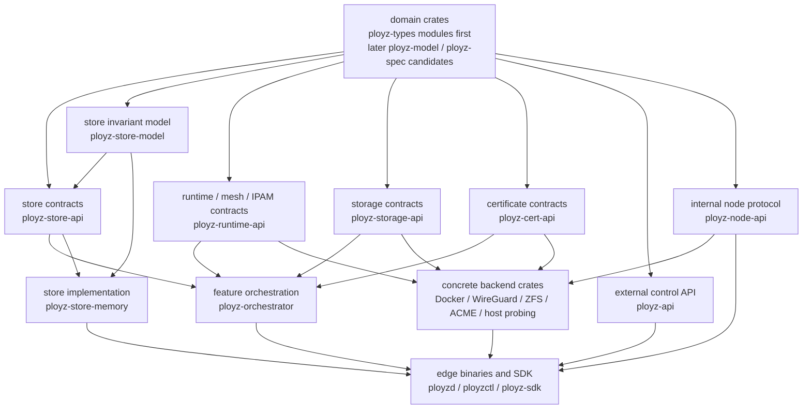
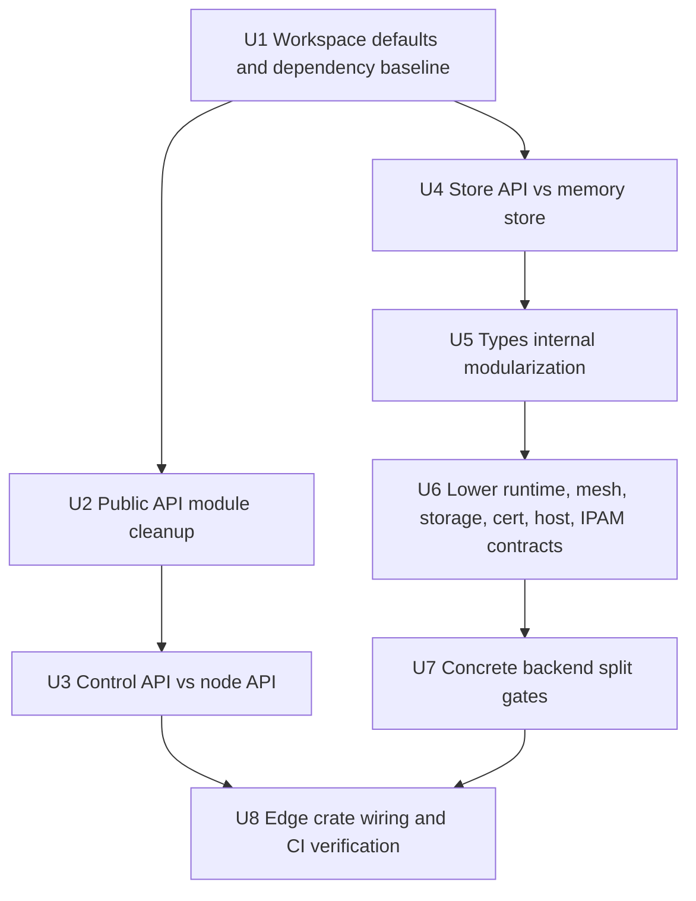
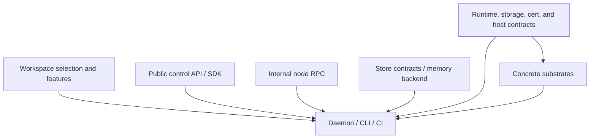

# refactor: Reorganize Rust Crate Boundaries

## Summary

Reorganize the workspace around idiomatic Rust package boundaries: a deliberate fast default build, narrow public API crates, separate external control and internal node protocols, lower contract crates below implementations, and concrete backend crates that own their heavy dependencies.

This plan treats Rust/Cargo ecosystem guidance and observed repo structure as the authority. It intentionally does not use `AGENTS.md` or `VISION.md` as planning inputs.

---

## Problem Frame

The current workspace has too many responsibilities crossing crate boundaries. Root Cargo commands select nearly every package, `ployz-api` exposes a mixed public/internal protocol through root glob re-exports, concrete backend crates depend upward on orchestration crates, and store/type crates mix contracts, implementations, and large domain modules. The result is a larger compile surface, fuzzier public API, and harder-to-change dependency graph.

---

## Requirements

- R1. Root workspace defaults must support a fast normal developer loop without excluding crates through ad hoc command recipes.
- R2. Shared dependency versions must be centralized while feature selection stays local to the crates that need those features.
- R3. External/operator API must be separated from internal node RPC so SDK and CLI users do not see peer-only protocol variants.
- R4. Public crate roots must expose coherent modules or explicit facade items, not accidental `pub use *` surfaces.
- R5. Backend contracts must live below orchestration and concrete implementation crates so Docker, WireGuard, ACME, ZFS, and host probing code do not depend upward on orchestration policy.
- R6. Store contracts must be separated from in-memory implementation and deploy-store invariant helpers.
- R7. Type/model splitting must first untangle module cycles inside `ployz-types`; physical crate extraction should happen only after the internal module shape is coherent.
- R8. Each stage must preserve behavior and wire compatibility unless a stage explicitly declares a public protocol break.
- R9. The migration must include feature-flow and duplicate-dependency measurement before and after major dependency or backend splits.

---

## Scope Boundaries

- Do not pursue a hard LOC limit for crates or files.
- Do not create `*-api` crates for concepts that do not already have concrete cross-crate consumers.
- Do not split `ployz-control-api` into per-feature crates in this plan.
- Do not split hypothetical future substrates; only split existing concrete backends or I/O boundaries.
- Do not create focused contract crates such as `ployz-mesh-api` unless the implementation first identifies at least two current consumers and concrete types or traits that cannot live cleanly in an existing lower contract crate.
- Do not use broad compatibility shims as a default. Add temporary aliases only where a staged migration needs them inside the repo.
- Do not change product behavior, command semantics, transport authorization, or storage semantics as part of this rearrange.

### Deferred to Follow-Up Work

- Public semver hardening for external consumers: run after the internal API shape stabilizes, using tools such as `cargo public-api` or `cargo-semver-checks`.
- A full `ployzd` lifecycle library redesign: defer until daemon-owned feature logic has moved into narrower crates and the binary/library boundary is easier to see.
- Rustdoc polish and crate-level README coverage for every new crate: add after the crate list settles.

---

## Context & Research

### Rust and Cargo Guidance

- Cargo workspaces are meant to manage related packages together with a shared lockfile, target directory, and root package selection. `default-members` controls which packages root commands operate on when no package is selected.
- `[workspace.dependencies]` centralizes dependency versions, but features are additive with member-level declarations and workspace dependencies cannot be optional. That supports centralizing versions while keeping feature choices local.
- Cargo feature guidance warns that default features are automatically enabled unless disabled everywhere they appear, and recommends inspecting complex feature flow with `cargo tree -e features`. Resolver v2-style behavior avoids some unwanted feature unification but can compile duplicated dependencies with different features, so `cargo tree --duplicates` remains part of the verification loop.
- Rust API Guidelines define public dependencies as dependencies whose types appear in a crate's public API and warn that public dependencies can appear unexpectedly.
- PingCAP's Rust style guide recommends public submodules and minimal crate-root re-exports for larger crates, and reserves glob imports for deliberate prelude-like cases.

### Relevant Code and Patterns

- `Cargo.toml` lists 22 workspace members and includes almost every crate in `default-members`, including `crates/ployz-sim` and `crates/ployz-e2e`.
- `justfile` already works around the current default build surface with `just test`, which excludes `ployzd` and `ployz-runtime-backends`.
- `.github/workflows/pr.yml` runs broad workspace clippy and `just test-all`, so CI remains an explicit full-coverage surface even if root defaults shrink.
- `crates/ployz-api/src/lib.rs` re-exports every internal module with root `pub use module::*`.
- `crates/ployz-api/src/request.rs` mixes public/operator requests and internal peer/node requests in `DaemonRequest`.
- `crates/ployz-nats/src/coord/rpc.rs` serializes `DaemonRequest` and `DaemonResponse` directly for node RPC.
- `crates/ployz-sdk/src/lib.rs` re-exports `DaemonRequest`, `DaemonResponse`, `DaemonPayload`, and many payloads, which exposes peer-only protocol concepts through the SDK facade.
- `crates/ployz-runtime-backends/Cargo.toml` depends on both `ployz-orchestrator` and `ployz-api`, while also carrying Docker, WireGuard, userspace networking, host probing, HTTP, and crypto dependencies.
- `crates/ployz-cert-backends/Cargo.toml` depends on `ployz-orchestrator` to implement ACME issuer contracts currently defined inside orchestration code.
- `crates/ployz-store-api/src/lib.rs` publicly exposes `memory`, and `crates/ployz-store-api/src/memory.rs` is a large in-memory implementation inside the traits crate.
- `crates/ployz-types/src/model.rs` and `crates/ployz-types/src/spec.rs` are large mutually coupled modules, so immediate physical crate extraction would likely create awkward cycles.

### External References

- Cargo Workspaces: <https://doc.rust-lang.org/cargo/reference/workspaces.html>
- Cargo Features: <https://doc.rust-lang.org/cargo/reference/features.html>
- Cargo Tree: <https://doc.rust-lang.org/cargo/commands/cargo-tree.html>
- Rust API Guidelines, public dependencies: <https://rust-lang.github.io/api-guidelines/necessities.html>
- PingCAP Rust modules and crates style: <https://pingcap.github.io/style-guide/rust/modules.html>

---

## Key Technical Decisions

| Decision | Rationale |
|---|---|
| Make workspace defaults narrow before moving code | This gives immediate developer-loop benefit and creates a measurement baseline for later splits. |
| Centralize versions, not broad feature sets | Workspace dependency features are additive, so broad root features hide dependency cost from individual crates. |
| Keep `ployz-api` as the external control API | The existing name is the natural public/API-facing crate; internal RPC should move out. |
| Add `ployz-node-api` for peer/node protocol | Node RPC crosses crate boundaries and is not just a private module detail of `ployz-nats`. |
| Move backend contracts down before splitting concrete backends | Splitting Docker/WireGuard/ZFS/ACME first would preserve the wrong dependency direction. |
| Modularize `ployz-types` before extracting `ployz-model` or `ployz-spec` crates | Current `model`/`spec`/`error` coupling would turn immediate extraction into cycle management instead of architecture cleanup. |
| Split `ployz-store-memory` from `ployz-store-api` | Traits and fake/local implementation change at different rates and have different consumers. |
| Treat `ployzd` as the composition root during the rearrange | Concrete backend choices should be wired at the process edge while lower crates remain contract- or domain-focused. |

---

## Open Questions

### Resolved During Planning

- Should project-specific direction docs govern the plan? Resolved: no. The user explicitly asked to ignore `AGENTS.md` and `VISION.md` and produce a more idiomatic Rust approach.
- Should crate count be the success metric? Resolved: no. Crates are justified only when they remove dependency cost, clarify public API, break upward dependencies, or isolate a real ownership boundary.
- Should `ployz-types` be split into physical crates immediately? Resolved: no. First untangle internal modules and cycles, then extract.

### Deferred to Implementation

- Exact final names for all contract crates: use the names in this plan as defaults, but allow implementation to adjust if existing imports reveal a clearer local convention.
- Exact protocol variant allocation between control and node APIs: produce the U3 control-only/node-only/dual classification table during implementation, then move each family with tests proving public CLI/SDK requests stay in control API and peer-only operations move to node API.
- Whether resolver should stay `"3"` or be reduced to `"2"`: inspect feature behavior under the current Rust 2024/MSRV setup before changing it. The plan's core requirement is feature hygiene and measurement, not a resolver downgrade.

---

## High-Level Technical Design

> *This illustrates the intended approach and is directional guidance for review, not implementation specification. The implementing agent should treat it as context, not code to reproduce.*

---

## Implementation Units

### U1. Workspace Defaults and Dependency Baseline

**Goal:** Make Cargo package selection and dependency feature cost explicit before moving code.

**Requirements:** R1, R2, R9

**Dependencies:** None

**Files:**
- Modify: `Cargo.toml`
- Modify: `justfile`
- Modify: `.github/workflows/pr.yml`
- Test: `Cargo.toml`
- Test: `justfile`
- Test: `.github/workflows/pr.yml`

**Approach:**
- Shrink `default-members` to the core crates needed for normal API/domain/orchestration development.
- Remove harness and heavy process crates from root defaults: at minimum `crates/ployz-sim`, `crates/ployz-e2e`, `crates/ployzd`, `crates/ployz-runtime-backends`, `crates/ployz-gateway`, and `crates/ployz-dns`.
- Move repeated inline dependency versions into `[workspace.dependencies]`, including `async-nats`, `reqwest`, `x25519-dalek`, `ed25519-dalek`, `hostname`, and `if-addrs`.
- Keep dependency features local: root workspace versions should avoid broad feature sets unless nearly every crate needs them.
- Make `ployz-runtime-backends` heavy substrate feature names opt-in rather than default-on, then explicitly enable needed features from process/build surfaces.
- Inventory substrate-adjacent non-optional dependencies that remain after disabling defaults, and defer compile-surface removal for those dependencies to the contract/backend split units unless they can be optionalized without moving code.
- Preserve explicit full-build and full-test recipes for CI and release workflows.

**Execution note:** Establish the measurement baseline first: feature tree, duplicate tree, and representative package checks before and after this unit.

**Patterns to follow:**
- Existing explicit recipes in `justfile`.
- Cargo workspace `default-members` and `[workspace.dependencies]` model.

**Test scenarios:**
- Happy path: Running root default package selection targets only the intended fast default members.
- Happy path: Full workspace CI still selects all intended packages explicitly, including harness and process crates.
- Edge case: A crate that needs `reqwest` JSON/stream features still receives them locally after version centralization.
- Edge case: A crate that uses `tokio` only for sync/test utilities does not inherit unnecessary process/net/signal features solely from the workspace dependency declaration.
- Error path: Building `ployz-runtime-backends` without default features does not enable Docker or userspace WireGuard feature paths.
- Integration: The substrate dependency inventory distinguishes dependencies removed by feature changes from dependencies that require later backend extraction.
- Integration: Building the daemon/product recipe enables the concrete substrate features it actually needs.

**Verification:**
- Root default commands operate on the narrowed default member set.
- Full workspace checks remain available through explicit recipes.
- `cargo tree -e features` shows heavy runtime backend features only where requested.
- `cargo tree --duplicates` output is captured before and after dependency centralization for review.

### U2. Public API Module Cleanup

**Goal:** Turn `ployz-api` from an accidental root facade into a deliberate public module surface.

**Requirements:** R3, R4, R8

**Dependencies:** U1

**Files:**
- Modify: `crates/ployz-api/src/lib.rs`
- Modify: `crates/ployz-api/src/request.rs`
- Modify: `crates/ployz-api/src/response.rs`
- Test: `crates/ployz-api/src/request.rs`
- Test: `crates/ployz-api/src/response.rs`
- Test: `crates/ployz-api/src/runtime.rs`

**Approach:**
- Replace root glob re-exports in `ployz-api` with public modules and minimal explicit root re-exports.
- Keep module paths stable enough for internal migration, but stop treating every module item as a root-level public name.
- Leave SDK external-only facade work to U3, after the control/node protocol split exists. U2 may remove obviously accidental SDK root exports only when they do not require protocol classification.

**Execution note:** Characterization-first: preserve existing serde wire-shape tests before changing exports.

**Patterns to follow:**
- Rust large-crate guidance: public submodules plus minimal root re-exports.
- Existing serde roundtrip tests in `crates/ployz-api/src/request.rs` and `crates/ployz-api/src/response.rs`.

**Test scenarios:**
- Happy path: Existing public/operator request JSON still roundtrips through the external API module path.
- Edge case: U2 does not try to hide node protocol from SDK before U3 creates separate control and node types.
- Error path: Removing a root glob export does not accidentally drop required public payload types from documented module paths.
- Integration: CLI request builder and direct `ployz-api` imports compile against the new explicit public surface.

**Verification:**
- `ployz-api` no longer has root `pub use module::*` for every module.
- SDK protocol cleanup is explicitly deferred to U3.
- API serde tests prove wire compatibility for retained external requests.

### U3. Control API vs Node API

**Goal:** Split external/operator protocol from internal peer/node RPC.

**Requirements:** R3, R4, R8

**Dependencies:** U2

**Files:**
- Create: `crates/ployz-node-api/Cargo.toml`
- Create: `crates/ployz-node-api/src/lib.rs`
- Modify: `Cargo.toml`
- Modify: `crates/ployz-api/src/request.rs`
- Modify: `crates/ployz-api/src/response.rs`
- Modify: `crates/ployz-nats/Cargo.toml`
- Modify: `crates/ployz-nats/src/coord/rpc.rs`
- Modify: `crates/ployzd/Cargo.toml`
- Modify: `crates/ployzd/src/ipc/listener.rs`
- Modify: `crates/ployzd/src/ipc/nats_listener.rs`
- Modify: `crates/ployzd/src/daemon/handlers/mod.rs`
- Modify: `crates/ployzd/src/metrics.rs`
- Modify: `crates/ployzd/src/request_builder.rs`
- Modify: `crates/ployz-sdk/src/lib.rs`
- Modify: `crates/ployz-sdk/src/transport/mod.rs`
- Modify: `crates/ployz-sdk/src/transport/stdio.rs`
- Modify: `crates/ployz-sdk/src/transport/unix.rs`
- Test: `crates/ployz-api/src/request.rs`
- Test: `crates/ployz-api/src/response.rs`
- Test: `crates/ployz-nats/src/coord/rpc.rs`
- Test: `crates/ployzd/src/daemon/handlers/mod.rs`
- Test: `crates/ployzd/src/request_builder.rs`
- Test: `crates/ployz-sdk/src/transport/stdio.rs`
- Test: `crates/ployz-sdk/src/transport/unix.rs`

**Approach:**
- Introduce `ployz-node-api` for peer-only request and response types.
- Keep `ployz-api` as the external control API for CLI, SDK, and operator-facing IPC.
- Classify existing request/response variants before moving them. Use three buckets: control-only, node-only, and dual/shared payload. Dual cases get separate control and node wrapper request types over a shared domain payload where that preserves both surfaces cleanly.
- Move peer-only variants such as mesh peer operations, deploy node operations, machine self transitions, storage self operations, volume peer operations, image receive/import internals, and NATS liveness probes into node protocol after classification.
- Split daemon ingress by protocol before dispatch so IPC control requests and NATS node requests do not collapse into the same enum.
- Update `ployz-nats` RPC helpers and subject-command mapping to use node protocol names.
- Rework SDK exports and transport signatures after the split so SDK users construct/send control requests and cannot reach node-only protocol types through the SDK facade.

**Execution note:** Do this as a wire-contract refactor. Add or preserve serde roundtrip tests before moving each variant family.

**Patterns to follow:**
- Existing `NodeCommandSubject` command-plane split in `crates/ployz-nats/src/coord/rpc.rs`.
- Existing daemon lane/routing tests around `crates/ployzd/src/daemon/handlers/mod.rs`.

**Test scenarios:**
- Happy path: Public CLI requests such as status, deploy, branch, machine, image, build, and volume control requests remain in `ployz-api`.
- Happy path: NATS node RPC encodes and decodes node requests and responses without depending on `ployz-api::DaemonRequest`.
- Edge case: Mixed-role variants are classified explicitly as control-only, node-only, or dual/shared payload before code moves begin.
- Edge case: Shared concepts such as ping/status probes are assigned deliberately to control API, node API, or both with explicit type names.
- Error path: A peer-only node request cannot be constructed through the SDK facade.
- Error path: Daemon ingress rejects or fails to decode a node request on the control IPC path.
- Integration: Node RPC call sites in deploy, volume, image, machine, mesh, and storage handlers compile against `ployz-node-api`.

**Verification:**
- `crates/ployz-nats/src/coord/rpc.rs` no longer imports `DaemonRequest` or `DaemonResponse`.
- `crates/ployz-sdk/src/lib.rs` exposes control API only.
- SDK `Transport` no longer takes or returns the mixed daemon request/response types.
- Daemon routing distinguishes control and node command paths.

### U4. Store API vs Memory Store

**Goal:** Keep store traits and subscription contracts lightweight by moving memory implementation into its own crate.

**Requirements:** R6, R8

**Dependencies:** U1

**Files:**
- Create: `crates/ployz-store-memory/Cargo.toml`
- Create: `crates/ployz-store-memory/src/lib.rs`
- Create: `crates/ployz-store-model/Cargo.toml`
- Create: `crates/ployz-store-model/src/lib.rs`
- Modify: `Cargo.toml`
- Modify: `crates/ployz-store-api/Cargo.toml`
- Modify: `crates/ployz-store-api/src/lib.rs`
- Modify: `crates/ployz-store-api/src/traits.rs`
- Modify: `crates/ployz-store-api/src/driver.rs`
- Modify: `crates/ployz-store-api/src/deploy_commit_facts.rs`
- Modify: `crates/ployz-store-api/src/memory.rs`
- Modify: `crates/ployz-sim/Cargo.toml`
- Modify: `crates/ployz-sim/src/lib.rs`
- Modify: `crates/ployzd/Cargo.toml`
- Modify: `crates/ployzd/src/runtime_profile.rs`
- Modify: `crates/ployz-orchestrator/Cargo.toml`
- Modify: `crates/ployz-cert-backends/Cargo.toml`
- Modify: direct test/dev consumers that import `ployz_store_api::memory` or call `StoreDriver::memory*`
- Test: `crates/ployz-store-api/src/traits.rs`
- Test: `crates/ployz-store-api/src/deploy_commit_facts.rs`
- Test: `crates/ployz-store-memory/src/lib.rs`
- Test: `crates/ployz-store-model/src/lib.rs`

**Approach:**
- First split `ployz-store-api` internals into smaller modules for subscriptions, routing event application, deploy commit model/invariants, and traits while preserving behavior.
- Move `MemoryStore` and memory service implementation into `ployz-store-memory`.
- Move `DeployCommit` and deploy commit invariant helpers into `ployz-store-model`, then have `ployz-store-api`, NATS store, and memory store depend on that lower model crate.
- Migrate all `StoreDriver::memory*` and `ployz_store_api::memory::*` consumers. Test-only users should use dev-dependencies on `ployz-store-memory`; product/runtime profile users must make an explicit production decision about whether the memory execution backend remains a supported backend selected at the edge.
- Remove `StoreDriver::memory()` and similar constructors from the contract crate after call sites migrate. A temporary compatibility feature is allowed only if it is removed within U4.
- Keep `RoutingEventEnvelope` in store contracts because ack semantics are subscription/transport-facing.
- Move `apply_routing_event(s)` closer to the routing model once `ployz-types` modularization makes that clean.

**Execution note:** Characterization-first around deploy commit facts and memory store behavior, because this is a fake/backend used by tests and simulation.

**Patterns to follow:**
- Existing `StoreDriver` aggregate trait pattern.
- Existing memory store tests in `crates/ployz-store-api/src/memory.rs`.
- NATS deploy store reuse of deploy commit facts.

**Test scenarios:**
- Happy path: Store trait consumers compile without depending on memory store implementation.
- Happy path: Simulation and tests can explicitly depend on `ployz-store-memory`.
- Edge case: `StoreDriver` aggregation still supports dynamic store use without knowing whether the implementation is memory or NATS.
- Edge case: Runtime profile or product paths that use memory execution are wired through `ployz-store-memory` explicitly rather than through store contracts.
- Error path: Memory subscription failure and ack behavior remains unchanged after crate extraction.
- Integration: NATS deploy store and memory store continue to share deploy commit invariant logic through `ployz-store-model`, not through `ployz-store-api`.

**Verification:**
- `ployz-store-api` no longer has `pub mod memory`.
- `ployz-store-api` does not depend on `ployz-store-memory`.
- `ployz-store-api` does not own deploy commit invariant implementation helpers.
- Memory-store consumers depend on `ployz-store-memory` explicitly.

### U5. Types Internal Modularization

**Goal:** Untangle only the `ployz-types` cycles that block lower contract extraction, without turning the crate rearrange into a broad domain taxonomy refactor.

**Requirements:** R4, R7, R8

**Dependencies:** U4

**Files:**
- Modify: `crates/ployz-types/src/lib.rs`
- Modify: `crates/ployz-types/src/model.rs`
- Modify: `crates/ployz-types/src/spec.rs`
- Modify: `crates/ployz-types/src/error.rs`
- Modify: `crates/ployz-types/src/time.rs`
- Test: `crates/ployz-types/src/model.rs`
- Test: `crates/ployz-types/src/spec.rs`
- Test: `crates/ployz-types/src/error.rs`

**Approach:**
- Split only the shared value types, deploy policy types, and network/storage identifiers needed by U6 into lower internal modules while preserving existing `ployz_types::model` and `ployz_types::spec` import paths during the transition.
- Break the specific `model`/`spec` mutual imports that would block runtime, storage, certificate, and node protocol contract extraction.
- Defer broad module taxonomy cleanup for routing, certificates, image/build records, machine lifecycle, deploy records, branch environment records, and manifest DTOs unless one of those groups is directly needed for U6.
- Do not extract `ployz-error`, `ployz-model`, or `ployz-spec` crates until internal modules compile without cycle pressure.
- Keep third-party public dependency exposure deliberate, especially `ipnet`, `serde_json`, and schema-related types.

**Execution note:** This should be mostly mechanical and test-preserving. Avoid behavior changes while moving items.

**Patterns to follow:**
- Existing serde/schema tests inside `model.rs` and `spec.rs`.
- Rust module guidance: public modules where the hierarchy is part of the API, explicit re-exports where a facade path is intended.

**Test scenarios:**
- Happy path: Existing model and spec serde roundtrips continue to pass under preserved module paths for every type moved in this unit.
- Happy path: Existing schema generation inputs still compile after module splits.
- Edge case: Types shared by model and spec have a single owner module rather than duplicated aliases.
- Error path: Error types do not introduce a cycle by depending on high-level presentation structs.
- Integration: Downstream crates compile using current `ployz_types::model` and `ployz_types::spec` paths.

**Verification:**
- The contract-blocking shared types have lower internal owners and no longer require `model`/`spec` mutual imports.
- A follow-up physical crate split can be evaluated from actual dependency edges instead of guessed boundaries.

### U6. Lower Runtime, Mesh, Storage, Cert, Host, and IPAM Contracts

**Goal:** Move backend-facing contracts below orchestrators and concrete backends.

**Requirements:** R5, R8

**Dependencies:** U5

**Files:**
- Create: `crates/ployz-cert-api/Cargo.toml`
- Create: `crates/ployz-cert-api/src/lib.rs`
- Create: `crates/ployz-storage-api/Cargo.toml`
- Create: `crates/ployz-storage-api/src/lib.rs`
- Modify: `Cargo.toml`
- Modify: `crates/ployz-runtime-api/Cargo.toml`
- Modify: `crates/ployz-runtime-api/src/lib.rs`
- Modify: `crates/ployz-runtime-api/src/identity.rs`
- Modify: `crates/ployz-runtime-api/src/image.rs`
- Modify: `crates/ployz-orchestrator/Cargo.toml`
- Modify: `crates/ployz-orchestrator/src/mesh/driver.rs`
- Modify: `crates/ployz-orchestrator/src/mesh/container_network.rs`
- Modify: `crates/ployz-orchestrator/src/ipam.rs`
- Modify: `crates/ployz-orchestrator/src/network/endpoints.rs`
- Modify: `crates/ployz-orchestrator/src/certificates.rs`
- Modify: `crates/ployz-runtime-backends/Cargo.toml`
- Modify: `crates/ployz-runtime-backends/src/runtime/spec.rs`
- Modify: `crates/ployz-runtime-backends/src/mesh/driver.rs`
- Modify: `crates/ployz-runtime-backends/src/network/mod.rs`
- Modify: `crates/ployz-runtime-backends/src/network/docker_bridge.rs`
- Modify: `crates/ployz-cert-backends/Cargo.toml`
- Modify: `crates/ployz-cert-backends/src/instant_acme_issuer.rs`
- Test: `crates/ployz-orchestrator/tests/lifecycle.rs`
- Test: `crates/ployz-runtime-api/src/lib.rs`
- Test: `crates/ployz-storage-api/src/lib.rs`
- Test: `crates/ployz-cert-api/src/lib.rs`

**Approach:**
- Move WireGuard and mesh substrate contracts from `ployz-orchestrator` to `ployz-runtime-api` by default.
- Move container network contracts below orchestrator so runtime backends implement them without importing orchestration policy.
- Move runtime container specification and observation types from `ployz-runtime-backends` into `ployz-runtime-api`.
- Extract storage contracts required by volume/ZFS orchestration into `ployz-storage-api` before any `ployz-storage-zfs` split.
- Extract ACME/certificate backend traits and data contracts into `ployz-cert-api`; keep lifecycle orchestration in `ployz-orchestrator`.
- Extract host endpoint probing contracts below orchestrator so concrete probing code using `if-addrs`, `libc`, or HTTP probing can move to a concrete host backend without changing orchestration policy.
- Move pure IPAM helpers below orchestrator and backends, either into a network module in `ployz-runtime-api` or a small domain module after U5.
- Remove `ployz-api` dependency from `ployz-runtime-backends` unless a remaining use is proven to be a real substrate contract.
- Create a focused contract crate beyond `ployz-runtime-api`, `ployz-storage-api`, and `ployz-cert-api` only after documenting current consumers and contract types that require it.

**Execution note:** Move contracts in small families and compile after each family. This unit changes dependency direction and should not also split concrete implementations.

**Patterns to follow:**
- Existing trait boundaries in `crates/ployz-orchestrator/src/mesh/driver.rs`.
- Existing certificate backend trait use in `crates/ployz-cert-backends/src/instant_acme_issuer.rs`.

**Test scenarios:**
- Happy path: Orchestration code depends on lower contract crates and compiles without concrete backend implementations.
- Happy path: Runtime, storage, host probing, and certificate backends implement lower contracts without depending on `ployz-orchestrator`.
- Edge case: Pure IPAM helpers produce the same machine/container addresses after moving modules.
- Edge case: ZFS orchestration callers depend on storage contracts rather than concrete ZFS implementation types.
- Error path: Certificate backend errors remain represented through contract-owned or domain-owned error types, not concrete library errors leaking upward.
- Integration: Daemon wiring composes orchestrator plus concrete backends through lower contracts.

**Verification:**
- `ployz-runtime-backends` no longer depends on `ployz-orchestrator`.
- `ployz-cert-backends` no longer depends on `ployz-orchestrator`.
- Contract crates do not pull Docker, ACME HTTP, WireGuard implementation, host probing, or ZFS dependencies.

### U7. Concrete Backend Split Gates

**Goal:** Split heavy concrete substrates into crates that own their external dependencies and are selected explicitly, with a separate go/no-go gate for each substrate family.

**Requirements:** R2, R5, R8, R9

**Dependencies:** U6

**Files:**
- Create: `crates/ployz-runtime-docker/Cargo.toml`
- Create: `crates/ployz-runtime-docker/src/lib.rs`
- Create: `crates/ployz-wireguard-backends/Cargo.toml`
- Create: `crates/ployz-wireguard-backends/src/lib.rs`
- Create: `crates/ployz-storage-zfs/Cargo.toml`
- Create: `crates/ployz-storage-zfs/src/lib.rs`
- Create: `crates/ployz-cert-acme/Cargo.toml`
- Create: `crates/ployz-cert-acme/src/lib.rs`
- Create: host probing backend crate only if U6 extracts a host probing contract with multiple concrete consumers
- Modify: `Cargo.toml`
- Modify: `crates/ployz-runtime-backends/Cargo.toml`
- Modify: `crates/ployz-runtime-backends/src/lib.rs`
- Modify: `crates/ployz-runtime-backends/src/runtime/*`
- Modify: `crates/ployz-runtime-backends/src/mesh/wireguard/*`
- Modify: `crates/ployz-runtime-backends/src/storage/*`
- Modify: `crates/ployz-cert-backends/Cargo.toml`
- Modify: `crates/ployz-cert-backends/src/lib.rs`
- Modify: `crates/ployzd/Cargo.toml`
- Test: backend crate unit tests under each new crate
- Test: affected daemon integration tests under `crates/ployzd/src/daemon/handlers`

**Approach:**
- Move Docker runtime/network implementation and `bollard` dependency into `ployz-runtime-docker`.
- Move host/userspace WireGuard implementation and `defguard_*`/`smoltcp` dependencies into `ployz-wireguard-backends`.
- Move ZFS storage implementation into `ployz-storage-zfs`.
- Move ACME implementation and `instant-acme`/ACME HTTP dependency into `ployz-cert-acme`.
- Leave `ployz-runtime-backends` only if it remains a useful facade/composition crate; otherwise retire it after callers depend on concrete crates directly.
- Keep features additive and positive. Avoid mutually exclusive feature design for substrates; composition should happen in `ployzd` or release profiles.
- Treat each substrate family as an independent implementation slice. Before creating each crate, confirm the split removes at least one heavy dependency from a common build or removes an upward dependency from a concrete implementation.
- Do not retire `ployz-runtime-backends` until Docker, WireGuard, storage, and daemon composition have each proven their new boundaries.

**Execution note:** Split one substrate family at a time and measure feature graph changes after each extraction.

**Patterns to follow:**
- Cargo feature guidance around optional dependencies and `dep:` feature names.
- Existing runtime backend modules as source layout for concrete backend ownership.

**Test scenarios:**
- Happy path: Docker runtime tests compile and run by selecting the Docker backend crate or feature explicitly.
- Happy path: WireGuard backend tests compile without Docker dependencies.
- Happy path: ZFS storage backend tests compile without Docker or ACME dependencies.
- Happy path: ACME backend tests compile without runtime backend dependencies.
- Edge case: Building contract/orchestrator crates does not compile Docker, WireGuard implementation, ZFS shell, or ACME HTTP stacks.
- Edge case: A substrate that does not reduce dependency cost or upward dependency pressure is left in place and documented as deferred rather than forced into a new crate.
- Error path: Missing selected substrate feature produces a compile-time or composition-time failure with an explicit audience.
- Integration: Daemon product build wires the concrete backend crates together and preserves existing behavior.

**Verification:**
- Heavy dependencies are owned by the concrete backend crates that use them.
- Contract and orchestration crates compile without those heavy concrete dependencies.
- Feature and duplicate dependency reports show reduced default build surface.

### U8. Edge Crate Wiring and CI Verification

**Goal:** Make daemon, CLI, SDK, CI, and developer recipes reflect the new crate graph.

**Requirements:** R1, R2, R3, R8, R9

**Dependencies:** U3, U7

**Files:**
- Modify: `crates/ployzd/Cargo.toml`
- Modify: `crates/ployzd/src/lib.rs`
- Modify: `crates/ployzd/src/main.rs`
- Modify: `crates/ployzd/src/runtime_profile.rs`
- Modify: `crates/ployzd/src/daemon/setup.rs`
- Modify: `crates/ployzd/src/daemon/handlers/*`
- Modify: `crates/ployzctl/Cargo.toml`
- Modify: `crates/ployz-sdk/Cargo.toml`
- Modify: `crates/ployz-sdk/src/lib.rs`
- Modify: `justfile`
- Modify: `.github/workflows/pr.yml`
- Test: `crates/ployzd/src/main.rs`
- Test: `crates/ployzd/src/daemon/handlers/mod.rs`
- Test: `crates/ployzd/src/request_builder.rs`
- Test: `crates/ployz-sdk/src/transport/stdio.rs`
- Test: `crates/ployz-sdk/src/transport/unix.rs`

**Approach:**
- Treat `ployzd` as the composition root that depends on selected concrete backends, control API, node API, orchestrator, and stores.
- Keep `ployzctl` thin and pointed at install/forwarding concerns unless it becomes a real protocol owner later.
- Keep SDK public API aligned with control API and transport/client ergonomics.
- Update CI to distinguish fast default checks, full workspace checks, no-default-feature checks for contracts/backends, and selected substrate feature checks.
- Keep release/build recipes explicit about backend feature selection.

**Execution note:** This unit should close the migration by proving each surface builds for the intended package selection, not by adding new architecture.

**Patterns to follow:**
- Existing release recipe split in `justfile`.
- Existing PR workflow structure in `.github/workflows/pr.yml`.

**Test scenarios:**
- Happy path: Fast default test recipe covers core contracts and orchestration without heavy process/backend crates.
- Happy path: Full CI still covers daemon, gateway, DNS, e2e harness, and substrate features.
- Happy path: SDK users can construct/send public control requests without importing node protocol.
- Edge case: `ployzd` explicitly enables concrete backend crates and features needed for the product build.
- Error path: Missing concrete backend selection is caught by build or composition tests rather than silently compiling a daemon with no usable substrate.
- Integration: End-to-end and simulation harnesses depend on explicit fake/memory/backends instead of being root-default assumptions.

**Verification:**
- Fast and full checks have distinct, documented roles.
- Edge crates are the only crates that pull together multiple concrete substrates.
- Public API, node RPC, store contracts, and backend contracts are independently testable.

---

## System-Wide Impact

- **Interaction graph:** Cargo workspace root, API crates, SDK, daemon ingress, NATS node RPC, store traits, in-memory store, orchestrator, runtime/cert/storage backends, CI, and release recipes all change their dependency edges.
- **Error propagation:** This plan should preserve existing runtime errors. New compile-time separation may require wrapper errors in API/contract crates so third-party errors do not become accidental public dependencies.
- **State lifecycle risks:** Store and protocol rearranges must not change persisted records or serialized request/response shapes unless a unit explicitly declares and tests that change.
- **API surface parity:** CLI and SDK should expose the same external control API concepts; node RPC should not leak into either facade.
- **Integration coverage:** Unit tests alone will not prove daemon composition after backend splits; daemon and harness-level checks remain required.
- **Unchanged invariants:** Existing command behavior, NATS subject semantics, store record meaning, deploy semantics, and runtime behavior remain unchanged.

---

## Risks & Dependencies

| Risk | Mitigation |
|------|------------|
| Crate split creates public APIs for implementation details | Move contracts first, keep implementation details private within concrete backend crates, and reject splits that require broad new `pub` surfaces. |
| API split breaks existing wire shapes | Preserve serde roundtrip tests and move variants family-by-family. |
| Feature changes hide missing product dependencies | Make `ployzd` and release recipes explicitly select required concrete backend crates/features. |
| `ployz-types` extraction creates cycles | Modularize internally first and extract physical crates only after dependency edges are clean. |
| CI time increases from feature matrix expansion | Separate fast default checks from explicit full/product checks and add targeted no-default-feature checks only where they prove a boundary. |
| Temporary compatibility aliases become permanent clutter | Add aliases only with a named migration purpose and remove them in the same tier when call sites are migrated. |

---

## Success Metrics

- Root default package selection excludes simulation, e2e, daemon, gateway, DNS, and heavy substrate crates unless explicitly requested.
- `ployz-api` no longer root-glob re-exports every module.
- SDK no longer re-exports internal node RPC request/response types.
- `ployz-nats` node RPC no longer serializes `ployz_api::DaemonRequest`.
- `ployz-runtime-backends` and `ployz-cert-backends` no longer depend on `ployz-orchestrator`.
- `ployz-store-api` no longer publicly exposes the memory implementation.
- Contract/orchestration crates compile without Docker, userspace WireGuard, ZFS, ACME, or host probing implementation dependencies.
- Feature and duplicate dependency reports are captured before and after the major split tiers.

---

## Phased Delivery

- **Phase 1: Cargo hygiene and API shape** — U1, U2. Immediate developer-loop and public-surface cleanup with low architectural regret.
- **Phase 2: Protocol and store seams** — U3, U4. Separate external/internal wire contracts and traits/implementation boundaries.
- **Phase 3: Domain and contract lowering** — U5, U6. Prepare type modules and move backend contracts below orchestrators.
- **Phase 4: Concrete substrate split gates** — U7. Move heavy dependencies into backend crates selected by edge binaries one substrate family at a time, only where the measured boundary earns its crate.
- **Phase 5: Edge and CI closure** — U8. Ensure daemon, SDK, CLI, CI, and release recipes match the new graph.

---

## Alternative Approaches Considered

- **Big-bang crate map rewrite:** Rejected because it would mix package selection, API breakage, contract movement, backend extraction, and daemon rewiring in one change.
- **Only shrink `default-members`:** Rejected as insufficient because it improves root commands but leaves API and dependency-direction problems intact.
- **Immediate `ployz-types` physical split:** Rejected for now because `model`, `spec`, and `error` are mutually coupled enough that extraction would likely produce junk-drawer crates or cycles.
- **Single `ployz-core` crate:** Rejected because it would hide the same mixed responsibilities under a new name and reduce dependency transparency.
- **Feature-only substrate isolation:** Rejected as the only strategy because concrete implementation crates already depend upward and carry distinct external I/O stacks.

---

## Documentation / Operational Notes

- Update developer docs after U1 to explain fast default checks vs full workspace/product checks.
- Document new crate ownership after U6/U7 with a short workspace map.
- Document public API import paths after U2/U3 so SDK and CLI contributors know where control API ends and node RPC begins.
- Keep migration notes in PR descriptions for any temporary aliases or transitional facades.

---

## Sources & References

- Cargo workspace manifest: `Cargo.toml`
- Test/build recipes: `justfile`
- PR workflow: `.github/workflows/pr.yml`
- Current API root exports: `crates/ployz-api/src/lib.rs`
- Current mixed request protocol: `crates/ployz-api/src/request.rs`
- Current mixed response protocol: `crates/ployz-api/src/response.rs`
- Current node RPC coupling: `crates/ployz-nats/src/coord/rpc.rs`
- SDK facade: `crates/ployz-sdk/src/lib.rs`
- Runtime backend manifest: `crates/ployz-runtime-backends/Cargo.toml`
- Cert backend manifest: `crates/ployz-cert-backends/Cargo.toml`
- Store API root: `crates/ployz-store-api/src/lib.rs`
- Store memory implementation: `crates/ployz-store-api/src/memory.rs`
- Types model/spec modules: `crates/ployz-types/src/model.rs`, `crates/ployz-types/src/spec.rs`
- Cargo Workspaces: <https://doc.rust-lang.org/cargo/reference/workspaces.html>
- Cargo Features: <https://doc.rust-lang.org/cargo/reference/features.html>
- Cargo Tree: <https://doc.rust-lang.org/cargo/commands/cargo-tree.html>
- Rust API Guidelines: <https://rust-lang.github.io/api-guidelines/necessities.html>
- PingCAP Rust Style Guide, modules and crates: <https://pingcap.github.io/style-guide/rust/modules.html>
