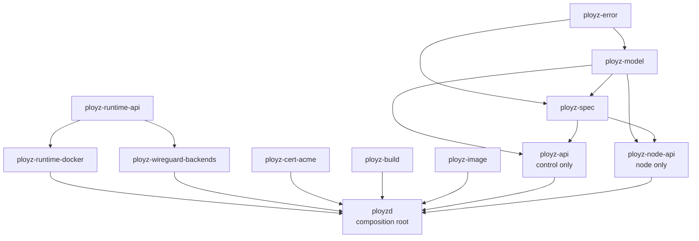
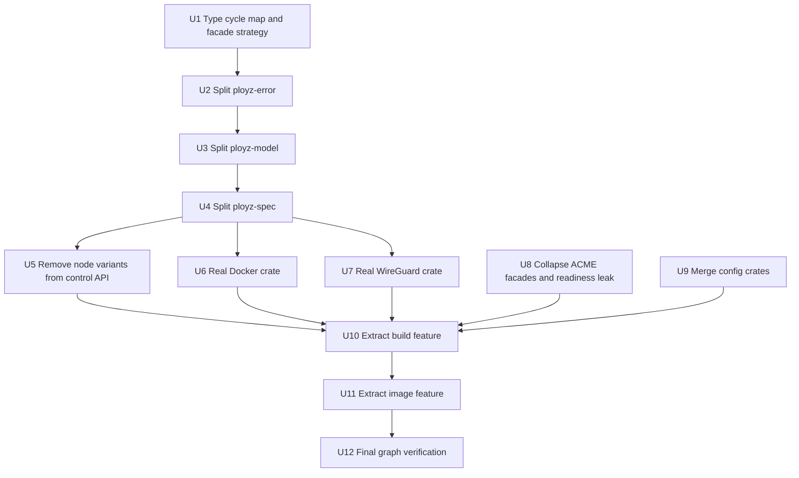

# refactor: Finish crate boundary isolation

## Summary

Finish the hard half of the crate rearrange: split `ployz-types` into real domain crates, remove node-only protocol from the public control API, turn Docker and WireGuard shell crates into real implementation owners, collapse transitional facades, merge tiny config crates back into their host crates, and start shrinking `ployzd` by extracting build first and image second.

---

## Problem Frame

The first crate-boundary pass improved workspace defaults, API root exports, store/memory separation, and some backend contract direction. It did not finish the isolation work. The graph now has more crates, but several still act as compatibility shells, `ployz-api::DaemonRequest` still contains internal node variants, `ployz-types` remains the largest rebuild blast radius, and `ployzd` still owns several feature-scale handlers.

---

## Requirements

- R1. `ployz-types` must become real lower crates: `ployz-error`, `ployz-model`, and `ployz-spec`, with `ployz-types` only as a temporary compatibility facade or deleted by the end of the plan.
- R2. `ployz-api` must be a public/operator control API only; node-only RPC variants must live only in `ployz-node-api`.
- R3. Transitional shell crates must either become real implementation owners or be deleted.
- R4. ACME contracts must not own runtime readiness behavior, and callers should import the concrete ACME crate directly rather than through `ployz-cert-backends`.
- R5. Tiny `*-config` crates should merge into their host crates when they are not independently useful boundaries.
- R6. `ployzd` must start losing feature-scale code; build is the first extraction slice, image is the second staged slice.
- R7. The work must preserve current wire shapes where the plan does not explicitly remove public node-only variants, and must keep NATS node RPC compatibility during migration.
- R8. Verification must prove the new graph, not only compile the old aggregate facade.

---

## Scope Boundaries

- Do not split every `ployzd` handler in this plan. Build and image are the active feature extraction slices; deploy, machine, volume, and status remain follow-up candidates.
- Do not create more empty facade crates to make the graph look cleaner. A new crate must own code, dependencies, or a contract that multiple current crates consume.
- Do not redesign deploy behavior, image transfer behavior, build semantics, storage semantics, or operator command UX.
- Do not pursue a hard LOC cap. LOC is used to prioritize extraction, not as a rule.
- Do not introduce external semver compatibility shims for removed node-only public API variants unless implementation discovers a concrete rollout need.

### Deferred to Follow-Up Work

- Split deploy orchestration and volume movement out of `ployzd`: this is likely the next large daemon extraction after build and image.
- Delete the `ployz-types` compatibility facade if implementation keeps it temporarily for migration.
- Run public API/semver tooling after the public control API is genuinely cleaned.
- Add crate-level READMEs after the crate list stabilizes.

---

## Context & Research

### Relevant Code and Patterns

- `crates/ployz-types/src/model.rs` is 5,647 LOC, `crates/ployz-types/src/spec.rs` is 2,267 LOC, and `crates/ployz-types/src/error.rs` still imports model types. This is the main rebuild and ownership bottleneck.
- `crates/ployz-api/src/request.rs` still includes internal node variants such as mesh peer operations, self machine transitions, deploy-node operations, peer ZFS operations, and image receive/import peer operations.
- `crates/ployz-node-api/src/lib.rs` currently wraps `NodeRequest` and converts back into `ployz_api::DaemonRequest`, which means the internal protocol still depends on the public protocol retaining node variants.
- `crates/ployz-runtime-docker/src/lib.rs` and `crates/ployz-wireguard-backends/src/lib.rs` are shell re-export crates over `ployz-runtime-backends`, so heavy dependencies remain owned by the aggregate crate.
- `crates/ployz-cert-backends/src/lib.rs` is a compatibility facade over `ployz-cert-acme`, and `crates/ployz-orchestrator/src/certificates.rs` re-exports a broad set of cert API symbols.
- `crates/ployz-cert-api/src/lib.rs` owns `wait_for_http01_challenge_visible`, which couples a contract crate to store-backed readiness behavior.
- `crates/ployz-config`, `crates/ployz-dns-config`, and `crates/ployz-gateway-config` total about 1,000 LOC and are mostly consumed by their host crates plus `ployzd`.
- `crates/ployzd/src/daemon/handlers/build/local.rs` is 3,045 LOC and is the best first feature extraction. `crates/ployzd/src/daemon/handlers/image/push.rs` is 3,355 LOC and is the second staged slice.

### Institutional Learnings

- `docs/solutions/performance-issues/machine-add-timeout-tests-2026-05-10.md` reinforces that broad refactors should keep unit tests off production wait paths and use scoped test policies or fakes when behavior, not wall-clock time, is under test.
- `docs/solutions/architecture-patterns/authority-status-separates-truth-from-observation-2026-05-08.md` reinforces that public/status API surfaces should only expose states the system can really produce. That applies to removing internal node variants from public API rather than leaving impossible public commitments.

### External References

- No new external research was needed. The first crate-boundary plan already captured the Rust/Cargo guidance, and this follow-up is based on the current repository graph and the critique of the completed pass.

---

## Key Technical Decisions

| Decision | Rationale |
|---|---|
| Split `ployz-types` before further feature extraction | Most crates import it, and the current model/spec/error cycle makes every later split harder to measure. |
| Keep compatibility facades only as short-lived migration aids | Facades that only re-export implementation crates hide dependency ownership and inflate crate count. |
| Make `ployz-node-api` independent from `ployz-api` request variants | Node protocol cannot be a trust-boundary win while it converts into the public request enum. |
| Move Docker and WireGuard code out of the aggregate crate | `ployz-runtime-docker` and `ployz-wireguard-backends` only earn their existence when they own implementation modules and dependencies. |
| Delete `ployz-cert-backends` after callers use `ployz-cert-acme` | A one-crate facade adds no isolation and keeps the graph misleading. |
| Move ACME HTTP-01 readiness out of `ployz-cert-api` | Readiness is store/runtime behavior, not a pure certificate contract. |
| Merge DNS and gateway config into their host crates | These config crates are not reusable enough to justify separate packages after workspace defaults are already narrowed. |
| Extract build before image from `ployzd` | Build is large and self-contained; image follows once the feature-crate pattern is proven. |

---

## Open Questions

### Resolved During Planning

- Which `ployzd` feature should be extracted first? Resolved: extract both staged, with build first and image second.
- Should shell crates be kept as aliases? Resolved: no. They must become real owners or be deleted.
- Should the completed first-pass plan be rewritten? Resolved: no. This is a follow-up plan because the prior plan is already marked completed.

### Deferred to Implementation

- Whether `ployz-types` survives as a compatibility facade through this plan: prefer deleting it, but allow a short-lived facade if the migration would otherwise mix too many unrelated call-site edits in one unit.
- Exact placement of HTTP-01 readiness: choose between `ployz-orchestrator` and `ployz-cert-acme` based on which side still needs direct store polling after removing broad re-exports.
- Exact crate names for build/image feature crates: default to `ployz-build` and `ployz-image`, but adjust if implementation finds an established naming convention.

---

## Output Structure

```text
crates/
  ployz-error/
  ployz-model/
  ployz-spec/
  ployz-build/
  ployz-image/
  ployz-runtime-docker/        # real implementation owner
  ployz-wireguard-backends/    # real implementation owner
```

`ployz-types`, `ployz-cert-backends`, `ployz-dns-config`, and `ployz-gateway-config` are deletion candidates by the end of the plan. If any remain, the implementation must record why the crate is still a real boundary.

---

## High-Level Technical Design

> *This illustrates the intended approach and is directional guidance for review, not implementation specification. The implementing agent should treat it as context, not code to reproduce.*



The important direction is that public control API and node RPC become siblings over model/spec/error crates. Node RPC must no longer require public API to carry peer-only request variants.

---

## Implementation Units



### U1. Type Cycle Map and Facade Strategy

**Goal:** Establish the exact type dependency cut before moving files so the physical split does not create circular crates or a new junk drawer.

**Requirements:** R1, R8

**Dependencies:** None

**Files:**
- Modify: `crates/ployz-types/src/error.rs`
- Modify: `crates/ployz-types/src/model.rs`
- Modify: `crates/ployz-types/src/spec.rs`
- Modify: `crates/ployz-types/src/lib.rs`
- Test: `crates/ployz-types/src/model.rs`
- Test: `crates/ployz-types/src/spec.rs`
- Test: `crates/ployz-types/src/error.rs`

**Approach:**
- Classify every cross-module reference between error, model, and spec before moving physical crates.
- Break the current `error -> model` and `model <-> spec` cycles with the smallest domain moves: error payload DTOs that are genuinely error-owned go to `ployz-error`; model-owned state remains in `ployz-model`; manifest syntax remains in `ployz-spec`.
- Keep existing serialized shapes stable; this unit is about dependency direction, not record redesign.
- Decide whether `ployz-types` can be deleted in one pass or must temporarily re-export the three new crates for migration.

**Execution note:** Characterization-first. Add or preserve serde roundtrip tests around any type moved across crates before changing import paths.

**Patterns to follow:**
- Existing serde roundtrip tests in `crates/ployz-types/src/model.rs`.
- Existing manifest validation tests in `crates/ployz-types/src/spec.rs`.

**Test scenarios:**
- Happy path: existing model records still serialize and deserialize with the same JSON after moving their module owner.
- Happy path: manifest/spec fixtures still parse and validate with the same behavior.
- Error path: error variants that include structured payloads still preserve their public code and message behavior.
- Integration: downstream crates can compile against either the final direct imports or the temporary compatibility facade chosen in this unit.

**Verification:**
- A documented dependency direction exists for `ployz-error`, `ployz-model`, `ployz-spec`, and any temporary `ployz-types` facade.
- No new `common`, `core`, or `shared` crate is introduced.

### U2. Split `ployz-error`

**Goal:** Create `ployz-error` as the low-level error crate without pulling model or spec crates upward unnecessarily.

**Requirements:** R1, R8

**Dependencies:** U1

**Files:**
- Create: `crates/ployz-error/Cargo.toml`
- Create: `crates/ployz-error/src/lib.rs`
- Modify: `Cargo.toml`
- Modify: `crates/ployz-types/Cargo.toml`
- Modify: `crates/ployz-types/src/error.rs`
- Modify: downstream `Cargo.toml` files that currently depend on `ployz-types` only for errors
- Test: `crates/ployz-error/src/lib.rs`

**Approach:**
- Move generic error types and aliases out of `ployz-types`.
- Keep domain-specific payload references out of `ployz-error` unless U1 proves they are unavoidable; prefer moving payload definitions down with the error only when they are not model state.
- Update crates that only need `Error`/`Result` to depend on `ployz-error` directly.

**Execution note:** Characterization-first for error formatting and conversion tests.

**Patterns to follow:**
- Current `pub use error::{Error, Result}` facade in `crates/ployz-types/src/lib.rs`.

**Test scenarios:**
- Happy path: each existing error family formats the same operator-facing message.
- Error path: conversions from lower-level IO, config, and backend errors still map to the same top-level error categories.
- Integration: a crate that only needs `Result` compiles without importing model/spec crates.

**Verification:**
- `ployz-error` does not depend on `ployz-model`, `ployz-spec`, or the compatibility `ployz-types` facade unless U1 recorded a temporary migration exception.

### U3. Split `ployz-model`

**Goal:** Move durable domain state, runtime records, lifecycle types, identifiers, and store-facing model records into `ployz-model`.

**Requirements:** R1, R2, R8

**Dependencies:** U2

**Files:**
- Create: `crates/ployz-model/Cargo.toml`
- Create: `crates/ployz-model/src/lib.rs`
- Modify: `Cargo.toml`
- Modify: `crates/ployz-types/src/model.rs`
- Modify: `crates/ployz-store-api/Cargo.toml`
- Modify: `crates/ployz-store-memory/Cargo.toml`
- Modify: `crates/ployz-orchestrator/Cargo.toml`
- Modify: downstream crates importing `ployz_types::model`
- Test: `crates/ployz-model/src/lib.rs`
- Test: `crates/ployz-store-api/src/lib.rs`
- Test: `crates/ployz-store-memory/src/lib.rs`

**Approach:**
- Move durable records and domain identifiers first because they are consumed broadly by store, orchestrator, API, and daemon crates.
- Keep `ployz-model` independent from manifest parsing. If a model type currently references a spec type, split that boundary using neutral value types or move the reference to the spec side.
- Update store traits and in-memory store to import models directly from `ployz-model`.

**Execution note:** Characterization-first for durable record serialization and ordering tests.

**Patterns to follow:**
- Store trait identities and ordering assertions in `crates/ployz-store-api/src/traits.rs`.
- Memory store contract-order tests in `crates/ployz-store-memory/src/lib.rs`.

**Test scenarios:**
- Happy path: machine, deploy, image, certificate, volume, and routing records preserve serde wire shape.
- Edge case: sorting and identity comparisons still produce the same contract order.
- Error path: invalid lifecycle/state transitions still fail with the same domain errors.
- Integration: store API and memory store compile without depending on `ployz-spec` unless a concrete method genuinely needs manifest syntax.

**Verification:**
- Store crates depend on `ployz-model` and `ployz-error` directly.
- `ployz-model` does not depend on `ployz-spec`.

### U4. Split `ployz-spec`

**Goal:** Move manifest syntax, deploy intent syntax, validation, quota parsing, and spec-owned parser helpers into `ployz-spec`.

**Requirements:** R1, R8

**Dependencies:** U3

**Files:**
- Create: `crates/ployz-spec/Cargo.toml`
- Create: `crates/ployz-spec/src/lib.rs`
- Modify: `Cargo.toml`
- Modify: `crates/ployz-types/src/spec.rs`
- Modify: `crates/ployz-api/Cargo.toml`
- Modify: `crates/ployz-orchestrator/Cargo.toml`
- Modify: `crates/ployz-runtime-docker/Cargo.toml`
- Modify: downstream crates importing `ployz_types::spec`
- Test: `crates/ployz-spec/src/lib.rs`
- Test: `crates/ployz-orchestrator/src/deploy/tests.rs`

**Approach:**
- Move manifest structs and validation into `ployz-spec`.
- Keep `ployz-spec` allowed to depend on `ployz-model` for domain identifiers and records only where the manifest contract really references durable domain concepts.
- Preserve public JSON/YAML shape and validation order where tests currently assert it.
- Retire or minimize `ployz-types` once direct imports compile.

**Execution note:** Characterization-first for manifest parse/validate tests.

**Patterns to follow:**
- Existing manifest validation and quota tests in `crates/ployz-types/src/spec.rs`.
- Deploy planner tests in `crates/ployz-orchestrator/src/deploy/tests.rs`.

**Test scenarios:**
- Happy path: valid manifests parse and serialize with identical shape.
- Edge case: legacy compatible manifest forms still deserialize if they are still supported today.
- Error path: invalid namespaces, duplicate services, unsupported deploy intent modes, and invalid quota strings still fail as before.
- Integration: deploy preview/apply tests compile with `ployz-spec` imports.

**Verification:**
- `ployz-types` is deleted or reduced to a compatibility facade with no original model/spec/error definitions.
- The public API crate's immediate dependency graph shows direct model/spec/error dependencies rather than a monolithic types dependency, unless a temporary facade exception is documented.

### U5. Remove Node-Only Variants From `ployz-api`

**Goal:** Make `ployz-api::DaemonRequest` public/operator-only and make `ployz-node-api::NodeRequest` the sole owner of internal peer RPC variants.

**Requirements:** R2, R7, R8

**Dependencies:** U4

**Files:**
- Modify: `crates/ployz-api/src/request.rs`
- Modify: `crates/ployz-api/src/lib.rs`
- Modify: `crates/ployz-node-api/src/lib.rs`
- Modify: `crates/ployz-nats/src/coord/rpc.rs`
- Modify: `crates/ployzd/src/ipc/nats_listener.rs`
- Modify: `crates/ployzd/src/daemon/handlers/mod.rs`
- Modify: `crates/ployzd/src/metrics.rs`
- Modify: node RPC call sites under `crates/ployzd/src/daemon/handlers/`
- Test: `crates/ployz-api/src/request.rs`
- Test: `crates/ployz-node-api/src/lib.rs`
- Test: `crates/ployz-nats/src/coord/rpc.rs`
- Test: `crates/ployzd/src/ipc/nats_listener.rs`

**Approach:**
- Classify current request variants into public control, internal node, and dual-use.
- Move internal node variants out of `DaemonRequest`: mesh peer prepare/execute/cancel, self machine transitions, storage promote/restore self, deploy-node operations, peer ZFS operations, and peer image receive/import operations.
- Remove `impl From<NodeRequest> for DaemonRequest` as the steady-state dispatch path. `ployzd` should dispatch node requests through a node-specific ingress path or convert into internal command enums that are not public API.
- Keep public control requests such as status, doctor, deploy, machine operator operations, build, image operator operations, and volume operator operations in `ployz-api`.
- Update request metrics so public and node request labels come from their own protocol enums rather than a single mixed enum.

**Execution note:** Test-first for protocol ownership. Add tests that fail while node-only variants remain in `ployz-api`.

**Patterns to follow:**
- Current `NodeRequest` serde tests in `crates/ployz-node-api/src/lib.rs`.
- Existing `DaemonRequest` roundtrip tests in `crates/ployz-api/src/request.rs`.

**Test scenarios:**
- Happy path: public control requests still roundtrip through `ployz-api` with unchanged wire shape.
- Happy path: node-only requests roundtrip through `ployz-node-api` with the same node RPC wire shape as before.
- Error path: deserializing a node-only request as `DaemonRequest` fails.
- Integration: NATS node listener decodes `NodeRequest` and dispatches the same daemon behavior without requiring public request variants.

**Verification:**
- The public request enum contains no deploy-node, peer ZFS, machine-self, or mesh-peer internal operation variants.
- `ployz-sdk` exposes control request/response concepts only.

### U6. Make `ployz-runtime-docker` the Real Docker Runtime Owner

**Goal:** Move Docker runtime, Docker network, deploy runtime integration, and `bollard`/Docker HTTP dependencies out of `ployz-runtime-backends` into `ployz-runtime-docker`.

**Requirements:** R3, R8

**Dependencies:** U4

**Files:**
- Modify: `crates/ployz-runtime-docker/Cargo.toml`
- Modify: `crates/ployz-runtime-docker/src/lib.rs`
- Move from: `crates/ployz-runtime-backends/src/runtime/*`
- Move from: `crates/ployz-runtime-backends/src/network/*`
- Move from: `crates/ployz-runtime-backends/src/deploy/*`
- Modify: `crates/ployz-runtime-backends/Cargo.toml`
- Modify: `crates/ployz-runtime-backends/src/lib.rs`
- Modify: `crates/ployzd/Cargo.toml`
- Modify: `crates/ployzd/src/runtime_profile.rs`
- Modify: `crates/ployzd/src/services/`
- Test: `crates/ployz-runtime-docker/src/lib.rs`

**Approach:**
- Move implementation modules, not just re-exports.
- Let `ployz-runtime-backends` either disappear or remain only as a documented composition facade with no heavy Docker dependencies.
- Keep runtime contract types in `ployz-runtime-api`.
- Keep storage/ZFS implementation imports going through `ployz-storage-zfs`.

**Execution note:** Move one module family at a time and compile after each family: runtime spec/diff/engine/probe, network, then deploy integration.

**Patterns to follow:**
- Current module layout under `crates/ployz-runtime-backends/src/runtime`.
- Current `ployzd` imports already pointing at `ployz-runtime-docker`.

**Test scenarios:**
- Happy path: runtime diff and image-ref tests pass from the Docker crate.
- Happy path: Docker network bridge tests compile only when Docker crate is selected.
- Edge case: `ployz-runtime-backends --no-default-features` does not compile `bollard`.
- Integration: `ployzd` compiles through `ployz-runtime-docker` without importing Docker modules from the aggregate crate.

**Verification:**
- `ployz-runtime-docker` owns the `bollard` dependency.
- `ployz-runtime-backends` no longer contains Docker runtime/network/deploy implementation modules.

### U7. Make `ployz-wireguard-backends` the Real WireGuard Owner

**Goal:** Move host/userspace/Docker WireGuard implementations and userspace WireGuard dependencies out of `ployz-runtime-backends`.

**Requirements:** R3, R8

**Dependencies:** U4

**Files:**
- Modify: `crates/ployz-wireguard-backends/Cargo.toml`
- Modify: `crates/ployz-wireguard-backends/src/lib.rs`
- Move from: `crates/ployz-runtime-backends/src/mesh/*`
- Modify: `crates/ployz-runtime-backends/Cargo.toml`
- Modify: `crates/ployz-runtime-backends/src/lib.rs`
- Modify: `crates/ployzd/Cargo.toml`
- Modify: `crates/ployzd/src/runtime_profile.rs`
- Test: `crates/ployz-wireguard-backends/src/lib.rs`

**Approach:**
- Move WireGuard driver wrappers, config rendering, host implementation, Docker sidecar implementation, and userspace bridge code into `ployz-wireguard-backends`.
- Let the crate own `defguard_*`, `smoltcp`, and `x25519-dalek` when those dependencies are only required by implementation.
- Keep mesh traits and memory test implementation in `ployz-runtime-api` only if they remain pure contracts/fakes.

**Execution note:** Characterize host and bridge tests before moving modules because async networking tests can fail from environment/timing assumptions.

**Patterns to follow:**
- Current runtime API mesh contracts in `crates/ployz-runtime-api/src/mesh`.
- Current WireGuard tests under `crates/ployz-runtime-backends/src/mesh/wireguard`.

**Test scenarios:**
- Happy path: host and Docker WireGuard implementations compile from `ployz-wireguard-backends`.
- Happy path: bridge packet flow tests still pass after module move.
- Edge case: building Docker runtime crate alone does not compile userspace WireGuard dependencies unless selected.
- Integration: `ployzd` runtime profile composes Docker networking and WireGuard backend explicitly.

**Verification:**
- `ployz-wireguard-backends` owns userspace WireGuard dependencies.
- `ployz-runtime-backends` no longer contains WireGuard implementation code.

### U8. Collapse ACME Facades and Move HTTP-01 Readiness Out of Cert API

**Goal:** Make certificate crates reflect real responsibility: pure cert contracts in `ployz-cert-api`, concrete ACME in `ployz-cert-acme`, orchestration in `ployz-orchestrator`, and no `ployz-cert-backends` facade.

**Requirements:** R3, R4, R8

**Dependencies:** U4

**Files:**
- Modify: `Cargo.toml`
- Modify: `crates/ployz-cert-api/Cargo.toml`
- Modify: `crates/ployz-cert-api/src/lib.rs`
- Modify: `crates/ployz-cert-acme/Cargo.toml`
- Modify: `crates/ployz-cert-acme/src/lib.rs`
- Delete: `crates/ployz-cert-backends/Cargo.toml`
- Delete: `crates/ployz-cert-backends/src/lib.rs`
- Modify: `crates/ployz-orchestrator/src/certificates.rs`
- Modify: `crates/ployzd/Cargo.toml`
- Modify: `crates/ployzd/src/daemon/setup.rs`
- Modify: `crates/ployzd/src/daemon/handlers/deploy.rs`
- Test: `crates/ployz-cert-api/src/lib.rs`
- Test: `crates/ployz-cert-acme/src/lib.rs`
- Test: `crates/ployz-orchestrator/src/certificates.rs`

**Approach:**
- Move `wait_for_http01_challenge_visible` and `LocalHttp01ChallengeReadiness` out of `ployz-cert-api` to the implementation/orchestration side that owns store polling.
- Keep only trait/data contracts in `ployz-cert-api`.
- Drop broad `pub use ployz_cert_api::*` style re-exports from orchestrator certificates; expose explicit orchestrator functions and import cert contracts directly where needed.
- Replace `ployz-cert-backends` imports with `ployz-cert-acme`.

**Execution note:** Test-first for the readiness move so timeout and late-write behavior stay covered.

**Patterns to follow:**
- Existing certificate lifecycle tests in `crates/ployz-orchestrator/src/certificates.rs`.
- ACME issuer tests in `crates/ployz-cert-acme/src/instant_acme_issuer.rs`.

**Test scenarios:**
- Happy path: ACME issuer factory still builds the same issuer from daemon setup.
- Happy path: HTTP-01 readiness succeeds immediately and after delayed challenge publication.
- Error path: HTTP-01 readiness timeout keeps certificate state retryable as before.
- Integration: `ployzd` imports `InstantAcmeIssuerFactory` from `ployz-cert-acme` directly.

**Verification:**
- `ployz-cert-api` does not depend on `ployz-store-api` or Tokio runtime features beyond what pure trait async requires.
- No crate depends on `ployz-cert-backends`.

### U9. Merge Tiny Config Crates Into Host Crates

**Goal:** Remove `ployz-dns-config` and `ployz-gateway-config` as separate packages when their config types are host-crate concerns.

**Requirements:** R5, R8

**Dependencies:** U4

**Files:**
- Move from: `crates/ployz-dns-config/src/lib.rs`
- Move to: `crates/ployz-dns/src/config.rs`
- Move from: `crates/ployz-gateway-config/src/lib.rs`
- Move to: `crates/ployz-gateway/src/config.rs`
- Delete: `crates/ployz-dns-config/Cargo.toml`
- Delete: `crates/ployz-gateway-config/Cargo.toml`
- Modify: `Cargo.toml`
- Modify: `crates/ployz-dns/Cargo.toml`
- Modify: `crates/ployz-gateway/Cargo.toml`
- Modify: `crates/ployzd/Cargo.toml`
- Modify: `crates/ployzd/src/runtime_profile.rs`
- Modify: `crates/ployzd/src/services/dns.rs`
- Modify: `crates/ployzd/src/services/gateway.rs`
- Modify: `crates/ployzd/src/daemon/setup.rs`
- Test: `crates/ployz-dns/src/config.rs`
- Test: `crates/ployz-gateway/src/config.rs`
- Test: `crates/ployzd/src/daemon/setup.rs`

**Approach:**
- Move host-specific config types back into `ployz-dns` and `ployz-gateway`.
- Keep `ployz-config` for shared daemon/client/install config and path helpers.
- Update `ployzd` to import config types from host crates.
- Delete the standalone config crates from workspace membership and default members.

**Execution note:** Pure refactor with characterization tests around env loading and `for_network` constructors.

**Patterns to follow:**
- Current re-export modules in `crates/ployz-dns/src/config.rs` and `crates/ployz-gateway/src/config.rs`.

**Test scenarios:**
- Happy path: DNS and gateway config `from_env` behavior remains unchanged.
- Happy path: `for_network` constructors preserve listener and metrics defaults.
- Integration: daemon mesh startup still constructs DNS and gateway sidecar config with the same values.

**Verification:**
- The deleted DNS/gateway config crates have no live Rust imports or manifest references.

### U10. Extract Build Feature From `ployzd`

**Goal:** Move local build planning/execution, build operations, and build handler logic into a feature crate while keeping `ployzd` as ingress/composition.

**Requirements:** R6, R8

**Dependencies:** U5, U6, U8, U9

**Files:**
- Create: `crates/ployz-build/Cargo.toml`
- Create: `crates/ployz-build/src/lib.rs`
- Move from: `crates/ployzd/src/daemon/handlers/build.rs`
- Move from: `crates/ployzd/src/daemon/handlers/build/local.rs`
- Move from: `crates/ployzd/src/daemon/handlers/build/operations.rs`
- Modify: `Cargo.toml`
- Modify: `crates/ployzd/Cargo.toml`
- Modify: `crates/ployzd/src/daemon/handlers/mod.rs`
- Modify: `crates/ployzd/src/request_builder.rs`
- Test: `crates/ployz-build/src/lib.rs`
- Test: `crates/ployzd/src/daemon/handlers/mod.rs`
- Test: `crates/ployzd/src/request_builder.rs`

**Approach:**
- Define a narrow build service API that accepts the current build request DTOs, store handles, local identity/runtime handles, and data paths it actually needs.
- Move build operation storage helpers with the build feature if they are not shared by other features.
- Keep CLI request construction and daemon lane selection in `ployzd`.
- Avoid importing `DaemonState` into `ployz-build`; pass explicit dependencies instead.

**Execution note:** Characterization-first. Keep existing build tests passing as they move; do not rewrite build behavior while extracting.

**Patterns to follow:**
- Existing build command planning tests in `crates/ployzd/src/daemon/handlers/build/local.rs`.
- Existing operation-store tests in `crates/ployzd/src/daemon/handlers/build/operations.rs`.

**Test scenarios:**
- Happy path: Dockerfile and Railpack build command planning remains unchanged.
- Happy path: successful local build persists operation and availability records as before.
- Edge case: duplicate env keys, reserved env keys, and secret-like names are rejected before operation side effects.
- Error path: command failure redacts sensitive inputs from persisted errors and responses.
- Integration: `ployzd` build local and build machine request routing returns the same response codes.

**Verification:**
- `crates/ployzd/src/daemon/handlers/build/local.rs` no longer exists or is reduced to a thin adapter.
- `ployz-build` does not depend on `ployzd`.

### U11. Extract Image Feature From `ployzd`

**Goal:** Move image status/inspect/push/distribute/registry/session behavior into a feature crate after the build extraction proves the dependency shape.

**Requirements:** R6, R8

**Dependencies:** U10

**Files:**
- Create: `crates/ployz-image/Cargo.toml`
- Create: `crates/ployz-image/src/lib.rs`
- Move from: `crates/ployzd/src/daemon/handlers/image.rs`
- Move from: `crates/ployzd/src/daemon/handlers/image/*`
- Modify: `Cargo.toml`
- Modify: `crates/ployzd/Cargo.toml`
- Modify: `crates/ployzd/src/daemon/handlers/mod.rs`
- Modify: image node RPC call sites if they still live in daemon handlers
- Test: `crates/ployz-image/src/lib.rs`
- Test: `crates/ployzd/src/daemon/handlers/mod.rs`

**Approach:**
- Move image feature code after U5 so public image operator requests and node image transfer requests are no longer represented by one public enum.
- Keep registry listener/session lifecycle dependencies explicit; do not let the image crate depend on all of `DaemonState`.
- Move image operation store helpers with the image feature if they are feature-specific.
- Keep daemon ingress, request lane selection, and product composition in `ployzd`.

**Execution note:** Characterization-first. The image feature has transfer/session side effects; move tests before changing dependency injection.

**Patterns to follow:**
- Existing image push/distribute tests in `crates/ployzd/src/daemon/handlers/image/push.rs`.
- Existing image registry tests in `crates/ployzd/src/daemon/handlers/image/registry.rs`.
- Build extraction pattern from U10.

**Test scenarios:**
- Happy path: image inspect records present/absent/failed availability as before.
- Happy path: image push and distribute preserve local-source, self-target, and multi-target behavior.
- Edge case: zero targets, duplicate targets, missing manifests, and digest mismatches still fail before or after side effects exactly as today.
- Error path: target failures preserve partial success and operation state.
- Integration: node image receive/import RPC uses `NodeRequest` only and keeps the same wire payload behavior.

**Verification:**
- `crates/ployzd/src/daemon/handlers/image/push.rs` no longer exists or is reduced to a thin adapter.
- `ployz-image` does not depend on `ployzd`.

### U12. Final Graph Verification and Facade Deletion

**Goal:** Prove the follow-up plan delivered real isolation rather than more crate count.

**Requirements:** R3, R8

**Dependencies:** U1, U2, U3, U4, U5, U6, U7, U8, U9, U10, U11

**Files:**
- Modify: `Cargo.toml`
- Modify: `justfile`
- Modify: `.github/workflows/pr.yml`
- Modify: `docs/plans/2026-05-13-002-refactor-finish-crate-boundaries-plan.md`
- Test: `Cargo.toml`
- Test: `justfile`
- Test: `.github/workflows/pr.yml`

**Approach:**
- Delete any transitional facade that no longer earns its place.
- Update `just test-boundaries` so it proves:
  - model/spec/error crates compile independently,
  - public API compiles without node-only protocol,
  - node API compiles without depending on public API request variants,
  - Docker and WireGuard crates own their heavy dependencies,
  - daemon composes explicit feature crates.
- Capture feature and duplicate dependency reports after the split.
- Mark this plan completed only when shell crates are gone or justified in the plan.

**Execution note:** Verification-heavy. This unit should not add new architecture except deleting leftover facades and updating recipes.

**Patterns to follow:**
- Current `just test-boundaries` recipe.
- Current PR workflow structure in `.github/workflows/pr.yml`.

**Test scenarios:**
- Happy path: default tests cover model/spec/error, public API, store, orchestrator, and SDK without heavy substrate crates.
- Happy path: full workspace check covers daemon, DNS, gateway, sim, e2e, Docker, WireGuard, ACME, build, and image crates.
- Edge case: building `ployz-api` does not compile `ployz-node-api` or node-only dependencies.
- Edge case: building `ployz-node-api` does not require `DaemonRequest` to contain node-only variants.
- Integration: `ployzd` product build wires build, image, Docker, WireGuard, ZFS, ACME, DNS, and gateway explicitly.

**Verification:**
- Dependency graph reports confirm heavy dependencies are owned by concrete crates.
- Repository search confirms deleted facades and old config crates are not referenced.
- The plan status flips to completed only after verification passes.

---

## System-Wide Impact

- **Interaction graph:** This touches most crate manifests, public control API imports, node RPC decoding, runtime backend ownership, certificate setup, DNS/gateway sidecar config, and daemon handler composition.
- **Error propagation:** Splitting `ployz-error` must preserve current domain error categories and operator-facing messages. Feature crates should return domain errors, not daemon-private response types.
- **State lifecycle risks:** Build and image extraction must not change operation persistence, availability records, image session cleanup, or transfer listener behavior.
- **API surface parity:** CLI and SDK should continue using only public control API. Node RPC should not leak through SDK type aliases.
- **Integration coverage:** Unit tests in the new feature crates are necessary but insufficient; `ployzd` must still run handler-level tests for ingress/composition.
- **Unchanged invariants:** Serialized durable records, manifest syntax, NATS node wire shapes, operator CLI commands, and runtime behavior stay unchanged except for deliberate removal of public node-only request variants.

---

## Risks & Dependencies

| Risk | Mitigation |
|---|---|
| `ployz-types` split creates cycles or junk drawers | Do U1 first, reject broad `common` crates, and move only owned domains into each crate. |
| Removing node variants from `DaemonRequest` breaks daemon dispatch | Add node ingress tests before removing conversion through `DaemonRequest`; keep internal dispatch enums private if needed. |
| Docker/WireGuard moves create large mechanical diffs | Move one module family at a time and keep contracts in `ployz-runtime-api`. |
| Build/image extraction accidentally imports `DaemonState` into feature crates | Define explicit dependency structs and keep `DaemonState` only in `ployzd` adapters. |
| Config merge breaks standalone DNS/gateway binaries | Keep `from_env` and `for_network` tests in host crates and compile binaries in final verification. |
| Facade deletion collides with the uncommitted first-pass branch | Work from the current branch state and do not revert unrelated user changes; use package-level checks after each deletion. |

---

## Alternative Approaches Considered

- Keep the first-pass crate graph and only clean imports: rejected because alias crates and mixed public/node requests would remain.
- Extract `ployzd` features before splitting `ployz-types`: rejected because feature crates would immediately inherit the monolithic type dependency and make the graph harder to measure.
- Delete `ployz-runtime-backends` immediately: rejected as a possible final outcome, but only after Docker and WireGuard code move into real owners.
- Extract image before build: rejected by user choice; image is second because it has more transfer/session coupling.

---

## Success Metrics

- `ployz-api::DaemonRequest` contains no node-only variants.
- `ployz-node-api` no longer converts into public `DaemonRequest` as its main dispatch path.
- `ployz-runtime-docker` owns Docker implementation modules and `bollard`.
- `ployz-wireguard-backends` owns WireGuard implementation modules and userspace WireGuard dependencies.
- `ployz-cert-backends`, `ployz-dns-config`, and `ployz-gateway-config` are deleted or explicitly justified if retained.
- `ployz-build` and `ployz-image` own feature behavior without depending on `ployzd`.
- `ployz-types` is deleted or reduced to a temporary facade with no original model/spec/error definitions.

---

## Documentation / Operational Notes

- Update `just test-boundaries` and PR workflow comments so contributors understand fast default checks versus product/substrate checks.
- In the PR description, call out the deliberate public API break: internal node-only requests are no longer deserializable as `DaemonRequest`.
- If any compatibility facade remains, document the removal condition in the PR rather than leaving it as permanent architecture.

---

## Sources & References

- Origin plan: `docs/plans/2026-05-13-001-refactor-idiomatic-crate-boundaries-plan.md`
- Current type crate: `crates/ployz-types/src/model.rs`
- Current spec crate module: `crates/ployz-types/src/spec.rs`
- Current error module: `crates/ployz-types/src/error.rs`
- Current public request enum: `crates/ployz-api/src/request.rs`
- Current node request enum: `crates/ployz-node-api/src/lib.rs`
- Current Docker shell crate: `crates/ployz-runtime-docker/src/lib.rs`
- Current WireGuard shell crate: `crates/ployz-wireguard-backends/src/lib.rs`
- Current ACME facade: `crates/ployz-cert-backends/src/lib.rs`
- Current build handler: `crates/ployzd/src/daemon/handlers/build/local.rs`
- Current image handler: `crates/ployzd/src/daemon/handlers/image/push.rs`
- Testing learning: `docs/solutions/performance-issues/machine-add-timeout-tests-2026-05-10.md`
- API truth learning: `docs/solutions/architecture-patterns/authority-status-separates-truth-from-observation-2026-05-08.md`
