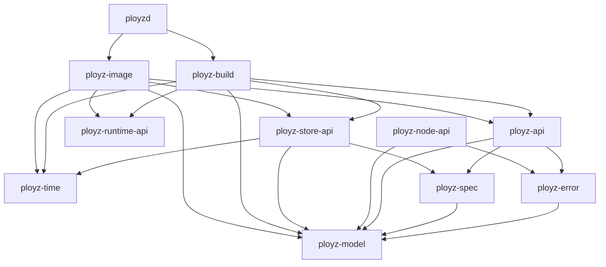
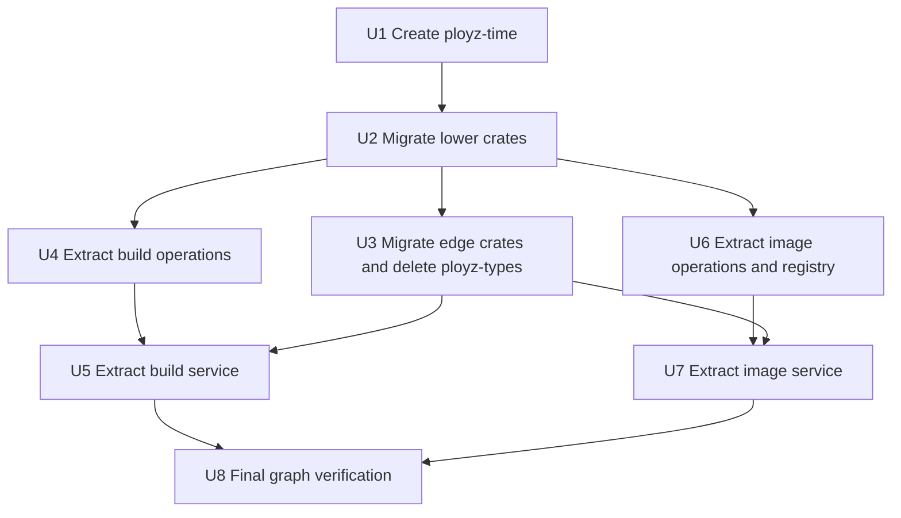

# refactor: Delete ployz-types and extract build/image crates

## Summary

Finish the remaining crate-boundary cleanup by deleting the temporary `ployz-types` facade, moving consumers to direct `ployz-error`/`ployz-model`/`ployz-spec` imports, and turning the current `ployzd::features::{build,image}` wrappers into real `ployz-build` and `ployz-image` crates. `ployzd` stays the process composition root: it owns daemon state, runtime selection, and request dispatch, while build/image crates own feature logic, operation stores, registry code, and tests.

---

## Problem Frame

The previous crate-boundary plan split the major model crates and made Docker/WireGuard real implementation owners, but two cleanup seams remain. `ployz-types` is now only a facade, yet many crates still import through it, and `ployzd` still physically owns build/image feature-scale code through `#[path]` wrappers.

---

## Requirements

- R1. Delete `crates/ployz-types` from workspace membership, default members, manifests, Rust imports, examples, and `Cargo.lock`.
- R2. Preserve the existing lower crate ownership: domain model types in `ployz-model`, manifest/spec types in `ployz-spec`, and error/result types in `ployz-error`.
- R3. Move the shared time helper currently exposed as `ployz_types::time::now_unix_secs` to a real lower crate instead of keeping a facade alive for one utility.
- R4. Create `ployz-build` as a real crate that owns build operation persistence, local build planning/execution, build input validation, and build-focused tests.
- R5. Create `ployz-image` as a real crate that owns image operation persistence, image inspect/status/push/distribute/receive/import feature logic, image archive handling, the local registry listener, and image-focused tests.
- R6. Keep `ployzd` responsible for daemon request dispatch, active mesh access, runtime backend construction, and concrete state wiring.
- R7. Preserve public API wire shapes and user-visible response codes/messages unless an implementation-time compile break proves a purely internal helper must move.
- R8. Verification must prove the facade is gone and the new crates compile/test independently, not just through `ployzd`.

---

## Scope Boundaries

- Do not redesign build semantics, image transfer protocol, image registry routes, or operation record schemas.
- Do not split deploy, machine, volume, status, DNS, gateway, or cert code in this plan.
- Do not keep compatibility aliases for `ployz_types::*`; deletion is the point of this plan.
- Do not create broad `common`, `core`, or `shared` crates.
- Do not move Docker runtime implementation out of `ployz-runtime-docker`; build/image should depend on runtime contracts and use daemon-provided runtime backends.

### Deferred to Follow-Up Work

- Split deploy orchestration and volume movement out of `ployzd`.
- Run public API/semver tooling after direct-import migration settles.
- Add crate-level READMEs for `ployz-build` and `ployz-image` once their final public surfaces are stable.

---

## Context & Research

### Relevant Code and Patterns

- `crates/ployz-types/src/lib.rs` only re-exports `error`, `model`, `spec`, and `time`; its `error.rs`, `model.rs`, and `spec.rs` files are pure re-export shims.
- `crates/ployz-types/src/time.rs` owns the only non-facade code in `ployz-types`: `now_unix_secs`.
- `crates/ployz-error`, `crates/ployz-model`, and `crates/ployz-spec` already exist and compile as the intended lower crates.
- Many crates still import `ployz_types::*`, including `ployz-api`, `ployz-node-api`, `ployz-runtime-api`, `ployz-runtime-docker`, `ployz-wireguard-backends`, `ployz-store-api`, `ployz-store-memory`, `ployz-nats`, `ployz-orchestrator`, `ployz-cert-*`, `ployz-dns`, `ployz-gateway`, `ployz-sdk`, `ployz-sim`, and `ployzd`.
- `crates/ployzd/src/features/build.rs` currently uses `#[path]` to include `daemon/handlers/build/local.rs` and `daemon/handlers/build/operations.rs`.
- `crates/ployzd/src/features/image.rs` currently uses `#[path]` to include image handler modules from `daemon/handlers/image`.
- `crates/ployzd/src/daemon/handlers/build/local.rs` still implements methods directly on `DaemonState` and depends on daemon-provided state such as active mesh, build locks, data directory, operation store, and runtime image backend.
- `crates/ployzd/src/daemon/handlers/image/*.rs` still implement methods directly on `DaemonState` and depend on daemon-provided state such as active mesh, image registry, operation store, runtime image backend, and image receiver startup.

### Institutional Learnings

- `docs/solutions/performance-issues/machine-add-timeout-tests-2026-05-10.md` reinforces that broad refactors should keep tests off production wait paths and use fakes or scoped test policies when validating orchestration behavior.
- `docs/solutions/architecture-patterns/authority-status-separates-truth-from-observation-2026-05-08.md` reinforces that public/status surfaces should expose states the system can produce today; this plan preserves existing public response surfaces while moving ownership.

### External References

- No new external research was needed. The prior crate-boundary plan already captured the relevant Rust/Cargo workspace guidance, and this follow-up is based on the current repository graph.

---

## Key Technical Decisions

| Decision | Rationale |
|---|---|
| Add a tiny `ployz-time` crate for `now_unix_secs` | Deleting `ployz-types` needs a real home for the time helper. Putting it in model/spec/error would make those crates own unrelated utility behavior. |
| Migrate lower/common crates before edge crates | Foundational crates such as API, runtime contracts, store traits, NATS, and orchestrator set the dependency direction for edge binaries and tests. |
| Extract operation stores before full build/image handlers | Operation stores are low-risk and mostly state-free; moving them first creates independent crates with meaningful ownership before tackling `DaemonState` coupling. |
| Replace `DaemonState` extension methods with service/context boundaries | Standalone crates cannot implement methods on daemon-owned state. `ployzd` should pass explicit context, stores, locks, runtime backends, and active mesh handles into build/image services. |
| Keep `ployzd` as the adapter for runtime and active mesh | Build/image crates should not know how daemon runtime profiles, active mesh state, or process lifecycle are wired. |
| Extract build before image | Build is smaller and already has a feature wrapper. Image has more moving parts, including registry serving and multi-node transfer paths, so it should reuse the build extraction pattern. |

---

## Open Questions

### Resolved During Planning

- Should `ployz-types` remain as a compatibility facade? Resolved: no. This plan deletes it.
- Where should `now_unix_secs` live? Resolved: create `ployz-time`, a narrow utility crate, because model/spec/error should not own clock helpers.
- Should build/image become submodules inside `ployzd` or standalone crates? Resolved: standalone crates, because the request explicitly targets `ployz-build` and `ployz-image` and the prior plan called out real feature ownership.

### Deferred to Implementation

- Exact service/context type names for build and image are deferred until the implementer touches the current `DaemonState` method bodies.
- Whether `ployz-image` extraction should move every image module in one commit or split registry/archive/operations first depends on compile fallout during implementation.
- Whether `ployz-sdk` should re-export lower crates directly or stop re-exporting model/spec/error entirely should be decided while updating SDK tests.

---

## Output Structure

```text
crates/
  ployz-time/
    Cargo.toml
    src/lib.rs
  ployz-build/
    Cargo.toml
    src/lib.rs
    src/local.rs
    src/operations.rs
  ployz-image/
    Cargo.toml
    src/lib.rs
    src/archive.rs
    src/inspect.rs
    src/operations.rs
    src/push.rs
    src/registry.rs
    src/status.rs
```

`crates/ployz-types/` should not exist at the end of this plan.

---

## High-Level Technical Design

> *This illustrates the intended approach and is directional guidance for review, not implementation specification. The implementing agent should treat it as context, not code to reproduce.*

Arrows point from consumer to dependency.



The lower crates expose contracts and data. `ployz-build` and `ployz-image` own feature behavior but accept daemon-provided context for runtime backends, active mesh access, local locks, and persistent root directories.

---

## Implementation Units



### U1. Create `ployz-time`

**Goal:** Move `now_unix_secs` out of the `ployz-types` facade into a narrow crate that can be used by lower contracts, backends, and edge crates.

**Requirements:** R1, R3, R8

**Dependencies:** None

**Files:**
- Create: `crates/ployz-time/Cargo.toml`
- Create: `crates/ployz-time/src/lib.rs`
- Modify: `Cargo.toml`
- Test: `crates/ployz-time/src/lib.rs`

**Approach:**
- Move the current clock helper into `ployz-time` unchanged.
- Keep the crate intentionally tiny: no model/spec/error exports, no chrono dependency, no feature flags unless implementation discovers a concrete testability need.
- Add `ployz-time` to workspace members and default members because it becomes a foundational crate.

**Patterns to follow:**
- `crates/ployz-error/Cargo.toml`
- `crates/ployz-model/Cargo.toml`
- `crates/ployz-types/src/time.rs`

**Test scenarios:**
- Happy path: calling the helper returns a value greater than zero on a normal system clock.
- Edge case: the helper preserves the current behavior of returning `0` if the system clock is before the Unix epoch.

**Verification:**
- `ployz-time` compiles independently.
- No crate imports time helpers through `ployz-types` after U3.

### U2. Migrate Lower And Shared Crates To Direct Imports

**Goal:** Replace `ployz-types` dependencies/imports in contract, API, backend, store, NATS, and orchestrator crates with direct dependencies on `ployz-error`, `ployz-model`, `ployz-spec`, and `ployz-time`.

**Requirements:** R1, R2, R3, R7, R8

**Dependencies:** U1

**Files:**
- Modify: `crates/ployz-api/Cargo.toml`
- Modify: `crates/ployz-api/src/*.rs`
- Modify: `crates/ployz-node-api/Cargo.toml`
- Modify: `crates/ployz-node-api/src/lib.rs`
- Modify: `crates/ployz-runtime-api/Cargo.toml`
- Modify: `crates/ployz-runtime-api/src/**/*.rs`
- Modify: `crates/ployz-runtime-docker/Cargo.toml`
- Modify: `crates/ployz-runtime-docker/src/**/*.rs`
- Modify: `crates/ployz-wireguard-backends/Cargo.toml`
- Modify: `crates/ployz-wireguard-backends/src/**/*.rs`
- Modify: `crates/ployz-store-api/Cargo.toml`
- Modify: `crates/ployz-store-api/src/**/*.rs`
- Modify: `crates/ployz-store-memory/Cargo.toml`
- Modify: `crates/ployz-store-memory/src/lib.rs`
- Modify: `crates/ployz-storage-zfs/Cargo.toml`
- Modify: `crates/ployz-storage-zfs/src/lib.rs`
- Modify: `crates/ployz-cert-api/Cargo.toml`
- Modify: `crates/ployz-cert-api/src/lib.rs`
- Modify: `crates/ployz-cert-acme/Cargo.toml`
- Modify: `crates/ployz-cert-acme/src/instant_acme_issuer.rs`
- Modify: `crates/ployz-nats/Cargo.toml`
- Modify: `crates/ployz-nats/src/**/*.rs`
- Modify: `crates/ployz-orchestrator/Cargo.toml`
- Modify: `crates/ployz-orchestrator/src/**/*.rs`
- Test: existing unit/integration tests in each touched crate

**Approach:**
- Convert `ployz_types::error::*` to `ployz_error::*` or `ployz_error::{...}`.
- Convert `ployz_types::model::*` to `ployz_model::*` or `ployz_model::{...}`.
- Convert `ployz_types::spec::*` to `ployz_spec::*` or `ployz_spec::{...}`.
- Convert `ployz_types::time::now_unix_secs` to `ployz_time::now_unix_secs`.
- Prefer explicit imports within each file over adding new root glob re-export facades.
- Keep `ployz-error`, `ployz-model`, and `ployz-spec` dependency direction unchanged.

**Execution note:** This is mostly mechanical, but compile crate-by-crate to keep errors localized. Do not use broad compatibility aliases.

**Patterns to follow:**
- Current `crates/ployz-api/src/*.rs` module-specific imports.
- Current `crates/ployz-runtime-docker/src/lib.rs` local module re-export style, but replacing the `ployz_types` backing crate.

**Test scenarios:**
- Happy path: API request/response roundtrip tests still serialize with unchanged wire shape.
- Happy path: node RPC tests still serialize internal node requests without depending on `ployz-api` node variants.
- Happy path: store trait tests and memory store tests still read/write model records.
- Integration: orchestrator deploy lifecycle tests still compile and run against direct model/spec/error imports.
- Error path: NATS store key mismatch and decode errors still map to the same error categories.

**Verification:**
- Foundational crates no longer depend on `ployz-types` in their manifests.
- `cargo metadata` shows no dependency path from these crates to `ployz-types`.

### U3. Migrate Edge Crates And Delete `ployz-types`

**Goal:** Remove the remaining facade imports from edge crates, examples, and workspace metadata, then delete `crates/ployz-types`.

**Requirements:** R1, R2, R3, R7, R8

**Dependencies:** U2

**Files:**
- Modify: `Cargo.toml`
- Modify: `crates/ployzd/Cargo.toml`
- Modify: `crates/ployzd/src/**/*.rs`
- Modify: `crates/ployz-sdk/Cargo.toml`
- Modify: `crates/ployz-sdk/src/lib.rs`
- Modify: `crates/ployz-sim/Cargo.toml`
- Modify: `crates/ployz-sim/src/lib.rs`
- Modify: `crates/ployz-dns/Cargo.toml`
- Modify: `crates/ployz-dns/src/**/*.rs`
- Modify: `crates/ployz-gateway/Cargo.toml`
- Modify: `crates/ployz-gateway/src/**/*.rs`
- Delete: `crates/ployz-types/Cargo.toml`
- Delete: `crates/ployz-types/src/lib.rs`
- Delete: `crates/ployz-types/src/error.rs`
- Delete: `crates/ployz-types/src/model.rs`
- Delete: `crates/ployz-types/src/spec.rs`
- Delete: `crates/ployz-types/src/time.rs`
- Delete or move: `crates/ployz-types/examples/deploy_schema.rs`
- Test: existing unit tests in touched edge crates

**Approach:**
- Finish the same direct-import conversion in daemon, CLI, SDK, sim, DNS, and gateway crates.
- For `ployz-sdk`, make an explicit choice during implementation: either re-export `ployz-error`, `ployz-model`, and `ployz-spec` as the external SDK umbrella, or stop re-exporting them if downstream code only needs typed client responses. Do not reintroduce a `types` facade.
- Move the schema example to `ployz-spec` if it still belongs in the workspace; otherwise delete it with the facade.
- Remove `crates/ployz-types` from workspace members/default members and refresh the lockfile.

**Execution note:** Use `rg` repeatedly for `ployz_types` and `ployz-types`; the unit is not complete until both return no live references.

**Patterns to follow:**
- `crates/ployz-sdk/src/lib.rs` current umbrella-export pattern.
- `crates/ployz-spec` as the natural owner for deploy schema examples.

**Test scenarios:**
- Happy path: CLI/request builder tests still construct deploy/build/image requests with direct model/spec imports.
- Happy path: SDK exports still provide the intended external consumer surface after removing `ployz-types`.
- Integration: DNS and gateway tests still render routing/certificate snapshots with direct model/spec imports.
- Edge case: no hidden dev-dependency, example, or test-only manifest keeps `ployz-types` alive.

**Verification:**
- `crates/ployz-types` is gone.
- `Cargo.toml`, `Cargo.lock`, and all Rust files contain no `ployz-types` or `ployz_types` references.

### U4. Extract Build Operation Ownership

**Goal:** Create `ployz-build` and move build operation persistence plus operation response rendering out of `ployzd`.

**Requirements:** R4, R6, R7, R8

**Dependencies:** U2

**Files:**
- Create: `crates/ployz-build/Cargo.toml`
- Create: `crates/ployz-build/src/lib.rs`
- Create: `crates/ployz-build/src/operations.rs`
- Modify: `Cargo.toml`
- Modify: `crates/ployzd/Cargo.toml`
- Modify: `crates/ployzd/src/features/build.rs`
- Modify: `crates/ployzd/src/daemon/handlers/build/operations.rs`
- Test: `crates/ployz-build/src/operations.rs`
- Test: `crates/ployzd/src/features/build.rs`

**Approach:**
- Move `BuildOperationStore`, ID validation, read/list/save logic, status transition logic, and payload rendering helpers into `ployz-build`.
- Keep daemon-specific response helpers in `ployzd` only if they require `DaemonState::ok_with_payload`/`err`; otherwise let `ployz-build` return typed payload-or-error values that `ployzd` adapts.
- Expose a narrow store API from `ployz-build` that takes a root path and returns records/payloads without depending on daemon state.
- Update `DaemonState` to construct the build operation store from `self.data_dir` through `ployz-build`.

**Patterns to follow:**
- `crates/ployz-store-memory` owning implementation behind `ployz-store-api` traits.
- Current `crates/ployzd/src/daemon/handlers/build/operations.rs` tests around ID validation, ordering, missing records, and status transitions.

**Test scenarios:**
- Happy path: beginning a local build operation persists a JSON record and listing returns newest records first.
- Happy path: operation get/list payloads match the current messages for empty and non-empty stores.
- Edge case: invalid operation IDs are rejected before filesystem access.
- Error path: malformed operation JSON still surfaces a readable operation load error.
- Integration: `ployzd` build operation list/get handlers still return the same success/error response codes through the adapter.

**Verification:**
- `ployz-build` owns build operation persistence.
- `ployzd` no longer has a daemon handler module whose only job is build operation storage.

### U5. Extract Local Build Service

**Goal:** Move local build planning/execution and build-machine validation into `ployz-build`, leaving `ployzd` as the adapter for active mesh, locks, runtime backend, and response conversion.

**Requirements:** R4, R6, R7, R8

**Dependencies:** U3, U4

**Files:**
- Create: `crates/ployz-build/src/local.rs`
- Modify: `crates/ployz-build/src/lib.rs`
- Modify: `crates/ployzd/src/features/build.rs`
- Modify: `crates/ployzd/src/daemon/handlers/build/local.rs`
- Modify: `crates/ployzd/src/daemon/mod.rs`
- Modify: `crates/ployzd/src/daemon/runtime.rs`
- Test: `crates/ployz-build/src/local.rs`
- Test: `crates/ployzd/src/features/build.rs`

**Approach:**
- Move build input validation, build invocation planning, command planning, output redaction, cache-token key handling, command execution abstraction, and operation update logic into `ployz-build`.
- Introduce an explicit build execution context accepted by `ployz-build` instead of implementing methods on `DaemonState`.
- Keep `ployzd` responsible for supplying the active mesh store, local build lock for an image name, data directory, and runtime image backend.
- Preserve unsupported `BuildMachine` behavior while moving its input validation into `ployz-build`.
- Keep tests that only need feature logic inside `ployz-build`; keep tests that need daemon lifecycle or active mesh setup in `ployzd`.

**Execution note:** Characterization-first around response codes and operation records. The extraction should not change the observable failure matrix for local builds.

**Patterns to follow:**
- Current fake `RuntimeImageBackend` and fake build runner tests in `crates/ployzd/src/daemon/handlers/build/local.rs`.
- Instance-scoped test dependencies from `docs/solutions/performance-issues/machine-add-timeout-tests-2026-05-10.md`.

**Test scenarios:**
- Happy path: a Dockerfile build request plans and runs the expected build command, records a succeeded operation, records image availability, and returns the same payload shape.
- Happy path: a Railpack build request preserves metadata and secret redaction behavior.
- Edge case: an already-running build for the same image returns the existing busy error and records a failed operation.
- Edge case: invalid env/build-arg names are rejected before operation records are created for `BuildMachine`.
- Error path: missing context directory returns the same context-not-found response without invoking runtime backend.
- Error path: runtime backend unavailable updates the operation and returns the same runtime-unavailable response.
- Integration: `ployzd` dispatch for `BuildLocal`, `BuildMachine`, `BuildOperationGet`, and `BuildOperationList` still routes through the daemon request handler.

**Verification:**
- `ployz-build` compiles and tests independently.
- `ployzd` no longer includes build handler files through `#[path]`.

### U6. Extract Image Operation Store And Registry

**Goal:** Create `ployz-image` and move image operation persistence, archive helpers, and registry serving out of `ployzd`.

**Requirements:** R5, R6, R7, R8

**Dependencies:** U2

**Files:**
- Create: `crates/ployz-image/Cargo.toml`
- Create: `crates/ployz-image/src/lib.rs`
- Create: `crates/ployz-image/src/operations.rs`
- Create: `crates/ployz-image/src/archive.rs`
- Create: `crates/ployz-image/src/registry.rs`
- Modify: `Cargo.toml`
- Modify: `crates/ployzd/Cargo.toml`
- Modify: `crates/ployzd/src/daemon/mod.rs`
- Modify: `crates/ployzd/src/daemon/setup.rs`
- Modify: `crates/ployzd/src/features/image.rs`
- Modify: `crates/ployzd/src/daemon/handlers/image/operations.rs`
- Modify: `crates/ployzd/src/daemon/handlers/image/archive.rs`
- Modify: `crates/ployzd/src/daemon/handlers/image/registry.rs`
- Test: `crates/ployz-image/src/operations.rs`
- Test: `crates/ployz-image/src/archive.rs`
- Test: `crates/ployz-image/src/registry.rs`
- Test: `crates/ployzd/src/daemon/setup.rs`

**Approach:**
- Move `ImageOperationStore`, operation ID validation, status/target update logic, and operation payload rendering into `ployz-image`.
- Move image archive parse/reconstruct helpers into `ployz-image`.
- Move `ImageRegistry`, registry session handling, registry router, upload/blob/manifest persistence, and listener handle into `ployz-image`.
- Update `DaemonState` to store `ployz_image::ImageRegistry`.
- Update daemon setup and mesh startup to call `ployz_image` registry serving APIs.
- Keep daemon state and active mesh orchestration outside `ployz-image`.

**Patterns to follow:**
- `crates/ployzd/src/daemon/handlers/image/registry.rs` existing unit coverage for unauthorized sessions, digest mismatch, missing headers, uploads, manifests, and listener shutdown.
- `crates/ployzd/src/daemon/handlers/image/archive.rs` existing archive reconstruction tests.

**Test scenarios:**
- Happy path: image operation begin/list/get persists records and returns current ordering and payload behavior.
- Happy path: registry session creation authorizes uploads and blob/manifest reads with the same route behavior.
- Happy path: archive reconstruction from registry blobs/manifests produces the same archive structure as today.
- Edge case: upload digest mismatch preserves the failed upload and reports the same error category.
- Edge case: unauthorized or missing session headers produce the same registry errors.
- Error path: malformed operation records and invalid image operation IDs fail before unsafe filesystem reads.
- Integration: daemon mesh startup still starts or skips the image receiver using the same runtime conditions.

**Verification:**
- `ployz-image` owns operation persistence, archive helpers, and registry serving.
- `ployzd` no longer imports registry/archive code through `crate::features::image` path wrappers.

### U7. Extract Image Feature Service

**Goal:** Move image inspect/status/push/distribute/receive/import feature behavior into `ployz-image`, leaving `ployzd` as the request dispatch and context adapter.

**Requirements:** R5, R6, R7, R8

**Dependencies:** U3, U6

**Files:**
- Create: `crates/ployz-image/src/inspect.rs`
- Create: `crates/ployz-image/src/push.rs`
- Create: `crates/ployz-image/src/status.rs`
- Modify: `crates/ployz-image/src/lib.rs`
- Modify: `crates/ployzd/src/features/image.rs`
- Modify: `crates/ployzd/src/daemon/handlers/image/inspect.rs`
- Modify: `crates/ployzd/src/daemon/handlers/image/push.rs`
- Modify: `crates/ployzd/src/daemon/handlers/image/status.rs`
- Modify: `crates/ployzd/src/daemon/handlers/mod.rs`
- Test: `crates/ployz-image/src/inspect.rs`
- Test: `crates/ployz-image/src/push.rs`
- Test: `crates/ployz-image/src/status.rs`
- Test: `crates/ployzd/src/features/image.rs`

**Approach:**
- Move image inspect/status formatting and operation updates into `ployz-image`.
- Move image push/distribute/receive/import workflow logic into `ployz-image`.
- Define explicit image service context for active mesh access, image registry, operation store, runtime image backend, local machine identity, peer RPC dispatch, and data directory.
- Keep daemon-specific response conversion in `ployzd` only where it depends on daemon helper methods; otherwise return typed service results from `ployz-image`.
- Preserve existing operation lifecycle behavior: failed peer imports, skipped targets, local availability checks, and receive-session records should keep the same record transitions.

**Execution note:** Characterization-first. The image module has the highest behavioral risk in this plan because it coordinates runtime image I/O, peer RPC, registry state, operation records, and store availability records.

**Patterns to follow:**
- Current fake runtime image backend tests in `crates/ployzd/src/daemon/handlers/image/push.rs` and `inspect.rs`.
- Current image operation tests in `crates/ployzd/src/daemon/handlers/image/operations.rs`.

**Test scenarios:**
- Happy path: image inspect records local present availability when runtime inspect finds an image with a digest.
- Happy path: image push exports an archive, serves it through the registry path, and records availability for the target machine.
- Happy path: image distribute records per-target success/failure with unchanged operation state semantics.
- Happy path: image receive session creates an import session with the same auth/registry metadata behavior.
- Edge case: expected digest mismatch fails without recording false availability.
- Edge case: no eligible targets returns the same user-visible response and operation outcome.
- Error path: runtime export/import failures update the operation with the same failure state and response code.
- Error path: peer RPC failures produce per-target failed outcomes without silently marking the whole transfer successful.
- Integration: `ployzd` dispatch for all image-related `DaemonRequest` variants still routes to the extracted service.

**Verification:**
- `ployz-image` compiles and tests independently.
- `ployzd` no longer includes image handler files through `#[path]`.

### U8. Final Graph Verification

**Goal:** Prove the facade is deleted, the new feature crates are real owners, and default workspace behavior remains intentional.

**Requirements:** R1, R4, R5, R8

**Dependencies:** U3, U5, U7

**Files:**
- Modify: `Cargo.toml`
- Modify: `Cargo.lock`
- Modify: `docs/plans/2026-05-13-003-refactor-delete-types-extract-features-plan.md`
- Test: workspace metadata and crate test coverage

**Approach:**
- Verify no `ployz-types` manifest, import, example, lockfile, or workspace reference remains.
- Verify `ployz-build` and `ployz-image` are workspace members.
- Decide whether `ployz-build` and `ployz-image` belong in `default-members`: include them if they compile without Docker-heavy runtime dependencies, otherwise document why they are intentionally excluded from the default inner loop.
- Check feature/dependency flow so extracting image/build does not accidentally pull Docker-only dependencies into default checks.
- Update the plan status or add a completion note only after the graph is verified.

**Patterns to follow:**
- The prior cleanup that removed `ployz-runtime-backends` after Docker/WireGuard became real owners.
- Root workspace `default-members` policy that keeps heavy daemon/runtime crates out of the inner loop.

**Test scenarios:**
- Integration: workspace metadata succeeds and contains no `ployz-types` package.
- Integration: focused tests for `ployz-error`, `ployz-model`, `ployz-spec`, `ployz-time`, `ployz-build`, `ployz-image`, and `ployzd` pass.
- Integration: workspace check excluding only intentional unsupported crates passes.
- Dependency hygiene: feature tree and duplicate dependency checks do not show `ployz-types` or unexpected Docker dependency spread into default-only crates.

**Verification:**
- No `ployz-types` references remain anywhere in Cargo manifests, lockfile, Rust sources, examples, or plan-local generated output.
- `ployz-build` and `ployz-image` own source files instead of forwarding through `#[path]` wrappers.

---

## System-Wide Impact

- **Interaction graph:** API, runtime contracts, stores, NATS, orchestrator, SDK, daemon, DNS, gateway, build, and image all touch the type facade deletion. Build and image extraction additionally touch daemon request dispatch, runtime image backend selection, active mesh access, and local filesystem operation stores.
- **Error propagation:** Error/result imports move from `ployz_types::error` to `ployz_error`, but existing response codes and error categories should remain unchanged.
- **State lifecycle risks:** Build/image operation records and image registry sessions are persistent local state. Moving them must preserve ID validation, JSON shape, ordering, failure transitions, and cleanup behavior.
- **API surface parity:** `ployz-api` wire payloads should not change. `ployz-sdk` needs an explicit export decision so external consumers are not accidentally routed through a removed facade.
- **Integration coverage:** Unit tests in extracted crates prove feature logic, while `ployzd` tests prove daemon dispatch, active mesh wiring, and runtime backend adaptation still work.
- **Unchanged invariants:** Node RPC separation, Docker/WireGuard crate ownership, DNS/gateway config merges, and cert backend cleanup from the previous plan remain unchanged.

---

## Risks & Dependencies

| Risk | Mitigation |
|------|------------|
| `ployz-types` deletion creates a huge compile-error wave | Migrate foundational crates first, then edge crates, and use direct import categories consistently. |
| `ployz-time` becomes a new junk drawer | Limit it to clock helpers; reject model/spec/error or formatting exports. |
| Build/image crates accidentally depend back on `ployzd` | Use explicit context/service inputs and keep daemon state adaptation in `ployzd`. |
| Image extraction changes peer transfer behavior | Preserve existing fake backend and peer failure tests, then add extracted-crate characterization coverage before moving response adapters. |
| Default workspace builds get heavier | Decide default-member inclusion after dependency inspection; avoid pulling Docker-only dependencies into extracted default crates. |
| SDK users lose expected umbrella exports | Make the SDK export decision explicit in U3 and preserve intended external surface with direct lower-crate exports when needed. |

---

## Documentation / Operational Notes

- This is an internal crate-boundary refactor; no operator documentation is required unless implementation changes CLI/SDK import examples.
- If `ployz-build` or `ployz-image` are excluded from default members, document the reason near the root workspace member policy or in the plan completion note.
- After implementation, the previous crate-boundary plan should be considered closed with the facade deletion follow-up complete.

---

## Sources & References

- Origin document: [docs/plans/2026-05-13-002-refactor-finish-crate-boundaries-plan.md](docs/plans/2026-05-13-002-refactor-finish-crate-boundaries-plan.md)
- Previous architecture plan: [docs/plans/2026-05-13-001-refactor-idiomatic-crate-boundaries-plan.md](docs/plans/2026-05-13-001-refactor-idiomatic-crate-boundaries-plan.md)
- Related code: [crates/ployz-types/src/lib.rs](crates/ployz-types/src/lib.rs)
- Related code: [crates/ployzd/src/features/build.rs](crates/ployzd/src/features/build.rs)
- Related code: [crates/ployzd/src/features/image.rs](crates/ployzd/src/features/image.rs)
- Related code: [crates/ployzd/src/daemon/handlers/build/local.rs](crates/ployzd/src/daemon/handlers/build/local.rs)
- Related code: [crates/ployzd/src/daemon/handlers/image/push.rs](crates/ployzd/src/daemon/handlers/image/push.rs)
- Institutional learning: [docs/solutions/performance-issues/machine-add-timeout-tests-2026-05-10.md](docs/solutions/performance-issues/machine-add-timeout-tests-2026-05-10.md)
- Institutional learning: [docs/solutions/architecture-patterns/authority-status-separates-truth-from-observation-2026-05-08.md](docs/solutions/architecture-patterns/authority-status-separates-truth-from-observation-2026-05-08.md)
