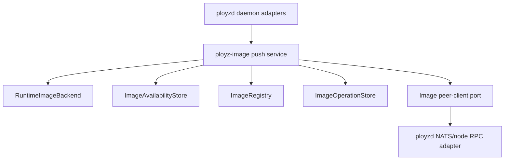

# refactor: Extract image push service

## Summary

Finish the next crate-boundary slice by fixing the stale boundary-check recipe, then moving image push/distribute/receive/import workflow ownership from `ployzd` into `ployz-image`. `ployzd` remains the composition root for daemon state, runtime backend lookup, active mesh access, and peer RPC transport.

---

## Problem Frame

The last refactor deleted `ployz-types`, created `ployz-build`, and moved most image helpers into `ployz-image`, but `crates/ployzd/src/daemon/handlers/image/push.rs` is still a 3,355-line daemon handler. The `justfile` also still checks the deleted `ployz-runtime-backends` package in `test-boundaries`, so the boundary verification target is stale.

---

## Requirements

- R1. `just test-boundaries` must stop referencing deleted crates and must still verify the current runtime and WireGuard boundary crates.
- R2. `ployz-image` must own image push, distribute, receive-session, and received-import feature workflow logic.
- R3. `ployzd` must keep daemon-specific responsibilities: request dispatch, active mesh lookup, runtime backend construction, local daemon identity, image receiver listener lifecycle, and concrete peer RPC transport.
- R4. Public API wire shapes, response codes, response messages, operation record transitions, and image availability semantics must remain unchanged.
- R5. The extraction must not make `ployz-image` depend on `ployzd`.
- R6. Verification must prove `ployz-image` compiles/tests independently and `ployzd` still passes the image route tests.

---

## Scope Boundaries

- Do not redesign image transfer protocol, registry auth, archive format handling, operation schemas, or availability record schemas.
- Do not split deploy, volume, machine, cert, or orchestrator code in this plan.
- Do not introduce a durable registry product or long-lived registry credentials.
- Do not make `ployz-image` depend on NATS transport details unless implementation proves the port boundary is more complex than the transport coupling.

### Deferred to Follow-Up Work

- Extract `daemon/handlers/deploy.rs` into an orchestration feature crate or smaller deploy modules.
- Split volume ZFS handler code out of `ployzd`.
- Move the remaining contract/runtime mixture in `cert-api::wait_for_http01_challenge_visible`.
- Revisit the large orchestrator deploy test module as its own plan.

---

## Context & Research

### Relevant Code and Patterns

- `justfile` currently checks the deleted `ployz-runtime-backends` package under `test-boundaries`, but the current crates are `ployz-runtime-docker` and `ployz-wireguard-backends`.
- `.github/workflows/pr.yml` invokes `just test-boundaries`, so the stale recipe is part of PR verification.
- `crates/ployzd/src/features/image.rs` already re-exports `ployz_image::{archive, registry}` and wraps thin daemon adapters for `inspect`, `operations`, and `status`.
- `crates/ployz-image/src/archive.rs`, `registry.rs`, `operations.rs`, `inspect.rs`, and `status.rs` are the local patterns for feature logic that accepts explicit context rather than depending on `DaemonState`.
- `crates/ployzd/src/daemon/handlers/build/local.rs` and `operations.rs` show the successful build extraction pattern: reusable feature logic in `ployz-build`, daemon methods left as adapters.
- `crates/ployzd/src/daemon/handlers/image/push.rs` still owns push/distribute/receive/import handler methods, helper functions, fake backend tests, and peer RPC orchestration.

### Institutional Learnings

- `docs/plans/2026-05-13-003-refactor-delete-types-extract-features-plan.md` already identified image push/distribute/receive/import as the unfinished half of the image extraction and called for a characterization-first move.
- `docs/plans/2026-05-11-001-feat-image-push-existing-image-plan.md` and `docs/plans/2026-05-11-005-feat-multi-target-image-distribute-plan.md` define the behavior that must remain stable: source verification, expected digest handling, one archive export reused across targets, partial target failure visibility, and explicit availability records.
- `docs/plans/2026-05-10-007-feat-image-receive-session-listener.md` reinforces that the receiver is session-gated daemon plumbing, not a durable registry product.

### External References

- No new external research is needed. This is a local crate-boundary refactor over established behavior and existing tests.

---

## Key Technical Decisions

| Decision | Rationale |
|---|---|
| Fix `just test-boundaries` before the extraction | It is small, blocks reliable PR verification, and gives the extraction a trustworthy boundary check target. |
| Move image workflow into `crates/ployz-image/src/push.rs` | The handler is the largest remaining image-owned behavior in `ployzd`; moving it makes the existing `ployz-image` crate real rather than helper-only. |
| Use explicit service context and ports instead of importing `DaemonState` | `ployz-image` should own feature behavior without knowing daemon lifecycle internals. |
| Keep NATS/RPC transport in `ployzd` behind an image peer-client port | Peer RPC is daemon wiring. The feature crate should request a receive session or import on a target, while the daemon adapter decides how that crosses the mesh. |
| Preserve `DaemonResponse` at the service boundary for this slice | The existing image workflows already encode many stable user-visible response codes and payloads. Returning `DaemonResponse` keeps the move mechanical while still extracting ownership. A later cleanup can introduce richer internal result enums if useful. |

---

## Open Questions

### Resolved During Planning

- Should `ployz-image` depend directly on `DaemonState`? No. That would move code without fixing the dependency boundary.
- Should this plan include deploy extraction? No. Deploy is larger and needs its own destination crate/module plan.
- Should `test-boundaries` check `ployz-wireguard-backends --no-default-features`? Yes. That is the replacement boundary check for the deleted combined runtime-backends crate.

### Deferred to Implementation

- Exact names for the image service context and peer-client port should be chosen while moving code, matching the surrounding Rust style.
- Whether the extracted push workflow needs one `push.rs` file or a small `push/` module tree can be decided during implementation if the moved file remains too large.
- How much of the existing daemon test setup should move into `ployz-image` versus remain as adapter tests depends on trait/mock friction after the first extraction pass.

---

## High-Level Technical Design

> *This illustrates the intended approach and is directional guidance for review, not implementation specification. The implementing agent should treat it as context, not code to reproduce.*

The daemon adapters gather concrete state and dependencies, then call the image service. The image service owns the workflow state machine. The peer-client port lets the service ask for receive sessions and target imports without taking a dependency on NATS subjects, RPC policy, or daemon active-mesh internals.

---

## Implementation Units

### U1. Fix Boundary Check Recipe

**Goal:** Remove the deleted `ployz-runtime-backends` package from the boundary test recipe and replace it with current crate checks.

**Requirements:** R1, R6

**Dependencies:** None

**Files:**
- Modify: `justfile`
- Test: `justfile`

**Approach:**
- Replace the stale runtime-backends check with the current runtime/WireGuard checks.
- Keep the existing contract/backend boundary checks intact.
- Preserve the PR workflow entrypoint that calls `just test-boundaries`.

**Patterns to follow:**
- Existing `test-boundaries` recipe structure in `justfile`.
- Current crate names in `Cargo.toml`.

**Test scenarios:**
- Test expectation: no new Rust tests -- this is a build-recipe correction.

**Verification:**
- The boundary recipe no longer references `ployz-runtime-backends`.
- The boundary recipe validates `ployz-wireguard-backends` without default features and still validates `ployz-runtime-docker`.

### U2. Extract Pure Image Push Helpers

**Goal:** Move helper functions that do not need daemon state into `ployz-image`.

**Requirements:** R2, R4, R5

**Dependencies:** U1

**Files:**
- Create: `crates/ployz-image/src/push.rs`
- Modify: `crates/ployz-image/src/lib.rs`
- Modify: `crates/ployzd/src/daemon/handlers/image/push.rs`
- Test: `crates/ployz-image/src/push.rs`
- Test: `crates/ployzd/src/daemon/handlers/image/push.rs`

**Approach:**
- Move digest/source resolution, target validation helpers, repository/reference formatting, transfer target formatting, image reference construction, and work-dir cleanup into `ployz-image`.
- Keep behavior and user-visible strings stable.
- Keep daemon methods calling the moved helpers until the larger service extraction lands.

**Execution note:** Characterization-first. Preserve the existing daemon image tests while moving the pure helpers, then add focused `ployz-image` helper tests where current daemon tests only cover behavior indirectly.

**Patterns to follow:**
- `crates/ployz-image/src/inspect.rs` for pure feature helpers plus focused tests.
- `crates/ployz-build/src/local.rs` for moved helper visibility.

**Test scenarios:**
- Happy path: source image resolution accepts a runtime image whose digest identity matches the expected digest.
- Happy path: source image resolution uses runtime image identity when no expected digest is supplied.
- Edge case: duplicate target machines are detected before side effects.
- Error path: expected digest mismatch produces the same failure semantics.
- Error path: missing runtime digest identity still fails before transfer.

**Verification:**
- `ployz-image` owns the pure helper tests.
- `ployzd` image tests still pass with the daemon handler delegating to moved helpers.

### U3. Add Image Service Context And Peer Port

**Goal:** Introduce the boundary that lets `ployz-image` run workflow logic while `ployzd` supplies concrete daemon dependencies.

**Requirements:** R2, R3, R5

**Dependencies:** U2

**Files:**
- Modify: `crates/ployz-image/src/push.rs`
- Modify: `crates/ployz-image/Cargo.toml`
- Modify: `crates/ployzd/src/daemon/handlers/image/push.rs`
- Test: `crates/ployz-image/src/push.rs`
- Test: `crates/ployzd/src/daemon/handlers/image/push.rs`

**Approach:**
- Define an explicit image service context containing local machine identity, data directory, operation store, image registry, image availability store, and runtime image backend.
- Define a peer-client port for target receive-session and received-import operations.
- Implement the peer-client port in `ployzd` using the existing node RPC subject/policy machinery.
- Keep receive-session local validation that needs active mesh membership inside the daemon adapter or pass the required membership view explicitly.

**Execution note:** Characterization-first. Add the port and adapter while keeping the existing handler behavior in place, then move one workflow at a time.

**Patterns to follow:**
- `crates/ployz-image/src/inspect.rs` for dependency injection through explicit parameters.
- Existing node RPC calls in `crates/ployzd/src/daemon/handlers/image/push.rs`.

**Test scenarios:**
- Happy path: peer-client adapter sends the same receive-session request and import request payloads as the current handler.
- Edge case: loopback receiver rejects non-local source machines with the same response.
- Error path: unknown source machine fails before registry session creation.
- Error path: peer RPC failure becomes a failed transfer target rather than a silent success.

**Verification:**
- `ployz-image` does not import `ployzd`.
- NATS subject and RPC policy imports stay in `ployzd`, not `ployz-image`.

### U4. Move Push And Distribute Workflows

**Goal:** Move `image push` and `image distribute` operation workflows into `ployz-image`.

**Requirements:** R2, R3, R4, R5

**Dependencies:** U3

**Files:**
- Modify: `crates/ployz-image/src/push.rs`
- Modify: `crates/ployzd/src/daemon/handlers/image/push.rs`
- Test: `crates/ployz-image/src/push.rs`
- Test: `crates/ployzd/src/daemon/handlers/image/push.rs`

**Approach:**
- Move the push workflow that verifies the source image, exports/parses the source archive, pushes the first target, distributes to remaining targets, records per-target outcomes, and finalizes operation status.
- Move the distribute workflow that validates source/targets, skips already-present targets, verifies source image, records local availability, exports/parses one archive for remote targets, and preserves partial failures.
- Keep daemon methods as thin adapters that fetch runtime backend and active mesh state, build the service context, and return the service response.

**Execution note:** Characterization-first. Existing daemon tests cover many side effects; keep them green while progressively moving workflow code.

**Patterns to follow:**
- Current push/distribute tests in `crates/ployzd/src/daemon/handlers/image/push.rs`.
- `crates/ployz-image/src/archive.rs` for archive parse/upload/reconstruct APIs already owned by the image crate.
- `crates/ployz-image/src/operations.rs` for operation state transitions.

**Test scenarios:**
- Happy path: self-target push uploads/imports and records present availability.
- Happy path: distribute skips targets with present availability without exporting an archive.
- Happy path: distribute exports and parses one archive, then attempts multiple remote targets.
- Edge case: zero targets and duplicate targets fail before operation side effects.
- Edge case: expected repository digest uses the runtime image id for import identity when appropriate.
- Error path: source verify failure marks all distribute targets failed.
- Error path: archive parse failure marks targets failed and cleans the work directory.
- Error path: later target failure preserves earlier target success and returns partial failure.
- Integration: daemon request routing for push/distribute still returns the same payload variants.

**Verification:**
- `ployz-image` owns push/distribute workflow code.
- `crates/ployzd/src/daemon/handlers/image/push.rs` no longer contains the main push/distribute state machines.

### U5. Move Receive Session And Received Import Workflows

**Goal:** Move target-side receive-session and received-import feature behavior into `ployz-image` while keeping listener lifecycle and mesh membership lookup in `ployzd`.

**Requirements:** R2, R3, R4, R5

**Dependencies:** U3

**Files:**
- Modify: `crates/ployz-image/src/push.rs`
- Modify: `crates/ployzd/src/daemon/handlers/image/push.rs`
- Test: `crates/ployz-image/src/push.rs`
- Test: `crates/ployzd/src/daemon/handlers/image/push.rs`

**Approach:**
- Move receive-session construction after the daemon adapter has supplied bind address, local machine identity, source membership facts, and registry.
- Move received-import reconstruction/import/verify/availability recording into the image service.
- Keep image receiver listener start/stop and active-mesh lifecycle in `ployzd`.

**Execution note:** Characterization-first. The receiver session path is security-sensitive because tokens authorize registry uploads.

**Patterns to follow:**
- `crates/ployz-image/src/registry.rs` for session registration and auth header naming.
- Existing receive-session and received-import tests in `crates/ployzd/src/daemon/handlers/image/push.rs`.

**Test scenarios:**
- Happy path: receive session returns endpoint, token, expiry, and auth headers for a local source.
- Happy path: token authorizes registry upload only for the scoped repository.
- Happy path: received import reconstructs the archive, imports through the runtime backend, verifies digest, and records availability.
- Edge case: missing manifest does not record availability.
- Error path: unsafe operation id fails before filesystem work.
- Error path: runtime import failure cleans import work directory and does not record availability.

**Verification:**
- Receive-session and received-import workflow code live in `ployz-image`.
- Daemon adapter still owns active mesh and listener availability checks.

### U6. Collapse Daemon Image Push Adapter And Verify Graph

**Goal:** Reduce the daemon image push file to adapter code and prove the new crate boundary holds.

**Requirements:** R3, R4, R5, R6

**Dependencies:** U4, U5

**Files:**
- Modify: `crates/ployzd/src/daemon/handlers/image/push.rs`
- Modify: `crates/ployzd/src/features/image.rs`
- Modify: `crates/ployz-image/src/lib.rs`
- Test: `crates/ployzd/src/daemon/handlers/image/push.rs`
- Test: `crates/ployz-image/src/push.rs`

**Approach:**
- Remove duplicated helper code from `ployzd` after each workflow has moved.
- Re-export only the module surfaces `ployzd` needs through `features/image.rs`.
- Check that `ployz-image` has no dependency on daemon crates or transport-only wiring.
- Keep a small daemon test slice that proves the request lane still reaches the service.

**Patterns to follow:**
- Thin adapters in `crates/ployzd/src/daemon/handlers/image/inspect.rs`, `operations.rs`, and `status.rs`.
- Thin adapters in `crates/ployzd/src/daemon/handlers/build/local.rs` and `operations.rs`.

**Test scenarios:**
- Integration: daemon image push/distribute/receive/import route tests still pass through the adapter.
- Integration: `ployz-image` unit tests cover service behavior without constructing `DaemonState`.
- Error path: adapter converts inactive mesh/runtime-backend lookup failures to the same daemon response codes.

**Verification:**
- `crates/ployzd/src/daemon/handlers/image/push.rs` is reduced to adapter/context wiring.
- `ployz-image` compiles and tests independently.
- Workspace boundary checks pass with current crate names.

---

## System-Wide Impact

- **Interaction graph:** Image operator requests still enter through `ployzd`, but push/distribute/receive/import workflow decisions move to `ployz-image`.
- **Error propagation:** Existing `DaemonResponse` codes and payloads stay stable; daemon-only lookup failures remain in adapter code.
- **State lifecycle risks:** Operation records, registry sessions, work directories, and availability records must preserve current cleanup and partial-failure semantics.
- **API surface parity:** CLI and daemon wire payloads should not change.
- **Integration coverage:** Existing daemon image tests remain important because they exercise active mesh, peer RPC adapter behavior, runtime fakes, registry sessions, and store writes together.
- **Unchanged invariants:** Image receiver listener lifecycle remains daemon-owned; `ployz-image` owns feature behavior, not process lifecycle.

---

## Risks & Dependencies

| Risk | Mitigation |
|---|---|
| Moving the whole handler at once obscures behavior regressions | Move helpers, ports, push/distribute, and receive/import in separate units with characterization tests kept green. |
| `ployz-image` accidentally absorbs NATS or daemon lifecycle coupling | Use a peer-client port and keep active mesh/runtime lookup in `ployzd`. |
| Response codes drift during extraction | Preserve `DaemonResponse` boundary in this slice and assert existing daemon tests continue to pass. |
| Work-directory cleanup regresses on archive parse/import failures | Keep cleanup paths covered by existing image tests and add focused service tests for moved cleanup behavior. |
| Boundary check remains stale after crate rename/deletion | Fix `justfile` first and verify the recipe uses only current workspace packages. |

---

## Verification Plan

- Boundary recipe references only current workspace crates.
- `ployz-image` compiles and tests independently.
- `ployzd` image-focused tests pass through the new adapters.
- Workspace check passes.
- Search confirms `ployz-image` does not import `ployzd` and `justfile` no longer references `ployz-runtime-backends`.

---

## Sources & References

- Follow-up review prompt in this conversation.
- `docs/plans/2026-05-13-003-refactor-delete-types-extract-features-plan.md`
- `docs/plans/2026-05-13-002-refactor-finish-crate-boundaries-plan.md`
- `docs/plans/2026-05-11-001-feat-image-push-existing-image-plan.md`
- `docs/plans/2026-05-11-005-feat-multi-target-image-distribute-plan.md`
- `docs/plans/2026-05-10-007-feat-image-receive-session-listener.md`
