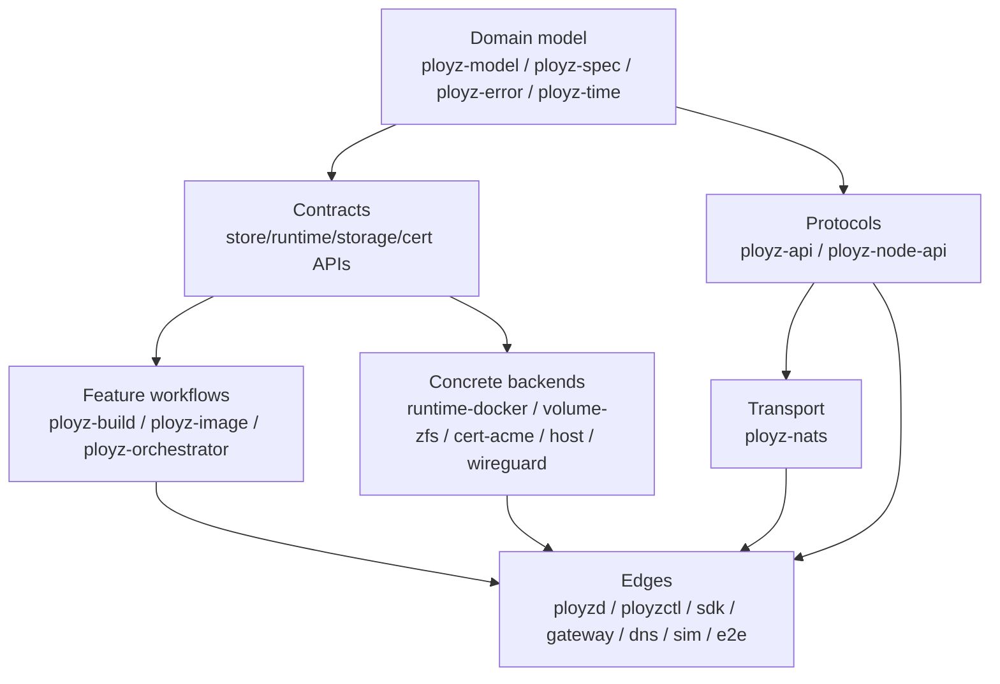

# refactor: Converge on Right-Sized Crate Layout

## Summary

Converge the workspace on the smallest crate layout that gives the project
clean dependency direction, fast default builds, clear public surfaces, and
room for future growth. This is not a crate-count exercise: keep crates when
they isolate contracts, implementations, or feature workflows; remove or avoid
crates when a module boundary is enough.

## Problem Frame

The current branch has already moved a lot of architecture in the right
direction: `ployz-types` is gone, `ployz-build` and `ployz-image` exist,
runtime/storage/cert/store contracts are split from implementations, and
`ployzd` has been reduced toward an edge/composition role.

The remaining crate-layout problem is dependency direction. Several lower or
feature-owned crates still depend on `ployz-api`, which is the external control
surface:

- `ployz-image` uses `DaemonResponse`, `DaemonPayload`, and image request/payload
  types in feature workflow code.
- `ployz-build` uses control API request/input types directly.
- `ployz-runtime-docker` still depends on `ployz-api`.
- `ployz-node-api` depends on `ployz-api` for shared image and machine payloads
  and aliases `NodeResponse = DaemonResponse`.
- `ployz-nats` depends on both `ployz-api` and `ployz-node-api` because it
  transports both control and node protocols.

Those dependencies are tolerable during extraction, but they are not the ideal
long-term shape. A modern Rust crate graph should have domain/model/contracts at
the bottom, feature workflow crates above contracts, concrete backends above
contracts, and process/API adapters at the edge.

## Requirements

- R1. External/operator API types must not be imported by backend crates unless
  the crate is explicitly an API adapter.
- R2. Feature workflow crates should return feature-owned outcomes or errors;
  `ployzd` maps those to `DaemonResponse`.
- R3. Internal node protocol must not depend on the external control API except
  through deliberately shared lower model types.
- R4. `ployzd` remains the composition root for daemon lifecycle, active mesh,
  NATS/RPC transport, concrete backend construction, and control/node response
  mapping.
- R5. Do not create new crates unless a module move cannot express the boundary
  with current crates.
- R6. Preserve existing wire formats, request variants, response codes, payload
  schemas, and command behavior.
- R7. Keep root `default-members` focused on normal development; heavyweight
  process/e2e crates stay explicit.
- R8. Verification must include boundary checks proving API-free lower crates.

## Scope Boundaries

- Do not split `ployz-api` into many per-feature API crates.
- Do not create a new `ployz-deploy` crate in this pass; deploy policy already
  lives in `ployz-orchestrator`, and the current production deploy handler is
  now adapter-sized enough for this stage.
- Do not move NATS subject/RPC timeout policy below `ployzd` or `ployz-nats`.
- Do not redesign image transfer, build execution, Docker runtime behavior, or
  node RPC semantics.
- Do not remove existing crates merely because they are small. Small contract
  crates such as `ployz-storage-api`, `ployz-time`, and `ployz-node-api` are
  acceptable when they clarify direction.

## Current Target Layout

The target is dependency direction, not this exact diagram as a new crate map.
The existing crate list is close. The work is to remove the remaining arrows
from feature/backend crates back into the external control API.

## Key Technical Decisions

| Decision | Rationale |
|---|---|
| Keep `ployz-api` as the external control facade | It is already the public CLI/SDK surface and should remain the mapping layer for operator requests/responses. |
| Keep `ployz-node-api` as the internal peer protocol | Peer RPC is a real boundary. The fix is to remove its dependency on `ployz-api`, not fold it back into control API. |
| Do not add `ployz-deploy` yet | Deploy production code is already mostly in `ployz-orchestrator`; the remaining `ployzd` deploy file is an adapter plus tests after the current split. |
| Remove `ployz-api` from backends first | Backend crates importing control API is the clearest wrong-direction dependency and has the smallest behavioral blast radius. |
| Then remove `DaemonResponse` from feature workflows | Feature crates should describe outcomes; the daemon should format control responses. |
| Treat current dirty boundary work as U0 | LFG starts from the current checkout, so the first implementation unit is to stabilize and preserve the in-flight refactor. |

## Implementation Units

### U0. Stabilize Current Boundary Work

**Goal:** Preserve the current in-flight refactor and make sure it is internally
consistent before deeper crate cleanup.

**Requirements:** R4, R6, R8

**Dependencies:** None

**Files:**
- Modify: files currently changed in the working tree from the boundary pass.
- Test: existing targeted tests for cert, deploy, ZFS, machine storage, and
  dispatcher lanes.

**Approach:** Keep the already-completed handler/test/module splits. Fix any
review-discovered dependency-direction regressions, especially lower crates
depending on `ployz-api`.

**Test scenarios:**
- Cert API compiles without runtime polling code.
- `ployz-volume-zfs` compiles without depending on `ployz-api`.
- Deploy, ZFS, machine storage, and dispatcher route tests keep passing.

**Verification:** Current targeted verification plus `just test-boundaries`.

### U1. Remove control API from runtime-docker

**Goal:** Make `ployz-runtime-docker` a runtime/storage backend crate with no
dependency on external control API types.

**Requirements:** R1, R4, R6, R8

**Dependencies:** U0

**Files:**
- Modify: `crates/ployz-runtime-docker/Cargo.toml`
- Modify: affected files under `crates/ployz-runtime-docker/src`
- Modify: daemon or feature adapters that currently expect Docker backend
  helpers to use control API request/payload types.

**Approach:** Replace any `ployz_api` imports with lower model/spec/runtime
types or backend-local structs. If a helper is only translating control API
inputs, move that translation to `ployzd` or the owning feature crate.

**Test scenarios:**
- Docker runtime image reference and label tests still pass.
- Runtime Docker compiles with default features.
- Runtime Docker compiles without importing `ployz-api`.

**Verification:** `cargo check -p ployz-runtime-docker` and a grep audit for
`ployz_api` under `crates/ployz-runtime-docker/src`.

### U2. Remove control API from node-api

**Goal:** Make `ployz-node-api` own the internal peer protocol without
depending on `DaemonResponse` or control API payload modules.

**Requirements:** R1, R3, R4, R6, R8

**Dependencies:** U0

**Files:**
- Modify: `crates/ployz-node-api/Cargo.toml`
- Modify: `crates/ployz-node-api/src/lib.rs`
- Modify: `crates/ployz-nats/src` transport aliases if needed.
- Modify: `crates/ployzd/src/daemon/handlers/node_dispatch.rs` and node RPC
  call sites if they rely on `NodeResponse = DaemonResponse`.

**Approach:** Define node-owned response and payload wrappers when needed, or
move truly shared payload structs down to `ployz-model` if they are not
operator/control concepts. Keep serialization shape stable. Let `ployzd` bridge
between internal peer outcomes and external daemon responses at the edge.

**Test scenarios:**
- Node RPC request/response serialization remains compatible.
- Shared node dispatch tests still route the same variants.
- Image and volume node RPC flows still parse expected payloads.

**Verification:** `cargo check -p ployz-node-api -p ployz-nats -p ployzd` and
a grep audit for `ployz_api` under `crates/ployz-node-api/src`.

### U3. Remove DaemonResponse from image workflows

**Goal:** Make `ployz-image` own image transfer outcomes without formatting
control responses internally.

**Requirements:** R1, R2, R4, R6, R8

**Dependencies:** U0, U2 if node response shapes change

**Files:**
- Modify: `crates/ployz-image/Cargo.toml`
- Modify: `crates/ployz-image/src/inspect.rs`
- Modify: `crates/ployz-image/src/push.rs`
- Modify: `crates/ployzd/src/daemon/handlers/image/*.rs`
- Test: image push/distribute/inspect tests.

**Approach:** Introduce feature-owned result enums/structs for image inspect,
push, distribute, receive session, and import. Keep stable response codes as
constants or structured error variants in `ployz-image`; map them to
`DaemonResponse` in the daemon adapter. Avoid inventing a generic response
framework.

**Test scenarios:**
- Existing image push/distribute/receive/import tests keep the same response
  codes and payload JSON.
- Partial target failures remain visible.
- Missing digest, duplicate target, unknown machine, and peer RPC failures keep
  existing behavior.

**Verification:** `cargo test -p ployz-image`, `cargo test -p ployzd image`,
and a grep audit for `DaemonResponse`/`DaemonPayload` in `crates/ployz-image/src`.

### U4. Remove control API from build workflows where practical

**Goal:** Keep `ployz-build` as a feature workflow crate, not a control request
crate.

**Requirements:** R1, R2, R4, R6, R8

**Dependencies:** U0

**Files:**
- Modify: `crates/ployz-build/Cargo.toml`
- Modify: `crates/ployz-build/src/local.rs`
- Modify: `crates/ployzd/src/daemon/handlers/build/*.rs`

**Approach:** Move build request translation to `ployzd`. Keep `BuildInputs`
or equivalent lower-level types only if they are domain inputs rather than API
surface. If the same type is genuinely shared by CLI, SDK, and build workflow,
move it down to `ployz-model` instead of keeping a reverse dependency on
`ployz-api`.

**Test scenarios:**
- Local build tests preserve env/file input behavior.
- Build operation records keep their current lifecycle.
- Daemon build request response codes remain stable.

**Verification:** `cargo test -p ployz-build`, `cargo test -p ployzd build`,
and a grep audit for `ployz_api` under `crates/ployz-build/src`.

### U5. Re-run layout measurement and stop at the right amount

**Goal:** Decide whether more crate extraction is useful or whether the layout
has reached the right current shape.

**Requirements:** R5, R7, R8

**Dependencies:** U1-U4

**Files:**
- Modify: `justfile` only if boundary checks need new audits.
- Modify: documentation only if the final crate map changed materially.

**Approach:** Re-run crate dependency and size measurements. Stop when lower
contract/backend/feature crates no longer depend on external control API and
the remaining large files are either tests or intentionally cohesive modules.
Do not create new crates for remaining large files unless there is a real
dependency or ownership boundary.

**Test scenarios:** No new behavior tests expected; this is measurement and
boundary verification.

**Verification:**
- `cargo metadata --no-deps` dependency audit.
- `just test-boundaries`.
- Targeted tests for any crates changed by U1-U4.

## Verification Plan

- `cargo fmt --all`
- `cargo check -p ployz-runtime-docker`
- `cargo check -p ployz-node-api -p ployz-nats -p ployzd`
- `cargo test -p ployz-image`
- `cargo test -p ployz-build`
- `cargo test -p ployzd image`
- `cargo test -p ployzd build`
- `just test-boundaries`

## Deferred

- Splitting `ployz-api` itself into separate request/response crates. The
  current single control API crate is still appropriate until there are actual
  external semver pressures.
- Creating `ployz-deploy`. Reconsider only if deploy behavior starts needing a
  second non-daemon consumer outside `ployz-orchestrator`.
- Splitting gateway or DNS. They are edge/runtime processes and are allowed to
  compose store/NATS/model concerns internally.

## Result

Completed the crate-layout pass without adding new crates:

- `ployz-runtime-docker`, `ployz-node-api`, `ployz-build`, and `ployz-image`
  no longer depend on `ployz-api`.
- Shared build, image, node image, and machine transition DTOs now live below
  protocol crates in `ployz-model`; `ployz-api` re-exports them to preserve the
  public control surface.
- `ployz-node-api` owns a node response envelope and `ployz-nats` bridges it to
  `DaemonResponse` at the transport/control edge.
- `ployz-image` returns image-owned responses and `ployzd` maps those into
  `DaemonPayload`/`DaemonResponse`.
- No additional deployment, gateway, DNS, or API-splitting crates were created;
  the remaining shape is module-level, not crate-level, work.
