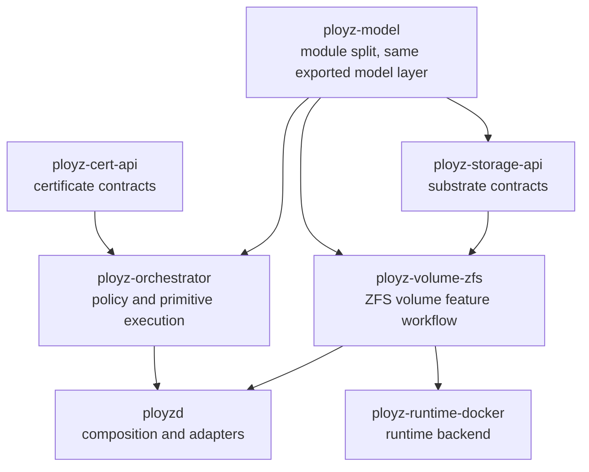

# refactor: Big-Bang Boundary Cleanup

## Summary

Finish the next logical architecture slice in one coherent branch: rename the
ZFS feature crate, remove cert contract re-exports from orchestrator, split the
large model module, split orchestrator deploy/cert internals, and split status
composition by feature area without changing behavior.

---

## Problem Frame

The crate-boundary pass left the workspace in a much better shape: feature and
backend crates no longer import the external control API, `ployzd` is closer to
an edge adapter, and the central dispatcher is no longer a monolith. The
remaining debt is now mostly naming honesty and module shape, not dependency
direction.

The next slice should therefore avoid inventing more crates for their own sake.
It should make the existing crate graph easier to reason about, keep ZFS named
as a feature workflow rather than a storage substrate, and split the largest
files along already-visible domain boundaries.

---

## Requirements

- R1. Rename `ployz-volume-zfs` to `ployz-volume-zfs` so the crate name
  matches its current role as a ZFS volume feature crate.
- R2. Preserve the existing `ployz-storage-api` substrate contract; do not fold
  storage contracts into the ZFS feature crate.
- R3. Remove the broad `pub use ployz_cert_api::{...}` re-export from
  `ployz-orchestrator::certificates`; callers should import cert contracts from
  `ployz-cert-api` directly.
- R4. Split `ployz-model/src/lib.rs` into focused in-crate modules without
  changing exported type names, serialized forms, or downstream import behavior.
- R5. Split orchestrator deploy internals by responsibility while preserving
  deploy, branch, migration, preview, prepare, apply, and apply-prepared
  behavior.
- R6. Split orchestrator certificate internals so readiness, transitions,
  parsing, and background finalization are easier to test independently.
- R7. Keep `ployzd` as the daemon composition root; feature workflow policy
  belongs in feature/orchestrator crates, while daemon handlers adapt requests,
  resources, and responses.
- R8. Split status only as daemon-shaped composition by feature area; do not
  move status ownership into unrelated feature crates in this pass.
- R9. Preserve all public API shapes, CLI behavior, request/response codes,
  schema generation output, and E2E behavior.
- R10. Keep the work as one big-bang unit with one full verification pass,
  because crate rename and model-module moves will naturally touch many files.

---

## Scope Boundaries

- Do not create a new deploy crate. Deploy policy already belongs in
  `ployz-orchestrator`.
- Do not create per-feature public API crates.
- Do not split `ployz-model` into multiple crates in this pass; module
  boundaries are enough.
- Do not redesign ZFS transfer semantics, deploy planning semantics,
  certificate issuance behavior, status payload schema, or CLI output.
- Do not chase file-size reductions in tests unless they directly support the
  active module split.
- Do not rename `ployz-storage-api`; it still names the storage substrate
  contract accurately.

### Deferred to Follow-Up Work

- Further extraction of ZFS daemon adapter logic after the crate rename:
  consider only after `ployz-volume-zfs` is established and the remaining
  handler responsibilities are easier to see.
- Deeper deploy algorithm redesign: this plan splits files and clarifies
  ownership, but it should not change scheduling, placement, availability, or
  rollback semantics.
- Public API redesign: any future control API split should be planned
  separately from this cleanup.

---

## Context & Research

### Relevant Code and Patterns

- `docs/plans/2026-05-13-007-refactor-ideal-crate-layout-plan.md` establishes
  the current target: model/contracts at the bottom, feature workflows and
  backends above contracts, and `ployzd`/SDK/transport at the edge.
- `crates/ployz-volume-zfs/src/lib.rs` currently exposes ZFS driver,
  resolution, shell, and transfer workflow state. That is broader than a
  substrate implementation and supports the rename to `ployz-volume-zfs`.
- `crates/ployz-storage-api` is still a tiny substrate contract crate and
  should remain separate from the ZFS feature crate.
- `crates/ployz-orchestrator/src/certificates.rs` still publicly re-exports
  cert API contracts from `ployz-cert-api`, which hides the true ownership of
  those contracts.
- `crates/ployz-model/src/lib.rs` is the largest single source file and already
  has visible domain sections: build/image, authority/machine, routing/deploy,
  certificates, instances, branch/prepared deploys, and volume records.
- `crates/ployz-orchestrator/src/deploy/plan.rs` and
  `crates/ployz-orchestrator/src/deploy/execute.rs` remain the largest
  production orchestrator files and should split by deploy responsibility.
- `crates/ployzd/src/daemon/handlers/status.rs` is large but daemon-shaped:
  it composes stored truth, live observations, and feature status surfaces.

### Institutional Learnings

- `docs/solutions/architecture-patterns/extract-feature-workflows-behind-daemon-adapters-2026-05-13.md`:
  move feature workflow policy behind an owning crate, but leave live daemon
  resources and transport adapters in `ployzd`.
- `docs/solutions/architecture-patterns/authority-status-separates-truth-from-observation-2026-05-08.md`:
  status surfaces should preserve the distinction between durable truth, static
  metadata, and live observation failures.

### External References

- None. The repo has strong local architecture patterns for this refactor, and
  the decisions are specific to this workspace's crate graph.

---

## Key Technical Decisions

| Decision | Rationale |
|---|---|
| Execute as one big-bang unit | The crate rename and model split will update many imports and generated references together; splitting them across multiple PRs would create noisy intermediate states. |
| Rename to `ployz-volume-zfs` | The crate owns ZFS volume feature behavior, including transfer workflow state, not just implementation of a generic storage substrate. |
| Keep `ployz-storage-api` unchanged | Storage contracts remain the inward-facing substrate seam used by runtime/backends and are correctly named. |
| Remove orchestrator cert re-export rather than replacing it | The cert contract crate should be the import source for cert API traits/types; orchestrator should expose orchestrator behavior. |
| Split `ployz-model` internally, not into crates | Shared model types remain one durable contract layer; modules improve maintainability without introducing dependency churn. |
| Split deploy/cert internals inside orchestrator | Orchestrator remains the owner of deploy and certificate policy; the problem is file responsibility, not crate ownership. |
| Treat status split as adapter composition | Status remains daemon-shaped because it combines multiple feature surfaces and live observations for operators. |

---

## Open Questions

### Resolved During Planning

- Should `status.rs` be treated as urgent architecture debt? No. It is
  in-scope because this is a big-bang cleanup, but it remains a scanability
  split rather than a layer-correction split.
- Should the ZFS crate remain named as storage? No. Its current content is
  feature-shaped enough that `ployz-volume-zfs` is more honest.
- Should this be multiple small implementation units? No. The user explicitly
  wants the biggest possible slice as one big unit of work.

### Deferred to Implementation

- Exact module names inside `ployz-model`: derive them from current type
  clusters while preserving public re-exports.
- Exact deploy split boundaries: keep the first split aligned to existing
  responsibility clusters and adjust if tests reveal tighter seams.
- Exact certificate split boundaries: keep behavior stable first, then refine
  names around readiness, lifecycle transitions, and finalization.

---

## Output Structure

Expected shape after the rename and module split. This is directional; the
implementer may adjust module names if the code reveals better local names.

```text
crates/
  ployz-volume-zfs/
    Cargo.toml
    src/
      lib.rs
      resolve.rs
      shell.rs
      transfer.rs
      zfs.rs
  ployz-model/
    src/
      lib.rs
      build.rs
      certificate.rs
      deploy.rs
      image.rs
      machine.rs
      mesh.rs
      routing.rs
      volume.rs
  ployz-orchestrator/
    src/
      certificates/
        mod.rs
        finalization.rs
        readiness.rs
        transitions.rs
      deploy/
        apply.rs
        availability.rs
        execute.rs
        plan.rs
        preview.rs
        volume.rs
  ployzd/
    src/daemon/handlers/status/
      mod.rs
      cert.rs
      deploy.rs
      machine.rs
      mesh.rs
```

---

## High-Level Technical Design

> *This illustrates the intended approach and is directional guidance for
> review, not implementation specification. The implementing agent should treat
> it as context, not code to reproduce.*



The important invariant is dependency direction: contracts and model remain
below feature workflow crates; orchestrator owns policy; `ployzd` composes
resources and maps edge requests/responses.

---

## Implementation Units

### U1. Big-Bang Boundary Cleanup

**Goal:** Land the full remaining logical architecture cleanup in one coherent
unit: ZFS crate rename, cert re-export removal, model module split,
orchestrator deploy/cert splits, and status composition split.

**Requirements:** R1, R2, R3, R4, R5, R6, R7, R8, R9, R10

**Dependencies:** Completed crate-boundary work from
`docs/plans/2026-05-13-007-refactor-ideal-crate-layout-plan.md`.

**Files:**
- Modify: `Cargo.toml`
- Modify: `Cargo.lock`
- Modify: `justfile`
- Rename: `crates/ployz-volume-zfs`
- Create/modify: `crates/ployz-volume-zfs/Cargo.toml`
- Create/modify: `crates/ployz-volume-zfs/src/lib.rs`
- Create/modify: `crates/ployz-volume-zfs/src/resolve.rs`
- Create/modify: `crates/ployz-volume-zfs/src/shell.rs`
- Create/modify: `crates/ployz-volume-zfs/src/transfer.rs`
- Create/modify: `crates/ployz-volume-zfs/src/zfs.rs`
- Modify: `crates/ployz-runtime-docker/Cargo.toml`
- Modify: `crates/ployz-runtime-docker/src/storage/mod.rs`
- Modify: `crates/ployzd/Cargo.toml`
- Modify: `crates/ployzd/src/daemon/runtime.rs`
- Modify: `crates/ployzd/src/daemon/handlers/volume/zfs.rs`
- Modify: `crates/ployzd/src/daemon/handlers/volume/transfer_listener.rs`
- Rename: `crates/ployz-orchestrator/src/certificates.rs` to `crates/ployz-orchestrator/src/certificates/mod.rs`
- Create: `crates/ployz-orchestrator/src/certificates/readiness.rs`
- Create: `crates/ployz-orchestrator/src/certificates/finalization.rs`
- Create: `crates/ployz-orchestrator/src/certificates/transitions.rs`
- Modify: `crates/ployz-orchestrator/src/deploy/mod.rs`
- Modify: `crates/ployz-orchestrator/src/deploy/plan.rs`
- Modify: `crates/ployz-orchestrator/src/deploy/execute.rs`
- Create: `crates/ployz-orchestrator/src/deploy/availability.rs`
- Create: `crates/ployz-orchestrator/src/deploy/apply.rs`
- Create: `crates/ployz-orchestrator/src/deploy/preview.rs`
- Create: `crates/ployz-orchestrator/src/deploy/volume.rs`
- Modify: `crates/ployz-model/src/lib.rs`
- Create: `crates/ployz-model/src/build.rs`
- Create: `crates/ployz-model/src/certificate.rs`
- Create: `crates/ployz-model/src/deploy.rs`
- Create: `crates/ployz-model/src/image.rs`
- Create: `crates/ployz-model/src/machine.rs`
- Create: `crates/ployz-model/src/mesh.rs`
- Create: `crates/ployz-model/src/routing.rs`
- Create: `crates/ployz-model/src/volume.rs`
- Modify: `crates/ployz-api/src/lib.rs`
- Modify: `crates/ployz-api/src/build.rs`
- Modify: `crates/ployz-api/src/deploy.rs`
- Modify: `crates/ployz-api/src/image.rs`
- Modify: `crates/ployz-api/src/machine.rs`
- Modify: `crates/ployz-api/src/runtime.rs`
- Modify: `crates/ployz-api/src/status.rs`
- Modify: `crates/ployz-api/src/volume.rs`
- Modify: `crates/ployz-store-api/src/driver.rs`
- Modify: `crates/ployz-store-api/src/traits.rs`
- Modify: `crates/ployz-nats/src/lib.rs`
- Modify: `crates/ployz-nats/src/buckets.rs`
- Modify: `crates/ployz-spec/src/lib.rs`
- Modify: `crates/ployz-spec/examples/deploy_schema.rs`
- Modify: `crates/ployz-spec/examples/runtime_schema.rs`
- Modify: `crates/ployzd/src/cli_io.rs`
- Rename: `crates/ployzd/src/daemon/handlers/status.rs` to `crates/ployzd/src/daemon/handlers/status/mod.rs`
- Create: `crates/ployzd/src/daemon/handlers/status/cert.rs`
- Create: `crates/ployzd/src/daemon/handlers/status/deploy.rs`
- Create: `crates/ployzd/src/daemon/handlers/status/machine.rs`
- Create: `crates/ployzd/src/daemon/handlers/status/mesh.rs`
- Test: `crates/ployz-volume-zfs/src/transfer.rs`
- Test: `crates/ployz-volume-zfs/src/zfs.rs`
- Test: `crates/ployz-model/src/lib.rs`
- Test: `crates/ployz-orchestrator/src/deploy/tests/mod.rs`
- Test: `crates/ployz-orchestrator/src/deploy/tests/apply.rs`
- Test: `crates/ployz-orchestrator/src/deploy/tests/branch.rs`
- Test: `crates/ployz-orchestrator/src/deploy/tests/image_availability.rs`
- Test: `crates/ployz-orchestrator/src/deploy/tests/prepared.rs`
- Test: `crates/ployz-orchestrator/src/deploy/tests/preview.rs`
- Test: `crates/ployz-orchestrator/src/deploy/tests/volume_moves.rs`
- Test: `crates/ployz-orchestrator/src/certificates/mod.rs`
- Test: `crates/ployzd/src/daemon/handlers/status/mod.rs`
- Test: `crates/ployzd/src/daemon/handlers/volume/zfs.rs`
- Test: `crates/ployzd/src/daemon/handlers/volume/transfer_listener.rs`

**Approach:**
- Start with the crate rename so all subsequent import cleanup uses the final
  `ployz_volume_zfs` crate name. Update workspace membership, direct
  dependencies, boundary recipes, runtime re-exports, daemon imports, and
  solution/plan references that should remain current documentation.
- Keep `ployz-volume-zfs`'s public surface equivalent to the old crate at
  first. The rename should be behavior-neutral before any deeper ZFS handler
  thinning happens.
- Replace orchestrator certificate re-exports with private imports from
  `ployz-cert-api`. Update downstream imports to reference `ployz-cert-api`
  directly when they need contract traits or noop implementations.
- Split `ployz-model/src/lib.rs` by moving domain clusters into modules and
  re-exporting them from `lib.rs`. The module split should be mechanically
  behavior-neutral: same type names, same derive attributes, same serde
  tagging, same schema output.
- Split deploy planning/execution by responsibility, not by arbitrary line
  count. Keep public deploy functions available from `deploy/mod.rs`; move
  availability, preview conversion, runtime apply, and volume movement helpers
  behind internal modules.
- Split certificate internals so local HTTP-01 visibility readiness,
  finalization orchestration, and lifecycle transition helpers have their own
  files. `ployz-orchestrator::certificates` remains the public orchestrator
  certificate module.
- Split status only along composition boundaries. Preserve the current status
  payload and plain output behavior, and keep the stored-truth/live-observation
  separation intact.

**Execution note:** Use characterization-first coverage around public model
serialization, deploy behavior, certificate finalization behavior, ZFS transfer
state, and status output before moving logic-heavy code. The large rename can
be mechanical, but the module splits should be protected by behavior tests.

**Patterns to follow:**
- `crates/ployz-image` for feature workflow code behind daemon adapters.
- `crates/ployz-api/src/lib.rs` for facade re-export style after moving shared
  DTOs into lower modules.
- `crates/ployz-orchestrator/src/deploy/mod.rs` for keeping a thin public
  orchestrator API over internal deploy modules.
- `docs/solutions/architecture-patterns/extract-feature-workflows-behind-daemon-adapters-2026-05-13.md`
  for keeping live daemon resources at the edge.
- `docs/solutions/architecture-patterns/authority-status-separates-truth-from-observation-2026-05-08.md`
  for status split invariants.

**Test scenarios:**
- Happy path: the renamed ZFS crate compiles under the new package and crate
  name, and all prior consumers import `ployz_volume_zfs` successfully.
- Happy path: daemon ZFS inspect, snapshot, send, transfer get/list, and
  transfer listener paths behave the same after the rename.
- Happy path: Docker runtime storage re-export continues to expose ZFS-backed
  storage helpers through the runtime backend.
- Happy path: orchestrator certificate finalization still uses local HTTP-01
  readiness and succeeds when the challenge becomes visible before timeout.
- Error path: orchestrator certificate readiness still fails loudly when the
  challenge never becomes visible.
- Happy path: cert contract traits and noop implementations remain importable
  from `ployz-cert-api` by any caller that previously got them through
  orchestrator.
- Happy path: all model DTOs still serialize and deserialize with the same
  shape after module moves.
- Integration: schema generation output remains unchanged after the model split.
- Happy path: deploy preview, prepare, apply, apply-prepared, branch namespace,
  branch apply-prepared, migration, managed-domain, image availability, and
  volume movement tests keep the same behavior after deploy internals split.
- Error path: deploy failure payloads and failure reasons remain stable when
  planning, availability, runtime apply, or volume movement fails.
- Integration: daemon deploy handlers still adapt API requests to orchestrator
  calls and map orchestrator outcomes to the same response payloads.
- Happy path: status still reports machine, mesh, cert, deploy, NATS asset, and
  edge-sync sections with the same structured JSON and plain text keys.
- Error path: status still attaches live observation failures to real objects
  rather than fabricating replacement truth.
- Edge case: root default-member tests continue not to compile heavyweight
  crates accidentally; full verification still covers the renamed ZFS feature
  crate explicitly.

**Verification:**
- Workspace package metadata reflects `ployz-volume-zfs` and contains no stale
  `ployz-volume-zfs` package references outside historical completed plan
  context that intentionally names old work.
- Boundary verification includes `ployz-volume-zfs` and continues to prove lower
  crates do not depend on `ployz-api`.
- The cert API re-export is gone from orchestrator, and cert contracts are
  imported from `ployz-cert-api` at call sites that need them.
- `ployz-model/src/lib.rs` becomes a facade over focused modules while existing
  downstream imports continue to compile.
- Orchestrator deploy and certificate files are split by responsibility and all
  deploy/cert tests pass.
- Status behavior remains unchanged after the status composition split.
- Full local verification and PR CI pass on the final big-bang branch.

---

## System-Wide Impact

- **Interaction graph:** The rename affects workspace membership, dependency
  declarations, Rust import paths, boundary recipes, runtime storage re-exports,
  and daemon ZFS handlers. The model split affects most crates by import
  resolution but should not affect runtime behavior.
- **Error propagation:** Existing foreground errors must keep their response
  codes and payloads. Background certificate finalization must keep operator
  visibility and retry posture unchanged.
- **State lifecycle risks:** ZFS transfer records, deploy records, branch
  records, certificate records, image availability records, and status
  observations must remain schema-compatible.
- **API surface parity:** CLI, SDK, NATS transport, daemon API, schema
  generation, and E2E scenarios should observe the same external behavior.
- **Integration coverage:** Unit tests should prove module behavior; deploy,
  ZFS, status, and E2E checks prove cross-layer behavior after the rename and
  large module moves.
- **Unchanged invariants:** `ployz-api` remains the external operator contract,
  `ployz-model` remains the durable shared model layer, and `ployzd` remains the
  process composition root.

---

## Risks & Dependencies

| Risk | Mitigation |
|------|------------|
| Crate rename creates noisy import churn | Rename first, keep behavior neutral, and verify all package/import references before deeper changes. |
| Model module split accidentally changes serde/schema output | Move types mechanically, preserve derives/attributes, and compare schema generation output. |
| Orchestrator deploy split changes subtle behavior | Use existing deploy tests as characterization coverage and keep public deploy functions stable through `deploy/mod.rs`. |
| Cert re-export removal breaks downstream imports | Update callers to import contracts directly from `ployz-cert-api`; avoid replacement re-export aliases. |
| Status split blurs stored truth and live observation | If status is split, keep the current status composer in control and follow the authority status learning. |
| Big-bang branch is hard to review | Keep commits internally grouped by rename, model split, orchestrator split, and status split even though they land in one PR. |

---

## Documentation / Operational Notes

- Update current architecture docs and active plans that describe the target
  crate graph so they use `ployz-volume-zfs`.
- Do not rewrite old historical plan prose unless it would actively mislead a
  future implementer; completed plans may preserve their original crate names as
  historical context.
- Mention the crate rename prominently in the PR description because reviewers
  will see broad path/import churn.

---

## Sources & References

- Origin plan: `docs/plans/2026-05-13-007-refactor-ideal-crate-layout-plan.md`
- Related plan: `docs/plans/2026-05-13-006-refactor-finish-ployzd-boundaries-plan.md`
- Relevant learning: `docs/solutions/architecture-patterns/extract-feature-workflows-behind-daemon-adapters-2026-05-13.md`
- Relevant learning: `docs/solutions/architecture-patterns/authority-status-separates-truth-from-observation-2026-05-08.md`
- Project direction: `VISION.md`
