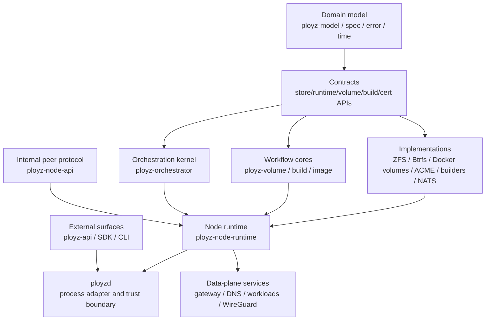
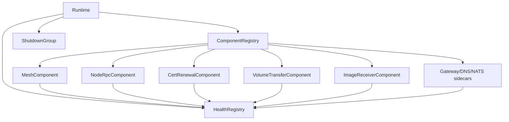
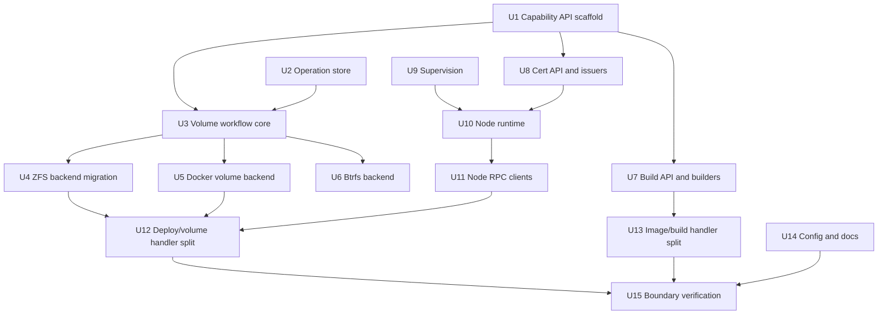

# refactor: Capability-Based Runtime Architecture

## Summary

Refactor the workspace toward a Tailscale-inspired, Rust-idiomatic architecture: public protocol crates at the edge, small contract crates below domain policy, a node runtime crate that owns long-lived component lifecycles, capability APIs for volumes/builders/certificates, and implementation crates for ZFS, Btrfs, Docker volumes, ACME, Dockerfile builds, and Railpack builds. This plan is intentionally multi-slice; each slice should leave the repo compiling and should reduce handler sprawl rather than move it sideways.

---

## Problem Frame

The current crate-boundary work moved Ployz away from `ployzd` as the feature registry, but the next product direction changes the target shape. Supporting ZFS plus future Btrfs, plain Docker volumes on macOS, pluggable certificate issuers, and multiple build engines means the honest boundary is no longer "ZFS/build/cert as single implementations embedded in workflows." It is "workflow cores choose typed capabilities; backend crates implement those capabilities."

The other pressure is mega-handler recurrence. Historical measurements called out `daemon/handlers/deploy.rs`, `daemon/handlers/image/push.rs`, and `ployz-build/src/local.rs` as thousands-of-lines files mixing transport, storage, orchestration, runtime command execution, coordination, and presentation. The current checkout has already reduced some of those files, but `crates/ployzd/src/daemon/handlers/volume/zfs.rs`, `crates/ployzd/src/daemon/handlers/deploy.rs`, and `crates/ployz-build/src/local.rs` still show the same structural risk. The target architecture must make these files hard to recreate.

---

## Requirements

- R1. Keep Ployz's explicit-operation model: no hidden reconcilers, no background self-healing loops, no product behavior driven by standing desired state.
- R2. Keep NATS/JetStream as an allowed concrete substrate when it is simpler. Do not genericize NATS solely for hypothetical backend optionality.
- R3. Introduce a volume capability boundary that can support ZFS, future Btrfs, and plain Docker volumes with visible backend capabilities and clear unsupported-operation failures.
- R4. Make Docker volumes viable for local/macOS development even when snapshot/send/clone semantics are unavailable.
- R5. Preserve ZFS as the primary product-grade volume backend and make Btrfs a future small-machine tier, not a lowest-common-denominator abstraction.
- R6. Generalize certificate issuance enough to support ACME and future issuer/import backends while keeping ACME-specific account/order/challenge machinery out of generic cert contracts.
- R7. Split Dockerfile and Railpack builders behind a build capability boundary while keeping build operation lifecycle, artifact recording, and redaction policy in the build workflow crate.
- R8. Introduce a node runtime layer, inspired by `tailscale-rs` `ts_runtime`, that owns long-lived component lifetimes, cancellation, health, restart policy, and graceful shutdown.
- R9. Keep `ployzd` thin: config/env/identity, IPC, trust boundary, response shaping, runtime composition, and startup entry points. Feature workflow policy should leave daemon handlers.
- R10. Decompose current and historical mega-handlers so handlers adapt requests/resources/responses rather than owning transport, storage, orchestration, coordination, and presentation at once.
- R11. Keep public Rust API boundaries owned and lifetime-free where values cross crates, async tasks, peer RPC, or daemon/runtime boundaries.
- R12. Preserve current CLI/API behavior unless a unit explicitly adds a new backend or capability-selection surface.
- R13. Every feature-bearing slice must carry targeted tests and boundary audits proving lower crates do not import upward into `ployzd` or `ployz-api`.

---

## Scope Boundaries

- Do not make NATS optional in this plan. NATS can remain the blessed peer/control substrate; the plan only prevents NATS implementation details from leaking into unrelated feature policy.
- Do not copy `tailscale-rs` crate count or actor library choices blindly. Use its role separation: API, runtime, protocol/control, data-plane/substrate, and utilities.
- Do not collapse ZFS/Btrfs/Docker volumes into one lowest-common-denominator storage model. Capabilities must be visible so product-grade operations can require snapshot/send/clone explicitly.
- Do not move deploy policy into `ployz-node-runtime`. Runtime owns lifetimes and component messaging; `ployz-orchestrator` owns deploy/mesh/placement policy.
- Do not turn every operation into an actor. Actors/tasks are for long-lived runtime components and observation/listener loops; foreground operations remain ordinary Rust services/functions with explicit `Result`s.
- Do not create `ployz-common`, `ployz-core`, or other bag-of-helpers crates.

### Deferred to Follow-Up Work

- A complete Btrfs backend can land after the volume capability API and ZFS migration prove the seam.
- Cloud-specific builder/cert/volume UX is out of scope; downstream products consume the same core primitives.
- Any future non-NATS control-plane substrate is out of scope. Use the NATS/Corrosion discussion only as a simplification lens for product concepts versus substrate artifacts.

---

## Context & Research

### Relevant Code and Patterns

- `AGENTS.md` requires thin edge apps over a small orchestration kernel, lower domain/protocol contracts below process wiring, no upward backend dependencies, explicit state ownership, and supervised background tasks.
- `VISION.md` anchors the plan: Ployz is a primitive orchestration core, the daemon is disposable, NATS is foundational, ZFS remains product strategy, and local/cloud share one model.
- `docs/architecture.md` already describes the intended system boundaries: operator surfaces, orchestration kernel, runtime/substrate backends, data-plane services, and daemon composition root.
- `tailscale-rs/ARCHITECTURE.md` groups crates by API/language bindings, runtime, control plane, data plane, and utilities. The useful transfer is `ts_runtime`: a crate-level lifecycle coordinator tying lower-level components together through typed actors/handles and graceful shutdown.
- `tailscale-rs/ts_runtime/src/lib.rs` shows a runtime struct that owns component references, shared environment, a shutdown signal, and a bounded graceful shutdown path. Ployz should copy that ownership shape, not necessarily its actor library.
- `crates/ployzd/src/daemon/mod.rs` currently keeps `ActiveMesh` and `DaemonState` as owners of mesh, NATS control, ZFS transfer, image receiver, gateway, DNS, certificate renewal, and bootstrap peer seed handles.
- `crates/ployzd/src/app.rs` currently spawns socket listener, ctrl-c handler, endpoint publisher, metrics loops, command tasks, runtime resume, and startup operation recovery from the daemon binary layer.
- `crates/ployz-storage-api/src/lib.rs` is a very small dataset-shaped contract. It is not sufficient as the long-term volume capability contract because Docker volumes and Btrfs do not map cleanly to ZFS dataset terminology.
- `crates/ployz-volume-zfs/src` currently contains ZFS driver mechanics, volume resolution, shell runners, transfer state, transfer records, transfer store, and move-claim logic. That is broader than a single backend driver.
- `crates/ployz-build/src/local.rs` currently combines builder command planning, Railpack prepare, Docker build command shaping, command execution, redaction, artifact rendering, input normalization, and cleanup behavior.
- `crates/ployz-cert-api/src/lib.rs` currently exposes `AcmeIssuer`, ACME config, ACME account coordination, HTTP-01 readiness, and noop implementations from a crate named as a generic cert API.
- Current line counts show the mega-handler pressure still exists even after earlier splits: `crates/ployzd/src/daemon/handlers/volume/zfs.rs` is larger than deploy in this checkout, `deploy.rs` remains a large adapter, and `ployz-build/src/local.rs` is still a multi-responsibility build file.

### Institutional Learnings

- `docs/solutions/architecture-patterns/extract-feature-workflows-behind-daemon-adapters-2026-05-13.md`: feature workflow policy should move behind an owning crate, while live daemon resources and transport adapters stay visible in `ployzd`.
- `docs/solutions/architecture-patterns/lifetime-free-public-rust-api-boundaries-2026-05-13.md`: public boundary types should own data crossing crates, async tasks, peer RPC, runtime backends, or SDK/API surfaces.
- `docs/solutions/architecture-patterns/authority-status-separates-truth-from-observation-2026-05-08.md`: status and health surfaces must keep durable truth, static metadata, and live observations separate.
- `docs/solutions/integration-issues/drain-aware-deploy-self-target-drain-nats-timeout-2026-05-10.md`: deploy planning, volume movement validators, and node RPC routing must stay aligned; self-target routing and draining-source movement are correctness-critical.

### External References

- `tailscale-rs` reference checkout: `tailscale-rs/ARCHITECTURE.md` and `tailscale-rs/ts_runtime/src/lib.rs`.

---

## Key Technical Decisions

| Decision | Rationale |
|---|---|
| Add capability APIs for volumes and builds | Multiple concrete implementations are now real product requirements, not hypothetical abstraction. |
| Rework `ployz-cert-api` into a generic certificate contract while moving ACME details down | ACME is one issuer backend; account/order/challenge concepts should not define every future certificate source. |
| Keep NATS concrete | NATS/JetStream coupling is acceptable when it makes the current system simpler; the boundary problem is leakage, not the existence of a concrete backend. |
| Add `ployz-node-runtime` | The daemon should not be the owner of every long-lived runtime component; a library runtime can be tested and reused while `ployzd` stays a process adapter. |
| Use actor-inspired Tokio components before adopting an actor framework | `tailscale-rs` proves the runtime/actor ownership shape, but Ployz can start with typed handles, channels, cancellation tokens, and health reporters to avoid adding a framework before the need is proven. |
| Split workflow cores from backend implementations | `ployz-volume`, `ployz-build`, and generic cert workflows own operation semantics; `ployz-volume-zfs`, `ployz-volume-docker`, `ployz-builder-railpack`, `ployz-builder-dockerfile`, and `ployz-cert-acme` own implementation mechanics. |
| Treat mega-handler removal as an architecture outcome | File-size reduction is not cosmetic here: it prevents one handler from owning transport, storage, orchestration, coordination, and presentation at once. |
| Prefer capability errors over silent fallback | Docker volumes on macOS should allow supported local flows and loudly reject snapshot/send/clone operations that require ZFS/Btrfs semantics. |

---

## Open Questions

### Resolved During Planning

- Should NATS/JetStream be abstracted as part of this plan? No. NATS remains concrete where it simplifies implementation and operation.
- Should Docker volumes be treated as a full replacement for ZFS? No. They are a local/dev and simple-runtime backend with limited capabilities unless later copy-based migration support is explicitly designed.
- Should actors own foreground operations? No. Actors own long-lived runtime components and observation/listener loops; foreground primitive execution stays command-shaped.
- Should Btrfs shape the first volume API as strongly as ZFS? It should shape the capability vocabulary, but ZFS remains the first migrated backend and primary semantics source.

### Deferred to Implementation

- Exact `VolumeCapabilities` names and variant granularity: choose names after migrating current ZFS call sites, but preserve explicit unsupported-operation failures.
- Exact actor implementation style inside `ployz-node-runtime`: start with Tokio tasks/handles; introduce an actor crate only if the first runtime slice becomes harder without one.
- Exact builder crate naming for Dockerfile versus BuildKit: preserve user-facing "Dockerfile" semantics while allowing implementation to use Docker BuildKit.
- Exact config keys for backend selection: choose them while updating `ployz-config`, keeping public CLI/API names concise and product-level.

---

## Output Structure

Expected final workspace shape. This is directional; each implementation slice may adjust module names if the code reveals a tighter local boundary.

```text
crates/
  ployz-api/
  ployz-node-api/
  ployz-sdk/
  ployzctl/
  ployz-spec/

  ployz-model/
  ployz-error/
  ployz-time/
  ployz-store-api/
  ployz-runtime-api/
  ployz-volume-api/
  ployz-build-api/
  ployz-cert-api/

  ployz-orchestrator/
  ployz-node-runtime/

  ployz-volume/
  ployz-volume-zfs/
  ployz-volume-btrfs/
  ployz-volume-docker/

  ployz-build/
  ployz-builder-dockerfile/
  ployz-builder-railpack/

  ployz-image/
  ployz-operation-store/
  ployz-supervision/

  ployz-cert-acme/
  ployz-cert-static/

  ployz-nats/
  ployz-runtime-docker/
  ployz-store-memory/
  ployz-wireguard-backends/
  ployz-host-backends/

  ployz-gateway/
  ployz-dns/
  ployzd/
```

---

## High-Level Technical Design

> *This illustrates the intended approach and is directional guidance for review, not implementation specification. The implementing agent should treat it as context, not code to reproduce.*



The runtime is the Tailscale-inspired layer: it owns component lifetimes and message paths. It does not own deploy policy, volume movement semantics, build artifact policy, or certificate issuance rules.

### Runtime Component Shape



---

## Phased Delivery

### Phase 1: Foundations

- Create capability APIs and utility primitives.
- Keep existing behavior mapped through adapters.
- Add boundary tests before moving workflow behavior.

### Phase 2: Runtime Ownership

- Introduce `ployz-node-runtime`.
- Move long-lived components out of `DaemonState` and daemon startup code.
- Preserve `ployzd` as composition root during migration.

### Phase 3: Backend Expansion

- Migrate ZFS behind the volume API.
- Add Docker volume backend for macOS/simple local mode.
- Add builder and cert backend splits.
- Add Btrfs as a later backend once the ZFS/Docker seams are proven.

### Phase 4: Handler Decomposition

- Finish deploy, volume, image, and build handler slimming.
- Move workflow policy into workflow crates.
- Keep only request/resource/response adaptation in `ployzd`.

### Phase 5: Verification and Documentation

- Add dependency audits, capability matrix docs, and runtime architecture docs.
- Run crate-local, daemon, and full-graph verification.

---

## Implementation Units



### U1. Scaffold Capability API Crates

**Goal:** Add the target capability API crates and workspace structure without moving behavior yet.

**Requirements:** R3, R6, R7, R11, R13

**Dependencies:** None

**Files:**
- Modify: `Cargo.toml`
- Create: `crates/ployz-volume-api/Cargo.toml`
- Create: `crates/ployz-volume-api/src/lib.rs`
- Create: `crates/ployz-build-api/Cargo.toml`
- Create: `crates/ployz-build-api/src/lib.rs`
- Modify: `crates/ployz-cert-api/src/lib.rs`
- Test: `crates/ployz-volume-api/src/lib.rs`
- Test: `crates/ployz-build-api/src/lib.rs`
- Test: `crates/ployz-cert-api/src/lib.rs`

**Approach:**
- Introduce narrow, owned public types for volume backend identity, capability sets, unsupported-operation errors, build backend identity, build request/result contracts, and generic certificate issuance concepts.
- Keep `ployz-storage-api` temporarily during migration; do not add compatibility re-exports once call sites are migrated.
- Keep APIs free of daemon response types, concrete NATS types, Docker structs, shell runners, and ZFS/Btrfs-specific names.

**Patterns to follow:**
- `crates/ployz-runtime-api/src/image.rs` for capability-specific runtime traits with typed backend errors.
- `docs/solutions/architecture-patterns/lifetime-free-public-rust-api-boundaries-2026-05-13.md` for owned public boundary types.

**Test scenarios:**
- Happy path: a fake volume backend advertises basic mount capabilities and a caller can branch on those capabilities without downcasting.
- Error path: unsupported snapshot/send/clone operations return structured unsupported-capability errors.
- Happy path: a fake builder backend returns a build artifact result without using daemon response types.
- Error path: a fake certificate issuer can return a structured disabled/unsupported issuer error.

**Verification:**
- New API crates compile independently.
- Grep confirms new API crates do not import `ployz-api`, `ployzd`, `ployz-nats`, `ployz-runtime-docker`, or `ployz-volume-zfs`.

### U2. Extract File-Backed Operation Store Primitive

**Goal:** Centralize local JSON operation persistence machinery shared by build, image, machine, and volume-transfer operations while keeping domain records and transitions vertical.

**Requirements:** R10, R11, R13

**Dependencies:** None

**Files:**
- Modify: `Cargo.toml`
- Create: `crates/ployz-operation-store/Cargo.toml`
- Create: `crates/ployz-operation-store/src/lib.rs`
- Modify: `crates/ployz-build/src/operations.rs`
- Modify: `crates/ployz-image/src/operations.rs`
- Modify: `crates/ployzd/src/daemon/handlers/machine/operations.rs`
- Modify: `crates/ployz-volume-zfs/src/transfer.rs`
- Test: `crates/ployz-operation-store/src/lib.rs`
- Test: `crates/ployz-build/src/operations.rs`
- Test: `crates/ployz-image/src/operations.rs`
- Test: `crates/ployzd/src/daemon/handlers/machine/operations.rs`
- Test: `crates/ployz-volume-zfs/src/transfer.rs`

**Approach:**
- Extract ID validation/generation helpers, JSON file read/write/list, stable sorting, and startup interruption iteration.
- Keep `BuildOperationRecord`, `ImageOperationRecord`, machine operation records, `TransferRecord`, and their state transitions in their owning feature modules.
- Do not create a generic domain operation enum or a global operation registry.

**Patterns to follow:**
- Existing `operations.rs` stores in `ployz-build`, `ployz-image`, and machine handlers.
- `ployz-volume-zfs/src/transfer.rs` for transfer-store durability and startup recovery behavior.

**Test scenarios:**
- Happy path: saving, loading, and listing records preserves JSON data and newest-first ordering.
- Edge case: empty IDs, path traversal, slashes, whitespace, and overly long IDs are rejected before file access.
- Error path: malformed JSON returns a visible decode error with the operation ID/path context.
- Integration: build/image/machine/transfer startup recovery still marks running records interrupted without losing domain-specific fields.

**Verification:**
- All migrated stores keep existing observable behavior.
- Grep confirms `ployz-operation-store` contains no build/image/machine/volume domain enums.

### U3. Create Volume Workflow Core

**Goal:** Split product-level volume workflow semantics from ZFS implementation mechanics.

**Requirements:** R3, R4, R5, R10, R11, R13

**Dependencies:** U1, U2

**Files:**
- Modify: `Cargo.toml`
- Create: `crates/ployz-volume/Cargo.toml`
- Create: `crates/ployz-volume/src/lib.rs`
- Create: `crates/ployz-volume/src/resolve.rs`
- Create: `crates/ployz-volume/src/transfer.rs`
- Create: `crates/ployz-volume/src/capabilities.rs`
- Modify: `crates/ployz-volume-zfs/src/resolve.rs`
- Modify: `crates/ployz-volume-zfs/src/transfer.rs`
- Modify: `crates/ployzd/src/daemon/handlers/volume/mod.rs`
- Test: `crates/ployz-volume/src/lib.rs`
- Test: `crates/ployz-volume/src/resolve.rs`
- Test: `crates/ployz-volume/src/transfer.rs`

**Approach:**
- Move manifest volume resolution, transfer operation records, capability checks, and backend-neutral move/clone planning into `ployz-volume`.
- Keep ZFS send/recv, snapshot GUIDs, datasets, shell runners, ZFS overcommit, and ZFS-specific claims in `ployz-volume-zfs`.
- Model Docker-volume limitations as capability absence, not as ad hoc runtime mode checks in handlers.

**Patterns to follow:**
- `crates/ployz-orchestrator/src/deploy` for product policy below daemon handlers.
- Existing `ployz-volume-zfs` transfer state machine, but with backend-neutral names where semantics are not ZFS-specific.

**Test scenarios:**
- Happy path: resolving declared volumes for a container requests backend mount preparation and returns mount paths.
- Error path: a mount referencing an undeclared volume fails before backend mutation.
- Error path: a branch/move requiring snapshot clone fails with a structured unsupported-capability error when backend lacks snapshots.
- Integration: existing ZFS transfer records can be represented through the new workflow core without changing status output.

**Verification:**
- `ployz-volume` compiles without importing ZFS, Docker, daemon, or NATS crates.
- `ployzd` volume handlers begin delegating product-level checks to `ployz-volume`.

### U4. Migrate ZFS Behind the Volume API

**Goal:** Make `ployz-volume-zfs` the ZFS implementation crate for the new volume API while preserving current ZFS behavior.

**Requirements:** R3, R5, R10, R12, R13

**Dependencies:** U3

**Files:**
- Modify: `crates/ployz-volume-zfs/Cargo.toml`
- Modify: `crates/ployz-volume-zfs/src/lib.rs`
- Modify: `crates/ployz-volume-zfs/src/zfs.rs`
- Modify: `crates/ployz-volume-zfs/src/resolve.rs`
- Modify: `crates/ployz-volume-zfs/src/transfer.rs`
- Modify: `crates/ployz-runtime-docker/Cargo.toml`
- Modify: files under `crates/ployz-runtime-docker/src`
- Test: `crates/ployz-volume-zfs/src/zfs.rs`
- Test: `crates/ployz-volume-zfs/src/transfer.rs`

**Approach:**
- Implement the volume API capability traits for `ZfsDriver`.
- Move any generic transfer/status behavior that remains in `ployz-volume-zfs` back to `ployz-volume`.
- Remove `ployz-runtime-docker`'s direct dependency on `ployz-volume-zfs` where it only needs a volume backend contract.
- Preserve ZFS root dataset, mountpoint, quota, permission, snapshot, clone, send, and receive semantics.

**Patterns to follow:**
- `crates/ployz-volume-zfs/src/zfs.rs` existing idempotent ensure/snapshot/clone behavior.
- `docs/solutions/integration-issues/drain-aware-deploy-self-target-drain-nats-timeout-2026-05-10.md` for keeping planner and runtime validators aligned.

**Test scenarios:**
- Happy path: ZFS ensure creates or reconciles dataset quota, mountpoint, mode, and owner.
- Happy path: ZFS snapshot/clone/send capabilities are advertised and executable through the volume API.
- Edge case: existing dataset with mismatched mountpoint still fails visibly.
- Error path: ZFS shell failures propagate typed backend context.
- Integration: deploy volume movement through ZFS still allows draining sources where existing behavior allows them.

**Verification:**
- ZFS crate tests pass.
- Runtime Docker no longer imports ZFS implementation types unless it is constructing the concrete backend at a composition boundary.

### U5. Add Docker Volume Backend for Local/macOS

**Goal:** Add a plain Docker volume backend that supports local and macOS development when ZFS is unavailable.

**Requirements:** R3, R4, R10, R12, R13

**Dependencies:** U3

**Files:**
- Modify: `Cargo.toml`
- Create: `crates/ployz-volume-docker/Cargo.toml`
- Create: `crates/ployz-volume-docker/src/lib.rs`
- Modify: `crates/ployz-runtime-docker/Cargo.toml`
- Modify: files under `crates/ployz-runtime-docker/src`
- Modify: `crates/ployz-config/src`
- Modify: `crates/ployzd/src/runtime_profile.rs`
- Test: `crates/ployz-volume-docker/src/lib.rs`
- Test: relevant tests under `crates/ployzd/src`

**Approach:**
- Implement basic create/ensure/remove/mount capability using Docker volumes.
- Advertise no snapshot, clone, incremental transfer, or rollback capabilities unless explicitly implemented later.
- Wire runtime/profile selection so local/macOS development can choose Docker volumes without ZFS setup.
- Ensure unsupported product operations fail during planning/preflight, not halfway through backend mutation.

**Patterns to follow:**
- `crates/ployz-runtime-docker/src` Docker client setup and error style.
- Volume capability errors from U1/U3.

**Test scenarios:**
- Happy path: a local container volume declaration resolves to a Docker volume mount.
- Error path: branch/fork/migrate operations requiring snapshots fail before container mutation on Docker-volume backend.
- Error path: Docker API failure returns backend error context and does not record a successful volume operation.
- Integration: `ployzctl dev`-shaped runtime profile can initialize without ZFS when Docker volumes are selected.

**Verification:**
- Docker volume backend compiles independently.
- Daemon tests cover unsupported snapshot operation surfaces for Docker volume mode.

### U6. Add Btrfs Backend as a Capability Peer to ZFS

**Goal:** Add the future Btrfs backend behind the same volume API without weakening ZFS semantics.

**Requirements:** R3, R5, R10, R12, R13

**Dependencies:** U3, U4

**Files:**
- Modify: `Cargo.toml`
- Create: `crates/ployz-volume-btrfs/Cargo.toml`
- Create: `crates/ployz-volume-btrfs/src/lib.rs`
- Create: `crates/ployz-volume-btrfs/src/shell.rs`
- Create: `crates/ployz-volume-btrfs/src/btrfs.rs`
- Modify: `crates/ployz-config/src`
- Modify: `crates/ployzd/src/runtime_profile.rs`
- Test: `crates/ployz-volume-btrfs/src/btrfs.rs`

**Approach:**
- Implement the subset of snapshot/clone/send capabilities that Btrfs can honestly support.
- Keep Btrfs-specific identifiers and validation in the Btrfs crate.
- Reuse volume workflow preflights and capability checks from `ployz-volume`.
- Do not hide differences between ZFS and Btrfs behind ambiguous success.

**Patterns to follow:**
- `crates/ployz-volume-zfs/src/shell.rs` and `zfs.rs` for shell-runner abstraction and test fakes.
- Capability matrix established in U3/U4.

**Test scenarios:**
- Happy path: Btrfs backend advertises supported snapshot/clone capabilities.
- Error path: unsupported Btrfs operation variants return structured unsupported-capability errors.
- Error path: shell command failures preserve operation context.
- Integration: runtime profile can select Btrfs backend without pulling in ZFS types.

**Verification:**
- Btrfs crate compiles and tests pass without ZFS dependencies.
- Boundary audit confirms `ployz-volume` does not import Btrfs implementation types.

### U7. Split Build API and Builder Implementations

**Goal:** Separate build workflow lifecycle from Dockerfile and Railpack builder implementations, eliminating `build/local.rs` as a multi-responsibility file.

**Requirements:** R7, R10, R11, R12, R13

**Dependencies:** U1, U2

**Files:**
- Modify: `Cargo.toml`
- Modify: `crates/ployz-build/Cargo.toml`
- Modify: `crates/ployz-build/src/lib.rs`
- Modify: `crates/ployz-build/src/local.rs`
- Modify: `crates/ployz-build/src/operations.rs`
- Create: `crates/ployz-builder-dockerfile/Cargo.toml`
- Create: `crates/ployz-builder-dockerfile/src/lib.rs`
- Create: `crates/ployz-builder-railpack/Cargo.toml`
- Create: `crates/ployz-builder-railpack/src/lib.rs`
- Modify: `crates/ployzd/src/daemon/handlers/build/local.rs`
- Test: `crates/ployz-build/src/lib.rs`
- Test: `crates/ployz-builder-dockerfile/src/lib.rs`
- Test: `crates/ployz-builder-railpack/src/lib.rs`
- Test: `crates/ployzd/src/daemon/handlers/build/local.rs`

**Approach:**
- Move builder command planning/execution for Dockerfile builds into `ployz-builder-dockerfile`.
- Move Railpack prepare and build-plan command shaping into `ployz-builder-railpack`.
- Keep build operation records, artifact persistence, availability updates, input summary, redaction policy, and result mapping in `ployz-build`.
- Keep daemon build handlers as request/resource/response adapters.

**Patterns to follow:**
- Existing `BuildCommandRunner` abstraction in `crates/ployz-build/src/local.rs`.
- `docs/solutions/architecture-patterns/extract-feature-workflows-behind-daemon-adapters-2026-05-13.md` for moving feature policy behind owning crates.

**Test scenarios:**
- Happy path: Dockerfile builder produces the same build command/artifact result for an existing Dockerfile input.
- Happy path: Railpack builder performs prepare plus image build with the same redaction behavior.
- Edge case: secret/env input redaction still suppresses sensitive values in captured output.
- Error path: builder command timeout and non-zero status produce the same visible build failure semantics.
- Integration: daemon build request can select Dockerfile or Railpack builder and record operation status consistently.

**Verification:**
- `ployz-build` no longer owns builder-specific command planning for both implementations in one file.
- `crates/ployz-build/src/local.rs` is either removed or reduced to workflow orchestration glue with focused modules.

### U8. Generalize Certificate API and Issuer Backends

**Goal:** Make certificate issuance pluggable while preserving ACME behavior.

**Requirements:** R6, R8, R10, R11, R12, R13

**Dependencies:** U1, U9

**Files:**
- Modify: `crates/ployz-cert-api/Cargo.toml`
- Modify: `crates/ployz-cert-api/src/lib.rs`
- Modify: `crates/ployz-cert-acme/Cargo.toml`
- Modify: files under `crates/ployz-cert-acme/src`
- Create: `crates/ployz-cert-static/Cargo.toml`
- Create: `crates/ployz-cert-static/src/lib.rs`
- Modify: `crates/ployzd/src/daemon/setup.rs`
- Modify: `crates/ployzd/src/daemon/cert_coordination.rs`
- Test: `crates/ployz-cert-api/src/lib.rs`
- Test: tests under `crates/ployz-cert-acme/src`
- Test: `crates/ployz-cert-static/src/lib.rs`

**Approach:**
- Rename or wrap generic public traits around certificate issuance concepts, while moving ACME-specific account/order/challenge terms into `ployz-cert-acme`.
- Keep HTTP-01 readiness and issuance coordination where they are generic enough; move ACME account coordination out if it only applies to ACME.
- Add a static/imported certificate issuer backend for local/dev and non-ACME installations if it falls out cleanly.
- Ensure cert renewal worker receives an issuer backend through runtime composition, not through hard-coded ACME construction.

**Patterns to follow:**
- Existing `AcmeIssuerFactory` and `IssuanceCoordinator` seams.
- `AGENTS.md` failure audience rules for autonomous background cert renewal.

**Test scenarios:**
- Happy path: ACME issuer still starts and finalizes orders using the existing store-backed records.
- Happy path: static/imported issuer returns configured certificate material without ACME account/order machinery.
- Error path: disabled/unsupported issuer returns typed certificate error.
- Integration: cert renewal worker can be wired with ACME issuer through the generic issuer surface.

**Verification:**
- `ployz-cert-api` no longer exposes ACME-only types as the generic top-level contract.
- ACME behavior remains covered by existing cert tests plus new generic issuer tests.

### U9. Introduce Supervision and Health Primitives

**Goal:** Centralize task lifecycle, cancellation, health reporting, bounded retry, and shutdown primitives before moving runtime ownership.

**Requirements:** R1, R8, R9, R10, R13

**Dependencies:** None

**Files:**
- Modify: `Cargo.toml`
- Create: `crates/ployz-supervision/Cargo.toml`
- Create: `crates/ployz-supervision/src/lib.rs`
- Modify: `crates/ployzd/src/health.rs`
- Modify: `crates/ployz-orchestrator/src/mesh/tasks/mod.rs`
- Modify: `crates/ployzd/src/ipc/nats_listener.rs`
- Modify: `crates/ployzd/src/daemon/cert_renewal_health.rs`
- Modify: `crates/ployzd/src/mesh_state/bootstrap.rs`
- Test: `crates/ployz-supervision/src/lib.rs`
- Test: relevant existing tests under `crates/ployzd/src`
- Test: relevant existing tests under `crates/ployz-orchestrator/src`

**Approach:**
- Extract `ComponentId`, `ComponentHealth`, stale/healthy state, health recorder, cancellation handle, shutdown group, and retry policy primitives.
- Keep component-specific policy and durable state mutation outside the supervision crate.
- Support both in-memory and file-backed health reporting so status no longer hand-loads each worker's custom format.

**Patterns to follow:**
- `crates/ployz-orchestrator/src/mesh/tasks/mod.rs` for named task tracking.
- `crates/ployzd/src/health.rs` for current daemon component health model.
- `crates/ployzd/src/ipc/nats_listener.rs` and `cert_renewal_health.rs` for file-backed health mechanics.

**Test scenarios:**
- Happy path: a supervised task reports healthy, exits on cancellation, and joins within shutdown deadline.
- Error path: unexpected task exit marks the component unhealthy with an operator-visible message.
- Error path: retry policy applies bounded backoff and preserves last failure.
- Integration: existing NATS listener and cert renewal health rows can be read through the shared health model.

**Verification:**
- `ployz-supervision` has no imports from daemon, NATS, cert, volume, image, build, or orchestrator feature modules.
- Existing status output still distinguishes healthy/stale/unknown states.

### U10. Introduce Node Runtime Layer

**Goal:** Move local component graph ownership out of `ployzd` into `ployz-node-runtime`, using actor-inspired handles and messages.

**Requirements:** R1, R8, R9, R10, R12, R13

**Dependencies:** U9

**Files:**
- Modify: `Cargo.toml`
- Create: `crates/ployz-node-runtime/Cargo.toml`
- Create: `crates/ployz-node-runtime/src/lib.rs`
- Create: `crates/ployz-node-runtime/src/components.rs`
- Create: `crates/ployz-node-runtime/src/health.rs`
- Create: `crates/ployz-node-runtime/src/shutdown.rs`
- Modify: `crates/ployzd/src/daemon/mod.rs`
- Modify: `crates/ployzd/src/app.rs`
- Modify: `crates/ployzd/src/daemon/setup.rs`
- Modify: `crates/ployzd/src/runtime_profile.rs`
- Test: `crates/ployz-node-runtime/src/lib.rs`
- Test: relevant daemon startup/shutdown tests under `crates/ployzd/src`

**Approach:**
- Introduce `Runtime`, `RuntimeHandle`, `RuntimeConfig`, `ComponentRegistry`, and `HealthRegistry` in `ployz-node-runtime`.
- Move ownership of mesh handle, NATS listener, cert renewal worker, bootstrap peer seed, gateway/DNS/NATS sidecar handles, image receiver, ZFS/volume transfer listener, and metrics loops into runtime components over multiple commits.
- Keep `ployzd` as the composition root that builds config, identity, concrete backends, and IPC command routing.
- Use Tokio channels and cancellation tokens first. If component interactions become actor-like enough to justify an actor library, plan that as a later explicit dependency decision.

**Patterns to follow:**
- `tailscale-rs/ts_runtime/src/lib.rs` for runtime-owned component references and graceful shutdown.
- `crates/ployzd/src/services/supervisor.rs` for sidecar lifecycle concerns.
- `crates/ployzd/src/app.rs` for current startup/shutdown ordering that must be preserved.

**Test scenarios:**
- Happy path: runtime starts required components and exposes a health snapshot.
- Happy path: graceful shutdown cancels and joins components in dependency order.
- Error path: startup failure of a critical component aborts startup and cleans up already-started components.
- Error path: non-critical background worker failure degrades health without silently changing durable truth.
- Integration: daemon startup can create a runtime and still serve IPC requests with the same external behavior.

**Verification:**
- `DaemonState` no longer owns individual feature-specific runtime handles directly; it owns or references a runtime handle.
- Runtime crate does not import `ployz-api` response shaping types.

### U11. Strengthen Internal Node RPC Capability Clients

**Goal:** Replace scattered subject/policy/request construction with typed capability clients over the existing NATS transport.

**Requirements:** R2, R8, R9, R10, R11, R12, R13

**Dependencies:** U10

**Files:**
- Modify: `crates/ployz-node-api/src/lib.rs`
- Modify: `crates/ployz-nats/src/coord/rpc.rs`
- Create: `crates/ployz-node-runtime/src/node_clients.rs`
- Modify: `crates/ployzd/src/daemon/deploy_probe.rs`
- Modify: `crates/ployzd/src/daemon/handlers/deploy/node.rs`
- Modify: `crates/ployzd/src/daemon/handlers/volume/zfs.rs`
- Modify: `crates/ployzd/src/daemon/handlers/image/push.rs`
- Modify: `crates/ployzd/src/daemon/handlers/machine/storage/promotion.rs`
- Test: `crates/ployz-node-api/src/lib.rs`
- Test: `crates/ployz-nats/src/coord/rpc.rs`
- Test: relevant daemon handler tests under `crates/ployzd/src/daemon/handlers`

**Approach:**
- Keep `NatsNodeRpcClient` in `ployz-nats`; do not abstract the transport.
- Add typed clients by capability: deploy participant, volume transfer, image distribution, machine lifecycle/storage, mesh lifecycle/status.
- Centralize RPC timeout policy beside the capability client.
- Keep public daemon API and internal peer protocol separate.

**Patterns to follow:**
- Existing `NodeCommandSubject` constructors in `ployz-nats`.
- `AGENTS.md` rule that internal node RPC must have its own typed protocol.

**Test scenarios:**
- Happy path: each capability client builds the expected node request and handles the expected response payload.
- Error path: timeout/no-responder/transport/decode failures map to typed foreground errors.
- Integration: deploy/image/volume/machine handlers no longer construct low-level subjects directly.

**Verification:**
- Grep audits show handler files no longer scatter `NodeCommandSubject` and `RpcPolicy` construction except at approved adapter seams.

### U12. Decompose Deploy and Volume Mega-Handlers

**Goal:** Reduce deploy and volume handlers to daemon adapter modules by moving workflow logic into orchestrator, volume workflow, and node client layers.

**Requirements:** R1, R3, R5, R8, R9, R10, R12, R13

**Dependencies:** U3, U4, U5, U10, U11

**Files:**
- Modify: `crates/ployzd/src/daemon/handlers/deploy.rs`
- Modify: `crates/ployzd/src/daemon/handlers/deploy/mod.rs`
- Modify: `crates/ployzd/src/daemon/handlers/deploy/node.rs`
- Modify: `crates/ployzd/src/daemon/handlers/deploy/volume_transfer.rs`
- Modify: `crates/ployzd/src/daemon/handlers/volume/mod.rs`
- Modify: `crates/ployzd/src/daemon/handlers/volume/zfs.rs`
- Create: `crates/ployzd/src/daemon/handlers/volume/node.rs`
- Create: `crates/ployzd/src/daemon/handlers/volume/responses.rs`
- Modify: `crates/ployz-orchestrator/src/deploy`
- Modify: `crates/ployz-volume/src`
- Test: `crates/ployzd/src/daemon/handlers/deploy/tests.rs`
- Test: relevant volume tests under `crates/ployzd/src/daemon/handlers/volume`
- Test: relevant deploy tests under `crates/ployz-orchestrator/src/deploy`

**Approach:**
- Split deploy handler into request parsing/preflight, runtime resource acquisition, orchestration invocation, participant RPC adapter, and response mapping.
- Move backend-neutral volume preflight/move/transfer planning to `ployz-volume`.
- Keep ZFS-specific send/receive TCP stream handling in a ZFS/volume implementation boundary, not in a general daemon handler.
- Keep deploy lock acquisition and renewal concrete to NATS where simpler, but keep deploy failure marking and durable state mutation in deploy/orchestrator-owned code.

**Patterns to follow:**
- Existing `crates/ployzd/src/daemon/handlers/deploy/node.rs`, `responses.rs`, and `volume_transfer.rs` partial splits.
- `crates/ployz-orchestrator/src/deploy` as the owner of deploy policy.
- `docs/solutions/integration-issues/drain-aware-deploy-self-target-drain-nats-timeout-2026-05-10.md` for deploy/volume alignment.

**Test scenarios:**
- Happy path: deploy preview/apply behavior and response payloads remain stable.
- Happy path: ZFS-backed volume move during deploy still executes with current behavior.
- Error path: unsupported Docker-volume snapshot/move fails before mutation.
- Error path: missing participant, no responder, lock loss, and cleanup failures remain visible to the foreground caller or operator status.
- Integration: draining-source deploy movement still matches planner/runtime validator expectations.

**Verification:**
- `deploy.rs` and `volume/zfs.rs` no longer mix all five responsibilities: transport, storage backend execution, orchestration policy, coordination, and presentation.
- Handler modules become adapters over `ployz-orchestrator`, `ployz-volume`, and typed node clients.

### U13. Decompose Image and Build Handler/Workflow Files

**Goal:** Finish the image/build side of mega-handler prevention by keeping daemon handlers thin and build/image workflow files focused.

**Requirements:** R7, R9, R10, R11, R12, R13

**Dependencies:** U2, U7, U10, U11

**Files:**
- Modify: `crates/ployzd/src/daemon/handlers/image/push.rs`
- Modify: `crates/ployzd/src/daemon/handlers/image/operations.rs`
- Modify: `crates/ployzd/src/daemon/handlers/image/status.rs`
- Modify: `crates/ployzd/src/daemon/handlers/build/local.rs`
- Modify: `crates/ployzd/src/daemon/handlers/build/operations.rs`
- Modify: `crates/ployz-image/src`
- Modify: `crates/ployz-build/src`
- Modify: `crates/ployz-builder-dockerfile/src`
- Modify: `crates/ployz-builder-railpack/src`
- Test: `crates/ployzd/src/daemon/handlers/image/push_tests.rs`
- Test: tests under `crates/ployz-image/src`
- Test: tests under `crates/ployz-build/src`
- Test: tests under builder crates

**Approach:**
- Keep image operation records, registry session/import logic, distribution planning, and availability writes in `ployz-image`.
- Keep daemon image handlers as resource acquisition and response mapping.
- Keep build operation lifecycle and artifact semantics in `ployz-build`; keep builder-specific command planning/execution in builder crates.
- Remove remaining presentation or daemon response shaping from workflow crates where it recurs.

**Patterns to follow:**
- Existing image feature extraction pattern documented in `docs/solutions/architecture-patterns/extract-feature-workflows-behind-daemon-adapters-2026-05-13.md`.
- Builder split from U7.

**Test scenarios:**
- Happy path: image push/distribute/import flows preserve current operation records and response payloads.
- Error path: image receive/distribute peer failures remain visible and partial failures keep target-specific evidence.
- Happy path: Dockerfile and Railpack build requests both record operation lifecycle and image availability.
- Error path: builder failure does not record successful artifact availability.
- Integration: daemon handlers call workflow services and map their typed outcomes to stable daemon responses.

**Verification:**
- Image/build daemon handlers stay adapter-sized and do not own backend-specific command planning or operation persistence internals.

### U14. Wire Backend Selection Through Config and Runtime Profiles

**Goal:** Expose backend selection through configuration/runtime composition without turning product APIs into backend knob bags.

**Requirements:** R3, R4, R5, R6, R7, R9, R12, R13

**Dependencies:** U4, U5, U7, U8, U10

**Files:**
- Modify: `crates/ployz-config/src`
- Modify: `crates/ployzd/src/cli.rs`
- Modify: `crates/ployzd/src/runtime_profile.rs`
- Modify: `crates/ployzd/src/daemon/setup.rs`
- Modify: `crates/ployzd/src/daemon/runtime.rs`
- Modify: `crates/ployz-api/src` if external status/config payloads need stable exposure.
- Test: config tests under `crates/ployz-config/src`
- Test: daemon runtime profile tests under `crates/ployzd/src`
- Test: CLI/API response tests if payloads change

**Approach:**
- Add product-level backend selection for volume backend, build backend, and certificate issuer.
- Keep defaults opinionated: ZFS for product-grade volume operations where available, Docker volume for local/macOS dev profile, ACME for normal certificate issuance, Dockerfile/Railpack selected by build method.
- Show backend capability in status/diagnostics where it changes operation availability.
- Avoid exposing raw backend implementation knobs unless an operation needs them.

**Patterns to follow:**
- `crates/ployzd/src/runtime_profile.rs` for current runtime target/service mode composition.
- `VISION.md` local/cloud share-one-model rule.

**Test scenarios:**
- Happy path: default runtime profile selects current behavior.
- Happy path: macOS/local profile can select Docker volumes without requiring ZFS.
- Error path: invalid backend combination fails configuration validation before daemon startup.
- Integration: status/diagnostics report selected backend and capability limitations without collapsing intent/status/observation.

**Verification:**
- Existing CLI/API behavior remains stable by default.
- New backend choices are visible enough for operators to diagnose unsupported operations.

### U15. Boundary Audits, Documentation, and Full Verification

**Goal:** Lock in the new architecture with tests, audits, and documentation so future work follows the new structure.

**Requirements:** R1, R2, R9, R10, R11, R12, R13

**Dependencies:** U1-U14

**Files:**
- Modify: `justfile`
- Modify: `docs/architecture.md`
- Create: `docs/architecture/capability-backends.md`
- Create: `docs/architecture/node-runtime.md`
- Modify: `docs/testing/behavior.md` if affected.
- Test: boundary/audit scripts or recipes in `justfile`

**Approach:**
- Add or update boundary checks that prove capability API crates do not import implementation/daemon/API crates.
- Document crate roles, backend capabilities, runtime component ownership, and handler responsibilities.
- Add line-count or responsibility audits for handler modules only if they check responsibility boundaries, not arbitrary file-size vanity.
- Run targeted crate tests first, then daemon/full graph verification.

**Patterns to follow:**
- Existing `just test`/`just test-all` discipline from `AGENTS.md`.
- Boundary audit language from earlier crate-boundary plans.

**Test scenarios:**
- Boundary: `ployz-volume-api`, `ployz-build-api`, `ployz-cert-api`, `ployz-volume`, `ployz-build`, and `ployz-node-runtime` do not import `ployz-api` or `ployzd`.
- Boundary: implementation crates do not import daemon handlers or API response shaping.
- Integration: default ZFS/NATS/Dockerfile/ACME path still behaves as before.
- Integration: Docker-volume local path reports unsupported snapshot/clone operations cleanly.
- Integration: node runtime startup/shutdown exposes healthy/degraded states consistently.

**Verification:**
- Targeted tests for each changed crate pass.
- `just test` passes.
- `just test-all` passes before push because this plan touches `ployzd`, runtime/backends, and the full build graph.

---

## System-Wide Impact

- **Interaction graph:** `ployzd` becomes a process adapter over `ployz-node-runtime`, which owns long-lived components and uses workflow crates plus backend implementations. `ployz-orchestrator` remains the policy kernel.
- **Error propagation:** foreground operations return typed errors to handlers; background components report health through supervision; unsupported backend capabilities fail at preflight/decision time.
- **State lifecycle risks:** operation records move through a shared file-store primitive, but domain transitions stay with feature owners. Runtime health stays observation, not durable cluster truth.
- **API surface parity:** default CLI/API behavior should remain stable; new backend choices must be reflected in status/diagnostics and config validation.
- **Integration coverage:** ZFS deploy/move, Docker-volume local dev, Dockerfile/Railpack build, ACME issuance, runtime startup/shutdown, and node RPC paths all need cross-crate coverage.
- **Unchanged invariants:** NATS remains the concrete control-plane substrate; ZFS remains the primary product-grade volume backend; deploy/routing commit semantics stay in `ployz-orchestrator`.

---

## Alternative Approaches Considered

- Keep ZFS as the volume workflow crate and add Btrfs/Docker as submodules: rejected because it makes non-ZFS backends second-class and keeps ZFS terms in product workflow code.
- Make a generic `ployz-storage-api` do everything: rejected because Docker volumes, Btrfs, and ZFS have meaningfully different capabilities. The API should model volume capabilities explicitly.
- Adopt an actor framework immediately: rejected for the first slice. Tailscale's actor shape is valuable, but Ployz can start with Tokio tasks, typed handles, cancellation tokens, and a health registry.
- Abstract NATS behind generic coordination/RPC traits now: rejected because the user explicitly accepts NATS coupling when simpler, and no second concrete backend is being built.
- Split every large file into tiny crates: rejected. Crates should represent contracts, workflows, implementations, or runtime ownership; otherwise modules are enough.

---

## Success Metrics

- `ployzd` handlers no longer own complete feature workflows; deploy/volume/image/build handlers become adapters over workflow services and runtime capabilities.
- `crates/ployz-build/src/local.rs` no longer contains both Dockerfile and Railpack builder implementations plus workflow lifecycle.
- Volume capability checks can distinguish ZFS/Btrfs-class operations from Docker-volume local operations before mutation.
- `ployz-node-runtime` owns long-lived component lifecycle and health reporting that currently sits across `DaemonState`, `app.rs`, setup, listener, metrics, and worker modules.
- Boundary audits show contract/workflow crates do not depend upward on daemon/API presentation crates.
- Default behavior remains stable for existing ZFS/NATS/ACME/Dockerfile paths.

---

## Risk Analysis & Mitigation

| Risk | Likelihood | Impact | Mitigation |
|---|---:|---:|---|
| Capability APIs become a new god layer | Medium | High | Keep APIs small, typed, and implementation-agnostic; do not move workflow state machines into API crates. |
| Docker volumes accidentally weaken product-grade operation semantics | Medium | High | Model backend capabilities explicitly and fail unsupported snapshot/clone/send operations before mutation. |
| Runtime actor layer becomes a hidden controller | Medium | High | Runtime owns lifetimes and health only; all durable state mutation remains command-shaped and owned by feature/orchestrator code. |
| Handler decomposition moves code without reducing responsibility mixing | Medium | Medium | Unit goals and verification require separation by transport/resource acquisition, workflow policy, backend execution, and response mapping. |
| ACME generalization breaks renewal semantics | Low | High | Migrate ACME behind generic issuer contracts with existing ACME tests intact before adding static/import issuer behavior. |
| Builder split changes redaction or artifact behavior | Medium | High | Keep redaction/artifact policy in `ployz-build` and add targeted tests around secret/env output handling. |
| Full graph churn slows delivery | High | Medium | Land in ordered slices with crate-local verification after each, then full graph verification only at integration points. |

---

## Documentation / Operational Notes

- Update `docs/architecture.md` after the runtime/capability split lands so the repo-level architecture describes the actual crate roles.
- Add `docs/architecture/capability-backends.md` with a matrix for ZFS, Btrfs, Docker volumes, Dockerfile, Railpack, ACME, and static/imported cert backends.
- Add `docs/architecture/node-runtime.md` describing runtime component ownership, health audience, shutdown ordering, and the no-hidden-controller rule.
- Update operator-facing docs for local/macOS Docker-volume mode and unsupported operations.
- Keep NATS diagnostics as NATS-specific backend status; do not rename them into generic "control-plane asset" concepts unless the product surface truly needs that vocabulary.

---

## Sources & References

- Related plan: `docs/plans/2026-05-13-007-refactor-ideal-crate-layout-plan.md`
- Related plan: `docs/plans/2026-05-14-001-refactor-big-bang-boundary-cleanup-plan.md`
- Project direction: `AGENTS.md`
- Product vision: `VISION.md`
- Architecture document: `docs/architecture.md`
- Tailscale reference: `tailscale-rs/ARCHITECTURE.md`
- Tailscale runtime reference: `tailscale-rs/ts_runtime/src/lib.rs`
- Institutional learning: `docs/solutions/architecture-patterns/extract-feature-workflows-behind-daemon-adapters-2026-05-13.md`
- Institutional learning: `docs/solutions/architecture-patterns/lifetime-free-public-rust-api-boundaries-2026-05-13.md`
- Institutional learning: `docs/solutions/architecture-patterns/authority-status-separates-truth-from-observation-2026-05-08.md`
- Institutional learning: `docs/solutions/integration-issues/drain-aware-deploy-self-target-drain-nats-timeout-2026-05-10.md`
