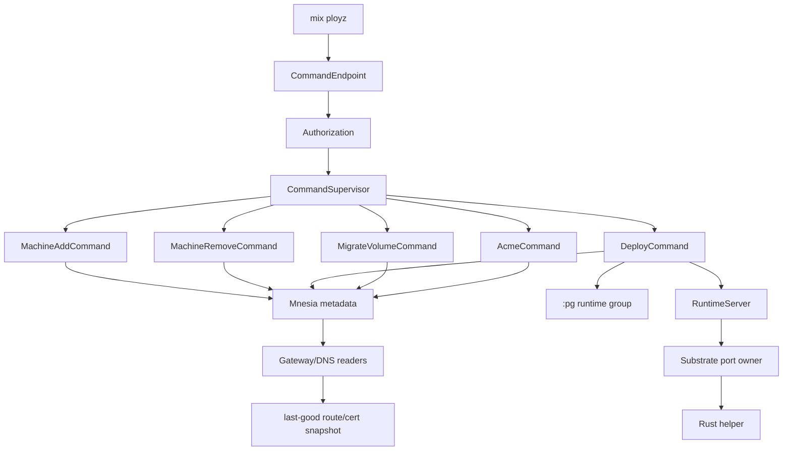

# feat: Build BEAM/Mnesia v2 MVP slice

## Summary

Build the first runnable Ployz v2 slice as one small Elixir/OTP application
beside the existing Rust workspace. The slice should prove the new shape with
the fewest moving pieces: Mnesia for tiny committed metadata, `:pg` for live
roles, supervised command processes for explicit operations, and a narrow Rust
helper protocol for substrate work.

---

## Problem Frame

The current Rust/NATS v1 control plane has too much persistent machinery for the
new direction. The v2 MVP should delete that shape, not wrap it: no custom fact
sync, no Chitchat, no broad store facades, no pre-deploy/pre-commit state, and
no background reconciler.

---

## Assumptions

*This plan was authored in LFG pipeline mode without a synchronous planning
confirmation gate. The items below are agent inferences that should remain
visible during implementation and review.*

- The first PR should land a runnable v2 skeleton and fakeable command paths,
  not a production-ready replacement for all Rust v1 behavior.
- The first slice should be one `ployz` OTP app with internal modules. Separate
  Mix apps can be extracted later only when a second lifecycle or consumer makes
  the boundary useful.
- The existing `ployz` npm/bin wrapper and `ployz.sh` installer semantics remain
  unchanged. The experimental v2 operator entrypoint is `mix ployz ...`.
- Real Docker/ZFS/WireGuard/ACME internals can start behind fakeable helpers;
  command receipts, trust boundaries, and commit semantics are the first thing
  to prove.
- The origin document's machine-add wording is corrected here: `active` is the
  final state after a `joining` pre-active phase, not the first durable write.

---

## Requirements

- R1. Every v2 node runs the same BEAM daemon and can accept operator commands
  through one defined local ingress path.
- R2. Distributed Erlang is the node messaging layer; `:pg` is only live role
  discovery, not durable truth.
- R3. Mnesia with `disc_copies` stores only tiny committed metadata: machines,
  command receipts, services, deploy revisions, service heads, routes, cert
  references, volumes, and leases.
- R4. Machine add uses an explicit `joining -> active` boundary so deploy cannot
  select a half-added node.
- R5. Machine remove marks a node draining or removed; future deploys ignore it.
- R6. Deploy parses one tiny native manifest, selects reachable active runtime
  members, starts/probes through the runtime seam, and commits deploy revision,
  service head, routes, and receipt atomically.
- R7. Gateway/DNS read committed route/cert rows and converge eventually while
  preserving last-good snapshots on refresh failure.
- R8. ZFS migration commits a new volume generation only after destination
  verification.
- R9. ACME uses one Mnesia lease row per hostname; certificate rows advance only
  after issuance succeeds.
- R10. Runtime inspection reports stale/unknown/removed-machine resources
  without mutating them; cleanup only occurs inside explicit deploy/remove work.
- R11. Rust ports/helpers own blocking or privileged substrate work; Rustler is
  reserved for bounded helpers and is not required for this first slice.
- R12. Expected command failures are structured and visible in command receipts;
  no failure should exist only in logs.
- R13. Command authorization exists before machine add/remove/deploy/cert work
  starts, even for the first local-only ingress path.
- R14. Secret-bearing material is never persisted as manifest values, command
  receipts, logs, or raw Mnesia rows; Mnesia stores references and metadata only.

**Origin flows:** machine add, machine remove, deploy, ZFS volume migration,
ACME, stale runtime classification.

**Origin acceptance examples:** three-node deploy and gateway serving, offline
node excluded from deploy, stale runtime reported, ZFS migration success/failure
commit boundaries, ACME lease retry, stale cleanup scheduled by explicit work.

---

## Scope Boundaries

- Do not modify the v1 Rust daemon, NATS store, or orchestrator as the v2 control
  plane.
- Do not import v1 deploy phases, pre-commit/pre-deploy state, or NATS-shaped
  store concepts into v2.
- Do not build a background adoption pass, boot cleanup, or reconciler.
- Do not store runtime health, `:pg` membership, helper liveness, or gateway
  freshness as durable truth.
- Do not replace the existing `ployz`/`ployz.sh` packaging or production
  binaries in this slice.
- Do not make two-node clusters pretend to be HA; unsafe metadata writes must
  fail visibly once quorum rules are configured.
- Do not use Ambitious for this slice. It remains a possible Rust-only spike,
  but it does not provide Mnesia and would reintroduce custom metadata
  replication decisions.

### Deferred to Follow-Up Work

- TLS Distributed Erlang hardening, epmd replacement, and fixed distribution
  ports beyond the MVP private-interface/cookie gate.
- Extraction of real Docker/ZFS/WireGuard/ACME internals from existing Rust
  crates into the helper.
- Full replacement packaging for `ployzd`, `ployzctl`, gateway, and DNS.
- Ambitious spike for a Rust-only actor alternative, if the product direction
  changes away from BEAM/Mnesia.

---

## Context & Research

### Relevant Code and Patterns

- `VISION.md` defines explicit operator commands, no reconcilers, live state
  separation, atomic operations, disposable daemon behavior, and peer nodes.
- `Cargo.toml` and `justfile` define the existing Rust workspace and test loop.
- `.github/workflows/pr.yml` currently verifies Rust only; this plan adds a
  reproducible Elixir CI path.
- `package.json` and `ployz.sh` already own the `ployz` bin/installer behavior,
  so v2 uses `mix ployz` until packaging is intentionally replaced.
- `crates/ployz-runtime-backends/src/runtime/engine.rs` is the main Docker
  substrate reuse target.
- `crates/ployz-runtime-backends/src/runtime/probe.rs` has readiness probe
  behavior worth mining for the Rust helper.
- `crates/ployz-runtime-backends/src/runtime/diff.rs` and
  `crates/ployz-runtime-backends/src/runtime/labels.rs` are useful references
  for stale runtime classification.
- `crates/ployz-runtime-backends/src/storage/zfs.rs` and
  `crates/ployz-runtime-backends/src/storage/shell.rs` provide the ZFS and
  shell-runner seams that should eventually move behind the v2 helper protocol.
- `crates/ployz-cert-backends/src/instant_acme_issuer.rs` is the likely ACME
  extraction source, but v2 should keep the command/lease semantics in BEAM.
- `crates/ployz-gateway/src/routes.rs`, `crates/ployz-gateway/src/proxy.rs`,
  and `crates/ployz-dns/src/resolve.rs` are serving/projection references whose
  NATS sync inputs should not be carried forward.

### Institutional Learnings

- `docs/solutions/architecture-patterns/authority-status-separates-truth-from-observation-2026-05-08.md`:
  durable truth and live observation must remain separate.
- `docs/solutions/integration-issues/drain-aware-deploy-self-target-drain-nats-timeout-2026-05-10.md`:
  draining/removal intent is consumed by the next explicit deploy/remove, not a
  reconciler trigger.
- `docs/solutions/architecture-patterns/preflight-authority-promotions-before-mutation-2026-05-08.md`:
  prove participants and compatibility before durable mutation.
- `docs/solutions/performance-issues/machine-add-timeout-tests-2026-05-10.md`:
  tests should use operation-scoped fake wait policies and fake transports.

### External References

- Erlang Mnesia reference: `https://www.erlang.org/doc/apps/mnesia/mnesia.html`
- Erlang Mnesia transactions: `https://www.erlang.org/doc/apps/mnesia/mnesia_chap4.html`
- Erlang `:pg`: `https://www.erlang.org/docs/29/apps/kernel/pg`
- Erlang Distributed Erlang: `https://www.erlang.org/doc/system/distributed.html`
- Erlang ports: `https://www.erlang.org/doc/system/ports.html`
- Elixir `Port`: `https://hexdocs.pm/elixir/Port.html`
- Elixir `DynamicSupervisor`: `https://hexdocs.pm/elixir/DynamicSupervisor.html`
- Elixir releases: `https://hexdocs.pm/mix/Mix.Tasks.Release.html`
- Ambitious alternative considered: `https://github.com/scrogson/ambitious`

---

## Key Technical Decisions

- Use one Mix project and one OTP application for the first slice. Internal
  modules under `lib/ployz/...` are enough until independent lifecycle pressure
  appears.
- Use `mix ployz ...` for the MVP operator surface so the existing `ployz`
  installer entrypoint remains untouched.
- Define command ingress as a constrained local endpoint that accepts opaque
  command requests and calls `Ployz.CommandEndpoint.authorize_and_dispatch`.
  Distributed Erlang is for node-to-node traffic, not the public operator
  ingress, and the distribution cookie is transport authentication rather than
  the command authorization model.
- Bind Distributed Erlang to the configured private/WireGuard interface in
  clustered mode, require a generated per-cluster cookie stored outside source
  control with restrictive permissions, and make non-hardened single-node/dev
  mode explicit.
- Start with `disc_copies` tables through one Mnesia owner module. Schema and
  table lifecycle must be explicit boot work, not scattered checks.
- Use normal Mnesia transactions for command state and metadata commits. Dirty
  writes are not allowed for authoritative command or lifecycle state.
- Create command receipts before external side effects. Receipts carry owner,
  lease token, phase, started time, last visible error, and terminal status so a
  crashed command leaves visible evidence.
- Add Mnesia leases for deploy/service, volume, and ACME serialization. `:pg`
  decides who is live enough to ask, but leases serialize durable mutation.
- Treat machine add as `joining -> active`; a node becomes selectable only after
  the command can prove membership metadata and live runtime role readiness.
- Treat unreachable machine remove as explicit removal intent that affects
  future scheduling and routing, while stranded runtime state remains stale
  observation until a later explicit command can reach it.
- Use JSON-lines over stdio for the first Rust helper protocol: one request per
  line, one response per line, required `version`, `request_id`, `op`, and
  `params`, with structured `ok` or redacted `error` responses.
- Keep the first helper protocol to deploy/runtime inspection verbs only. ZFS
  and ACME verbs are introduced by their command units; WireGuard application is
  deferred.
- Keep gateway/DNS as projection readers over committed Mnesia rows. Deploy
  commits are allowed to succeed when gateway refresh is best-effort, but the
  receipt must include committed route revision versus observed gateway
  revision/freshness.
- Define the first secret reference scheme as local helper-owned refs:
  `ployz-secret://<name>` and `ployz-cert://<hostname>/<revision>`. Only the
  helper resolves refs to plaintext/key material, under restrictive filesystem
  permissions, and BEAM messages carry refs rather than values.

---

## Open Questions

### Resolved During Planning

- Should stale runtime state be cleaned on boot? No. It is reported as stale and
  may be cleaned only by later explicit deploy/remove work.
- Should `:pg` membership be persisted? No. It is live routing input only.
- Should v2 reuse v1 NATS/store/orchestrator crates? No. Reuse only substrate
  internals by extraction behind helper boundaries.
- Should machine add write `active` immediately? No. Use a `joining -> active`
  boundary so deploy cannot select a half-added node.
- Should the first slice expose a `ployz` binary? No. Use `mix ployz` and leave
  existing installer semantics alone.
- Should Ambitious replace BEAM/Mnesia? No for this objective. It may be spiked
  only if the goal changes to a Rust-only actor rewrite.
- Is ACME renewal scheduled in the first slice? No. The first slice implements
  explicit `cert issue`; renewal scheduling is a follow-up unless a later plan
  adds a visible scheduler with command receipts and bounded retry.

### Deferred to Implementation

- Exact Mnesia record representation: choose tuples or structs once the first
  schema code is being written.
- Exact local endpoint transport: Unix socket is preferred on Linux/macOS, but
  loopback may be used if the implementation keeps the same opaque
  request/authorization boundary.
- Exact multi-node CI mechanics: a real local three-node smoke test is required,
  but the implementing agent may choose the cleanest ExUnit helper shape.
- Full Mnesia majority/master-node recovery policy: add clear APIs now, but
  partition recovery hardening belongs to a later hardening pass.

---

## Output Structure

```text
mix.exs
config/
  config.exs
  runtime.exs
lib/
  mix/tasks/ployz.ex
  ployz/
    application.ex
    supervisor.ex
    auth.ex
    command_endpoint.ex
    cluster/
    metadata/
    commands/
    manifest/
    runtime/
    gateway/
    substrate/
test/
  ployz/
crates/
  ployz-substrate-helper/
```

---

## High-Level Technical Design

> *This illustrates the intended approach and is directional guidance for
> review, not implementation specification. The implementing agent should treat
> it as context, not code to reproduce.*



```text
deploy command:
  authorize operator
  create running command receipt
  acquire lease(service)
  validate manifest and route conflicts
  get live runtime members from :pg
  ask candidates for bids with timeouts
  start/probe selected runtime through helper
  sync transaction:
    deploy_revisions[service, next_revision]
    service_heads[service] = next_revision
    routes[host] = next_revision
    commands[command_id] = committed receipt
  best-effort gateway refresh
  return receipt with committed route revision and observed gateway freshness
```

---

## Implementation Units

### U1. Single OTP App Boot and Tooling

**Goal:** Add the v2 Mix project, one OTP application, and reproducible local/CI
verification hooks.

**Requirements:** R1, R2, R11, R13

**Dependencies:** None

**Files:**
- Create: `mix.exs`
- Create: `config/config.exs`
- Create: `config/runtime.exs`
- Create: `lib/ployz/application.ex`
- Create: `lib/ployz/supervisor.ex`
- Create: `test/ployz/application_test.exs`
- Modify: `justfile`
- Modify: `.github/workflows/pr.yml`

**Approach:**
- Build one small OTP app, not an umbrella of many apps.
- Choose explicit OTP/Elixir versions for CI and document them in the workflow.
- Add `just test-v2` and `just format-v2` without weakening existing Rust checks.
- Keep startup cheap; no network or helper startup should block `init/1`.

**Patterns to follow:**
- `VISION.md` for explicit command-shaped operation surfaces.
- Elixir `Application` and `Supervisor` official patterns.

**Test scenarios:**
- Happy path: starting the application supervisor produces a live supervision
  tree.
- Edge case: booting without optional helper configuration still starts the app.
- Integration: CI can run `mix format --check-formatted` and `mix test`.

**Verification:**
- The repo has a compilable Mix project and reproducible v2 verification path
  once Elixir is available.

---

### U2. Mnesia Metadata Core

**Goal:** Implement the Mnesia owner and typed metadata APIs for the tiny durable
truth set.

**Requirements:** R3, R12, R14

**Dependencies:** U1

**Files:**
- Create: `lib/ployz/metadata/schema.ex`
- Create: `lib/ployz/metadata/tables.ex`
- Create: `lib/ployz/metadata/machines.ex`
- Create: `lib/ployz/metadata/commands.ex`
- Create: `lib/ployz/metadata/services.ex`
- Create: `lib/ployz/metadata/revisions.ex`
- Create: `lib/ployz/metadata/routes.ex`
- Create: `lib/ployz/metadata/certs.ex`
- Create: `lib/ployz/metadata/volumes.ex`
- Create: `lib/ployz/metadata/leases.ex`
- Create: `test/ployz/metadata/schema_test.exs`
- Create: `test/ployz/metadata/transactions_test.exs`

**Approach:**
- Create schema/table boot in one owner module.
- Use `disc_copies` when the node is configured for durable mode and allow an
  isolated test mode with per-test Mnesia directories.
- Expose narrow modules per table, not one broad store facade.
- Create command receipts before external side effects; include owner, lease
  token, phase, started time, last visible error, and terminal status.
- Store cert and secret references only. Raw private keys, ACME account material,
  and secret values must stay out of Mnesia, receipts, logs, and CLI output.
- Add lease helpers with token and expiry so deploy/ACME/volume commands can
  serialize their resource keys.

**Patterns to follow:**
- `docs/solutions/architecture-patterns/authority-status-separates-truth-from-observation-2026-05-08.md`
- Official Mnesia transaction guidance.

**Test scenarios:**
- Happy path: schema boot creates each table exactly once and can be run twice.
- Happy path: a transaction writes deploy revision, service head, route, and
  command receipt together.
- Error path: a transaction failure leaves no partial service head or route.
- Error path: command metadata APIs do not use dirty write/delete operations.
- Edge case: expired lease can be acquired by a new owner; unexpired lease with
  a different token cannot be stolen.
- Security: cert rows persist references and metadata, not PEM private key
  material.

**Verification:**
- Metadata APIs can represent machines, commands, deploy heads, routes, cert
  references, volumes, and leases without storing live runtime observations or
  secret values.

---

### U3. Distribution, Role Groups, and Machine Lifecycle

**Goal:** Add Distributed Erlang setup gates, `:pg` role membership, and machine
add/remove command semantics.

**Requirements:** R1, R2, R4, R5, R12, R13

**Dependencies:** U1, U2

**Files:**
- Create: `lib/ployz/cluster/distribution.ex`
- Create: `lib/ployz/cluster/groups.ex`
- Create: `lib/ployz/cluster/membership.ex`
- Create: `lib/ployz/commands/supervisor.ex`
- Create: `lib/ployz/commands/machine_add.ex`
- Create: `lib/ployz/commands/machine_remove.ex`
- Create: `test/ployz/cluster/groups_test.exs`
- Create: `test/ployz/commands/machine_lifecycle_test.exs`

**Approach:**
- In clustered mode, bind distribution to the configured private/WireGuard
  interface and require a generated per-cluster cookie stored outside source
  control with restrictive permissions.
- Make non-hardened single-node/dev mode explicit and never present it as secure
  multi-node operation.
- Treat machine add as preflight-first: record `joining`, prove live role
  readiness, then mark `active`.
- Treat machine remove as durable scheduling/routing intent; unreachable runtime
  state becomes stale observation, not a reason to run cleanup in the
  background.
- Ensure `:pg` groups are rejoined from process startup and never persisted as
  truth.
- Return command receipts for add/remove success and expected failure.

**Patterns to follow:**
- `docs/solutions/architecture-patterns/preflight-authority-promotions-before-mutation-2026-05-08.md`
- `docs/solutions/integration-issues/drain-aware-deploy-self-target-drain-nats-timeout-2026-05-10.md`

**Test scenarios:**
- Happy path: machine add records `joining`, then `active` after readiness.
- Error path: machine add failure before readiness leaves the machine
  non-selectable.
- Happy path: machine remove marks a target removed and future candidate queries
  exclude it.
- Edge case: offline or missing `:pg` member is treated as no live candidate,
  not as stored truth.
- Security: clustered mode refuses missing/weak cookie configuration.
- Integration: a local three-node smoke test proves Mnesia metadata visibility
  and runtime group visibility across named nodes.

**Verification:**
- Deploy candidate selection can depend on `active` metadata plus live `:pg`
  membership without persisting live membership.

---

### U4. Command Ingress and Authorization

**Goal:** Define the one MVP command ingress path and authorize operator
commands before work starts.

**Requirements:** R1, R12, R13, R14

**Dependencies:** U1, U2, U3

**Files:**
- Create: `lib/ployz/auth.ex`
- Create: `lib/ployz/command_endpoint.ex`
- Create: `lib/mix/tasks/ployz.ex`
- Create: `test/ployz/auth_test.exs`
- Create: `test/ployz/command_endpoint_test.exs`
- Create: `test/mix/tasks/ployz_test.exs`

**Approach:**
- Expose the experimental operator surface as `mix ployz ...`.
- For the MVP, the CLI sends an opaque command request to a constrained local
  endpoint. Unix socket is preferred; loopback is acceptable only if it preserves
  OS/user or token-based local authorization and is not exposed as remote API.
- Do not use general Distributed Erlang `:rpc.call` as the operator ingress.
  Distribution remains node-to-node plumbing.
- Centralize authorization in `Ployz.Auth` before command processes start.
- Define accepted MVP actors and per-command permissions for machine add,
  machine remove, deploy, cert issue, migration, gateway routes, and status.
- Return structured authorization and transport failures.

**Patterns to follow:**
- `VISION.md` operation surface guidance.
- Existing CLI output conventions where they do not pull in v1 control-plane
  internals.

**Test scenarios:**
- Happy path: an authorized local operator can call a command endpoint.
- Error path: unauthorized machine add/remove/deploy/cert commands fail before
  command work starts.
- Error path: CLI cannot reach the configured node and returns a structured
  foreground failure.
- Security: privileged command modules are reachable only through
  `CommandEndpoint.authorize_and_dispatch`, not through an exported general RPC
  command surface.
- Security: command arguments and secret refs are redacted in errors/output.

**Verification:**
- Implementers no longer need to decide CLI transport or command auth during
  coding.

---

### U5. Runtime Helper Protocol and Runtime Server

**Goal:** Create the Elixir port owner, narrow Rust helper skeleton, and runtime
server API used by deploy and stale inspection.

**Requirements:** R6, R10, R11, R12, R14

**Dependencies:** U1, U2, U3, U4

**Files:**
- Create: `lib/ployz/substrate/port.ex`
- Create: `lib/ployz/substrate/protocol.ex`
- Create: `lib/ployz/runtime/server.ex`
- Create: `lib/ployz/runtime/stale.ex`
- Create: `lib/ployz/runtime/inspect.ex`
- Create: `crates/ployz-substrate-helper/Cargo.toml`
- Create: `crates/ployz-substrate-helper/src/main.rs`
- Modify: `Cargo.toml`
- Create: `test/ployz/substrate/port_test.exs`
- Create: `test/ployz/runtime/stale_test.exs`
- Create: `crates/ployz-substrate-helper/src/tests.rs`

**Approach:**
- Use a supervised Elixir owner process per helper port.
- Use JSON-lines over stdio with one request per line and one response per line.
  Each request has `version`, `request_id`, `op`, and `params`; each response
  has matching `request_id` and either `ok` or redacted `error`.
- Start with only deploy/runtime verbs: `docker.start`, `docker.stop`,
  `docker.inspect`, and `docker.list_ployz`.
- Add a closed request enum, bounded frame size, schema validation before
  execution, per-operation allowlisted arguments, and no shell-string command
  construction.
- RuntimeServer joins the runtime `:pg` group, exposes bid/start/probe/inspect,
  and delegates substrate work through the port owner.
- Stale classification compares local inspected resources with committed
  `service_heads` and `volumes` without mutating anything.

**Patterns to follow:**
- `crates/ployz-runtime-backends/src/runtime/engine.rs`
- `crates/ployz-runtime-backends/src/runtime/diff.rs`
- `crates/ployz-runtime-backends/src/storage/shell.rs`
- Official Elixir `Port` and Erlang ports guidance.

**Test scenarios:**
- Happy path: port owner sends a request and decodes a structured helper
  response.
- Error path: helper exit is observed and returned as structured command
  failure.
- Error path: unsupported protocol version is rejected.
- Security: unknown operations, oversized frames, malformed privileged requests,
  and disallowed arguments are rejected before execution.
- Happy path: stale classifier marks current resources current and old revision
  resources stale.
- Edge case: malformed/missing helper observations become unknown, not current.

**Verification:**
- BEAM code can exercise runtime command paths without linking Docker/ZFS calls
  into the VM.

---

### U6. Tiny Manifest Deploy and Early CLI Smoke Path

**Goal:** Implement the native manifest parser/validator, deploy command commit
path, and early `mix ployz deploy apply` smoke path.

**Requirements:** R6, R10, R12, R14

**Dependencies:** U2, U3, U4, U5

**Files:**
- Create: `lib/ployz/manifest/manifest.ex`
- Create: `lib/ployz/manifest/parser.ex`
- Create: `lib/ployz/manifest/validator.ex`
- Create: `lib/ployz/commands/deploy.ex`
- Create: `test/ployz/manifest/parser_test.exs`
- Create: `test/ployz/manifest/validator_test.exs`
- Create: `test/ployz/commands/deploy_test.exs`

**Approach:**
- Keep the manifest intentionally small: app, services, image, env/secret
  references, ports, routes/domains, ACME flag, and simple named volumes.
- Persist secret references only, never secret values. Accepted MVP refs use the
  `ployz-secret://<name>` scheme. Only the local helper resolves refs from a
  restricted helper-owned store; plaintext should not cross Distributed Erlang
  messages or be written to Mnesia, receipts, logs, helper errors, or CLI output.
- Reject route/port/volume conflicts before starting runtime work.
- Acquire a deploy lease per service or namespace before runtime mutation.
- Select from active machines that are also live runtime group members.
- Start/probe selected runtime and commit revision/head/routes/receipt in one
  Mnesia transaction.
- If the commit transaction fails after runtime start, attempt a separate
  best-effort command-receipt transaction; if metadata is unavailable, return
  structured failure to the caller and do not advance service head/routes.

**Patterns to follow:**
- `crates/ployz-types/src/spec.rs` for typed manifest ideas without copying v1
  phase concepts.
- `docs/solutions/integration-issues/drain-aware-deploy-self-target-drain-nats-timeout-2026-05-10.md`

**Test scenarios:**
- Happy path: valid manifest deploy starts/probes runtime and commits revision,
  service head, route, and command receipt.
- Error path: route conflict fails before any runtime start.
- Error path: no live active runtime candidate returns a structured failure.
- Error path: concurrent deploy loses the service lease and does not start
  containers.
- Error path: command process death after runtime start leaves a running receipt
  with visible phase rather than logs-only ambiguity.
- Security: manifest secret values are rejected or redacted and only references
  are persisted.
- Integration: offline/draining/removed nodes are excluded from candidate bids.

**Verification:**
- A service has one obvious committed deploy revision and routes point to that
  revision.

---

### U7. Gateway/DNS Projection Readers

**Goal:** Add BEAM gateway/DNS projection readers that refresh from committed
route and cert rows.

**Requirements:** R7

**Dependencies:** U2, U6

**Files:**
- Create: `lib/ployz/gateway/server.ex`
- Create: `lib/ployz/gateway/routes.ex`
- Create: `lib/ployz/gateway/dns.ex`
- Create: `lib/ployz/gateway/certs.ex`
- Create: `test/ployz/gateway/routes_test.exs`
- Create: `test/ployz/gateway/refresh_test.exs`

**Approach:**
- Read committed routes and cert references from Mnesia into an in-process
  snapshot.
- Preserve last-good snapshot on refresh failure and expose freshness/error
  status for operator surfaces.
- Define deploy-time gateway refresh as best-effort for the MVP: deploy can
  commit route rows if runtime start/probe and metadata commit succeed, but the
  receipt must report observed gateway revision/freshness separately from
  committed route revision.
- Keep serving implementation minimal for this slice; the critical behavior is
  projection semantics, not production proxy performance.

**Patterns to follow:**
- `crates/ployz-gateway/src/routes.rs`
- `crates/ployz-dns/src/resolve.rs`
- `docs/solutions/architecture-patterns/authority-status-separates-truth-from-observation-2026-05-08.md`

**Test scenarios:**
- Happy path: route rows become a gateway route snapshot.
- Happy path: cert reference rows become cert references for matching hosts.
- Error path: failed refresh preserves the previous last-good snapshot and marks
  freshness unhealthy.
- Edge case: stale runtime resources do not appear in route snapshots unless the
  committed route row points to them.
- Integration: deploy receipt distinguishes committed route revision from
  observed gateway revision.

**Verification:**
- Gateway/DNS convergence is eventually consistent and never mutates committed
  truth based on observation.

---

### U8. ZFS Migration Command

**Goal:** Implement volume migration command semantics and helper protocol verbs
without coupling them to ACME.

**Requirements:** R8, R12

**Dependencies:** U2, U3, U4, U5

**Files:**
- Create: `lib/ployz/commands/migrate_volume.ex`
- Modify: `lib/ployz/substrate/protocol.ex`
- Modify: `crates/ployz-substrate-helper/src/main.rs`
- Create: `test/ployz/commands/migrate_volume_test.exs`

**Approach:**
- Add explicit helper verbs `zfs.snapshot`, `zfs.send`, `zfs.recv`, and
  `zfs.verify`; do not model cross-node migration as one local `send_recv`.
- The BEAM command owns topology: start source and destination runtime RPCs,
  stream bytes or delegate a bounded transfer path, verify destination, then
  commit the new volume generation and receipt.
- If transfer or verification fails, do not advance volume generation. If source
  writers were stopped, attempt a foreground restart of the prior committed
  runtime and include recovery status in the receipt.

**Patterns to follow:**
- `crates/ployz-runtime-backends/src/storage/zfs.rs`
- `crates/ployzd/src/daemon/handlers/deploy/volume_transfer.rs` as a historical
  warning about source/destination topology, not as v2 architecture to copy.

**Test scenarios:**
- Happy path: migration success commits one new volume generation.
- Error path: migration interrupted before verify leaves volume ownership and
  generation unchanged.
- Error path: post-writer-stop transfer failure records whether prior runtime
  restart succeeded or manual recovery is required.
- Error path: command process death after destination receive leaves command
  receipt phase visible.

**Verification:**
- Durable volume truth only advances after destination verification.

---

### U9. ACME Command

**Goal:** Implement explicit ACME issuance with hostname leases, challenge
readiness, and private-key reference handling.

**Requirements:** R9, R12, R14

**Dependencies:** U2, U4, U5, U7

**Files:**
- Create: `lib/ployz/commands/acme.ex`
- Modify: `lib/ployz/substrate/protocol.ex`
- Modify: `crates/ployz-substrate-helper/src/main.rs`
- Create: `test/ployz/commands/acme_test.exs`

**Approach:**
- Add an `acme.issue` helper verb only in this unit.
- ACME acquires a hostname lease, publishes/observes challenge readiness through
  gateway state, calls the helper issuer, and writes the cert reference row only
  on success.
- Store private keys and ACME account credentials in a restricted local
  helper-owned path with restrictive permissions. Mnesia stores
  `ployz-cert://<hostname>/<revision>` refs and metadata only.
- Gateway readers resolve cert refs through the helper on the gateway node. If
  the referenced key material is absent locally, the gateway reports missing key
  material in freshness/status and preserves last-good cert state. Cross-node key
  distribution is deferred unless implemented through explicit helper-owned
  transfer with redacted receipts.
- ACME failure preserves the previous active cert and releases/expires the lease
  for retry.
- Renewal scheduling is out of this first slice; explicit `cert issue` is the
  operator command.

**Patterns to follow:**
- `crates/ployz-cert-backends/src/instant_acme_issuer.rs`
- Official Mnesia lease/transaction implications from research.

**Test scenarios:**
- Happy path: ACME success writes a cert reference row and refreshes gateway cert
  view.
- Error path: ACME issuer crash preserves old cert, expires lease, and allows
  retry.
- Edge case: duplicate ACME command for the same hostname loses the lease.
- Security: command receipts and logs redact private key, account key, and token
  material.

**Verification:**
- Durable certificate truth only advances after proven command success, without
  raw key material in Mnesia.

---

### U10. Remaining CLI Surface, Docs, and Smoke Verification

**Goal:** Finish the MVP `mix ployz` surface, docs, and local verification
coverage.

**Requirements:** R1, R4, R5, R6, R7, R8, R9, R10, R12, R13, R14

**Dependencies:** U1, U2, U3, U4, U5, U6, U7, U8, U9

**Files:**
- Modify: `lib/mix/tasks/ployz.ex`
- Create: `lib/ployz/cli/output.ex`
- Create: `test/ployz/cli/main_test.exs`
- Modify: `README.md`

**Approach:**
- Expose `machine add`, `machine remove`, `deploy apply`, `volume migrate`,
  `cert issue`, `gateway routes`, and `status` under `mix ployz`.
- Support human output by default and structured output where cheap to add.
- Status separates committed metadata from live/stale runtime observations.
- Add README examples and call out that v2 is experimental and does not replace
  current v1 binaries.

**Patterns to follow:**
- `VISION.md` primitive CLI surface.
- Existing `justfile` verification conventions.

**Test scenarios:**
- Happy path: CLI dispatches each MVP command to the correct command module.
- Error path: invalid manifest or missing command arguments return usage errors
  without starting command work.
- Integration: status separates committed metadata from live/stale runtime
  observations.
- Integration: local three-node smoke test deploys one fake-backed service and
  a gateway reader observes the committed route revision.

**Verification:**
- The v2 slice has an operator-facing command path and a documented test loop.

---

## System-Wide Impact

- **Interaction graph:** BEAM command processes become the v2 orchestration
  owner; Rust crates remain substrate/helper implementation candidates.
- **Error propagation:** Expected command failures must become structured
  command receipts and caller results. Logs are not an audience.
- **State lifecycle risks:** Mnesia writes must be transactional at commit
  boundaries; helper success before metadata commit can create stale runtime
  artifacts that are reported but not reconciled.
- **Security boundaries:** Distributed Erlang, command ingress, secret refs, and
  Rust helper requests are explicit trust boundaries in the first slice.
- **API surface parity:** CLI, future SDK, and cloud consumers should all call
  the same BEAM command endpoint rather than reaching into Mnesia tables.
- **Integration coverage:** Unit tests can prove table and command behavior, but
  real Docker/ZFS/WireGuard/ACME require later E2E.
- **Unchanged invariants:** The existing Rust v1 binaries and installer wrapper
  remain in place during this slice; v2 does not silently change current
  production behavior.

---

## Risks & Dependencies

| Risk | Mitigation |
|------|------------|
| Elixir/Mix is not installed locally | Pin OTP/Elixir in CI and document local setup; do not claim local Mix verification if unavailable |
| Mnesia split-brain assumptions creep in | Add a three-node local smoke test and keep full majority/recovery hardening explicit follow-up |
| `:pg` is mistaken for truth | Keep all durable decisions tied to Mnesia rows and probe selected members at decision time |
| Distributed Erlang is exposed unsafely | Bind clustered mode to private interface, require generated cookie, document dev-only insecure mode |
| Rust helper protocol becomes a second daemon | Keep the protocol small, supervised, request/response, and closed over known operations |
| Secrets leak into metadata or output | Persist refs only and test redaction for manifests, certs, receipts, errors, and CLI output |
| v1 concepts leak into v2 | Use v1 files only as substrate references and preserve explicit non-goals in reviews |
| Stale cleanup becomes a reconciler | Only report stale state unless an explicit deploy/remove command schedules cleanup |

---

## Documentation / Operational Notes

- Update README with the v2 experimental status, local Elixir prerequisites, and
  `mix ployz` examples once the skeleton exists.
- Document that the first v2 slice is not a replacement release for current v1
  binaries or npm/bin installer behavior.
- Record any unrun verification caused by missing Elixir tooling in the PR body.

---

## Sources & References

- **Origin document:** [docs/brainstorms/2026-05-16-ployz-v2-beam-mnesia-mvp.md](../brainstorms/2026-05-16-ployz-v2-beam-mnesia-mvp.md)
- Superseded context: [docs/brainstorms/2026-05-16-ployz-v2-beam-first-rewrite-requirements.md](../brainstorms/2026-05-16-ployz-v2-beam-first-rewrite-requirements.md)
- Ideation context: [docs/ideation/2026-05-16-authority-local-hard-fork-ideation.md](../ideation/2026-05-16-authority-local-hard-fork-ideation.md)
- Product vision: [VISION.md](../../VISION.md)
- Institutional learning: [docs/solutions/architecture-patterns/authority-status-separates-truth-from-observation-2026-05-08.md](../solutions/architecture-patterns/authority-status-separates-truth-from-observation-2026-05-08.md)
- Institutional learning: [docs/solutions/integration-issues/drain-aware-deploy-self-target-drain-nats-timeout-2026-05-10.md](../solutions/integration-issues/drain-aware-deploy-self-target-drain-nats-timeout-2026-05-10.md)
- Institutional learning: [docs/solutions/architecture-patterns/preflight-authority-promotions-before-mutation-2026-05-08.md](../solutions/architecture-patterns/preflight-authority-promotions-before-mutation-2026-05-08.md)
- Institutional learning: [docs/solutions/performance-issues/machine-add-timeout-tests-2026-05-10.md](../solutions/performance-issues/machine-add-timeout-tests-2026-05-10.md)
- Mnesia reference: [https://www.erlang.org/doc/apps/mnesia/mnesia.html](https://www.erlang.org/doc/apps/mnesia/mnesia.html)
- Mnesia transactions: [https://www.erlang.org/doc/apps/mnesia/mnesia_chap4.html](https://www.erlang.org/doc/apps/mnesia/mnesia_chap4.html)
- `:pg` reference: [https://www.erlang.org/docs/29/apps/kernel/pg](https://www.erlang.org/docs/29/apps/kernel/pg)
- Elixir Port: [https://hexdocs.pm/elixir/Port.html](https://hexdocs.pm/elixir/Port.html)
- Ambitious: [https://github.com/scrogson/ambitious](https://github.com/scrogson/ambitious)
