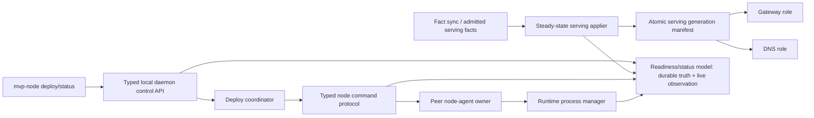

# Refactor MVP Product Vertical Hardening

## Summary

Harden the current three-server MVP vertical from a happy-path proof into a serious product-grade slice. The plan keeps the `MVP/` isolation, but replaces proof-shaped readiness and fact-backed RPC shortcuts with typed control surfaces, explicit authority, durable operation status, restartable daemon behavior, and E2E tests that prove the contracts under failure.

---

## Implementation Checkpoint - 2026-05-19

Status: partially implemented and verified. The plan remains active because a closed typed node-command protocol, a daemon/supervised serving applier, and broader negative E2E coverage are not complete.

Implemented in this branch:

- Daemon readiness is now a structured `daemon-status` JSON contract with bounded client read/write deadlines and owner-only local socket permissions.
- Daemon local control now runs as a supervised task with its own Unix listener, bounded per-connection IO, shared import progress state, and a shutdown path instead of being opportunistically serviced inside the import loop.
- Daemon import idle no longer refreshes the p2panda stream in a tight loop, and pending node-agent RPC requests are scanned even when no new import batch arrives.
- Node-agent RPC facts now require verified candidates, key/payload binding, requester author binding, reply author binding, payload hashes, and request expiry.
- Admission application now ignores conflicted candidates and only accepts admission facts from the local node or invite/bootstrap-authorized peers.
- Invite tokens now carry bootstrap `NodeId`, so joined peers can persist founder identity for later addressability.
- `deploy --control <socket>` now routes through the live daemon that owns transport, membership, and remote node-agent command handling. Standalone deploy still fails fast when the local daemon owns the p2panda transport port.
- Daemon-owned deploy now refreshes remote node-agent bridge registrations from current membership, so a daemon that started before peer admission can still deploy to newly admitted peers.
- Deploy now records durable lifecycle status facts for planned, cleanup-pending, cleanup-done, and failed outcomes, and `deploy-status` exposes those facts to operators.
- Deploy now reserves serving epochs with durable facts before participant mutation, so failed or concurrent attempts cannot silently reuse the same serving epoch for a different deploy.
- Serving epoch selection ignores conflicted serving facts.
- Gateway/DNS serving control sockets now set owner-only socket permissions and create missing control directories privately.
- p2panda startup publish is bounded by a timeout.
- Runtime metadata writes are atomic, and process stop waits for exit before escalating to kill.
- Projection now writes gateway and DNS snapshots with an atomic `serving-generation.json` manifest that binds one serving generation to both snapshot revisions and content checksums.
- Serving roles now load a committed serving generation, expose the loaded generation in status, and reject mismatched manifests while preserving last-good state on reload failure.
- The three-server smoke now proves structured daemon readiness through the dedicated control task, daemon-owned deploy after post-start peer admission, durable deploy status phases, live gateway/DNS reload across a second committed serving generation without role restart, founder-daemon-down product serving, product serving before and after target-daemon kill, and target daemon restart readiness.

Still open before this can be called complete:

- Replace generic subject/payload node-agent RPC with a closed internal command protocol and narrow operation-specific grants.
- Add a daemon/supervised serving applier so committed serving generations can be applied as an explicit bounded operation instead of relying only on direct role reload calls.
- Expand E2E negative coverage for forged/stale commands, unavailable remote targets, and peer-initiated deploys.

Verified:

- `cargo test --manifest-path MVP/runtime/Cargo.toml`
- `cargo test --manifest-path MVP/projection/Cargo.toml`
- `cargo test --manifest-path MVP/serving/Cargo.toml`
- `cargo test --manifest-path MVP/node/Cargo.toml`
- `cargo test --manifest-path MVP/node/Cargo.toml daemon_control_status_responds_while_import_is_idle -- --nocapture`
- `MVP/scripts/three-server-smoke.sh`

---

## Problem Frame

The current vertical proves that founder admission, peer daemon startup, remote deploy, gateway serving, DNS serving, and target-daemon termination can work on one machine. It does not yet prove the core product promise in `VISION.md`: explicit operations with visible preconditions, bounded effects, clear results, and data-plane continuity when the coordinator daemon is down.

The biggest issue is not that the smoke is missing a wait loop. The issue is that readiness, internal node commands, membership authority, serving-state application, and deploy progress are not yet first-class product concepts.

---

## Requirements

- R1. Daemon readiness and status are core typed concepts, not ad hoc smoke-test strings.
- R2. Internal node-agent commands are typed, authorized, expiring, idempotent, and bound to the real sender and target.
- R3. Durable facts are not used as an unbounded transient RPC inbox that can replay stale side effects.
- R4. Conflicted durable candidates are never executed as commands or treated as normal serving truth.
- R5. Deploy progress records operator-visible phases and cleanup state durably enough for recovery and diagnosis.
- R6. Gateway and DNS serving continue from last-good local state when the coordinator daemon is down, and live serving roles can observe committed serving updates without depending on deploy command liveness.
- R7. Runtime process lifecycle records truth only after bounded verification of process state.
- R8. E2E coverage proves restart, stale-command rejection, forged-command rejection, live reload, and failure surfaces, not only the happy path.
- R9. MVP code remains isolated under `MVP/` and does not migrate into the root daemon or legacy binaries as part of this hardening work.

---

## Scope Boundaries

- Do not migrate MVP code into `crates/`, `ployzd`, `ployzctl`, `ployz-gateway`, or `ployz-dns`.
- Do not introduce hidden reconciliation that rewrites durable truth. Background roles may observe, apply already-committed state locally, publish observations, and expose status.
- Do not require cloud products, external UI, or packaging work.
- Do not build a general-purpose distributed database or full production auth system. This plan only defines the minimum serious authority model required for admitted peers and node-agent commands.
- Do not preserve compatibility with the proof-shaped node-agent RPC fact format if replacing it produces the right core shape.

---

## Current Audit Inventory

### Critical / P0

- **Trusted peers can forge node-agent RPC requests.** `MVP/node/src/node_agent_rpc.rs` reads `/facts/node-rpc/request/<target>/...`, deserializes arbitrary JSON, checks only target and subject shape, then executes the local node-agent handler. It does not bind the fact author to `requester_node_id`, verify the key matches the payload, or authorize the operation against a narrow command grant. `MVP/node/src/membership.rs` currently grants admitted peers broad `/facts/>` write authority.
- **Trusted peers can forge or replay RPC replies.** `MVP/node/src/node_agent_rpc.rs` derives request IDs from requester, target, subject, and a local counter that restarts at `1`. Reply facts are accepted by request ID without verifying the author is the target node or binding the reply to the original payload. Old success replies can satisfy later deploy operations.
- **Durable RPC requests can execute after the requester timed out.** Node-agent RPC requests are durable facts with no expiry, cancellation, phase check, or live coordinator state. A target daemon can later import and execute stale prepare/start/drain/stop commands after the operator has already seen failure.

### High / P1

- **Any admitted peer can expand the trusted author set.** `MVP/node/src/membership.rs` accepts `PeerAdmitted` facts from the shared fact store and grants the advertised peer broad fact authority without requiring an admission authority signature or invite-derived capability.
- **Joined nodes do not learn the founder `NodeId`.** `join_from_token` stores the bootstrap peer with `node_id: None`, and `LoadedNodeState::admitted_peers` filters peers without node IDs. Deploys initiated from a joined peer back to the founder cannot build a remote bridge.
- **Daemon refreshes the p2panda stream on idle.** `MVP/node/src/membership.rs` treats an idle import timeout as a reason to refresh the stream, so a quiet daemon can reconnect about 20 times per second with the default 50ms idle.
- **p2panda publish has no operation timeout.** `MVP/p2panda-transport/src/fact_node.rs` awaits publish and retry publish directly. A stalled publish can block daemon startup or control-loop progress.
- **Conflicted facts are executable.** `MVP/node/src/node_agent_rpc.rs` accepts `CandidateStatus::Conflict` for RPC requests and replies. `MVP/node/src/deploy.rs` also counts conflicts when choosing the next serving epoch.
- **The deploy CLI can create a second fact node for the same identity.** `MVP/node/src/deploy.rs` registers remote bridges by spawning a fact node in the CLI process, which can conflict with a running local daemon using the same seed/transport resources.

### Medium / P2

- **Daemon control/status is not an operator-grade control API.** `MVP/node/src/membership.rs` serves a plain-text status string inside the import loop, reads from accepted sockets without a bounded read deadline, and ignores request semantics.
- **`daemon-status` can hang.** `MVP/node/src/main.rs` uses blocking Unix socket operations without explicit connect/read/write deadlines.
- **Daemon only scans node-agent RPC requests after imported batches.** Already-present pending requests after restart or recovery can sit unhandled if no fresh import event arrives.
- **Serving control sockets allow unauthenticated local reload/shutdown.** `MVP/node/src/serving.rs` binds Unix sockets without owner-only permission enforcement or peer-credential checks.
- **Gateway and DNS update only on explicit reload or startup.** `MVP/node/src/serving.rs` and `MVP/serving/src/actor.rs` preserve last-good state, but running roles are not notified by deploy and there is no steady-state serving applier.
- **Gateway and DNS snapshots are not published as one visible generation.** `MVP/projection/src/snapshot.rs` writes gateway and DNS files independently, so roles can observe mixed generations.
- **Process stop records `Stopped` before verifying exit.** `MVP/runtime/src/process.rs` sends `SIGTERM`, clears the PID, and persists `Stopped` without wait, escalation, or PID ownership checks.
- **Process runtime has proof-level lifecycle gaps.** Loopback port allocation is bind-then-drop, metadata writes are not a fully verified durable protocol, and dropped child handles leave no supervisor/reaper.
- **The E2E smoke leaks process risk on timeout.** `MVP/e2e/src/main.rs` timeout cleanup kills runtime service PIDs from metadata, but does not reliably kill daemon/gateway/DNS children spawned before normal drops run.
- **The smoke does not prove the important negative cases.** `MVP/e2e/src/three_server_product_contract.rs` proves founder-to-peer happy path and serving after target daemon kill, but not deploy while local daemon is running, daemon restart and adoption, live gateway/DNS reload, forged commands, stale replies, remote unavailability, or joined-peer-to-founder deploy.

---

## Context & Research

### Relevant Code and Patterns

- `VISION.md`: operator commands need visible preconditions, bounded effects, clear results, and verification; daemon death must not take down data-plane serving.
- `MVP/architecture.md`: coordinator daemon is not the fate-sharing boundary for steady-state data-plane behavior; fact-sync, projection, and snapshot appliers should continue for already-authorized serving facts.
- `MVP/node/src/node_agent_rpc.rs`: current fact-backed request/reply bridge to replace or harden behind a typed protocol.
- `MVP/node/src/membership.rs`: current daemon loop, admission handling, fact grants, and plain status socket.
- `MVP/node/src/serving.rs` and `MVP/serving/src/actor.rs`: better existing pattern for JSON control requests and last-good snapshot serving.
- `MVP/deploy/src/coordinator.rs`: current deploy state machine and commit-before-cleanup flow.
- `MVP/runtime/src/process.rs`: current process lifecycle, metadata, and stop behavior.
- `MVP/e2e/src/three_server_product_contract.rs`: current black-box proof surface to expand.

### Institutional Learnings

- `docs/solutions/architecture-patterns/authority-status-separates-truth-from-observation-2026-05-08.md`: operator status must separate durable truth from live observation and must not fabricate stored truth when probes fail.
- `docs/solutions/integration-issues/drain-aware-deploy-self-target-drain-nats-timeout-2026-05-10.md`: coordination paths must be target-aware and tests must cover local and remote target behavior, not only one side.

### External References

- None used. This audit is grounded in the repository direction, MVP architecture doc, existing code, and review passes.

---

## Key Technical Decisions

- **Replace generic subject/payload RPC with a closed internal command protocol.** Node-agent operations are product mutations, not arbitrary bus subjects serialized into facts. A closed enum lets the target validate operation, deploy scope, deadline, idempotency, requester, and target before side effects.
- **Treat durable facts as command records with lifecycle, not as an RPC transport shortcut.** If p2panda facts remain the MVP transport for internal commands, the fact payload must include expiry, operation identity, payload hash, phase, and author binding. Expired or conflicted commands produce visible non-execution status, not side effects.
- **Make local daemon control a typed supervised service.** Readiness/status must run independently from the import loop and expose structured JSON with health, freshness, last error, and command availability.
- **Route deploy through daemon-owned control-plane responsibilities.** The deploy CLI should not spawn another fact node with the same identity when a local daemon is the owner of transport, membership, and node-agent command handling.
- **Add a steady-state serving applier role.** Deploy can write committed serving facts, but applying those facts to local gateway/DNS snapshots should be a daemon-independent role with its own status and last-good semantics.
- **Never execute conflicted candidates.** Conflicts are operator-visible failures or pending resolution states.
- **Keep implementation characterization-first.** Add failing tests for forged/stale/restart cases before reshaping code that currently passes the happy path.

---

## Open Questions

### Resolved During Planning

- **Is a readiness/status command the right long-term surface?** Yes. Status/readiness should be a core local control API, not a smoke-test workaround.
- **Is the current gateway/DNS survival proof enough?** No. It proves serving from an existing snapshot after daemon kill, but not steady-state applier behavior or live reload after new committed serving facts.
- **Is the fact-backed node-agent bridge a long-term solution?** Not in its current form. It must either become a typed command-fact protocol with strict authority and lifecycle, or be replaced by a daemon-owned internal peer command transport.

### Deferred to Implementation

- **Whether the typed internal command protocol remains p2panda-backed for the next slice or moves onto a direct PloyzBus/iroh request path.** The plan requires the typed protocol and authority semantics either way; implementation can choose the least disruptive transport once tests capture the failure modes.
- **Exact local control socket authorization primitive.** Implementation should choose between owner-only directory/socket permissions, peer credentials, and a local capability token based on platform support in this repo.

---

## High-Level Technical Design

> *This illustrates the intended approach and is directional guidance for review, not implementation specification.*



The coordinator owns new mutations. The serving applier owns already-committed serving state. Gateway and DNS keep serving last-good generations. Status reports the difference between durable intent, last applied generation, live observation, stale data, and current failure.

---

## Implementation Units

### U1. Add Characterization and Negative E2E Coverage

**Goal:** Lock in the failure modes the current happy-path smoke misses before reshaping the architecture.

**Requirements:** R1, R2, R3, R4, R6, R8

**Dependencies:** None

**Files:**
- Modify: `MVP/e2e/src/three_server_product_contract.rs`
- Modify: `MVP/e2e/src/three_server_harness.rs`
- Modify: `MVP/e2e/src/main.rs`
- Test: `MVP/e2e/src/three_server_product_contract.rs`
- Test: `MVP/node/src/node_agent_rpc.rs`
- Test: `MVP/node/src/membership.rs`

**Approach:**
- Add tests that prove current gaps as failing or ignored characterization cases before fixing them.
- Cover deploy while the local daemon is already running.
- Cover founder-to-peer, peer-to-founder, and peer-to-peer deploy initiation.
- Cover target daemon restart and adoption after a successful deploy.
- Cover live gateway/DNS running before a deploy and observing the new serving generation.
- Cover forged request facts, forged reply facts, stale reply replay after bridge restart, and conflicted command candidates.
- Cover non-authority peers attempting to admit a new peer.
- Register daemon/gateway/DNS child processes in harness cleanup so timeouts do not leak listeners.

**Execution note:** Characterization-first. Mark known-broken scenarios clearly while implementing the hardening units, then flip them to required passing tests as each unit lands.

**Patterns to follow:**
- `MVP/e2e/src/three_server_harness.rs` for black-box command execution and bounded polling.
- `MVP/e2e/src/three_server_product_contract.rs` for end-to-end product contract organization.

**Test scenarios:**
- Integration: start founder, peer-a, peer-b daemons; deploy from founder to peer-a while founder daemon is running; expect no duplicate fact-node bind conflict.
- Integration: deploy from peer-a to founder; expect founder bridge readiness and successful remote node-agent command handling.
- Integration: run gateway/DNS before a second deploy; expect reload or serving generation update without restarting gateway/DNS.
- Error path: prepublish a forged node-agent request where fact author does not match requester; expect rejection and no runtime mutation.
- Error path: prepublish a forged or stale success reply; expect deploy does not consume it.
- Error path: publish conflicting command candidates; expect command refusal and operator-visible status.
- Integration: time out a scenario after daemon/gateway/DNS spawn; expect cleanup terminates child processes.

**Verification:**
- The test suite can demonstrate the current product blockers and later prove each hardening unit fixed them.

### U2. Define Typed Internal Node Command Protocol

**Goal:** Replace stringly subject/payload node-agent RPC with a narrow typed command protocol that can be authorized, expired, deduplicated, and audited.

**Requirements:** R2, R3, R4, R5

**Dependencies:** U1

**Files:**
- Create: `MVP/node/src/node_command.rs`
- Modify: `MVP/node/src/node_agent_rpc.rs`
- Modify: `MVP/node/src/node_agent.rs`
- Modify: `MVP/deploy/src/coordinator.rs`
- Test: `MVP/node/src/node_command.rs`
- Test: `MVP/node/src/node_agent_rpc.rs`

**Approach:**
- Introduce a closed command enum for capacity, prepare, start, drain, stop, and cleanup operations.
- Include request ID, unguessable nonce or monotonic per-peer sequence, requester node ID, target node ID, deploy ID, phase ID, operation kind, payload hash, created-at, expires-at, and expected generation where relevant.
- Include structured reply variants for executed, rejected, expired, unauthorized, conflict, and handler failure.
- Reject expired commands before handler execution.
- Reject commands whose key/path, payload, requester, target, and fact author do not match.
- Reject `CandidateStatus::Conflict` for executable paths and surface it as a command conflict.

**Technical design:**

```text
NodeCommandEnvelope {
  identity: CommandIdentity,
  authority: RequesterAuthority,
  operation: NodeCommand,
  lifecycle: CommandLifecycle,
}

NodeCommand = CapacityProbe | PrepareInstance | StartInstance | DrainInstance | StopInstance | CleanupInstance
NodeCommandReply = Executed | Rejected | Expired | Unauthorized | Conflict | HandlerFailed
```

**Patterns to follow:**
- `MVP/deploy/src/coordinator.rs` for phase-oriented deploy intent.
- `MVP/serving/src/control.rs` for typed request/reply style.

**Test scenarios:**
- Happy path: valid command envelope executes exactly one local node-agent operation and returns a typed success reply.
- Error path: expired command returns `Expired` and does not mutate runtime state.
- Error path: payload hash mismatch returns `Rejected`.
- Error path: fact key request ID differs from payload request ID; command is rejected.
- Error path: conflicted command candidate is not executed.
- Edge case: duplicate valid command with same idempotency key returns the prior typed result without repeating side effects.

**Verification:**
- Node-agent side effects are reachable only through typed, validated command envelopes.

### U3. Tighten Membership Authority and Admission

**Goal:** Prevent broad `/facts/>` write trust from becoming implicit control-plane authority.

**Requirements:** R2, R4

**Dependencies:** U1, U2

**Files:**
- Modify: `MVP/node/src/membership.rs`
- Modify: `MVP/node/src/state.rs`
- Modify: `MVP/node/src/node_agent_rpc.rs`
- Test: `MVP/node/src/membership.rs`
- Test: `MVP/e2e/src/three_server_product_contract.rs`

**Approach:**
- Separate generic fact replication permission from privileged command/admission authority.
- Require `PeerAdmitted` facts to be authored by a founder/admission authority or backed by an invite-derived admission capability.
- Persist founder node identity for joined peers so peer-initiated deploys can address the founder.
- Bind admitted node IDs to principal IDs and p2panda author keys in one local authority record.
- Make node command authorization branch on typed grants, not display subject strings.

**Patterns to follow:**
- `MVP/node/src/state.rs` for local persisted membership shape.
- `MVP/architecture.md` authority island rules: transport identity does not imply authority.

**Test scenarios:**
- Happy path: founder admits peer; peer records founder node ID and author binding.
- Error path: admitted non-authority peer publishes `PeerAdmitted` for another key; receiving nodes reject it.
- Error path: valid fact writer without command grant publishes node command; target rejects it.
- Integration: peer-a deploys to founder after founder identity is known.

**Verification:**
- Admission and node-agent command authority are explicit, typed, and test-covered.

### U4. Build Supervised Typed Daemon Control and Status

**Goal:** Make readiness/status a product surface that works independently from import-loop progress.

**Requirements:** R1, R5, R6, R8

**Dependencies:** U1

**Files:**
- Create: `MVP/node/src/daemon_control.rs`
- Modify: `MVP/node/src/main.rs`
- Modify: `MVP/node/src/membership.rs`
- Modify: `MVP/node/src/error.rs`
- Test: `MVP/node/src/daemon_control.rs`
- Test: `MVP/e2e/src/three_server_product_contract.rs`

**Approach:**
- Introduce typed JSON requests: readiness, status, shutdown, and future command endpoints.
- Serve the control socket from its own supervised task or actor with bounded accept/read/write deadlines.
- Put the socket under an owner-only directory, set restrictive permissions where supported, and validate local peer credentials or a capability token for mutating requests.
- Return structured status separating durable truth from live observation: membership view, fact-sync health, stream state, last import progress, command protocol health, runtime health, serving applier health, and last failures.
- Stop refreshing p2panda streams on idle; report idle as healthy stale/quiet observation.
- Add bounded publish and stream refresh timeouts with backoff/jitter and status fields.

**Patterns to follow:**
- `MVP/serving/src/control.rs` for JSON request/response.
- `MVP/serving/src/actor.rs` for last-good plus status/freshness semantics.
- `docs/solutions/architecture-patterns/authority-status-separates-truth-from-observation-2026-05-08.md`.

**Test scenarios:**
- Happy path: `mvp-node daemon-status` returns structured JSON readiness while import stream is idle.
- Error path: client connects and sends nothing; daemon control service times out the read without blocking fact import.
- Error path: p2panda publish stalls; status remains reachable and reports transport timeout.
- Error path: unauthorized local shutdown request is rejected.
- Integration: daemon restart exposes adopted runtime and serving-applier status.

**Verification:**
- Readiness is an explicit API contract and cannot be blocked by a quiet or stalled import loop.

### U5. Route Deploy Through Daemon-Owned Control-Plane Responsibilities

**Goal:** Remove the deploy CLI's duplicate fact-node ownership and make daemon presence/absence an explicit deploy precondition.

**Requirements:** R1, R2, R3, R5, R8

**Dependencies:** U2, U3, U4

**Files:**
- Modify: `MVP/node/src/deploy.rs`
- Modify: `MVP/node/src/main.rs`
- Modify: `MVP/deploy/src/coordinator.rs`
- Modify: `MVP/deploy/src/facts.rs`
- Test: `MVP/e2e/src/three_server_product_contract.rs`
- Test: `MVP/deploy/src/coordinator.rs`

**Approach:**
- Make `mvp-node deploy` use the local daemon control API for transport/membership/command ownership when a daemon is expected.
- Fail visibly when the local daemon is unavailable, unless an explicit standalone/offline mode is introduced with its own clear preconditions.
- Record durable deploy phases: planned, capacity-probed, decision-written, candidates-started, serving-committed, cleanup-pending, cleanup-done, failed.
- Add a namespace commit guard or deploy lease so concurrent deploys cannot choose the same serving epoch through `max + 1`.
- Make cleanup-pending durable and operator-visible if cleanup fails after serving commit.

**Patterns to follow:**
- `MVP/deploy/src/coordinator.rs` existing commit-before-cleanup flow.
- `docs/solutions/integration-issues/drain-aware-deploy-self-target-drain-nats-timeout-2026-05-10.md` for local/remote target-aware behavior.

**Test scenarios:**
- Happy path: deploy while local daemon is running uses daemon-owned command path and does not spawn a second fact node.
- Error path: local daemon unavailable returns a structured precondition failure.
- Error path: remote peer unavailable returns a structured command failure and durable failed phase.
- Edge case: cleanup fails after serving commit; deploy status records cleanup-pending or cleanup-failed without rolling back serving truth silently.
- Integration: concurrent deploy attempts cannot commit the same serving epoch.

**Verification:**
- Deploy has explicit lifecycle status and no hidden duplicate owner for transport/membership.

### U6. Add Steady-State Serving Applier and Atomic Generation Manifest

**Goal:** Let gateway/DNS observe already-committed serving truth independent of deploy command liveness, while preserving last-good behavior.

**Requirements:** R1, R4, R6, R8

**Dependencies:** U4, U5

**Files:**
- Create: `MVP/node/src/serving_applier.rs`
- Modify: `MVP/node/src/serving.rs`
- Modify: `MVP/projection/src/snapshot.rs`
- Modify: `MVP/serving/src/actor.rs`
- Test: `MVP/node/src/serving_applier.rs`
- Test: `MVP/projection/src/snapshot.rs`
- Test: `MVP/e2e/src/three_server_product_contract.rs`

**Approach:**
- Introduce a serving applier role that imports or observes already-authorized serving facts, projects them, writes snapshots, publishes a generation manifest, and signals gateway/DNS reload with bounded control deadlines.
- Make gateway and DNS load only a complete generation manifest with checksums and epoch.
- Preserve last-good snapshots on projection, write, manifest, or reload failure and expose freshness/last-error status.
- Reject serving projection from conflicted facts; surface conflict status instead.

**Patterns to follow:**
- `MVP/serving/src/actor.rs` for last-good load/reload status.
- `MVP/projection/src/snapshot.rs` for atomic file write mechanics.

**Test scenarios:**
- Happy path: deploy writes serving facts; serving applier publishes a new generation and running gateway/DNS reload without restart.
- Error path: invalid snapshot generation is rejected and last-good serving continues.
- Error path: gateway reload fails; applier status records failure and DNS handling is independent.
- Edge case: mixed gateway/DNS files without a manifest are not loaded as a complete generation.
- Integration: coordinator daemon is down, another node commits serving facts, serving applier applies the new generation if authorized.

**Verification:**
- Gateway/DNS serving depends on local last-good generation and serving applier health, not on deploy command lifetime.

### U7. Harden Runtime Process Lifecycle

**Goal:** Make runtime metadata match verified process state and support daemon restart/adoption.

**Requirements:** R7, R8

**Dependencies:** U1, U4

**Files:**
- Modify: `MVP/runtime/src/process.rs`
- Modify: `MVP/node/src/node_agent.rs`
- Test: `MVP/runtime/tests/process_runtime.rs`
- Test: `MVP/e2e/src/three_server_product_contract.rs`

**Approach:**
- Persist metadata with an atomic, checked write protocol.
- Validate PID ownership before stop or adoption decisions.
- Stop processes with bounded wait, escalation, and visible failure if the child does not exit.
- Avoid bind-then-drop port races where practical for the MVP runtime shape, or make the limitation explicit in status and tests.
- Reconcile runtime metadata on daemon restart into adopted/running/stale/missing states without fabricating success.

**Patterns to follow:**
- `docs/solutions/architecture-patterns/authority-status-separates-truth-from-observation-2026-05-08.md`.

**Test scenarios:**
- Happy path: stop waits for child exit before persisting `Stopped`.
- Error path: stubborn child is escalated or records a visible stop failure.
- Error path: PID reuse or ownership mismatch is rejected.
- Integration: daemon restart adopts a live runtime child and reports it through status.
- Integration: daemon restart sees missing child metadata and reports stale/missing rather than running.

**Verification:**
- Runtime state is a truthful, operator-visible model of process lifecycle.

### U8. Final Product Contract E2E and Documentation Pass

**Goal:** Replace false confidence with a product contract that states and proves the MVP vertical's actual guarantees.

**Requirements:** R1, R5, R6, R8, R9

**Dependencies:** U1, U2, U3, U4, U5, U6, U7

**Files:**
- Modify: `MVP/e2e/src/three_server_product_contract.rs`
- Modify: `MVP/architecture.md`
- Modify: `MVP/README.md`
- Test: `MVP/e2e/src/three_server_product_contract.rs`

**Approach:**
- Promote the characterization scenarios to required passing E2E contract checks.
- Document what the MVP now guarantees, what remains intentionally deferred, and what failure audiences exist.
- Remove wording that implies the earlier proof-shaped bridge/status behavior is final.
- Keep the top-level scope aligned with `VISION.md` and avoid root-workspace migration.

**Test scenarios:**
- Integration: three servers admit, converge, deploy, serve HTTP/DNS, restart target daemon, adopt runtime, deploy again, and keep gateway/DNS serving.
- Integration: kill coordinator daemon while gateway/DNS and runtime continue; status command reports coordinator down from the caller's perspective and serving remains available from last-good generation.
- Error path: forged request/reply/admission facts are rejected and surfaced.
- Error path: remote target down fails deploy with structured status and no later stale side effects.
- Error path: serving projection conflict prevents new generation while last-good remains active.

**Verification:**
- `just test` and the affected MVP E2E commands prove the current product contract without relying on arbitrary sleeps or hidden shortcuts.

---

## System-Wide Impact

- **Interaction graph:** CLI deploy/status flows route through local daemon control; daemon delegates to typed command protocol; serving applier observes committed serving facts; gateway/DNS consume generation manifests.
- **Error propagation:** Foreground operations return structured precondition, authorization, timeout, conflict, expired, and handler failure variants. Background roles preserve last-good state and publish status/freshness.
- **State lifecycle risks:** Stale command facts, stale replies, conflicted facts, PID reuse, mixed snapshot generations, and cleanup-pending deploy phases all become modeled states rather than implicit success paths.
- **API surface parity:** `daemon-status` should produce the same status model that E2E and future operator commands consume.
- **Integration coverage:** Unit tests cover typed validation; E2E covers daemon restart, live serving reload, forged fact rejection, unavailable peers, and cleanup behavior.
- **Unchanged invariants:** MVP code remains under `MVP/`; gateway/DNS continue serving last-good local state; deploy still commits serving before cleanup/drain.

---

## Risks & Dependencies

| Risk | Mitigation |
|------|------------|
| Typed command facts become another generic RPC mechanism | Keep a closed enum owned by node-agent/deploy/runtime operations, with explicit authorization per operation. |
| Status grows into feature registry state inside the daemon | Status aggregates owned subsystem observations; feature state remains in the subsystem that owns it. |
| Serving applier becomes a hidden reconciler | Limit it to already-authorized serving facts and local snapshot publication; it must not create new deploy decisions or rewrite durable truth. |
| Hardening blocks useful iteration for too long | Land characterization and control/status first, then command authority, then serving/runtime contracts. Each unit should improve the product contract independently. |
| Tests become timing-dependent | Prefer explicit status/readiness APIs, bounded deadlines, and event/generation assertions over sleeps. |

---

## Documentation / Operational Notes

- Update `MVP/architecture.md` with the final ownership split: coordinator daemon, typed node command protocol, serving applier, gateway/DNS roles, runtime owner, and status model.
- Update `MVP/README.md` to describe product-grade MVP guarantees and deferred work honestly.
- Document the local control API enough for E2E and future operator commands to use it as the canonical readiness/status surface.

---

## Sources & References

- Related direction: `VISION.md`
- Related architecture: `MVP/architecture.md`
- Related code: `MVP/node/src/node_agent_rpc.rs`
- Related code: `MVP/node/src/membership.rs`
- Related code: `MVP/node/src/deploy.rs`
- Related code: `MVP/deploy/src/coordinator.rs`
- Related code: `MVP/node/src/serving.rs`
- Related code: `MVP/serving/src/actor.rs`
- Related code: `MVP/runtime/src/process.rs`
- Related tests: `MVP/e2e/src/three_server_product_contract.rs`
- Related learning: `docs/solutions/architecture-patterns/authority-status-separates-truth-from-observation-2026-05-08.md`
- Related learning: `docs/solutions/integration-issues/drain-aware-deploy-self-target-drain-nats-timeout-2026-05-10.md`
