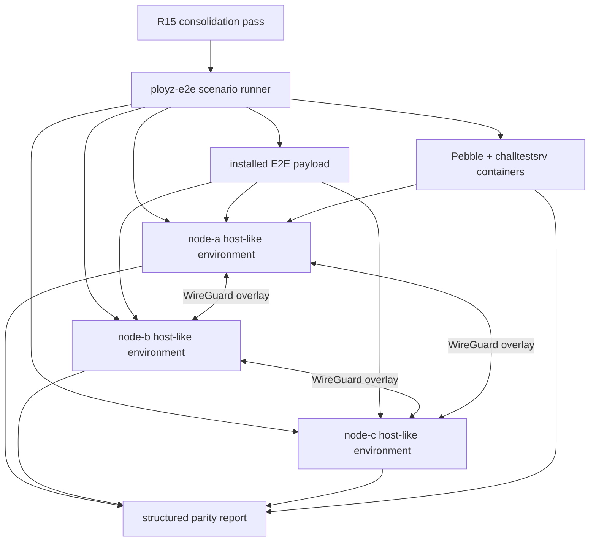
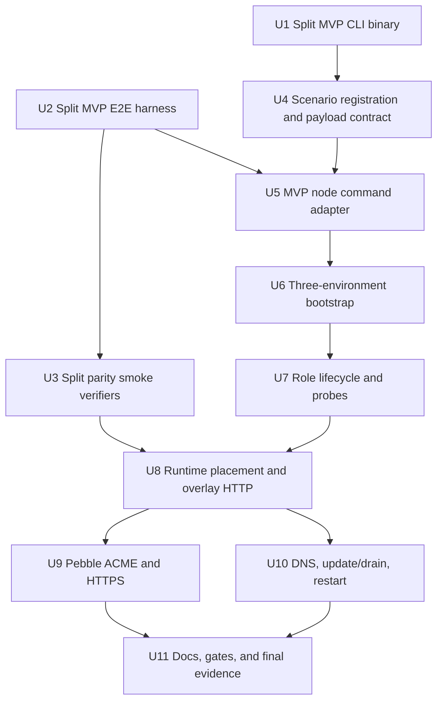

# MVP Consolidated Real-Boundary Data-Plane Parity Smoke

## Summary

The current MVP parity smoke proves the installed binary and privileged Linux
substrates in a single-host, multi-process setup, but it does not prove
cross-machine parity. This plan first consolidates the new MVP node/E2E code
that violated the R15 responsibility guardrail, then replaces the completion
gate with a real-boundary smoke: three individual Linux host-like environments
using the bootstrap/install flow and proving overlay, gateway, DNS, ACME,
update/drain, and daemon restart behavior across network boundaries.

---

## Problem Frame

The previous parity push closed a single-host smoke, but that smoke still
models `node-a`, `node-b`, and `node-c` as separate state roots and processes
inside one runner environment. It is also carried by files that now mix too
many responsibilities: `MVP/node/src/main.rs`, `MVP/e2e/src/three_server_harness.rs`,
and `MVP/e2e/src/three_node_parity_smoke.rs`. That evidence is useful, but it
is not enough to call data-plane parity done: the real product promise is that
individual Linux nodes can run as peers, keep their data plane alive, and serve
traffic across machine boundaries.

The main application E2E harness already creates privileged Docker node
containers with SSH, DinD, payload installation, outer networking, and Pebble
support. Docker E2E node containers are acceptable as the first real-boundary
host-like environment because they exercise separate Linux network namespaces,
installed payloads, and node process lifecycles. The plan should still preserve
the option to run the same scenario against VMs or real hosts later, and it
must not grow the single-host MVP harness into another orchestration framework.

---

## Assumptions

*This plan was authored in LFG pipeline mode without an interactive scoping
checkpoint. The items below are agent inferences from the user's request and
the current repo shape.*

- The completion gate should be a new `crates/ployz-e2e` scenario, because
  that is the existing harness for real multi-node Docker E2E boundaries.
- The existing single-host `MVP/e2e` parity smoke should remain available as
  focused lower-level evidence, but it must not be cited as final parity
  completion.
- The scenario may add MVP-specific helpers to the main E2E harness, but those
  helpers must have narrow names and boundaries rather than turning
  `ScenarioRun` into a larger mixed-responsibility object.
- The first real-boundary implementation can use Docker E2E node containers,
  while keeping host execution abstract enough that QEMU/KVM, Multipass,
  Vagrant, or real hosts can be added without rewriting the parity verifier.

---

## Requirements

- R1. Before the new smoke lands, consolidate the newly written MVP node/E2E
  code that violates R15: split CLI dispatch by command, E2E harness by
  responsibility, and parity smoke by verification area.
- R2. Each new production file created by the consolidation is under 1,000
  production LOC and owns one concept. The acceptance bar is concept ownership,
  not merely file count.
- R3. The final parity gate runs three actual Linux host-like environments
  across a network boundary, not three state roots/process groups on one host.
- R4. Each node environment runs the installed MVP binary surface, with no
  direct state-file edits or in-process test shortcuts for bootstrap, deploy,
  gateway, DNS, ACME, update, or restart.
- R5. Every node environment runs the same peer data-plane stack: daemon,
  WireGuard, Docker runtime integration, service DNS, Pingora gateway, and
  ACME challenge serving.
- R6. Workloads are placed as `web` on `node-a`, `api` on `node-b`, and `echo`
  on `node-c` through product commands.
- R7. Gateway-to-backend traffic crosses node environment boundaries over the
  overlay: `web` is verified through gateways on `node-b` and `node-c`, and
  `api` is verified through gateways on `node-a` and `node-c`.
- R8. Container-facing service DNS is verified from inside a client container
  associated with `node-a`, resolving and curling `echo` on `node-c`.
- R9. ACME issuance uses Pebble/challtestsrv and `instant-acme`; HTTPS is
  validated with Pebble's issued root through non-owner gateways.
- R10. Updating `api` from v1 to v2 drains the old backend and all gateways
  converge to v2.
- R11. Restarting one MVP daemon does not stop local gateway/DNS roles,
  existing runtime containers, or already-serving cross-node traffic.
- R12. Privileged prerequisite failure is a hard scenario failure, not a skip
  or passing blocker record. The final gate cannot pass on a host that cannot
  run the required Linux, Docker, WireGuard, and routing substrate.
- R13. The E2E report records structured evidence: node environments, installed
  binary path, bootstrap transcripts, role readiness, runtime placements,
  overlay addresses, gateway HTTP/HTTPS probes, DNS answer, ACME root/order
  evidence, update/drain evidence, and restart evidence.
- R14. The old single-host smoke and docs are updated so they no longer imply
  final multi-node parity completion.
- R15. New or changed files keep one owner concept. Any file approaching 1,000
  LOC or mixing harness orchestration, Docker control, node command execution,
  probes, and report rendering must be split before proceeding.
- R16. Each implementation slice follows the LFG loop: focused slice plan,
  work, review, tests, commit, push, then next slice planning.

---

## Scope Boundaries

- Do not replace the existing main E2E runner wholesale.
- Do not start any new product features until the consolidation pass and
  real-boundary parity smoke land.
- Do not make `MVP/e2e/src/three_server_harness.rs` responsible for
  multi-container orchestration.
- Do not add Docker, WireGuard, Pebble, or Pingora details to command-domain
  crates such as `MVP/deploy`, `MVP/routing`, `MVP/machine`, or
  `MVP/environment`.
- Do not add a reconciler/controller loop to make the smoke pass.
- Do not use host curl, host DNS, privileged-preflight skips, or direct
  fact-store writes as substitutes
  for product-visible node behavior.
- Do not require ZFS, BSD/Darwin support, public CA issuance, or Kubernetes-like
  service semantics for this parity gate.

### Deferred to Follow-Up Work

- General cleanup of `crates/ployz-e2e/src/runner.rs` beyond the boundaries
  needed for this scenario remains separate harness debt.
- Updating all non-MVP legacy E2E docs and scenario names beyond the touched
  parity documentation remains a follow-up docs cleanup.
- Converting the old single-host MVP smoke into smaller crate-local integration
  tests is follow-up unless a slice needs that extraction to prevent mixed
  responsibilities.

---

## Context & Research

### Relevant Code and Patterns

- `crates/ployz-e2e/src/runner.rs` already owns node-container lifecycle,
  payload installation, SSH command execution, outer Docker network creation,
  DinD startup, failure artifact collection, Pebble startup, and node restart.
- `crates/ployz-e2e/src/cli.rs` owns scenario registration, default scenario
  selection, node counts, and host-vs-Docker runtime mode.
- `crates/ployz-e2e/src/scenarios/deploy_http_acme_gateway_smoke.rs` is the
  closest existing main-app pattern for deploy, gateway, ACME, Pebble, and HTTPS
  validation across E2E containers.
- `crates/ployz-e2e/src/scenarios/mesh_bootstrap_join_smoke.rs` and
  `crates/ployz-e2e/src/scenarios/node_restart_adopts_data_plane.rs` are the
  existing patterns for multi-node join, mesh readiness, doctor checks, and
  daemon restart adoption.
- `packaging/e2e/e2e-node-entrypoint.sh` installs the payload, starts inner
  Docker, preloads images, and starts the main daemon inside each E2E node.
- `MVP/node/src/main.rs` is an MVP CLI binary hotspot. It should be split into
  command dispatch/parsing modules before new parity behavior adds more flags
  or command wiring.
- `MVP/e2e/src/three_server_harness.rs` has useful installed-MVP command and
  probe helpers, but it is already a hotspot. It should be split by process
  management, Pebble, probes, control sockets, and command execution before
  further parity work depends on it.
- `MVP/e2e/src/three_node_parity_smoke.rs` contains the current parity behavior
  sequence and evidence model, but it is single-host and mixes verification
  areas. It should be split by verification concern before its checks are
  ported to the real-boundary scenario.

### Institutional Learnings

- `docs/plans/2026-05-20-002-feat-mvp-data-plane-parity.md` requires real
  Linux data-plane parity, equal peer nodes, product-command-shaped operations,
  and no backend leakage into command-domain crates.
- `docs/plans/2026-05-20-009-feat-mvp-three-node-parity-smoke-slice.md`
  describes the behavior sequence that was implemented for the single-host
  smoke; this new plan keeps that behavior but changes the proof boundary.
- `MVP/design-notes/2026-05-20-follow-up-simplification-plan.md` warns that
  daemon runtime, projection, fact key parsing, and E2E harnesses should be
  split by missing concepts rather than line-count reshuffling.
- `docs/testing/e2e.md` says E2E is appropriate when the value comes from real
  boundaries: installed payloads, multiple node containers, daemon processes,
  SSH bootstrap, runtime containers, gateway/DNS/ACME behavior, and network
  partitions.

### External References

- No external research is needed for this plan. The relevant technology is
  already represented in the repo by the existing Docker E2E runner, Pebble
  packaging, MVP runtime/mesh/serving/acme crates, and prior slice plans.

---

## Key Technical Decisions

- Consolidate first: the R15 violations in MVP CLI, harness, and smoke code are
  part of the parity push and must be fixed before adding the real-boundary
  scenario.
- Build the completion gate in `crates/ployz-e2e`, not in `MVP/e2e`: the main
  E2E harness already owns actual host-like node containers, SSH, DinD, payload
  installation, outer networking, and failure artifacts.
- Keep `MVP/e2e` as lower-level contract coverage: it can continue proving the
  installed binary and single-host Linux mechanics, but final parity requires
  the real-boundary scenario.
- Add MVP-specific E2E helpers behind narrow modules rather than expanding
  `ScenarioRun`: command execution, role control, probes, and report writing
  should be separate concepts.
- Prefer payload-installed MVP binaries over host-mounted target binaries:
  every command in the final scenario should run inside a node environment
  through SSH against the installed payload.
- Use structured probes over shell-output scraping where the product already
  returns JSON or socket responses. Shell is acceptable only at final substrate
  edges such as Docker container execution, curl, iproute, or process restart.
- Treat prerequisite failures as hard failures. A host without Docker
  privileges, WireGuard support, or required inner tooling cannot pass final
  parity.
- Make report evidence first-class. The report is the durable artifact proving
  why parity is complete; logs are supplementary diagnostics.

---

## Open Questions

### Resolved During Planning

- Should final parity continue through the single-host MVP harness? No. The
  user explicitly corrected the acceptance bar; the final smoke must use actual
  host-like environments with real network boundaries.
- Should this reuse the main app E2E Docker setup? Yes. It already provides the
  required node-container substrate and Pebble pattern.
- Should implementation start before one big plan exists? No. LFG requires the
  planning gate first, and the user explicitly asked for one big plan before
  starting.

### Deferred to Implementation

- Exact installed path and wrapper name for `mvp-node` inside the E2E payload:
  implementation must inspect the payload layout and choose the smallest
  product-shaped install surface.
- Whether MVP node roles should run as foreground child processes managed by
  the scenario or supervised inside the container: implementation should choose
  the narrower maintainable path after testing the payload environment.
- Whether the first real-boundary scenario runs only in Docker E2E containers or
  also supports a VM/real-host provider immediately: Docker E2E is acceptable
  for this push, but helpers should not bake in single-host process assumptions.
- Whether the scenario needs a small MVP payload packaging addition: this
  depends on whether the current payload includes the MVP binary and feature
  flags needed by the smoke.

---

## High-Level Technical Design

> *This illustrates the intended approach and is directional guidance for
> review, not implementation specification. The implementing agent should treat
> it as context, not code to reproduce.*

The core flow is:

1. The MVP CLI/harness/smoke files are split by concept so new parity work has
   maintainable owners.
2. The main E2E runner starts three privileged host-like environments. The
   initial implementation may use Docker E2E node containers.
3. Each node environment runs the installed MVP binary surface through SSH.
4. Product commands bootstrap peers, start MVP daemon/gateway/DNS roles, deploy
   workloads, issue ACME certificates, and update workloads.
5. Probes run from the appropriate node/container context and write structured
   evidence to an artifact report.

---

## Implementation Units

## Slice Progress

### Completed Slices

- Consolidation slice: split the MVP CLI, single-host harness, and single-host
  smoke surfaces by concept. The single-host smoke remains lower-level
  evidence only.
- Payload/registration slice: installed `mvp-node` is part of the E2E payload,
  and `mvp_three_node_parity_smoke` is registered as an opt-in three-container
  scenario.
- Bootstrap boundary slice: MVP node state now supports explicit p2panda
  bind/advertise endpoints; the Docker E2E smoke bootstraps, joins, admits,
  and status-checks three installed `mvp-node` binaries across three separate
  E2E containers with non-localhost advertisements.
- Daemon convergence slice: split membership types out of the
  `MVP/node/src/membership.rs` hotspot, then extended the Docker E2E smoke to
  start MVP daemons on all three containers and require remote p2panda import
  evidence from every node before passing.

### Next Slice

Add the first real data-plane probe slice: deploy `web` to `node-a` and `api`
to `node-b` through daemon control from the Docker E2E scenario, then verify
non-owner gateway-to-backend HTTP crosses container boundaries. This next slice
is still not final parity: DNS, ACME, update/drain, and restart remain separate
gates.

### U1. Split The MVP CLI Binary By Command

**Goal:** Make `MVP/node/src/main.rs` a thin dispatch edge before adding any new
parity-related command wiring.

**Requirements:** R1, R2, R15, R16

**Dependencies:** None

**Files:**
- Modify: `MVP/node/src/main.rs`
- Create: `MVP/node/src/cli/mod.rs`
- Create: `MVP/node/src/cli/args.rs`
- Create: `MVP/node/src/cli/bootstrap.rs`
- Create: `MVP/node/src/cli/deploy.rs`
- Create: `MVP/node/src/cli/roles.rs`
- Create: `MVP/node/src/cli/acme.rs`
- Create: `MVP/node/src/cli/daemon.rs`
- Test: `MVP/node/src/cli/*.rs`
- Test: `MVP/node/src/main.rs`

**Approach:**
- Keep `main.rs` responsible for process exit, top-level dispatch, and error
  printing only.
- Move parser structs and command-specific execution into command modules.
- Move bootstrap snapshot creation out of the binary edge when it is library
  behavior rather than presentation.
- Keep Docker runtime construction behind the existing runtime boundary; the
  CLI module may compose it but must not leak Docker into command-domain crates.

**Execution note:** Characterize existing CLI command behavior before moving
parsers so the split preserves the current product surface.

**Patterns to follow:**
- Current tests at the bottom of `MVP/node/src/main.rs`.
- Existing module split under `MVP/node/src/membership/`.

**Test scenarios:**
- Happy path: `init`, `bootstrap`, `status`, `daemon`, `deploy`,
  `deploy-status`, `acme-issue`, `gateway`, and `dns` preserve existing output
  behavior.
- Edge case: missing flag and unknown argument errors remain stable.
- Error path: Docker runtime flags still fail clearly when feature support is
  unavailable.
- Integration: deploy through daemon control still rejects non-deploy daemon
  responses.

**Verification:**
- `MVP/node/src/main.rs` is under 1,000 production LOC.
- Each new CLI file owns one command group or parsing concept.

---

### U2. Split The MVP Three-Server Harness By Responsibility

**Goal:** Split `MVP/e2e/src/three_server_harness.rs` into focused helpers for
processes, Pebble, probes, control, and product commands.

**Requirements:** R1, R2, R15, R16

**Dependencies:** None

**Files:**
- Modify: `MVP/e2e/src/three_server_harness.rs`
- Create: `MVP/e2e/src/product_harness/mod.rs`
- Create: `MVP/e2e/src/product_harness/commands.rs`
- Create: `MVP/e2e/src/product_harness/processes.rs`
- Create: `MVP/e2e/src/product_harness/control.rs`
- Create: `MVP/e2e/src/product_harness/probes.rs`
- Create: `MVP/e2e/src/product_harness/pebble.rs`
- Test: `MVP/e2e/src/product_harness/*.rs`

**Approach:**
- Preserve the public harness behavior used by current MVP contracts while
  moving responsibilities into named modules.
- Keep process child lifecycle separate from command execution.
- Keep Pebble lifecycle separate from generic Docker command helpers.
- Keep HTTP/HTTPS/DNS/container probes separate from control socket JSON.
- Avoid changing parity behavior in this slice except where required to keep
  tests compiling.

**Execution note:** Characterization-first: run the focused MVP e2e compile and
unit tests before and after the split.

**Patterns to follow:**
- Existing `ProductHarness`, `ProductChild`, `PebbleAcme`, and probe structs.
- The concept split requested by R15: process, Pebble, probes, control.

**Test scenarios:**
- Happy path: existing harness callers compile without changing scenario
  behavior.
- Happy path: command transcript redaction remains intact.
- Error path: failed product command still reports command, stdout, and stderr.
- Error path: failed probe includes target host/address and last observation.

**Verification:**
- `MVP/e2e/src/three_server_harness.rs` is under 1,000 production LOC.
- Each new harness file is under 1,000 production LOC and owns one concept.

---

### U3. Split The Single-Host Parity Smoke By Verification Area

**Goal:** Split `MVP/e2e/src/three_node_parity_smoke.rs` into scenario
orchestration plus focused verification modules before porting its behavior to
real-boundary E2E.

**Requirements:** R1, R2, R14, R15, R16

**Dependencies:** U2

**Files:**
- Modify: `MVP/e2e/src/three_node_parity_smoke.rs`
- Create: `MVP/e2e/src/three_node_parity/mod.rs`
- Create: `MVP/e2e/src/three_node_parity/bootstrap.rs`
- Create: `MVP/e2e/src/three_node_parity/gateway.rs`
- Create: `MVP/e2e/src/three_node_parity/acme.rs`
- Create: `MVP/e2e/src/three_node_parity/dns.rs`
- Create: `MVP/e2e/src/three_node_parity/update.rs`
- Create: `MVP/e2e/src/three_node_parity/restart.rs`
- Create: `MVP/e2e/src/three_node_parity/report.rs`
- Test: `MVP/e2e/src/three_node_parity/*.rs`

**Approach:**
- Preserve the single-host smoke as lower-level evidence, but make the file
  layout express its verification concerns.
- Remove or quarantine privileged-preflight-as-skip language from final parity
  wording. The single-host smoke may still report host blockers, but docs must
  not treat that as final completion.
- Keep report structs close to report rendering and verification modules close
  to the behavior they assert.

**Patterns to follow:**
- Existing report fields and verification functions in
  `MVP/e2e/src/three_node_parity_smoke.rs`.
- Harness modules from U2.

**Test scenarios:**
- Happy path: report serialization preserves installed binary, placement,
  gateway, HTTPS, DNS, update/drain, and restart fields.
- Error path: gateway projection wait reports the missing route or backend
  detail.
- Error path: update/drain verification separates old-backend absence from
  failed cleanup evidence.
- Integration: current single-host scenario compiles and runs the same
  verification sequence.

**Verification:**
- `MVP/e2e/src/three_node_parity_smoke.rs` is under 1,000 production LOC.
- Verification modules each own one behavior area and stay under 1,000
  production LOC.

---

### U4. Register The Real-Boundary MVP Parity Scenario

**Goal:** Add a main E2E scenario shell for true MVP real-boundary parity and
define the payload/runtime contract it needs.

**Requirements:** R3, R4, R12, R13, R15, R16

**Dependencies:** U1

**Files:**
- Modify: `crates/ployz-e2e/src/cli.rs`
- Modify: `crates/ployz-e2e/src/scenarios/mod.rs`
- Create: `crates/ployz-e2e/src/scenarios/mvp_container_parity_smoke.rs`
- Modify: `crates/ployz-e2e/src/runner.rs`
- Modify: `scripts/build-install-payload.sh`
- Modify: `scripts/payload-stamp.sh`
- Test: `crates/ployz-e2e/src/cli.rs`
- Test: `crates/ployz-e2e/src/scenarios/mvp_container_parity_smoke.rs`

**Approach:**
- Add a `mvp_container_parity_smoke` scenario with node names `node-a`,
  `node-b`, and `node-c`. The name can remain Docker-oriented if the first
  provider is Docker E2E, but the scenario semantics are real-boundary parity.
- Keep it opt-in initially unless implementation proves it is suitable for the
  default E2E set. It is a long-running final gate, not a lightweight default
  canary.
- Ensure the E2E payload includes the MVP node binary built with the feature
  flags required for Docker runtime and Linux WireGuard.
- Record the installed MVP binary path in scenario evidence before any product
  action runs.
- Keep the scenario module small: it should orchestrate phases and delegate
  command/probe/report details to narrow helpers introduced in later units.

**Execution note:** Start with registration and payload-contract tests before
adding behavior, so later slices have a stable scenario entry point.

**Patterns to follow:**
- `crates/ployz-e2e/src/cli.rs` scenario enum and node-name mapping.
- `crates/ployz-e2e/src/scenarios/deploy_http_acme_gateway_smoke.rs` for a
  long-running opt-in substrate scenario.
- `scripts/build-install-payload.sh` for payload composition.

**Test scenarios:**
- Happy path: scenario enum parses `mvp_container_parity_smoke` and maps to
  exactly `node-a`, `node-b`, and `node-c`.
- Happy path: scenario runtime mode selects the E2E mode needed for inner
  Docker support.
- Error path: payload contract check hard-fails with a clear error when the MVP
  binary is absent from the installed payload.
- Integration: a dry scenario shell writes initial metadata containing scenario
  name, node names, and installed MVP binary path.

**Verification:**
- The new scenario can be listed by `ployz-e2e ls`.
- The payload contains the MVP binary and the scenario fails early with a
  structured message if the binary cannot run.

---

### U5. Add A Narrow MVP Node Command Adapter For E2E Environments

**Goal:** Provide maintainable helpers for running MVP product commands inside
node environments without bloating `ScenarioRun` or relying on direct state
mutation.

**Requirements:** R4, R13, R15

**Dependencies:** U4

**Files:**
- Create: `crates/ployz-e2e/src/mvp_node.rs`
- Modify: `crates/ployz-e2e/src/scenarios/mod.rs`
- Modify: `crates/ployz-e2e/src/scenarios/mvp_container_parity_smoke.rs`
- Test: `crates/ployz-e2e/src/mvp_node.rs`

**Approach:**
- Introduce an MVP-focused command adapter that uses `ScenarioRun::ssh_run_name`
  and `ScenarioRun::ssh_expect_ok_name` internally.
- Keep path conventions, control socket names, redaction, JSON parsing, and
  command transcript recording in this adapter.
- Represent command results as typed records that can be included in the final
  report.
- Do not add generic shell helpers to `ScenarioRun` unless they benefit
  existing non-MVP scenarios too.

**Patterns to follow:**
- `MVP/e2e/src/three_server_harness.rs` command transcript shape.
- `crates/ployz-e2e/src/support.rs` JSON parsing and command output handling.

**Test scenarios:**
- Happy path: adapter formats `bootstrap`, `daemon`, `gateway`, `dns`, `deploy`,
  `deploy-status`, and `acme-issue` commands with node-local state paths.
- Edge case: token/request arguments are redacted in transcripts.
- Error path: nonzero command output returns an error that includes node name,
  command kind, stdout, and stderr.
- Integration: JSON response parsing rejects malformed product output with the
  original body preserved for diagnostics.

**Verification:**
- Scenario code calls named MVP adapter methods rather than constructing long
  command strings inline.

---

### U6. Bootstrap Three MVP Nodes Across Actual E2E Environments

**Goal:** Prove install/bootstrap/join/admission across `node-a`, `node-b`, and
`node-c` as separate Linux host-like environments.

**Requirements:** R3, R4, R5, R12, R13, R15

**Dependencies:** U5

**Files:**
- Modify: `crates/ployz-e2e/src/scenarios/mvp_container_parity_smoke.rs`
- Modify: `crates/ployz-e2e/src/mvp_node.rs`
- Create: `crates/ployz-e2e/src/mvp_report.rs`
- Test: `crates/ployz-e2e/src/mvp_node.rs`
- Test: `crates/ployz-e2e/src/mvp_report.rs`

**Approach:**
- Run MVP bootstrap commands inside each node environment through the installed
  MVP binary.
- Use product invite/join/admission/admit flows to establish the peer set.
- Capture node identity, island, overlay/container subnet, and command
  transcripts in a structured report.
- Add explicit preflight evidence for Linux privileges, inner Docker, WireGuard
  support, and required commands inside each node container.
- Treat missing prerequisites as hard failures. The final scenario must not
  pass by recording blockers.

**Patterns to follow:**
- `crates/ployz-e2e/src/scenarios/mesh_bootstrap_join_smoke.rs` for multi-node
  join sequencing.
- `MVP/e2e/src/installed_bootstrap_contract.rs` for MVP bootstrap assertions.

**Test scenarios:**
- Happy path: `node-a` bootstraps as founder and `node-b`/`node-c` join through
  product token/admission flow.
- Error path: failed admission on one peer stops the scenario and records the
  last successful command transcript.
- Error path: missing inner Docker or WireGuard tooling fails the scenario with
  prerequisite evidence.
- Integration: all three nodes report the same island and distinct node IDs
  after bootstrap.

**Verification:**
- The report proves three separate node environments were bootstrapped and joined
  without direct state writes.

---

### U7. Start MVP Daemon, Gateway, And DNS Roles Per Node

**Goal:** Run the equal-node MVP data-plane roles inside each node environment and
make role readiness/probe behavior reusable.

**Requirements:** R5, R11, R13, R15

**Dependencies:** U6

**Files:**
- Create: `crates/ployz-e2e/src/mvp_roles.rs`
- Modify: `crates/ployz-e2e/src/scenarios/mvp_container_parity_smoke.rs`
- Modify: `crates/ployz-e2e/src/mvp_report.rs`
- Test: `crates/ployz-e2e/src/mvp_roles.rs`

**Approach:**
- Start daemon, gateway, and DNS roles on each node through installed MVP
  commands and per-node control sockets.
- Keep child process lifecycle and shutdown handling in a role helper rather
  than inline in the scenario.
- Parse readiness responses into typed probe records.
- Avoid hard-coded handler counts; assert named capabilities or structured
  fields exposed by the product.
- Record role readiness, listen addresses, loaded snapshot revisions, and
  freshness in the report.

**Patterns to follow:**
- `MVP/e2e/src/three_server_harness.rs` role control socket requests.
- `MVP/node/src/serving.rs` serving role request/response protocol.
- `MVP/node/src/membership/daemon_control_protocol.rs` daemon control response
  shape.

**Test scenarios:**
- Happy path: each node reports daemon, gateway, and DNS readiness with
  structured fields.
- Edge case: readiness waiting includes the last observed response in timeout
  errors.
- Error path: stale control sockets are cleaned or rejected explicitly.
- Integration: stopping a role helper shuts down its process and leaves useful
  diagnostics on failure.

**Verification:**
- The scenario can start all roles on all three nodes and capture readiness
  evidence without hard-coded implementation counts.

---

### U8. Prove Runtime Placement And Cross-Boundary Overlay HTTP

**Goal:** Deploy `web`, `api`, and `echo` to separate node environments and prove
gateway-to-backend HTTP across the overlay.

**Requirements:** R6, R7, R13, R15

**Dependencies:** U3, U7

**Files:**
- Modify: `crates/ployz-e2e/src/scenarios/mvp_container_parity_smoke.rs`
- Modify: `crates/ployz-e2e/src/mvp_node.rs`
- Create: `crates/ployz-e2e/src/mvp_probe.rs`
- Modify: `crates/ployz-e2e/src/mvp_report.rs`
- Test: `crates/ployz-e2e/src/mvp_probe.rs`

**Approach:**
- Deploy three workload services through MVP product commands, with revision
  bodies that identify service and version.
- Ensure placement targets are explicit: `web` on `node-a`, `api` on `node-b`,
  `echo` on `node-c`.
- Prove returned backend endpoints are non-loopback container or overlay
  addresses.
- Probe `web` through gateways on `node-b` and `node-c`.
- Probe `api` through gateways on `node-a` and `node-c`.
- Keep probe code typed and reusable for HTTPS/update/restart checks.

**Patterns to follow:**
- `MVP/e2e/src/three_node_parity_smoke.rs` workload placement assertions.
- `crates/ployz-e2e/src/scenarios/deploy_http_acme_gateway_smoke.rs` gateway
  listener and HTTP probe pattern.

**Test scenarios:**
- Happy path: deploy response for each service records the expected target node
  and an endpoint that is not loopback.
- Happy path: `web` returns the expected body through non-owner gateways.
- Happy path: `api` returns v1 through non-owner gateways.
- Error path: loopback backend endpoints in Docker parity mode fail the
  scenario with service/node context.
- Integration: gateway probes run from node-environment context, not from the
  host runner.

**Verification:**
- The report contains runtime placement and cross-node HTTP evidence for all
  required services.

---

### U9. Prove Pebble ACME And HTTPS Across Non-Owner Gateways

**Goal:** Issue certificates with Pebble/challtestsrv and verify HTTPS through
Pingora gateways running in actual node environments.

**Requirements:** R7, R9, R13, R15

**Dependencies:** U8

**Files:**
- Modify: `crates/ployz-e2e/src/scenarios/mvp_container_parity_smoke.rs`
- Modify: `crates/ployz-e2e/src/mvp_node.rs`
- Modify: `crates/ployz-e2e/src/mvp_probe.rs`
- Modify: `crates/ployz-e2e/src/mvp_report.rs`
- Modify: `crates/ployz-e2e/src/runner.rs`
- Test: `crates/ployz-e2e/src/mvp_probe.rs`

**Approach:**
- Reuse the existing runner Pebble/challtestsrv setup where possible.
- Configure MVP ACME environment inside the relevant node containers without
  special-casing a gateway node.
- Issue certificates through the installed MVP `acme-issue` command and role
  control reload path.
- Validate HTTPS with Pebble's issued root and expected SNI/Host behavior
  through non-owner gateways.
- Record directory URL, root path/source, order URL, hostname, and HTTPS probe
  evidence.

**Patterns to follow:**
- `crates/ployz-e2e/src/runner.rs::start_pebble_for_http01`.
- `crates/ployz-e2e/src/scenarios/deploy_http_acme_gateway_smoke.rs`.
- `MVP/e2e/src/pebble_acme_https_contract.rs`.

**Test scenarios:**
- Happy path: ACME challenge is visible through product gateway before
  finalization.
- Happy path: Pebble-issued certificate validates through a non-owner gateway
  with the Pebble root.
- Error path: certificate issuance failure records ACME command output and
  gateway readiness state.
- Error path: HTTPS probe failure records TLS validation stderr and target
  gateway identity.

**Verification:**
- The report proves Pebble-backed HTTPS for MVP routes across node-container
  boundaries.

---

### U10. Prove Container DNS, Update/Drain, And Daemon Restart Survival

**Goal:** Complete the parity sequence by verifying service DNS from inside a
container, updating `api`, draining old backends, and restarting one daemon
without disrupting serving.

**Requirements:** R8, R10, R11, R13, R15

**Dependencies:** U8, U9

**Files:**
- Modify: `crates/ployz-e2e/src/scenarios/mvp_container_parity_smoke.rs`
- Modify: `crates/ployz-e2e/src/mvp_node.rs`
- Modify: `crates/ployz-e2e/src/mvp_roles.rs`
- Modify: `crates/ployz-e2e/src/mvp_probe.rs`
- Modify: `crates/ployz-e2e/src/mvp_report.rs`
- Test: `crates/ployz-e2e/src/mvp_probe.rs`
- Test: `crates/ployz-e2e/src/mvp_report.rs`

**Approach:**
- Run a one-shot client container from `node-a` through node-local Docker to
  resolve and curl `echo.service.example.test` or the MVP service DNS name
  chosen by implementation.
- Update `api` from v1 to v2 through product deploy commands.
- Wait for all gateways to return v2 and assert the old backend is recorded as
  drained/cleaned in deploy status.
- Restart the MVP daemon on `node-b`, leaving gateway/DNS/runtime containers
  running.
- Re-probe gateway HTTP/HTTPS and container DNS after restart.

**Patterns to follow:**
- `MVP/e2e/src/three_node_parity_smoke.rs` update/drain and restart evidence.
- `MVP/node/tests/container_service_dns.rs` for service DNS semantics.
- `crates/ployz-e2e/src/scenarios/node_restart_adopts_data_plane.rs` for node
  restart/adoption proof shape.

**Test scenarios:**
- Happy path: client container on `node-a` resolves `echo` to a non-loopback
  service/backend address and receives the `echo` body from `node-c`.
- Happy path: all gateways return `api` v1 before update and v2 after update.
- Happy path: deploy status records old backend drain/cleanup after update.
- Happy path: after daemon restart on `node-b`, existing gateway and DNS roles
  still serve the latest routes.
- Error path: DNS failure and HTTP failure are separate evidence records.
- Error path: restart failure records pre-restart and post-restart role status.

**Verification:**
- The final report contains container DNS, update/drain, and restart survival
  evidence from inside the real E2E node-environment setup.

---

### U11. Make The New Scenario The Final Parity Gate

**Goal:** Update docs and verification gates so parity is not called complete
until the real-boundary scenario passes.

**Requirements:** R12, R14, R16

**Dependencies:** U9, U10

**Files:**
- Modify: `docs/plans/2026-05-20-002-feat-mvp-data-plane-parity.md`
- Modify: `docs/plans/2026-05-20-009-feat-mvp-three-node-parity-smoke-slice.md`
- Modify: `docs/testing/e2e.md`
- Modify: `MVP/scripts/three-server-smoke.sh`
- Modify: `crates/ployz-e2e/src/cli.rs`
- Test: `crates/ployz-e2e/src/cli.rs`

**Approach:**
- Mark the previous single-host multi-process parity smoke as lower-level
  evidence, not final
  completion.
- Add the new scenario to documented E2E strategy and final parity checklist.
- Decide during implementation whether the scenario belongs in default `just
  e2e` or in a named final gate; if it is too heavy for default, document the
  explicit command and CI expectation.
- Record final acceptance evidence in the parent plan only after the
  multi-container scenario passes.

**Patterns to follow:**
- `docs/testing/e2e.md` scenario table.
- Prior slice evidence sections in
  `docs/plans/2026-05-20-002-feat-mvp-data-plane-parity.md`.

**Test scenarios:**
- Happy path: `ployz-e2e ls` includes the new scenario.
- Happy path: docs name the new scenario as the final parity gate.
- Error path: stale wording that claims single-host parity completion is
  removed or qualified.

**Verification:**
- The parent parity plan and E2E docs agree that real-boundary E2E is the
  required final gate.
- Final evidence points at the new scenario artifact, not the old single-host
  report.

---

## Slice Execution Workflow

Each implementation slice must run as its own LFG loop:

1. Write or update the focused slice plan before code changes.
2. Implement only that slice's owner concept.
3. Run review appropriate to the slice size and risk; skip heavyweight review
   agents only for genuinely tiny mechanical changes.
4. Run focused tests first, then the relevant E2E gate for that slice.
5. Commit and push the slice before starting the next slice.
6. At slice completion, reassess whether the next slice should be split to
   avoid mixed responsibilities.

The main quality rule is stricter than line count: if a helper starts owning
two of command execution, process lifecycle, Docker substrate mutation, probes,
report rendering, or scenario orchestration, split it before adding more code.

---

## System-Wide Impact

- **E2E scenario surface:** `crates/ployz-e2e` gains a final MVP parity
  scenario. It should not destabilize existing scenarios or default ordering
  unless explicitly added to defaults.
- **Payload packaging:** the E2E payload may need to include `mvp-node` with
  Docker runtime and Linux WireGuard features. Payload stamps must include any
  new build inputs so stale payloads do not pass.
- **MVP E2E role:** `MVP/e2e` remains useful as faster single-host contract
  coverage, but no longer represents final parity completion.
- **Failure artifacts:** new evidence should integrate with existing failure
  artifact collection so failed parity runs leave node logs, inner Docker
  state, MVP state dirs, command transcripts, and report partials.
- **Command surface:** the plan should not require new product commands unless
  implementation discovers a missing explicit primitive. If a command is
  missing, add it as a product surface with tests rather than hiding behavior
  in the E2E harness.
- **Unchanged invariants:** command-domain crates remain backend-agnostic;
  daemon restart must not tear down data-plane roles; service DNS remains
  projection-derived rather than a mutable registry.

---

## Risks & Dependencies

| Risk | Mitigation |
|------|------------|
| The E2E payload does not currently include a suitable MVP binary. | Add a narrow payload contract in U4 and include payload stamp coverage for any new inputs. |
| `ScenarioRun` grows into a larger god object. | Put MVP command, role, probe, and report concepts in separate helper modules; only add generic runner methods when existing scenarios benefit. |
| The scenario becomes a long shell script in Rust strings. | Prefer typed helpers and JSON/control-socket parsing; reserve shell for final substrate edges. |
| Inner Docker plus WireGuard inside node environments exposes missing permissions. | Treat prerequisites as hard failures and fix the actual environment setup rather than weakening the smoke. |
| ACME/challtestsrv routing differs between the main app gateway and MVP gateway. | Reuse the existing Pebble setup but keep MVP issuance/probe behavior in MVP-specific helpers. |
| The final smoke is too slow or flaky for default E2E. | Keep it as a named final gate until runtime is known; document default-vs-final-gate expectations after evidence. |
| Single-host docs continue to imply completion. | U11 updates the parent plan and testing docs so final evidence points only at the real-boundary run. |
| Consolidation becomes a file-shuffle without reducing conceptual coupling. | U1-U3 acceptance requires concept ownership and under-1,000 production LOC per new file, with behavior-preserving tests. |

---

## Documentation / Operational Notes

- Update `docs/testing/e2e.md` with the new scenario and its boundary.
- Update the parent parity plan only after the multi-container scenario passes.
- Keep the final report path and scenario command in the completion evidence.
- If CI cannot run the final privileged scenario, record the exact local runner
  command and environment prerequisites as the required release gate.

---

## Success Metrics

- `MVP/node/src/main.rs`, `MVP/e2e/src/three_server_harness.rs`, and
  `MVP/e2e/src/three_node_parity_smoke.rs` are split by concept before new
  parity feature work lands.
- The final scenario starts three actual host-like E2E environments and records
  their environment IDs/IPs in the report.
- Every MVP product operation runs through the installed MVP binary inside a
  node environment.
- The scenario proves cross-node HTTP, HTTPS, service DNS, update/drain, and
  daemon restart survival across the three environments.
- The parent parity plan no longer cites the single-host smoke as final
  completion.
- Each slice lands with focused tests, committed evidence, and no new mixed
  responsibility hotspot.

---

## Sources & References

- Parent plan: `docs/plans/2026-05-20-002-feat-mvp-data-plane-parity.md`
- Previous single-host smoke slice:
  `docs/plans/2026-05-20-009-feat-mvp-three-node-parity-smoke-slice.md`
- Existing main E2E runner: `crates/ployz-e2e/src/runner.rs`
- Existing main E2E CLI: `crates/ployz-e2e/src/cli.rs`
- Existing main E2E ACME scenario:
  `crates/ployz-e2e/src/scenarios/deploy_http_acme_gateway_smoke.rs`
- Existing MVP single-host parity smoke:
  `MVP/e2e/src/three_node_parity_smoke.rs`
- Existing MVP installed harness: `MVP/e2e/src/three_server_harness.rs`
- E2E strategy doc: `docs/testing/e2e.md`
- E2E node entrypoint: `packaging/e2e/e2e-node-entrypoint.sh`
