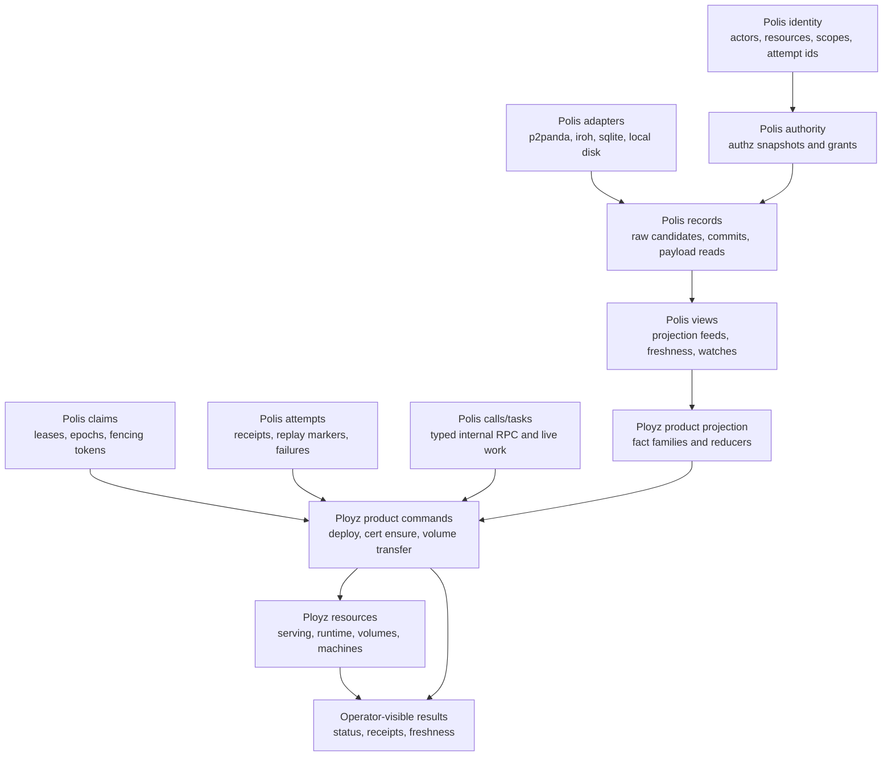
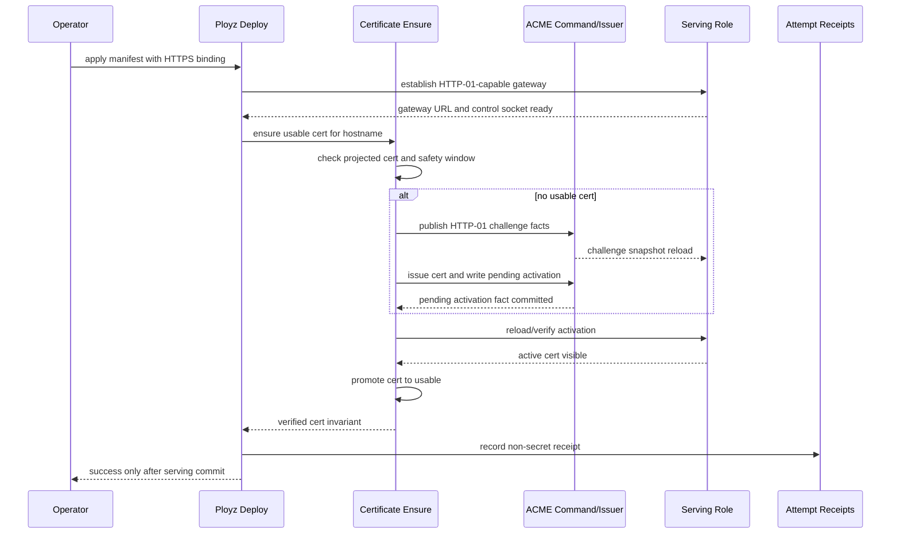

# refactor: Prove the MVP Polis Boundary

## Summary

This plan proves Polis as an internal framework boundary inside `MVP/` before
any repo split. The implementation should extract reusable distributed-systems
capabilities from the product-shaped MVP code, while keeping Ployz deploy,
certificate, serving, volume, and machine behavior easy to read as explicit
product orchestration.

The plan treats claim primitives as Polis-owned. Advisory leases are in active
scope because the MVP already uses them; Redlock-style locking is a guiding
principle for where future distributed coordination should live, not an active
implementation target.

---

## Problem Frame

The MVP currently mixes reusable distributed control-plane mechanics with Ployz
product meaning. The clearest example is projection: reusable candidate/source
and cache mechanics live in the same crate as product facts for nodes, serving,
ACME certificates, leases, and DNS. Storage adapters then depend upward on that
product-shaped projection surface.

This plan turns the requirements doc into a boundary-proof migration: first
separate reusable substrate from product projection, then make deploy with HTTPS
certificate ensure prove the boundary end to end, then use ACME/volume reuse to
prove Polis is not only product-neutral by imports but actually reusable inside
Ployz.

---

## Requirements

- PR1. Ployz remains the owner of deploy, certificates, routes, serving,
  machines, volumes, runtime policy, product facts, product reducers, operator
  commands, and failure classification.
- PR2. Polis owns reusable distributed-systems capabilities where they simplify
  Ployz code: identity and authority vocabulary, signed record source/read APIs,
  projection/view substrate, claim/lease primitives, typed internal calls/tasks
  when needed, and attempt receipts when needed.
- PR3. The first proof happens inside `MVP/`; no separate `polis` or `ployz`
  repository is created by this plan.
- PR4. Projection must be split into product-neutral substrate and Ployz-owned
  product projection modules.
- PR5. Lower substrate crates must not import product projection models, product
  facts, deploy, serving, ACME, volume, machine, routing, or environment
  modules.
- PR6. Deploy with HTTPS binding must synchronously ensure a usable certificate
  during deploy and fail visibly if issuance, validation, material
  distribution, activation, or minimum lifetime checks fail.
- PR7. Certificate renewal remains outside deploy, but certificate state exposes
  expiry, freshness, activation, and operator-visible failure status.
- PR8. Polis claim primitives may produce lease state, epochs, and fencing
  tokens, but Ployz protected resources enforce the token at the mutation
  boundary.
- PR9. Signed fact append/import must authenticate and authorize facts before
  they affect committed projections, snapshots, watches, or lease reducers.
- PR10. Attempt receipts and diagnostic evidence must remain non-authoritative
  unless paired with a Ployz verifier for the domain invariant they claim.
- PR11. Steady-state serving must continue from locally persisted last-good state
  across deploy coordinator failure, process restart, machine restart, and local
  projection cache loss where local validity bounds allow it.
- PR12. ACME ownership and volume transfer must validate shared Polis
  claim/record/view mechanics after the deploy HTTPS proof works.

**Origin actors:** A1 Ployz feature implementer, A2 Polis framework maintainer,
A3 operator or agent, A4 steady-state role, A5 deploy coordinator.

**Origin flows:** F1 deploy with HTTPS binding, F2 first boundary proof inside
`MVP/`, F3 second-domain validation, F4 boundary earns repo extraction.

**Origin acceptance examples:** AE1 HTTPS deploy cert ensure failure, AE2 cert
safety-window failure, AE3 unauthorized fact import rejection, AE4 stale lease
fencing rejection, AE5 non-authoritative evidence replay, AE6 projection split,
AE7 last-good serving restart/cache-loss survival, AE8 ACME/volume semantic
reuse.

---

## Scope Boundaries

### Deferred for Later

- Physically splitting into separate `polis` and `ployz` repositories.
- Public Polis documentation, branding, website, or standalone SDK polish.
- Redlock or other external live-lock adapters.
- NATS or other backend adapters.
- Certificate renewal primitives or maintenance roles.
- A generic workflow engine or fluent workflow DSL on top of Polis attempts or
  tasks.

### Outside This Product's Identity

- Turning Ployz into a generic orchestration toolkit assembled from knobs.
- Making Polis a general database replication product.
- Using Polis leases as a hidden strict lock or consensus system.
- Hiding deploy, certificate, serving, or machine policy inside background
  reconcilers.

### Deferred to Follow-Up Work

- Standalone Polis crate/repo packaging after this plan proves dependency
  direction and semantic reuse.
- Redlock-style coordination after the lease/fencing capability has a stable
  Polis-facing shape and a real user.
- Broad live messaging beyond the narrow request/reply path already needed by
  deploy, volume, or certificate flows.
- Broad operation journaling beyond deploy/cert attempt receipts needed to
  report visible success or failure.

---

## Context & Research

### Relevant Code and Patterns

- `MVP/projection/src/source.rs` currently defines `FactSource`,
  `FactCandidate`, `CandidateStatus`, and product-shaped `FactKind` /
  `classify_fact_key` in one surface.
- `MVP/projection/src/facts.rs`, `MVP/projection/src/model.rs`,
  `MVP/projection/src/reducer.rs`, `MVP/projection/src/sqlite.rs`, and
  `MVP/projection/src/snapshot.rs` currently own product facts, product views,
  ACME certificate projections, serving snapshots, SQLite persistence, and
  reducer behavior.
- `MVP/p2panda-facts/src/derived_index.rs` and `MVP/iroh/src/facts/local_view.rs`
  call `classify_fact_key`, which makes storage/transport depend on product
  projection taxonomy.
- `MVP/acme-command/src/lib.rs` and `MVP/volume/src/command.rs` duplicate lease
  replay patterns over `FactSource`, `ProjectionFactPayload`, `FactKind`, and
  `payload_matches_key`.
- `MVP/deploy/src/coordinator.rs` already keeps deploy orchestration product
  shaped through `DeployCoordinator`, `DeployManifest`, `DeployFactWriter`, and
  `ServingFactWriter`.
- `MVP/node/src/deploy.rs` currently performs product deploy wiring and is the
  right integration point for HTTPS binding certificate ensure.
- `MVP/node/src/acme.rs` already runs ACME issuance, challenge publication,
  certificate activation fact write, projection rebuild, snapshot write, and
  gateway reload.
- `MVP/serving/src/model.rs` and `MVP/serving/src/actor.rs` already preserve
  last-good snapshots after reload failure and expose freshness/failure status.
- `MVP/e2e/src/steady_state_serving_contract.rs`,
  `MVP/e2e/src/p2panda_auth_membership_contract.rs`,
  `MVP/e2e/src/p2panda_acme_http01_contract.rs`,
  `MVP/e2e/src/pebble_acme_https_contract.rs`, and `MVP/volume/src/tests.rs`
  are the closest existing proof surfaces.

### Non-MVP Research Learnings

- The older broader codebase worked best when a product command had one clear
  shape: explicit command input, inspectable plan, bounded mutation, and a
  truthful result. It degraded when deploy also became a compiler, replay
  coordinator, status surface, volume cleanup owner, cert path, and generic
  phase engine.
- Prepared/apply/baseline ideas are valuable, but they should be Polis attempt
  and record support values, not a workflow engine that owns product order.
- Branch, migrate, dev, promote, deploy, cert ensure, and volume transfer should
  remain Ployz product commands. They can share Polis attempts, claims,
  records, calls, and tasks without being flattened into one operation enum.
- Internal node/service RPC must not deserialize public command API directly.
  When a live hop is needed, Polis calls provide a small typed protocol with
  scoped authority, deadlines, and product-owned handlers.
- Gateway, DNS, and runtime paths duplicated projection feed/freshness/watch
  behavior in the old design. Polis views should own that reusable feed shape;
  Ployz projection still owns product fact families and reducers.
- Backend seams got worse when Docker, ZFS, NATS, p2panda, and transport details
  leaked into product orchestration. Polis adapters should translate backend
  mechanics into records, views, claims, calls, or tasks before Ployz sees them.

### Institutional Learnings

- `docs/solutions/architecture-patterns/authority-status-separates-truth-from-observation-2026-05-08.md`:
  status must separate durable truth, live observation, and uncertainty. Apply
  this to certificate freshness, last-good serving, import rejection evidence,
  and deploy evidence.
- `docs/solutions/architecture-patterns/preflight-authority-promotions-before-mutation-2026-05-08.md`:
  prove compatibility/authority/preconditions before mutation. Apply this to
  deploy certificate ensure, protected-resource fencing, and fact import
  validation.

### External References

- None. Local MVP code and existing project requirements are the planning
  authority for this boundary refactor.

---

## Key Technical Decisions

- Keep the first boundary internal to `MVP/`: This preserves the requirement
  that a repo split must be mechanical later, not a design shortcut now.
- Use nested workspace directories for the boundary: Polis-owned crates should
  live under `MVP/polis/`; Ployz-owned crates should live under `MVP/ployz/`.
  Existing flat crates can move incrementally when touched, but new Polis
  extraction work starts in the nested namespace.
- Introduce Polis by the Rust values and guards Ployz code wants to use, not by
  backend taxonomy: Do not start with `polis-core` or `polis-messaging`. The
  first concrete capabilities should be identity, authority, records, views,
  claims, attempts, calls, and tasks, because those remove specific complexity
  from current MVP code.
- Keep Ployz orchestration ordinary Rust: product commands should remain plain
  services/functions that sequence deploy, cert, serving, volume, and machine
  policy. Polis provides typed values, traits, guards, receipts, and commit
  surfaces; it must not become a generic workflow builder.
- Name Polis crates by the ergonomic primitive they provide, not by the current
  backend: `identity`, `authority`, `records`, `views`, `claims`, `attempts`,
  `calls`, and `tasks`. p2panda, iroh, sqlite, NATS, Redis, or local disk are
  implementation adapters under those capabilities, not the conceptual shape of
  Polis.
- Move product classification up: Storage and transport should emit raw signed
  candidates and read payloads. Product reducers or adapters should classify
  fact keys into node, serving, ACME, lease, volume, or deploy meanings.
- Treat claims as Polis-owned and resource-enforced: Polis should own reusable
  lease/claim state, replay, epochs, fencing tokens, and guard ergonomics.
  Ployz product resources must still enforce the current token at mutation
  time.
- Keep attempt receipts narrow: Persist attempt metadata only for visible deploy
  and certificate outcomes until a second domain proves reuse. Do not create a
  generic workflow engine.
- Integrate certificate ensure through deploy, not renewal: Deploy must ensure
  initial certificate usability when applying an HTTPS binding. Renewal becomes
  a later explicit primitive or maintenance role.
- Keep secrets out of receipts and diagnostic evidence: Certificate private
  keys may live in the product serving snapshot path required by current MVP
  serving, but deploy/cert receipts must never copy or render private key
  material.

### Target Crate Shape

The intended workspace shape after this plan is:

```text
MVP/
  polis/
    identity/      # typed Actor, Principal, Resource, Scope, Action, AttemptId
    authority/     # grants, revocation, validation outcomes
    records/       # signed candidates, payload reads, commits, baselines
    views/         # projection feeds, freshness, watches, rebuild surfaces
    claims/        # leases, epochs, fencing tokens, claim guards
    attempts/      # receipts, replay markers, deadlines, last failure
    calls/         # typed internal request/reply protocols
    tasks/         # cancellable live-work handles and progress
    adapters/      # p2panda, iroh, sqlite, local disk as they are extracted
  ployz/
    projection/    # Ployz fact families, reducers, snapshots
    deploy/        # deploy command and cert ensure orchestration
    acme/          # product ACME commands and certificate policy
    serving/       # serving model, snapshots, gateway activation
    volume/        # volume transfer and ownership policy
    machine/       # machine/runtime product policy
    node/          # daemon/node wiring over product services
    routing/       # route and binding product model
```

This plan should not create empty crates just to match the tree. Create or move
a crate when an implementation unit gives it real behavior and tests. Existing
flat MVP crates may move under `MVP/ployz/` as part of the touched unit if the
move is mechanical; otherwise keep the behavior change separate and record the
remaining move in `MVP/architecture.md`.

---

## Open Questions

### Resolved During Planning

- Should Polis own leases? Yes. Leases and future Redlock-style primitives are
  distributed-systems claim/coordination concerns and belong in Polis, exposed
  to Ployz through simple product-facing guards.
- Should Redlock be implemented in this plan? No. It is not currently used; it
  is a guiding principle for where future coordination primitives belong.
- Should the first proof create separate repos? No. The origin requires proof
  inside `MVP/` first.
- Should live messaging move wholesale into Polis now? No. Only the narrow
  request/reply shape needed by current deploy/volume/cert flows should be
  extracted if the boundary work requires it.

### Deferred to Implementation

- Exact certificate minimum remaining lifetime: Choose a project-local constant
  during implementation and make tests explicit around it.
- Exact attempt receipt shape: Keep it narrow enough to support deploy/cert
  reporting; field names can be settled while wiring the existing status
  surface.
- Exact serialized field names for HTTPS binding additions inside the existing
  serving/routing model. The plan chooses the owner and shape; implementation
  can settle naming while preserving compatibility with current tests.

---

## High-Level Technical Design

> *This illustrates the intended approach and is directional guidance for
> review, not implementation specification. The implementing agent should treat
> it as context, not code to reproduce.*



The important dependency rule is that Polis code can produce records, views,
claims, attempts, calls, and task handles, but it cannot know whether a Ployz
fact means deploy, ACME, serving, volume, or machine state. Ployz owns product
order, product failures, and protected-resource mutation policy.

---

## Implementation Units

Dependencies define execution order. Unit numbering preserves the story of the
boundary, but implementation must run U4 before U3 because lease replay must
consume authorized candidates, not raw imported facts.

### U1. Split Product-Neutral Identity, Records, and View Substrate

**Goal:** Create the first Polis-shaped capabilities by separating typed
identity, raw record/candidate mechanics, and view feeds from product fact
classification and product projection state.

**Plan requirements:** PR1, PR2, PR3, PR4, PR5.

**Origin trace:** F2, AE6.

**Dependencies:** None.

**Files:**
- Modify: `MVP/Cargo.toml`
- Create: `MVP/polis/identity/Cargo.toml`
- Create: `MVP/polis/identity/src/lib.rs`
- Create: `MVP/polis/records/Cargo.toml`
- Create: `MVP/polis/records/src/lib.rs`
- Create: `MVP/polis/views/Cargo.toml`
- Create: `MVP/polis/views/src/lib.rs`
- Modify: `MVP/projection/Cargo.toml`
- Modify: `MVP/projection/src/lib.rs`
- Modify: `MVP/projection/src/source.rs`
- Modify: `MVP/projection/src/bus_source.rs`
- Modify: `MVP/projection/src/actor.rs`
- Modify: `MVP/p2panda-facts/Cargo.toml`
- Modify: `MVP/p2panda-facts/src/lib.rs`
- Modify: `MVP/p2panda-facts/src/derived_index.rs`
- Modify: `MVP/iroh/Cargo.toml`
- Modify: `MVP/iroh/src/facts/local_view.rs`
- Modify: `MVP/iroh/src/facts/tests.rs`
- Test: `MVP/projection/src/source.rs`
- Test: `MVP/p2panda-facts/src/derived_index.rs`
- Test: `MVP/iroh/src/facts/tests.rs`
- Test: `MVP/e2e/src/p2panda_sync_fact_source_contract.rs`

**Approach:**
- Define the minimal Polis identity vocabulary first: actor/principal identity,
  resource identity, scope, action, authority id, and attempt id. These are
  typed values, not product enums. They must not contain Ployz nouns such as
  deploy, ACME, serving, volume, or machine.
- Move or reshape `FactSource`, `FactCandidate`, `CandidateStatus`,
  `FactSourceError`, and payload-read APIs so they no longer require product
  `FactKind` or product epoch classification at creation time.
- Create concrete internal product-neutral packages for this move:
  `MVP/polis/records` with crate name `mvp-polis-records` for raw candidates,
  payload reads, statuses, and record commits; and `MVP/polis/views` with crate
  name `mvp-polis-views` for projection feeds, watch handles, freshness, and
  rebuild surfaces. Product projection depends on them; `mvp-p2panda-facts` and
  iroh local fact views depend on records instead of depending upward on
  `mvp-projection`. Do not add compatibility re-export shims unless a local
  compile step proves a temporary re-export is needed for an incremental move.
- Keep candidate status product-neutral: verified, unverified, unauthorized,
  cross-island, conflict.
- Move `classify_fact_key`, parsed product key variants, product `FactKind`,
  and key epoch extraction into the Ployz projection layer above the raw
  substrate.
- Remove direct product projection dependency from `mvp-p2panda-facts` and
  iroh local fact views. Those adapters should construct raw candidates and let
  product projection classify them later.
- Keep existing read-grant and write-authority behavior intact while changing
  type boundaries.

**Execution note:** Characterize current p2panda and iroh fact-source behavior
before moving types; this unit is high blast radius and should preserve
existing contract behavior.

**Patterns to follow:**
- `MVP/p2panda-facts/src/derived_index.rs` for current status decisions.
- `MVP/projection/src/source.rs` tests for product key parsing behavior to
  preserve above the substrate.
- `MVP/e2e/src/p2panda_sync_fact_source_contract.rs` for read-grant,
  conflict, cross-island, and projection rebuild coverage.

**Test scenarios:**
- Covers AE3 / AE6. Happy path: p2panda store lists verified raw candidates and
  reads payloads without importing product projection model types.
- Covers AE6. Integration: `mvp-p2panda-facts` compiles without depending on
  product projection facts, reducers, or serving models.
- Covers AE6. Integration: iroh local fact view produces raw candidates, and
  product projection still classifies node/service/serving/ACME/lease facts
  above that boundary.
- Error path: unauthorized read grants still produce unreadable candidate status
  and do not expose payload bytes.
- Error path: same-key different-content conflicts still surface as conflict
  candidates and remain visible to product reducers.
- Edge case: unsupported or malformed product fact keys are classified only in
  product projection and are ignored there with structured projection status.

**Verification:**
- Lower fact-store and transport crates no longer import product projection
  facts, product reducers, ACME, serving, deploy, volume, machine, routing, or
  environment modules.
- Existing p2panda sync and projection contracts still prove authorized import,
  conflict visibility, cross-island isolation, and projection rebuild.

---

### U2. Move Product Projection Above the Substrate

**Goal:** Preserve Ployz product projection behavior while making the product
facts, views, reducers, SQLite projection store, and serving snapshots clearly
Ployz-owned.

**Plan requirements:** PR1, PR4, PR5, PR11.

**Origin trace:** F2, AE6, AE7.

**Dependencies:** U1.

**Files:**
- Move/Modify: `MVP/projection/` -> `MVP/ployz/projection/` if the U1 split
  makes the move mechanical; keep package naming stable if renaming would add
  unrelated churn.
- Modify: `MVP/projection/Cargo.toml`
- Modify: `MVP/projection/src/facts.rs`
- Modify: `MVP/projection/src/model.rs`
- Modify: `MVP/projection/src/reducer.rs`
- Modify: `MVP/projection/src/reducer/key_expectation.rs`
- Modify: `MVP/projection/src/sqlite.rs`
- Modify: `MVP/projection/src/snapshot.rs`
- Modify: `MVP/projection/src/actor.rs`
- Modify: `MVP/projection/src/lib.rs`
- Modify: `MVP/deploy/src/facts.rs`
- Modify: `MVP/node/src/deploy.rs`
- Modify: `MVP/node/src/acme.rs`
- Modify: `MVP/serving/src/model.rs`
- Test: `MVP/projection/src/reducer/tests/core_state.rs`
- Test: `MVP/projection/src/reducer/tests/acme_ignored_candidates.rs`
- Test: `MVP/projection/src/sqlite.rs`
- Test: `MVP/projection/src/snapshot.rs`
- Test: `MVP/e2e/src/projection_contract.rs`

Path note: the file list uses current paths. If the projection crate is moved
to `MVP/ployz/projection/` in this unit, apply the same edits at the moved path
and avoid keeping compatibility imports from the old location unless a local
compile step proves they are needed temporarily.

**Approach:**
- Keep existing Ployz projection behavior but make the product layer explicitly
  own product payload decoding, product fact-key classification, key/payload
  matching, reducer state, SQLite schema, and serving snapshot generation.
- Make product reducers consume raw candidates plus product classification
  results rather than requiring storage adapters to pre-tag candidates.
- Keep `ProjectionFactPayload` product-owned. Do not use it as the generic
  payload envelope for Polis substrate code.
- Preserve snapshot schemas unless implementation reveals an unavoidable
  migration need; this plan is about ownership boundaries, not operator-facing
  snapshot churn.
- Keep deploy, serving, ACME, and node callers using typed Ployz views and
  ports, not raw candidate internals.

**Execution note:** Keep reducer tests characterization-heavy. The product
projection behavior is business logic even though the work is structural.

**Patterns to follow:**
- `MVP/projection/src/reducer/tests/core_state.rs` for deterministic reducer
  behavior.
- `MVP/projection/src/reducer/tests/acme_ignored_candidates.rs` for ACME lease
  and key/payload validation behavior.
- `MVP/projection/src/snapshot.rs` for atomic snapshot output and redaction
  behavior.

**Test scenarios:**
- Covers AE6. Happy path: node, service, serving, gateway, DNS, ACME challenge,
  ACME certificate, and lease facts reduce to the same product views as before.
- Covers AE6. Edge case: shuffled candidates produce deterministic projection
  state.
- Covers AE3. Error path: malformed payloads, payload/key mismatches,
  unsupported fact keys, unauthorized candidates, and conflict candidates keep
  structured projection status.
- Covers AE7. Integration: serving snapshots written from product projection
  still load into serving roles and preserve existing last-good behavior.
- Integration: deploy status and ACME issue code read product projection through
  typed product views instead of raw substrate classification details.

**Verification:**
- Product projection is the only layer that understands Ployz fact families and
  projection state.
- Existing projection, serving snapshot, and deploy/ACME consumers continue to
  compile through typed product-facing APIs.

### Checkpoint. Keep `MVP/polis/records` and `MVP/polis/views` Provisional

Before U3, treat the new `MVP/polis/records` and `MVP/polis/views` APIs as
provisional. Confirm the public substrate types are domain-neutral and allow
revision of type names, payload boundaries, candidate/status shape, feed
freshness, and watch semantics before deploy, certificate, or serving work
depends on them. U7 is still the semantic reuse proof; this checkpoint prevents
the first compileable substrate from hardening too early.

---

### U3. Extract Polis Claims for Advisory Leases

**Goal:** Make advisory leases a Polis-owned claim capability while
keeping protected-resource mutation rules product-owned.

**Plan requirements:** PR2, PR8, PR9.

**Origin trace:** AE4.

**Dependencies:** U1, U2, U4.

**Files:**
- Create: `MVP/polis/claims/Cargo.toml`
- Create: `MVP/polis/claims/src/lib.rs`
- Modify: `MVP/lease/Cargo.toml`
- Modify: `MVP/lease/src/lib.rs`
- Modify: `MVP/acme-command/src/lib.rs`
- Modify: `MVP/acme-command/src/p2panda.rs`
- Modify: `MVP/acme-command/src/tests.rs`
- Modify: `MVP/projection/src/reducer.rs`
- Modify: `MVP/projection/src/reducer/tests/acme_ignored_candidates.rs`
- Test: `MVP/lease/src/lib.rs`
- Test: `MVP/acme-command/src/tests.rs`
- Test: `MVP/e2e/src/p2panda_acme_http01_contract.rs`

**Approach:**
- Keep `mvp-lease` working while extracting the reusable core into
  `MVP/polis/claims` with crate name `mvp-polis-claims`. The core vocabulary is
  claim, holder, resource, TTL, epoch, renew/release, deterministic
  supersession, fencing token, and claim guard.
- Remove unnecessary product-only context from the reusable claim core where it
  leaks cluster-node meaning; keep visible-node receipts in product command
  results when needed.
- Introduce a shared lease replay/read helper over authorized fact candidates
  produced after signed-fact validation, so ACME challenge ownership no longer
  duplicates candidate filtering, payload lookup, lease fact decoding, and
  malformed-candidate handling.
- Preserve Ployz-specific handles such as ACME challenge leases and volume
  transfer lease receipts above the shared claim capability, but defer
  volume adoption until U7.
- Make protected-resource boundaries explicit for ACME challenge presentation,
  challenge clear, certificate activation fact writes, serving snapshot/commit,
  and serving reload activation. Each mutation must assert the current fencing
  token before it changes protected state.
- Document Redlock-style locking as future Polis claim scope without adding a
  Redlock adapter or Redis dependency.

**Patterns to follow:**
- `MVP/acme-command/src/tests.rs` for stale lease, scoped grant, and preflight
  behavior.
- `MVP/projection/src/reducer.rs` for current deterministic lease head
  reduction.

**Test scenarios:**
- Covers AE4. Happy path: ACME claim/present/clear uses the shared lease
  replay/read capability while retaining product-specific commands and errors.
- Covers AE4. Error path: stale ACME holder cannot present or clear a challenge
  after another holder wins the lease.
- Covers AE4. Error path: stale ACME holder cannot write certificate activation
  or serving activation state after another holder wins the lease.
- Covers AE4. Error path: lease reducers cannot consume raw, unverified,
  unauthorized, cross-island, or stale candidates.
- Edge case: same-epoch lease claims are deterministically superseded without
  pretending to provide strict distributed-lock semantics.

**Verification:**
- Lease replay/read mechanics live in one reusable claim capability.
- ACME product code becomes smaller and uses product-facing guards or handles
  instead of reimplementing low-level lease candidate replay.

---

### U4. Harden Signed Fact Trust and Import Boundaries

**Goal:** Make signed fact append/import validation explicit enough that
unauthorized, stale, cross-island, or revoked-author facts cannot affect
projections, snapshots, watches, or lease reducers.

**Plan requirements:** PR2, PR5, PR9.

**Origin trace:** AE3.

**Dependencies:** U1, U2.

**Files:**
- Create: `MVP/polis/authority/Cargo.toml`
- Create: `MVP/polis/authority/src/lib.rs`
- Modify: `MVP/p2panda-authz/src/identity.rs`
- Modify: `MVP/p2panda-authz/src/lib.rs`
- Modify: `MVP/p2panda-authz/src/authority_view.rs`
- Modify: `MVP/p2panda-facts/src/lib.rs`
- Modify: `MVP/p2panda-facts/src/derived_index.rs`
- Modify: `MVP/p2panda-transport/src/fact_driver.rs`
- Modify: `MVP/projection/src/model.rs`
- Modify: `MVP/projection/src/reducer.rs`
- Test: `MVP/p2panda-authz/src/lib.rs`
- Test: `MVP/p2panda-facts/src/lib.rs`
- Test: `MVP/p2panda-transport/src/fact_driver.rs`
- Test: `MVP/e2e/src/p2panda_auth_membership_contract.rs`
- Test: `MVP/e2e/src/p2panda_sync_fact_source_contract.rs`
- Test: `MVP/e2e/src/p2panda_net_fact_node_contract.rs`

**Approach:**
- Extract product-neutral authority vocabulary into `MVP/polis/authority` with
  crate name `mvp-polis-authority`. It should express authorized actor,
  resource/scope/action grants, revocation, historical validity, and validation
  outcomes over Polis identity types. It must not know Ployz fact families.
- Make the authority snapshot surface clear about principal, resource/scope,
  author key, role, rotation, revocation, and historical validity.
- Ensure imported operations pass signature, island, author-key, membership,
  grant, write-scope, and replica-importer checks before they can become
  verified candidates.
- Make the validated candidate type explicit enough that reusable claim helpers
  cannot accidentally reduce raw or unverified candidates.
- Keep rejected facts out of committed projections and lease reducers. Rejected
  import attempts may be counted or reported as payload-minimal diagnostic
  evidence, but they must not poison product state.
- Rejection diagnostics may include fact key/hash, author or principal, scope,
  rejection reason, and timestamps. They must not copy raw payload bytes,
  decoded product payloads, private keys, tokens, or attacker-controlled message
  bodies.
- Preserve the existing strong-remove membership behavior: demoted and removed
  authors must not regain write authority by replaying old bindings.
- Avoid turning product projection status into backend truth. Backend import
  validation decides what can enter the candidate surface; product projection
  decides how product facts reduce.

**Patterns to follow:**
- `MVP/e2e/src/p2panda_auth_membership_contract.rs` for demotion, removal,
  reinvite, stale key, cross-island, and restart behavior.
- `MVP/e2e/src/p2panda_sync_fact_source_contract.rs` for trusted replica import
  and conflict visibility.
- `docs/solutions/architecture-patterns/authority-status-separates-truth-from-observation-2026-05-08.md`
  for separating durable truth from live/rejection evidence.

**Test scenarios:**
- Covers AE3. Happy path: active writer with matching author key and fact grant
  can write and import authorized facts.
- Covers AE3. Error path: unauthorized imported fact is rejected before it
  appears as verified projection input.
- Covers AE3. Error path: removed writer and stale author key cannot write or
  import facts after revocation.
- Covers AE3. Error path: cross-island operation cannot affect the target
  island projection or lease reducer.
- Edge case: reinvited principal with a new key can write, while old-key replay
  does not resurrect authority.
- Edge case: unauthorized imports containing secret-looking material do not
  place raw payload bytes into evidence, status, logs, or snapshots.
- Integration: p2panda transport sync reports unauthorized import attempts
  without making them committed product state.

**Verification:**
- Fact append/import validation is explicit and covered by auth membership,
  sync, and transport-level contracts.
- Product projection never has to compensate for facts that the backend already
  knew were unauthenticated or unauthorized.

---

### U5. Add Deploy-Time HTTPS Certificate Ensure

**Goal:** Make deploy with an HTTPS binding ensure certificate usability as part
of deploy success, while leaving renewal out of deploy.

**Plan requirements:** PR1, PR6, PR7, PR10.

**Origin trace:** F1, AE1, AE2, AE5.

**Dependencies:** U1, U2, U3, U4.

**Files:**
- Create: `MVP/polis/attempts/Cargo.toml`
- Create: `MVP/polis/attempts/src/lib.rs`
- Create: `MVP/polis/calls/Cargo.toml`
- Create: `MVP/polis/calls/src/lib.rs`
- Modify: `MVP/deploy/src/domain.rs`
- Modify: `MVP/deploy/src/coordinator.rs`
- Modify: `MVP/deploy/src/facts.rs`
- Modify: `MVP/deploy/src/error.rs`
- Modify: `MVP/routing/src/lib.rs`
- Modify: `MVP/projection/src/facts.rs`
- Modify: `MVP/projection/src/reducer.rs`
- Modify: `MVP/projection/src/snapshot.rs`
- Modify: `MVP/node/src/deploy.rs`
- Modify: `MVP/node/src/acme.rs`
- Modify: `MVP/node/src/error.rs`
- Modify: `MVP/serving/src/model.rs`
- Modify: `MVP/serving/src/tests.rs`
- Modify: `MVP/e2e/src/pebble_acme_https_contract.rs`
- Modify: `MVP/e2e/src/three_node_parity_smoke/verification.rs`
- Test: `MVP/deploy/src/tests.rs`
- Test: `MVP/projection/src/reducer/tests/core_state.rs`
- Test: `MVP/projection/src/snapshot.rs`
- Create: `MVP/node/tests/product_acme.rs`
- Test: `MVP/serving/src/tests.rs`
- Test: `MVP/e2e/src/pebble_acme_https_contract.rs`
- Test: `MVP/e2e/src/three_node_parity_smoke.rs`

**Approach:**
- Introduce `MVP/polis/attempts` with crate name `mvp-polis-attempts` only for
  attempt identity, structured receipts, replay markers, deadlines, and last
  failure. Attempts support Ployz commands; they do not own the deploy/cert
  sequence.
- Introduce `MVP/polis/calls` with crate name `mvp-polis-calls` for the typed
  internal request/reply shape used by serving or gateway control. Calls are
  internal protocols with scoped authority and deadlines; they are not public
  daemon API and not a feature registry.
- Add typed HTTPS serving intent to the existing route/serving model, not as a
  deploy-only flag. Extend `ServingCommitPlan`/routing with a product-owned
  binding or certificate requirement so deploy, projection, serving snapshots,
  and later verification all read the same persisted intent.
- Carry the HTTPS/certificate requirement through durable product projection:
  `ServingCommitFact`, reducer output, and serving snapshots must preserve the
  same HTTPS intent that deploy validates.
- Before serving commit reports success for an HTTPS binding, call a reusable
  product certificate ensure path that:
  - checks whether a usable certificate is already projected for the hostname;
  - issues and activates a certificate if none is usable;
  - verifies exact hostname, chain/material parseability, private-key presence,
    issuance/activation authority for the exact binding hostname and deploy
    scope, current authorized principal, activation, known revocation state,
    and minimum remaining lifetime;
  - reloads/activates required serving roles when applicable; and
  - fails deploy visibly if any step fails.
- Model certificate ensure as a small product-owned state machine: requested,
  pending issue, activation written, serving verified, usable, failed. `usable`
  is not an attempt receipt; it is derived or product-owned certificate/serving
  state produced only by the Ployz verifier from projected cert facts, local
  material, serving activation, and hostname/scope/authority/lifetime/revocation
  checks. Polis attempt receipts record verifier result metadata but never
  become certificate truth.
- Keep renewal out of deploy. If the current cert is below the safety window,
  deploy fails rather than silently succeeding with near-expired state. If a
  certificate is known revoked, deploy fails; if revocation freshness cannot be
  proven during coordinator outage, expose that freshness limit in cert state.
- Use this revocation authority model for the MVP: known-revoked state can come
  from product certificate facts written by the ACME/cert path or an explicit
  operator revocation mark. No live OCSP/CRL polling is introduced by this plan.
  Deploy fails on known-revoked projected state; when no authoritative local
  revocation signal exists, status must say revocation freshness is unknown
  rather than claiming fresh revocation proof.
- Persist deploy/cert attempt receipts without copying private key material.
  Receipts should say what was attempted, what was verified, which
  hostname/order/expiry was involved, and why it failed or succeeded.
- Keep private-key material restricted to the product serving snapshot/material
  path with local file ownership/permissions, status/error/log redaction, and
  tests that failure paths never render key bytes.
- Treat attempt receipts as non-authoritative until the product verifier proves
  the certificate and serving invariant. The deploy/cert verifier is owned by
  Ployz deploy/node code; it accepts receipts only after checking projected
  certificate state, local material presence, serving activation, and
  hostname/scope/authority/lifetime/revocation bounds.
- Add explicit operation deadlines and failure classes for ACME
  order/challenge, material write/distribution, projection rebuild/read,
  serving reload, and HTTPS probe. Define which serving roles must acknowledge
  activation before deploy success.
- Treat the serving/gateway control socket as its own trust boundary. Reload,
  HTTP-01 challenge, activation, and verification requests must authenticate
  the caller, authorize the deploy/cert operation and scope, validate payloads,
  bind requests to the current fencing token or operation id, and reject replay
  or stale requests.
- Preserve the current HTTP-01 bootstrap dependency explicitly: deploy must
  establish or require an HTTP-01-capable serving/gateway role, gateway URL, and
  control socket before finalizing issuance. The sequence is: publish challenge
  facts, project challenge snapshot, reload gateway for HTTP-01 reachability,
  finalize ACME order, write pending activation, project certificate snapshot,
  reload/verify TLS, then promote to usable and report deploy success. If no
  serving role/control socket/gateway URL is available, deploy fails with a
  bounded product error before waiting on ACME.
- Temporary HTTP-01 challenge serving is product-owned deploy/cert state,
  bounded by the current lease/fencing token, excluded from final HTTPS serving
  intent, and explicitly cleared or marked failed on every issuance,
  activation, timeout, or deploy failure path.

**Technical design:** Directional flow, not implementation specification.



**Patterns to follow:**
- `MVP/node/src/acme.rs` for current Pebble/ACME issuance, challenge
  publication, projection, and gateway reload.
- `MVP/deploy/src/coordinator.rs` for deploy precondition and commit ordering.
- `MVP/serving/src/pingora_gateway.rs` for certificate material parseability at
  serving time.
- `MVP/e2e/src/pebble_acme_https_contract.rs` for real ACME protocol proof.

**Test scenarios:**
- Covers AE1. Happy path: deploy with HTTPS binding and no existing cert issues
  a cert, activates it, reloads serving, commits serving state, and HTTPS probe
  succeeds.
- Covers AE1. Error path: ACME issuance failure returns a visible deploy
  failure and does not report serving success.
- Covers AE1. Error path: serving reload/activation failure returns a visible
  deploy failure, records a failure receipt without private key material, and
  does not leave authoritative usable-cert state behind.
- Covers AE2. Error path: existing cert below the configured safety window is
  treated as unusable and causes deploy failure because renewal is out of scope.
- Covers AE2. Error path: known-revoked certificate state is treated as
  unusable for deploy and cannot satisfy HTTPS binding success.
- Covers AE2. Edge case: unknown revocation freshness is rendered as
  uncertainty in certificate status rather than reported as revocation proof.
- Covers AE5. Error path: replay after crash does not trust an attempt receipt
  unless the product verifier confirms certificate usability, binding
  authority, material presence, and serving activation.
- Covers AE5. Crash point: pending activation receipt exists but material,
  projection, or serving activation is missing/stale, so replay resumes or
  fails visibly instead of treating the receipt as truth.
- Edge case: ACME order, projection read, material write, serving reload, or
  HTTPS probe timeout produces a bounded deploy failure with a structured
  audience.
- Edge case: unauthorized, stale, or replayed gateway control-socket requests
  cannot present challenges, reload serving, or promote TLS activation.
- Edge case: failed or timed-out issuance clears or marks failed temporary
  HTTP-01 challenge state and does not leave challenge exposure as durable
  product serving intent.
- Edge case: an already usable cert for the exact hostname avoids unnecessary
  issuance while still proving activation/freshness before deploy success.
- Integration: three-node parity HTTPS checks run through deploy-driven cert
  ensure instead of a separate manual ACME issue step.

**Verification:**
- Ployz deploy code reads as product orchestration: interpret manifest, ensure
  cert, start runtime, publish serving, prove activation, clean up.
- Deploy success is impossible for an HTTPS binding without a usable, activated
  certificate.

---

### U6. Strengthen Last-Good Serving Validity Bounds

**Goal:** Preserve the MVP guarantee that steady-state serving outlives the
deploy coordinator while making certificate and route validity bounds explicit.

**Plan requirements:** PR1, PR7, PR11.

**Origin trace:** AE2, AE7.

**Dependencies:** U2, U5.

**Files:**
- Modify: `MVP/serving/src/model.rs`
- Modify: `MVP/serving/src/actor.rs`
- Modify: `MVP/serving/src/wire.rs`
- Modify: `MVP/serving/src/pingora_gateway.rs`
- Modify: `MVP/serving/src/tests.rs`
- Modify: `MVP/projection/src/snapshot.rs`
- Modify: `MVP/e2e/src/steady_state_serving_contract.rs`
- Modify: `MVP/e2e/src/three_node_parity_smoke/verification.rs`
- Test: `MVP/serving/src/tests.rs`
- Test: `MVP/e2e/src/steady_state_serving_contract.rs`
- Test: `MVP/e2e/src/three_node_parity_smoke.rs`

**Approach:**
- Add local serving validity evaluation for certificate-backed routes:
  hostname match, parseable certificate/key material, not-before/not-after
  bounds when known, known revocation state, minimum freshness where applicable,
  and last failure visibility.
- Keep last-good serving behavior: failed reloads preserve the currently loaded
  valid snapshot and report `ServingLastGoodAfterFailure`.
- Make expired or locally invalid certificate-backed serving state degrade or
  refuse TLS for the affected hostname instead of silently serving invalid
  material.
- Keep private-key bytes internal to the serving snapshot/material path.
  Operator-visible status, errors, logs, receipts, diagnostics, and tests must
  render redacted metadata, never key material.
- Preserve route/DNS serving for unaffected valid state.
- Ensure process restart and projection cache loss can recover from local
  persisted snapshots without deploy coordinator liveness.

**Patterns to follow:**
- `MVP/serving/src/actor.rs` for last-good reload behavior.
- `MVP/serving/src/model.rs` for freshness and structured serving failure
  status.
- `MVP/e2e/src/steady_state_serving_contract.rs` for coordinator-outage,
  restart, corrupt snapshot, deleted snapshot, and wrong-island behavior.

**Test scenarios:**
- Covers AE7. Happy path: serving actor restarts from local snapshot files while
  deploy coordinator is unavailable and continues answering route/DNS queries.
- Covers AE7. Edge case: projection SQLite deletion or rebuild does not disrupt
  already loaded serving state.
- Covers AE7. Error path: corrupt, missing, wrong-island, or symlinked next
  snapshot fails reload while preserving last-good state and structured status.
- Covers AE2. Error path: expired or below-window certificate state is not
  silently served as valid HTTPS state.
- Covers AE2. Error path: locally known revoked certificate state is refused or
  degraded for the affected hostname; unknown live revocation during coordinator
  outage is surfaced as freshness uncertainty rather than hidden certainty.
- Edge case: malformed cert/key failure reports redacted metadata and does not
  include private key bytes in status, logs, receipts, diagnostics, or panic
  messages.
- Integration: gateway HTTPS lookup refuses or degrades invalid cert material
  without affecting unrelated HTTP/DNS last-good state.

**Verification:**
- Serving roles can restart from local last-good state and enforce local
  validity bounds without coordinator liveness.
- Operator-visible status distinguishes fresh serving, aged serving, and
  last-good-after-failure.

---

### U7. Prove Semantic Reuse and Document Extraction Gates

**Goal:** Demonstrate that Polis capabilities are reusable inside Ployz before
repo extraction by validating deploy HTTPS, ACME ownership, and volume transfer
against the same record/view/claim/attempt boundaries.

**Plan requirements:** PR3, PR5, PR8, PR10, PR12.

**Origin trace:** F3, F4, AE4, AE5, AE8.

**Dependencies:** U1, U2, U3, U4, U5, U6.

**Files:**
- Create: `MVP/polis/tasks/Cargo.toml`
- Create: `MVP/polis/tasks/src/lib.rs`
- Modify: `MVP/architecture.md`
- Modify: `MVP/README.md`
- Modify: `MVP/e2e/src/main.rs`
- Modify: `MVP/e2e/src/p2panda_acme_http01_contract.rs`
- Modify: `MVP/e2e/src/pebble_acme_https_contract.rs`
- Modify: `MVP/e2e/src/steady_state_serving_contract.rs`
- Modify: `MVP/e2e/src/three_node_parity_smoke.rs`
- Modify: `MVP/volume/Cargo.toml`
- Modify: `MVP/volume/src/command.rs`
- Modify: `MVP/volume/src/facts.rs`
- Modify: `MVP/volume/src/error.rs`
- Modify: `MVP/volume/src/tests.rs`
- Test: `MVP/e2e/src/p2panda_acme_http01_contract.rs`
- Test: `MVP/e2e/src/pebble_acme_https_contract.rs`
- Test: `MVP/e2e/src/steady_state_serving_contract.rs`
- Test: `MVP/e2e/src/three_node_parity_smoke.rs`
- Test: `MVP/volume/src/tests.rs`

**Approach:**
- Add or update an E2E/reporting path that proves the full boundary story:
  raw records, product projection, Polis claims, product fencing, deploy HTTPS
  ensure, serving validity, and operator-visible receipts/freshness.
- Use ACME ownership and volume transfer as second-domain validation for shared
  claim/record/view mechanics after deploy HTTPS works.
- Introduce `MVP/polis/tasks` with crate name `mvp-polis-tasks` for reusable
  live-work handles: cancellation, progress, deadlines, last failure, and
  shutdown. Tasks do not own product sequencing or durable truth.
- Adopt the shared claim helper in volume transfer here, after U5/U6
  prove the deploy HTTPS vertical. Volume ownership commit must enforce the
  current fencing token before writing ownership.
- Add architecture documentation that names the current Polis boundary and
  explicitly states what remains product-owned by Ployz.
- Move or document remaining product crates toward `MVP/ployz/` only when the
  move is mechanical after the boundary work. Do not mix broad path churn into
  a behavioral unit that is already proving HTTPS, claims, attempts, or serving
  validity.
- Add extraction gates to docs: lower crates compile without product imports,
  two unlike product domains reuse the same capability, ordinary Ployz feature
  code avoids raw candidate/import/lease replay/internal-call internals, and
  operator-facing surfaces do not require Polis terminology.
- Add a boundary matrix to architecture docs:
  feature/orchestration modules use Ployz product ports and guards; adapter
  modules translate to raw candidates, imports, watches, and lease replay;
  substrate modules expose domain-neutral Polis types. Enforce this primarily
  with compile-time architecture tests that assert forbidden crate dependencies
  and public type exposure by layer. Keep grep only as a supplemental smoke
  check for obvious raw candidate/import/lease replay symbol leaks.
- Add an API-shape gate for Polis capabilities: public types use domain-neutral
  names, contain no Ployz nouns, and serve at least two unlike domains through
  product adapters without adding domain fields or variants.
- Keep Redlock documented only as future coordination scope.
- Update the origin requirements document only if implementation invalidates an
  accepted extraction gate or proves a different first crate grouping.

**Patterns to follow:**
- `MVP/e2e/src/three_node_parity_smoke.rs` for broad product proof.
- `MVP/e2e/src/p2panda_acme_http01_contract.rs` for replicated ACME/lease proof.
- `MVP/volume/src/tests.rs` for volume transfer fencing proof.
- `MVP/architecture.md` for MVP boundary and actor ownership guidance.

**Test scenarios:**
- Covers AE8. Integration: ACME and volume both use the same reusable
  claim/state mechanics without adding ACME/volume terms to the reusable
  capability.
- Covers AE5. Integration: deploy/cert attempt receipts remain
  non-authoritative and product verification decides replay/resume truth.
- Covers AE1 / AE2 / AE7. Integration: the broad smoke proves HTTPS deploy,
  usable cert, serving activation, restart survival, and visible failure paths.
- Regression: operator-facing command/status output remains Ployz product
  vocabulary and does not require Polis terminology.
- Documentation: README/architecture accurately describe what is proven now and
  what remains deferred.

**Verification:**
- The boundary has both dependency proof and semantic reuse proof.
- Repo extraction remains deferred but has concrete gates, not vague intent.

---

## System-Wide Impact

- **Interaction graph:** Fact storage, p2panda auth, projection, ACME commands,
  deploy, serving, and volume transfer all cross the new boundary.
- **Error propagation:** Backend/auth failures should remain structured at the
  substrate boundary; Ployz commands translate them into product-visible
  deploy, certificate, serving, ACME, or volume failures.
- **State lifecycle risks:** Projection split and certificate ensure both touch
  durable facts, local SQLite, snapshots, and serving reload. Record commits
  and attempt receipts must not outrun product verification.
- **API surface parity:** CLI/SDK/operator surfaces should continue using Ployz
  product terms. Polis terminology stays internal.
- **Integration coverage:** Unit tests prove reducer and lease behavior; E2E
  contracts prove p2panda auth/import, ACME HTTP-01, Pebble HTTPS, volume
  fencing, and steady-state serving.
- **Unchanged invariants:** No repo split, no renewal primitive, no Redlock
  adapter, no NATS adapter, no generic workflow engine, and no hidden
  reconciler-driven mutations.
- **Ployz readability:** Feature and orchestration modules stay free of raw
  candidate, fact-log import/export, backend watch, internal RPC, live-task, and
  lease-replay internals; those details belong in adapters or Polis substrate
  code.

---

## Risks & Dependencies

| Risk | Mitigation |
|------|------------|
| Projection split becomes a broad rename instead of a real boundary | Require lower crates to compile without product projection imports and require product code to use typed ports/views. |
| Certificate ensure expands deploy into renewal | Treat below-window certs as deploy failure; keep renewal as a deferred explicit primitive. |
| Lease extraction gives false lock confidence | Require product resources to enforce fencing tokens at mutation boundaries and keep strict lock/consensus out of scope. |
| Polis turns into a workflow engine | Keep attempts, calls, and tasks as support values. Product command modules own ordering, branching, and failure classification. |
| Attempt receipts become false truth | Make receipts non-authoritative unless paired with a Ployz verifier for the claimed invariant. |
| Secret material leaks into receipts/status | Keep private keys out of receipts/status/logs and protect the local serving material path with restricted permissions; test failure paths for redaction/non-inclusion. |
| Stale holders mutate certificate or serving state | List every fenced mutation point and require current fencing-token verification before challenge, cert activation, serving commit/reload, and volume ownership mutations. |
| Deploy blocks forever during certificate ensure | Add bounded deadlines, ack criteria, and structured failures for ACME, projection, material distribution, serving reload, and HTTPS probe steps. |
| Auth/import hardening changes existing sync behavior | Preserve existing p2panda auth/sync E2E contracts and add explicit unauthorized import cases. |
| Deep refactor collides with ongoing MVP changes | Keep units ordered by dependency and avoid unrelated cleanup outside touched boundaries. |

---

## Documentation / Operational Notes

- Update `MVP/architecture.md` with the current internal Polis/Ployz boundary
  after the implementation proves it in code.
- Update `MVP/README.md` to explain deploy HTTPS certificate ensure, the
  current certificate renewal non-goal, and the last-good serving validity
  behavior.
- Keep the requirements doc in sync if implementation changes the extraction
  gates or proves a different first crate grouping.
- Operator docs should continue to describe Ployz commands and guarantees, not
  Polis internals.

---

## Sources & References

- **Origin document:** [docs/brainstorms/2026-05-21-polis-ployz-boundary-requirements.md](../brainstorms/2026-05-21-polis-ployz-boundary-requirements.md)
- Related architecture: [MVP/architecture.md](../../MVP/architecture.md)
- Related code: [MVP/projection/src/source.rs](../../MVP/projection/src/source.rs)
- Related code: [MVP/projection/src/reducer.rs](../../MVP/projection/src/reducer.rs)
- Related code: [MVP/p2panda-facts/src/derived_index.rs](../../MVP/p2panda-facts/src/derived_index.rs)
- Related code: [MVP/lease/src/lib.rs](../../MVP/lease/src/lib.rs)
- Related code: [MVP/acme-command/src/lib.rs](../../MVP/acme-command/src/lib.rs)
- Related code: [MVP/volume/src/command.rs](../../MVP/volume/src/command.rs)
- Related code: [MVP/node/src/deploy.rs](../../MVP/node/src/deploy.rs)
- Related code: [MVP/node/src/acme.rs](../../MVP/node/src/acme.rs)
- Related code: [MVP/serving/src/actor.rs](../../MVP/serving/src/actor.rs)
- Related tests: [MVP/e2e/src/p2panda_auth_membership_contract.rs](../../MVP/e2e/src/p2panda_auth_membership_contract.rs)
- Related tests: [MVP/e2e/src/p2panda_sync_fact_source_contract.rs](../../MVP/e2e/src/p2panda_sync_fact_source_contract.rs)
- Related tests: [MVP/e2e/src/p2panda_acme_http01_contract.rs](../../MVP/e2e/src/p2panda_acme_http01_contract.rs)
- Related tests: [MVP/e2e/src/pebble_acme_https_contract.rs](../../MVP/e2e/src/pebble_acme_https_contract.rs)
- Related tests: [MVP/e2e/src/steady_state_serving_contract.rs](../../MVP/e2e/src/steady_state_serving_contract.rs)
- Institutional learning: [docs/solutions/architecture-patterns/authority-status-separates-truth-from-observation-2026-05-08.md](../solutions/architecture-patterns/authority-status-separates-truth-from-observation-2026-05-08.md)
- Institutional learning: [docs/solutions/architecture-patterns/preflight-authority-promotions-before-mutation-2026-05-08.md](../solutions/architecture-patterns/preflight-authority-promotions-before-mutation-2026-05-08.md)
