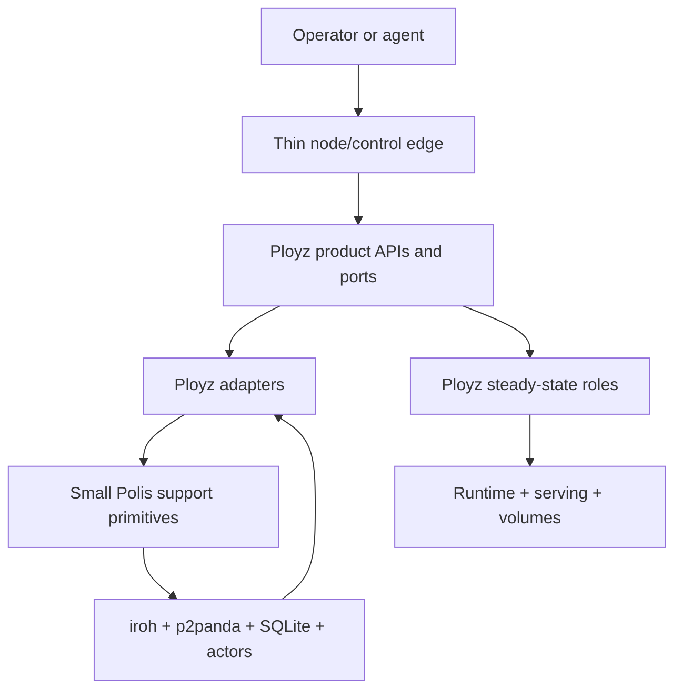
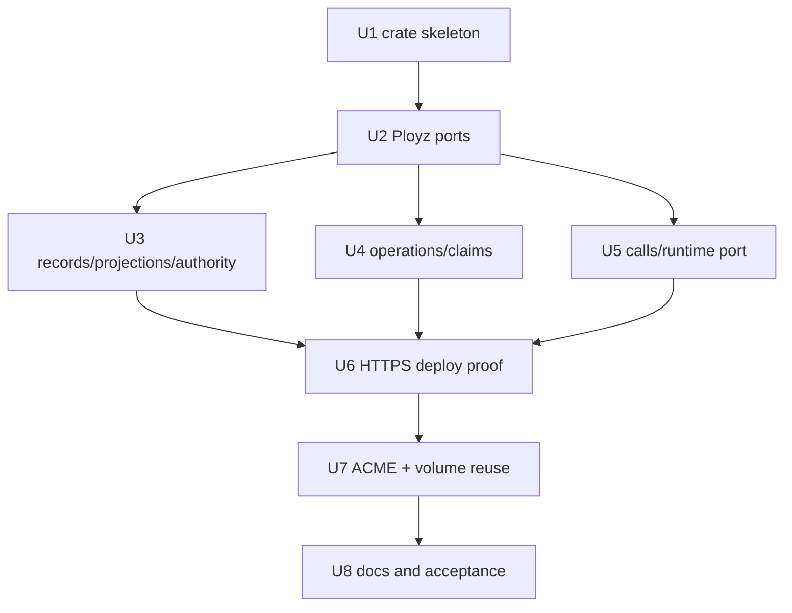

# refactor: Define MVP Polis/Ployz API Boundary

## Summary

Make `MVP/ployz` the product orchestration crate and `MVP/polis` the small support framework that lets Ployz stay readable. The plan is Ployz-first: define the product ports Ployz wants, then move only the Polis primitives those ports need for HTTPS deploy, ACME ownership, and volume transfer.

---

## Problem Frame

The MVP works, but product code still reaches into signed fact import, projection candidates, lease replay, peer addressing, authority checks, and operation evidence. Polis should remove that substrate noise from Ployz code. It should not become a generic distributed-systems platform, workflow engine, backend abstraction, or public concept users need to learn.

---

## Requirements

- R1-R5. Ployz owns product meaning: deploy, certificates, routes, serving, machines, volumes, environments, runtime policy, command semantics, and operator-facing API. Polis stays internal and product-neutral.
- R6-R13. Prove the boundary inside `MVP/` through deploy with HTTPS certificate ensure, product-owned serving semantics, typed certificate usability, and last-good serving behavior.
- R14-R17. Extract just enough identity, authority, records, and projection substrate to keep signed-state mechanics out of Ployz product code.
- R18-R22. Extract only the coordination, request/reply, operation evidence, and lifecycle primitives the proof actually uses. Leases are advisory unless a Ployz resource enforces the fencing token.
- R23-R26. Keep Ployz responsible for product facts, reducers, phase names, rollback policy, runtime participant selection, serving rules, certificate meaning, and visible command results.
- R27-R32. Keep dependency direction clean, validate semantic reuse in a second unlike domain, and preserve the MVP guarantee that steady-state serving and workloads do not fate-share with the deploy coordinator.
- R33-R36. Do not turn Polis into a workflow engine, strict distributed lock layer, hypothetical backend-parity abstraction, or hidden background policy engine.

**Origin actors:** A1 Ployz feature implementer, A2 Polis framework maintainer, A3 operator or agent, A4 steady-state role, A5 deploy coordinator.

**Origin flows:** F1 deploy with HTTPS binding, F2 first boundary proof inside `MVP/`, F3 second-domain validation, F4 boundary earns repo extraction.

**Origin acceptance examples:** AE1 HTTPS deploy certificate ensure failure, AE2 certificate safety-window failure, AE3 unauthorized signed fact rejection, AE4 stale lease fencing rejection, AE5 non-authoritative evidence replay, AE6 projection boundary dependency proof, AE7 last-good serving survival, AE8 second-domain lease/state reuse.

---

## Scope Boundaries

### Deferred for later

- Physically splitting into separate `polis` and `ployz` repositories.
- Public Polis documentation, branding, website, standalone SDK polish, or Go bindings.
- Redlock, NATS, or other backend/live-lock adapters.
- Certificate renewal primitives or maintenance roles.
- A generic workflow engine on top of Polis operation evidence.
- Full workload migration/cutover as a product primitive. This plan proves the supporting volume-transfer boundary; migration can build on it later.
- A broad distributed worker queue. This plan keeps cleanup obligation markers in operation records; a separate `polis::work` module can wait until multiple current consumers need independent claiming/listing semantics.
- Materializing broad Ployz `machine` and `environment` modules. Ployz still owns those domains, but this proof only creates modules used by HTTPS deploy, ACME ownership, serving/runtime, volume transfer, and projection.

### Outside this product's identity

- Turning Ployz into a generic orchestration toolkit assembled from knobs.
- Making Polis a general database replication product.
- Using Polis leases as hidden strict locks or consensus.
- Hiding deploy, certificate, serving, or machine policy inside background reconcilers.

### Deferred to Follow-Up Work

- Broad package renaming of all existing MVP crates. Move behavior only when a unit needs it.
- Repo extraction gates and packaging.
- Public API polish beyond keeping Polis out of operator-facing terminology.

---

## Context & Research

### Relevant Code and Patterns

- `MVP/Cargo.toml` is a separate MVP workspace with many flat crates. This plan adds two boundary crates without collapsing the whole workspace.
- `MVP/commands/src/lib.rs` has useful append-only phase/evidence mechanics, but those mechanics must stay lower-level than a workflow engine.
- `MVP/deploy/src/coordinator.rs`, `MVP/deploy/src/domain.rs`, and `MVP/deploy/src/state_machine.rs` already contain commit boundaries, replay, cleanup pending, and commit-before-drain behavior.
- `MVP/node/src/acme.rs` currently wires certificate issuance, challenge facts, projection rebuilds, gateway reloads, and activation.
- `MVP/serving/src/actor.rs` and `MVP/serving/src/model.rs` preserve last-good serving state and expose freshness/failure status.
- `MVP/volume/src/command.rs` already shows the reusable coordination need: claim, snapshot, receive, ownership commit, stale lease rejection, and deferred cleanup.
- `MVP/projection/src/source.rs`, `MVP/projection/src/reducer.rs`, `MVP/p2panda-facts/src/*`, `MVP/p2panda-authz/src/*`, and `MVP/iroh/src/facts/local_view.rs` are the main record/projection dependency pressure point.
- `MVP/bus/src/message.rs`, `MVP/bus/src/memory.rs`, and `MVP/node/src/node_agent_rpc.rs` contain request/reply mechanics that should become a narrow support API only where Ployz needs peer mutation.

### Institutional Learnings

- `docs/solutions/architecture-patterns/authority-status-separates-truth-from-observation-2026-05-08.md`: committed truth, projection freshness, live observation, and unknown health must stay separate.
- `docs/solutions/architecture-patterns/preflight-authority-promotions-before-mutation-2026-05-08.md`: mutating commands must prove participants, authority, compatibility, and persisted inputs before mutation.
- `docs/solutions/integration-issues/drain-aware-deploy-self-target-drain-nats-timeout-2026-05-10.md`: local self-target mutation is product behavior, not a remote RPC concern.
- `docs/solutions/performance-issues/machine-add-timeout-tests-2026-05-10.md`: deadlines and fake transports must be injectable.
- `MVP/design-notes/2026-05-20-consolidation-plan.md`: moves must name real concepts and reduce surface area.
- `MVP/design-notes/phased-command.md`: shared command machinery is durable intent/evidence only, not replay magic.
- `MVP/design-notes/p2panda-substitution-audit.md`: p2panda owns signed operation/storage mechanics; Ployz owns projection seams, grants, command checks, reducers, and product semantics.

### External References

- No new external research was used. The plan is grounded in the origin requirements, `VISION.md`, `MVP/architecture.md`, MVP slice plans, and current MVP code.

---

## Key Technical Decisions

| Decision | Rationale |
| --- | --- |
| Ployz ports first | Polis exists to support Ployz. Start from deploy, ACME, serving, runtime, and volume ports that make product code readable, then put minimal Polis adapters underneath. |
| Two crates, internal modules | The target shape is `MVP/polis` and `MVP/ployz`. More crates would freeze seams before the API proves itself. |
| Polis operation records are not a lifecycle model | Polis stores operation identity, request fingerprint, opaque evidence/checkpoints, owner deadline, and one terminal marker. Ployz owns phase names, transition order, replay meaning, cleanup classification, and visible result. |
| Claims are advisory until Ployz fences a mutation | Polis can issue claim/epoch/fence evidence. Ployz resources reject stale tokens at concrete mutation boundaries. |
| Ordinary Ployz code uses Ployz-owned ports | Direct Polis imports belong in adapter/composition modules. Product feature modules should read as product orchestration, not framework choreography. |
| Serving commit is a checkpoint, not success | HTTPS deploy success still requires product verification of certificate usability, serving projection catch-up, serving-role acknowledgement, and live TLS proof where applicable. |
| Cleanup stays product-owned | Ployz defines cleanup safety and residual state. Polis operation records may carry cleanup obligation markers, but this plan does not introduce an independent work queue. |
| p2panda and iroh stay behind contracts | Ployz should see authorized product payloads, proof metadata, typed ports, and observations, not p2panda candidate status or iroh transport nouns. |
| Status separates truth from observation | Product status must separate committed records, projection freshness, live checks, and unknown/degraded health. |
| Unknown revocation freshness is not deploy-success | Deploy fails if revocation freshness is unknown. Last-good serving may continue only within explicit local validity bounds and must report degraded/unknown freshness. |

---

## API Shape

### Boundary Rule

Ployz feature modules should depend on Ployz-owned domain ports. Direct use of Polis belongs in adapters and composition code that implements those ports. This is the main guardrail that keeps Polis from becoming visible in every product workflow.

### Polis Modules

| Module | Owns | Does not own |
| --- | --- | --- |
| `polis::identity` | Typed operation ids, resource ids, scope ids, principal/actor ids, idempotency ids | Ployz machine, cert, route, service, volume, or environment meaning |
| `polis::authority` | Grant evaluation over principals/scopes, writer/importer authority, historical authorization proof metadata | Product command authorization wording or machine lifecycle |
| `polis::records` | Authorized raw record append/import/read, rejection evidence, payload references, source watermarks | Product fact enums, serving snapshots, certificate meaning |
| `polis::projections` | Product-neutral rebuild/watch/freshness substrate and reducer ports | Product reducers, views, or status labels |
| `polis::operations` | Operation id, request fingerprint, append-only evidence, opaque checkpoint receipts, owner deadline, single terminal marker | Product phase taxonomy, workflow transitions, rollback policy |
| `polis::claims` | Claim specs, TTL, epoch, fencing token, renewal, release, stale-token helpers | Strict lock guarantees or product mutation authority |
| `polis::calls` | Bounded typed request/reply, no-responder, deadlines, idempotency envelope | Self-target behavior, public command routing, product RPC protocol |
| `polis::error` | Primitive error categories: unauthorized, conflict, timeout, stale fence, no responder, freshness unknown | Product-facing deploy, ACME, volume, machine, or environment errors |

### Ployz Modules

| Module | Owns | Uses Polis through |
| --- | --- | --- |
| `ployz::deploy` | Manifest interpretation, deploy phases, capacity/preflight, serving checkpoint, cleanup classification, visible result | Ployz ports for operations, claims, calls, records, projections |
| `ployz::acme` | Certificate issue/activate semantics, HTTP-01 challenge lifecycle, cert usability, material safety-window checks | Claim, record, projection, and call adapters |
| `ployz::serving` | Route/serving meaning, last-good state, gateway/DNS activation, cert-backed validity bounds | Record/projection/call adapters |
| `ployz::runtime` | Runtime participant side effects, instance identity, live health observation, backend adapter seam | Call and claim adapters |
| `ployz::volume` | Clone, transfer, ownership, source write fence, lineage, source cleanup | Claim, operation, call, and cleanup adapters |
| `ployz::projection` | Product payloads, reducers, typed product views, snapshot interpretation | Authorized record/projection substrate |

### Authorization Handoff

| Layer | Responsibility |
| --- | --- |
| Node/control edge | Authenticate the local actor/principal and attach product request context. |
| Ployz command API | Authorize product command semantics and choose the product resources being affected. |
| Polis authority/records/calls | Enforce grant/import/call authority for the scope and record/call being attempted. |
| Ployz result mapper | Convert primitive failures into product errors without leaking Polis grant internals to users. |

`AuthorityContext` is the handoff object for this plan. It carries principal, scope, grant/dependency epoch, and projection watermark through Ployz ports, operation fingerprints, record appends, and peer-call envelopes. This keeps authorization evidence consistent without exposing p2panda author keys or iroh endpoint ids as product nouns.

---

## Open Questions

### Resolved During Planning

- Smallest crate grouping: create only `MVP/polis` and `MVP/ployz`.
- Path-like keys versus operation envelopes: allow opaque keys for migration compatibility, but mutating adapters should move toward structured operation/resource envelopes.
- Live messaging scope: extract only bounded request/reply semantics needed for Ployz peer mutation.
- Minimum operation evidence: operation id, actor/scope, request fingerprint, idempotency key, opaque evidence/checkpoint receipt, owner deadline, terminal marker, and optional cleanup obligation marker.
- HTTPS deploy proof path: use the Pebble ACME HTTPS path plus product command/API smoke coverage, not library-only tests.
- Second-domain proof: ACME ownership and volume transfer after HTTPS deploy proves the boundary. Full workload migration is follow-up.
- Certificate revocation/freshness behavior: deploy treats unknown revocation freshness as failure; last-good serving may continue only within explicit local validity bounds and reports degraded/unknown freshness.

### Deferred to Implementation

- Exact Rust trait and method names.
- Exact record serialization format.
- Final physical placement of old flat MVP crates.
- Exact E2E command spelling for the product smoke.
- Exact certificate-status backing source for revocation/freshness evidence. U6 must define a fakeable Ployz ACME/serving status port before enforcing the behavior.

---

## Output Structure

The expected new directory shape is a scope declaration. Implementation may adjust details if the boundary stays intact.

```text
MVP/
  polis/
    Cargo.toml
    src/
      lib.rs
      identity.rs
      authority.rs
      records.rs
      projections.rs
      operations.rs
      claims.rs
      calls.rs
      error.rs
  ployz/
    Cargo.toml
    src/
      lib.rs
      deploy/mod.rs
      acme/mod.rs
      serving/mod.rs
      runtime/mod.rs
      volume/mod.rs
      projection/mod.rs
```

---

## High-Level Technical Design

> *This illustrates the intended approach and is directional guidance for review, not implementation specification. The implementing agent should treat it as context, not code to reproduce.*



### Polis Operation Record Contract

Polis does not define a shared product lifecycle. It provides append-only record safety for Ployz operations.

| Primitive | Rule |
| --- | --- |
| Request fingerprint | Same idempotency key must match actor, scope, command kind, normalized payload, resource set, and authority epoch; mismatch is a conflict. |
| Evidence append | Evidence is append-only and opaque to Polis. |
| Checkpoint receipt | Receipt is not truth until a Ployz verifier confirms the product invariant it claims. |
| Owner deadline | In-progress operations may become stale for takeover/resume; Ployz decides whether to resume, fail, or show operator action needed. |
| Terminal marker | Only one terminal marker is allowed. Cleanup obligation lifecycle does not rewrite the product operation result. |
| Peer mutation receipt | A mutating receiver records the outcome before replying so retries after lost replies return the same receipt or a structured conflict. |

### Ployz Verifier Contract

Ployz verifiers are product-owned. Each verifier consumes a request fingerprint, authority context, required projection/source watermarks, opaque checkpoint receipt, and any live proof needed by the domain. The output is one of: verified, stale evidence, rejected, or operator action needed. Polis only stores the verifier reference and receipt.

### Fenced Mutation Points

| Product side effect | Protected resource | Enforced by |
| --- | --- | --- |
| Present or clear HTTP-01 challenge | certificate hostname + challenge slot | Ployz ACME challenge writer |
| Write or activate certificate material | certificate hostname + serving material target | Ployz ACME/serving adapter |
| Commit serving snapshot | route id + hostname binding + serving target | Ployz serving record writer |
| Reload gateway/DNS | serving target + local role | Ployz serving role |
| Start, stop, or drain runtime | workload id + machine id | Ployz runtime/machine |
| Snapshot/final-delta volume | volume id + source owner | Ployz volume source |
| Receive volume data | volume id + target owner | Ployz volume target |
| Commit volume ownership | volume id + ownership epoch | Ployz volume record writer |
| Delete cleanup artifact | artifact id + producing operation id + current owner/epoch | Ployz cleanup handler |

### Acceptance Matrix

| Acceptance | Primary proof |
| --- | --- |
| AE1 HTTPS deploy cert ensure failure | Deploy HTTPS E2E plus ACME usability tests |
| AE2 cert safety-window failure | Ployz ACME usability tests and deploy failure path |
| AE3 unauthorized signed fact rejection | Polis authority/records/projection contract tests |
| AE4 stale lease fencing rejection | Polis claims tests plus Ployz mutation-boundary tests |
| AE5 non-authoritative evidence replay | Polis operation record tests plus Ployz deploy replay verifier tests |
| AE6 projection boundary dependency proof | Compile/dependency checks and projection contract tests |
| AE7 last-good serving and workload survival | Serving/runtime restart and coordinator-loss tests |
| AE8 second-domain reuse | ACME ownership and volume transfer tests sharing Polis claims/records |

---

## Implementation Units



### U1. Create the Two-Crate Skeleton

**Goal:** Add `MVP/polis` and `MVP/ployz` as the only new boundary crates.

**Requirements:** R1-R6, R27, R31, AE6

**Dependencies:** None

**Files:**
- Modify: `MVP/Cargo.toml`
- Modify: `MVP/architecture.md`
- Modify: `MVP/primitive-decisions.md`
- Create: `MVP/polis/Cargo.toml`
- Create: `MVP/polis/src/lib.rs`
- Create: `MVP/polis/src/identity.rs`
- Create: `MVP/polis/src/authority.rs`
- Create: `MVP/polis/src/records.rs`
- Create: `MVP/polis/src/projections.rs`
- Create: `MVP/polis/src/operations.rs`
- Create: `MVP/polis/src/claims.rs`
- Create: `MVP/polis/src/calls.rs`
- Create: `MVP/polis/src/error.rs`
- Create: `MVP/ployz/Cargo.toml`
- Create: `MVP/ployz/src/lib.rs`
- Create: `MVP/ployz/src/deploy/mod.rs`
- Create: `MVP/ployz/src/acme/mod.rs`
- Create: `MVP/ployz/src/serving/mod.rs`
- Create: `MVP/ployz/src/runtime/mod.rs`
- Create: `MVP/ployz/src/volume/mod.rs`
- Create: `MVP/ployz/src/projection/mod.rs`
- Test: `MVP/polis/src/lib.rs`
- Test: `MVP/ployz/src/lib.rs`

**Approach:**
- Add compile-light crates and module docs only.
- Make `MVP/ployz` depend on `MVP/polis`; keep `MVP/polis` independent of Ployz product crates.
- Add an ownership map for existing MVP crates: Ployz product-owned, Polis substrate, adapter/composition-only, or legacy-to-remove.
- Add an early dependency gate that prevents product imports in Polis and raw substrate imports in product feature modules outside named adapters.
- Keep behavior moves out of this unit.

**Test scenarios:**
- Covers AE6. Integration: workspace metadata includes the two boundary crates and `mvp-polis` has no product-crate imports.
- Edge case: Polis public docs/re-exports do not expose deploy, certificate, serving, volume, machine, or environment meaning.

**Verification:**
- The workspace recognizes both crates.
- No product behavior changes.

---

### U2. Define Ployz Product Ports and Status Model

**Goal:** Define the Ployz-facing API shape first so Polis is designed as support for product code, not as an abstract framework.

**Requirements:** R1-R5, R13, R23-R26, R32, AE5, AE7

**Dependencies:** U1

**Files:**
- Modify: `MVP/ployz/src/lib.rs`
- Modify: `MVP/ployz/Cargo.toml`
- Modify: `MVP/node/Cargo.toml`
- Modify: `MVP/ployz/src/deploy/mod.rs`
- Modify: `MVP/ployz/src/acme/mod.rs`
- Modify: `MVP/ployz/src/serving/mod.rs`
- Modify: `MVP/ployz/src/runtime/mod.rs`
- Modify: `MVP/ployz/src/volume/mod.rs`
- Modify: `MVP/ployz/src/projection/mod.rs`
- Modify: `MVP/node/src/deploy.rs`
- Modify: `MVP/node/src/acme.rs`
- Modify: `MVP/serving/src/model.rs`
- Test: `MVP/ployz/src/deploy/mod.rs`
- Test: `MVP/ployz/src/acme/mod.rs`
- Test: `MVP/ployz/src/serving/mod.rs`
- Test: `MVP/ployz/src/runtime/mod.rs`
- Test: `MVP/ployz/src/volume/mod.rs`

**Approach:**
- Start as facades/adapters over existing crates where useful.
- Define product ports for deploy, ACME, serving, runtime, volume, and projection. Machine/environment ownership remains documented but not materialized unless this proof needs it.
- Separate product status into committed truth, projection freshness, live observation, and unknown/degraded health.
- Keep node/control code thin: it authenticates/routes requests and delegates product behavior to Ployz.
- Wire `MVP/node/Cargo.toml` to `mvp-ployz` and `MVP/ployz/Cargo.toml` to the existing crates it wraps. Existing product crates should not import `mvp-ployz`; they either stay below the facade or move into it to avoid Cargo cycles.

**Execution note:** Characterize current deploy, ACME, serving, runtime, and volume status before changing call sites.

**Patterns to follow:**
- `MVP/node/src/deploy.rs`
- `MVP/node/src/acme.rs`
- `MVP/serving/src/model.rs`
- `docs/solutions/architecture-patterns/authority-status-separates-truth-from-observation-2026-05-08.md`

**Test scenarios:**
- Covers AE5. Error path: operation evidence is visible as evidence, not committed truth, until a Ployz verifier accepts it.
- Covers AE7. Integration: serving/runtime status can report last-good state with stale or unknown projection/live health after coordinator loss.
- Happy path: node deploy/control entry points route through Ployz product ports and preserve existing visible results.
- Error path: unauthenticated actors, actors without resource grants, wrong scope/resource set, and unauthorized HTTPS binding/cert activation fail before preflight, claim, record append, peer call, or runtime side effect.
- Error path: live probe failure annotates live observation failure without rewriting durable truth.

**Verification:**
- Ployz module APIs read in product language.
- Ordinary product modules do not directly choreograph Polis primitives.

---

### U3. Put Records, Authority, and Projection Substrate Behind Ployz Ports

**Goal:** Keep signed-state mechanics out of product code by moving raw records, authorization proof metadata, rebuilds, and projection freshness behind Polis support APIs and Ployz projection ports.

**Requirements:** R6-R8, R14-R17, R24, R27, R29, AE3, AE6

**Dependencies:** U2

**Files:**
- Modify: `MVP/polis/src/identity.rs`
- Modify: `MVP/polis/src/authority.rs`
- Modify: `MVP/polis/src/records.rs`
- Modify: `MVP/polis/src/projections.rs`
- Modify: `MVP/polis/src/error.rs`
- Modify: `MVP/ployz/Cargo.toml`
- Modify: `MVP/ployz/src/projection/mod.rs`
- Modify: `MVP/projection/Cargo.toml`
- Modify: `MVP/projection/src/source.rs`
- Modify: `MVP/projection/src/reducer.rs`
- Modify: `MVP/p2panda-facts/src/derived_index.rs`
- Modify: `MVP/p2panda-facts/src/projection_source.rs`
- Modify: `MVP/p2panda-facts/src/store_runtime.rs`
- Modify: `MVP/p2panda-authz/src/lib.rs`
- Modify: `MVP/iroh/src/facts/local_view.rs`
- Test: `MVP/e2e/src/p2panda_fact_source_contract.rs`
- Test: `MVP/e2e/src/p2panda_sync_fact_source_contract.rs`
- Test: `MVP/e2e/src/projection_contract.rs`
- Test: `MVP/e2e/src/p2panda_auth_membership_contract.rs`

**Approach:**
- Polis records expose authorized product payloads plus opaque proof metadata: principal, scope, grant epoch/dependency, source watermark, reducer/schema version, and rejection reason.
- Ployz projection owns product fact families, reducers, serving/cert/machine/environment views, and status labels.
- Split order matters: do not make `mvp-polis` depend on `mvp-projection` while `mvp-projection` still imports ACME/product types. Move product projection models/reducers behind `mvp-ployz` first, or keep Polis on a smaller substrate interface until that dependency is gone.
- p2panda author keys and iroh endpoint IDs bind to principals through proof metadata; they are not product API nouns.
- Snapshot/rebuild behavior must be deterministic across revocation, sync ordering permutations, and baseline restore.

**Execution note:** Add characterization coverage around current projection output before changing reducer/source boundaries.

**Test scenarios:**
- Covers AE3. Error path: unauthorized signed fact is rejected before affecting committed projections.
- Covers AE6. Integration: Polis projection tests do not import product fact enums or product reducers.
- Happy path: authorized records rebuild to equivalent product views before and after the split.
- Edge case: facts signed before revocation remain historically valid when the grant allowed them; facts signed after revocation are rejected.
- Error path: corrupt or unknown payloads are quarantined with visible evidence.

**Verification:**
- Product code consumes typed Ployz views and proof metadata, not raw candidates or candidate statuses.
- Polis records/projections compile without Ployz product imports.

---

### U4. Add Minimal Operation Records and Claims

**Goal:** Provide the small operation and claim primitives Ployz needs for the HTTPS deploy proof, without starting the ACME/volume second-domain proof yet.

**Requirements:** R18-R19, R21, R25, R33-R34, AE4, AE5

**Dependencies:** U2, U3

**Files:**
- Modify: `MVP/polis/src/operations.rs`
- Modify: `MVP/polis/src/claims.rs`
- Modify: `MVP/polis/src/error.rs`
- Modify: `MVP/commands/src/lib.rs`
- Modify: `MVP/lease/src/lib.rs`
- Test: `MVP/commands/src/lib.rs`
- Test: `MVP/lease/src/lib.rs`

**Approach:**
- Polis operation records store identity, request fingerprint, append-only evidence, opaque checkpoint receipts, owner deadline, and one terminal marker.
- Same idempotency key with a different request fingerprint returns a structured conflict.
- A checkpoint receipt is not truth until a Ployz verifier accepts it.
- Claims include resource id, holder, epoch, TTL, renewal, release, and fencing token.
- Cleanup obligation markers live on operation records in this plan. They are not a separate worker or queue abstraction.
- Add a side-effect audit for HTTPS-deploy-protected resources before behavior moves: every challenge write/clear, cert activation/material write, serving commit/reload, and runtime start/stop/drain path must be identified and given a fencing hook before mutation.

**Execution note:** Implement idempotency, terminal-marker, and stale-fence behavior test-first.

**Patterns to follow:**
- `MVP/commands/src/lib.rs`
- `MVP/design-notes/phased-command.md`
- `MVP/lease/src/lib.rs`

**Test scenarios:**
- Covers AE4. Error path: stale token rejects a protected mutation before side effects.
- Covers AE5. Error path: replay sees a checkpoint receipt, Ployz verifier rejects the domain invariant, and the operation does not resume from the receipt as truth.
- Happy path: same idempotency key and same request fingerprint returns the existing operation record.
- Edge case: same idempotency key with different actor, scope, command kind, normalized payload, resource set, or authority epoch returns conflict.
- Error path: concurrent terminal writes allow only one terminal marker.
- Error path: cleanup completion does not rewrite a terminal product result.

**Verification:**
- Polis operations remain record-level support, not a shared lifecycle or workflow engine.
- Ployz owns phase names, replay decisions, and cleanup classification.

---

### U5. Add Bounded Calls and Runtime Port Integration

**Goal:** Provide narrow request/reply support for peer mutations and place runtime side effects behind a Ployz runtime port.

**Requirements:** R20, R22-R23, R25, R28, AE1, AE4, AE7

**Dependencies:** U2, U4

**Files:**
- Modify: `MVP/polis/src/calls.rs`
- Modify: `MVP/polis/src/error.rs`
- Modify: `MVP/ployz/src/runtime/mod.rs`
- Modify: `MVP/bus/src/message.rs`
- Modify: `MVP/bus/src/memory.rs`
- Modify: `MVP/node/src/node_agent_rpc.rs`
- Test: `MVP/e2e/src/bus_contract.rs`
- Test: `MVP/e2e/src/deploy_restart_recovery_contract.rs`
- Test: `MVP/e2e/src/steady_state_serving_contract.rs`
- Test: `MVP/node/src/node_agent_rpc.rs`

**Approach:**
- Define a bounded call envelope around target, operation id, authority context, deadline, idempotency key, and optional fence context.
- Bind sender identity to an authenticated peer/principal, authorize operation/scope/resource before mutation, and reject replayed or mismatched mutating envelopes.
- Mutating receivers durably record outcome before replying; retry after a dropped reply returns the same receipt or conflict.
- Preserve no-responder as a foreground failure.
- Keep local self-target behavior in Ployz runtime/machine/deploy code.
- Runtime port owns instance identity, start/stop/drain side effects, adoption after restart, and live health observation.

**Execution note:** Add fake-transport timeout and lost-reply tests before adapting node-agent RPC paths.

**Patterns to follow:**
- `MVP/bus/src/message.rs`
- `MVP/bus/src/memory.rs`
- `MVP/node/src/node_agent_rpc.rs`
- `docs/solutions/integration-issues/drain-aware-deploy-self-target-drain-nats-timeout-2026-05-10.md`

**Test scenarios:**
- Covers AE1. Error path: cert material distribution or serving/runtime activation has no responder and deploy receives a structured failure before success.
- Covers AE4. Error path: mutating peer request with stale fencing token rejects before runtime/serving/volume state changes.
- Covers AE7. Integration: runtime port adopts or observes already-running workloads after coordinator loss or machine restart.
- Error path: revocation or grant change between preflight and peer mutation causes the receiver to reject the call before side effects.
- Edge case: receiver mutates successfully but reply is lost; retry returns same durable receipt.
- Error path: timeout, payload validation failure, and unauthorized scope produce distinct primitive errors that Ployz maps to product failures.

**Verification:**
- Product command code can mutate peers through bounded calls.
- Runtime behavior is Ployz-owned, not hidden in calls or deploy.

---

### U6. Prove the Boundary with HTTPS Deploy

**Goal:** Make deploy with an HTTPS binding synchronously ensure certificate usability, commit serving state, verify activation, and fail visibly when proof is missing.

**Requirements:** R9-R13, R18-R21, R23-R29, R32-R36, AE1, AE2, AE4, AE5, AE7

**Dependencies:** U3, U4, U5

**Files:**
- Modify: `MVP/ployz/src/deploy/mod.rs`
- Modify: `MVP/ployz/src/acme/mod.rs`
- Modify: `MVP/ployz/src/serving/mod.rs`
- Modify: `MVP/ployz/src/runtime/mod.rs`
- Modify: `MVP/deploy/src/coordinator.rs`
- Modify: `MVP/deploy/src/domain.rs`
- Modify: `MVP/deploy/src/state_machine.rs`
- Modify: `MVP/node/src/deploy.rs`
- Modify: `MVP/node/src/acme.rs`
- Modify: `MVP/acme-command/src/lib.rs`
- Modify: `MVP/serving/src/actor.rs`
- Modify: `MVP/serving/src/model.rs`
- Modify: `MVP/routing/src/lib.rs`
- Modify: `MVP/ployz/Cargo.toml`
- Modify: `MVP/node/Cargo.toml`
- Test: `MVP/e2e/src/pebble_acme_https_contract.rs`
- Test: `MVP/e2e/src/p2panda_acme_http01_contract.rs`
- Test: `MVP/e2e/src/deploy_restart_recovery_contract.rs`
- Test: `MVP/e2e/src/steady_state_serving_contract.rs`
- Test: `MVP/deploy/src/coordinator.rs`
- Test: `MVP/acme-command/src/lib.rs`
- Test: `MVP/serving/src/actor.rs`

**Approach:**
- Ployz deploy owns the sequence: resolve manifest, preflight, claim route/hostname/cert/serving resources, ensure usable cert, start/update runtime, commit serving checkpoint, verify activation, record result.
- Certificate usability has typed outcomes: usable, unusable with reasons, unknown freshness with bounds.
- Define a fakeable certificate-status port owned by Ployz ACME/serving. It supplies expiry, activation, known-revoked, unknown-freshness, and evidence freshness inputs to deploy.
- Usability checks include exact hostname, chain parse, key presence, expiry, minimum remaining lifetime, known revocation, revocation freshness, material distribution, serving activation acknowledgement, and private-key safety.
- Private keys must be stored with restricted local permissions, moved only through authenticated/encrypted peer paths, and never serialized into generic evidence, status, errors, or logs.
- Serving commit is the durable checkpoint; final success still requires cert and serving verification.
- If the coordinator disappears, operation status may be stale-in-progress until Ployz resumes, fails, or asks for operator action.
- Cleanup obligations created by the serving checkpoint are recorded with the checkpoint or with artifact ownership markers so crashes do not orphan residual work.

**Execution note:** Implement cert usability, redaction, stale-in-progress, and replay verifier tests before adapting the coordinator path.

**Patterns to follow:**
- `MVP/deploy/src/coordinator.rs`
- `MVP/deploy/src/state_machine.rs`
- `MVP/node/src/acme.rs`
- `MVP/serving/src/actor.rs`
- `MVP/slice-010-deploy-commit-drain.md`
- `MVP/slice-024-acme-command-surface.md`

**Test scenarios:**
- Covers AE1. Happy path: HTTPS deploy with no usable cert obtains or activates one, commits serving state, verifies activation, and returns success evidence.
- Covers AE1. Error path: issuance, validation, material distribution, activation, or minimum-lifetime check fails and deploy returns visible failure.
- Covers AE2. Error path: cert below safety window fails deploy and exposes expiry/freshness reason.
- R10/R26. Error path: known-revoked at activation or unknown revocation freshness fails deploy and exposes reason.
- R10. Error path: private key material does not appear in operation evidence, product status, errors, or logs; local storage permissions and peer distribution requirements are enforced.
- Covers AE4. Error path: stale token rejects challenge write/clear, cert activation, serving commit, or serving reload before side effects.
- Covers AE5. Error path: crash after evidence or checkpoint resumes only after Ployz verifier confirms cert/serving invariants.
- Covers AE7. Integration: serving and runtime remain observable/adoptable after coordinator loss or restart.
- Edge case: cleanup after serving commit fails and deploy returns cleanup-pending without rewriting success/failure truth.

**Verification:**
- HTTPS deploy reads as Ployz orchestration over Ployz ports.
- Deploy never reports success without certificate usability and serving activation proof.
- Serving/runtime continuity does not depend on deploy coordinator liveness.

---

### U7. Prove Second-Domain Reuse with ACME Ownership and Volume Transfer

**Goal:** Validate that the same small Polis primitives support a second unlike domain without adding ACME or volume concepts to Polis.

**Requirements:** R18-R19, R21-R23, R25, R30-R31, R33-R34, AE4, AE5, AE8

**Dependencies:** U6

**Files:**
- Modify: `MVP/ployz/src/acme/mod.rs`
- Modify: `MVP/ployz/src/volume/mod.rs`
- Modify: `MVP/volume/src/command.rs`
- Modify: `MVP/acme-command/src/lib.rs`
- Test: `MVP/e2e/src/lease_acme_contract.rs`
- Test: `MVP/e2e/src/volume_transfer_contract.rs`
- Test: `MVP/volume/src/command.rs`
- Test: `MVP/acme-command/src/lib.rs`

**Approach:**
- Keep this proof deliberately narrow: ACME ownership and volume transfer only.
- Ployz ACME owns challenge/cert ownership meaning and uses Polis claims/records through adapters.
- Ployz volume owns transfer semantics: source write fence, snapshot, final delta, target receive, ownership commit, lineage, and source cleanup.
- Source writes must be stopped or rejected before final delta and ownership epoch change.
- Cleanup artifact deletion is scoped by artifact id, producing operation id, and current owner/epoch so duplicate or stale cleanup workers cannot delete newer artifacts.
- Full workload migration remains follow-up; this unit only proves the support primitive it would need.

**Execution note:** Characterize current volume transfer behavior first, especially stale lease rejection and deferred source cleanup.

**Patterns to follow:**
- `MVP/volume/src/command.rs`
- `MVP/acme-command/src/lib.rs`
- `MVP/e2e/src/lease_acme_contract.rs`
- `MVP/e2e/src/volume_transfer_contract.rs`

**Test scenarios:**
- Covers AE4. Error path: stale token rejects volume snapshot/final-delta/receive/ownership commit before mutation.
- Covers AE5. Error path: crash after ownership checkpoint resumes only after Ployz verifies ownership, request fingerprint, and source watermark.
- Covers AE8. Integration: ACME ownership and volume transfer share Polis primitives without adding either domain to Polis.
- Happy path: writable single-owner volume transfer stops/rejects source writes before final delta, transfers data, and commits ownership.
- Edge case: clone creates lineage and does not move original owner; transfer preserves identity and changes owner.
- Error path: cleanup obligation terminal failure remains visible and does not roll back committed ownership.

**Verification:**
- Volume transfer and ACME ownership reuse the same Polis primitives as HTTPS deploy.
- Polis remains free of ACME, cert, volume, deploy, and serving concepts.

---

### U8. Harden Docs, Dependency Checks, and Product Acceptance

**Goal:** Make the boundary durable with documentation, dependency checks, and black-box product acceptance coverage.

**Requirements:** R4-R6, R27-R32, AE1-AE8

**Dependencies:** U7

**Files:**
- Modify: `MVP/architecture.md`
- Modify: `MVP/primitive-decisions.md`
- Modify: `MVP/README.md`
- Modify: `MVP/e2e/src/pebble_acme_https_contract.rs`
- Modify: `MVP/e2e/src/volume_transfer_contract.rs`
- Modify: `MVP/e2e/src/deploy_restart_recovery_contract.rs`
- Modify: `MVP/e2e/src/steady_state_serving_contract.rs`
- Modify: `MVP/e2e/src/three_server_product_contract.rs`
- Test: `MVP/e2e/src/three_server_product_contract.rs`
- Test: `MVP/e2e/src/pebble_acme_https_contract.rs`
- Test: `MVP/e2e/src/volume_transfer_contract.rs`
- Test: `MVP/e2e/src/deploy_restart_recovery_contract.rs`
- Test: `MVP/e2e/src/steady_state_serving_contract.rs`

**Approach:**
- Document Polis as an internal support framework and Ployz as the product orchestration layer.
- Add dependency checks that prevent Polis from importing product modules and prevent product feature modules from using raw candidate/status internals outside adapters.
- Ensure acceptance reaches product command/API boundaries, not just library tests.
- Document extraction gates: clean dependency direction, HTTPS proof, second-domain reuse, no operator-facing Polis terminology, and no domain concepts in Polis.

**Test scenarios:**
- Covers AE1-AE2. Integration: black-box HTTPS deploy succeeds/fails according to certificate usability.
- Covers AE3. Integration: unauthorized fact import remains rejected through product-facing commands.
- Covers AE4. Integration: stale fencing token rejection is visible at product boundaries.
- Covers AE5. Integration: crash/replay checks operation receipts through Ployz verifiers.
- Covers AE6. Integration: dependency check rejects product imports in Polis and raw candidate leakage into product feature code.
- Covers AE7. Integration: coordinator death, serving restart, runtime adoption, machine restart, or projection cache rebuild preserves last-good behavior within validity bounds.
- Covers AE8. Integration: ACME ownership and volume transfer reuse the same primitive without Polis domain leakage.

**Verification:**
- Future implementers can see the boundary and preserve it.
- Acceptance coverage proves product behavior through product surfaces.

---

## System-Wide Impact

- **Interaction graph:** Node/control edges stay thin. Ployz APIs own product orchestration. Polis APIs support adapters. iroh, p2panda, SQLite, and actors stay substrate details.
- **Error propagation:** Polis errors are primitive failures; Ployz maps them to product failures without leaking grant/candidate mechanics.
- **State lifecycle risks:** Receipts are not truth. Ployz verifiers prove cert usability, serving activation, and volume ownership before continuing after replay.
- **API surface parity:** CLI/SDK/API/cloud should continue using Ployz product nouns.
- **Integration coverage:** Contract tests prove support primitives; black-box product tests prove operator-visible guarantees.
- **Unchanged invariants:** No hidden reconcilers, no strict lock claims over eventually replicated facts, and no daemon fate-sharing for steady-state serving/workloads.

---

## Risks & Dependencies

| Risk | Mitigation |
| --- | --- |
| Polis grows into a workflow engine | Keep operation records opaque and Ployz-owned phases/verifiers explicit. |
| Polis becomes visible everywhere in Ployz | Enforce Ployz domain ports; restrict direct Polis imports to adapters/composition code. |
| Leases create false confidence | Require fenced Ployz mutation points and stale-token tests. |
| Receipts become truth | Require product verifiers for replay and checkpoint trust. |
| Cleanup becomes hidden reconciliation | Keep cleanup obligations product-created and artifact-scoped. |
| p2panda/iroh leak upward | Expose proof metadata and typed ports instead of substrate nouns. |
| Scope expands into full migration | Keep U7 to ACME ownership plus volume transfer; defer workload migration/cutover. |

---

## Alternative Approaches Considered

- Many Polis crates immediately: rejected because it freezes taxonomy before the API boundary proves itself.
- Single large `MVP` crate: rejected because dependency direction becomes harder to enforce.
- Put commands/workflows in Polis: rejected because Polis only needs to support Ployz, not own product workflows.
- Backend abstraction first: rejected because active MVP direction is iroh/p2panda and backend parity is out of scope.
- Repo split first: rejected because extraction should follow clean in-MVP dependency direction and semantic reuse.

---

## Success Metrics

- Ployz deploy with HTTPS reads as product orchestration over Ployz ports.
- `mvp-polis` compiles without product imports.
- Product feature code does not mention raw projection candidates, fact import/export mechanics, backend watches, or lease reducers outside adapters.
- ACME ownership and volume transfer reuse Polis primitives without adding domain concepts to Polis.
- Deploy replay, cert usability, stale fencing, cleanup pending, and last-good serving/runtime continuity are covered by product-level tests.

---

## Phased Delivery

- Phase 1: create two crates and define Ployz ports with U1-U2.
- Phase 2: put minimal Polis state/coordination support behind those ports with U3-U5.
- Phase 3: prove the boundary through HTTPS deploy with U6.
- Phase 4: prove second-domain reuse through ACME ownership and volume transfer with U7.
- Phase 5: document and harden the boundary with U8.

---

## Documentation / Operational Notes

- Update `MVP/architecture.md` to describe Polis as an internal support framework and Ployz as the product layer.
- Update `MVP/primitive-decisions.md` with the operation-record, claim/fence, and Ployz-port rules.
- Keep operator docs and command help in Ployz terminology.
- Ensure cert and deploy evidence never contains private key material.
- Keep cleanup obligations visible in product status so failure has an audience beyond logs.

---

## Sources & References

- **Origin document:** [docs/brainstorms/2026-05-21-polis-ployz-boundary-requirements.md](../brainstorms/2026-05-21-polis-ployz-boundary-requirements.md)
- **Earlier plan superseded for crate layout:** [docs/plans/2026-05-21-002-refactor-mvp-polis-boundary-plan.md](2026-05-21-002-refactor-mvp-polis-boundary-plan.md)
- **Vision:** [VISION.md](../../VISION.md)
- **MVP architecture:** [MVP/architecture.md](../../MVP/architecture.md)
- **MVP consolidation plan:** [MVP/design-notes/2026-05-20-consolidation-plan.md](../../MVP/design-notes/2026-05-20-consolidation-plan.md)
- **Phased command note:** [MVP/design-notes/phased-command.md](../../MVP/design-notes/phased-command.md)
- **p2panda substitution audit:** [MVP/design-notes/p2panda-substitution-audit.md](../../MVP/design-notes/p2panda-substitution-audit.md)
- **Authority status learning:** [docs/solutions/architecture-patterns/authority-status-separates-truth-from-observation-2026-05-08.md](../solutions/architecture-patterns/authority-status-separates-truth-from-observation-2026-05-08.md)
- **Preflight authority learning:** [docs/solutions/architecture-patterns/preflight-authority-promotions-before-mutation-2026-05-08.md](../solutions/architecture-patterns/preflight-authority-promotions-before-mutation-2026-05-08.md)
- **Drain-aware deploy learning:** [docs/solutions/integration-issues/drain-aware-deploy-self-target-drain-nats-timeout-2026-05-10.md](../solutions/integration-issues/drain-aware-deploy-self-target-drain-nats-timeout-2026-05-10.md)
- **Fast timeout learning:** [docs/solutions/performance-issues/machine-add-timeout-tests-2026-05-10.md](../solutions/performance-issues/machine-add-timeout-tests-2026-05-10.md)
