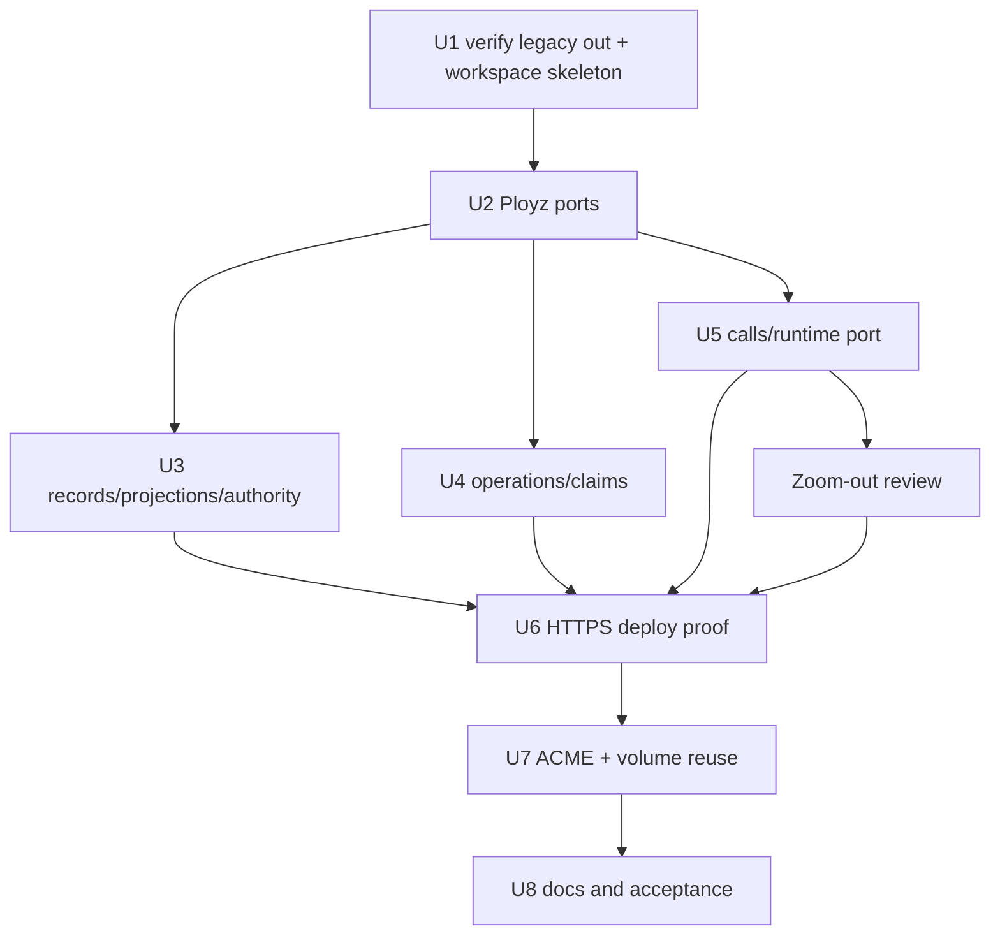

# refactor: Define Polis/Ployz Root API Boundary

## Summary

Start the third rewrite at the repository root. Move the old implementation into
`legacy/`, then build a small root workspace with `crates/polis` and
`crates/ployz`.

Ployz is the product orchestration crate. Polis is the internal support
framework that makes Ployz code readable by hiding distributed control-plane
mechanics behind product-owned ports. Polis should not become a generic
distributed-systems platform, workflow engine, backend abstraction, or
operator-facing concept.

---

## Problem Frame

The previous root implementation and the MVP prototype proved useful behavior,
but product code still reached into signed fact import, projection candidates,
lease replay, peer addressing, authority checks, and operation evidence. The
next rewrite should use those implementations as reference material, not as the
active workspace.

The target is Ployz code that reads like product orchestration:

1. Resolve a deploy manifest.
2. Preflight authority, capacity, routes, runtime, certificates, and volumes.
3. Claim the resources that need fencing.
4. Ensure a usable certificate for HTTPS bindings.
5. Start or update runtime participants.
6. Commit serving state.
7. Verify activation.
8. Drain or clean up old state.
9. Return visible evidence.

Polis exists to make those steps crash-aware, idempotent, authorized, bounded,
and observable without forcing product code to choreograph the substrate.

---

## Requirements

- R1-R5. Ployz owns product meaning: deploy, certificates, routes, serving,
  machines, volumes, environments, runtime policy, command semantics, and
  operator-facing API. Polis stays internal and product-neutral.
- R6-R13. Prove the boundary in the fresh root workspace through deploy with
  HTTPS certificate ensure, product-owned serving semantics, typed certificate
  usability, and last-good serving behavior. `legacy/` is reference material.
- R14-R17. Extract only the identity, authority, records, and projection
  substrate needed to keep signed-state mechanics out of Ployz product code.
- R18-R22. Extract only the coordination, request/reply, operation evidence, and
  lifecycle primitives the proof actually uses. Leases are advisory unless a
  Ployz resource enforces the fencing token.
- R23-R26. Keep Ployz responsible for product facts, reducers, phase names,
  rollback policy, runtime participant selection, serving rules, certificate
  meaning, and visible command results.
- R27-R32. Keep dependency direction clean, validate semantic reuse in a second
  unlike domain, and preserve the proven guarantee that steady-state serving and
  workloads do not fate-share with the deploy coordinator.
- R33-R36. Do not turn Polis into a workflow engine, strict distributed lock
  layer, hypothetical backend-parity abstraction, or hidden background policy
  engine.

**Origin flows:** F1 deploy with HTTPS binding, F2 first boundary proof in the
root workspace, F3 second-domain validation, F4 boundary earns repo extraction.

**Origin acceptance examples:** AE1 HTTPS deploy certificate ensure failure, AE2
certificate safety-window failure, AE3 unauthorized signed fact rejection, AE4
stale lease fencing rejection, AE5 non-authoritative evidence replay, AE6
projection boundary dependency proof, AE7 last-good serving survival, AE8
second-domain lease/state reuse.

---

## Scope Boundaries

### In Scope

- Move previous implementation trees under `legacy/`.
- Create a fresh root workspace shape.
- Define root `crates/polis` and `crates/ployz` APIs before moving behavior.
- Prove the split through HTTPS deploy, ACME ownership, and volume transfer.
- Keep operator surfaces in Ployz terminology.

### Deferred

- Physically splitting into separate `polis` and `ployz` repositories.
- Public Polis docs, branding, website, standalone SDK polish, or Go bindings.
- Redlock, NATS, or other backend/live-lock adapters.
- Certificate renewal primitives or maintenance roles.
- A generic workflow engine on top of Polis operation evidence.
- Full workload migration/cutover as a product primitive. This plan proves the
  supporting volume-transfer boundary; migration can build on it later.
- A broad distributed worker queue. Cleanup obligation markers remain product
  status and operation evidence until several current consumers need a shared
  claiming/listing primitive.

### Outside This Product's Identity

- Turning Ployz into a generic orchestration toolkit assembled from knobs.
- Making Polis a general database replication product.
- Using Polis leases as hidden strict locks or consensus.
- Hiding deploy, certificate, serving, or machine policy inside background
  reconcilers.

---

## Context & Research

- `legacy/` now holds prior implementation work.
- `legacy/mvp/` holds the MVP prototype and slice plans.
- `legacy/crates/` holds the previous root workspace crates.
- `legacy/mvp/commands/src/lib.rs` has useful append-only phase/evidence
  mechanics, but those mechanics must stay lower-level than a workflow engine.
- `legacy/mvp/deploy/src/coordinator.rs`, `legacy/mvp/deploy/src/domain.rs`,
  and `legacy/mvp/deploy/src/state_machine.rs` contain commit boundaries,
  replay, cleanup pending, and commit-before-drain behavior.
- `legacy/mvp/node/src/acme.rs` wires certificate issuance, challenge facts,
  projection rebuilds, gateway reloads, and activation.
- `legacy/mvp/serving/src/actor.rs` and
  `legacy/mvp/serving/src/model.rs` preserve last-good serving state and expose
  freshness/failure status.
- `legacy/mvp/volume/src/command.rs` shows the reusable coordination need:
  claim, snapshot, receive, ownership commit, stale lease rejection, and
  deferred cleanup.
- `legacy/mvp/projection/src/source.rs`,
  `legacy/mvp/projection/src/reducer.rs`, `legacy/mvp/p2panda-facts/src/*`,
  `legacy/mvp/p2panda-authz/src/*`, and
  `legacy/mvp/iroh/src/facts/local_view.rs` are the main record/projection
  dependency pressure point.
- `legacy/mvp/bus/src/message.rs`, `legacy/mvp/bus/src/memory.rs`, and
  `legacy/mvp/node/src/node_agent_rpc.rs` contain request/reply mechanics that
  should become a narrow support API only where Ployz needs peer mutation.

No new external research was used. The plan is grounded in the requirements
doc, `VISION.md`, documented solution notes, the MVP slice plans, and legacy
implementation code.

---

## Key Decisions

| Decision | Rationale |
| --- | --- |
| Fresh root workspace | This is the third rewrite. The old workspace should become reference material, not the place where new seams inherit old shape. |
| Two root crates first | `crates/polis` and `crates/ployz` are enough to prove the boundary. More crates would freeze seams too early. |
| Ployz ports first | Polis exists to support Ployz. Start from deploy, ACME, serving, runtime, volume, and projection ports that make product code readable. |
| Polis operation records are not a lifecycle model | Polis stores operation identity, request fingerprint, opaque evidence/checkpoints, owner deadline, and one terminal marker. Ployz owns phase names, transition order, replay meaning, cleanup classification, and visible result. |
| Claims are advisory until Ployz fences a mutation | Polis can issue claim/epoch/fence evidence. Ployz resources reject stale tokens at concrete mutation boundaries. |
| Ordinary Ployz code uses Ployz-owned ports | Direct Polis imports belong in adapter/composition modules. Product feature modules should read as product orchestration, not framework choreography. |
| Serving commit is a checkpoint, not success | HTTPS deploy success still requires product verification of certificate usability, serving projection catch-up, serving-role acknowledgement, and live TLS proof where applicable. |
| Cleanup stays product-owned | Ployz defines cleanup safety and residual state. Polis operation records may carry cleanup obligation markers, but this plan does not introduce an independent work queue. |
| p2panda and iroh stay behind contracts | Ployz sees authorized product payloads, proof metadata, typed ports, and observations, not p2panda candidate status or iroh transport nouns. |

---

## Target Structure

The active rewrite lives at the repository root. Legacy implementation remains
available as reference under `legacy/`.

```text
Cargo.toml
crates/
  polis/
    Cargo.toml
    src/
      lib.rs
      identity.rs
      authority.rs
      records.rs
      projections.rs
      operations.rs
      claims.rs
      calls.rs
      error.rs
  ployz/
    Cargo.toml
    src/
      lib.rs
      deploy/mod.rs
      acme/mod.rs
      serving/mod.rs
      runtime/mod.rs
      volume/mod.rs
      projection/mod.rs
  ployz-e2e/
    Cargo.toml
    src/
      main.rs
      scenarios/
        https_deploy.rs
        acme_ownership.rs
        volume_transfer.rs
        coordinator_restart.rs
legacy/
  mvp/
  crates/
```

---

## API Shape

### Boundary Rule

Ployz feature modules depend on Ployz-owned domain ports. Direct use of Polis is
limited to adapters and composition code that implements those ports. This is
the main guardrail that keeps Polis from leaking into every product workflow.

### Polis Modules

| Module | Owns | Does not own |
| --- | --- | --- |
| `polis::identity` | Typed operation ids, resource ids, scope ids, principal/actor ids, idempotency ids | Ployz machine, cert, route, service, volume, or environment meaning |
| `polis::authority` | Grant evaluation over principals/scopes, writer/importer authority, historical authorization proof metadata | Product command authorization wording or machine lifecycle |
| `polis::records` | Authorized raw record append/import/read, rejection evidence, payload references, source watermarks | Product fact enums, serving snapshots, certificate meaning |
| `polis::projections` | Product-neutral rebuild/watch/freshness substrate and reducer ports | Product reducers, views, or status labels |
| `polis::operations` | Operation id, request fingerprint, append-only evidence, opaque checkpoint receipts, owner deadline, single terminal marker | Product phase taxonomy, workflow transitions, rollback policy |
| `polis::claims` | Claim specs, TTL, epoch, fencing token, renewal, release, stale-token helpers | Strict lock guarantees or product mutation authority |
| `polis::calls` | Bounded typed request/reply, no-responder, deadlines, idempotency envelope | Self-target behavior, public command routing, product RPC protocol |
| `polis::error` | Primitive error categories: unauthorized, conflict, timeout, stale fence, no responder, freshness unknown | Product-facing deploy, ACME, volume, machine, or environment errors |

### Ployz Modules

| Module | Owns | Uses Polis through |
| --- | --- | --- |
| `ployz::deploy` | Manifest interpretation, deploy phases, capacity/preflight, serving checkpoint, cleanup classification, visible result | Ployz operation, claim, call, record, and projection ports |
| `ployz::acme` | Certificate issue/activate semantics, HTTP-01 challenge lifecycle, cert usability, material safety-window checks | Claim, record, projection, and call adapters |
| `ployz::serving` | Route/serving meaning, last-good state, gateway/DNS activation, cert-backed validity bounds | Record/projection/call adapters |
| `ployz::runtime` | Runtime participant side effects, instance identity, live health observation, backend adapter seam | Call and claim adapters |
| `ployz::volume` | Clone, transfer, ownership, source write fence, lineage, source cleanup; introduced when U7 needs it | Claim, operation, call, and cleanup adapters |
| `ployz::projection` | Product payloads, reducers, typed product views, snapshot interpretation | Authorized record/projection substrate |

Module files should appear with their first production consumer. U1 may reserve
crate roots and public-module docs, but it should not add broad APIs that no
slice exercises.

### Authorization Handoff

| Layer | Responsibility |
| --- | --- |
| Node/control edge | Authenticate the local actor/principal and attach product request context. |
| Ployz command API | Authorize product command semantics and choose the product resources being affected. |
| Polis authority/records/calls | Enforce grant/import/call authority for the scope and record/call being attempted. |
| Ployz result mapper | Convert primitive failures into product errors without leaking Polis grant internals to users. |

`AuthorityContext` carries principal, scope, grant/dependency epoch, and
projection watermark through Ployz ports, operation fingerprints, record
appends, and peer-call envelopes.

### State Ownership Ledger

| State | Owner | Mutators | Fence/check | Observation/failure audience |
| --- | --- | --- | --- | --- |
| Operation records | Polis primitive, interpreted by Ployz | Ployz operation adapter after product authorization | idempotency fingerprint, authority epoch, single terminal marker | caller sees foreground result; operator status sees stale/incomplete records |
| Claims and fencing tokens | Polis primitive, enforced by Ployz resources | claim holder through Ployz adapter | holder, resource id, epoch, TTL, stale-token check | caller sees stale/conflict; product status may expose current holder/expiry |
| Certificate state and material metadata | Ployz ACME/serving | ACME issuer, material distributor, serving activator | hostname binding, authority context, safety window, secret redaction | deploy caller and certificate status |
| Serving snapshots | Ployz serving | deploy/serving adapter | route id, hostname binding, cert usability, projection watermark | serving status and gateway/DNS role health |
| Last-good serving state | Ployz serving role | local serving role after verified snapshot | local validity bounds, certificate validity, persisted applied marker | serving status; degraded when freshness is unknown |
| Runtime participant state | Ployz runtime | runtime adapter on target node | workload id, machine id, authority context, optional fence | deploy caller and runtime/live observation status |
| Volume ownership | Ployz volume | volume transfer command adapter | source write fence, ownership epoch, request fingerprint | volume command result and volume status |
| Cleanup obligations | Ployz domain that created the artifact | command resume, explicit operator cleanup command, or a named supervised owner | artifact id, producing operation id, current owner/epoch | product status; logs alone are insufficient |

Cleanup obligations are not hidden reconciliation. A slice that creates cleanup
work must name who executes it, who retries it, who clears it, and which product
status reports failure.

---

## Technical Contracts

### Operation Records

| Primitive | Rule |
| --- | --- |
| Request fingerprint | Same idempotency key must match actor, scope, command kind, normalized payload, resource set, and authority epoch; mismatch is a conflict. |
| Evidence append | Evidence is append-only and opaque to Polis. |
| Checkpoint receipt | Receipt is not truth until a Ployz verifier confirms the product invariant it claims. |
| Owner deadline | In-progress operations may become stale for takeover/resume; Ployz decides whether to resume, fail, or show operator action needed. |
| Terminal marker | Only one terminal marker is allowed. Cleanup obligation lifecycle does not rewrite the product operation result. |
| Peer mutation receipt | A mutating receiver records the outcome before replying so retries after lost replies return the same receipt or a structured conflict. |

### Failure Contracts

Ployz errors wrap primitive Polis failures into product variants. Tests must
assert variants, not parse display strings.

| Domain | Required failure families |
| --- | --- |
| Deploy | unauthorized, invalid manifest, preflight failed, claim rejected, certificate unusable, runtime participant failed, serving activation failed, stale evidence, cleanup pending, interrupted |
| ACME/certificates | unauthorized binding, challenge failed, issuance failed, material unsafe, safety window failed, known revoked, freshness unknown, activation rejected |
| Serving | snapshot rejected, projection stale, cert unusable, reload failed, last-good expired, live observation unknown |
| Runtime calls | no responder, timeout, unauthorized target, payload invalid, stale fence, lost-reply conflict, backend failed |
| Volume transfer | source not owner, stale fence, source write still open, snapshot failed, receive failed, ownership commit rejected, cleanup failed |
| Polis primitives | unauthorized, conflict, timeout, stale fence, no responder, freshness unknown, malformed payload, terminal already written |

### Fenced Mutation Points

| Product side effect | Protected resource | Enforced by |
| --- | --- | --- |
| Present or clear HTTP-01 challenge | certificate hostname + challenge slot | Ployz ACME challenge writer |
| Write or activate certificate material | certificate hostname + serving material target | Ployz ACME/serving adapter |
| Commit serving snapshot | route id + hostname binding + serving target | Ployz serving record writer |
| Reload gateway/DNS | serving target + local role | Ployz serving role |
| Start, stop, or drain runtime | workload id + machine id | Ployz runtime/machine |
| Snapshot/final-delta volume | volume id + source owner | Ployz volume source |
| Receive volume data | volume id + target owner | Ployz volume target |
| Commit volume ownership | volume id + ownership epoch | Ployz volume record writer |
| Delete cleanup artifact | artifact id + producing operation id + current owner/epoch | Ployz cleanup handler |

### Crash and Retry Matrix

| Mutation window | Required behavior |
| --- | --- |
| Certificate issuance requested before challenge is ready | Retry reuses operation identity and either resumes the same challenge or returns a structured conflict. |
| Challenge write/clear succeeds but reply is lost | Retry reads durable receipt or current challenge state before mutating again. |
| Certificate material is issued but not distributed | Deploy remains incomplete; retry verifies material safety and distribution before success. |
| Runtime start/update succeeds but reply is lost | Retry returns the same durable participant receipt or verifies live runtime identity before treating it as done. |
| Serving snapshot is committed but gateway reload fails | Deploy is not successful; serving status exposes committed snapshot plus failed live activation. |
| Coordinator crashes after serving checkpoint | Resume requires Ployz verifier to prove certificate usability and serving activation. |
| Volume snapshot/final delta succeeds before ownership commit | Source remains owner until ownership commit; retry verifies source watermark and fence before continuing. |
| Volume receive succeeds but ownership commit fails | Target data is residual artifact with cleanup obligation; ownership remains unchanged. |
| Cleanup deletion fails after product success | Product result is not rewritten; cleanup remains visible and retryable by the named owner. |

### Certificate Usability

A deploy with an HTTPS binding succeeds only when Ployz can prove:

- the certificate chain validates for the exact hostname;
- issuance and activation are authorized for that binding;
- the private key is present, protected, and never serialized into logs,
  errors, status, or generic evidence;
- the certificate is not expired or known revoked at activation time;
- revocation/freshness status is known enough for deploy success;
- the certificate has at least the configured minimum remaining lifetime;
- required serving roles have the needed material; and
- serving reload or activation has been acknowledged before deploy reports
  success.

Renewal is not part of deploy. Deploy only ensures a usable certificate exists
for the binding it is applying.

---

## Production Code Quality Gates

This rewrite is expected to produce production code, not prototype scaffolding.
Every implementation slice must satisfy these gates before it is considered
done:

- Ployz code reads as product orchestration. Polis code exposes only the support
  primitives Ployz needs now.
- Each new state shape names its owner, authorized mutators, crossing messages
  or events, durable truth, live observation, and failure audience.
- Expected failures are structured variants with context. Callers branch on
  variants, not display text.
- Every external I/O path has an explicit deadline. Claim renewal, call publish,
  peer requests, runtime calls, filesystem waits, ACME calls, and store
  operations must not await indefinitely.
- Idempotency is part of the API for mutating commands: same request returns the
  same result or receipt; same key with a different fingerprint is a structured
  conflict.
- Crash/restart behavior is deliberate wherever durable evidence is written.
  Receipts and checkpoints remain evidence until a Ployz verifier proves the
  product invariant.
- Secrets never appear in logs, errors, status, generic operation evidence, or
  test snapshots.
- Unknown remains unknown. Defaults must not hide freshness, authority, or live
  observation uncertainty.
- Tests cover happy path, structured failure, idempotent retry, stale authority
  or fence, and replay/crash behavior for every durable or distributed mutation.

Rust implementation must follow the repo guardrails: typed identities for
storage/routing/authorization values, enums for modes/phases/outcomes/freshness,
no sparse option bags for variant-specific data, no `.unwrap()` on optional
production state, exhaustive project-enum matches, and `#[must_use]` on
builders returning `Self`.

## Slice Cadence

Implementation should land in small, reviewable slices. After roughly four or
five slices, pause for a zoom-out review before choosing the next slice. That
review should ask:

- Is Ployz still readable as product orchestration?
- Has Polis stayed smaller than the current Ployz need?
- Did any test or adapter pull substrate terms into product feature modules?
- Are operation records, claims, calls, and projections still separate concepts?
- Are failure, retry, and crash semantics explicit enough for production?

The zoom-out review may update the remaining implementation order, but it must
not silently broaden scope into deferred work.

---

## Implementation Units



### U1. Verify Legacy Is Out and Create the Root Workspace

**Goal:** Give the rewrite room by moving previous implementation trees under
`legacy/`, then create only the root crates needed for the boundary proof.

**Requirements:** R1-R6, R27, R31, AE6

**Active files:**
- Modify: `.gitignore`
- Create: `Cargo.toml`
- Create: `crates/polis/Cargo.toml`
- Create: `crates/polis/src/lib.rs`
- Create: `crates/polis/src/error.rs`
- Create: `crates/ployz/Cargo.toml`
- Create: `crates/ployz/src/lib.rs`
- Test: `crates/polis/src/lib.rs`
- Test: `crates/ployz/src/lib.rs`

**Reference files:**
- `legacy/Cargo.toml`
- `legacy/crates/ployz-orchestrator/Cargo.toml`
- `legacy/mvp/Cargo.toml`
- `legacy/mvp/architecture.md`
- `legacy/mvp/primitive-decisions.md`

**Approach:**
- Verify legacy is out of the active workspace. `legacy/` is read-only by
  convention during the first rewrite slices unless a targeted reference copy is
  needed.
- Root `Cargo.toml` uses explicit workspace members for `crates/polis` and
  `crates/ployz`; it must not glob in `legacy/`, `tailscale-rs/`, or future
  scratch directories.
- `cargo metadata` for the root workspace must not include any `legacy/*`
  package.
- Add compile-light crates and crate-level docs first. Do not create every
  eventual module in U1; later units introduce module files with their first
  production consumer and test.
- Make `crates/ployz` depend on `crates/polis`; keep `crates/polis`
  independent of Ployz.
- Add an ownership map for legacy areas: Ployz product-owned, Polis substrate,
  adapter/composition-only, or legacy-to-remove.
- Add a dependency gate that prevents product imports in Polis and raw substrate
  imports in Ployz feature modules outside named adapters.
- The dependency gate should be a cheap `just boundary` command or equivalent
  test helper using `cargo metadata` plus import scanning:
  - `crates/polis/**` may not import `ployz`.
  - `crates/ployz/src/adapters/**` and `crates/ployz/src/composition.rs` may
    import `polis::*`.
  - `crates/ployz/src/{deploy,acme,serving,runtime,volume,projection}/**` may
    not import `polis::*`, `p2panda*`, `iroh*`, or legacy `mvp_*` symbols.
- Add the production quality gates to crate/module documentation or test helpers
  where they are enforceable by code.

**Verification:**
- The root workspace recognizes the new crates.
- Polis compiles without product imports.
- Legacy generated directories remain ignored.
- The workspace has a cheap command that verifies formatting, tests, and the
  dependency boundary for the new root crates.

---

### U2. Define Ployz Product Ports and Status Model

**Goal:** Define the Ployz-facing API shape first so Polis is designed as
support for product code, not as an abstract framework.

**Requirements:** R1-R5, R13, R23-R26, R32, AE5, AE7

**Dependencies:** U1

**Active files:**
- Modify: `crates/ployz/Cargo.toml`
- Modify: `crates/ployz/src/lib.rs`
- Create: `crates/ployz/src/adapters/mod.rs`
- Create: `crates/ployz/src/adapters/polis.rs`
- Create: `crates/ployz/src/composition.rs`
- Modify: `crates/ployz/src/deploy/mod.rs`
- Modify: `crates/ployz/src/acme/mod.rs`
- Modify: `crates/ployz/src/serving/mod.rs`
- Modify: `crates/ployz/src/runtime/mod.rs`
- Modify: `crates/ployz/src/projection/mod.rs`
- Test: `crates/ployz/src/deploy/mod.rs`
- Test: `crates/ployz/src/acme/mod.rs`
- Test: `crates/ployz/src/serving/mod.rs`
- Test: `crates/ployz/src/runtime/mod.rs`

**Reference files:**
- `legacy/mvp/node/src/deploy.rs`
- `legacy/mvp/node/src/acme.rs`
- `legacy/mvp/serving/src/model.rs`
- `legacy/crates/ployz-orchestrator/src/deploy/*`
- `legacy/crates/ployzd/src/daemon/*`

**Approach:**
- Define product ports for only the first vertical. Keep volume documented but
  do not materialize its production API until U7 unless U6 discovers a direct
  deploy dependency.
- First-proof port matrix:
  - `CertificatePort::ensure_usable(binding, authority, deadline)` returns
    usable, unusable with typed reason, or unknown freshness. Empty certificate
    state is an unusable result, not success.
  - `CertificatePort::status(binding)` returns expiry, activation, revocation
    freshness, material presence, and redacted failure state. Missing state is
    explicit unknown/absent status.
  - `ServingPort::commit_snapshot(snapshot, authority, evidence)` records
    durable serving intent and returns a checkpoint receipt. It does not imply
    gateway/DNS activation.
  - `ServingPort::activation_status(target)` returns acknowledged, failed, or
    unknown live observation without rewriting durable truth.
  - `RuntimePort::activate_participant(request, authority, deadline)` returns
    participant receipt, no responder, timeout, unauthorized, stale fence, or
    backend failure.
  - `OperationPort::record_evidence` and `OperationPort::terminalize` expose
    operation evidence and terminal marker behavior without product phase
    machinery.
  - `ProjectionPort::read_view` returns typed Ployz views plus freshness/source
    watermark; missing or stale views are explicit outcomes.
  - `AuthorityPort::check` returns allowed, denied, or unknown/stale authority
    evidence before mutation.
- Separate product status into committed truth, projection freshness, live
  observation, and unknown/degraded health.
- Keep node/control code thin: authenticate, route, and delegate to Ployz.
- Product feature code should use typed ports and product errors. Adapters may
  translate Polis failures.

**Test scenarios:**
- Operation evidence is visible as evidence, not committed truth, until a Ployz
  verifier accepts it.
- Serving/runtime status can report last-good state with stale or unknown
  projection/live health after coordinator loss.
- Unauthorized actors, wrong scopes, and unauthorized HTTPS binding/cert
  activation fail before side effects.
- Product status types distinguish durable truth, projection freshness, live
  observation, and unknown/degraded health without optional field bags.

---

### U3. Put Records, Authority, and Projection Substrate Behind Ployz Ports

**Goal:** Keep signed-state mechanics out of product code by moving raw records,
authorization proof metadata, rebuilds, and projection freshness behind Polis
support APIs and Ployz projection ports.

**Requirements:** R6-R8, R14-R17, R24, R27, R29, AE3, AE6

**Dependencies:** U2

**Active files:**
- Create: `crates/polis/src/identity.rs`
- Create: `crates/polis/src/authority.rs`
- Create: `crates/polis/src/records.rs`
- Create: `crates/polis/src/projections.rs`
- Modify: `crates/polis/src/error.rs`
- Create: `crates/ployz/src/projection/mod.rs`
- Test: `crates/polis/src/records.rs`
- Test: `crates/polis/src/projections.rs`
- Test: `crates/ployz/src/projection/mod.rs`

**Reference files:**
- `legacy/mvp/projection/src/source.rs`
- `legacy/mvp/projection/src/reducer.rs`
- `legacy/mvp/p2panda-facts/src/derived_index.rs`
- `legacy/mvp/p2panda-facts/src/projection_source.rs`
- `legacy/mvp/p2panda-facts/src/store_runtime.rs`
- `legacy/mvp/p2panda-authz/src/lib.rs`
- `legacy/mvp/iroh/src/facts/local_view.rs`

**Approach:**
- Production APIs in this unit are traits and product-neutral value types.
  In-memory stores are test-only. Any durable adapter used before U6 must live
  under named adapter/composition paths and must not import legacy crates
  wholesale.
- Polis records expose authorized product payloads plus opaque proof metadata:
  principal, scope, grant epoch/dependency, source watermark, reducer/schema
  version, and rejection reason.
- Required data path: raw substrate record to `AuthorizedRecord<Bytes>` plus
  `ProofMetadata`, then Ployz decode, then Ployz reducer. Polis never owns
  product fact enums or reducers.
- Ployz projection owns product fact families, reducers, serving/cert/machine
  views, and status labels.
- Do not move legacy `FactKind`, `ProjectionFactPayload`, or product reducers
  into Polis.
- p2panda author keys and iroh endpoint ids bind to principals through proof
  metadata; they are not product API nouns.
- Snapshot/rebuild behavior must be deterministic across revocation, sync
  ordering permutations, and baseline restore.

**Test scenarios:**
- Unauthorized signed facts are rejected before affecting committed projections.
- Polis projection tests do not import product fact enums or product reducers.
- Facts signed before revocation remain historically valid when the grant
  allowed them; facts signed after revocation are rejected.
- Projection freshness and source-watermark uncertainty are modeled explicitly;
  tests must fail if missing proof becomes an apparently fresh view.

---

### U4. Add Minimal Operation Records and Claims

**Goal:** Provide the small operation and claim primitives Ployz needs for the
HTTPS deploy proof, without starting the ACME/volume second-domain proof yet.

**Requirements:** R18-R19, R21, R25, R33-R34, AE4, AE5

**Dependencies:** U2, U3

**Active files:**
- Create: `crates/polis/src/operations.rs`
- Create: `crates/polis/src/claims.rs`
- Modify: `crates/polis/src/error.rs`
- Test: `crates/polis/src/operations.rs`
- Test: `crates/polis/src/claims.rs`

**Reference files:**
- `legacy/mvp/commands/src/lib.rs`
- `legacy/mvp/design-notes/phased-command.md`
- `legacy/mvp/lease/src/lib.rs`

**Approach:**
- Production APIs in this unit are traits and primitive value types. In-memory
  operation/claim stores are test-only unless a later unit explicitly names a
  durable adapter.
- Store operation identity, request fingerprint, append-only evidence, opaque
  checkpoint receipts, owner deadline, and one terminal marker.
- Return structured conflict for idempotency-key reuse with a different
  request fingerprint.
- Claims include resource id, holder, epoch, TTL, renewal, release, and fencing
  token.
- Keep cleanup obligation markers on operation records for now.
- Name the cleanup owner for each marker. A marker without a product owner,
  retry path, and status surface is not allowed.
- Audit HTTPS-deploy side effects and assign a fencing hook before each
  protected mutation.

**Test scenarios:**
- Polis `FenceToken`/`FenceValidator` contract tests prove current, expired,
  resource-mismatched, holder-mismatched, and epoch-stale outcomes.
- Replay sees a checkpoint receipt, Ployz verifier rejects the domain
  invariant, and the operation does not treat the receipt as truth.
- Concurrent terminal writes allow only one terminal marker.
- Same idempotency key with the same fingerprint returns the previous operation
  record; same key with different actor, scope, command kind, payload, resource
  set, or authority epoch returns conflict.
Real "reject before side effects" tests belong in the Ployz slice that owns the
protected mutation.

---

### U5. Add Bounded Calls and Runtime Port Integration

**Goal:** Provide narrow request/reply support for peer mutations and place
runtime side effects behind a Ployz runtime port.

**Requirements:** R20, R22-R23, R25, R28, AE1, AE4, AE7

**Dependencies:** U2, U3, U4

**Active files:**
- Create: `crates/polis/src/calls.rs`
- Modify: `crates/polis/src/error.rs`
- Modify: `crates/ployz/src/runtime/mod.rs`
- Test: `crates/polis/src/calls.rs`
- Test: `crates/ployz/src/runtime/mod.rs`

**Reference files:**
- `legacy/mvp/bus/src/message.rs`
- `legacy/mvp/bus/src/memory.rs`
- `legacy/mvp/node/src/node_agent_rpc.rs`
- `legacy/crates/ployz-nats/src/coord/rpc.rs`

**Approach:**
- Production APIs in this unit are call traits and receipt contracts. In-memory
  transports/receipt stores are test-only unless a later unit explicitly names a
  durable adapter.
- Define a bounded call envelope around target, operation id, authority context,
  deadline, idempotency key, and optional fence context.
- Bind sender identity to an authenticated peer/principal.
- Authorize operation/scope/resource before mutation.
- Mutating receivers use `MutationReceiptStore` keyed by target, operation id,
  idempotency key, and payload hash. They record success or failure before
  replying; retry after a dropped reply returns the same receipt or conflict.
- Preserve no-responder as a foreground failure.
- Keep local self-target behavior in Ployz runtime/machine/deploy code.
- `legacy/mvp/node/src/node_agent_rpc.rs` is reference-only. Do not copy its
  combined p2panda/projection/bus/stringly-failure shape into the new API.

**Test scenarios:**
- Cert material distribution or serving/runtime activation has no responder and
  deploy receives a structured failure before success.
- Mutating peer request with stale fencing token rejects before state changes.
- Receiver mutates successfully but reply is lost; retry returns the same
  durable receipt.
- Deadline, authorization failure, payload validation failure, no responder, and
  lost-reply replay are separate outcomes in tests.

---

### Z1. Zoom Out Before Product Proof Work

**Goal:** Reassess the first foundation slices before building HTTPS deploy on
top of them.

**Requirements:** R1-R8, R14-R22, R27, R33-R36, AE3-AE6

**Dependencies:** U1, U2, U3, U4, U5

**Active files:**
- Modify: `docs/plans/2026-05-21-003-refactor-polis-ployz-root-api-boundary-plan.md`
- Modify: `docs/architecture.md`
- Test: `crates/polis/src/lib.rs`
- Test: `crates/ployz/src/lib.rs`

**Approach:**
- Run a focused architecture review before U6 starts.
- Check direct import paths and public APIs for product terms leaking into
  Polis or substrate terms leaking into ordinary Ployz feature modules.
- Re-read the operation, claim, call, authority, record, and projection APIs as
  a set. If two concepts collapsed into one API, split before proceeding.
- Re-check failure surfaces: every foreground failure should return a typed
  result; every background or durable observation should have a status surface.
- Update only the remaining plan details that execution invalidated. Do not use
  this review to add deferred backends, generic queues, renewal, or migration.

**Verification:**
- Review output is committed before U6 implementation begins.
- Any boundary drift found in U1-U5 is fixed before HTTPS deploy proof work.

---

### U6. Prove the Boundary with HTTPS Deploy

**Goal:** Make deploy with an HTTPS binding synchronously ensure certificate
usability, commit serving state, verify activation, and fail visibly when proof
is missing.

**Requirements:** R9-R13, R18-R21, R23-R29, R32-R36, AE1, AE2, AE4, AE5, AE7

**Dependencies:** U3, U4, U5

**Active files:**
- Modify: `crates/ployz/src/deploy/mod.rs`
- Modify: `crates/ployz/src/acme/mod.rs`
- Modify: `crates/ployz/src/serving/mod.rs`
- Modify: `crates/ployz/src/runtime/mod.rs`
- Create: `crates/ployz-e2e/Cargo.toml`
- Create: `crates/ployz-e2e/src/main.rs`
- Create: `crates/ployz-e2e/src/scenarios/https_deploy.rs`
- Create: `crates/ployz-e2e/src/scenarios/coordinator_restart.rs`
- Test: `crates/ployz-e2e/src/scenarios/https_deploy.rs`
- Test: `crates/ployz-e2e/src/scenarios/coordinator_restart.rs`

**Reference files:**
- `legacy/mvp/deploy/src/coordinator.rs`
- `legacy/mvp/deploy/src/domain.rs`
- `legacy/mvp/deploy/src/state_machine.rs`
- `legacy/mvp/node/src/deploy.rs`
- `legacy/mvp/node/src/acme.rs`
- `legacy/mvp/acme-command/src/lib.rs`
- `legacy/mvp/serving/src/actor.rs`
- `legacy/mvp/serving/src/model.rs`
- `legacy/mvp/routing/src/lib.rs`
- `legacy/mvp/slice-010-deploy-commit-drain.md`
- `legacy/mvp/slice-024-acme-command-surface.md`

**Approach:**
- Ployz deploy owns the sequence: resolve manifest, preflight, claim
  route/hostname/cert/serving resources, ensure usable cert, start/update
  runtime, commit serving checkpoint, verify activation, record result.
- Define a fakeable certificate-status port owned by Ployz ACME/serving.
- Private keys must be stored with restricted local permissions, moved only
  through authenticated/encrypted peer paths, and never serialized into generic
  evidence, status, errors, or logs.
- Serving commit is the durable checkpoint; final success still requires cert
  and serving verification.
- Cleanup obligations created by serving checkpoints are recorded with the
  checkpoint or artifact ownership markers so crashes do not orphan residual
  work.

**Test scenarios:**
- HTTPS deploy with no usable cert obtains or activates one, commits serving
  state, verifies activation, and returns success evidence.
- Issuance, validation, material distribution, activation, or minimum-lifetime
  check fails and deploy returns visible failure.
- Known-revoked or unknown revocation freshness fails deploy and exposes reason.
- Crash after evidence or checkpoint resumes only after Ployz verifier confirms
  cert/serving invariants.
- Private key material is absent from operation evidence, errors, status, logs,
  and snapshots.
- Serving commit without activation proof remains incomplete and cannot be
  reported as deploy success.

---

### U7. Prove Second-Domain Reuse with ACME Ownership and Volume Transfer

**Goal:** Validate that the same small Polis primitives support a second unlike
domain without adding ACME or volume concepts to Polis.

**Requirements:** R18-R19, R21-R23, R25, R30-R31, R33-R34, AE4, AE5, AE8

**Dependencies:** U6

**Active files:**
- Modify: `crates/ployz/src/acme/mod.rs`
- Create: `crates/ployz/src/volume/mod.rs`
- Create: `crates/ployz-e2e/src/scenarios/acme_ownership.rs`
- Create: `crates/ployz-e2e/src/scenarios/volume_transfer.rs`
- Test: `crates/ployz-e2e/src/scenarios/acme_ownership.rs`
- Test: `crates/ployz-e2e/src/scenarios/volume_transfer.rs`

**Reference files:**
- `legacy/mvp/volume/src/command.rs`
- `legacy/mvp/acme-command/src/lib.rs`
- `legacy/mvp/e2e/src/lease_acme_contract.rs`
- `legacy/mvp/e2e/src/volume_transfer_contract.rs`

**Approach:**
- Keep this proof deliberately narrow: ACME ownership and volume transfer only.
- Ployz ACME owns challenge/cert ownership meaning and uses Polis
  claims/records through adapters.
- Ployz volume owns transfer semantics: source write fence, snapshot, final
  delta, target receive, ownership commit, lineage, and source cleanup.
- Source writes must be stopped or rejected before final delta and ownership
  epoch change.
- Cleanup artifact deletion is scoped by artifact id, producing operation id,
  and current owner/epoch.

**Test scenarios:**
- Stale token rejects volume snapshot/final-delta/receive/ownership commit
  before mutation.
- Crash after ownership checkpoint resumes only after Ployz verifies ownership,
  request fingerprint, and source watermark.
- ACME ownership and volume transfer share Polis primitives without adding
  either domain to Polis.
- Cleanup failure remains visible as product status and does not rewrite a
  committed ownership result.

---

### U8. Harden Docs, Dependency Checks, and Product Acceptance

**Goal:** Make the boundary durable with documentation, dependency checks, and
black-box product acceptance coverage.

**Requirements:** R4-R6, R27-R32, AE1-AE8

**Dependencies:** U7

**Active files:**
- Modify: `docs/architecture.md`
- Modify: `docs/brainstorms/2026-05-21-polis-ployz-boundary-requirements.md`
- Modify: `README.md`
- Modify: `Cargo.toml`
- Test: `crates/ployz-e2e/src/scenarios/https_deploy.rs`
- Test: `crates/ployz-e2e/src/scenarios/acme_ownership.rs`
- Test: `crates/ployz-e2e/src/scenarios/volume_transfer.rs`
- Test: `crates/ployz-e2e/src/scenarios/coordinator_restart.rs`

**Reference files:**
- `legacy/mvp/architecture.md`
- `legacy/mvp/primitive-decisions.md`
- `legacy/mvp/README.md`
- `legacy/crates/ployz-e2e/src/scenarios/*`

**Approach:**
- Document Polis as an internal support framework and Ployz as the product
  orchestration layer.
- Add dependency checks that prevent Polis from importing product modules and
  prevent product feature modules from using raw candidate/status internals
  outside adapters.
- Ensure acceptance reaches product command/API boundaries, not just library
  tests.
- Document extraction gates: clean dependency direction, HTTPS proof,
  second-domain reuse, no operator-facing Polis terminology, and no domain
  concepts in Polis.

---

## Testing Strategy

- Unit tests in `crates/polis` prove operation idempotency, single terminal
  markers, stale fencing, bounded calls, authorization failures, and projection
  freshness semantics.
- Unit tests in `crates/ployz` prove product error mapping, certificate
  usability, deploy replay verification, serving last-good behavior, and volume
  transfer decisions.
- `crates/ployz-e2e` proves product behavior through product surfaces:
  HTTPS deploy, coordinator restart, ACME ownership, and volume transfer.
- Dependency checks prove `crates/polis` has no Ployz imports and ordinary Ployz
  feature modules do not import raw substrate internals.
- Any slice that writes durable evidence must include retry/replay coverage.
- Any slice that handles cert/key/token material must include redaction
  coverage.
- Tests may use short, injected deadlines, but production timeout defaults must
  remain production-shaped.

---

## Risks & Mitigations

| Risk | Mitigation |
| --- | --- |
| Polis grows into a workflow engine | Keep operation records opaque and Ployz-owned phases/verifiers explicit. |
| Polis becomes visible everywhere in Ployz | Enforce Ployz domain ports; restrict direct Polis imports to adapters/composition code. |
| Leases create false confidence | Require fenced Ployz mutation points and stale-token tests. |
| Receipts become truth | Require product verifiers for replay and checkpoint trust. |
| Cleanup becomes hidden reconciliation | Keep cleanup obligations product-created and artifact-scoped. |
| p2panda/iroh leak upward | Expose proof metadata and typed ports instead of substrate nouns. |
| Scope expands into full migration | Keep U7 to ACME ownership plus volume transfer; defer workload migration/cutover. |

---

## Phased Delivery

1. Relocate legacy and create root skeleton with U1.
2. Define Ployz product ports with U2.
3. Put minimal Polis state/coordination support behind those ports with U3-U5.
4. Run the Z1 zoom-out review and fix any foundation drift.
5. Prove the boundary through HTTPS deploy with U6.
6. Prove second-domain reuse through ACME ownership and volume transfer with U7.
7. Document and harden the boundary with U8.

---

## Sources & References

- **Origin document:** [docs/brainstorms/2026-05-21-polis-ployz-boundary-requirements.md](../brainstorms/2026-05-21-polis-ployz-boundary-requirements.md)
- **Earlier plan superseded for crate layout:** [docs/plans/2026-05-21-002-refactor-mvp-polis-boundary-plan.md](2026-05-21-002-refactor-mvp-polis-boundary-plan.md)
- **Vision:** [VISION.md](../../VISION.md)
- **Legacy MVP architecture:** [legacy/mvp/architecture.md](../../legacy/mvp/architecture.md)
- **Legacy MVP consolidation plan:** [legacy/mvp/design-notes/2026-05-20-consolidation-plan.md](../../legacy/mvp/design-notes/2026-05-20-consolidation-plan.md)
- **Phased command note:** [legacy/mvp/design-notes/phased-command.md](../../legacy/mvp/design-notes/phased-command.md)
- **p2panda substitution audit:** [legacy/mvp/design-notes/p2panda-substitution-audit.md](../../legacy/mvp/design-notes/p2panda-substitution-audit.md)
- **Authority status learning:** [docs/solutions/architecture-patterns/authority-status-separates-truth-from-observation-2026-05-08.md](../solutions/architecture-patterns/authority-status-separates-truth-from-observation-2026-05-08.md)
- **Preflight authority learning:** [docs/solutions/architecture-patterns/preflight-authority-promotions-before-mutation-2026-05-08.md](../solutions/architecture-patterns/preflight-authority-promotions-before-mutation-2026-05-08.md)
- **Drain-aware deploy learning:** [docs/solutions/integration-issues/drain-aware-deploy-self-target-drain-nats-timeout-2026-05-10.md](../solutions/integration-issues/drain-aware-deploy-self-target-drain-nats-timeout-2026-05-10.md)
- **Fast timeout learning:** [docs/solutions/performance-issues/machine-add-timeout-tests-2026-05-10.md](../solutions/performance-issues/machine-add-timeout-tests-2026-05-10.md)
