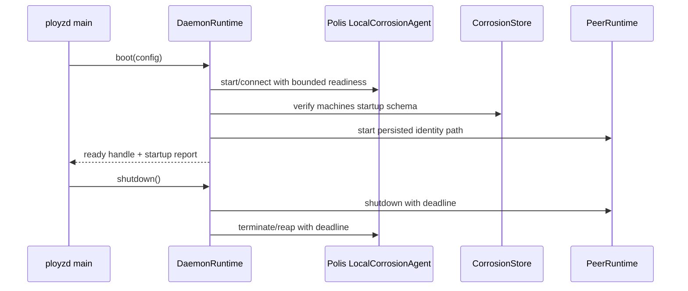

# feat: Add Daemon Substrate Boot Path

## Summary

Introduce the first narrow `ployzd` crate and move the proven substrate spine
from test assembly into a daemon-owned boot path. The daemon should start local
Corrosion v1.0 with the membership startup schema, verify schema usability,
start persistent iroh peer identity, report substrate readiness, and shut down
cleanly.

---

## Problem Frame

The substrate-spine e2e now proves the pieces work together, but production code
still has no daemon lifecycle owner. Roadmap Milestone 1 calls for local daemon
substrate startup before CLI or mesh work, so the next slice should make the
daemon own boot/adoption without expanding into operator UX, WireGuard, or deploy
behavior.

---

## Requirements

- R1. Add a minimal `ployzd` workspace crate with a daemon library and binary
  entry point that can be tested without starting unrelated product services.
- R2. Define daemon substrate configuration around an explicit state directory,
  iroh identity path, Corrosion state directory, Corrosion binary path, local
  API/gossip addresses, and readiness deadlines.
- R3. Start or connect to local Corrosion v1.0 during daemon boot, provide the
  Corrosion v1.0 file-backed membership startup schema, verify the `machines`
  columns, lifecycle index, and bounded write/delete path through
  `CorrosionStore`, and expose the store behind existing composition
  boundaries.
- R4. Start `PeerRuntime` from a persisted daemon identity path and preserve the
  same iroh endpoint ID across daemon restart with the same state directory.
- R5. Keep product membership composition outside the daemon substrate boot
  object; this slice proves substrate resources are ready for later service
  layers.
- R6. Expose a small typed startup report that separates configured state,
  durable identity, Corrosion readiness, iroh readiness, and startup failures.
- R7. Bound every external wait: Corrosion process readiness, schema verify,
  iroh endpoint/ticket boot, and shutdown.
- R8. Add daemon-level tests that prove boot, startup readiness, restart
  identity, schema usability after restart, and cleanup behavior.

---

## Scope Boundaries

- Do not add a public CLI crate or user-facing command set in this slice.
- Do not add WireGuard peer derivation, mesh namespace tables, deploy, branch,
  volume, gateway, or DNS behavior.
- Do not design daemon-to-daemon command RPC yet. Peer RPC remains the existing
  preflight path only.
- Do not turn Corrosion rows into a command queue or introduce background
  reconciliation.
- Do not require global cluster consensus before daemon startup; this slice is
  local substrate readiness and restart adoption.

### Deferred to Follow-Up Work

- CLI `status` and `doctor`: future CLI slice should consume the daemon startup
  report added here and add any live health probes it needs.
- Two-daemon join through daemon processes: future slice can reuse the
  substrate-spine e2e topology once `ployzd` has an IPC or API surface.
- Mesh and namespace rows: future Milestone 2 work.

---

## Context & Research

### Relevant Code and Patterns

- `crates/polis/src/peers/runtime.rs` owns `PeerRuntime` endpoint/ticket/listener
  lifecycle. `crates/ployz/src/composition.rs` re-exports it for product tests
  and owns `iroh_peer_rpc_probe` plus `corrosion_machine_membership`.
- `crates/polis/src/store.rs` owns `CorrosionStore` client primitives for query,
  transaction, subscribe, updates, and schema application.
- `crates/polis/src/membership/schema.rs` and
  `crates/polis/src/membership/schema.sql` own canonical machine membership
  schema and row statements.
- `crates/polis/src/corrosion_agent/` owns the reusable Corrosion v1.0
  process harness, including isolated or persistent state, bounded readiness,
  port retry, explicit cleanup policy, and shutdown.
- `crates/ployz-e2e/src/scenarios/substrate_spine.rs` proves the current
  manually assembled substrate slice and should become the regression model for
  daemon boot.
- `docs/testing/substrate-integration.md` documents the pinned Corrosion binary
  and current local test expectations.

### Institutional Learnings

- `docs/solutions/architecture-patterns/operator-perspective-commands-with-corrosion-rows-2026-05-24.md`
  says Corrosion is replicated state, not command execution. The daemon boot
  path must initialize rows and startup state, not add command queues or
  reconcilers.
- `docs/solutions/architecture-patterns/authority-status-separates-truth-from-observation-2026-05-08.md`
  says status surfaces must separate durable truth from live observation. The
  daemon startup report should record readiness and errors without pretending
  live probes are stored membership truth.

### External References

- No external research is needed for this plan. The work follows local
  substrate primitives and the already pinned Corrosion v1.0 dependency/binary
  contract.

---

## Key Technical Decisions

- Add `crates/ployzd` now: The user chose the actual daemon boot slice over a
  core-only lifecycle layer, and the roadmap explicitly calls for local daemon
  substrate startup before CLI work.
- Keep Corrosion process mechanics in Polis: Polis owns product-neutral
  Corrosion lifecycle primitives, while `ployzd` owns daemon boot composition,
  startup reporting, and shutdown ordering.
- Keep iroh peer runtime mechanics in Polis: `PeerRuntime` is substrate
  infrastructure, so `ployzd` depends on `polis`, not Ployz product
  composition, for local peer boot.
- Use a Corrosion v1.0 startup schema for replicated tables: the daemon writes
  the file-backed membership startup schema before agent launch and then
  verifies the `machines` table shape, lifecycle index, and membership
  write/delete path through `CorrosionStore`. The canonical Polis schema
  remains the strict product schema; startup-schema defaults exist only to
  satisfy Corrosion v1.0 forward-schema loading.
- Keep daemon adoption ownership local: Polis records a local owner marker and
  verifies the live Corrosion database path before adopting an existing agent.
  Ownership markers are not Corrosion replicated product state.
- Model substrate as an owned daemon handle: Boot should return one handle that
  owns Corrosion process/client, PeerRuntime, startup state, and shutdown order.
- Leave membership construction to a later daemon control-plane/service layer.
  The public `DaemonRuntime` should expose substrate resources, not product
  operations.
- Report startup state as observation, not durable truth: Startup report fields
  should carry configured paths/addresses, component readiness/failure, and the
  loaded endpoint ID when available. They should not mutate membership rows.

---

## Open Questions

### Resolved During Planning

- Should this plan introduce `ployzd` now? Yes. The user selected the new daemon
  crate path.
- Should the daemon slice include CLI or mesh behavior? No. The scope is local
  substrate boot/adoption only.

### Deferred to Implementation

- Exact daemon config file format: Start with typed Rust config and test
  builders. A serialized config can be added when a CLI/API exists.
- Exact startup report rendering: Keep the core report typed. Rendering belongs
  to a later CLI/API surface.
- Whether Corrosion v1.0 daemon startup can use canonical schema only:
  Resolved during implementation. Corrosion v1.0 requires file-backed startup
  schemas with defaults for non-null columns, so daemon boot uses the same
  isolated startup schema as the e2e substrate tests and verifies schema
  usability after readiness.

---

## Output Structure

```text
crates/
  ployzd/
    Cargo.toml
    src/
      lib.rs
      main.rs
      daemon.rs
      substrate.rs
      report.rs
      config.rs
      tests.rs
```

This tree is the expected starting shape. The implementer may split test modules
or helper modules differently if the boundaries remain the same.

---

## High-Level Technical Design

> *This illustrates the intended approach and is directional guidance for
> review, not implementation specification. The implementing agent should treat
> it as context, not code to reproduce.*



---

## Implementation Units

### U1. Workspace Crate And Daemon Skeleton

**Goal:** Add the minimal `ployzd` crate and a testable daemon runtime boundary
without adding product commands or public API behavior.

**Requirements:** R1, R2

**Dependencies:** None

**Files:**
- Modify: `Cargo.toml`
- Create: `crates/ployzd/Cargo.toml`
- Create: `crates/ployzd/src/lib.rs`
- Create: `crates/ployzd/src/main.rs`
- Create: `crates/ployzd/src/daemon.rs`
- Create: `crates/ployzd/src/config.rs`
- Test: `crates/ployzd/src/tests.rs`

**Approach:**
- Add `ployzd` as a workspace member with dependencies on `ployz`, `polis`,
  `thiserror`, and `tokio`.
- Define a `DaemonConfig` around state directory, Corrosion binary path,
  explicit Corrosion directories/addresses, bootstrap peers, peer identity
  path, and bounded deadlines.
- Define a `DaemonRuntime` that can be started and shut down in tests, but keep
  `main.rs` thin and non-policy-bearing.
- Keep product modules in `ployz` unchanged unless a narrow composition helper
  is needed later.

**Execution note:** Start with crate-level boot tests using temporary state
directories before filling in runtime internals.

**Patterns to follow:**
- `crates/ployz/src/composition.rs` for composition boundaries.
- `crates/polis/src/corrosion_agent/` for Corrosion lifecycle behavior.

**Test scenarios:**
- Happy path: constructing a test `DaemonConfig` with a temp state directory
  creates deterministic subpaths for peer identity and Corrosion state.
- Edge case: missing state directory is created during boot setup rather than
  causing an unclassified panic.
- Error path: invalid or unwritable state directory returns a structured daemon
  setup error.

**Verification:**
- `ployzd` builds as a workspace member.
- The daemon skeleton exposes a bounded start/shutdown lifecycle usable by
  tests.

---

### U2. Daemon-Owned Corrosion Lifecycle

**Goal:** Make `ployzd` compose the production Polis Corrosion agent and expose
a ready `CorrosionStore` through a daemon-owned handle.

**Requirements:** R2, R3, R7

**Dependencies:** U1

**Files:**
- Create: `crates/ployzd/src/substrate.rs`
- Modify: `crates/ployzd/src/config.rs`
- Modify: `crates/ployzd/src/daemon.rs`
- Test: `crates/ployzd/src/tests.rs`

**Approach:**
- Use `polis::LocalCorrosionAgent` with a persistent daemon root dir,
  explicit API/gossip/prometheus addresses, bounded readiness, and bounded
  shutdown.
- Prefer repo-local Corrosion binary resolution compatible with
  `CORROSION_BIN` and `target/tools/bin/corrosion`.
- Provide `polis::membership_startup_schema_sql()` as a Corrosion file-backed
  startup schema and verify the `machines` columns, lifecycle index, and
  membership write/delete path with `CorrosionStore` after readiness.
- Keep error variants structured: missing binary, config I/O failure, process
  exited before ready, readiness timeout, schema verify failure, and shutdown
  timeout.

**Patterns to follow:**
- `crates/polis/src/corrosion_agent/` for production lifecycle behavior.
- `crates/polis/src/store.rs` for store timeouts and schema application.
- `crates/ployz-e2e/src/scenarios/substrate_spine.rs` for real Corrosion test
  expectations.

**Test scenarios:**
- Happy path: daemon substrate starts Corrosion, creates a `CorrosionStore`,
  verifies membership schema, and can query the `machines` table.
- Edge case: starting twice with the same persistent state directory keeps the
  same Corrosion state directory and does not require deleting stored data.
- Error path: missing Corrosion binary returns a daemon substrate setup error
  that includes the configured binary path.
- Error path: readiness timeout returns a timeout error and includes captured
  process log snippets when available.
- Integration: daemon crate tests verify schema usability through the
  daemon-owned store.

**Verification:**
- Corrosion startup waits are deadline-bounded.
- Schema is applied through Polis store primitives, not raw daemon SQL.
- Failed startup does not leave a live child process.

---

### U3. Persistent Peer Runtime Boot And Restart Adoption

**Goal:** Start iroh `PeerRuntime` from daemon state and prove restart preserves
the same endpoint ID.

**Requirements:** R4, R6, R7, R8

**Dependencies:** U1

**Files:**
- Modify: `crates/ployzd/src/substrate.rs`
- Modify: `crates/ployzd/src/daemon.rs`
- Create: `crates/ployzd/src/report.rs`
- Test: `crates/ployzd/src/tests.rs`

**Approach:**
- Store the peer identity under the daemon state directory, not in a temp file
  outside daemon ownership.
- Use `polis::PeerRuntime::start` with a bounded boot deadline.
- Record the local endpoint ID in the daemon substrate handle and startup
  snapshot.
- During normal daemon shutdown, attempt peer runtime shutdown and Corrosion
  shutdown with bounded deadlines and report either failure; `Drop` remains a
  last-resort cleanup path.

**Patterns to follow:**
- `crates/polis/src/peers/runtime.rs` for `PeerRuntime` boot and shutdown.
- `crates/polis/src/peers/identity.rs` behavior via public
  `load_or_create_identity` semantics.
- `crates/ployz-e2e/src/scenarios/substrate_spine.rs` restart identity test.

**Test scenarios:**
- Happy path: daemon boot reports an iroh endpoint ID after peer runtime starts.
- Integration: boot daemon with state dir, capture endpoint ID, shut down, boot
  again with same state dir, and observe the same endpoint ID.
- Edge case: two different daemon state directories produce different endpoint
  IDs.
- Error path: peer identity I/O failure returns a structured peer startup error
  and does not report substrate ready.

**Verification:**
- Restart-stable endpoint identity is proven at daemon level, not only by
  direct `PeerRuntime` tests.
- Shutdown remains bounded and does not mask already-proven boot assertions in
  e2e cleanup.

---

### U4. Substrate Startup Report

**Goal:** Expose a small typed startup report for future CLI/API consumers
without turning the substrate boot object into a product service surface.

**Requirements:** R5, R6, R7

**Dependencies:** U2, U3

**Files:**
- Modify: `crates/ployzd/src/substrate.rs`
- Modify: `crates/ployzd/src/report.rs`
- Modify: `crates/ployzd/src/daemon.rs`
- Test: `crates/ployzd/src/tests.rs`

**Approach:**
- Keep the daemon startup report separate from durable membership rows:
  Corrosion readiness, schema readiness, peer readiness, and endpoint ID are
  observations.
- Leave `MachineMembershipService` construction in Ployz composition or a later
  daemon control-plane layer, not in the substrate boot handle.
- Do not add public serialization or CLI rendering yet; keep the report typed
  and testable inside the daemon crate.

**Patterns to follow:**
- `crates/ployz/src/adapters/polis/machine_membership.rs` for adapter ownership
  boundaries.
- `docs/solutions/architecture-patterns/authority-status-separates-truth-from-observation-2026-05-08.md`
  for status semantics.

**Test scenarios:**
- Happy path: ready daemon report contains Corrosion ready, schema ready, peer
  ready, and a non-empty endpoint ID.
- Edge case: report after shutdown does not claim live readiness.

**Verification:**
- Product modules remain free of Corrosion process management details.
- Startup reporting does not write or rewrite durable cluster truth.

---

### U5. Daemon Regression And Documentation

**Goal:** Keep daemon-level acceptance coverage in the daemon crate and
document how the daemon boot slice relates to the substrate spine.

**Requirements:** R1, R3, R4, R6, R8

**Dependencies:** U2, U3, U4

**Files:**
- Modify: `crates/ployzd/src/tests.rs`
- Modify: `docs/testing/substrate-integration.md`
- Modify: `docs/architecture/ployz-1-0-roadmap.md`
- Modify: `docs/architecture/functional-system-roadmap.md`

**Approach:**
- Add focused daemon crate tests that boot `DaemonRuntime` with a temp state
  dir, wait for the startup report to become ready, verify schema usability,
  restart with the same state dir, and verify endpoint ID plus schema usability.
- Keep the existing `substrate_spine` e2e as the lower-level two-node proof.
  Do not add a second e2e until the actual daemon process boundary exists.
- Update roadmap language from "add local daemon substrate startup" to reflect
  this slice once implemented.

**Patterns to follow:**
- `crates/ployz-e2e/src/scenarios/substrate_spine.rs` for Corrosion and iroh
  acceptance style.
- `docs/testing/substrate-integration.md` for command and prerequisite wording.

**Test scenarios:**
- Integration: boot daemon, startup report becomes ready, membership schema is
  usable, and the daemon-owned store can query the schema.
- Integration: restart daemon with same state dir, endpoint ID stays stable,
  and schema remains usable after restart.
- Error path: daemon boot with missing Corrosion binary fails before reporting
  ready and preserves a readable setup error.
- Edge case: daemon shutdown after partial startup cleans up any started
  subprocesses.

**Verification:**
- The daemon acceptance tests can run with `cargo test -p ployzd -- --nocapture`.
- Roadmap/docs accurately distinguish completed substrate spine from daemon boot
  ownership.

---

## System-Wide Impact

- **Interaction graph:** A new `ployzd` crate owns local daemon lifecycle and
  calls into existing `polis` substrate boundaries. `polis` remains
  product-neutral; `ployz` remains product orchestration.
- **Error propagation:** Startup errors should flow as structured daemon errors
  with distinct setup, Corrosion, schema, peer, and shutdown classes.
- **State lifecycle risks:** Partial startup can leave a Corrosion process,
  state directory, or iroh endpoint alive. The daemon handle must attempt
  cleanup for every started component and preserve persistent state across
  intentional restart.
- **API surface parity:** No public CLI/API is added. The typed startup report
  is intentionally internal until the status/doctor slice.
- **Integration coverage:** Unit tests cover config and error classification;
  e2e covers real Corrosion process, real iroh identity, schema usability, and
  restart adoption.
- **Unchanged invariants:** Machine membership semantics stay in `ployz`;
  replicated row primitives stay in `polis`; Corrosion remains replicated state,
  not command execution.

---

## Risks & Dependencies

| Risk | Mitigation |
|------|------------|
| Corrosion process lifecycle duplicated between daemon and tests | Keep reusable Corrosion lifecycle mechanics in `polis::corrosion_agent`; have daemon compose that production primitive. |
| Startup schema behavior differs between direct `apply_schema` and file-backed Corrosion replication | Use file-backed startup schema only for Corrosion v1.0 boot, keep the canonical Polis schema strict, and verify table shape plus write-path usability through `CorrosionStore`. |
| Peer shutdown can time out and make tests flaky | Use bounded shutdown, attempt Corrosion cleanup even when peer cleanup fails, and make cleanup failures visible. |
| Startup report accidentally becomes durable truth | Keep startup state as typed observation and do not write it back into membership rows. |
| New daemon crate becomes a feature registry | Limit `DaemonRuntime` to lifecycle ownership and routing; feature state belongs in subsystems. |

---

## Validation Plan

- `ployzd` crate builds as part of the workspace.
- Daemon unit tests cover config derivation, missing binary errors, readiness
  failure classification, startup reports, and restart identity.
- E2E daemon substrate test covers real Corrosion, real peer identity, schema
  usability, restart adoption, and bounded cleanup.
- Existing substrate-spine e2e remains green.
- Full workspace tests and clippy remain at the current warning baseline.
