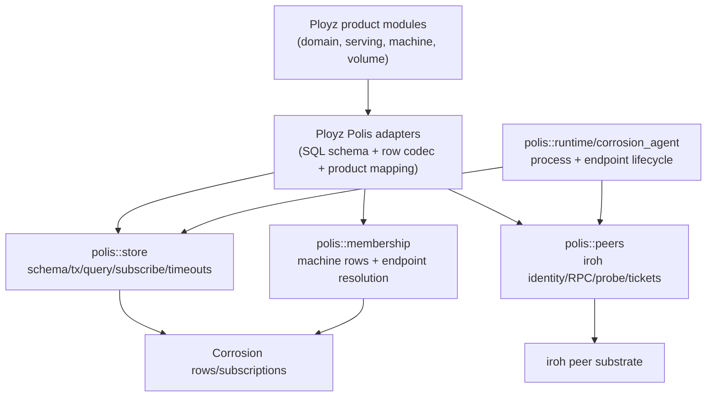

# refactor: Rebuild Polis Around Corrosion/Iroh Rows

## Summary

Refactor Polis into the small distributed-systems framework Ployz actually
needs after the Corrosion/iroh pivot: runtime, store, membership, peers, and
typed substrate failures. Delete the old fact/p2panda-shaped public surface,
move product state to direct Corrosion rows in Ployz adapters, and keep the
framework simple until repeated code proves a higher-level helper is needed.

---

## Problem Frame

Polis was intended to make Ployz code beautiful, like a Laravel-style framework
for the distributed substrate. The current crate no longer matches that goal:
it exposes generic claims, authority proofs, facts, projections, operations,
and in-memory framework types while the real system direction is Corrosion rows
plus bounded iroh peer RPC.

The cleanup is not just deletion. Polis should survive as the opinionated
substrate kit that makes the correct Ployz code path easy and the dangerous
paths awkward: bounded store operations, bounded peer calls, explicit schema
application, membership lookup, and typed failures. Ployz should own product
state, product schemas, resource writer rules, domain readiness, serving route
semantics, volume ownership, and deploy behavior.

---

## Requirements

- R1. Remove public Polis modules and exports for `claims`, `authority`,
  `facts`, `projection`, and `operations`.
- R2. Remove `SourceWatermark`, `SubmittedFenceFingerprint`, public Polis
  `OperationId`, public Polis `IdempotencyKey`, and public Polis grant/fence
  proof vocabulary.
- R3. Keep Polis focused on `corrosion_agent`, `store`, `membership`, `peers`,
  `identity`, test support for real substrate fixtures, and typed errors.
- R4. Do not create a resource kit, global row registry, universal row epoch,
  public product cursor, generic fact replacement, operation table, distributed
  lock subsystem, or command queue in this refactor.
- R5. Use Corrosion change/cursor mechanics only where Polis needs them
  internally for query/subscription/visibility behavior. Do not persist them in
  product rows or expose them as product identity unless an existing product
  trait requires a temporary bridge.
- R6. Make writer policy a module/API-path decision, not a column stored on
  every row. Cheap enforcement is allowed where substrate facts are available;
  fake proof systems are not.
- R7. Treat domain status as a latest-only derived workflow status row: no
  owner machine, no history, no claims, no fences, no reducer.
- R8. Treat serving route state as a latest-only route row with
  `ServingGeneration` as a simple route switch version for future DNS/gateway
  subscribers. No generation slot table and no generic projection catch-up.
- R9. Keep the serving writer private to the product composition path for now.
  Future place deploy work is the intended single writer, but this refactor
  should not add runtime authority ceremony for it.
- R10. Product modules own typed state. Ployz Polis adapters own product SQL
  schema and Corrosion codecs. Polis owns only substrate schemas such as
  membership.
- R11. Replace facts-backed machine, domain, and serving adapters with direct
  Corrosion row adapters.
- R12. Delete `crates/ployz/src/facts/` if its remaining uses are only to feed
  the deleted Polis fact/projection stack.
- R13. Preserve current product outcomes unless a deleted concept was an
  intentionally removed false state. For domain, current status wins. For
  serving, latest row wins.
- R14. Move or localize the external ACME attempt workflow out of Polis unless
  implementation adds a real Corrosion-backed substrate owner for it.
- R15. Add public-surface guards so removed Polis concepts do not re-enter as
  aliases or renamed dumping-ground abstractions.

---

## Scope Boundaries

- Do not add compatibility aliases or deprecation shims for removed names.
- Do not move Ployz product operation identity into Polis.
- Do not add a universal `OwnedResource<T>` abstraction in this refactor.
- Do not require every product row to have an owner machine. Only naturally
  owner-written rows, such as future volume/container rows, need owner-machine
  serialization.
- Do not add generic projection, reducer, materialization, or catch-up
  vocabulary in Polis.
- Do not preserve `polis::Error::Unauthorized` or `polis::Error::StaleFence`
  unless a surviving Polis primitive can actually produce them.
- Do not make domain status an authoritative owner-written resource.
- Do not make serving generation uniqueness a v1 invariant.
- Do not redesign product domain/deploy/serving behavior beyond what is needed
  to remove the old fact/projection substrate.
- Do not start gateway/DNS subscriber implementation here. The serving row
  should be shaped so subscribers can use it later, but subscriber behavior is
  outside this plan.

### Deferred to Follow-Up Work

- Place deploy as the explicit serving writer: future work should centralize
  route placement and generation assignment there.
- Gateway/DNS route switching: subscribe to serving rows and apply higher
  generations once those runtimes exist.
- Owner-written resource helpers: add only after volume/container/resource
  adapters repeat the same membership + RPC + owner-write + visibility pattern.
- Product audit/history tables: add only when domain, serving, or deploy has a
  real audit/replay requirement. Latest-current rows are enough for this pass.
- Distributed claims/fences: add only for a proven multi-owner path where
  owner-machine serialization is insufficient.
- ACME adapter decomposition beyond moving attempts out of Polis: if the file
  remains large after this refactor, split it in a focused follow-up.
- Documentation scrub outside the active architecture docs: after code lands,
  update older historical notes that still describe p2panda/fact-store control
  flow as current.

---

## Context & Research

### Relevant Code and Patterns

- `crates/polis/src/lib.rs` currently advertises authority, claims, facts,
  projection, and operations as core Polis concepts. The new public surface
  should not.
- `crates/polis/src/store.rs` already contains the right direction: a
  Corrosion-specific wrapper for statements, transactions, queries,
  subscriptions, updates, change ids, and timeout-bounded operations.
- `crates/polis/src/membership.rs` and `crates/polis/src/membership/` already
  model substrate membership rows and schema separately from Ployz product
  membership outcomes.
- `crates/polis/src/peers/` already owns iroh identity, tickets, runtime,
  probes, and RPC mechanics.
- `crates/polis/src/claims.rs`, `crates/polis/src/authority.rs`,
  `crates/polis/src/facts.rs`, `crates/polis/src/projection.rs`, and
  `crates/polis/src/operations.rs` are the old framework vocabulary to remove.
- `crates/ployz/src/adapters/polis/machine_membership.rs` is the model to
  prefer over `crates/ployz/src/adapters/polis/machine.rs`: direct Corrosion
  rows, product mapping at the adapter boundary, no Polis facts.
- `crates/ployz/src/adapters/polis/domain.rs` and
  `crates/ployz/src/adapters/polis/serving.rs` are facts/projection adapters
  that should become direct current-row adapters.
- `crates/ployz/src/domain/mod.rs` already treats domain status as reusable
  only after fresh certificate and serving verification. That makes a
  latest-only row acceptable; correctness does not depend on the status row as
  sole truth.
- `crates/ployz/src/serving/mod.rs` currently uses fact cursors and projection
  catch-up, but the desired pre-v1 shape is a direct route row where generation
  is the future DNS/gateway switch version.
- `crates/ployz/src/volume/mod.rs` already owns product-specific ownership
  epochs and watermarks. Polis should not generalize those into every row.

### Institutional Learnings

- `VISION.md` and `AGENTS.md` put Corrosion access, transactions,
  subscriptions, change cursors, iroh identity, tickets, peer RPC, deadlines,
  probes, membership records, and distributed failure typing in Polis.
- `docs/architecture/ployz-1-0-roadmap.md` says owner-machine serialization is
  the default fence and explicit distributed claims are a later escape hatch.
- `docs/architecture/ployz-rewrite.md` marks p2panda control-plane guidance as
  historical.
- `docs/solutions/architecture-patterns/operator-perspective-commands-with-corrosion-rows-2026-05-24.md`
  says Corrosion rows are replicated state, not command execution.
- `docs/solutions/architecture-patterns/authority-status-separates-truth-from-observation-2026-05-08.md`
  warns against public variants that imply states the system cannot produce.

### External References

- No external research is needed. This is an internal boundary correction
  driven by the repo direction and current code.

---

## Key Technical Decisions

| Decision | Rationale |
|---|---|
| Minimal Polis public modules | The desired framework is runtime/store/membership/peers/failure, not generic facts, operations, projections, or authority. |
| Manual composition before helper extraction | Membership + RPC + store should be composed directly until repeated owner-written resource paths prove a helper. |
| Writer policy is API shape, not row data | Storing `writer_policy` everywhere adds ceremony. The adapter/module path should make the write rule clear. |
| Cheap enforcement only | Polis may check local machine identity, active membership, bounded RPC, and store visibility. It must not recreate claims or fake authority. |
| Product schemas stay in adapters | Product modules keep typed state and behavior; adapters own SQL rows/codecs over Polis store primitives. |
| Domain status is latest-only derived state | Domain readiness revalidates cert and serving before trusting a ready row, so history and ownership are unnecessary for v1. |
| Serving state is latest-row-wins | Serving generation remains a dumb switch version, but same-generation uniqueness and fact projection are removed for v1. |
| Serving writer is private by structure | Future place deploy is the single writer. Pre-v1 keeps the commit API private instead of adding runtime authority checks. |
| ACME attempts leave Polis unless backed by real substrate | Current external-attempt machinery is operations-shaped and fake-backend-friendly. That does not belong in the minimal Polis surface. |
| Product facts delete with the Polis fact stack | Keeping `crates/ployz/src/facts/` after removing Polis facts would preserve the old mental model without a current owner. |

---

## Open Questions

### Resolved During Planning

- Should Polis still exist? Yes, as the ergonomic distributed substrate kit for
  Corrosion, iroh, membership, runtime, bounded store I/O, and typed failures.
- Should every product row have an owner? No. Each product port declares its
  writer rule. Domain status is not owner-written.
- Should Polis expose a universal row epoch? No. Corrosion handles visibility;
  product workflows such as volume transfer own generation/ABA protection when
  they need it.
- Should product cursors be exposed? No. Use Corrosion change ids internally for
  visibility/query mechanics, not as product identity.
- Should old facts/projections stay as a bridge? No. Replace machine, domain,
  and serving with direct Corrosion rows now.
- Should domain status retain history? No. Latest status only for v1.
- Should serving preserve generation uniqueness? No. Latest row wins; generation
  is a route switch version.

### Deferred to Implementation

- Exact SQL column layout for domain and serving rows. The plan fixes behavior
  and ownership boundaries; implementation should choose the smallest schema
  that supports typed state and tests.
- Exact serving trait cleanup. If `catch_up_commits` has non-test callers,
  replace it with a current-row verification shim; otherwise delete the
  fact-cursor-based path outright.
- Exact ACME attempt destination. Prefer Ployz ACME/adapter-local ownership
  unless implementation can name a real Corrosion-backed substrate owner.
- Exact public-surface guard mechanics. Use compile/API checks or removed-name
  scans that fail when deleted concepts re-enter; do not rely on the current
  hardcoded smoke-test pattern.

---

## High-Level Technical Design

> *This illustrates the intended approach and is directional guidance for
> review, not implementation specification. The implementing agent should treat
> it as context, not code to reproduce.*

The important boundary is that Ployz owns product state and writer rules, while
Polis owns substrate mechanics. Direct row adapters replace the old fact/reducer
stack. Higher-level owner-write helpers are deferred until multiple product
resources repeat the same pattern.

---

## Implementation Units

### U1. Reset Polis Public Surface

**Goal:** Make Polis advertise only the surviving substrate framework surface
and prepare for deleting old modules once callers are gone.

**Requirements:** R1, R2, R3, R4, R15

**Dependencies:** None

**Files:**
- Modify: `crates/polis/src/lib.rs`
- Modify: `crates/polis/src/error.rs`
- Modify: `crates/polis/src/identity.rs`
- Test: `crates/polis/src/lib.rs`
- Test: `crates/polis/src/identity.rs`

**Approach:**
- Rewrite crate docs around Corrosion store, Corrosion agent lifecycle,
  membership rows, iroh peers, deadlines/timeouts, and typed substrate errors.
- Remove top-level exports for old authority, claim, fact, projection, and
  operation vocabulary after downstream units remove the callers.
- Keep simple identity values that have real substrate use, such as iroh
  endpoint identity and scope/principal values still needed by surviving code.
- Delete `SourceWatermark` from Polis identity and leave product watermarks in
  Ployz volume code.
- Replace the current "no product modules" smoke test with a public-surface
  guard that catches removed concept names returning through aliases.
- Remove impossible top-level error variants once their last producers are gone.

**Execution note:** Characterize current public exports first, then make the
guard fail before removing exports.

**Patterns to follow:**
- `crates/polis/src/store.rs` module-level docs for substrate-specific framing.
- `crates/polis/src/membership.rs` module-level docs for "row primitives, not
  product outcomes."

**Test scenarios:**
- Happy path: surviving public exports for store, membership, peers,
  corrosion agent, and identity remain importable from `polis`.
- Error path: removed names such as `AuthorityService`, `FactStore`,
  `ProjectionSource`, `ClaimGuard`, and `OperationId` are absent from public
  exports.
- Edge case: parsing a valid `IrohEndpointId` and any other surviving identity
  still succeeds after identity cleanup.
- Edge case: parsing empty surviving identity values still reports malformed
  payload.

**Verification:**
- `polis::claims`, `polis::authority`, `polis::facts`,
  `polis::projection`, and `polis::operations` are no longer public concepts.
- The crate docs describe the Corrosion/iroh substrate boundary, not the old
  fact/proof framework.

---

### U2. Move ACME Attempts Out Of Polis Operations

**Goal:** Delete `operations.rs` and relocate the live ACME attempt workflow so
Polis no longer carries a generic operation/attempt framework.

**Requirements:** R1, R2, R3, R14, R15

**Dependencies:** None

**Files:**
- Delete: `crates/polis/src/external_attempt.rs`
- Delete: `crates/polis/src/operations.rs`
- Modify: `crates/polis/src/lib.rs`
- Modify: `crates/ployz/src/adapters/polis/acme.rs`
- Modify: `crates/ployz/src/composition.rs`
- Test: `crates/ployz/src/adapters/polis/acme.rs`
- Test: `crates/ployz/src/composition.rs`

**Approach:**
- Move the typed attempt backend, request, evidence, terminal marker, and replay
  behavior into Ployz ACME/adapter-owned code unless implementation introduces
  a real Corrosion-backed attempt table.
- Keep attempt operation/idempotency identity local to the ACME attempt model;
  do not re-export it through Polis identity.
- Delete submitted fence fields and fingerprinting from the attempt workflow.
- Preserve current ACME behavior: idempotent start/replay, evidence recording,
  terminal replay, typed failure decode, terminal conflict behavior, and
  drop-to-interrupt behavior.
- Remove `polis::external_attempt` from composition once the replacement lives
  under Ployz ownership.

**Patterns to follow:**
- `crates/ployz/src/adapters/polis/acme.rs` for the live consumer behavior.
- `crates/ployz/src/acme/mod.rs` for product-owned certificate readiness and
  failure types.

**Test scenarios:**
- Happy path: missing certificate starts an ACME attempt, records checkpoint
  evidence, writes a succeeded terminal marker, and returns a usable
  certificate.
- Happy path: retrying the same ACME attempt replays the terminal result rather
  than issuing a duplicate external request.
- Error path: a terminal conflict returns the same product failure currently
  expected by the ACME adapter.
- Edge case: interrupted attempt behavior still records the interrupted state
  or exposes the same product failure as before.
- Compile-time: no public `polis::operations`, `polis::OperationId`,
  `polis::IdempotencyKey`, or `polis::SubmittedFenceFingerprint` remains.

**Verification:**
- Polis has no generic operation module.
- ACME tests prove behavior moved without making Polis own product attempt
  semantics.

---

### U3. Strengthen Store Primitives Without Adding A Framework

**Goal:** Ensure `polis::store` has the minimal primitives direct row adapters
need: schema application, bounded transactions, bounded queries, subscriptions,
updates, and internal visibility mechanics.

**Requirements:** R3, R4, R5, R6, R10

**Dependencies:** None

**Files:**
- Modify: `crates/polis/src/store.rs`
- Test: `crates/polis/src/store.rs`
- Modify if needed: `crates/polis/src/lib.rs`

**Approach:**
- Keep `CorrosionStore` Corrosion-specific. Do not introduce a generic store
  trait or generic resource registry.
- Add only the small helpers direct row adapters prove they need while replacing
  facts: schema statement grouping, typed row decoding conveniences,
  transaction receipts, subscription/update handling, or bounded visibility
  wait.
- If visibility wait is needed, keep Corrosion change ids inside the store
  observation/receipt layer. Do not make them product cursors.
- Keep timeout behavior explicit and typed.

**Patterns to follow:**
- Existing `CorrosionStore::execute_transaction`, `query`, `subscribe`, and
  `updates` flow.
- Existing `StoreError` variants for timeout, malformed payload, response
  errors, missed change, and stream interruption.

**Test scenarios:**
- Happy path: applying a non-empty schema statement list returns a transaction
  receipt with rows affected.
- Happy path: querying a table returns rows and the Corrosion change id when
  Corrosion supplies one.
- Error path: empty statements and malformed rows return `MalformedPayload`.
- Error path: transaction, query, subscription, and update operations map
  elapsed deadlines to `StoreError::Timeout`.
- Edge case: subscriptions detect missed changes and stream errors without
  exposing product-level freshness claims.

**Verification:**
- Direct adapters can be implemented without importing `corro-client` into
  Ployz product modules.
- No new public generic fact/projection/store abstraction is introduced.

---

### U4. Make Machine Membership Corrosion-Only

**Goal:** Finish the machine membership path on direct Corrosion rows and delete
the older facts-backed machine adapter.

**Requirements:** R3, R10, R11, R12, R13

**Dependencies:** U3

**Files:**
- Modify: `crates/ployz/src/adapters/polis/machine_membership.rs`
- Delete: `crates/ployz/src/adapters/polis/machine.rs`
- Modify: `crates/ployz/src/adapters/polis/mod.rs`
- Modify: `crates/ployz/src/composition.rs`
- Modify: `crates/ployz/src/machine.rs`
- Test: `crates/ployz/src/adapters/polis/machine_membership.rs`
- Test: `crates/ployz/src/composition.rs`

**Approach:**
- Keep Polis membership schema and row helpers as substrate-owned primitives.
- Ensure composition exposes only the Corrosion-backed membership adapter, not
  the old in-memory facts-backed adapter.
- Map Ployz `MachineMembership` and `MachineStatus` at the adapter boundary.
- Keep peer preflight before row write for machine add, matching the existing
  Corrosion membership slice.
- Remove product fact/reducer tests that only exercise the deleted machine fact
  stack.

**Patterns to follow:**
- Existing `crates/ployz/src/adapters/polis/machine_membership.rs` row mapping,
  peer preflight, and `MachineRows` seam.
- `crates/polis/src/membership/schema.rs` for substrate schema ownership.

**Test scenarios:**
- Happy path: adding an absent, preflighted machine writes one membership row
  and observes it as joined.
- Happy path: observing a missing machine returns absent.
- Error path: failed peer preflight writes no membership row.
- Edge case: removing/tombstoned/conflicted membership lifecycles still map to
  the existing product statuses.
- Integration: composition no longer exposes facts-backed machine membership.

**Verification:**
- No `PolisMachineMembership` facts-backed adapter remains.
- Machine membership still works through Corrosion rows and Polis peer probes.

---

### U5. Replace Domain Facts With A Latest Status Row

**Goal:** Replace domain pending/ready/failed facts and reducers with a
latest-only Corrosion status row owned by the Ployz Polis adapter.

**Requirements:** R7, R10, R11, R12, R13

**Dependencies:** U3

**Files:**
- Modify: `crates/ployz/src/adapters/polis/domain.rs`
- Modify: `crates/ployz/src/domain/mod.rs`
- Modify: `crates/ployz/src/composition.rs`
- Test: `crates/ployz/src/adapters/polis/domain.rs`
- Test: `crates/ployz/src/domain/mod.rs`

**Approach:**
- Replace append/project behavior with direct upsert/read behavior for the
  current domain status.
- Keep the SQL schema and row codec in the Polis adapter, not in the product
  domain module and not in Polis.
- Preserve `DomainStatusPort`: `status` reads the latest row or returns
  `Unknown`; `record_pending`, `record_ready`, and `record_failed` overwrite the
  current row.
- Do not add owner fields, writer tokens, claims, fences, or domain history.
- Preserve domain correctness by relying on existing `verify_ready` behavior:
  a ready row is reused only after certificate and serving activation are
  rechecked.

**Patterns to follow:**
- Existing `DomainReadinessService` flow in `crates/ployz/src/domain/mod.rs`.
- Existing adapter-local mapping style in `machine_membership.rs`.

**Test scenarios:**
- Happy path: recording pending then ready for the same domain returns the ready
  status.
- Happy path: recording failed overwrites the current status and returns failed.
- Happy path: status for a domain without a row returns `Unknown`.
- Error path: malformed stored payload maps to `DomainFailure::StatusUnavailable`.
- Integration: `ensure_ready` reuses a stored ready row only after certificate
  and serving verification still pass.
- Integration: unusable certificates and serving activation failures do not
  record a ready row.

**Verification:**
- Domain status no longer imports Polis facts, projections, reducers, or grants.
- Domain status behavior is latest-only and private to the Ployz adapter.

---

### U6. Replace Serving Facts With A Latest Route Row

**Goal:** Replace serving commit facts, generation-slot facts, reducers, and
projection catch-up with a direct current route row.

**Requirements:** R8, R9, R10, R11, R12, R13

**Dependencies:** U3

**Files:**
- Modify: `crates/ployz/src/adapters/polis/serving.rs`
- Modify: `crates/ployz/src/serving/mod.rs`
- Modify: `crates/ployz/src/domain/mod.rs`
- Modify: `crates/ployz/src/composition.rs`
- Test: `crates/ployz/src/adapters/polis/serving.rs`
- Test: `crates/ployz/src/serving/mod.rs`
- Test: `crates/ployz/src/domain/mod.rs`

**Approach:**
- Store one current route row per route with hostname, target, generation, and
  update metadata.
- Keep `ServingGeneration` as the simple switch version future DNS/gateway
  subscribers can compare. Do not use it for same-generation conflict
  rejection in this refactor.
- Keep the commit API private to composition/product paths. Do not add runtime
  checks for "place deploy only" yet.
- Change `commit_snapshot` to upsert the current route row and return a receipt
  that no longer depends on product fact cursors.
- Change `commit_status` to read the current route row and report current when
  the row identity matches the request.
- Remove or simplify `catch_up_commits`: delete it if callers allow, otherwise
  make it a current-row verification bridge without exposing fact projection
  semantics.
- Keep domain serving verification working against the current route row and
  generation.

**Patterns to follow:**
- Existing `ServingCommitObservation::try_confirm_commit` behavior for matching
  the current route identity.
- Existing `DomainServingActivation` and `DomainReadyRecord` use of
  `ServingGeneration`.

**Test scenarios:**
- Happy path: committing a route writes the current row and `commit_status`
  returns current for the same route, hostname, target, and generation.
- Happy path: a later commit for the same route overwrites the current row, even
  if the generation is lower, equal, or higher.
- Edge case: status for a route without a row returns missing.
- Error path: malformed stored route row maps to the existing serving failure
  used for unavailable/stale projection-like reads.
- Integration: domain readiness records ready with the serving generation from
  the current serving activation.
- Integration: existing same-generation conflict tests are removed or rewritten
  to assert latest-row-wins.

**Verification:**
- Serving no longer imports Polis facts, projections, reducers, generation-slot
  facts, or product fact cursors.
- `ServingGeneration` remains as route switch metadata, not as a fact/projection
  ordering mechanism.

---

### U7. Delete Product Fact Boundary

**Goal:** Remove Ployz product fact modules once machine, domain, and serving no
longer depend on them.

**Requirements:** R11, R12, R13, R15

**Dependencies:** U4, U5, U6

**Files:**
- Delete: `crates/ployz/src/facts/mod.rs`
- Delete: `crates/ployz/src/facts/machine.rs`
- Delete: `crates/ployz/src/facts/domain.rs`
- Delete: `crates/ployz/src/facts/serving.rs`
- Modify: `crates/ployz/src/lib.rs`
- Modify: `crates/ployz/src/error.rs`
- Modify: `crates/ployz/src/adapters/polis/mod.rs`
- Test: `crates/ployz/src/adapters/polis/mod.rs`

**Approach:**
- Delete product fact resource/key/kind/payload/cursor/receipt types if their
  only remaining purpose was Polis fact/projection interop.
- Delete product reducers and fact encoding tests that now describe removed
  storage mechanics.
- Remove mapping helpers in `crates/ployz/src/adapters/polis/mod.rs` that only
  translated product facts to Polis facts.
- Keep product domain/serving/machine typed state in their product modules.

**Patterns to follow:**
- `crates/ployz/src/machine/`, `crates/ployz/src/domain/`,
  `crates/ployz/src/serving/` for product-owned types without substrate
  encoding.

**Test scenarios:**
- Compile-time: no product module imports `crate::facts`.
- Compile-time: no adapter helper maps `ProductFact*` to `polis::Fact*`.
- Integration: machine, domain, and serving adapter tests still cover current
  row behavior after fact modules are gone.

**Verification:**
- `crates/ployz/src/facts/` is gone or contains no active product API.
- The Ployz adapter boundary is Corrosion rows, not product facts.

---

### U8. Delete Old Polis Framework Modules

**Goal:** Remove the stale Polis modules after all live callers have moved to
direct Corrosion rows or Ployz-owned attempts.

**Requirements:** R1, R2, R3, R4, R15

**Dependencies:** U1, U2, U4, U5, U6, U7

**Files:**
- Delete: `crates/polis/src/authority.rs`
- Delete: `crates/polis/src/claims.rs`
- Delete: `crates/polis/src/facts.rs`
- Delete: `crates/polis/src/projection.rs`
- Delete: `crates/polis/tests/fact_store_contract.rs`
- Modify: `crates/polis/src/lib.rs`
- Modify: `crates/polis/src/error.rs`
- Modify: `crates/polis/src/identity.rs`
- Test: `crates/polis/src/lib.rs`

**Approach:**
- Delete the modules rather than renaming or hiding them.
- Remove `Unauthorized`, `StaleFence`, `FreshnessUnknown`, and
  `TerminalAlreadyWritten` from the shared Polis error type if U2 and the row
  adapters eliminate their last Polis producers.
- Keep domain/product equivalents in Ployz where product behavior still needs
  them.
- Ensure test support does not reintroduce in-memory fact/projection
  substitutes under new names.

**Patterns to follow:**
- Existing `store`, `membership`, and `peers` public re-exports for the desired
  public API style.

**Test scenarios:**
- Compile-time: removed modules cannot be imported from Polis.
- Compile-time: removed type names do not appear in public re-exports.
- Error path: surviving Polis store and peer errors still map into Ployz
  `PrimitiveFailure` or product failures correctly.
- Edge case: tests using `test-support` still have real substrate fixtures or
  product-local fakes without Polis fact/projection types.

**Verification:**
- The old Polis framework vocabulary is gone from source and public API.
- No replacement dumping-ground module appears in its place.

---

### U9. Update Composition, Documentation, And Guards

**Goal:** Finish the refactor at the composition and documentation boundary so
future work sees the intended Polis shape.

**Requirements:** R3, R4, R10, R15

**Dependencies:** U1, U2, U3, U4, U5, U6, U7, U8

**Files:**
- Modify: `crates/ployz/src/composition.rs`
- Modify: `crates/ployz/src/adapters/polis/mod.rs`
- Modify: `crates/polis/src/lib.rs`
- Modify: `crates/polis/src/membership/schema.rs`
- Modify: `docs/architecture/ployz-1-0-roadmap.md`
- Test: `crates/ployz/src/composition.rs`
- Test: `crates/polis/src/lib.rs`

**Approach:**
- Remove in-memory composition helpers for facts-backed machine/domain/serving
  adapters. Replace with direct row adapter constructors or test-local fakes as
  appropriate.
- Document the surviving Polis primitive bar: runtime, store, membership,
  peers, identity, and failures.
- Document the row writer policy vocabulary as product-owned guidance:
  self-written, owner-written, coordinator-written, and observed rows. Do not
  add public Polis modules for each policy yet.
- Add guards that prevent old module names and old type families from re-entering
  the public API.
- Update architecture docs enough to make old p2panda/fact guidance clearly
  historical.

**Patterns to follow:**
- `AGENTS.md` architecture boundary wording.
- `docs/architecture/ployz-1-0-roadmap.md` non-negotiable architecture section.

**Test scenarios:**
- Integration: composition still wires certificate readiness with the relocated
  ACME attempt workflow.
- Integration: composition can construct the Corrosion machine membership
  adapter.
- Compile-time: composition no longer exposes facts-backed in-memory
  machine/domain/serving adapters.
- Documentation/guard: public-surface guard fails if a deleted Polis concept is
  re-exported.

**Verification:**
- The plan, docs, and public API all describe the same Polis role.
- Future contributors see Corrosion/iroh primitives as the intended path, not
  facts/projections.

---

## System-Wide Impact

- **Interaction graph:** Ployz product modules keep their product traits;
  Ployz Polis adapters change from fact/projection translation to SQL schema,
  row codec, and Corrosion store calls.
- **Error propagation:** Store/peer/timeouts remain typed substrate errors in
  Polis and map to product failures at adapter boundaries. Deleted authority,
  fence, and projection failures should not survive as unreachable product
  states.
- **State lifecycle risks:** Domain and serving become current-row systems.
  This intentionally drops append history and reducer-based conflict handling.
- **API surface parity:** Composition helpers, product tests, and adapter tests
  must move together because deleting facts affects both Polis and Ployz.
- **Integration coverage:** Machine, domain, serving, ACME attempts, and
  composition need cross-layer tests because compile success alone will not
  prove behavior survived the storage model change.
- **Unchanged invariants:** Polis still owns Corrosion access, Corrosion agent
  lifecycle, iroh peer mechanics, membership substrate, deadlines/timeouts, and
  distributed failure typing. Ployz still owns product authorization and
  product meaning.

---

## Risks & Dependencies

| Risk | Mitigation |
|---|---|
| Deleting facts breaks product tests that were really testing reducers. | Replace them with direct row adapter tests and product-module tests for product behavior. |
| Serving latest-row-wins removes a safety check. | This is an explicit v1 simplification; private writer structure and future place deploy ownership are the guardrail. |
| Domain latest-only status hides useful history. | Accept for v1. Readiness correctness still revalidates certificate and serving activation. |
| ACME attempt relocation grows Ployz ACME adapter. | Preserve behavior first; split ACME adapter in a later focused cleanup if the file remains too large. |
| Public API guard becomes brittle. | Guard concept families and exports, not incidental private helper names. |
| Store helpers grow into a new generic framework. | Add only helpers needed by the three row adapters and defer owner-resource kits until repetition proves them. |

---

## Documentation / Operational Notes

- Update current architecture docs to state that p2panda/fact/projection paths
  are historical.
- Keep row ownership guidance in Ployz architecture language: each product port
  declares its writer rule; not every row has an owner.
- Document that Corrosion rows are replicated state and iroh RPC is the bounded
  work path. Corrosion is not a command bus.
- No rollout compatibility work is planned because the repo is greenfield and
  `AGENTS.md` rejects compatibility shims without a concrete rollout.

---

## Sources & References

- `VISION.md`
- `AGENTS.md`
- `docs/architecture/ployz-1-0-roadmap.md`
- `docs/architecture/ployz-rewrite.md`
- `docs/plans/2026-05-24-003-feat-ployz-1-0-state-and-substrate-plan.md`
- `docs/solutions/architecture-patterns/operator-perspective-commands-with-corrosion-rows-2026-05-24.md`
- `docs/solutions/architecture-patterns/authority-status-separates-truth-from-observation-2026-05-08.md`
- `crates/polis/src/store.rs`
- `crates/polis/src/membership.rs`
- `crates/polis/src/peers.rs`
- `crates/ployz/src/adapters/polis/machine_membership.rs`
- `crates/ployz/src/domain/mod.rs`
- `crates/ployz/src/serving/mod.rs`
