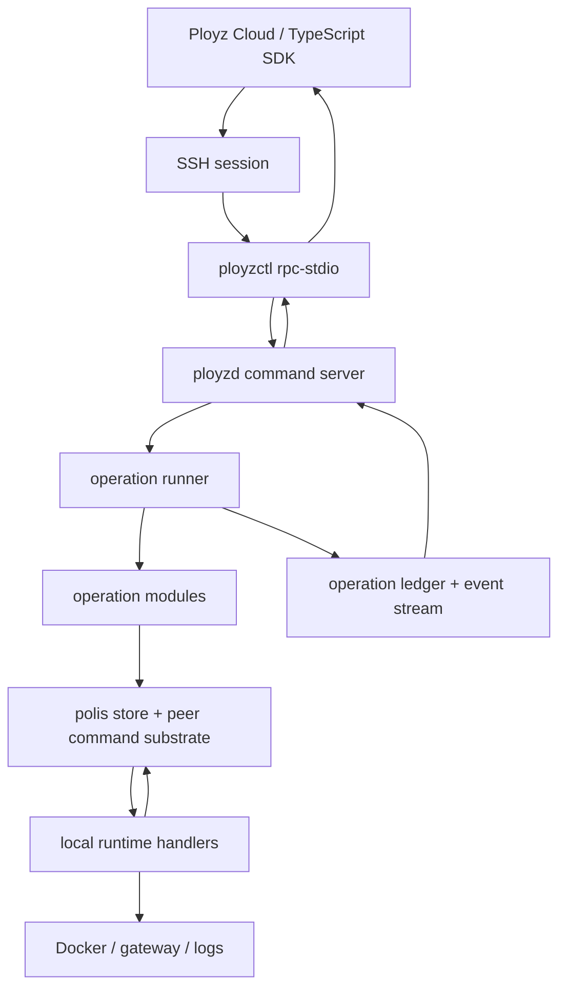
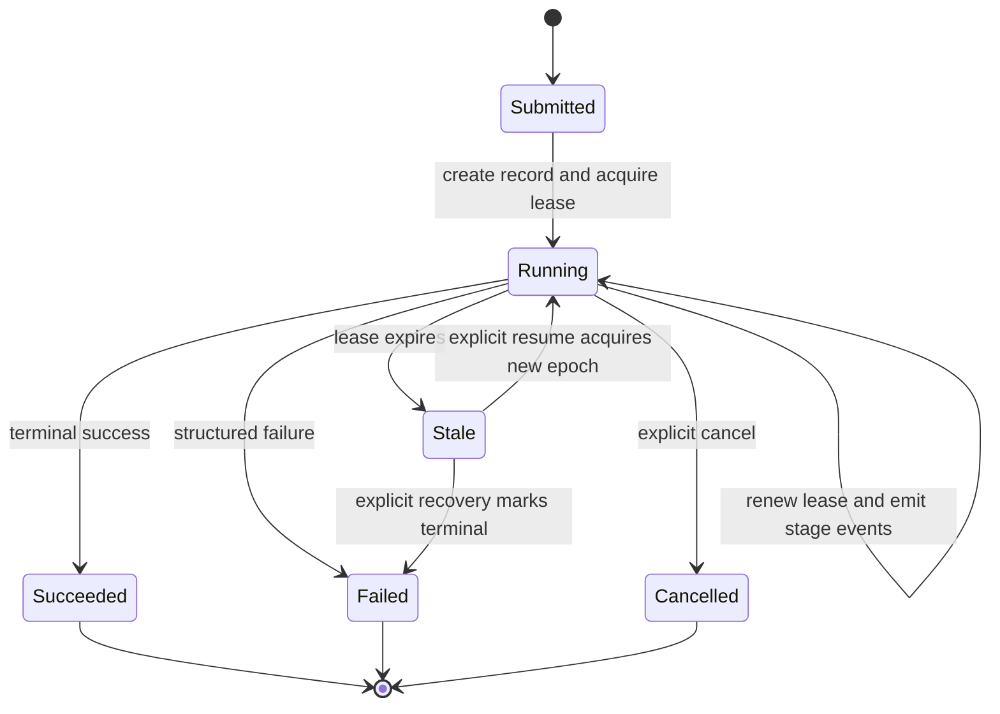
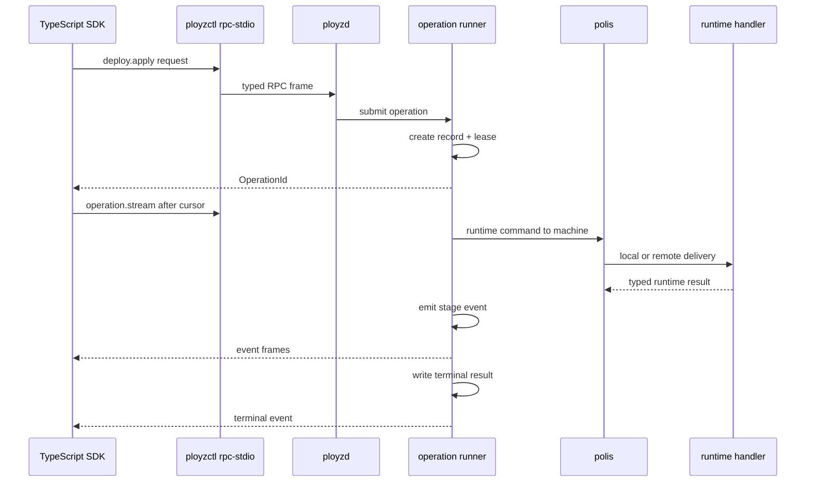

# feat: Build Cloud MVP Operation Spine

## Summary

Build the smallest Rust-side core that lets Ployz Cloud submit infrastructure primitives, observe resumable progress, and rely on Ployz rather than TypeScript for operation truth. The MVP uses SSH stdio as the external transport, equal-node `ployzd` instances as command coordinators, durable operation records with advisory leases, `polis` for substrate primitives and peer command delivery, and local runtime handlers for machine work.

This plan intentionally recuts the cloud-backwards roadmap into a narrower first state. It does not try to ship every roadmap milestone; it builds the reliability spine that later deploy, install, add-machine, drain, clone, and routing primitives can share.

---

## Problem Frame

The existing roadmap correctly names the cloud seam and missing Rust surfaces, but its milestone sequence still risks pulling too many subsystems into the first cloud-oriented build: external iroh transport, WireGuard overlay maturity, HTTPS, ZFS, clone optimization, drain/remove, preview/cancel, installer ownership, and TypeScript contract packaging. That breadth works as a strategic map but not as a simple implementation starting point.

The codebase is currently much earlier than the roadmap's target. `crates/ployzd/src/main.rs` is a stub, `DaemonRuntime` starts substrate state but exposes no command server, `OperationId` is only an identity newtype, `polis` peer RPC currently proves preflight but does not deliver product runtime commands, and `crates/ployz/src/deploy/mod.rs` is a single-route HTTPS trait-based engine rather than the multi-service cloud manifest shape.

The MVP should make the next decisions boring:

- TypeScript submits a primitive and waits on an operation handle.
- Rust owns planning, sequencing, failure meaning, operation state, and event emission.
- Every node is equal; a node coordinates only because cloud or a user contacted it.
- Runtime work is local and policy-free.
- `polis` makes distributed work pleasant without becoming product orchestration.

---

## Requirements

**External cloud contract**

- R1. Cloud can connect to any reachable node over SSH and speak one line-oriented, typed `rpc-stdio` protocol.
- R2. Every mutating primitive returns an `OperationId` quickly, then exposes status and resumable event streaming by cursor.
- R3. Rust owns the request, response, event, status, capability, and error contract; generated TypeScript definitions are derived from Rust types.
- R4. The external API is primitive-shaped, not runtime-shaped: cloud calls operations such as deploy apply, machine add, operation status, and operation stream.

**Operation lifecycle**

- R5. Each operation is implemented as a self-contained state machine with one input, one owner for the active run, explicit stages, and one terminal result.
- R6. Operation records separate terminal status from liveness. A running operation with an expired lease is stale or abandoned, not silently failed.
- R7. The active coordinator renews an advisory operation lease and checks it before durable checkpoints or irreversible commits.
- R8. Operation events are durable, ordered, resumable, and safe for cloud UI/workflow history without leaking secrets.
- R9. Failures are structured by what the caller can do next: retry, wait, repair, cancel, or inspect.

**Equal-node coordination**

- R10. Every node runs one `ployzd` process with the same command surface; there are no dedicated coordinator daemons or durable coordinator roles.
- R11. A newer node may coordinate newer operations if target machines advertise the required runtime capabilities.
- R12. Local and remote machine work goes through the same command path. Orchestration code addresses machine identities; `polis` decides local loopback vs peer transport.

**Runtime and first primitives**

- R13. Runtime handlers execute only local machine actions: capability report, container start/stop/inspect, readiness probe, logs, and minimal gateway config application.
- R14. Runtime handlers do not decide placement, deploy semantics, branch semantics, rollback policy, or route ownership.
- R15. The first deploy primitive accepts the cloud-oriented manifest shape enough to deploy image-backed services sequentially under one namespace with readiness-gated commit.
- R16. The first machine primitive supports the cloud bootstrap path enough to install/check a node over SSH, register/join it, and report progress through the operation stream.

**Scope control**

- R17. The MVP does not require external iroh cloud transport. SSH stdio is the external cloud transport until the operation protocol proves itself.
- R18. The MVP does not require WireGuard NAT traversal, ZFS clone, cross-machine volume move, durable namespace lineage, HTTP API, or rich phased preview/cancel.
- R19. Cloud/Inngest composes Ployz primitives and stores product workflow history; it does not poll every server for runtime truth or orchestrate low-level machine commands.

---

## High-Level Technical Design

### Component Shape



The external protocol and the local daemon protocol should share the same request/response/event types. `ployzctl rpc-stdio` is a transport bridge, not an orchestration layer.

### Operation Lifecycle



Lease expiry does not rewrite operation truth. It gives readers and recovery code a concrete answer: the previous coordinator is no longer known to be driving the operation.

### Command Flow



The coordinator does not special-case itself. It sends runtime commands to machine identities; `polis` hides whether the target is the same process, same host, or a peer.

---

## Key Technical Decisions

- KTD1. **SSH stdio first:** The cloud MVP uses SSH stdio because it is the bootstrap and recovery path already implied by the roadmap. External iroh transport can reuse the same frames later, but it should not block the first reliable cloud loop.

- KTD2. **One daemon, equal nodes:** Every machine runs one `ployzd` process. Coordinator behavior is an operation role held for the duration of one command, not a special process, election, or durable node class.

- KTD3. **Operation records before feature breadth:** The operation ledger, event stream, and lease model land before deploy and machine-add primitives. Without them, cloud cannot distinguish active progress, abandoned work, terminal failures, and resumable status.

- KTD4. **Lease is progress ownership, not the resource lock:** The operation lease says who is currently driving one operation and whether that driver is still fresh. Resource locks such as a namespace deploy lock remain separate when a primitive needs mutual exclusion.

- KTD5. **Polis is a substrate command toolkit:** `polis` should add peer command delivery, deadlines, target resolution, path/contact primitives, store queries, subscriptions, and typed substrate failures. It must not add product APIs such as deploy, clone, route, capacity, or machine-join policy.

- KTD6. **Runtime commands are local and policy-free:** Runtime command handlers start containers, stop containers, inspect, stream logs, apply gateway config, and report capabilities. Product sequencing lives in operation modules.

- KTD7. **Generated contract, handwritten ergonomics:** Rust owns protocol schemas and generated TypeScript types. The eventual TypeScript SDK handwrites ergonomic `OperationHandle` behavior over those generated types.

- KTD8. **First deploy is sequential and explicit:** The first deploy operation accepts cloud's multi-service manifest shape but may execute services sequentially. That avoids a cloud-incompatible single-service slice without introducing a workflow engine.

---

## Output Structure

Expected new and expanded Rust-side structure:

```text
crates/
  ployz-api/
    src/
      lib.rs
      rpc.rs
      status.rs
      operation.rs
      deploy.rs
      machine.rs
      runtime.rs
    tests/
      schema.rs
  ployzctl/
    src/
      main.rs
      rpc_stdio.rs
      status.rs
  ployz/
    src/
      operation/
        event.rs
        lease.rs
        ledger.rs
        runner.rs
      adapters/polis/
        operation.rs
  polis/
    src/
      commands.rs
      peers/
        command.rs
  ployzd/
    src/
      control.rs
      commands.rs
      operations/
      runtime/
      status.rs
```

The tree is the intended shape, not a hard mandate. Implementation may collapse files where a smaller module is clearer.

---

## Implementation Units

### U1. Rust-Owned Protocol Contract

- **Goal:** Add a protocol crate that owns external request, response, event, status, capability, and error types.
- **Requirements:** R1, R2, R3, R4, R9
- **Dependencies:** None
- **Files:**
  - `Cargo.toml`
  - `crates/ployz-api/Cargo.toml`
  - `crates/ployz-api/src/lib.rs`
  - `crates/ployz-api/src/rpc.rs`
  - `crates/ployz-api/src/status.rs`
  - `crates/ployz-api/src/operation.rs`
  - `crates/ployz-api/src/deploy.rs`
  - `crates/ployz-api/src/machine.rs`
  - `crates/ployz-api/src/runtime.rs`
  - `crates/ployz-api/tests/schema.rs`
- **Approach:** Define the wire-level DTOs separately from product orchestration types. Keep method names primitive-shaped, with operation lifecycle methods separated from deploy and machine commands. Add schema generation in this crate, but avoid forcing every internal product enum to be wire-compatible on day one.
- **Patterns to follow:** Existing typed scalar discipline in `crates/ployz/src/operation/identity.rs`; failure enums in `crates/ployz/src/error.rs`.
- **Test scenarios:**
  - Happy path: serialize and deserialize a `status` request/response and preserve method, id, and payload.
  - Happy path: serialize and deserialize a `deploy.apply` response that returns only an operation handle.
  - Edge case: reject malformed or unknown request envelopes without deserializing into public product commands.
  - Error path: encode a structured unsupported-method error with a stable code and no human-string parsing requirement.
  - Contract: generated schema includes operation events, operation terminal result, and status/capability payloads.
- **Verification:** The crate compiles independently, schema tests pass, and no product orchestration module depends on the protocol crate for internal convenience.

### U2. Operation Ledger, Events, And Advisory Lease

- **Goal:** Turn `OperationId` from a bare identifier into a durable operation lifecycle with records, events, terminal state, and progress ownership.
- **Requirements:** R2, R5, R6, R7, R8, R9
- **Dependencies:** U1
- **Files:**
  - `crates/ployz/src/operation/mod.rs`
  - `crates/ployz/src/operation/event.rs`
  - `crates/ployz/src/operation/lease.rs`
  - `crates/ployz/src/operation/ledger.rs`
  - `crates/ployz/src/adapters/polis/mod.rs`
  - `crates/ployz/src/adapters/polis/operation.rs`
  - `crates/ployz/src/composition.rs`
  - `crates/ployz/src/error.rs`
  - `crates/ployz/src/operation/tests.rs` or inline operation tests
- **Approach:** Model terminal state and liveness as separate enum-shaped data. The lease records holder, epoch, renewed time, and expiry. Ledger writes append ordered events and terminal outcomes. Lease expiry is observable but does not automatically mark the operation failed.
- **Technical design:** Directional state shape:

  ```text
  OperationView
    identity
    kind
    status: pending | running | succeeded | failed | cancelled
    liveness: held | expired | released
    current_stage
    terminal
  ```

- **Patterns to follow:** `MutationContext` identity and authorization flow in `crates/ployz/src/operation/context.rs`; Polis adapter layout under `crates/ployz/src/adapters/polis/`.
- **Test scenarios:**
  - Happy path: creating an operation writes a running record, first event, and held lease.
  - Happy path: renewing the lease extends expiry only for the current holder and epoch.
  - Edge case: a stale holder cannot write a checkpoint after losing the lease.
  - Edge case: lease expiry renders the operation stale while preserving `running` terminal status.
  - Error path: terminal success/failure writes are idempotent for the same operation and reject conflicting terminal outcomes.
  - Integration: a Polis-backed ledger can list events after a cursor and resume without duplicating earlier events.
- **Verification:** Operation tests prove status/liveness separation, lease lost behavior, and event cursor behavior.

### U3. Self-Contained Operation Runner

- **Goal:** Add a `ployzd` operation runner that wraps each primitive in the same submit, lease, stage, event, terminal lifecycle.
- **Requirements:** R2, R5, R6, R7, R8, R9, R10
- **Dependencies:** U1, U2
- **Files:**
  - `crates/ployzd/src/operations/mod.rs`
  - `crates/ployzd/src/operations/runner.rs`
  - `crates/ployzd/src/operations/registry.rs`
  - `crates/ployzd/src/commands.rs`
  - `crates/ployzd/src/daemon.rs`
  - `crates/ployzd/src/substrate.rs`
  - `crates/ployzd/src/tests.rs`
- **Approach:** Operation modules implement a common runner-facing contract but keep their stage enums and failure enums specific. The runner creates the record, renews the lease on a bounded cadence, emits stage events, checks lease freshness before checkpoints, and writes a terminal result.
- **Patterns to follow:** `DaemonRuntime` lifecycle ownership in `crates/ployzd/src/daemon.rs`; explicit startup report style in `crates/ployzd/src/report.rs`.
- **Test scenarios:**
  - Happy path: a fake operation emits stage events and succeeds with a terminal result.
  - Error path: a fake operation failure writes a structured failed terminal event.
  - Error path: if lease renewal fails repeatedly, the foreground operation stops with lease-lost failure before the next checkpoint.
  - Edge case: daemon shutdown stops renewal and leaves the operation visible as running until its lease expires.
  - Integration: operation status and event listing read through the same ledger used by the runner.
- **Verification:** The runner has no deploy-specific logic and can run at least two fake operation kinds in tests.

### U4. Daemon Control Server And `rpc-stdio`

- **Goal:** Make `ployzd` a real command daemon and add `ployzctl rpc-stdio` as the SSH-facing bridge.
- **Requirements:** R1, R2, R3, R4, R10
- **Dependencies:** U1, U2, U3
- **Files:**
  - `Cargo.toml`
  - `crates/ployzd/Cargo.toml`
  - `crates/ployzd/src/main.rs`
  - `crates/ployzd/src/control.rs`
  - `crates/ployzd/src/commands.rs`
  - `crates/ployzd/src/status.rs`
  - `crates/ployzd/src/tests.rs`
  - `crates/ployzctl/Cargo.toml`
  - `crates/ployzctl/src/main.rs`
  - `crates/ployzctl/src/rpc_stdio.rs`
  - `crates/ployzctl/src/status.rs`
  - `crates/ployzctl/tests/rpc_stdio.rs`
- **Approach:** `ployzd` starts substrate and binds a local control socket. `ployzctl rpc-stdio` reads JSON lines, forwards frames to the local daemon, and writes response/event frames. `ployzctl` does not own orchestration decisions.
- **Patterns to follow:** `DaemonSubstrate::start` in `crates/ployzd/src/substrate.rs`; direct command shape from `docs/plans/2026-05-24-002-feat-ployz-1-0-cli-shape-and-workflows-plan.md`.
- **Test scenarios:**
  - Happy path: `status` through control socket returns startup report, endpoint id, and capability lists.
  - Happy path: `rpc-stdio` forwards one request and prints one response frame.
  - Edge case: malformed JSON line returns a structured protocol error and keeps the session usable for the next line.
  - Error path: unknown method returns the stable unsupported-method code.
  - Integration: a submitted fake operation returns an `OperationId`, and event stream frames can be read through stdio.
- **Verification:** `ployzd` main no longer exits as a stub, and `ployzctl rpc-stdio` works as the external SSH command surface.

### U5. Status, Capabilities, And Contact Snapshot

- **Goal:** Let cloud and operators discover whether the contacted node can coordinate a command and what target runtimes can execute.
- **Requirements:** R3, R10, R11, R12, R13, R19
- **Dependencies:** U1, U2, U4
- **Files:**
  - `crates/ployz-api/src/status.rs`
  - `crates/ployz-api/src/runtime.rs`
  - `crates/ployzd/src/status.rs`
  - `crates/ployzd/src/commands.rs`
  - `crates/ployz/src/machine.rs`
  - `crates/ployz/src/adapters/polis/machine_membership.rs`
  - `crates/ployzd/src/tests.rs`
- **Approach:** Expose coordinator capabilities and runtime capabilities as two explicit sets. The contacted node reports its own daemon version, endpoint identity, active island/network, and local runtime capabilities. A cluster contact snapshot can remain minimal in MVP: machine ids, endpoint ids, advertised capabilities, and lifecycle.
- **Patterns to follow:** Existing membership row mapping in `crates/polis/src/membership/model.rs`; product-to-Polis adapter boundary in `crates/ployz/src/composition.rs`.
- **Test scenarios:**
  - Happy path: status returns distinct coordinator and runtime capabilities.
  - Happy path: a target machine with missing runtime capability causes preflight failure before mutation.
  - Edge case: stale or missing membership rows produce freshness/availability errors, not default empty capability success.
  - Integration: status over `rpc-stdio` and status over local control socket produce the same payload shape.
- **Verification:** Cloud can make one status call and decide whether the contacted node can coordinate MVP operations.

### U6. Polis Peer Command Substrate

- **Goal:** Extend `polis` from peer preflight into a product-neutral command delivery substrate that Ployz can use for runtime commands.
- **Requirements:** R11, R12, R13, R14
- **Dependencies:** U1, U5
- **Files:**
  - `crates/polis/src/lib.rs`
  - `crates/polis/src/commands.rs`
  - `crates/polis/src/peers.rs`
  - `crates/polis/src/peers/command.rs`
  - `crates/polis/src/peers/rpc.rs`
  - `crates/polis/src/peers/runtime.rs`
  - `crates/polis/src/peers/tests.rs` or inline peer tests
  - `crates/ployz/src/runtime/mod.rs`
  - `crates/ployz/src/composition.rs`
- **Approach:** Polis moves typed envelopes with target identity, deadline, correlation id, and substrate failure classification. Ployz owns the runtime command payloads. Add a local-target path behind the same client interface so orchestration code does not branch on local vs remote.
- **Technical design:** Directional dispatch shape:

  ```text
  RuntimeCommandClient.call(machine_id, command, deadline)
    -> polis target resolver
    -> local handler or peer RPC
    -> typed runtime response
  ```

- **Patterns to follow:** Existing `PeerRpcProbe` and `PeerRuntime` in `crates/polis/src/peers/rpc.rs` and `crates/polis/src/peers/runtime.rs`; product-neutral guardrails in `crates/polis/src/lib.rs`.
- **Test scenarios:**
  - Happy path: command sent to local machine reaches local handler through the same client used for remote targets.
  - Happy path: command sent to remote test peer round-trips over iroh RPC with deadline enforcement.
  - Edge case: target identity mismatch is rejected before command execution.
  - Error path: peer timeout maps to typed substrate failure without product error parsing.
  - Boundary: `polis` command module contains no deploy, route, volume, namespace, or machine-join product types.
- **Verification:** Ployz operation tests can use one runtime command client for both local fake handlers and peer fake handlers.

### U7. Runtime Capability Protocol And Minimal Local Executor

- **Goal:** Add the first policy-free runtime handlers needed by deploy and machine operations.
- **Requirements:** R11, R12, R13, R14, R15
- **Dependencies:** U5, U6
- **Files:**
  - `crates/ployz/src/runtime/mod.rs`
  - `crates/ployzd/src/runtime/mod.rs`
  - `crates/ployzd/src/runtime/memory.rs`
  - `crates/ployzd/src/runtime/docker.rs`
  - `crates/ployzd/src/runtime/gateway.rs`
  - `crates/ployzd/src/daemon.rs`
  - `crates/ployzd/src/tests.rs`
  - `crates/ployz-e2e/src/scenarios/runtime_command.rs`
- **Approach:** Start with memory/fake runtime coverage and a narrow Docker-backed implementation. Runtime command outputs include enough identity and observation to let operation modules verify outcomes, but they do not write product policy decisions.
- **Patterns to follow:** Current `RuntimePort` in `crates/ployz/src/runtime/mod.rs`; deploy runtime verification in `crates/ployz/src/deploy/mod.rs`.
- **Test scenarios:**
  - Happy path: runtime capabilities include start, stop, inspect, readiness probe, logs, and minimal gateway apply for the configured backend.
  - Happy path: start container returns runtime identity and can be inspected by the same handler.
  - Edge case: readiness timeout returns a typed runtime timeout and does not mark the operation terminal by itself.
  - Error path: backend failure is classified separately from peer unavailable and unsupported capability.
  - Integration: daemon restart can adopt or at least inspect an already-started Ployz-owned runtime instance before claiming it missing.
- **Verification:** Runtime handlers can be exercised without deploy logic, and deploy logic can use them without knowing backend-specific details.

### U8. Deploy Apply MVP Operation

- **Goal:** Implement the first cloud-facing `deploy.apply` primitive over the operation runner and runtime command substrate.
- **Requirements:** R2, R4, R5, R7, R8, R9, R11, R12, R15, R19
- **Dependencies:** U1, U2, U3, U5, U6, U7
- **Files:**
  - `crates/ployz-api/src/deploy.rs`
  - `crates/ployz/src/deploy/mod.rs`
  - `crates/ployz/src/deploy/manifest.rs`
  - `crates/ployz/src/deploy/operation.rs`
  - `crates/ployz/src/deploy/tests.rs` or inline deploy tests
  - `crates/ployzd/src/operations/deploy_apply.rs`
  - `crates/ployzd/src/commands.rs`
  - `crates/ployz-e2e/src/scenarios/deploy_fixture.rs`
  - `crates/ployz-e2e/src/scenarios/cloud_mvp_deploy.rs`
- **Approach:** Replace the single-route-only external shape with a cloud-oriented manifest input, while keeping execution deliberately sequential. The operation validates capabilities, records planning/preflight stages, starts candidate runtime instances, probes readiness, applies minimal routing/gateway config, writes terminal success/failure, and emits events throughout.
- **Execution note:** Implement the operation with domain tests first. The test should make the stage order and terminal failure behavior obvious before introducing a real Docker backend.
- **Patterns to follow:** Existing deploy plan diff behavior in `crates/ployz/src/deploy/mod.rs`; roadmap contract in `docs/architecture/ployz-cloud-backwards-roadmap.md`.
- **Test scenarios:**
  - Happy path: a single service manifest starts one runtime instance, passes readiness, applies route config, and succeeds.
  - Happy path: a multi-service manifest executes services sequentially and emits per-service stage events.
  - Edge case: target runtime missing a required capability fails before container start.
  - Edge case: readiness failure leaves operation failed with target/service context and no successful route commit event.
  - Error path: lease lost before route commit stops the operation and records lease-lost failure.
  - Integration: event stream resumes after a cursor and returns the terminal deploy event without replaying prior events.
- **Verification:** Cloud can submit a deploy through `rpc-stdio`, receive an operation id, stream events, and observe a terminal result driven by Rust operation code.

### U9. Machine Install/Add MVP Operation

- **Goal:** Implement the smallest machine bootstrap/add primitive that gives cloud a reliable server onboarding path without turning TypeScript into an orchestrator.
- **Requirements:** R2, R4, R5, R7, R8, R9, R10, R11, R16, R19
- **Dependencies:** U1, U2, U3, U4, U5, U6
- **Files:**
  - `crates/ployz-api/src/machine.rs`
  - `crates/ployz/src/machine.rs`
  - `crates/ployz/src/adapters/polis/machine_membership.rs`
  - `crates/ployzd/src/operations/machine_add.rs`
  - `crates/ployzd/src/commands.rs`
  - `crates/ployzctl/src/status.rs`
  - `crates/ployz-e2e/src/scenarios/machine_add.rs`
  - `crates/ployz-e2e/src/scenarios/cloud_mvp_machine_add.rs`
- **Approach:** Keep install/check and membership join as explicit stages in one operation surface. The operation can use SSH bootstrap for the target, then verify daemon status/capabilities, write or confirm membership through the existing product membership service, and expose interrupted join state through operation events.
- **Patterns to follow:** `MachineMembershipService` in `crates/ployz/src/machine.rs`; machine add e2e scenarios in `crates/ployz-e2e/src/scenarios/machine_add.rs`.
- **Test scenarios:**
  - Happy path: adding a target with an existing compatible daemon records install/check, join, and ready stages.
  - Happy path: retrying the same idempotency key returns the existing operation/result rather than creating a second join.
  - Edge case: target daemon installed but missing required runtime capability fails before durable membership mutation.
  - Error path: interrupted join is visible in operation status with last stage and target machine context.
  - Integration: two-node membership remains idempotent and status reports both machines after add.
- **Verification:** Cloud can use one primitive to drive onboarding and observe exactly where install/add failed.

### U10. Contract Export And TypeScript SDK Handoff Surface

- **Goal:** Produce Rust-generated artifacts that let TypeScript remain a thin ergonomic client.
- **Requirements:** R1, R2, R3, R4, R8, R19
- **Dependencies:** U1, U4, U8, U9
- **Files:**
  - `crates/ployz-api/src/lib.rs`
  - `crates/ployz-api/tests/schema.rs`
  - `packages/ployz-protocol/README.md` or `npm/ployz-protocol/README.md`
  - `docs/cloud-mvp-protocol.md`
  - `docs/architecture/ployz-cloud-backwards-roadmap.md`
- **Approach:** Add a generated protocol artifact and minimal documentation for the SDK shape: connect, submit primitive, stream events, wait for terminal result, reconnect by cursor. The TypeScript SDK implementation can live outside this Rust plan, but the Rust side must make the contract easy to consume.
- **Patterns to follow:** Existing roadmap's generated contract ownership requirement in `docs/architecture/ployz-cloud-backwards-roadmap.md`; current workspace crate layout.
- **Test scenarios:**
  - Contract: schema export includes all MVP request/response/event types and rejects accidental removal of stable fields.
  - Contract: operation events contain cursor, stage, status/liveness context, and target context without exposing secrets.
  - Documentation: examples show TypeScript submitting an operation and waiting on events without computing runtime decisions.
- **Verification:** A TypeScript implementer can build an `OperationHandle` SDK from generated types and documented frame behavior without reverse-engineering Rust internals.

---

## Scope Boundaries

### In Scope

- SSH stdio external transport for MVP cloud control.
- Local daemon command server.
- Operation ledger, event stream, terminal state, and advisory lease.
- Runtime capability negotiation.
- Equal-node, no-special-role coordination.
- Product-neutral peer command delivery in `polis`.
- Minimal local runtime handlers needed for first deploy and machine-add operations.
- First deploy and machine-add primitives as proof of the operation spine.
- Rust-generated protocol artifacts for future TypeScript SDK ergonomics.

### Deferred to Follow-Up Work

- External iroh transport for cloud connections.
- HTTP/SSE/WebSocket API.
- WireGuard NAT traversal and endpoint optimization using iroh path hints.
- Full WireGuard controller maturity beyond what first runtime/deploy tests require.
- Real ACME HTTP-01, public HTTPS, and certificate lifecycle.
- ZFS clone, fork-volume, snapshot restore, cross-machine volume move, and durable namespace lineage.
- Rich deploy preview, phase advance, cancel, resume, and repair commands beyond the operation lifecycle hooks needed now.
- Machine drain/remove.
- Full TypeScript SDK implementation; this plan prepares the Rust contract and handoff surface.

### Outside This MVP's Identity

- TypeScript orchestrating low-level runtime commands.
- Cloud-wide periodic polling as runtime truth.
- A dedicated coordinator daemon, elected leader, or durable master node.
- `polis` product APIs for deploy, route, machine join, clone, or capacity policy.
- Hidden reconcilers that rewrite cluster truth in the background.

---

## Acceptance Examples

- AE1. **Stdio submit and stream:** Given cloud SSHs to a node and sends `deploy.apply`, when the request validates, then the response returns an `OperationId` and subsequent stream frames include ordered stage events and a terminal event.

- AE2. **Coordinator crash visibility:** Given a deploy operation is running and the contacted daemon stops renewing its lease, when cloud queries operation status after expiry, then the operation remains non-terminal but liveness reports the expired holder and last stage.

- AE3. **Stale coordinator cannot commit:** Given a coordinator loses its operation lease before route commit, when it attempts the next checkpoint, then the operation stops with structured lease-lost failure and does not commit stale routing state.

- AE4. **Equal-node local target:** Given the contacted node is also the deploy target, when deploy starts a local runtime instance, then the operation uses the same runtime command client path as it would for a remote target.

- AE5. **Capability preflight:** Given a target runtime lacks a required deploy capability, when deploy preflight runs, then the operation fails before mutation and reports the missing capability with target context.

---

## System-Wide Impact

- **External API:** Adds the first stable RPC frame contract and generated schema surface. This becomes the root of the cloud SDK contract.
- **Daemon lifecycle:** Moves `ployzd` from substrate-only startup into a real command-serving process while preserving disposable-daemon rules.
- **Distributed substrate:** Expands `polis` peer RPC from preflight/probe into command delivery without letting product semantics enter `polis`.
- **Product modules:** Pushes deploy and machine operations toward self-contained operation state machines instead of adding feature branches to `DaemonState`.
- **Cloud workflow:** Lets Inngest compose primitives without owning runtime sequencing or server polling.

---

## Risks And Mitigations

- **Risk: operation ledger turns into a generic workflow engine.** Mitigation: operation modules stay small and concrete; the runner owns lifecycle mechanics only, not operation-specific branching.
- **Risk: runtime commands become too product-shaped.** Mitigation: reject runtime commands named around deploy, branch, route policy, or machine join semantics. Runtime commands describe local machine actions.
- **Risk: `polis` accumulates Ployz product concepts.** Mitigation: keep command payload ownership in Ployz and add tests that prevent product modules from re-entering `polis`.
- **Risk: schema/type generation distracts from the core.** Mitigation: generate only MVP protocol types first and add schema stability tests; defer package publishing mechanics if needed.
- **Risk: first deploy scope expands into full HTTPS/ZFS/clone.** Mitigation: gate the first deploy by operation/event correctness and runtime sequencing; route HTTPS/ZFS/clone to follow-up plans.
- **Risk: lease semantics are mistaken for deploy locks.** Mitigation: document and test lease as active-driver freshness only; introduce resource locks separately when a primitive needs mutual exclusion.

---

## Documentation And Operational Notes

- Update `docs/architecture/ployz-cloud-backwards-roadmap.md` after implementation planning is accepted so the roadmap reflects the narrower MVP spine before heavy substrate milestones.
- Add `docs/cloud-mvp-protocol.md` as the operator/cloud contract explainer: SSH stdio frames, operation lifecycle, event cursor, status/liveness split, and TypeScript SDK expectations.
- Keep `VISION.md` unchanged unless the MVP split reveals a product-direction change. The current vision already supports explicit commands and equal-node operation.
- Do not document cloud polling or background reconciliation as a supported model.

---

## Sources And Research

- `VISION.md` establishes explicit command-shaped primitives, no hidden reconcilers, cloud as a consumer of core primitives, and the `polis` vs `ployz` boundary.
- `docs/architecture/ployz-cloud-backwards-roadmap.md` identifies the missing cloud seam: no `ployzctl`, no runnable daemon command surface, no durable operation record, no real runtime backend, no generated contract, and no compatible deploy manifest.
- `docs/architecture/ployz-1-0-roadmap.md` and its May 24 plans provide the older 1.0 surface and useful substrate/deploy context, but this plan narrows their scope for MVP reliability.
- `crates/ployzd/src/daemon.rs` and `crates/ployzd/src/substrate.rs` already provide substrate startup/adoption logic to preserve.
- `crates/ployzd/src/main.rs` is currently a command stub and is the first visible daemon gap.
- `crates/polis/src/lib.rs` states the product-neutral substrate rule that this plan keeps.
- `crates/polis/src/peers/rpc.rs` has the current peer preflight RPC shape that U6 extends into command delivery.
- `crates/ployz/src/operation/context.rs` and `crates/ployz/src/operation/identity.rs` provide existing operation identity and mutation context types to build on.
- `crates/ployz/src/deploy/mod.rs` has useful deploy diff/verification shape but is not yet the cloud manifest or operation-ledger model.
- `docs/solutions/architecture-patterns/operator-perspective-commands-with-corrosion-rows-2026-05-24.md` and `docs/solutions/architecture-patterns/authority-status-separates-truth-from-observation-2026-05-08.md` reinforce the plan's split between command intent, durable status, and live observation.
