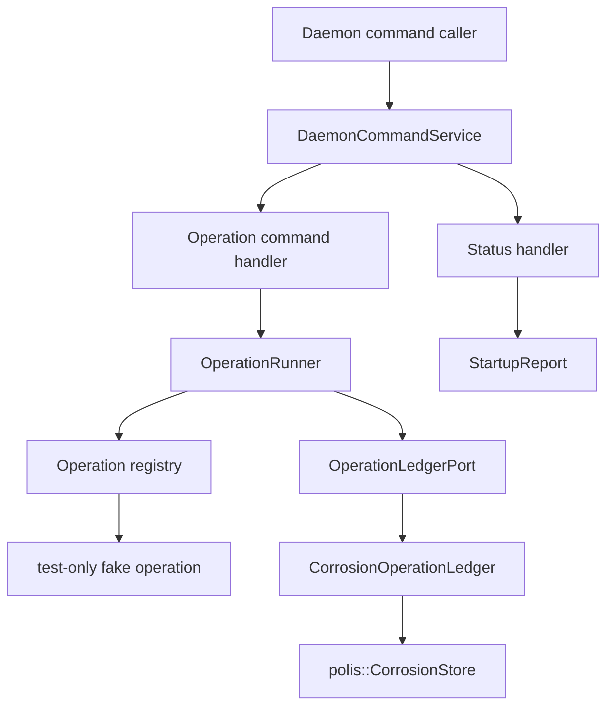
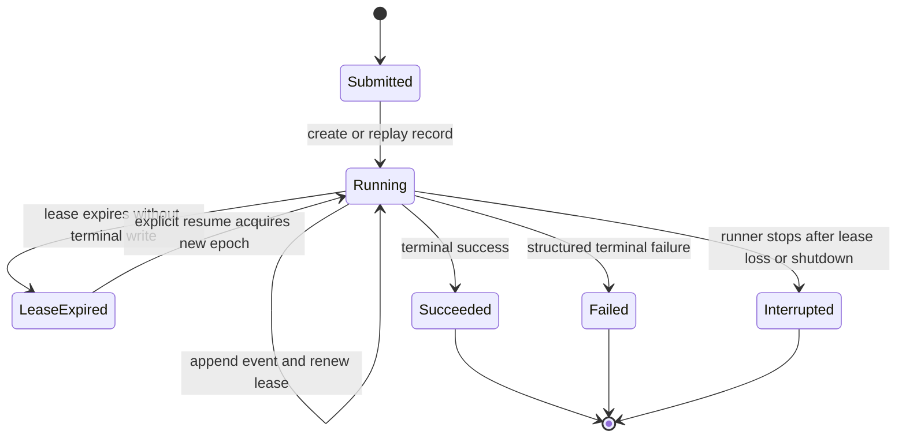
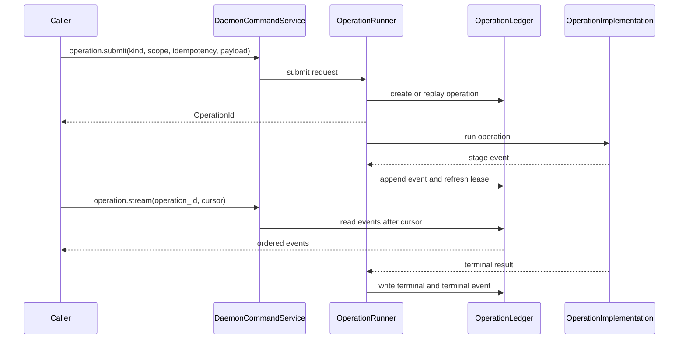

# feat: Add Operation Ledger Command Spine

## Summary

Build the first narrow Rust slice of the cloud MVP spine: durable operation records, ordered operation events, advisory lease freshness, a daemon-owned command service, and a test-only fake operation runner that proves submit/get/stream/terminal behavior. This plan intentionally stops before `ployzctl`, SSH stdio, TypeScript SDK generation, peer RPC command delivery, machine add, deploy apply, Docker, WireGuard, and gateway work.

---

## Problem Frame

The broader cloud MVP plan is directionally right, but it pulls in too many first-build concerns: protocol crates, CLI framing, cloud transport, peer command delivery, local runtime handlers, machine add, deploy apply, and TypeScript handoff. The next implementation step needs a smaller reliability nucleus that makes later primitives obvious instead of forcing every primitive to invent operation status, progress events, lease freshness, and daemon dispatch on its own.

The current code has the right starting points but not the operation spine. `crates/ployz/src/operation/identity.rs` provides `OperationId`, `IdempotencyKey`, `PrincipalId`, and `ScopeId`, but there is no operation record, event stream, lease, terminal result, or cursor model. `crates/polis/src/store.rs` already exposes Corrosion transactions, queries, subscriptions, updates, timeouts, and change ids, so Ployz can build operation storage without adding product-shaped Polis APIs. `crates/ployzd/src/daemon.rs` starts substrate and exposes startup status, but it has no command service, no operation runner, and `crates/ployzd/src/main.rs` is still a failure stub.

This plan makes operation truth the center before any product primitive lands. The result should be boring: a daemon can accept an internal command, submit a self-contained operation, persist progress, renew an advisory lease, stream ordered events, and report a terminal result or visible lease loss.

---

## Requirements

**Operation Ledger**

- R1. Operation records store typed identity, kind, scope, idempotency key, submitting principal, active owner, lifecycle status, current stage, created/updated timestamps, lease metadata, and terminal result metadata.
- R2. Operation lifecycle and liveness are separate facts. Lease expiry never rewrites terminal status; readers see a running operation with stale or expired driver freshness.
- R3. Operation events are append-only, ordered per operation, durable, and readable after a cursor without duplicating prior events.
- R4. Submitting the same operation kind with the same scope and idempotency key returns the existing operation handle when the payload fingerprint matches.
- R5. Submitting the same scope and idempotency key with a different kind or conflicting payload fingerprint fails with a structured operation conflict.
- R6. Terminal status is explicit and immutable. Repeating the same terminal write is safe; conflicting terminal writes are rejected.

**Advisory Lease**

- R7. A lease records owner, epoch, renewed timestamp, and expiry timestamp for the active driver of one operation.
- R8. The runner refreshes the lease on a bounded cadence and treats missed refresh as lease loss before the next durable checkpoint or irreversible commit.
- R9. Lease timing is policy-driven so production defaults can be longer than tests; tests must not wait on production lease durations.
- R10. The operation lease is not a deploy lock, machine lock, namespace lock, or general resource mutex.

**Daemon Command Spine**

- R11. `ployzd` owns a local command service that exposes status, operation submit, operation get, and operation stream commands as typed Rust request/response values.
- R12. `DaemonRuntime` stays a lifecycle owner and router. Feature state lives in operation subsystems, not in `DaemonRuntime`.
- R13. Status reports startup/substrate readiness and command-service readiness without fabricating operation status.
- R14. Operation submit dispatches to a registry of self-contained operation implementations. The registry can be empty in production until real primitives land.
- R15. A test-only fake operation proves the command, runner, ledger, event, lease, and terminal lifecycle without becoming a public production operation kind.

**Scope Control**

- R16. `polis` remains product-neutral: this slice may use store statements, transactions, subscriptions, change ids, and timeouts, but it must not add `deploy`, `machine.add`, runtime, route, clone, or capacity APIs to Polis.
- R17. The daemon startup schema path keeps the existing membership schema and adds operation schema for this slice; domain, ACME, serving, volume, and HTTPS schemas must not become prerequisites for the command spine.
- R18. No CLI, SSH stdio, external JSON frame contract, TypeScript SDK, peer RPC command delivery, Docker runtime command, `machine.add`, or `deploy.apply` behavior is implemented by this plan.

---

## Key Technical Decisions

- KTD1. **Plan the spine before primitives:** This slice proves operation truth and daemon command dispatch with a fake operation only. Real machine and deploy primitives land after the common lifecycle is working.
- KTD2. **Keep operation product state in `ployz`:** Operation records, events, status, liveness, leases, and idempotency semantics live in `crates/ployz/src/operation/`. The Corrosion adapter lives in `crates/ployz/src/adapters/polis/operation.rs`. `polis` supplies only substrate store primitives.
- KTD3. **Use a domain cursor, not a public Corrosion cursor:** Operation streams expose a Ployz event cursor based on operation id and event sequence. The adapter may use `StoreChangeId` internally to wait for new rows, but external operation readers do not depend on Corrosion change-id shape.
- KTD4. **Treat the lease as active-driver freshness:** The lease answers "who is currently believed to be driving this operation?" It does not serialize all mutations for a resource. Future primitives add resource locks only when the primitive proves it needs mutual exclusion.
- KTD5. **Command service first, external transport later:** The first command boundary is a typed in-process daemon service. `ployzctl rpc-stdio`, SSH line framing, local sockets, and TypeScript ergonomics can reuse the command semantics later, but they do not shape this slice.
- KTD6. **The runner owns lifecycle mechanics only:** The runner creates/replays operations, renews leases, appends events, checks lease freshness, and records terminal outcomes. Operation-specific planning and failure meaning stays in each operation implementation.
- KTD7. **Fake operations stay test-only:** Tests can register fake operation implementations to exercise success, failure, lease loss, and streaming. Production builds do not advertise a fake/noop operation capability.
- KTD8. **Schema recut is part of the slice:** Daemon startup should install and verify operation schema without requiring ACME/domain/serving schemas as command-spine prerequisites. Existing deferred product schemas can remain for legacy tests until the broader cull removes them.

---

## High-Level Technical Design

### Component Shape



The command service is a daemon subsystem, not a protocol crate and not a CLI. It can later be wrapped by `rpc-stdio`, a local socket, HTTP, or iroh transport without changing the operation lifecycle semantics.

### Operation Lifecycle



`LeaseExpired` is an observed liveness condition over a non-terminal operation. It is not a hidden failure transition. A runner that loses the lease records a visible interrupted or lease-lost outcome only when it is still allowed to write that terminal state.

### Submit And Stream Flow



---

## Output Structure

Expected new and expanded structure:

```text
crates/ployz/src/operation/
  event.rs
  lease.rs
  ledger.rs
  status.rs

crates/ployz/src/adapters/polis/
  operation.rs

crates/ployzd/src/
  commands.rs
  operations/
    mod.rs
    registry.rs
    runner.rs
```

The file layout is a scope guide. Implementation may collapse very small files when that makes the code simpler, but operation domain types, Corrosion adapter code, daemon command routing, and runner mechanics should remain separate responsibilities.

---

## Implementation Units

### U1. Operation Domain Model

- **Goal:** Define the operation record, kind, status, liveness, stage, terminal result, event, cursor, owner, lease, and conflict types in Ployz.
- **Requirements:** R1, R2, R3, R4, R5, R6, R10
- **Dependencies:** None
- **Files:**
  - `crates/ployz/src/operation/mod.rs`
  - `crates/ployz/src/operation/identity.rs`
  - `crates/ployz/src/operation/event.rs`
  - `crates/ployz/src/operation/lease.rs`
  - `crates/ployz/src/operation/ledger.rs`
  - `crates/ployz/src/operation/status.rs`
  - `crates/ployz/src/error.rs`
  - `crates/ployz/src/operation/tests.rs` or inline operation tests
- **Approach:** Keep existing identity newtypes and add enum-shaped lifecycle data beside them. Model terminal state, liveness, and lease freshness separately. Represent operation kind as an explicit enum or narrow typed value that does not force future product primitives into one sparse option bag. Define an operation ledger trait here, but leave Corrosion SQL to U2.
- **Execution note:** Implement the state transitions test-first; the tests should pin status/liveness separation before storage details arrive.
- **Patterns to follow:** Newtype parsing in `crates/ployz/src/operation/identity.rs`; typed failure style in `crates/ployz/src/error.rs`; no sparse option bags per `AGENTS.md`.
- **Test scenarios:**
  - Happy path: constructing a submitted/running operation preserves operation id, scope, idempotency key, principal, kind, owner, and current stage.
  - Happy path: appending ordered events advances the event cursor monotonically for one operation.
  - Edge case: lease expiry changes computed liveness without changing terminal status.
  - Edge case: a lease owned by a different owner or older epoch cannot authorize a checkpoint.
  - Error path: conflicting idempotency payload fingerprints produce a structured conflict instead of a display-string comparison.
  - Error path: writing a terminal failure after terminal success is rejected as an operation state conflict.
- **Verification:** Operation model tests prove the state machine, terminal immutability, liveness separation, and cursor ordering without requiring Corrosion.

### U2. Corrosion Operation Ledger Adapter

- **Goal:** Persist operation records and events through a Ployz-owned Corrosion adapter over existing Polis store primitives.
- **Requirements:** R1, R2, R3, R4, R5, R6, R7, R16
- **Dependencies:** U1
- **Files:**
  - `crates/ployz/src/adapters/polis/mod.rs`
  - `crates/ployz/src/adapters/polis/operation.rs`
  - `crates/ployz/src/adapters/polis/failure_codecs.rs`
  - `crates/ployz/src/composition.rs`
  - `crates/ployz/src/operation/ledger.rs`
  - `crates/ployz/src/operation/tests.rs` or inline adapter tests
- **Approach:** Add operation and operation-event tables with explicit checks for lifecycle/status values and a composite uniqueness rule for scope, idempotency key, and kind. Use transactions for create/replay, event append, lease refresh, and terminal writes. Keep row decoding in the adapter; product modules consume operation views, not raw rows.
- **Patterns to follow:** Adapter ownership in `crates/ployz/src/adapters/polis/machine_membership.rs`; schema helpers in `crates/polis/src/schema.rs`; timeout/error mapping in existing Ployz Polis adapters.
- **Test scenarios:**
  - Happy path: creating an operation writes one record and an initial event, then reading by id returns the same operation view.
  - Happy path: duplicate submit with matching scope, idempotency key, kind, and payload fingerprint returns the original operation.
  - Happy path: events read after a cursor return only later events and preserve per-operation sequence order.
  - Edge case: duplicate submit with a different payload fingerprint is rejected.
  - Edge case: lease refresh succeeds only for the current owner and epoch.
  - Error path: stale owner terminal write is rejected after lease loss or epoch mismatch.
  - Integration: schema verification detects missing or malformed operation tables.
- **Verification:** Ployz adapter tests run against the existing store test support and prove create/replay, event cursor reads, lease refresh, and terminal immutability.

### U3. Daemon Substrate Schema Recut

- **Goal:** Make operation schema part of daemon startup while avoiding ACME/domain/serving schema prerequisites for the command spine.
- **Requirements:** R11, R13, R17
- **Dependencies:** U2
- **Files:**
  - `crates/ployz/src/composition.rs`
  - `crates/ployzd/src/substrate.rs`
  - `crates/ployzd/src/report.rs`
  - `crates/ployzd/src/tests.rs`
- **Approach:** Keep membership schema on the existing Polis schema-file path and add a narrow Ployz product-schema function for operation tables. Preserve any legacy schema helpers needed by existing product tests, but do not make the daemon command-spine startup fail because deferred ACME/domain/serving schemas are missing.
- **Patterns to follow:** Current `DaemonSubstrate::start` lifecycle and rollback behavior in `crates/ployzd/src/substrate.rs`; cull-list guidance in `docs/architecture/ployz-cloud-mvp-cull-list.md`.
- **Test scenarios:**
  - Happy path: daemon boot creates membership and operation tables and reports schema ready.
  - Edge case: command-spine schema startup does not create ACME/domain/serving tables unless an explicit legacy/test path requests them.
  - Error path: operation schema construction failure marks schema startup failed and rolls back Corrosion as current startup errors do.
  - Integration: restart preserves operation rows written before shutdown.
- **Verification:** Existing daemon substrate tests are updated around operation schema expectations, and startup rollback semantics remain unchanged.

### U4. Operation Runner And Lease Renewal

- **Goal:** Add a daemon operation runner that wraps operation implementations in create/replay, lease renewal, event append, lease checks, and terminal writes.
- **Requirements:** R7, R8, R9, R10, R14, R15
- **Dependencies:** U1, U2, U3
- **Files:**
  - `crates/ployzd/src/operations/mod.rs`
  - `crates/ployzd/src/operations/registry.rs`
  - `crates/ployzd/src/operations/runner.rs`
  - `crates/ployzd/src/daemon.rs`
  - `crates/ployzd/src/tests.rs`
- **Approach:** Define a small runner-facing operation implementation trait. The runner owns lifecycle mechanics and receives an operation registry plus lease policy. Lease policy should be injectable so tests can use short durations or a manual clock without sleeping on production defaults. The runner checks lease freshness before every durable checkpoint and terminal write.
- **Execution note:** Characterize renewal and lease-loss behavior with fake operations before wiring command handlers.
- **Patterns to follow:** `DaemonRuntime` lifecycle ownership in `crates/ployzd/src/daemon.rs`; async timeout discipline in `crates/polis/src/store.rs`; timeout-test lesson in `docs/solutions/performance-issues/machine-add-timeout-tests-2026-05-10.md`.
- **Test scenarios:**
  - Happy path: fake operation emits multiple stage events and succeeds with a terminal result.
  - Happy path: fake operation failure writes a structured failed terminal and terminal event.
  - Edge case: lease renewal extends expiry for the current owner and epoch without changing operation status.
  - Edge case: shutdown stops renewal and leaves a non-terminal operation observable until its lease expires.
  - Error path: forced lease loss stops the fake operation before the next checkpoint and records a visible interrupted or lease-lost result when allowed.
  - Error path: ledger append failure is reported to the submitter/runner and does not get hidden in logs.
- **Verification:** Runner tests prove success, failure, lease refresh, lease loss, and shutdown behavior using test-only operation implementations.

### U5. Daemon Command Service

- **Goal:** Add a typed in-process daemon command service for status, operation submit, operation get, and operation stream.
- **Requirements:** R11, R12, R13, R14, R15
- **Dependencies:** U3, U4
- **Files:**
  - `crates/ployzd/src/commands.rs`
  - `crates/ployzd/src/daemon.rs`
  - `crates/ployzd/src/lib.rs`
  - `crates/ployzd/src/operations/mod.rs`
  - `crates/ployzd/src/tests.rs`
- **Approach:** Add command request/response enums local to `ployzd` for this slice. The command service should dispatch status to startup report data and operation commands to the operation subsystem. It must not become a global feature registry; future machine/deploy commands should enter through operation registry wiring, not by adding feature state to `DaemonRuntime`.
- **Patterns to follow:** Startup report read-only public surface in `crates/ployzd/src/report.rs`; daemon guardrail in `AGENTS.md` that `DaemonState`/runtime stays a router and lifecycle owner.
- **Test scenarios:**
  - Happy path: status command returns substrate readiness and command-service readiness from a started daemon.
  - Happy path: operation submit against a test registry returns an operation id quickly while the fake operation continues through the runner.
  - Happy path: operation get returns status, liveness, stage, owner, and terminal result after completion.
  - Happy path: operation stream from an initial cursor returns all events, and stream from a later cursor returns only later events.
  - Edge case: submit with an unsupported operation kind returns a structured unsupported-kind error without panicking.
  - Error path: get/stream for an unknown operation id returns a structured not-found error.
- **Verification:** Daemon tests can drive operation submit/get/stream through the command service without any CLI or external protocol.

### U6. Test-Only Fake Operation Harness

- **Goal:** Provide a test-only operation implementation that exercises the full command spine without leaking fake commands into production runtime.
- **Requirements:** R14, R15, R18
- **Dependencies:** U4, U5
- **Files:**
  - `crates/ployzd/src/operations/mod.rs`
  - `crates/ployzd/src/operations/registry.rs`
  - `crates/ployzd/src/operations/runner.rs`
  - `crates/ployzd/src/tests.rs`
  - `docs/architecture/ployz-cloud-mvp-cull-list.md`
- **Approach:** Gate fake operation implementations behind `#[cfg(test)]` or a test module so production command capability cannot advertise them. Use the fake operation to test staged success, staged failure, delayed events, lease loss, idempotent replay, and event streaming. Update the cull list only if implementation finds a new fake/test surface that would otherwise leak into user runtime.
- **Patterns to follow:** Recent gating of `FakePeerProbe`, `MutationContext::test_authorized`, and related test-support surfaces; cull-list rule that fake-backed harnesses must not define user runtime behavior.
- **Test scenarios:**
  - Happy path: fake success operation appears in tests only and is unavailable in production command registry construction.
  - Happy path: duplicate fake submit with the same idempotency key replays the existing operation.
  - Edge case: fake delayed stage event can be streamed after a cursor without duplicate earlier events.
  - Error path: fake failure operation records structured failure and terminal event.
  - Boundary: production registry tests prove fake operation kind is not registered outside test configuration.
- **Verification:** The fake harness proves the operation spine end to end while the production command registry remains empty until real primitives are added.

---

## Scope Boundaries

### In Scope

- Operation records, events, cursors, liveness, terminal state, and advisory leases.
- Ployz-owned Corrosion operation adapter over existing Polis store primitives.
- Daemon startup schema recut for membership plus operations.
- Typed in-process daemon command service.
- Operation runner lifecycle mechanics.
- Test-only fake operation registry and runner coverage.

### Deferred to Follow-Up Work

- `ployzctl rpc-stdio`, SSH line framing, local socket transport, HTTP/SSE/WebSocket, and external JSON protocol.
- Rust-generated TypeScript schemas and SDK ergonomics.
- Polis peer command delivery over iroh.
- Runtime capability protocol and local Docker/gateway/log handlers.
- `machine.add`, `deploy.apply`, drain/remove, clone, volume, ACME, public HTTPS, and route commit primitives.
- Full daemon binary UX and installer behavior.

### Outside This Slice's Identity

- TypeScript orchestrating low-level runtime commands.
- Dedicated coordinator daemon, elected leader, or durable master node.
- Product-shaped Polis APIs.
- Hidden reconcilers or background loops that rewrite durable operation truth.
- Fake/noop operations as production capabilities.

---

## Acceptance Examples

- AE1. **Operation submit returns a handle:** Given a started daemon with a test registry, when a caller submits a fake operation with a new idempotency key, then the command returns an `OperationId` before the fake operation has to finish.
- AE2. **Status and liveness stay separate:** Given an operation is running and its lease expires, when a caller gets operation status, then the operation remains non-terminal and reports expired driver freshness.
- AE3. **Cursor stream resumes cleanly:** Given an operation has emitted three events, when a caller streams after the first event cursor, then only the second and third events are returned in order.
- AE4. **Stale owner cannot checkpoint:** Given the runner loses its lease epoch before the next checkpoint, when it tries to append the checkpoint event, then the write is rejected and the operation records visible lease-loss or interruption behavior when permitted.
- AE5. **Fake operation stays out of production:** Given production command registry construction, when operation kinds are listed or matched, then the test fake operation kind is not present.

---

## System-Wide Impact

- **Data lifecycle:** Adds the first durable operation tables that later cloud-visible primitives will share.
- **Daemon architecture:** Moves `ployzd` from substrate-only startup toward command serving while keeping `DaemonRuntime` a lifecycle/router owner.
- **Testing posture:** Creates a true operation-spine test harness without using the fake e2e crate as the product boundary.
- **Cull direction:** Re-centers startup around membership plus operation schema and reduces pressure for ACME/domain/serving/volume code to shape the MVP.

---

## Risks And Mitigations

- **Risk: the operation ledger becomes a workflow engine.** Mitigation: runner owns lifecycle mechanics only; fake operation proves mechanics, not product branching.
- **Risk: lease semantics get mistaken for resource locking.** Mitigation: tests and docs treat lease as active-driver freshness only; resource locks are deferred until real primitives prove need.
- **Risk: command service grows into feature state.** Mitigation: keep command routing thin and put operation behavior behind registry/runner boundaries.
- **Risk: event stream couples to Corrosion internals.** Mitigation: expose Ployz event sequence cursors and keep store change ids adapter-private.
- **Risk: tests become slow around lease expiry.** Mitigation: inject lease policy/clock and use short test deadlines, following the existing timeout-test lesson.
- **Risk: fake operation leaks into production capability.** Mitigation: gate fake operations behind test-only modules and add a boundary test.

---

## Sources And Research

- `VISION.md` establishes explicit command-shaped primitives, no hidden reconcilers, cloud as a consumer of core primitives, and the `polis` versus `ployz` boundary.
- `docs/architecture/ployz-cloud-backwards-roadmap.md` identifies the missing durable operation record, command surface, and cloud seam.
- `docs/architecture/ployz-cloud-mvp-cull-list.md` narrows the next work toward operation truth, daemon command serving, and test-surface cleanup.
- `docs/plans/2026-06-03-001-feat-cloud-mvp-operation-spine-plan.md` is the broader MVP plan that this plan slices down.
- `crates/ployz/src/operation/identity.rs` and `crates/ployz/src/operation/context.rs` provide the existing operation identity and mutation context to build beside.
- `crates/polis/src/store.rs` and `crates/polis/src/schema.rs` provide the store, subscription, timeout, and schema primitives needed without new product APIs in Polis.
- `crates/ployzd/src/daemon.rs`, `crates/ployzd/src/substrate.rs`, and `crates/ployzd/src/report.rs` provide the daemon lifecycle and startup status pattern to preserve.
- `docs/solutions/architecture-patterns/operator-perspective-commands-with-corrosion-rows-2026-05-24.md` supports the split between durable rows and bounded command execution.
- `docs/solutions/architecture-patterns/authority-status-separates-truth-from-observation-2026-05-08.md` supports the status/liveness separation.
- `docs/solutions/performance-issues/machine-add-timeout-tests-2026-05-10.md` supports injectable test wait policy instead of production sleeps.
