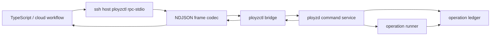

# feat: Add Protocol And RPC Stdio Control Surface

## Summary

Add the smallest public control surface that lets TypeScript or cloud tooling talk to a contacted node without owning orchestration. This slice creates Rust-owned wire DTOs, a line-oriented `rpc-stdio` frame format, a `ployzctl rpc-stdio` bridge, and daemon-side command handling over the existing operation ledger/runner service.

This does not implement deploy apply, machine add, peer runtime command delivery, Docker execution, or the TypeScript SDK. It turns the operation spine from an internal library surface into a typed, resumable external protocol that future primitives can reuse.

## Problem Frame

The previous slice added durable operation records, event streaming, advisory leases, and an in-process `DaemonCommandService`. That is useful Rust structure, but it is still not the cloud MVP surface. `ployzd` remains a stub binary, there is no `ployz-api` crate, there is no `ployzctl` crate, and external callers cannot submit a command or stream operation events through SSH stdio.

The next slice should not jump into deploy or machine-add behavior. Those primitives need a public request/response/event contract first. The protocol should be primitive-shaped and typed, while internal operation modules remain free to use richer domain types that are not forced into wire compatibility too early.

## Requirements

- R1. Add a Rust-owned protocol crate for external request, response, status, operation event batch, operation status, operation submission, and error DTOs.
- R2. Encode protocol frames as newline-delimited JSON with stable frame ids, methods, payloads, and structured errors.
- R3. Support `status`, `operation.submit`, `operation.get`, and `operation.stream` against the command service built in the previous slice.
- R4. Add `ployzctl rpc-stdio` as a transport bridge that reads JSON lines from stdin and writes one response frame or stream frame per output line.
- R5. Keep `ployzctl` free of orchestration decisions. It translates frames and forwards them to the contacted daemon command surface.
- R6. Make malformed JSON and unknown methods visible as structured protocol errors without ending the stdio session.
- R7. Add schema/export tests or snapshot-style contract tests that catch accidental wire-shape drift.
- R8. Preserve status/liveness separation and durable event cursor semantics in the external protocol.

## Key Technical Decisions

- KTD1. **Protocol DTOs are external contracts:** `crates/ployz-api` owns wire DTOs. It may convert to and from internal domain types, but product logic should not import protocol DTOs for internal convenience.
- KTD2. **NDJSON first:** The MVP transport is newline-delimited JSON. It works over SSH stdio, is easy for TypeScript to drive, and is explicit enough for resumable event streams.
- KTD3. **One response shape:** Every input line returns either one response frame or one error frame with the original request id when available. Finite operation streams are response payloads containing a typed event batch.
- KTD4. **No deployment payload yet:** `deploy.apply` and `machine.add` method names are not added in this slice. They should enter the protocol only when their operation modules exist.
- KTD5. **Local control can stay simple:** If a persistent daemon socket is too much for this slice, `ployzctl rpc-stdio` may start or connect to the local command service through the smallest existing daemon runtime path. The important boundary is typed protocol in, daemon command service out.

## High-Level Technical Design



Frame handling should be deliberately boring:

```text
request line
  -> parse envelope
  -> decode method payload
  -> map to daemon command
  -> execute with explicit timeout where external I/O exists
  -> encode response/event/error frame
  -> continue reading next line
```

`operation.stream` can return a finite batch of events after a cursor in this slice. A long-lived follow stream can be added later once subscriptions and peer command delivery are in place.

## Output Structure

Expected new and changed files:

```text
crates/
  ployz-api/
    Cargo.toml
    src/
      lib.rs
      error.rs
      frame.rs
      operation.rs
      status.rs
    tests/
      contract.rs
  ployzctl/
    Cargo.toml
    src/
      main.rs
  ployzd/
    Cargo.toml
    src/
      control.rs
      control/
        protocol.rs
        status.rs
        stdio.rs
      main.rs
      test_support.rs
      tests.rs
```

The tree is directional. Collapse tiny files if that keeps the code clearer, but do not put transport, frame parsing, daemon lifecycle, and operation behavior into one file.

## Implementation Units

### U1. Protocol Crate And Frame DTOs

- **Goal:** Add `crates/ployz-api` with stable external DTOs and frame encoding helpers.
- **Requirements:** R1, R2, R6, R7, R8
- **Dependencies:** Previous operation ledger slice.
- **Files:**
  - `Cargo.toml`
  - `crates/ployz-api/Cargo.toml`
  - `crates/ployz-api/src/lib.rs`
  - `crates/ployz-api/src/error.rs`
  - `crates/ployz-api/src/frame.rs`
  - `crates/ployz-api/src/operation.rs`
  - `crates/ployz-api/src/status.rs`
  - `crates/ployz-api/tests/contract.rs`
- **Approach:** Define typed request and response envelopes with stable method names. Keep operation DTOs close to the existing `ployz::operation` shape, but do conversion explicitly so internal state does not become wire API by accident. Use structured protocol errors with code, message, and optional operation/method context.
- **Patterns to follow:** Operation identity newtypes in `crates/ployz/src/operation/identity.rs`; command request split in `crates/ployzd/src/commands.rs`.
- **Test scenarios:**
  - Serialize and deserialize a `status` request and response without losing request id or method.
  - Serialize and deserialize `operation.submit` with kind, scope, principal, idempotency key, and payload fingerprint.
  - Reject malformed JSON as a structured parse error.
  - Reject unknown methods as a structured unsupported-method error.
  - Contract output includes operation liveness, lifecycle status, event cursor, terminal result, and typed daemon startup phases.
- **Verification:** `cargo test -p ployz-api` passes, and no orchestration module imports protocol DTOs as its internal model.

### U2. Daemon Command Protocol Adapter

- **Goal:** Convert protocol requests into the existing `DaemonCommandRequest` surface and convert daemon responses/errors back into protocol frames.
- **Requirements:** R3, R6, R8
- **Dependencies:** U1.
- **Files:**
  - `crates/ployzd/Cargo.toml`
  - `crates/ployzd/src/control.rs`
  - `crates/ployzd/src/control/protocol.rs`
  - `crates/ployzd/src/control/status.rs`
  - `crates/ployzd/src/tests.rs`
- **Approach:** Keep the adapter thin. The adapter should not know deploy semantics or machine-add semantics. It handles status, submit, get, and finite stream requests by calling `DaemonCommandService`. Unsupported primitive methods should return protocol errors until their operation modules exist.
- **Patterns to follow:** Current `DaemonCommandService::handle` in `crates/ployzd/src/commands.rs`; startup report getters in `crates/ployzd/src/report.rs`.
- **Test scenarios:**
  - `status` request returns command readiness, startup report summary, endpoint id, and operation failure context when present.
  - `operation.submit` returns an operation id for a registered fake operation.
  - `operation.get` returns record status and liveness.
  - `operation.stream` returns events after a cursor without duplicating earlier events.
  - Unknown method returns a protocol error and does not call the command service.
- **Verification:** `cargo test -p ployzd protocol` or equivalent focused tests pass.

### U3. `ployzctl rpc-stdio` Bridge

- **Goal:** Add a CLI bridge suitable for `ssh host ployzctl rpc-stdio`.
- **Requirements:** R2, R4, R5, R6
- **Dependencies:** U1, U2.
- **Files:**
  - `Cargo.toml`
  - `crates/ployzctl/Cargo.toml`
  - `crates/ployzctl/src/main.rs`
  - `crates/ployzd/src/control/stdio.rs`
- **Approach:** Implement a small command parser with `rpc-stdio` only. The bridge reads stdin line by line, passes each line through the frame codec and daemon protocol adapter, writes each output frame to stdout, and keeps reading after per-frame protocol errors. Do not add a broad CLI UX in this slice.
- **Patterns to follow:** CLI command names from `docs/plans/2026-05-24-002-feat-ployz-1-0-cli-shape-and-workflows-plan.md`; strict error visibility from `VISION.md`.
- **Test scenarios:**
  - One valid `status` line produces one response line.
  - Malformed JSON line produces one error line and the next valid line still succeeds.
  - Unknown method produces an unsupported-method error line.
  - Operation submit followed by stream returns operation id and an event batch in order.
  - CLI exits nonzero only for process-level setup failures, not per-request protocol errors.
- **Verification:** `cargo test -p ployzctl` passes and the binary can be invoked by tests without shell-specific behavior.

### U4. Minimal Daemon Binary Control Path

- **Goal:** Make `ployzd` usable as the local service target for the stdio bridge without turning daemon startup into a large server project.
- **Requirements:** R3, R4, R5
- **Dependencies:** U2, U3.
- **Files:**
  - `crates/ployzd/src/main.rs`
  - `crates/ployzd/src/control.rs`
  - `crates/ployzd/src/tests.rs`
- **Approach:** Replace the stub `main` with the smallest runtime startup path and explicit failure output. If a durable local socket is implemented, keep it scoped to frame forwarding and shutdown. If the slice uses direct runtime construction in tests, document the missing persistent socket as the next transport step.
- **Patterns to follow:** `DaemonRuntime::start` and `DaemonRuntime::shutdown` in `crates/ployzd/src/daemon.rs`; startup report style in `crates/ployzd/src/report.rs`.
- **Test scenarios:**
  - Binary startup failure reports setup/corrosion/peer failure with a clear process exit code.
  - Successful runtime startup exposes a command service that answers status.
  - Shutdown flips command readiness and preserves startup/shutdown report visibility.
- **Verification:** `cargo test -p ployzd` passes, and `ployzd` no longer exists only as a failing stub.

## Scope Boundaries

### In Scope

- `crates/ployz-api` as the Rust-owned public protocol crate.
- NDJSON request, response, and error frames.
- `status`, `operation.submit`, `operation.get`, and finite `operation.stream`.
- `ployzctl rpc-stdio` as an SSH-friendly bridge.
- Protocol adapter tests with fake operations.
- Minimal daemon binary/control path needed for the bridge.

### Deferred To Follow-Up Work

- Long-lived streaming subscriptions.
- Generated TypeScript package publication.
- Deploy apply semantics.
- Machine install/add semantics.
- Polis peer command delivery.
- Runtime capability executor and Docker-backed runtime work.
- HTTP, SSE, WebSocket, or external iroh transport.
- Authentication and remote authorization beyond local/SSH process trust for this MVP transport.

### Outside This Slice's Identity

- Cloud workflow state.
- Inngest integration.
- WireGuard endpoint selection.
- Gateway/certificate lifecycle.
- ZFS, volumes, branch, promote, rollback, drain, or remove primitives.

## Acceptance Examples

- AE1. A TypeScript test harness can run `ployzctl rpc-stdio`, send a `status` JSON line, and receive a typed status response line.
- AE2. A caller can submit a fake operation, receive an `OperationId`, request status by that id, and stream events after a cursor.
- AE3. A malformed line returns a structured parse error, then the next valid line still works.
- AE4. `deploy.apply` is absent until implemented; it is not silently routed to a fake deploy path.
- AE5. The protocol crate tests fail if operation event/status fields are accidentally removed from the wire contract.

## Risks And Mitigations

- **Risk: protocol DTOs become internal convenience imports.** Mitigation: keep conversion functions at daemon/control edges and add tests that exercise internal operation types separately.
- **Risk: `ployzctl` grows into an orchestrator.** Mitigation: this slice gives it only frame parsing, daemon forwarding, and process-level setup errors.
- **Risk: daemon control socket work expands the slice.** Mitigation: implement the smallest viable local control path and explicitly defer richer server lifecycle if needed.
- **Risk: unsupported deploy/machine methods confuse cloud users.** Mitigation: return stable structured unsupported-method errors with method names and no runtime side effects.

## Verification

- `cargo fmt`
- `cargo test -p ployz-api`
- `cargo test -p ployzd`
- `cargo test -p ployzctl`
- `just test-all`

## Follow-Up Slice

After this lands and passes thermonuclear review, the next logical slice is `Status, Capabilities, And Contact Snapshot` plus the smallest runtime capability model. That keeps deploy and machine-add work honest: they can preflight capabilities through the same protocol before mutating cluster state.
