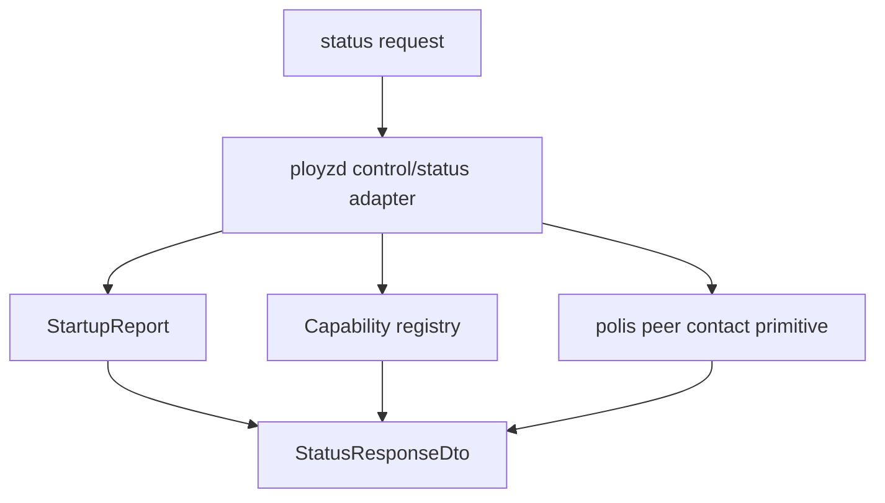

# feat: Add Status Capabilities And Contact Snapshot

## Summary

Add the smallest preflight surface a cloud workflow needs after contacting a node: who this node is, which daemon/protocol versions it speaks, which operation capabilities are available, and what contact paths it can advertise. This slice should make `status` useful without adding deploy, machine-add, peer command delivery, Docker execution, or long-lived streaming.

---

## Problem Frame

The protocol/stdio slice gave external tooling a typed way to ask for `status` and operation state, but the status payload is still mostly a startup report. Cloud cannot yet decide whether a contacted node can handle a requested operation version, whether it is the expected node, or which contact details can be persisted for later peer work.

The tempting next move is to add `deploy.apply` or `machine.add`. That would force capability and compatibility decisions into the first primitive. The simpler sequence is to make the node report a governed capability vocabulary first, then let future operation modules append capabilities when they become real.

This is also where versioning should stay boring. Every node is equal, but not every node will be upgraded at once. A newer coordinator can only ask an older node to do work if the target advertises the required runtime capability. The initial model should be additive, typed, and explicit, not a loose string bag that turns into policy by accident.

---

## Requirements

**Status Contract**

- R1. `status` returns daemon identity, daemon version, protocol version, startup readiness, and command-service readiness in one typed payload.
- R2. `status` returns a stable additive capability list using governed tokens, not arbitrary display strings.
- R3. `status` separates durable identity from live observations. Startup phase and command readiness remain live report fields; they do not become stored cluster truth.
- R4. `status` keeps operation failure summary visible and typed when the operation runner records a foreground failure.

**Capability Model**

- R5. Capabilities are owned in Rust as typed values with stable wire tokens and a single version number for the external protocol surface.
- R6. The initial capability list includes only shipped behavior: `status`, finite operation submit/get/stream, and local `rpc-stdio` control.
- R7. Future deploy, machine, runtime, WireGuard, gateway, Docker, and stream capabilities are absent until those primitives exist.
- R8. Capability tests fail if a token is renamed, removed accidentally, or emitted by a fake/test-only operation path.

**Contact Snapshot**

- R9. The contacted node exposes its current iroh endpoint id and a redacted contact snapshot suitable for UI/debug display.
- R10. Durable tickets are not stored as machine truth and are not treated as membership records in this slice.
- R11. Contact snapshot generation has explicit timeout/failure handling where it talks to live peer substrate.
- R12. Contact fields are optional by structured absence, not by empty strings.

**Scope Control**

- R13. Do not add product-shaped Polis APIs. Polis may expose product-neutral peer ticket/contact primitives; Ployz/ployzd decide what belongs in the status payload.
- R14. Do not add a broad CLI, installer, generated TypeScript package, deploy payload, machine-add payload, or runtime executor in this slice.
- R15. Keep `ployzctl` a shim. It should not inspect capabilities or branch on runtime policy.

---

## Key Technical Decisions

- KTD1. **Capability tokens are API surface:** The tokens are small strings on the wire, but the source of truth is a Rust enum/newtype model in `crates/ployz-api`. Tests pin the emitted tokens.
- KTD2. **Report what shipped, not what is planned:** The initial capability list advertises only the working protocol/control operations. Unsupported future primitives stay absent, not present with fake runtime versions.
- KTD3. **Status composes facts at the daemon edge:** `ployzd` composes startup report, protocol constants, operation registry capability, and peer contact snapshot into a DTO. Product modules do not import protocol DTOs for internal convenience.
- KTD4. **Contact is observation:** The contact snapshot is useful for cloud/UI/debugging, but it is not durable membership truth and does not imply reachability forever.
- KTD5. **No orchestrator in the CLI:** `ployzctl rpc-stdio` continues to forward frames and process setup errors. Capability evaluation belongs to the caller or daemon operation modules.

---

## High-Level Technical Design



The status response should remain a snapshot:

```text
StatusResponse
  node identity and versions
  live daemon/startup readiness
  supported protocol capabilities
  optional current peer contact observation
  optional last operation failure summary
```

No field in this snapshot should authorize a future operation by itself. Future operation modules still probe dependencies at decision time and fail loudly when preconditions are missing.

---

## Implementation Units

### U1. Protocol Status And Capability DTOs

- **Goal:** Expand `crates/ployz-api` status DTOs with node identity, version constants, capability DTOs, and optional contact snapshot fields.
- **Requirements:** R1, R2, R5, R6, R7, R8, R12
- **Dependencies:** Completed protocol/stdio control surface.
- **Files:**
  - `crates/ployz-api/src/lib.rs`
  - `crates/ployz-api/src/status.rs`
  - `crates/ployz-api/tests/contract.rs`
- **Approach:** Add typed status fields and a compact capability token model. Prefer enums/newtypes over sparse option bags. Keep constructors explicit so adding a field forces the daemon adapter and tests to make a deliberate choice.
- **Patterns to follow:** `crates/ployz-api/src/frame.rs` for wire invariants; `crates/ployz-api/src/operation.rs` for DTO conversion boundaries.
- **Test scenarios:**
  - `status` contract includes protocol version, daemon version, node identity, capabilities, and optional contact snapshot fields.
  - Capability tokens serialize to stable snake-case strings.
  - Empty capability tokens and empty contact string fields are rejected or unconstructible.
  - Contract tests fail if operation event/status fields from the previous slice disappear.
- **Verification:** `cargo test -p ployz-api` passes.

### U2. Daemon Capability Registry

- **Goal:** Add a tiny daemon-owned capability registry that reports only behavior this binary actually exposes.
- **Requirements:** R2, R5, R6, R7, R8, R14
- **Dependencies:** U1.
- **Files:**
  - `crates/ployzd/src/capabilities.rs`
  - `crates/ployzd/src/lib.rs`
  - `crates/ployzd/src/commands.rs`
  - `crates/ployzd/src/tests.rs`
- **Approach:** Keep the registry static for now. It should return status/control capabilities and operation lifecycle capabilities, not fake deploy or machine capabilities. If the operation registry participates, expose only real registered operation kinds and keep test-only fakes behind `#[cfg(test)]`.
- **Patterns to follow:** `crates/ployzd/src/operations/registry.rs` for avoiding test-only runtime leakage; `crates/ployzd/src/commands.rs` for daemon status ownership.
- **Test scenarios:**
  - Production capability list does not include fake operation kinds.
  - Production capability list does not include deploy, machine, Docker, WireGuard, gateway, installer, or long-lived stream capabilities.
  - Command status includes the same capability list exposed through the protocol adapter.
  - Capability order is deterministic.
- **Verification:** `cargo test -p ployzd capabilities -- --test-threads=1` or equivalent focused tests pass.

### U3. Polis Peer Contact Snapshot Primitive

- **Goal:** Expose the smallest product-neutral peer contact snapshot needed by daemon status without storing it as membership truth.
- **Requirements:** R9, R10, R11, R13
- **Dependencies:** U1.
- **Files:**
  - `crates/polis/src/peers.rs`
  - `crates/polis/src/peers/tickets.rs`
  - `crates/polis/src/peers/endpoint.rs`
  - `crates/polis/src/peers/tests.rs` or inline peer tests
- **Approach:** Reuse existing ticket issuance and redaction concepts. Add a small typed snapshot such as endpoint id, path class, and redacted ticket/contact text if available. Keep the primitive substrate-shaped: no machine id, network name, org slug, capability policy, or cloud language.
- **Patterns to follow:** `crates/polis/src/peers/tickets.rs` for redaction and path classification; `crates/polis/src/peers/probe.rs` for deadlines.
- **Test scenarios:**
  - Snapshot reports endpoint id and path class for direct-only and relay-capable tickets.
  - Snapshot redaction does not expose full durable ticket text.
  - Snapshot creation failure is typed and does not silently return an empty contact.
  - Polis still has no product modules or machine-join policy APIs.
- **Verification:** `cargo test -p polis peers` passes.

### U4. Status Adapter Composition

- **Goal:** Compose daemon identity, startup report, capabilities, and peer contact snapshot into the external `status` response.
- **Requirements:** R1, R2, R3, R4, R9, R11, R12, R15
- **Dependencies:** U1, U2, U3.
- **Files:**
  - `crates/ployzd/src/control/status.rs`
  - `crates/ployzd/src/control/protocol.rs`
  - `crates/ployzd/src/commands.rs`
  - `crates/ployzd/src/daemon.rs`
  - `crates/ployzd/src/tests.rs`
- **Approach:** Pass the minimal peer/contact observation into the command service or status adapter without making `DaemonState` a feature registry. Missing contact is a typed status field. Contact probe/issue failures are visible in status as a contact failure field or a structured absence reason, not a process failure unless daemon startup itself failed.
- **Patterns to follow:** `crates/ployzd/src/control/status.rs` for adapter-local DTO conversion; `crates/ployzd/src/report.rs` for startup phase separation.
- **Test scenarios:**
  - Ready daemon status includes endpoint id, daemon version, protocol version, and base capabilities.
  - Startup failure status keeps capability reporting separate from readiness.
  - Contact snapshot absence/failure is visible without turning daemon readiness false when peer startup is otherwise ready.
  - `rpc-stdio` status response serializes the expanded payload and continues to handle malformed follow-up lines.
- **Verification:** `cargo test -p ployzd status -- --test-threads=1` and `cargo test -p ployzd control -- --test-threads=1` pass.

---

## Scope Boundaries

### In Scope

- Status payload expansion.
- Stable protocol and daemon version fields.
- Typed additive capability vocabulary for currently shipped behavior.
- Optional current peer contact snapshot.
- Contract tests that pin status/capability wire shape.
- Focused daemon and Polis tests for capability/contact behavior.

### Deferred To Follow-Up Work

- Generated TypeScript package publication.
- Long-lived `operation.stream` follow mode.
- `deploy.apply`, `machine.add`, installer events, Docker runtime, WireGuard controller, gateway config, and runtime logs.
- Persisting cloud contact records or membership truth beyond existing Corrosion membership rows.
- Authorization beyond the current local/SSH process trust boundary.

### Outside This Slice's Identity

- Cloud/Inngest workflow orchestration.
- Runtime placement or deploy policy.
- NAT traversal coordination, WireGuard endpoint selection, or iroh external cloud transport.
- ZFS, volumes, branch, promote, rollback, drain, and remove primitives.

---

## Acceptance Examples

- AE1. A caller sends `status` over `ployzctl rpc-stdio` and receives a node identity, daemon version, protocol version, readiness fields, and deterministic capabilities.
- AE2. A cloud workflow can see that deploy and machine-add are not yet supported because the capabilities are absent, not because it must parse an error string.
- AE3. A contacted node reports an iroh endpoint/contact snapshot when available and reports structured absence when unavailable.
- AE4. A test-only fake operation does not appear in production status capabilities.
- AE5. A malformed line after an expanded `status` response still returns a protocol error and the session remains usable.

---

## Risks And Mitigations

- **Risk: capabilities become a wishlist.** Mitigation: only emit shipped behavior and pin tests that deploy/machine/runtime tokens are absent until implementation lands.
- **Risk: contact snapshot becomes durable truth.** Mitigation: keep it in status as an observation and leave membership rows as the durable substrate record.
- **Risk: status adapter grows into a feature registry.** Mitigation: isolate capability construction in a small daemon module and keep operation-specific capabilities owned by the operation registry when real operations exist.
- **Risk: versioning becomes over-designed.** Mitigation: start with one protocol version constant and one daemon package version; add per-runtime versions only when a runtime command surface exists.

---

## Verification

- `cargo fmt`
- `cargo test -p ployz-api`
- `cargo test -p polis peers`
- `cargo test -p ployzd status -- --test-threads=1`
- `cargo test -p ployzd control -- --test-threads=1`
- `just test-all`

---

## Follow-Up Slice

After this lands, the next logical slice is the smallest real primitive behind the operation spine: either a local runtime capability executor that can inspect/start/stop a container under deadlines, or a machine bootstrap/check primitive if cloud onboarding is the sharper unblocker.
