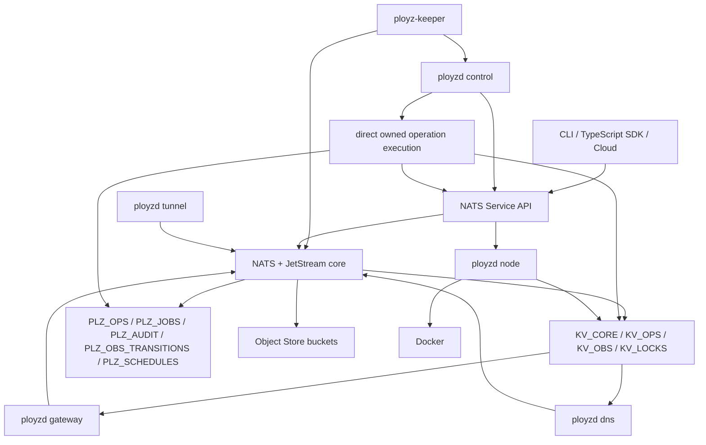
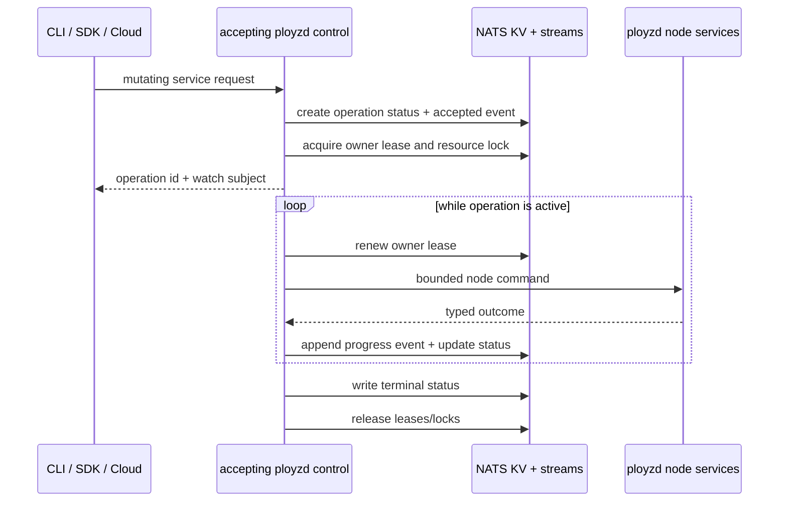

# refactor: Reset Ployz Around A NATS Control Plane

## Summary

Nuke the current Polis/Corrosion-shaped implementation path and rebuild Ployz
as a tiny Rust control plane whose business logic is easy to read because NATS
carries the backplane responsibilities. Keep iroh, but narrow its job: iroh is
the private transport underlay for reaching NATS across NATs and changing
addresses, not the product RPC/state substrate.

The target shape is:

- **NATS Service API** for commands/RPC.
- **JetStream KV** for current state.
- **JetStream streams** for operation history, durable job triggers, audit,
  observation transitions, and schedules.
- **Direct owned operation execution** in the `ployzd` process that accepts
  each mutating command, with advisory leases for visibility and fencing.
- **Durable pull consumers and queue groups** deferred for later automatic
  takeover of expired owned work, not the v1 execution path.
- **Object Store** for deploy bundles, diagnostics, rendered specs, cert
  bundles, and backup manifests.
- **Message schedules** for cron/delayed work where the pinned NATS version
  supports it, with a tiny scheduler-worker fallback if needed.
- **Subjects and permissions** as the routing/security model.
- **iroh tunnels** as the default private transport for node-to-core NATS
  client connections.
- **One shared `ployzd` runtime artifact** with separately supervised
  `control`, `node`, `gateway`, `dns`, and `tunnel` role processes.
- **A tiny independently versioned `ployz-keeper`** for node-local bootstrap,
  artifact install, and supervisor unit management. Upgrade rollouts are later,
  after the two-node product proof is boring.

This is not "NATS as the database". Docker remains execution reality. KV is the
small current-state projection. Streams are durable timelines and job triggers.
Ployz code should mostly read as product policy: validate request, create
operation, plan from current facts, call node services, commit only on success,
emit events. Most operations are started by one operator command and can be
owned by the node that accepted that command. The MVP should model that reality
instead of designing first for multi-controller automatic failover.

The control plane and data plane stay separate. `ployzd control` assures the
system and responds to product services, but gateway, DNS, NATS connectivity,
and existing workloads are not routed through `ployzd control`. Data-plane
roles are independently supervised NATS clients and keep serving from current
or last-known-good state when `ployzd control` is down, even though they share
the same `ployzd` binary artifact.

---

## Problem Frame

The current architecture has accumulated too much substrate code before the
product primitive shape has become small and obvious. Polis, Corrosion, iroh
contact snapshots, peer runtime versions, equal-node coordination, and
rpc-stdio are all individually defensible, but together they are becoming a
custom, incomplete version of what NATS already provides.

The product goal is not to prove a substrate. The product goal is a boring
orchestration core for 1-200 machines:

- operation-shaped commands,
- explicit outcomes,
- retained evidence on failure,
- current runtime state that is easy to inspect,
- reliable cloud/CLI/agent consumption,
- little hidden cluster behavior.

The reset keeps the product philosophy from `VISION.md`: primitives, visible
failures, modest scale, no hyperscale controller maze. It replaces the
control-plane substrate mechanism while preserving iroh as the connectivity
underlay.

## Superseded Direction

This plan supersedes the active implementation direction in:

- `docs/architecture/ployz-cloud-backwards-roadmap.md`
- `docs/plans/2026-06-03-001-feat-cloud-mvp-operation-spine-plan.md`
- `docs/plans/2026-06-03-004-feat-status-capabilities-contact-snapshot-plan.md`

Those docs remain useful as records of product constraints, but the new
implementation should not continue building on Polis/Corrosion/iroh peer RPC as
the control-plane substrate. iroh remains in scope only for private connectivity
to NATS and optional later tunnels.

---

## North Star

Business logic should be legible enough that a deploy operation reads like a
plain sequence:

```text
accept request
create operation
acquire deploy lock
load current service state
plan changed containers
run predeploy
start replacements
wait for health
switch route
remove old containers
commit active revision
complete operation
```

The NATS-specific mechanics should be wrapped once and then disappear behind
small adapters:

- service handler registration,
- KV get/create/update/watch,
- stream publish/consume,
- object put/get,
- schedule create/cancel,
- permission profile rendering.
- iroh-backed local NATS port forwarding.

No custom RPC layer. No custom job table. No custom progress channel. No
custom service registry. No custom distributed observation bus. No product
commands over iroh.

---

## Requirements

### Product Behavior

- R1. Every mutating command returns an operation id quickly.
- R2. Every operation has durable events and one explicit terminal state:
  `completed`, `failed`, or `cancelled`.
- R3. Failed deploys preserve useful evidence after container start, including
  node id, container id, retained artifact type, and log access instructions.
- R4. Successful deploys commit active service state only after replacement
  health and route cutover succeed.
- R5. Operators, cloud workflows, CLIs, SDKs, and agents all consume the same
  primitive command surface.
- R6. Cloud/Inngest may orchestrate product workflows, but runtime truth and
  operation outcomes belong to the core.

### NATS Backplane

- R7. User-facing commands are NATS services under stable versioned subjects
  such as `plz.v1.svc.api.deploy.submit` and
  `plz.v1.svc.api.ops.status`.
- R8. Node-local commands are node-scoped services such as
  `plz.v1.svc.node.<node_id>.container.run`; users cannot call them directly.
- R9. KV buckets hold current state only: core truth, observations, operation
  status, and short-lived locks.
- R10. Streams hold operation history, job trigger subjects, audit history,
  observation transitions, and schedule definitions separately.
- R11. The `ployzd` process that accepts a mutating command owns and runs that
  operation under an advisory operation lease.
- R12. Expired owner leases make operation ownership visibly expired or
  recoverable; v1 does not automatically transfer workflow ownership to another
  process.
- R13. Object Store holds control-plane blobs, not Docker layers or app data.
- R14. Message schedules replace cron/delayed task loops where supported by the
  pinned NATS server; the fallback uses the same target subjects.
- R15. Subject permissions enforce node/controller/user roles.
- R15a. All subjects use the `plz.v1.<plane>.` grammar. Human names,
  hostnames, and route strings do not appear raw in subjects or KV keys; use
  token-safe ids or encoded index keys.
- R15b. Node-owned observations put `<node_id>` immediately after
  `plz.v1.obs.node.` so node credentials can publish only their own
  observation subjects.

### iroh Transport Underlay

- R16. Edge nodes connect to the NATS control plane through iroh by default,
  using a local loopback TCP listener that forwards bytes over an iroh QUIC
  stream to a core-side NATS tunnel proxy.
- R17. `nats-server` and `async-nats` remain unmodified. The iroh tunnel is a
  transport adapter, not a forked NATS protocol implementation.
- R18. NATS credentials, account permissions, and subject permissions remain the
  authority boundary even when the transport is iroh-encrypted.
- R19. Bootstrap material includes node id, NATS credentials, trusted NATS
  server identity/config, and one or more core iroh endpoint addresses/tickets.
- R20. If iroh direct path fails, relay fallback is acceptable for control-plane
  traffic. The system reports whether the current NATS tunnel is direct,
  relayed, reconnecting, or down.
- R21. Public TCP/WebSocket NATS exposure is an optional advanced mode, not the
  default node transport.
- R21a. Separate control plane from data plane. `ployzd control` assures the
  system, responds to product services, runs direct owned operation execution,
  and performs mutations. `ployzd node` owns node RPC and observations. Neither
  role is in the steady-state serving path for already-running workloads,
  gateway routing, DNS answers, or NATS client connectivity.
- R21b. Data-plane components are independently supervised NATS clients.
  `ployzd gateway` and `ployzd dns` watch NATS directly, apply route/DNS state
  directly, and keep serving from last-known-good state if the control plane is
  unavailable.
- R21c. Core `ployzd control` failure must not imply `nats-server`,
  `ployzd gateway`, `ployzd dns`, or `ployzd tunnel` failure. Edge
  `ployzd node` failure makes that node's product RPC, node services, deploy
  participation, and observations unavailable, but existing workloads and
  data-plane serving continue. These roles may share one `ployzd` binary while
  remaining separate supervised processes and failure domains.
- R21d. Tunnel loss is represented as connectivity/health state. It is not
  inferred into stored cluster truth and does not mutate current workload state
  without an operation owner.

### Local Install

- R31. `ployz.sh` is a tiny bootstrapper: it verifies the host, downloads and
  verifies `ployz-keeper`, installs its supervisor unit, writes one-time join
  material, and starts the keeper. It does not install or configure the full
  cluster itself.
- R32. `ployz-keeper` is a separate, small binary with an independent version
  from `ployzd`. For v1 it owns only node-local bootstrap/install: host
  prerequisites, verified artifacts, supervisor units, and join material.
- R33. `ployzd` is one main runtime artifact. Control, node-agent, gateway,
  DNS, and NATS tunnel roles run as separate supervised processes/modes of
  that same binary unless a later hard boundary requires another split.
- R34. Join tokens are short-lived, one-time, and scoped to bootstrap. They
  authorize redeeming join material, not general cluster mutation.
- R35. Keeper steps are typed, versioned, and observable. Step progress and
  failures are emitted to the active bootstrap operation.
- R36. Keeper background reconciliation is not part of v1. If keeper notices
  drift after bootstrap, it reports local health/evidence and waits for an
  explicit operation; it does not silently change product/runtime truth such as
  active services, routes, certs, or cluster membership.
- R37. `ployzd` does not update itself in v1. Upgrade and rollout behavior is
  deferred until install, machine add, deploy, and the real data plane are
  proven on disposable hosts.
- R38. Gateway, DNS, tunnel, and workload processes keep their own supervised
  failure domains. The install proof must show those processes can start,
  stop, and report health independently of `ployzd control`.

### Disposable Host Acceptance

- R39. H0 is only a disposable outside-world smoke proof. Hetzner is just a
  cheap host allocator for the proof. It is not a product concept, provider
  layer, reusable harness, architecture slice, or place to hide missing Ployz
  behavior.
- R40. The H0 script may only create hosts, wait for SSH, stage artifacts, run
  product commands, capture output, curl the smoke service, and delete hosts.
  The whole proof is:

  ```text
  ployzctl init ...
  ployzctl machine add ...
  ployzctl deploy ...
  ployzctl ops watch ...
  curl ...
  ```

  If another primitive is needed to pass that path, add the primitive to Ployz.
  If the product path is missing, H0 fails. The script must not compensate with
  provider-specific install, readiness, routing, deploy, recovery, or health
  behavior.
- R41. The script may shortcut artifact distribution with a local binary,
  pre-staged release artifact, or explicit source path. It may have minimal
  shell hygiene for cleanup and diagnostics. It must not add Hetzner-specific
  Rust, provider abstractions, readiness models, retry workflows, product
  probes, or a second orchestration path.
- R42. H0 passes when fresh hosts install Ployz, join the second node, connect
  NATS over iroh, deploy one smoke service, record successful operations, and
  serve one request through the real route/data-plane path. Product readiness
  must come from product commands and operation output.
- R43. Reuse the old eBPF/WireGuard data plane from git history as a hard
  requirement for container networking. H0 only needs one assertion that this
  real data plane is in the smoke request path.

### Simplicity And Readability

- R22. Business logic modules must be plain Rust structs, enums, and async
  functions; no generic operation engine in v1.
- R23. No trait is added until there are two real implementations or a test
  boundary requires it.
- R24. Operation state machines are enums with typed terminal failure payloads.
- R25. Handlers must not own transport, authorization, orchestration, storage,
  and presentation in one file.
- R26. NATS subject strings are centralized enough to be safe, but not hidden
  behind elaborate type-level subject algebra.

### Reset Scope

- R27. Existing Polis, Corrosion, iroh peer RPC, and rpc-stdio control-plane
  code are not ported by default. New iroh code is limited to endpoint
  identity, join material, and NATS tunnel transport.
- R28. Existing tests are kept only when they validate product semantics that
  still matter.
- R29. The new code path starts from a minimal greenfield Rust skeleton.
- R30. The first complete proof is single-node NATS + one deploy operation
  against a fake Docker executor, then a real Docker executor.

---

## Key Technical Decisions

- KTD1. **NATS is the operating backplane.** Ployz should use NATS primitives
  directly enough that the architecture remains obvious: services for commands,
  KV for current state and leases, streams for timelines/jobs, Object Store for
  blobs, permissions for subject-level authority.

- KTD2. **One NATS domain per cluster in v1.** Regions are labels, not separate
  control planes. NATS gateways, leaf nodes, and domain-per-region coordination
  are deferred.

- KTD3. **Control role is not the data plane.** `ployzd control` is the
  control-plane assurance/service process: bootstrap, health checks, repair,
  service responders, and direct owned operation execution. `ployzd node` owns
  node RPC and observations. `ployzd gateway`, `ployzd dns`, `ployzd tunnel`,
  `nats-server`, and workloads are independently supervised data-plane or
  substrate processes. Only core nodes run `nats-server`.

- KTD4. **NATS server is assured, not embedded.** `ployzd control` owns config
  rendering, credentials, stream/KV/Object Store bootstrap, health checks, and
  repair operations. A supervisor such as systemd owns `nats-server` process
  lifetime by default, so `ployzd control` failure does not automatically take
  down the NATS control-plane substrate.

- KTD5. **NATS runs over iroh by default for nodes.** An independently
  supervised `ployzd tunnel --side edge` role exposes a loopback listener on
  edge nodes. `async-nats` clients connect to that local address. The edge
  tunnel opens an iroh connection to an independently supervised
  `ployzd tunnel --side core` role, which forwards bytes to the local core
  `nats-server` client listener. This keeps NATS native while avoiding public
  NATS exposure and surviving address changes. Tunnel availability is
  health/connectivity state; losing the tunnel pauses that node's NATS access
  without rewriting cluster truth.

- KTD5a. **If a process owns a runtime dependency, model it as supervision.**
  Keeper writes and updates supervisor units by default. If a deployment mode
  makes `ployzd control` responsible for starting or restarting `nats-server`,
  gateway, DNS, or tunnel role processes, that mode promotes `ployzd control`
  into a supervisor for data-plane/substrate dependencies. It must then have
  explicit readiness, restart policy, shutdown ordering, health reporting, and
  recovery tests. This is not the default steady-state assumption.

- KTD5b. **One `ployzd` artifact, many supervised role processes.** Gateway,
  DNS, tunnel forwarding, node agent, and control services share one `ployzd`
  binary version, but run as separate process roles such as `ployzd control`,
  `ployzd node`, `ployzd gateway`, `ployzd dns`, and `ployzd tunnel`. A shared
  artifact keeps runtime compatibility and rollout logic simple; separate
  process supervision keeps failure domains explicit.

- KTD5c. **Keeper is separate because it owns local install.** `ployz-keeper`
  is the tiny node-local substrate manager that installs the main `ployzd`
  artifact, writes supervisor units, verifies artifacts, and reports bootstrap
  progress. It is versioned independently so it can later survive and manage
  `ployzd` upgrades, but rollout logic is deferred until the product proof is
  repeatable.

- KTD6. **NATS security still matters over iroh.** iroh authenticates and
  encrypts the tunnel, but NATS credentials and subject permissions remain the
  product authority layer. A valid iroh tunnel without valid NATS credentials
  cannot mutate the cluster.

- KTD7. **Do not run product RPC over iroh.** iroh may carry NATS bytes and
  later explicit debug/file-transfer tunnels. It must not regain deploy,
  machine, status, or peer-command protocols.

- KTD8. **Mutating services create owned operations.** The `ployzd` process
  that accepts `plz.v1.svc.api.deploy.submit` validates, creates the
  operation, records durable evidence, acquires an owner lease, starts local
  owned execution, and returns the operation id quickly. A tiny advisory lease
  helper renews the owner lease while the bounded operation future runs.

- KTD9. **KV current state is not desired-state reconciliation.** `KV_CORE`
  records active successful state. Pending/failed targets live in `KV_OPS` and
  operation events until a successful commit.

- KTD10. **Use leases for ownership and locks for resource fencing.** Operation
  owner leases say who is currently responsible for progress. KV locks fence
  resources such as one service deploy, one ACME hostname, or one volume
  mutation.

- KTD11. **Docker is execution reality.** Labels and local SQLite make node
  reality inspectable and mostly rebuildable. KV is the cluster's current
  control-plane view, not a substitute for Docker inspection.

- KTD12. **No WorkQueue retention for deploy timelines.** Deploy operations need
  retained history. WorkQueue streams are acceptable later for disposable jobs,
  but not for `PLZ_OPS`.

- KTD12a. **Operation timelines and generic jobs are separate streams.**
  `PLZ_OPS` binds only `plz.v1.op.>`. `PLZ_JOBS` binds
  `plz.v1.job.>`. Owned operations publish progress to `PLZ_OPS`; scheduled
  and internal background work uses job subjects with their own retention and
  permissions.

- KTD12b. **Durable workflow takeover is deferred.** JetStream consumers and
  queue groups remain useful NATS primitives, but v1 should not depend on them
  for deploy/substrate workflow ownership. Automatic resume after owner death
  can be added later once the simpler owned-operation contract has shipped.

- KTD13. **Schedules are a capability gate.** NATS 2.12 introduced message
  schedules and 2.14 extends them. If the pinned server does not satisfy the
  needed behavior, build one tiny scheduler worker that publishes the same job
  subjects and delete it later.

- KTD14. **Rust remains appropriate only with restraint.** The greenfield Rust
  version should avoid framework-heavy control flow, broad traits, service
  registries, and generic operation executors.

---

## External Source Checks

Verified planning inputs:

- NATS Service API supports service metadata and discovery through
  `$SRV.PING`, `$SRV.STATS`, and `$SRV.INFO`:
  https://docs.nats.io/using-nats/developer/services
- The NATS client protocol is spoken after establishing a TCP/IP socket, and
  NATS also supports WebSocket connectivity; Ployz's iroh path therefore uses a
  local TCP byte tunnel rather than modifying NATS:
  https://docs.nats.io/reference/reference-protocols/nats-protocol and
  https://docs.nats.io/nats-concepts/connectivity
- NATS queue groups provide built-in load balancing, fault tolerance, and
  no-responder behavior for request/reply:
  https://docs.nats.io/nats-concepts/core-nats/queue
- JetStream KV supports buckets, create/update CAS operations, TTL limits,
  watches, and history; direct gets do not guarantee read-your-writes:
  https://docs.nats.io/nats-concepts/jetstream/key-value-store
- JetStream consumers provide durable state, acknowledgements, redelivery, and
  pull consumers are recommended for new scalable/error-handled projects:
  https://docs.nats.io/nats-concepts/jetstream/consumers
- JetStream WorkQueue retention removes messages after consumer acknowledgement:
  https://docs.nats.io/using-nats/developer/develop_jetstream/model_deep_dive
- Object Store stores files in chunks, can watch bucket changes, and is not a
  distributed storage system:
  https://docs.nats.io/nats-concepts/jetstream/obj_store
- Subject-level permissions and `allow_responses` support service responder
  patterns:
  https://docs.nats.io/running-a-nats-service/configuration/securing_nats/authorization
- System accounts emit server/account events and expose request endpoints for
  status/debugging:
  https://docs.nats.io/running-a-nats-service/configuration/sys_accounts
- NATS 2.12 introduced `AllowMsgSchedules`; schedule headers require stream
  support:
  https://docs.nats.io/release-notes/whats_new/whats_new_212 and
  https://docs.nats.io/nats-concepts/jetstream/headers
- `async-nats` exposes JetStream, KV, Object Store, and Service API from Rust:
  https://docs.rs/async-nats/latest/index.html
- As of 2026-06-04, GitHub reports `nats-server` latest release `v2.14.2`,
  published 2026-06-02:
  https://github.com/nats-io/nats-server/releases/tag/v2.14.2
- iroh connects by stable endpoint public keys, uses QUIC, handles NAT
  traversal, and falls back to relays when direct connections are unavailable:
  https://www.iroh.computer/docs/overview,
  https://docs.iroh.computer/concepts/nat-traversal, and
  https://www.iroh.computer/docs/concepts/relay
- iroh exposes QUIC stream APIs suitable for building byte-stream tunnels:
  https://docs.iroh.computer/protocols/using-quic

---

## Target Architecture

### Component Topology



Every machine can run the shared `ployzd` artifact in one or more roles:
`control`, `node`, `gateway`, `dns`, and `tunnel`. Only core nodes run
`nats-server`. Gateway, DNS, and tunnel roles are independent NATS
clients/processes supervised outside `ployzd control`, but they use the same
`ployzd` binary version. `ployz-keeper` is the separately versioned local
installer/updater that manages the `ployzd` artifact and role units. Direct
owned operation execution usually runs on whichever `ployzd control` process
accepted the mutating command. Authority comes from credentials, operation
owner leases, and resource locks, not implicit process identity.

### Control Plane And Data Plane

```text
control plane:
  ployzd control service responders
  direct owned operation execution
  ployzd node RPC services
  bootstrap, health checks, repair, config rendering

substrate:
  nats-server
  JetStream KV/streams/Object Store
  ployzd tunnel NATS forwarding
  ployz-keeper local bootstrap/install

data plane:
  Docker containers
  ployzd gateway route serving
  ployzd dns serving
  last-known-good local runtime config
```

`ployzd control` failure stops new mutations that need core service responders
or direct owned execution. `ployzd node` failure stops that node's RPC and
observations. Neither failure automatically stops `ployzd gateway`,
`ployzd dns`, `ployzd tunnel`, NATS clients, or existing workloads. If NATS
state changes while `ployzd control` is down, gateway and DNS role processes
still see those changes through their own NATS subscriptions and apply them
directly.

### Owned Operation Lifecycle



If the owner process dies, the owner lease expires. The operation status remains
its last durable lifecycle state, while the ownership projection becomes
`expired` or `recoverable`; v1 does not silently transfer the workflow to
another process. A later explicit command can inspect reality, resume if
supported, cancel or fail the old operation, or start a new operation that plans
from Docker/KV observations.

### Scale Modes

```text
1 node:
  ployz-keeper
  ployzd control/node/tunnel roles as needed
  nats-server --jetstream
  ployzd gateway / ployzd dns if configured
  docker

2 nodes:
  node 1 = core
  node 2 = edge
  not HA

3-200 nodes:
  core-1/core-2/core-3 = NATS + JetStream quorum
  edges = keeper plus assigned ployzd node/gateway/dns/tunnel roles
```

Do not pretend two nodes are HA. Two is transitional.

### State Layers

```text
Docker
  execution reality: containers, logs, health, volumes, networks

Docker labels
  emergency discovery: service id, revision, operation id, step id

local SQLite
  node-local cache: created containers, sanitized specs, local evidence

NATS JetStream
  cluster authority: current state, operation status, events, audit, locks
```

Local SQLite is rebuildable. NATS backup is canonical for control-plane state.
Docker labels make recovery possible when either local DB or NATS observations
are stale.

---

## NATS Buckets, Streams, And Subjects

### KV Buckets

```text
KV_CORE
  domain.config
  machines.<node_id>
  machines.<node_id>.roles
  machines.by_name.<encoded_name>
  services.<service_id>
  services.by_name.<encoded_name>
  revisions.<service_id>.<revision_id>
  routes.<route_id>
  routes.by_host.<encoded_hostname>.<port>
  certs.<cert_id>
  certs.by_host.<encoded_hostname>
  schedules.<schedule_id>
KV_OPS
  ops.<op_id>

KV_OBS
  nodes.<node_id>.heartbeat
  nodes.<node_id>.resources
  nodes.<node_id>.public_ip
  nodes.<node_id>.components.keeper
  nodes.<node_id>.components.ployzd
  nodes.<node_id>.roles.<role>.status
  containers.<node_id>.<container_id>
  gateways.<node_id>.status
  dns.<node_id>.status

KV_LOCKS
  deploy.<service_id>
  acme.<cert_id>
  volume.<volume_id>
  core_change
```

Hostnames, service names, and arbitrary route names are payload fields or
encoded index keys, not raw subject/KV tokens. Dots, slashes, and wildcard
characters must not leak into the key grammar.

Lock values carry:

```text
holder
operation_id
epoch
expires_at
```

Destructive or exclusive node calls carry the lock epoch where relevant. Stale
epochs are rejected.

### Streams

```text
PLZ_OPS
  plz.v1.op.>

PLZ_JOBS
  plz.v1.job.>

PLZ_AUDIT
  plz.v1.audit.>

PLZ_OBS_TRANSITIONS
  plz.v1.obs.node.<node_id>.>

PLZ_SCHEDULES
  plz.v1.sched.>
```

`PLZ_OPS` is retained operation history. Direct owned operation execution
appends to it while it works; v1 does not consume operation timelines as the
primary workflow queue. Generic scheduled/internal jobs use `PLZ_JOBS` so
trigger retention, retry semantics, permissions, and compaction can diverge
from operation timelines.

`PLZ_OBS_TRANSITIONS` stores important transitions only. Latest health goes to
`KV_OBS`; health ticks do not flood replicated durable history.

Observation subjects put node ownership first:

```text
plz.v1.obs.node.node_7.heartbeat.updated
plz.v1.obs.node.node_7.public_ip.changed
plz.v1.obs.node.node_7.container.ctr_abc.running
plz.v1.obs.node.node_7.container.ctr_abc.health_failed
plz.v1.obs.node.node_7.gateway.routes_applied
```

Schedules are timer definitions; their targets are jobs:

```text
plz.v1.sched.cert.renew.<cert_id>
  -> plz.v1.job.cert.renew.<cert_id>

plz.v1.sched.node.ip_probe.<node_id>
  -> plz.v1.job.node.ip_probe.<node_id>

plz.v1.sched.gc.images.global
  -> plz.v1.job.gc.images.global
```

### User-Facing Services

```text
plz.v1.svc.api.deploy.submit
plz.v1.svc.api.deploy.plan
plz.v1.svc.api.ops.status
plz.v1.svc.api.ops.watch
plz.v1.svc.api.ops.cancel
plz.v1.svc.api.ops.list
plz.v1.svc.api.service.inspect
plz.v1.svc.api.service.list
plz.v1.svc.api.service.remove
plz.v1.svc.api.service.scale
plz.v1.svc.api.machine.add
plz.v1.svc.api.machine.list
plz.v1.svc.api.machine.inspect
plz.v1.svc.api.cert.ensure
```

Mutating services return:

```text
operation_id
status = accepted
event_subject = plz.v1.op.<op_id>.>
start_sequence
owner_lease_expires_at
```

### Node Services

```text
plz.v1.svc.node.<node_id>.inspect
plz.v1.svc.node.<node_id>.container.run
plz.v1.svc.node.<node_id>.container.stop
plz.v1.svc.node.<node_id>.container.remove
plz.v1.svc.node.<node_id>.container.start
plz.v1.svc.node.<node_id>.predeploy.run
plz.v1.svc.node.<node_id>.logs.tail
plz.v1.svc.node.<node_id>.volume.create
plz.v1.svc.node.<node_id>.volume.remove
```

Node services are coarse, local, and idempotent. They do not decide placement,
deploy policy, route policy, or cleanup policy.

Controller/internal services use a third service plane:

```text
plz.v1.svc.ctrl.cert.renew
plz.v1.svc.ctrl.gateway.reload
plz.v1.svc.ctrl.backup.create
```

---

## Greenfield Rust Structure

Target workspace after reset:

```text
crates/
  ployz-core/
    src/
      ids.rs
      subjects.rs
      time.rs
      state/
      ops/
      deploy/
      node/
      security/
  ployz-nats/
    src/
      connect.rs
      bootstrap.rs
      kv.rs
      streams.rs
      objects.rs
      services.rs
      service_protocol.rs
      schedules.rs
      permissions.rs
  ployz-transport/
    src/
      iroh_endpoint.rs
      nats_tunnel.rs
      join_bundle.rs
  ployzd/
    src/
      main.rs
      config.rs
      nats_process.rs
      app.rs
      services/
      controllers/
      node_agent/
      docker/
      gateway/
      dns/
      tunnel/
  ployz-keeper/
    src/
      main.rs
      steps.rs
      artifacts.rs
      systemd.rs
      health.rs
  ployzctl/
    src/
      main.rs
      api_client.rs
      commands/
  ployz-sdk-types/
    src/
      lib.rs
```

Rules:

- `ployz-core` has domain types, operation models, deploy planning, and
  subject naming.
- `ployz-nats` wraps `async-nats` and owns bootstrapping.
- `ployz-transport` owns iroh endpoint identity, NATS byte tunnels, and join
  bundle encoding.
- `ployzd` is one main runtime artifact. It wires process roles, credentials,
  service handlers, direct owned operation execution, node agent, Docker,
  gateway, DNS, NATS tunnel, and assurance/repair checks.
- `ployzd control` runs core services, direct owned operation execution, and
  bootstrap assurance.
- `ployzd node` runs node-local services, observation, and Docker integration.
- `ployzd gateway` is a data-plane NATS client process that watches
  route/container/cert state and serves last-known-good routes independently of
  `ployzd control`.
- `ployzd dns` is a data-plane NATS client process that watches DNS/cert state
  and serves last-known-good answers independently of `ployzd control`.
- `ployzd tunnel` is the independently supervised NATS-over-iroh byte
  forwarder role for edge loopback listeners and core tunnel endpoints.
- `ployz-keeper` is a separate tiny binary that installs the main `ployzd`
  artifact, writes supervisor units, checks host prerequisites, and reports
  bootstrap progress.
- `ployzctl` is a client, not an orchestrator.
- `ployz-sdk-types` is the public schema surface for generated TypeScript
  bindings.

One binary version does not mean one process or one failure domain. Gateway,
DNS, tunnel, node, and control roles share the `ployzd` artifact but are
supervised as separate role units with separate health and restart behavior.

---

## Bootstrap Flows

### `ployz init`

```text
ployz init
  generate domain id
  generate NATS operator/account/users
  generate local core iroh endpoint identity
  render nats-server config
  install or update ployz-keeper supervisor unit
  keeper installs or updates nats-server supervisor unit
  wait for supervised nats-server with JetStream
  bootstrap KV/streams/Object Store
  keeper installs or updates the main ployzd artifact
  keeper installs or updates ployzd control supervisor unit
  keeper installs or updates ployzd tunnel supervisor unit
  keeper installs or updates ployzd gateway/dns units if configured
  register NATS services
  write local machine record
  begin KV_OBS heartbeat
```

On the first node, `async-nats` can connect directly to local `nats-server`.
The iroh tunnel is still started immediately so added machines have one stable
join target that survives public IP changes.

### `ployz machine add`

```text
ployz machine add user@host --name node-2
  call plz.v1.svc.api.machine.add
  receive op_id
  accepting ployzd owns the machine operation under a lease
  owner creates node-scoped NATS user/creds
  owner creates short-lived one-time join token
  owner creates join bundle:
    domain id
    node id
    trusted NATS server identity/config
    node NATS creds
    core iroh endpoint address/ticket list
    relay map / relay policy
    assigned ployzd roles
    target ployzd artifact version
  user runs authenticated ployz.sh on the target
  ployz.sh installs only ployz-keeper
  keeper redeems join token and receives/redacts join bundle
  keeper installs staged verified ployzd artifact
  keeper writes tunnel, node, gateway, and DNS role configs as assigned
  keeper starts supervised ployzd tunnel role
  keeper starts supervised ployzd node role
  target async-nats clients connect to localhost tunnel
  target ployzd node registers plz.v1.svc.node.<node_id>.*
  target writes KV_OBS key `nodes.<node_id>.heartbeat`
  owner requests plz.v1.svc.node.<node_id>.inspect
  owner marks machine active in KV_CORE
  operation completes
```

The bootstrap problem remains one install/contact event. NATS-native helps
after that event: the new node proves itself by connecting to NATS, responding
to a node service, and publishing observations. iroh keeps that NATS path
private and stable across NATs and address changes.

### `ployz.sh`

`ployz.sh` is a small trusted bootstrapper, not the installer for the whole
cluster:

```text
ployz.sh
  verify Linux, architecture, root, and systemd
  accept one-time join token or join URL from the environment/argument
  create minimal local directories
  download ployz-keeper for the requested channel/version
  verify checksum/signature
  install /usr/local/bin/ployz-keeper
  write one-time join material with restrictive permissions
  install and start ployz-keeper.service
  print journal/status commands
```

The script does not embed NATS credentials and does not write `ployzd`
configuration directly. Keeper redeems the join token, receives the join
bundle, installs the main `ployzd` artifact, writes role-specific supervisor
units, and reports bootstrap progress to the machine operation.

### NATS Over iroh Shape

```text
edge NATS clients
  async-nats
    -> 127.0.0.1:<ephemeral>
      -> supervised `ployzd tunnel` edge role
        -> iroh QUIC stream
          -> supervised `ployzd tunnel` core role
            -> 127.0.0.1:4222 nats-server
```

This is byte forwarding, not a second RPC protocol. NATS service discovery,
request/reply, KV, streams, Object Store, schedules, permissions, and future
consumer-based jobs behave as normal NATS features. The tunnel is part of NATS
connectivity, not `ployzd control` service response.

### Deferred Substrate Updates

Substrate updates are not part of the first product proof. Do not design a
rollout system until install, machine add, deploy, and the real data plane are
repeatable on disposable hosts.

```text
future substrate-update command
  call future substrate-update service
  receive op_id
  keeper downloads and verifies one explicit artifact
  keeper updates local supervised units
  keeper reports progress and failures to PLZ_OPS/KV_OPS
```

That is enough of a future marker. Canary batches, health gates, rollback
policy, and keeper self-update are later product decisions. The v1 install path
only needs to make process ownership explicit and prove keeper can install the
current artifact.

---

## Kill List

### Delete Or Archive

- `crates/polis/`
- Corrosion schemas, adapters, tests, and process boot.
- iroh product peer runtime, product peer RPC, and status/contact snapshot code.
- `rpc-stdio` as the primary control-plane protocol.
- Old daemon substrate boot that starts Corrosion/iroh.
- Old equal-node peer command routing.
- WireGuard control-plane experiments from v1 scope.
- Any test-only operation registry or mode that leaks into production status.

### Keep As Product Reference Only

- `VISION.md`
- Operation primitive philosophy from old plans.
- Failure-audience language and retained deploy artifact semantics.
- Old eBPF/WireGuard dataplane history as the starting point for production-ish
  node/container private networking.
- Existing deploy tests only if they encode product behavior that still applies.
- Rust discipline in `AGENTS.md`: typed states, enums over option bags, explicit
  timeouts, structured failures.

### Update Documentation

- Mark the old Polis/Corrosion/iroh-peer-RPC roadmap docs as superseded by this
  plan.
- Add a short architecture note explaining "NATS backplane, Ployz policy".
- Replace substrate vocabulary in active plans with NATS buckets, streams,
  services, operation owner leases, permissions, and iroh NATS transport.

---

## Implementation Units

### Current Implementation Status

The repository has already moved past the original greenfield skeleton. Based
on the current workspace shape, these units are complete or substantially
started:

- Pre-U0/U0: the active workspace has been reduced to the new Rust shape and
  the old Polis/Corrosion path is no longer represented as active crates.
- U1: `ployz-nats` has NATS connection, bootstrap, KV, streams, Object Store,
  schedules, and resource-planning tests.
- U1a: `ployz-transport` and `ployzd` have iroh/NATS tunnel models and tests,
  but the tunnel is now a `ployzd tunnel` role rather than a standalone binary.
- U2: `ployz-core` has typed ids, subject constructors, operation wire models,
  deploy planning, and wire-contract tests.
- U3: NATS service catalog/runtime behavior exists in `ployz-nats` and
  `ployzd`. `ployz-nats` owns shared NATS Service API protocol helpers;
  `ployzctl` owns the caller-facing typed operation client.
- U4/U4a: operation status, event replay, durable event append/idempotency, and
  real NATS operation adapters are substantially represented, but any durable
  consumer workflow path should be removed or deferred.
- U5: permission profile rendering exists and is covered by tests.
- U6: node-agent idempotency and Docker observation/label models are started.
- U7: the first deploy proof exists against fake Docker-style execution and
  active-state commit behavior.

Remaining work should avoid redoing those pieces unless current tests reveal a
real gap. U11 has now converted deploy execution to direct owned operation
functions under advisory leases. U9 added CLI/SDK ergonomics and U9a
centralizes the user-facing operation API contract so service catalog, runtime
binding, Rust client calls, and generated TypeScript metadata share one
endpoint registry. U10a now models core topology/quorum, R1/R3 NATS resource
manifests, and the canonical control-plane backup scope. The major remaining
gaps are keeper bootstrap/install execution, real Docker execution depth,
deeper gateway/DNS data-plane integration, HA promotion commands,
backup/restore execution, and broader end-to-end failure coverage.

### Execution And Review Loop

Each remaining implementation unit is a slice. Finish and commit one slice
before starting the next.

Slice loop:

1. Implement the unit against this plan.
2. Run the unit verification command listed on the unit.
3. Run `cargo test --workspace` unless the unit explicitly requires a narrower
   temporary check while code is still incomplete.
4. Run a fresh-context thermonuclear review against the current slice diff
   after the unit.
5. Treat review output as advisory engineering input, not an automatic infinite
   gate. Fix findings that point to real correctness, boundary, safety,
   reliability, or simplicity improvements. Record or defer findings that would
   add churn without improving the current slice.
6. Run the relevant tests again after accepted fixes.
7. Commit the slice before moving to the next implementation unit.

Pipeline finish:

- After the last slice, run the normal code-review workflow with this plan as
  the requirements source.
- Apply review fixes that are clearly valid.
- Make any residual review findings durable in the PR body or fallback residual
  review file.
- Push the branch, open/update a PR, and watch CI when available.

### Pre-U0. Thermonuclear Repository Cull

- **Goal:** Delete as much old implementation code as possible before creating
  the new shape, so the reset cannot quietly inherit old substrate assumptions.
- **Requirements:** R22, R23, R27, R28, R29
- **Dependencies:** none
- **Files:**
  - `Cargo.toml`
  - `crates/polis/`
  - `crates/ployz-api/`
  - `crates/ployzd/src/`
  - `crates/ployz-runtime-backends/`
  - `crates/ployz/src/adapters/`
  - `crates/ployz/src/`
  - `docs/architecture/ployz-cloud-backwards-roadmap.md`
  - `docs/plans/2026-06-03-001-feat-cloud-mvp-operation-spine-plan.md`
  - `docs/plans/2026-06-03-004-feat-status-capabilities-contact-snapshot-plan.md`
- **Approach:** Start with a delete-first pass. Remove active workspace members
  whose reason to exist was Polis, Corrosion, iroh peer RPC, rpc-stdio, the old
  runtime backend model, or the old operation spine. Keep files only when they
  are obviously reusable product documentation, public identity/value types, or
  tests that express product semantics independent of the old substrate. When
  in doubt, delete and recover from git if a later implementation unit proves a
  real need.
- **Cull rules:**
  - Delete code that imports or abstracts over Corrosion.
  - Delete product RPC over iroh, peer command routing, contact snapshots, and
    old ticket/status surfaces.
  - Delete rpc-stdio control-plane handlers and protocol DTOs.
  - Delete fake/test operation kinds that made it into production-shaped
    registries.
  - Delete runtime backend abstractions that exist to support old deploy
    semantics.
  - Delete compatibility shims, migration paths, and old command aliases.
  - Keep `VISION.md`, `AGENTS.md`, and this plan.
  - Keep only tests that can be restated as NATS-backplane product behavior.
- **Test scenarios:**
  - `git diff --stat` shows deletion-dominant change before new code appears.
  - `rg "corrosion|Corrosion|polis::|rpc-stdio|rpc_stdio|peer RPC|contact snapshot"` has no hits in active Rust source after the cull, except archived docs explicitly marked superseded.
  - Workspace members in `Cargo.toml` point only at crates that will exist in
    the greenfield shape or intentionally preserved docs/tests.
  - No active crate depends on old `polis`, `corro-client`, iroh peer-RPC
    modules, or runtime backend facades.
- **Verification:** `cargo metadata --no-deps` succeeds after the cull target
  workspace is reduced; full tests are not expected to pass until U0 rebuilds a
  compiling skeleton.

### U0. Repository Reset And Decision Fence

- **Goal:** Stop the old implementation path and create the greenfield
  workspace skeleton.
- **Requirements:** R22, R23, R27, R28, R29
- **Dependencies:** Pre-U0
- **Files:**
  - `Cargo.toml`
  - `crates/ployz-core/src/lib.rs`
  - `crates/ployz-nats/src/lib.rs`
  - `crates/ployz-transport/src/lib.rs`
  - `crates/ployzd/src/main.rs`
  - `crates/ployz-keeper/src/main.rs`
  - `crates/ployzctl/src/main.rs`
  - `crates/ployz-sdk-types/src/lib.rs`
  - `docs/architecture/nats-control-plane.md`
- **Approach:** Remove old substrate crates from the active workspace and add
  empty, compiling crates with the new ownership boundaries. Do not port old
  modules by default. Preserve old docs for reference and explicitly mark them
  superseded.
- **Test scenarios:**
  - `cargo test --workspace` compiles the greenfield skeleton.
  - No active crate imports `polis`, `corrosion`, or old iroh peer-RPC code.
  - Architecture doc names NATS as the v1 control-plane substrate and iroh as
    the default NATS transport underlay.
- **Verification:** `cargo test --workspace`

### U1. NATS Process And Bootstrap Spine

- **Goal:** Let `ployzd control` assure a supervised `nats-server`, connect to
  it, then bootstrap the required JetStream resources.
- **Requirements:** R7, R9, R10, R13, R14, R17
- **Dependencies:** U0
- **Files:**
  - `crates/ployz-nats/src/connect.rs`
  - `crates/ployz-nats/src/bootstrap.rs`
  - `crates/ployz-nats/src/kv.rs`
  - `crates/ployz-nats/src/streams.rs`
  - `crates/ployz-nats/src/objects.rs`
  - `crates/ployz-nats/src/schedules.rs`
  - `crates/ployzd/src/nats_process.rs`
  - `crates/ployzd/tests/nats_bootstrap.rs`
- **Approach:** Pin a minimum NATS server version. Render a local single-node
  config first and expose the command/supervisor material needed to run it, but
  keep `nats-server` process lifetime as an external supervisor concern by
  default. `ployzd control` connects, checks health/capabilities, and creates
  `KV_CORE`, `KV_OPS`, `KV_OBS`, `KV_LOCKS`, `PLZ_OPS`, `PLZ_JOBS`,
  `PLZ_AUDIT`, `PLZ_OBS_TRANSITIONS`, `PLZ_SCHEDULES`, and Object Store buckets.
  Detect whether message schedules are available and expose that as a typed
  capability.
- **Test scenarios:**
  - Fresh data dir boot creates all buckets and streams exactly once.
  - Reboot against the same data dir adopts existing resources.
  - `ployzd control` restart reconnects to the existing supervised
    `nats-server` and adopts existing resources.
  - Bootstrap refuses to proceed when JetStream is unavailable.
  - Schedule capability is true only when the server reports support.
  - Stream retention for `PLZ_OPS` preserves acknowledged operation events.
- **Verification:** `cargo test -p ployz-nats && cargo test -p ployzd nats_bootstrap`

### U1a. iroh NATS Tunnel Transport

- **Goal:** Let edge nodes connect to NATS through iroh while keeping
  `nats-server` and `async-nats` standard.
- **Requirements:** R16, R17, R18, R19, R20, R21
- **Dependencies:** U1
- **Files:**
  - `crates/ployz-transport/src/iroh_endpoint.rs`
  - `crates/ployz-transport/src/nats_tunnel.rs`
  - `crates/ployz-transport/src/join_bundle.rs`
  - `crates/ployzd/src/iroh_tunnel.rs`
  - `crates/ployz-nats/src/connect.rs`
  - `crates/ployzd/tests/iroh_nats_tunnel.rs`
- **Approach:** The supervised core tunnel process accepts a dedicated iroh
  protocol for NATS byte forwarding and proxies each stream to local
  `nats-server`. The supervised edge tunnel process is a `ployzd tunnel` role
  that starts a local loopback TCP listener and forwards accepted sockets over
  iroh. `async-nats` clients, including `ployzd node`, `ployzd gateway`, and
  `ployzd dns`, connect to the loopback address with normal NATS credentials.
  Tunnel state is observable but not cluster truth. Tunnel loss marks that
  node's connectivity unavailable; it does not mutate current workload state.
- **Test scenarios:**
  - Edge `async-nats` connects through loopback tunnel and can call
    `plz.v1.svc.api.ops.status`.
  - Invalid NATS credentials fail even when the iroh tunnel connects.
  - Tunnel reconnects after the iroh connection drops.
  - Tunnel status reports direct, relayed, reconnecting, and down states.
  - Edge `ployzd node` loss leaves `ployzd tunnel` connectivity available for
    other local NATS clients.
  - Join bundle redaction never prints full NATS credentials or private keys.
- **Verification:** `cargo test -p ployz-transport && cargo test -p ployzd --test iroh_nats_tunnel`

### U2. Typed Subjects, IDs, And Wire Models

- **Goal:** Define the small public model that all services, KV records, and
  operation events use.
- **Requirements:** R1, R2, R22, R24, R26
- **Dependencies:** U0
- **Files:**
  - `crates/ployz-core/src/ids.rs`
  - `crates/ployz-core/src/subjects.rs`
  - `crates/ployz-core/src/state.rs`
  - `crates/ployz-core/src/ops.rs`
  - `crates/ployz-core/src/deploy.rs`
  - `crates/ployz-core/tests/subjects.rs`
  - `crates/ployz-sdk-types/src/lib.rs`
  - `crates/ployz-sdk-types/tests/exports.rs`
  - `crates/ployz-core/tests/wire_contract.rs`
- **Approach:** Use newtypes for ids and enums for operation state/failure.
  Centralize subject construction with normal functions. Do not build a
  generic subject type system. Keep schemas serde-friendly and TypeScript-ready.
- **Test scenarios:**
  - Operation states serialize with stable wire names.
  - Failed retained artifact is variant-specific data, not optional fields.
  - Subject constructors reject empty ids and invalid subject tokens.
  - Adding a new operation state forces explicit conversion updates.
- **Verification:** `cargo test -p ployz-core && cargo test -p ployz-sdk-types`

### U3. NATS Service API Command Surface

- **Goal:** Register user-facing and node-facing service endpoints through
  NATS Service API.
- **Requirements:** R7, R8, R15, R25
- **Dependencies:** U1, U1a, U2
- **Files:**
  - `crates/ployz-nats/src/services.rs`
  - `crates/ployzd/src/services.rs`
  - `crates/ployzd/tests/services.rs`
- **Approach:** Register services with names, versions, endpoints, and
  metadata. Implement `ops.status`, `ops.watch`, and `node.inspect` first.
  Mutating service handlers call the operation acceptor, create an owner lease,
  and start direct owned execution before returning the operation id. They do
  not block the service response on long-running work.
- **Test scenarios:**
  - `$SRV.PING` can discover registered Ployz services.
  - `ops.status` returns no such operation for unknown ids.
  - Calling a node service with no responder returns a typed node-unavailable
    error.
  - Mutating service handler returns an operation id before the operation
    finishes.
- **Verification:** `cargo test -p ployzd --test services`

### U4. Operation Contract, Status Projection, And Advisory Ownership

- **Goal:** Prove the core operation contract and projection rules with a
  NATS-shaped contract harness.
- **Requirements:** R1, R2, R10, R11, R12
- **Dependencies:** U1, U2, U3
- **Files:**
  - `crates/ployz-core/src/ops.rs`
  - `crates/ployz-nats/src/streams.rs`
  - `crates/ployzd/src/operation_lease.rs`
  - `crates/ployzd/src/services.rs`
  - `crates/ployzd/tests/operation_spine.rs`
- **Approach:** `deploy.submit` publishes a submitted event with NATS-style
  message idempotency, projects `KV_OPS`-shaped status through core transition
  rules, creates an owner lease, starts direct owned execution, and returns
  `op_id`. The execution path records durable progress while the advisory
  lease helper renews ownership. This U proves the business contract; the
  production NATS adapter boundary lands in U4a.
- **Test scenarios:**
  - Duplicate submit with the same idempotency key returns the same operation.
  - Advisory lease renewal runs while the operation future is active.
  - Expired owner lease makes operation ownership visible as expired or
    recoverable without changing deploy lifecycle state.
  - `ops.watch` replays events from `start_sequence`.
  - `KV_OPS` contains the latest operation status and last event sequence.
  - Terminal operation status cannot return to running.
- **Verification:** `cargo test -p ployzd --test operation_spine`

### U4a. Real NATS Operation Adapters And Leases

- **Goal:** Replace production-facing in-memory operation stream/status/lease
  coupling with narrow async-nats JetStream and KV adapters.
- **Requirements:** R9, R10, R11, R12
- **Dependencies:** U4
- **Files:**
  - `crates/ployz-nats/src/streams.rs`
  - `crates/ployz-nats/src/kv.rs`
  - `crates/ployzd/src/operation_lease.rs`
  - `crates/ployzd/tests/operation_spine.rs`
- **Approach:** Keep core projection policy unchanged. Introduce narrow ports
  for append/replay, status get/put, owner lease create/renew/expire, and
  resource lock create/renew/release, then provide async-nats implementations
  backed by `PLZ_OPS`, `KV_OPS`, and `KV_LOCKS`. The current Vec-backed models
  remain test harnesses only.
- **Test scenarios:**
  - Real JetStream append uses `Nats-Msg-Id` for duplicate submit idempotency.
  - KV_OPS status survives owner process restart.
  - Owner lease renewal extends expiry without changing operation state.
  - Owner lease expiry is reported separately from terminal operation status
    without running more side effects.
  - `ops.watch` replays stored operation events from a sequence.
- **Verification:** `cargo test -p ployz-nats -p ployzd --test operation_spine`

### U11. Owned Operation Hard Simplification

- **Goal:** Remove durable workflow-worker assumptions from the current code so
  deploy, substrate, and cert logic can read as direct business sequences.
- **Requirements:** R1, R2, R11, R12, R22, R24
- **Dependencies:** U4, U4a
- **Files:**
  - `crates/ployz-core/src/ops.rs`
  - `crates/ployz-core/src/ops/projection.rs`
  - `crates/ployz-nats/src/operations.rs`
  - `crates/ployz-nats/src/operations/status_store.rs`
  - `crates/ployz-nats/src/operations/substrate_jobs.rs`
  - `crates/ployzd/src/substrate_worker.rs`
  - `crates/ployzd/src/operation_api.rs`
  - `crates/ployzd/tests/operation_spine.rs`
  - `crates/ployzd/tests/substrate_worker.rs`
- **Approach:** Delete or demote durable operation consumers and worker ack
  policy from the v1 workflow path. Keep operation execution as plain async
  business functions wrapped by a tiny advisory lease helper: create operation,
  acquire owner lease, run named steps, record durable progress, renew lease,
  and finish terminally when the terminal record is durably written. Keep stream
  append/replay and status projection. Treat expired leases as visible
  ownership state, not terminal operation state or automatic transfer triggers.
- **Test scenarios:**
  - Accepting `ployzd` owns a deploy-shaped operation and records progress
    without a durable consumer.
  - Owner lease renews while the bounded operation future is active and stops
    when the future returns.
  - Expired owner lease reports expired/recoverable ownership without invoking
    node side effects.
  - Duplicate submit with the same idempotency key returns the original
    operation rather than starting a second execution.
  - Existing durable consumer substrate/deploy tests are removed, rewritten as
    direct execution tests, or moved to a deferred automatic-resume test module.
- **Verification:** `cargo test -p ployz-core -p ployz-nats -p ployzd operation_spine`

### U5. Permission Profiles And Credentials

- **Goal:** Make NATS subject permissions enforce the basic security boundary.
- **Requirements:** R8, R15, R18
- **Dependencies:** U1, U1a, U2, U3
- **Files:**
  - `crates/ployz-core/src/security/roles.rs`
  - `crates/ployz-nats/src/permissions.rs`
  - `crates/ployzd/src/config.rs`
  - `crates/ployzd/tests/permissions.rs`
- **Approach:** Render node, controller, user, and system-account permission
  profiles. Start with one account unless hosted multi-tenant requires account
  separation. Use subject allow/deny and `allow_responses` for responders.
- **Test scenarios:**
  - Node credential can subscribe/respond only to
    `plz.v1.svc.node.<self>.>`.
  - Node credential can publish only `plz.v1.obs.node.<self>.>` observation
    subjects.
  - Node credential cannot write `KV_CORE` or call
    `plz.v1.svc.node.<other>.>`.
  - Controller credential can create owned operations, write allowed operation
    status/events/leases, consume `plz.v1.job.>`, and call
    `plz.v1.svc.node.*.>`.
  - User credential can call `plz.v1.svc.api.>` and cannot call node or
    controller services.
  - System credential can query NATS system events.
- **Verification:** `cargo test -p ployzd permissions`

### U6. Node Agent, Docker Observer, And Local Cache

- **Goal:** Make every edge node expose local node services and publish current
  observations.
- **Requirements:** R3, R8, R9, R13, R30
- **Dependencies:** U1, U1a, U2, U3, U5
- **Files:**
  - `crates/ployzd/src/node_agent/mod.rs`
  - `crates/ployzd/src/node_agent/observer.rs`
  - `crates/ployzd/src/docker/client.rs`
  - `crates/ployzd/src/docker/labels.rs`
  - `crates/ployzd/src/docker/local_db.rs`
  - `crates/ployzd/tests/node_agent.rs`
  - `crates/ployzd/tests/docker_observer.rs`
- **Approach:** Start with a fake Docker executor for operation tests, then add
  the real local Docker socket path. Observer writes latest container/node
  facts to `KV_OBS` and emits only important transitions.
- **Test scenarios:**
  - Docker event creates or updates KV_OBS key
    `containers.<node>.<container>`.
  - Periodic full sync corrects missed Docker events.
  - Managed containers include required Ployz labels.
  - Local SQLite can rebuild a cache entry from Docker labels plus KV service
    revision.
  - Node services are idempotent for repeated `operation_id + step_id`.
- **Verification:** `cargo test -p ployzd node_agent docker_observer`

### U7. First Deploy Operation

- **Goal:** Ship the smallest real deploy primitive with retained failure
  evidence and commit-on-success semantics.
- **Requirements:** R1, R2, R3, R4, R5, R6, R22, R24, R30
- **Dependencies:** U4, U6, U11
- **Files:**
  - `crates/ployz-core/src/deploy/planner.rs`
  - `crates/ployz-core/src/deploy/steps.rs`
  - `crates/ployzd/src/controllers/deploy.rs`
  - `crates/ployzd/src/services/deploy.rs`
  - `crates/ployzd/tests/deploy_operation.rs`
  - `crates/ployzd/tests/deploy_failure_retention.rs`
- **Approach:** Implement one sequential deploy path first. Plan from
  `KV_CORE` active state plus `KV_OBS`/node inspection. Call node services for
  container run/start/stop/remove. Wait for health. Commit active service state
  to `KV_CORE` only after success.
- **Test scenarios:**
  - New service deploy creates container, waits healthy, commits active state,
    and marks operation completed.
  - Start-first replacement keeps old container running until new container is
    healthy.
  - Health failure after container start stops and retains the failed new
    container and marks operation failed.
  - Failed deploy does not overwrite active service state.
  - Next successful deploy plans from reality and can remove stale failed
    artifacts.
  - Owner death after container create leaves ownership visibly expired;
    a later deploy plans from reality rather than relying on automatic replay.
- **Verification:** `cargo test -p ployzd deploy_operation deploy_failure_retention`

### U7a. Keeper And `ployz.sh` Bootstrap Foundation

- **Goal:** Make node bootstrap first-class without requiring substrate rollout
  machinery before the Hetzner proof.
- **Requirements:** R31, R32, R33, R34, R35, R36, R37, R38
- **Dependencies:** U1, U1a, U2, U3, U5, U11
- **Files:**
  - `Cargo.toml`
  - `crates/ployz-keeper/src/main.rs`
  - `crates/ployz-keeper/src/steps.rs`
  - `crates/ployz-keeper/src/artifacts.rs`
  - `crates/ployz-keeper/src/systemd.rs`
  - `crates/ployz-keeper/tests/bootstrap.rs`
  - `scripts/ployz.sh`
- **Approach:** Add `ployz-keeper` as a tiny, independently versioned binary.
  `ployz.sh` installs only keeper. Keeper redeems one-time join material,
  downloads and verifies the main `ployzd` artifact, writes systemd units for
  assigned `ployzd` roles, starts those roles, and reports bootstrap progress
  to the active operation. Substrate updates and keeper self-update are later
  product decisions after the two-node proof is repeatable.
- **Test scenarios:**
  - `ployz.sh` installs `ployz-keeper` only and does not write NATS
    credentials or `ployzd` role configs.
  - Keeper redeems a one-time join token, stores redacted join material, and
    refuses token reuse.
  - Keeper installs a staged, checksum/signature-verified `ployzd` artifact.
  - Keeper writes separate supervisor units for `ployzd control`,
    `ployzd node`, `ployzd gateway`, `ployzd dns`, and `ployzd tunnel` only
    when the node is assigned those roles.
  - Keeper reports each bootstrap step to operation events and latest operation
    status.
  - A failed keeper step fails the bootstrap operation with typed failure
    details.
  - Keeper cannot mutate `KV_CORE` service state, route ownership, cert state,
    or cluster membership during bootstrap.
- **Verification:** `cargo test -p ployz-keeper`

### U8. Minimal Gateway Projection Skeleton

- **Goal:** Build the smallest independently supervised gateway projection
  needed before cross-node Pingora ingress.
- **Requirements:** R4, R9, R10, R14, R21b, R33, R38
- **Dependencies:** U6, U7, U7a
- **Files:**
  - `crates/ployzd/src/gateway.rs`
  - `crates/ployzd/tests/gateway_projection.rs`
- **Approach:** `ployzd gateway` watches KV_CORE keys `routes.>` and
  `certs.>`, plus KV_OBS keys `containers.>` through its own NATS client; it
  serves and applies route changes independently of `ployzd control`. Keep
  route projection intentionally narrow; DNS and cert automation are later
  projection slices and should not block the two-node product acceptance.
- **Test scenarios:**
  - Gateway filters unhealthy/stale containers locally.
  - Gateway keeps last good route config when NATS connection drops.
  - `ployzd gateway` continues serving and applying NATS route changes while
    `ployzd control` is down.
- **Verification:** `cargo test -p ployzd gateway_projection`

### U9. CLI And TypeScript SDK Contract

- **Goal:** Give cloud and humans ergonomic access without moving
  orchestration into TypeScript.
- **Requirements:** R5, R6, R7, R22, R31, R34, R35
- **Dependencies:** U2, U3, U4, U7, U7a
- **Files:**
  - `crates/ployzctl/src/commands/deploy.rs`
  - `crates/ployzctl/src/commands/ops.rs`
  - `crates/ployzctl/src/commands/machine.rs`
  - `crates/ployzctl/src/api_client.rs`
  - `crates/ployzctl/tests/api_client_nats.rs`
  - `crates/ployz-sdk-types/src/lib.rs`
  - `packages/ployz-sdk/src/index.ts`
  - `packages/ployz-sdk/test/operations.test.ts`
  - `crates/ployzctl/tests/cli_contract.rs`
- **Approach:** Rust owns schemas and wire DTOs. TypeScript exposes a small
  ergonomic `OperationHandle` over generated types: submit, watch, status,
  cancel. `ployzctl machine add` creates a machine bootstrap operation and
  prints an authenticated `ployz.sh` command or URL containing only the
  short-lived join token. Upgrade commands are deferred until the install,
  deploy, and data-plane proof is repeatable. Complex cloud workflows remain
  in Inngest calling core primitives.
- **Test scenarios:**
  - Generated TypeScript types match Rust schemas.
  - SDK deploy returns an operation handle with `watch()` and `status()`.
  - CLI `deploy --detach` prints operation id.
  - CLI `ops watch <op_id>` replays persisted events.
  - CLI `machine add` prints a one-time `ployz.sh` bootstrap command without
    exposing NATS credentials.
  - SDK does not call node services directly.
- **Verification:** `cargo test -p ployzctl && pnpm --dir packages/ployz-sdk test`

### U9a. Operation API Contract Registry

- **Goal:** Keep endpoint names, subjects, execution kind, request type,
  success type, error type, Rust client calls, daemon service binding, and
  TypeScript metadata from drifting.
- **Requirements:** R5, R7, R22, R25
- **Dependencies:** U3, U9
- **Files:**
  - `crates/ployz-sdk-types/src/operation_api.rs`
  - `crates/ployz-sdk-types/src/typescript.rs`
  - `crates/ployzd/src/services.rs`
  - `crates/ployzd/src/api_runtime.rs`
  - `crates/ployzctl/src/api_client.rs`
  - `packages/ployz-sdk/src/index.ts`
- **Approach:** Define one small operation API registry in Rust with marker
  types for each user-facing endpoint. Each marker owns its request, success,
  and error associated types. Use the registry for NATS service specs, daemon
  endpoint binding, typed CLI client request/response decoding, and generated
  TypeScript endpoint metadata. Do not introduce a generic operation framework;
  handlers remain plain named functions.
- **Test scenarios:**
  - Adding or changing an endpoint requires updating one registry entry.
  - NATS service specs use registry subjects and execution kind.
  - CLI client decodes success/domain/error envelopes through registry marker
    types.
  - Generated TypeScript aliases and `OPERATION_API_CONTRACTS` match the Rust
    registry.
- **Verification:** `cargo test -p ployz-sdk-types --test exports && cargo test -p ployzd --test services && cargo test -p ployzctl --test api_client_nats && pnpm --dir packages/ployz-sdk test`

### U10a. HA And Backup Foundation

- **Goal:** Make HA and backup scope explicit before adding promotion command
  plumbing.
- **Requirements:** R9, R10, R15
- **Dependencies:** U1, U5, U7
- **Files:**
  - `crates/ployz-core/src/backup.rs`
  - `crates/ployz-core/src/ha.rs`
  - `crates/ployz-core/tests/backup_scope.rs`
  - `crates/ployz-core/tests/ha_topology.rs`
  - `crates/ployz-nats/src/bootstrap.rs`
  - `crates/ployz-nats/tests/bootstrap.rs`
- **Approach:** Model final core topology as an explicit canonical node set
  behind a private representation. Final topology is either one core or three
  cores. A two-core set is promotion progress, not cluster topology.
  Quorum status is computed directly from observed core node ids so unknown,
  duplicate, and impossible availability cannot be smuggled in as a count or
  detached from the topology or promotion-progress value that validated it.
  Two-core promotion progress reports transitional/degraded availability and
  still reports unavailable when no core is reachable. Single-node NATS facts
  carry the server's node id, and three-core facts carry a JetStream peer set;
  topology bootstrap validates those facts exactly match the core node ids
  before rendering R1/R3 KV/stream/Object Store manifests. Three-core mode
  remains quorum-healthy with one core down. Normal bootstrap refuses
  replication drift; HA promotion gets a separate operation-owned replication
  promotion plan so it does not bypass reconciliation later. Canonical backup
  scope is product
  policy in `ployz-core`: one exhaustive enum policy includes JetStream state,
  NATS credentials/config, Ployz domain config, and backup manifests while
  excluding Docker images, app volumes, container runtime state, and node-local
  caches.
- **Test scenarios:**
  - One-node mode reports non-HA healthy.
  - Two-core promotion progress reports transitional/degraded, not HA.
  - Two-core final topology is rejected.
  - Topology and JetStream peers have set semantics, not caller-order
    semantics.
  - Single-node bootstrap refuses NATS facts for a different node id.
  - Three-core bootstrap refuses missing or extra JetStream peers.
  - Three-core mode remains healthy with two available cores.
  - Unknown or duplicate available core observations are rejected.
  - HA bootstrap creates R3 streams/buckets/object buckets.
  - HA topology bootstrap refuses R3 manifests when JetStream peer ids do not
    cover the core topology.
  - HA bootstrap refuses existing R1 resources as replication drift.
  - HA replication promotion plan marks existing R1 resources for upgrade.
  - Backup item lists partition every known backup item exactly once.
  - Backup excludes Docker images and app volumes.
- **Verification:** `cargo test -p ployz-core --test ha_topology && cargo test -p ployz-core --test backup_scope && cargo test -p ployz-nats --test bootstrap`

### U10b. HA Promotion And Backup Commands

- **Goal:** Support the 1-node to 3-core transition without hiding HA
  complexity.
- **Requirements:** R9, R10, R15
- **Dependencies:** U10a
- **Files:**
  - `crates/ployzd/src/controllers/core.rs`
  - `crates/ployzctl/src/commands/core.rs`
  - `crates/ployzctl/src/commands/backup.rs`
  - `crates/ployzd/tests/ha_promotion.rs`
  - `crates/ployzd/tests/backup_restore.rs`
- **Approach:** `ha enable` selects three explicit eligible nodes, configures
  NATS clustering, moves streams/KV to replicas=3, verifies quorum, and reports
  2-core as transitional/degraded. Backup snapshots JetStream state, NATS
  credentials/config, and Ployz domain config.
- **Test scenarios:**
  - One-node mode reports non-HA healthy.
  - Two-core final state reports invalid/degraded.
  - Three-core mode creates R3 streams/buckets and survives one core down.
  - Backup excludes Docker images and app volumes.
  - Restore recreates KV/streams/object metadata needed for service inspect.
- **Verification:** `cargo test -p ployzd ha_promotion backup_restore`

### H0. Disposable Product Smoke Proof

- **Goal:** Prove that install and the actual product path work on disposable
  Linux hosts with one disposable command.
- **Requirements:** R39-R43
- **Dependencies:** U1-U9a, U11
- **Files:**
  - `scripts/hetzner-two-node-acceptance.sh`
- **Approach:** Add one shell script using `hcloud` and plain SSH. The script
  exists only to rent two fresh Linux boxes, put the current artifacts on them,
  run normal Ployz commands, keep enough output to debug a failure, and delete
  the boxes.

  This is the complete H0 flow:

  ```text
  ployzctl init --node core-1 ...
  ployzctl machine add --name edge-2 ...
  ployzctl deploy ...
  ployzctl ops watch ...
  curl smoke service
  cleanup hosts
  ```

  Passing H0 means the already-built install path, machine join path,
  NATS-over-iroh connectivity, deploy path, and required eBPF/WireGuard data
  plane work together on fresh machines. H0 must stay dumb enough that a
  product failure is still a product failure.
- **Script behavior:**
  - Missing `hcloud` token or SSH key fails before creating hosts.
  - Host creation or SSH readiness failure prints the cleanup command.
  - Product failure prints the failing command, command output path, cleanup
    command, and whatever operation id/node ids Ployz already emitted.
  - The script does not implement retries, readiness probes, routing checks,
    install fallback logic, or provider-specific recovery beyond basic cleanup.
- **Verification:** `scripts/hetzner-two-node-acceptance.sh` completes
  end-to-end against two fresh disposable machines. This is a smoke assertion:
  install, machine add, deploy, NATS-over-iroh, and the required
  eBPF/WireGuard data path either work through normal product operations or H0
  fails. There is no separate test harness layer, provider abstraction,
  documentation project, or Hetzner product logic.

---

## Stress Test Matrix

| Scenario | Expected Behavior | Test Target |
| --- | --- | --- |
| NATS unavailable during new deploy | Existing containers continue; new mutation fails closed | `crates/ployzd/tests/failure_core_down.rs` |
| Core `ployzd control` down | NATS clients stay connected; `ployzd gateway`/`ployzd dns` keep serving; product RPC needing control has no responder | `crates/ployzd/tests/control_plane_down.rs` |
| Edge `ployzd node` down | Existing containers continue; `ployzd gateway`/`ployzd dns`/`ployzd tunnel` keep serving; node services unavailable | `crates/ployzd/tests/node_unavailable.rs` |
| iroh tunnel down on edge | Existing containers and last-good gateway/DNS continue; node NATS connectivity reports down | `crates/ployzd/tests/iroh_nats_tunnel.rs` |
| iroh path switches direct to relay | NATS reconnects or continues; tunnel status reports relayed | `crates/ployzd/tests/iroh_nats_tunnel.rs` |
| Valid iroh tunnel with bad NATS creds | NATS connection fails authorization; node cannot mutate cluster | `crates/ployzd/tests/permissions.rs` |
| Gateway loses NATS | Last good config stays active; degraded status is visible | `crates/ployzd/tests/gateway_projection.rs` |
| DNS loses NATS | Last good answers stay active; degraded status is visible | `crates/ployzd/tests/dns_projection.rs` |
| Route KV changes while `ployzd control` is down | `ployzd gateway` applies the NATS change because it watches NATS directly | `crates/ployzd/tests/gateway_projection.rs` |
| DNS KV changes while `ployzd control` is down | `ployzd dns` applies the NATS change because it watches NATS directly | `crates/ployzd/tests/dns_projection.rs` |
| Operation owner dies before completion | Owner lease expires; ownership is visible as expired/recoverable | `crates/ployzd/tests/operation_spine.rs` |
| Owner dies after container create | Failed/in-progress evidence remains; later deploy plans from reality | `crates/ployzd/tests/deploy_operation.rs` |
| No responder for node command | Operation marks node unavailable or ambiguous with audience | `crates/ployzd/tests/node_unavailable.rs` |
| Node service timeout | Operation owner inspects observations; ambiguous state fails visibly | `crates/ployzd/tests/node_timeout.rs` |
| KV lock epoch stale | Node rejects destructive/exclusive command | `crates/ployzd/tests/locks.rs` |
| KV CAS conflict | Operation owner retries boundedly or fails with conflict | `crates/ployzd/tests/kv_conflict.rs` |
| Duplicate deploy submit | Same idempotency key returns same op id | `crates/ployzd/tests/operation_spine.rs` |
| Health failure after start | Failed container retained, active state unchanged | `crates/ployzd/tests/deploy_failure_retention.rs` |
| Public IP changes | `KV_OBS` updates and DNS/cert jobs are triggered | `crates/ployzd/tests/public_ip_change.rs` |
| Object Store bundle missing | Operation fails before runtime mutation | `crates/ployzd/tests/bundle_missing.rs` |
| Schedule unsupported by server | Fallback scheduler publishes same job subject | `crates/ployzd/tests/scheduler_fallback.rs` |
| 2-core HA requested | Command refuses final healthy state | `crates/ployzd/tests/ha_promotion.rs` |
| 3-core one node down | Mutations continue if quorum remains | `crates/ployzd/tests/ha_promotion.rs` |
| Disposable host setup fails | Servers are destroyed or cleanup command is printed with labels/tags | `scripts/hetzner-two-node-acceptance.sh` |
| Second-node machine add fails | Machine operation fails with node/bootstrap evidence; machine is not active | `crates/ployz-core/tests/machine_lifecycle.rs` |
| WireGuard setup fails | Deploy/join fails with network-prep evidence; no healthy dataplane is claimed | `crates/ployzd/tests/wireguard_dataplane.rs` |
| Cross-node container traffic fails | Service remains visibly degraded; gateway does not claim healthy remote upstream | `crates/ployzd/tests/two_node_acceptance.rs` |
| Pingora receives traffic on either node | Request reaches a healthy local or remote service container over the private network | `crates/ployzd/tests/pingora_two_node_ingress.rs` |

---

## Readability Gates

These are merge criteria, not style preferences:

- Deploy operation logic must fit in a small number of named steps matching
  the operation events.
- No operation implementation imports raw `async_nats`; it uses `ployz-nats`
  wrappers.
- No handler parses display strings to branch on state.
- No operation state is represented by loose strings.
- No module adds a broad store facade where it only needs one bucket or stream.
- No background task mutates `KV_CORE` except through a named operation owner.
- No task loops forever without shutdown, timeout, backoff, and visible health.
- No fake/test operation kind appears in production service discovery or
  capability output.

---

## Deferred Work

Do not build these in v1:

- NATS gateways or leaf nodes.
- Region-per-domain coordination.
- Automatic autoscaling.
- Global reconcilers.
- Workflow DSLs.
- JetStream log storage by default.
- Per-tenant NATS account maze.
- Complex scheduler scoring.
- Automatic core election.
- Automatic durable workflow takeover after operation owner death.
- Automatic cleanup of failed artifacts.
- Docker layer storage in Object Store.
- Custom RPC/job/progress abstractions over NATS primitives.
- Substrate rollout batches before the two-node product acceptance is
  repeatable.
- DNS and cert automation before the minimal gateway/Pingora path is proven.

---

## Acceptance Examples

- AE1. A single-node user runs `ployz deploy`, receives an operation id, watches
  durable operation events, and sees terminal success without any hidden
  reconciler loop.
- AE2. A failed deploy after container start leaves the failed container stopped
  and inspectable, keeps the old active service state, and reports exactly how
  to view logs/inspect/cleanup.
- AE3. Killing the operation owner leaves visible expired/recoverable ownership
  after lease expiry; the system does not run hidden automatic takeover in v1.
- AE4. A node credential cannot publish deploy requests, write `KV_CORE`, or
  call another node's service subject.
- AE5. `ployzd gateway` continues serving when `ployzd control` is down. If
  NATS remains available, it keeps applying NATS route changes because it
  watches NATS directly; if NATS is down, it keeps serving last-known-good
  state and reports degraded status. DNS/cert projections follow the same
  shape later, after the minimal gateway/Pingora path is proven.
- AE6. Cloud/TypeScript never orchestrates low-level container calls. It submits
  primitive operations and watches operation events.
- AE7. A new node is bootstrapped by a short-lived `ployz.sh` command that
  installs only `ployz-keeper`; keeper installs the shared `ployzd` artifact,
  writes role units, and reports durable bootstrap progress.
- AE8. Deferred: a future substrate update is an explicit operation after the
  two-node product proof is repeatable. It is not part of v1 acceptance.
- AE9. A developer runs the two-node Hetzner acceptance flow, joins a second
  machine with one command, deploys one smoke service, proves one real
  eBPF/WireGuard-backed route/data-plane request, and reaches the service
  through Pingora.

---

## Execution Order

1. Pre-U0 thermonuclear repository cull.
2. U0 repository reset and doc fence.
3. U1 NATS bootstrap.
4. U1a iroh NATS tunnel transport.
5. U2 typed model and subjects.
6. U3 service surface.
7. U4 operation spine.
8. U4a real NATS operation adapters.
9. U11 owned operation hard simplification.
10. U5 permission profiles.
11. U6 node agent and Docker observation.
12. U7 first deploy.
13. U7a keeper and `ployz.sh` bootstrap foundation.
14. U8 minimal gateway projection skeleton.
15. U9 CLI/SDK ergonomics.
16. U9a operation API contract registry.
17. H0 disposable product smoke proof.
18. U10a HA/backup foundation.
19. U10b HA promotion and backup commands.

The first proof should be Pre-U0 through U4 with a fake direct execution path
over the operation contract harness. The second proof should be U0-U4a over
real local NATS with operation owner leases. The third proof should add U11 and
prove no durable workflow worker is required for deploy/substrate ownership.
The fourth proof should be U0-U4a through the iroh NATS tunnel. The fifth proof
should be U0-U7 with fake Docker. The sixth proof should be U0-U7a with the
real install path on one machine. H0 then proves the actual product path on two
fresh disposable machines. The harness creates hosts, waits for SSH, runs
product commands, captures output, and deletes hosts. Ployz itself installs the
cluster, joins the second node, records operation evidence, uses the old
eBPF/WireGuard data plane through the normal product path once, and serves the
smoke service through ingress. Artifact download may be shortcut; the
eBPF/WireGuard data plane should not be. If the harness starts making product
decisions, stop and move that primitive back into Ployz.
