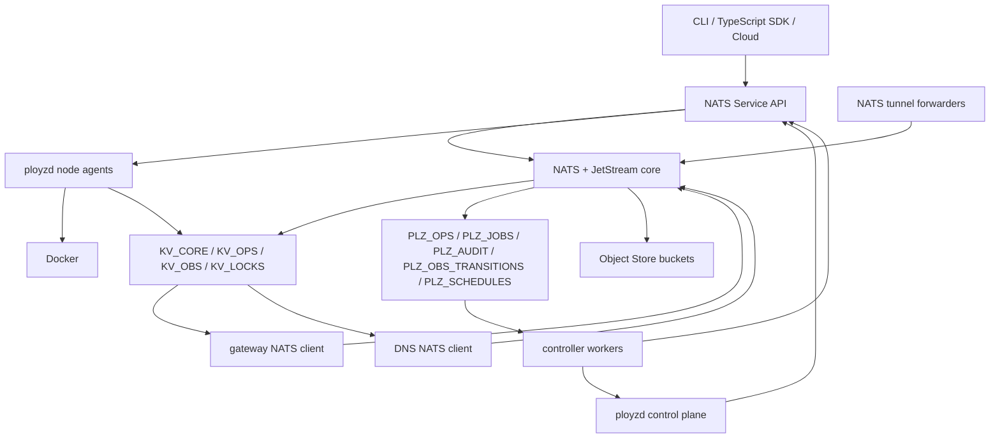

# refactor: Reset Ployz Around A NATS Control Plane

## Summary

Nuke the current Polis/Corrosion-shaped implementation path and rebuild Ployz
as a tiny Rust control plane whose business logic is easy to read because NATS
carries the backplane responsibilities. Keep iroh, but narrow its job: iroh is
the private transport underlay for reaching NATS across NATs and changing
addresses, not the product RPC/state substrate.

The target shape is:

- **NATS Service API** for commands/RPC.
- **JetStream KV** for current state.
- **JetStream streams** for operation history, durable job triggers, audit,
  observation transitions, and schedules.
- **Durable pull consumers and queue groups** for workers/retries.
- **Object Store** for deploy bundles, diagnostics, rendered specs, cert
  bundles, and backup manifests.
- **Message schedules** for cron/delayed work where the pinned NATS version
  supports it, with a tiny scheduler-worker fallback if needed.
- **Subjects and permissions** as the routing/security model.
- **iroh tunnels** as the default private transport for node-to-core NATS
  client connections.

This is not "NATS as the database". Docker remains execution reality. KV is the
small current-state projection. Streams are durable timelines and job triggers.
Ployz code should mostly read as product policy: validate request, create
operation, plan from current facts, call node services, commit only on success,
emit events.

The control plane and data plane stay separate. `ployzd` assures the system and
responds to product services, but gateway, DNS, NATS connectivity, and existing
workloads are not routed through `ployzd`. Data-plane components are
independently supervised NATS clients and keep serving from current or
last-known-good state when `ployzd` is down.

---

## Problem Frame

The current architecture has accumulated too much substrate code before the
product primitive shape has become small and obvious. Polis, Corrosion, iroh
contact snapshots, peer runtime versions, equal-node coordination, and
rpc-stdio are all individually defensible, but together they are becoming a
custom, incomplete version of what NATS already provides.

The product goal is not to prove a substrate. The product goal is a boring
orchestration core for 1-200 machines:

- operation-shaped commands,
- explicit outcomes,
- retained evidence on failure,
- current runtime state that is easy to inspect,
- reliable cloud/CLI/agent consumption,
- little hidden cluster behavior.

The reset keeps the product philosophy from `VISION.md`: primitives, visible
failures, modest scale, no hyperscale controller maze. It replaces the
control-plane substrate mechanism while preserving iroh as the connectivity
underlay.

## Superseded Direction

This plan supersedes the active implementation direction in:

- `docs/architecture/ployz-cloud-backwards-roadmap.md`
- `docs/plans/2026-06-03-001-feat-cloud-mvp-operation-spine-plan.md`
- `docs/plans/2026-06-03-004-feat-status-capabilities-contact-snapshot-plan.md`

Those docs remain useful as records of product constraints, but the new
implementation should not continue building on Polis/Corrosion/iroh peer RPC as
the control-plane substrate. iroh remains in scope only for private connectivity
to NATS and optional later tunnels.

---

## North Star

Business logic should be legible enough that a deploy operation reads like a
plain sequence:

```text
accept request
create operation
acquire deploy lock
load current service state
plan changed containers
run predeploy
start replacements
wait for health
switch route
remove old containers
commit active revision
complete operation
```

The NATS-specific mechanics should be wrapped once and then disappear behind
small adapters:

- service handler registration,
- KV get/create/update/watch,
- stream publish/consume,
- object put/get,
- schedule create/cancel,
- permission profile rendering.
- iroh-backed local NATS port forwarding.

No custom RPC layer. No custom job table. No custom progress channel. No
custom service registry. No custom distributed observation bus. No product
commands over iroh.

---

## Requirements

### Product Behavior

- R1. Every mutating command returns an operation id quickly.
- R2. Every operation has durable events and one explicit terminal state:
  `completed`, `failed`, or `cancelled`.
- R3. Failed deploys preserve useful evidence after container start, including
  node id, container id, retained artifact type, and log access instructions.
- R4. Successful deploys commit active service state only after replacement
  health and route cutover succeed.
- R5. Operators, cloud workflows, CLIs, SDKs, and agents all consume the same
  primitive command surface.
- R6. Cloud/Inngest may orchestrate product workflows, but runtime truth and
  operation outcomes belong to the core.

### NATS Backplane

- R7. User-facing commands are NATS services under stable versioned subjects
  such as `plz.v1.svc.api.deploy.submit` and
  `plz.v1.svc.api.ops.status`.
- R8. Node-local commands are node-scoped services such as
  `plz.v1.svc.node.<node_id>.container.run`; users cannot call them directly.
- R9. KV buckets hold current state only: core truth, observations, operation
  status, and short-lived locks.
- R10. Streams hold operation history, job trigger subjects, audit history,
  observation transitions, and schedule definitions separately.
- R11. Durable pull consumers drive controller work and redelivery.
- R12. Queue groups distribute controller instances without leader election.
- R13. Object Store holds control-plane blobs, not Docker layers or app data.
- R14. Message schedules replace cron/delayed task loops where supported by the
  pinned NATS server; the fallback uses the same target subjects.
- R15. Subject permissions enforce node/controller/user roles.
- R15a. All subjects use the `plz.v1.<plane>.` grammar. Human names,
  hostnames, and route strings do not appear raw in subjects or KV keys; use
  token-safe ids or encoded index keys.
- R15b. Node-owned observations put `<node_id>` immediately after
  `plz.v1.obs.node.` so node credentials can publish only their own
  observation subjects.

### iroh Transport Underlay

- R16. Edge nodes connect to the NATS control plane through iroh by default,
  using a local loopback TCP listener that forwards bytes over an iroh QUIC
  stream to a core-side NATS tunnel proxy.
- R17. `nats-server` and `async-nats` remain unmodified. The iroh tunnel is a
  transport adapter, not a forked NATS protocol implementation.
- R18. NATS credentials, account permissions, and subject permissions remain the
  authority boundary even when the transport is iroh-encrypted.
- R19. Bootstrap material includes node id, NATS credentials, trusted NATS
  server identity/config, and one or more core iroh endpoint addresses/tickets.
- R20. If iroh direct path fails, relay fallback is acceptable for control-plane
  traffic. The system reports whether the current NATS tunnel is direct,
  relayed, reconnecting, or down.
- R21. Public TCP/WebSocket NATS exposure is an optional advanced mode, not the
  default node transport.
- R21a. Separate control plane from data plane. `ployzd` assures the system,
  responds to product services, runs controllers/node RPC, and performs
  mutations. It is not in the steady-state serving path for already-running
  workloads, gateway routing, DNS answers, or NATS client connectivity.
- R21b. Data-plane components are independently supervised NATS clients.
  Gateway and DNS watch NATS directly, apply route/DNS state directly, and keep
  serving from last-known-good state if the control plane is unavailable.
- R21c. Core `ployzd` failure must not imply `nats-server`, gateway, DNS, or
  NATS tunnel failure. Edge `ployzd` failure makes that node's product RPC,
  node services, deploy participation, and observations unavailable, but
  existing workloads and data-plane serving continue.
- R21d. Tunnel loss is represented as connectivity/health state. It is not
  inferred into stored cluster truth and does not mutate current workload state
  without an operation owner.

### Simplicity And Readability

- R22. Business logic modules must be plain Rust structs, enums, and async
  functions; no generic operation engine in v1.
- R23. No trait is added until there are two real implementations or a test
  boundary requires it.
- R24. Operation state machines are enums with typed terminal failure payloads.
- R25. Handlers must not own transport, authorization, orchestration, storage,
  and presentation in one file.
- R26. NATS subject strings are centralized enough to be safe, but not hidden
  behind elaborate type-level subject algebra.

### Reset Scope

- R27. Existing Polis, Corrosion, iroh peer RPC, and rpc-stdio control-plane
  code are not ported by default. New iroh code is limited to endpoint
  identity, join material, and NATS tunnel transport.
- R28. Existing tests are kept only when they validate product semantics that
  still matter.
- R29. The new code path starts from a minimal greenfield Rust skeleton.
- R30. The first complete proof is single-node NATS + one deploy operation
  against a fake Docker executor, then a real Docker executor.

---

## Key Technical Decisions

- KTD1. **NATS is the operating backplane.** Ployz should use NATS primitives
  directly enough that the architecture remains obvious: services for commands,
  KV for current state, streams for timelines/jobs, consumers for work,
  Object Store for blobs, permissions for subject-level authority.

- KTD2. **One NATS domain per cluster in v1.** Regions are labels, not separate
  control planes. NATS gateways, leaf nodes, and domain-per-region coordination
  are deferred.

- KTD3. **Control daemon is not the data plane.** `ployzd` is the control-plane
  assurance/service process: bootstrap, health checks, repair, service
  responders, controllers, and node RPC. Gateway, DNS, NATS tunnel forwarding,
  `nats-server`, and workloads are independently supervised data-plane or
  substrate processes. Only core nodes run `nats-server`.

- KTD4. **NATS server is assured, not embedded.** `ployzd` owns config
  rendering, credentials, stream/KV/Object Store bootstrap, health checks, and
  repair operations. A supervisor such as systemd owns `nats-server` process
  lifetime by default, so core `ployzd` failure does not automatically take
  down the NATS control-plane substrate.

- KTD5. **NATS runs over iroh by default for nodes.** An independently
  supervised local NATS tunnel forwarder exposes a loopback listener on edge
  nodes. `async-nats` clients connect to that local address. The forwarder
  opens an iroh connection to an independently supervised core-side tunnel
  endpoint, which forwards bytes to the local core `nats-server` client
  listener. This keeps NATS native while avoiding public NATS exposure and
  surviving address changes. Tunnel availability is health/connectivity state;
  losing the tunnel pauses that node's NATS access without rewriting cluster
  truth.

- KTD5a. **If `ployzd` owns a runtime dependency, model it as supervision.**
  If a deployment mode makes `ployzd` responsible for starting or restarting
  `nats-server`, gateway, DNS, or tunnel processes, that mode promotes
  `ployzd` into a supervisor for data-plane/substrate dependencies. It must
  then have explicit readiness, restart policy, shutdown ordering, health
  reporting, and recovery tests. This is not the default steady-state
  assumption.

- KTD6. **NATS security still matters over iroh.** iroh authenticates and
  encrypts the tunnel, but NATS credentials and subject permissions remain the
  product authority layer. A valid iroh tunnel without valid NATS credentials
  cannot mutate the cluster.

- KTD7. **Do not run product RPC over iroh.** iroh may carry NATS bytes and
  later explicit debug/file-transfer tunnels. It must not regain deploy,
  machine, status, or peer-command protocols.

- KTD8. **Mutating services create operations, workers execute operations.**
  `plz.v1.svc.api.deploy.submit` validates, publishes the submitted event,
  writes `KV_OPS`, and returns. Durable consumers perform the deploy.

- KTD9. **KV current state is not desired-state reconciliation.** `KV_CORE`
  records active successful state. Pending/failed targets live in `KV_OPS` and
  operation events until a successful commit.

- KTD10. **Use locks only for resource fencing.** Queue groups handle worker
  distribution. KV locks fence resources such as one service deploy, one ACME
  hostname, or one volume mutation.

- KTD11. **Docker is execution reality.** Labels and local SQLite make node
  reality inspectable and mostly rebuildable. KV is the cluster's current
  control-plane view, not a substitute for Docker inspection.

- KTD12. **No WorkQueue retention for deploy timelines.** Deploy operations need
  retained history. WorkQueue streams are acceptable later for disposable jobs,
  but not for `PLZ_OPS`.

- KTD12a. **Operation timelines and generic jobs are separate streams.**
  `PLZ_OPS` binds only `plz.v1.op.>`. `PLZ_JOBS` binds
  `plz.v1.job.>`. Deploy submitted events may still be consumed from
  `PLZ_OPS`, but scheduled/internal work uses job subjects with their own
  retention and permissions.

- KTD13. **Schedules are a capability gate.** NATS 2.12 introduced message
  schedules and 2.14 extends them. If the pinned server does not satisfy the
  needed behavior, build one tiny scheduler worker that publishes the same job
  subjects and delete it later.

- KTD14. **Rust remains appropriate only with restraint.** The greenfield Rust
  version should avoid framework-heavy control flow, broad traits, service
  registries, and generic operation executors.

---

## External Source Checks

Verified planning inputs:

- NATS Service API supports service metadata and discovery through
  `$SRV.PING`, `$SRV.STATS`, and `$SRV.INFO`:
  https://docs.nats.io/using-nats/developer/services
- The NATS client protocol is spoken after establishing a TCP/IP socket, and
  NATS also supports WebSocket connectivity; Ployz's iroh path therefore uses a
  local TCP byte tunnel rather than modifying NATS:
  https://docs.nats.io/reference/reference-protocols/nats-protocol and
  https://docs.nats.io/nats-concepts/connectivity
- NATS queue groups provide built-in load balancing, fault tolerance, and
  no-responder behavior for request/reply:
  https://docs.nats.io/nats-concepts/core-nats/queue
- JetStream KV supports buckets, create/update CAS operations, TTL limits,
  watches, and history; direct gets do not guarantee read-your-writes:
  https://docs.nats.io/nats-concepts/jetstream/key-value-store
- JetStream consumers provide durable state, acknowledgements, redelivery, and
  pull consumers are recommended for new scalable/error-handled projects:
  https://docs.nats.io/nats-concepts/jetstream/consumers
- JetStream WorkQueue retention removes messages after consumer acknowledgement:
  https://docs.nats.io/using-nats/developer/develop_jetstream/model_deep_dive
- Object Store stores files in chunks, can watch bucket changes, and is not a
  distributed storage system:
  https://docs.nats.io/nats-concepts/jetstream/obj_store
- Subject-level permissions and `allow_responses` support service responder
  patterns:
  https://docs.nats.io/running-a-nats-service/configuration/securing_nats/authorization
- System accounts emit server/account events and expose request endpoints for
  status/debugging:
  https://docs.nats.io/running-a-nats-service/configuration/sys_accounts
- NATS 2.12 introduced `AllowMsgSchedules`; schedule headers require stream
  support:
  https://docs.nats.io/release-notes/whats_new/whats_new_212 and
  https://docs.nats.io/nats-concepts/jetstream/headers
- `async-nats` exposes JetStream, KV, Object Store, and Service API from Rust:
  https://docs.rs/async-nats/latest/index.html
- As of 2026-06-04, GitHub reports `nats-server` latest release `v2.14.2`,
  published 2026-06-02:
  https://github.com/nats-io/nats-server/releases/tag/v2.14.2
- iroh connects by stable endpoint public keys, uses QUIC, handles NAT
  traversal, and falls back to relays when direct connections are unavailable:
  https://www.iroh.computer/docs/overview,
  https://docs.iroh.computer/concepts/nat-traversal, and
  https://www.iroh.computer/docs/concepts/relay
- iroh exposes QUIC stream APIs suitable for building byte-stream tunnels:
  https://docs.iroh.computer/protocols/using-quic

---

## Target Architecture

### Component Topology



Every machine can run `ployzd` for control-plane assurance, service response,
and node RPC. Only core nodes run `nats-server`. Gateway, DNS, and NATS tunnel
forwarders are independent NATS clients/processes supervised outside `ployzd`.
Controllers usually run on core nodes, but controller authority comes from
credentials and queue consumers, not process identity.

### Control Plane And Data Plane

```text
control plane:
  ployzd service responders
  operation controllers and workers
  node RPC services
  bootstrap, health checks, repair, config rendering

substrate:
  nats-server
  JetStream KV/streams/Object Store
  NATS tunnel forwarding

data plane:
  Docker containers
  gateway route serving
  DNS serving
  last-known-good local runtime config
```

Control-plane failure stops new mutations that need `ployzd`, such as deploy
steps or node RPC. It does not stop NATS clients from staying connected, and it
does not stop data-plane components from serving. If NATS state changes while
`ployzd` is down, gateway and DNS still see those changes through their own
NATS subscriptions and apply them directly.

### Scale Modes

```text
1 node:
  ployzd
  nats-server --jetstream
  nats tunnel forwarder if needed
  gateway / DNS if configured
  docker

2 nodes:
  node 1 = core
  node 2 = edge
  not HA

3-200 nodes:
  core-1/core-2/core-3 = NATS + JetStream quorum
  edges = ployzd agent/control, gateway, DNS, tunnel, runtime as separate roles
```

Do not pretend two nodes are HA. Two is transitional.

### State Layers

```text
Docker
  execution reality: containers, logs, health, volumes, networks

Docker labels
  emergency discovery: service id, revision, operation id, step id

local SQLite
  node-local cache: created containers, sanitized specs, local evidence

NATS JetStream
  cluster authority: current state, operation status, events, audit, locks
```

Local SQLite is rebuildable. NATS backup is canonical for control-plane state.
Docker labels make recovery possible when either local DB or NATS observations
are stale.

---

## NATS Buckets, Streams, And Subjects

### KV Buckets

```text
KV_CORE
  domain.config
  machines.<node_id>
  machines.<node_id>.roles
  machines.by_name.<encoded_name>
  services.<service_id>
  services.by_name.<encoded_name>
  revisions.<service_id>.<revision_id>
  routes.<route_id>
  routes.by_host.<encoded_hostname>.<port>
  certs.<cert_id>
  certs.by_host.<encoded_hostname>
  schedules.<schedule_id>

KV_OPS
  ops.<op_id>

KV_OBS
  nodes.<node_id>.heartbeat
  nodes.<node_id>.resources
  nodes.<node_id>.public_ip
  containers.<node_id>.<container_id>
  gateways.<node_id>.status
  dns.<node_id>.status

KV_LOCKS
  deploy.<service_id>
  acme.<cert_id>
  volume.<volume_id>
  core_change
```

Hostnames, service names, and arbitrary route names are payload fields or
encoded index keys, not raw subject/KV tokens. Dots, slashes, and wildcard
characters must not leak into the key grammar.

Lock values carry:

```text
holder
operation_id
epoch
expires_at
```

Destructive or exclusive node calls carry the lock epoch where relevant. Stale
epochs are rejected.

### Streams

```text
PLZ_OPS
  plz.v1.op.>

PLZ_JOBS
  plz.v1.job.>

PLZ_AUDIT
  plz.v1.audit.>

PLZ_OBS_TRANSITIONS
  plz.v1.obs.node.<node_id>.>

PLZ_SCHEDULES
  plz.v1.sched.>
```

`PLZ_OPS` is retained operation history. Deploy workers consume
`plz.v1.op.*.deploy.submitted` through durable pull consumers. Generic
scheduled/internal jobs use `PLZ_JOBS` so trigger retention, retry semantics,
permissions, and compaction can diverge from operation timelines.

`PLZ_OBS_TRANSITIONS` stores important transitions only. Latest health goes to
`KV_OBS`; health ticks do not flood replicated durable history.

Observation subjects put node ownership first:

```text
plz.v1.obs.node.node_7.heartbeat.updated
plz.v1.obs.node.node_7.public_ip.changed
plz.v1.obs.node.node_7.container.ctr_abc.running
plz.v1.obs.node.node_7.container.ctr_abc.health_failed
plz.v1.obs.node.node_7.gateway.routes_applied
```

Schedules are timer definitions; their targets are jobs:

```text
plz.v1.sched.cert.renew.<cert_id>
  -> plz.v1.job.cert.renew.<cert_id>

plz.v1.sched.node.ip_probe.<node_id>
  -> plz.v1.job.node.ip_probe.<node_id>

plz.v1.sched.gc.images.global
  -> plz.v1.job.gc.images.global
```

### User-Facing Services

```text
plz.v1.svc.api.deploy.submit
plz.v1.svc.api.deploy.plan
plz.v1.svc.api.ops.status
plz.v1.svc.api.ops.watch
plz.v1.svc.api.ops.cancel
plz.v1.svc.api.ops.list
plz.v1.svc.api.service.inspect
plz.v1.svc.api.service.list
plz.v1.svc.api.service.remove
plz.v1.svc.api.service.scale
plz.v1.svc.api.machine.add
plz.v1.svc.api.machine.list
plz.v1.svc.api.machine.inspect
plz.v1.svc.api.cert.ensure
```

Mutating services return:

```text
operation_id
status = accepted
event_subject = plz.v1.op.<op_id>.>
start_sequence
```

### Node Services

```text
plz.v1.svc.node.<node_id>.inspect
plz.v1.svc.node.<node_id>.container.run
plz.v1.svc.node.<node_id>.container.stop
plz.v1.svc.node.<node_id>.container.remove
plz.v1.svc.node.<node_id>.container.start
plz.v1.svc.node.<node_id>.predeploy.run
plz.v1.svc.node.<node_id>.logs.tail
plz.v1.svc.node.<node_id>.volume.create
plz.v1.svc.node.<node_id>.volume.remove
```

Node services are coarse, local, and idempotent. They do not decide placement,
deploy policy, route policy, or cleanup policy.

Controller/internal services use a third service plane:

```text
plz.v1.svc.ctrl.cert.renew
plz.v1.svc.ctrl.gateway.reload
plz.v1.svc.ctrl.backup.create
```

---

## Greenfield Rust Structure

Target workspace after reset:

```text
crates/
  ployz-core/
    src/
      ids.rs
      subjects.rs
      time.rs
      state/
      ops/
      deploy/
      node/
      security/
  ployz-nats/
    src/
      connect.rs
      bootstrap.rs
      kv.rs
      streams.rs
      objects.rs
      services.rs
      schedules.rs
      permissions.rs
  ployz-transport/
    src/
      iroh_endpoint.rs
      nats_tunnel.rs
      join_bundle.rs
  ployz-nats-tunnel/
    src/
      main.rs
  ployzd/
    src/
      main.rs
      config.rs
      nats_process.rs
      app.rs
      services/
      controllers/
      node_agent/
      docker/
  ployz-gateway/
    src/
      main.rs
      projection.rs
  ployz-dns/
    src/
      main.rs
      projection.rs
  ployzctl/
    src/
      main.rs
      commands/
  ployz-sdk-types/
    src/
      lib.rs
```

Rules:

- `ployz-core` has domain types, operation models, deploy planning, and
  subject naming.
- `ployz-nats` wraps `async-nats` and owns bootstrapping.
- `ployz-transport` owns iroh endpoint identity, NATS byte tunnels, and join
  bundle encoding.
- `ployz-nats-tunnel` is the independently supervised NATS-over-iroh byte
  forwarder for edge loopback listeners and core tunnel endpoints.
- `ployzd` wires processes, credentials, service handlers, controllers, node
  agent, Docker, and assurance/repair checks.
- `ployz-gateway` is a data-plane NATS client that watches route/container/cert
  state and serves last-known-good routes independently of `ployzd`.
- `ployz-dns` is a data-plane NATS client that watches DNS/cert state and
  serves last-known-good answers independently of `ployzd`.
- `ployzctl` is a client, not an orchestrator.
- `ployz-sdk-types` is the public schema surface for generated TypeScript
  bindings.

---

## Bootstrap Flows

### `ployz init`

```text
ployz init
  generate domain id
  generate NATS operator/account/users
  generate local core iroh endpoint identity
  render nats-server config
  install or update nats-server supervisor unit
  wait for supervised nats-server with JetStream
  bootstrap KV/streams/Object Store
  install or update core-side NATS tunnel supervisor unit
  install or update ployzd supervisor unit
  install or update gateway/DNS supervisor units if configured
  register NATS services
  write local machine record
  begin KV_OBS heartbeat
```

On the first node, `async-nats` can connect directly to local `nats-server`.
The iroh tunnel is still started immediately so added machines have one stable
join target that survives public IP changes.

### `ployz machine add`

```text
ployz machine add user@host --name node-2
  call plz.v1.svc.api.machine.add
  receive op_id
  controller creates pending machine operation
  controller creates node-scoped NATS user/creds
  controller creates join bundle:
    domain id
    node id
    trusted NATS server identity/config
    node NATS creds
    core iroh endpoint address/ticket list
    relay map / relay policy
  controller performs one install/contact event
  installer writes ployzd config and join bundle
  installer writes tunnel config
  installer starts supervised NATS tunnel forwarder
  installer starts supervised ployzd
  target async-nats connects to localhost tunnel
  target registers plz.v1.svc.node.<node_id>.*
  target writes KV_OBS key `nodes.<node_id>.heartbeat`
  controller requests plz.v1.svc.node.<node_id>.inspect
  controller marks machine active in KV_CORE
  operation completes
```

The bootstrap problem remains one install/contact event. NATS-native helps
after that event: the new node proves itself by connecting to NATS, responding
to a node service, and publishing observations. iroh keeps that NATS path
private and stable across NATs and address changes.

### NATS Over iroh Shape

```text
edge NATS clients
  async-nats
    -> 127.0.0.1:<ephemeral>
      -> supervised local NATS tunnel forwarder
        -> iroh QUIC stream
          -> supervised core NATS tunnel endpoint
            -> 127.0.0.1:4222 nats-server
```

This is byte forwarding, not a second RPC protocol. NATS service discovery,
request/reply, KV, streams, consumers, Object Store, schedules, and permissions
all behave as normal NATS features. The tunnel is part of NATS connectivity,
not `ployzd` service response.

---

## Kill List

### Delete Or Archive

- `crates/polis/`
- Corrosion schemas, adapters, tests, and process boot.
- iroh product peer runtime, product peer RPC, and status/contact snapshot code.
- `rpc-stdio` as the primary control-plane protocol.
- Old daemon substrate boot that starts Corrosion/iroh.
- Old equal-node peer command routing.
- WireGuard control-plane experiments from v1 scope.
- Any test-only operation registry or mode that leaks into production status.

### Keep As Product Reference Only

- `VISION.md`
- Operation primitive philosophy from old plans.
- Failure-audience language and retained deploy artifact semantics.
- Existing deploy tests only if they encode product behavior that still applies.
- Rust discipline in `AGENTS.md`: typed states, enums over option bags, explicit
  timeouts, structured failures.

### Update Documentation

- Mark the old Polis/Corrosion/iroh-peer-RPC roadmap docs as superseded by this
  plan.
- Add a short architecture note explaining "NATS backplane, Ployz policy".
- Replace substrate vocabulary in active plans with NATS buckets, streams,
  services, consumers, permissions, and iroh NATS transport.

---

## Implementation Units

### Pre-U0. Thermonuclear Repository Cull

- **Goal:** Delete as much old implementation code as possible before creating
  the new shape, so the reset cannot quietly inherit old substrate assumptions.
- **Requirements:** R22, R23, R27, R28, R29
- **Dependencies:** none
- **Files:**
  - `Cargo.toml`
  - `crates/polis/`
  - `crates/ployz-api/`
  - `crates/ployzd/src/`
  - `crates/ployz-runtime-backends/`
  - `crates/ployz/src/adapters/`
  - `crates/ployz/src/`
  - `docs/architecture/ployz-cloud-backwards-roadmap.md`
  - `docs/plans/2026-06-03-001-feat-cloud-mvp-operation-spine-plan.md`
  - `docs/plans/2026-06-03-004-feat-status-capabilities-contact-snapshot-plan.md`
- **Approach:** Start with a delete-first pass. Remove active workspace members
  whose reason to exist was Polis, Corrosion, iroh peer RPC, rpc-stdio, the old
  runtime backend model, or the old operation spine. Keep files only when they
  are obviously reusable product documentation, public identity/value types, or
  tests that express product semantics independent of the old substrate. When
  in doubt, delete and recover from git if a later implementation unit proves a
  real need.
- **Cull rules:**
  - Delete code that imports or abstracts over Corrosion.
  - Delete product RPC over iroh, peer command routing, contact snapshots, and
    old ticket/status surfaces.
  - Delete rpc-stdio control-plane handlers and protocol DTOs.
  - Delete fake/test operation kinds that made it into production-shaped
    registries.
  - Delete runtime backend abstractions that exist to support old deploy
    semantics.
  - Delete compatibility shims, migration paths, and old command aliases.
  - Keep `VISION.md`, `AGENTS.md`, and this plan.
  - Keep only tests that can be restated as NATS-backplane product behavior.
- **Test scenarios:**
  - `git diff --stat` shows deletion-dominant change before new code appears.
  - `rg "corrosion|Corrosion|polis::|rpc-stdio|rpc_stdio|peer RPC|contact snapshot"` has no hits in active Rust source after the cull, except archived docs explicitly marked superseded.
  - Workspace members in `Cargo.toml` point only at crates that will exist in
    the greenfield shape or intentionally preserved docs/tests.
  - No active crate depends on old `polis`, `corro-client`, iroh peer-RPC
    modules, or runtime backend facades.
- **Verification:** `cargo metadata --no-deps` succeeds after the cull target
  workspace is reduced; full tests are not expected to pass until U0 rebuilds a
  compiling skeleton.

### U0. Repository Reset And Decision Fence

- **Goal:** Stop the old implementation path and create the greenfield
  workspace skeleton.
- **Requirements:** R22, R23, R27, R28, R29
- **Dependencies:** Pre-U0
- **Files:**
  - `Cargo.toml`
  - `crates/ployz-core/src/lib.rs`
  - `crates/ployz-nats/src/lib.rs`
  - `crates/ployz-transport/src/lib.rs`
  - `crates/ployz-nats-tunnel/src/main.rs`
  - `crates/ployzd/src/main.rs`
  - `crates/ployz-gateway/src/main.rs`
  - `crates/ployz-dns/src/main.rs`
  - `crates/ployzctl/src/main.rs`
  - `crates/ployz-sdk-types/src/lib.rs`
  - `docs/architecture/nats-control-plane.md`
- **Approach:** Remove old substrate crates from the active workspace and add
  empty, compiling crates with the new ownership boundaries. Do not port old
  modules by default. Preserve old docs for reference and explicitly mark them
  superseded.
- **Test scenarios:**
  - `cargo test --workspace` compiles the greenfield skeleton.
  - No active crate imports `polis`, `corrosion`, or old iroh peer-RPC code.
  - Architecture doc names NATS as the v1 control-plane substrate and iroh as
    the default NATS transport underlay.
- **Verification:** `cargo test --workspace`

### U1. NATS Process And Bootstrap Spine

- **Goal:** Let one `ployzd` assure a supervised `nats-server`, connect to it,
  then bootstrap the required JetStream resources.
- **Requirements:** R7, R9, R10, R13, R14, R17
- **Dependencies:** U0
- **Files:**
  - `crates/ployz-nats/src/connect.rs`
  - `crates/ployz-nats/src/bootstrap.rs`
  - `crates/ployz-nats/src/kv.rs`
  - `crates/ployz-nats/src/streams.rs`
  - `crates/ployz-nats/src/objects.rs`
  - `crates/ployz-nats/src/schedules.rs`
  - `crates/ployzd/src/nats_process.rs`
  - `crates/ployzd/tests/nats_bootstrap.rs`
- **Approach:** Pin a minimum NATS server version. Render a local single-node
  config first and expose the command/supervisor material needed to run it, but
  keep `nats-server` process lifetime as an external supervisor concern by
  default. `ployzd` connects, checks health/capabilities, and creates
  `KV_CORE`, `KV_OPS`, `KV_OBS`, `KV_LOCKS`, `PLZ_OPS`, `PLZ_JOBS`,
  `PLZ_AUDIT`, `PLZ_OBS_TRANSITIONS`, `PLZ_SCHEDULES`, and Object Store buckets.
  Detect whether message schedules are available and expose that as a typed
  capability.
- **Test scenarios:**
  - Fresh data dir boot creates all buckets and streams exactly once.
  - Reboot against the same data dir adopts existing resources.
  - `ployzd` restart reconnects to the existing supervised `nats-server` and
    adopts existing resources.
  - Bootstrap refuses to proceed when JetStream is unavailable.
  - Schedule capability is true only when the server reports support.
  - Stream retention for `PLZ_OPS` preserves acknowledged operation events.
- **Verification:** `cargo test -p ployz-nats && cargo test -p ployzd nats_bootstrap`

### U1a. iroh NATS Tunnel Transport

- **Goal:** Let edge nodes connect to NATS through iroh while keeping
  `nats-server` and `async-nats` standard.
- **Requirements:** R16, R17, R18, R19, R20, R21
- **Dependencies:** U1
- **Files:**
  - `crates/ployz-transport/src/iroh_endpoint.rs`
  - `crates/ployz-transport/src/nats_tunnel.rs`
  - `crates/ployz-transport/src/join_bundle.rs`
  - `crates/ployz-nats-tunnel/src/main.rs`
  - `crates/ployz-nats/src/connect.rs`
  - `crates/ployz-nats-tunnel/tests/iroh_nats_tunnel.rs`
- **Approach:** The supervised core tunnel process accepts a dedicated iroh
  protocol for NATS byte forwarding and proxies each stream to local
  `nats-server`. The supervised edge tunnel process starts a local loopback TCP
  listener and forwards accepted sockets over iroh. `async-nats` clients,
  including `ployzd`, gateway, and DNS, connect to the loopback address with
  normal NATS credentials. Tunnel state is observable but not cluster truth.
  Tunnel loss marks that node's connectivity unavailable; it does not mutate
  current workload state.
- **Test scenarios:**
  - Edge `async-nats` connects through loopback tunnel and can call
    `plz.v1.svc.api.ops.status`.
  - Invalid NATS credentials fail even when the iroh tunnel connects.
  - Tunnel reconnects after the iroh connection drops.
  - Tunnel status reports direct, relayed, reconnecting, and down states.
  - Edge `ployzd` loss leaves tunnel connectivity available for other local
    NATS clients.
  - Join bundle redaction never prints full NATS credentials or private keys.
- **Verification:** `cargo test -p ployz-transport && cargo test -p ployz-nats-tunnel`

### U2. Typed Subjects, IDs, And Wire Models

- **Goal:** Define the small public model that all services, KV records, and
  operation events use.
- **Requirements:** R1, R2, R22, R24, R26
- **Dependencies:** U0
- **Files:**
  - `crates/ployz-core/src/ids.rs`
  - `crates/ployz-core/src/subjects.rs`
  - `crates/ployz-core/src/state/mod.rs`
  - `crates/ployz-core/src/ops/model.rs`
  - `crates/ployz-core/src/ops/event.rs`
  - `crates/ployz-core/src/deploy/model.rs`
  - `crates/ployz-sdk-types/src/lib.rs`
  - `crates/ployz-core/tests/wire_contract.rs`
- **Approach:** Use newtypes for ids and enums for operation state/failure.
  Centralize subject construction with normal functions. Do not build a
  generic subject type system. Keep schemas serde-friendly and TypeScript-ready.
- **Test scenarios:**
  - Operation states serialize with stable wire names.
  - Failed retained artifact is variant-specific data, not optional fields.
  - Subject constructors reject empty ids and invalid subject tokens.
  - Adding a new operation state forces explicit conversion updates.
- **Verification:** `cargo test -p ployz-core && cargo test -p ployz-sdk-types`

### U3. NATS Service API Command Surface

- **Goal:** Register user-facing and node-facing service endpoints through
  NATS Service API.
- **Requirements:** R7, R8, R15, R25
- **Dependencies:** U1, U1a, U2
- **Files:**
  - `crates/ployz-nats/src/services.rs`
  - `crates/ployzd/src/services/mod.rs`
  - `crates/ployzd/src/services/deploy.rs`
  - `crates/ployzd/src/services/ops.rs`
  - `crates/ployzd/src/services/node.rs`
  - `crates/ployzd/tests/services.rs`
- **Approach:** Register services with names, versions, endpoints, and
  metadata. Implement `ops.status`, `ops.watch`, and `node.inspect` first.
  Mutating service handlers call the operation acceptor; they do not perform
  long-running work inline.
- **Test scenarios:**
  - `$SRV.PING` can discover registered Ployz services.
  - `ops.status` returns no such operation for unknown ids.
  - Calling a node service with no responder returns a typed node-unavailable
    error.
  - Mutating service handler returns before work starts.
- **Verification:** `cargo test -p ployzd services`

### U4. Operation Stream, Status Store, And Worker Consumer

- **Goal:** Prove the core operation contract on NATS.
- **Requirements:** R1, R2, R10, R11, R12
- **Dependencies:** U1, U2, U3
- **Files:**
  - `crates/ployz-core/src/ops/status.rs`
  - `crates/ployz-core/src/ops/event.rs`
  - `crates/ployz-nats/src/streams.rs`
  - `crates/ployzd/src/controllers/ops.rs`
  - `crates/ployzd/src/services/ops.rs`
  - `crates/ployzd/tests/operation_spine.rs`
- **Approach:** `deploy.submit` publishes a durable submitted event with
  `Nats-Msg-Id`, writes KV_OPS key `ops.<op_id>`, and returns `op_id`. A
  durable pull consumer reads submitted events and moves the operation through
  a fake state machine.
- **Test scenarios:**
  - Duplicate submit with the same idempotency key returns the same operation.
  - Unacked submitted event redelivers after worker crash.
  - `ops.watch` replays events from `start_sequence`.
  - `KV_OPS` contains the latest operation status and last event sequence.
  - Terminal operation status cannot return to running.
- **Verification:** `cargo test -p ployzd operation_spine`

### U5. Permission Profiles And Credentials

- **Goal:** Make NATS subject permissions enforce the basic security boundary.
- **Requirements:** R8, R15, R18
- **Dependencies:** U1, U1a, U2, U3
- **Files:**
  - `crates/ployz-core/src/security/roles.rs`
  - `crates/ployz-nats/src/permissions.rs`
  - `crates/ployzd/src/config.rs`
  - `crates/ployzd/tests/permissions.rs`
- **Approach:** Render node, controller, user, and system-account permission
  profiles. Start with one account unless hosted multi-tenant requires account
  separation. Use subject allow/deny and `allow_responses` for responders.
- **Test scenarios:**
  - Node credential can subscribe/respond only to
    `plz.v1.svc.node.<self>.>`.
  - Node credential can publish only `plz.v1.obs.node.<self>.>` observation
    subjects.
  - Node credential cannot write `KV_CORE` or call
    `plz.v1.svc.node.<other>.>`.
  - Controller credential can consume `plz.v1.op.*.deploy.submitted`, consume
    `plz.v1.job.>`, and call `plz.v1.svc.node.*.>`.
  - User credential can call `plz.v1.svc.api.>` and cannot call node or
    controller services.
  - System credential can query NATS system events.
- **Verification:** `cargo test -p ployzd permissions`

### U6. Node Agent, Docker Observer, And Local Cache

- **Goal:** Make every edge node expose local node services and publish current
  observations.
- **Requirements:** R3, R8, R9, R13, R30
- **Dependencies:** U1, U1a, U2, U3, U5
- **Files:**
  - `crates/ployzd/src/node_agent/mod.rs`
  - `crates/ployzd/src/node_agent/observer.rs`
  - `crates/ployzd/src/docker/client.rs`
  - `crates/ployzd/src/docker/labels.rs`
  - `crates/ployzd/src/docker/local_db.rs`
  - `crates/ployzd/tests/node_agent.rs`
  - `crates/ployzd/tests/docker_observer.rs`
- **Approach:** Start with a fake Docker executor for operation tests, then add
  the real local Docker socket path. Observer writes latest container/node
  facts to `KV_OBS` and emits only important transitions.
- **Test scenarios:**
  - Docker event creates or updates KV_OBS key
    `containers.<node>.<container>`.
  - Periodic full sync corrects missed Docker events.
  - Managed containers include required Ployz labels.
  - Local SQLite can rebuild a cache entry from Docker labels plus KV service
    revision.
  - Node services are idempotent for repeated `operation_id + step_id`.
- **Verification:** `cargo test -p ployzd node_agent docker_observer`

### U7. First Deploy Operation

- **Goal:** Ship the smallest real deploy primitive with retained failure
  evidence and commit-on-success semantics.
- **Requirements:** R1, R2, R3, R4, R5, R6, R22, R24, R30
- **Dependencies:** U4, U6
- **Files:**
  - `crates/ployz-core/src/deploy/planner.rs`
  - `crates/ployz-core/src/deploy/steps.rs`
  - `crates/ployzd/src/controllers/deploy.rs`
  - `crates/ployzd/src/services/deploy.rs`
  - `crates/ployzd/tests/deploy_operation.rs`
  - `crates/ployzd/tests/deploy_failure_retention.rs`
- **Approach:** Implement one sequential deploy path first. Plan from
  `KV_CORE` active state plus `KV_OBS`/node inspection. Call node services for
  container run/start/stop/remove. Wait for health. Commit active service state
  to `KV_CORE` only after success.
- **Test scenarios:**
  - New service deploy creates container, waits healthy, commits active state,
    and marks operation completed.
  - Start-first replacement keeps old container running until new container is
    healthy.
  - Health failure after container start stops and retains the failed new
    container and marks operation failed.
  - Failed deploy does not overwrite active service state.
  - Next successful deploy plans from reality and can remove stale failed
    artifacts.
  - Worker crash after container create resumes idempotently.
- **Verification:** `cargo test -p ployzd deploy_operation deploy_failure_retention`

### U8. Gateway, DNS, And Cert Projection Skeleton

- **Goal:** Build independently supervised data-plane projections over KV
  rather than controller-owned runtime state.
- **Requirements:** R4, R9, R10, R14
- **Dependencies:** U6, U7
- **Files:**
  - `crates/ployz-gateway/src/main.rs`
  - `crates/ployz-gateway/src/projection.rs`
  - `crates/ployz-gateway/tests/gateway_projection.rs`
  - `crates/ployz-dns/src/main.rs`
  - `crates/ployz-dns/src/projection.rs`
  - `crates/ployz-dns/tests/dns_projection.rs`
  - `crates/ployzd/src/controllers/cert.rs`
  - `crates/ployzd/tests/cert_operation.rs`
- **Approach:** Gateway watches KV_CORE keys `routes.>` and `certs.>`, plus
  KV_OBS keys `containers.>` through its own NATS client; it serves and applies
  route changes independently of `ployzd`. DNS watches DNS/cert state through
  its own NATS client and keeps last-known-good answers. Cert controller remains
  control plane: it uses KV_LOCKS key `acme.<cert_id>`, Object Store encrypted
  bundles, and schedule/job subjects.
- **Test scenarios:**
  - Gateway filters unhealthy/stale containers locally.
  - Gateway keeps last good route config when NATS connection drops.
  - Gateway continues serving and applying NATS route changes while `ployzd` is
    down.
  - DNS continues answering and applying NATS record changes while `ployzd` is
    down.
  - Cert operation writes challenge state with TTL and updates cert KV only
    after ACME success.
  - Failed cert renewal leaves prior cert active.
  - Cert schedule targets the same job subject as fallback scheduler.
- **Verification:** `cargo test -p ployz-gateway && cargo test -p ployz-dns && cargo test -p ployzd cert_operation`

### U9. CLI And TypeScript SDK Contract

- **Goal:** Give cloud and humans ergonomic access without moving
  orchestration into TypeScript.
- **Requirements:** R5, R6, R7, R22
- **Dependencies:** U2, U3, U4, U7
- **Files:**
  - `crates/ployzctl/src/commands/deploy.rs`
  - `crates/ployzctl/src/commands/ops.rs`
  - `crates/ployz-sdk-types/src/lib.rs`
  - `packages/ployz-sdk/src/index.ts`
  - `packages/ployz-sdk/test/operations.test.ts`
  - `crates/ployzctl/tests/cli_contract.rs`
- **Approach:** Rust owns schemas and wire DTOs. TypeScript exposes a small
  ergonomic `OperationHandle` over generated types: submit, watch, status,
  cancel. Complex cloud workflows remain in Inngest calling core primitives.
- **Test scenarios:**
  - Generated TypeScript types match Rust schemas.
  - SDK deploy returns an operation handle with `watch()` and `status()`.
  - CLI `deploy --detach` prints operation id.
  - CLI `ops watch <op_id>` replays persisted events.
  - SDK does not call node services directly.
- **Verification:** `cargo test -p ployzctl && pnpm --dir packages/ployz-sdk test`

### U10. HA Promotion And Backup

- **Goal:** Support the 1-node to 3-core transition without hiding HA
  complexity.
- **Requirements:** R9, R10, R15
- **Dependencies:** U1, U5, U7
- **Files:**
  - `crates/ployzd/src/controllers/core.rs`
  - `crates/ployzctl/src/commands/core.rs`
  - `crates/ployzctl/src/commands/backup.rs`
  - `crates/ployzd/tests/ha_promotion.rs`
  - `crates/ployzd/tests/backup_restore.rs`
- **Approach:** `ha enable` selects three explicit eligible nodes, configures
  NATS clustering, moves streams/KV to replicas=3, verifies quorum, and reports
  2-core as transitional/degraded. Backup snapshots JetStream state, NATS
  credentials/config, and Ployz domain config.
- **Test scenarios:**
  - One-node mode reports non-HA healthy.
  - Two-core final state reports invalid/degraded.
  - Three-core mode creates R3 streams/buckets and survives one core down.
  - Backup excludes Docker images and app volumes.
  - Restore recreates KV/streams/object metadata needed for service inspect.
- **Verification:** `cargo test -p ployzd ha_promotion backup_restore`

---

## Stress Test Matrix

| Scenario | Expected Behavior | Test Target |
| --- | --- | --- |
| NATS unavailable during new deploy | Existing containers continue; new mutation fails closed | `crates/ployzd/tests/failure_core_down.rs` |
| Core `ployzd` down | NATS clients stay connected; gateway/DNS keep serving; product RPC needing `ployzd` has no responder | `crates/ployzd/tests/control_plane_down.rs` |
| Edge `ployzd` down | Existing containers continue; gateway/DNS/tunnel keep serving; node services unavailable | `crates/ployzd/tests/node_unavailable.rs` |
| iroh tunnel down on edge | Existing containers and last-good gateway/DNS continue; node NATS connectivity reports down | `crates/ployz-nats-tunnel/tests/iroh_nats_tunnel.rs` |
| iroh path switches direct to relay | NATS reconnects or continues; tunnel status reports relayed | `crates/ployz-nats-tunnel/tests/iroh_nats_tunnel.rs` |
| Valid iroh tunnel with bad NATS creds | NATS connection fails authorization; node cannot mutate cluster | `crates/ployzd/tests/permissions.rs` |
| Gateway loses NATS | Last good config stays active; degraded status is visible | `crates/ployz-gateway/tests/gateway_projection.rs` |
| DNS loses NATS | Last good answers stay active; degraded status is visible | `crates/ployz-dns/tests/dns_projection.rs` |
| Route KV changes while `ployzd` is down | Gateway applies the NATS change because it watches NATS directly | `crates/ployz-gateway/tests/gateway_projection.rs` |
| DNS KV changes while `ployzd` is down | DNS applies the NATS change because it watches NATS directly | `crates/ployz-dns/tests/dns_projection.rs` |
| Deploy worker crashes before ack | Durable consumer redelivers submitted event | `crates/ployzd/tests/operation_spine.rs` |
| Deploy worker retries after container create | Node service returns existing step result | `crates/ployzd/tests/deploy_operation.rs` |
| No responder for node command | Operation marks node unavailable or ambiguous with audience | `crates/ployzd/tests/node_unavailable.rs` |
| Node service timeout | Worker inspects observations; ambiguous state fails visibly | `crates/ployzd/tests/node_timeout.rs` |
| KV lock epoch stale | Node rejects destructive/exclusive command | `crates/ployzd/tests/locks.rs` |
| KV CAS conflict | Controller retries boundedly or fails with conflict | `crates/ployzd/tests/kv_conflict.rs` |
| Duplicate deploy submit | Same idempotency key returns same op id | `crates/ployzd/tests/operation_spine.rs` |
| Health failure after start | Failed container retained, active state unchanged | `crates/ployzd/tests/deploy_failure_retention.rs` |
| Public IP changes | `KV_OBS` updates and DNS/cert jobs are triggered | `crates/ployzd/tests/public_ip_change.rs` |
| Object Store bundle missing | Operation fails before runtime mutation | `crates/ployzd/tests/bundle_missing.rs` |
| Schedule unsupported by server | Fallback scheduler publishes same job subject | `crates/ployzd/tests/scheduler_fallback.rs` |
| 2-core HA requested | Command refuses final healthy state | `crates/ployzd/tests/ha_promotion.rs` |
| 3-core one node down | Mutations continue if quorum remains | `crates/ployzd/tests/ha_promotion.rs` |

---

## Readability Gates

These are merge criteria, not style preferences:

- Deploy controller logic must fit in a small number of named steps matching
  the operation events.
- No operation implementation imports raw `async_nats`; it uses `ployz-nats`
  wrappers.
- No handler parses display strings to branch on state.
- No operation state is represented by loose strings.
- No module adds a broad store facade where it only needs one bucket or stream.
- No background task mutates `KV_CORE` except through a named operation owner.
- No task loops forever without shutdown, timeout, backoff, and visible health.
- No fake/test operation kind appears in production service discovery or
  capability output.

---

## Deferred Work

Do not build these in v1:

- NATS gateways or leaf nodes.
- Region-per-domain coordination.
- Automatic autoscaling.
- Global reconcilers.
- Workflow DSLs.
- JetStream log storage by default.
- Per-tenant NATS account maze.
- Complex scheduler scoring.
- Automatic core election.
- Automatic cleanup of failed artifacts.
- Docker layer storage in Object Store.
- Custom RPC/job/progress abstractions over NATS primitives.

---

## Acceptance Examples

- AE1. A single-node user runs `ployz deploy`, receives an operation id, watches
  durable operation events, and sees terminal success without any hidden
  reconciler loop.
- AE2. A failed deploy after container start leaves the failed container stopped
  and inspectable, keeps the old active service state, and reports exactly how
  to view logs/inspect/cleanup.
- AE3. Killing the deploy worker after the submitted event causes another worker
  to resume from `PLZ_OPS` and `KV_OPS`.
- AE4. A node credential cannot publish deploy requests, write `KV_CORE`, or
  call another node's service subject.
- AE5. Gateway and DNS continue serving when `ployzd` is down. If NATS remains
  available, they keep applying NATS route/DNS changes because they watch NATS
  directly; if NATS is down, they keep serving last-known-good state and report
  degraded status.
- AE6. Cloud/TypeScript never orchestrates low-level container calls. It submits
  primitive operations and watches operation events.

---

## Execution Order

1. Pre-U0 thermonuclear repository cull.
2. U0 repository reset and doc fence.
3. U1 NATS bootstrap.
4. U1a iroh NATS tunnel transport.
5. U2 typed model and subjects.
6. U3 service surface.
7. U4 operation spine.
8. U5 permission profiles.
9. U6 node agent and Docker observation.
10. U7 first deploy.
11. U8 gateway/DNS/cert projection.
12. U9 CLI/SDK ergonomics.
13. U10 HA/backup.

The first proof should be Pre-U0 through U4 with a fake worker over local NATS.
The second proof should be U0-U4 through the iroh NATS tunnel. The third proof
should be U0-U7 with fake Docker. The first production-shaped proof is U0-U7
with real Docker on one node plus one edge node connected through iroh.
