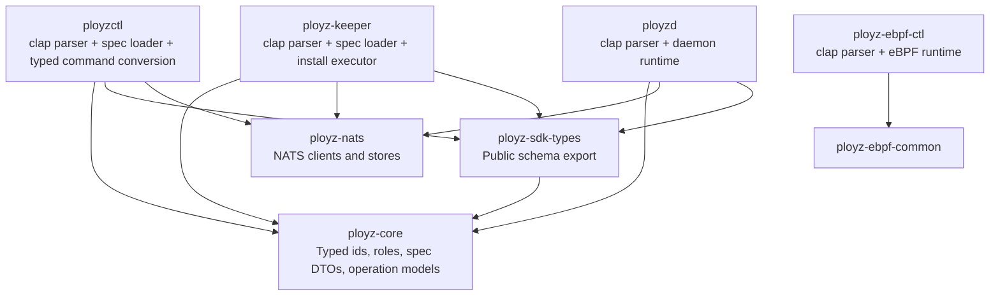
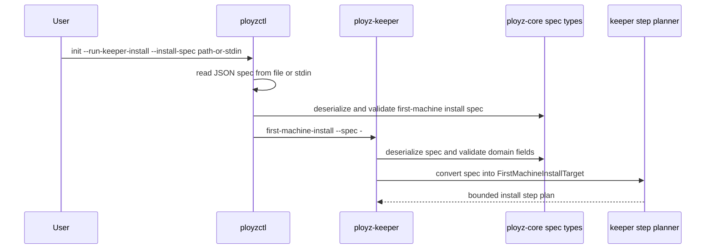
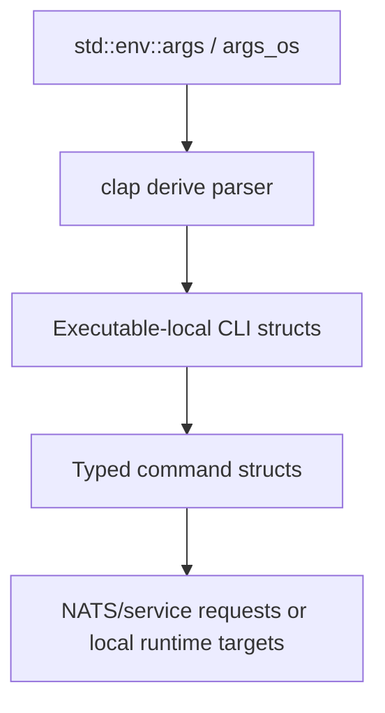

# refactor: Simplify CLI and install contracts

## Summary

This plan removes hand-written command-line parsing as a maintenance concern and narrows CLI code to executable edges. It keeps `ployz-core` focused on typed product contracts, hard-cuts legacy install flag bags, and replaces the widest command surfaces with typed JSON specs loaded by the binaries that need them.

---

## Problem Frame

The current parser surface is large, duplicated, and coupled to custom error variants. The highest-burden files are `crates/ployz-keeper/src/first_machine_install_cli.rs`, `crates/ployzctl/src/commands/init.rs`, `crates/ployzctl/src/commands/init/join_template.rs`, `crates/ployzctl/src/commands.rs`, `crates/ployz-core/src/install.rs`, and `crates/ployz-core/src/roles.rs`.

The architectural smell is not only line count. `ployz-core` renders shell commands and parses process roles even though its crate docs say it must not own CLI presentation. Multiple executable crates also repeat the same pattern: collect flags into optional staging structs, manually detect duplicates, then convert values into typed domain objects.

The expected payoff is large enough to justify a hard cut. The current parser-related surface is roughly 4k lines across production and test files, with the largest hotspots in `first_machine_install_cli.rs`, `init.rs`, `join_template.rs`, `commands.rs`, and `cli_contract.rs`. The target outcome is a net reduction of roughly 2.5k-3k lines by deleting duplicate parser loops, usage strings, custom syntax-error assertions, and long install argv fixtures.

---

## Requirements

| ID | Requirement |
| --- | --- |
| R1 | `ployz-core` must expose typed domain and wire contracts only; it must not parse argv, render shell commands, or depend on CLI libraries. |
| R2 | Executable crates must use one CLI parsing approach for command routing, usage, required arguments, duplicate flags, subcommands, and help text. |
| R3 | Wide install contracts must move from flat argv bags to typed JSON specs that executable crates read from a file or stdin. |
| R4 | Product-level command structs and request conversion must stay explicit so runtime code still operates on typed commands rather than raw `clap` matches. |
| R5 | Tests must stop asserting custom syntax-error internals where the parser library owns that behavior, while preserving typed conversion, runtime behavior, and user-facing command behavior coverage. |
| R6 | The migration must update scripts, docs, and binary tests that currently expect `ployz-keeper first-machine-install` to receive dozens of flags. |
| R7 | The resulting CLI surfaces must still support noninteractive automation for local tests, e2e scripts, and operator workflows. |
| R8 | Legacy flat artifact flags must be deleted rather than preserved behind compatibility branches. |

---

## Key Technical Decisions

- KTD1. Keep `clap` out of `ployz-core`: The core crate currently has only domain dependencies such as `serde` and `sha2`; adding a CLI dependency there would preserve the boundary violation this refactor is meant to remove.
- KTD2. Use `clap` derive in executable crates: The derive API supports struct and enum parsers with subcommands, reusable argument groups, and value parsers, which matches the current command tree without maintaining a custom router.
- KTD3. Preserve typed command conversion after parsing: `clap` structs should convert into existing command/request structs through `TryFrom` or explicit constructors, keeping validation and product mapping readable.
- KTD4. Replace wide artifact argv with spec contracts: JSON specs turn duplicated flag loops into serde loads plus typed conversion, and they make install handoffs easier to inspect and fixture.
- KTD5. Use a clean break for internal first-machine install flags: This repository is still a greenfield reset, so the plan favors deleting the flat flag path after internal callers and tests move to specs.
- KTD6. Keep `ployzd` role names aligned through tests, not shared argv builders in core: `DaemonProcessRole` remains shared, while `ployzd` owns parsing and keeper owns supervisor command rendering.
- KTD7. Reframe CLI tests around behavior: `clap` should own generic syntax behavior; project tests should cover accepted command shapes, typed invalid values, runtime handoffs, generated specs, and key help output.
- KTD8. Keep spec I/O outside core: `ployz-core` may define serde DTOs and `TryFrom` validation, but file/stdin loading belongs in `ployzctl`, `ployz-keeper`, or a non-core CLI support module.

---

## High-Level Technical Design

### Target Dependency Boundary

### First-Machine Install Handoff

### Parser Ownership

---

## Scope Boundaries

### In Scope

- Replace custom CLI routing and flag parsing in `ployzctl`, `ployz-keeper`, `ployzd`, and `ployz-ebpf-ctl`.
- Remove argv parsing and shell command rendering from `ployz-core`.
- Introduce typed JSON specs for first-machine install and shared artifact bundle inputs.
- Hard-cut legacy `--ployzd-*`, `--ebpf-*`, and `--nats-*` artifact flags from install and join-template commands.
- Rewrite tests that currently couple to custom parser errors and flat install argv.
- Update local scripts and docs that show or consume the affected command lines.

### Out of Scope

- Changing operation semantics, NATS subjects, Docker runtime behavior, gateway/DNS behavior, or eBPF program behavior.
- Adding a generic command framework beyond `clap` derive and explicit typed conversions.
- Preserving the old flat `ployz-keeper first-machine-install` flag contract as a public compatibility surface.
- Moving file or stdin loading helpers into `ployz-core`.

### Deferred to Follow-Up Work

- Shell completion generation from `clap`.
- Machine-readable CLI help snapshots across every subcommand.
- Consolidating all runtime output rendering; this plan only removes parser and wide-install contract burden.

---

## Implementation Units

### U1. Add the CLI dependency and parsing policy

**Goal:** Add `clap` as a workspace dependency for executable crates and establish the local parser pattern before touching behavior.

**Requirements:** R1, R2, R4, R5

**Dependencies:** None

**Files:**
- `Cargo.toml`
- `crates/ployzctl/Cargo.toml`
- `crates/ployz-keeper/Cargo.toml`
- `crates/ployzd/Cargo.toml`
- `crates/ployz-ebpf-ctl/Cargo.toml`
- `crates/ployzctl/src/commands.rs`
- `crates/ployz-keeper/src/cli.rs`

**Approach:** Add `clap` with the `derive` feature to the workspace and only depend on it from binaries or executable-facing libraries. Define a local convention: `Cli` structs/enums live at executable edges, convert into existing typed command structs, and do not cross into `ployz-core`. Use executable-local parser functions or small wrapper types for values that do not naturally implement `FromStr`.

**Patterns to Follow:** Existing `into_request` methods in `crates/ployzctl/src/commands/deploy.rs`, `crates/ployzctl/src/commands/machine.rs`, and `crates/ployzctl/src/commands/backup.rs`.

**Test Scenarios:**
- `crates/ployzctl/tests/cli_contract.rs`: parsing a representative command still yields the same typed `PloyzctlCommand` variant after the new parser path is introduced.
- `crates/ployz-keeper/src/cli.rs` unit tests: help and startup modes route through the new parser without requiring domain execution.
- Workspace dependency audit: `crates/ployz-core/Cargo.toml` does not depend on `clap`.

**Verification:** The workspace dependency graph shows `clap` only in executable crates, and at least one converted command proves the new `clap -> typed command -> runtime` path.

### U2. Move `ployzd` role parsing out of core

**Goal:** Make `ployz-core` own only role models and process-set policy, while `ployzd` owns argv parsing for daemon roles.

**Requirements:** R1, R2, R4

**Dependencies:** U1

**Files:**
- `crates/ployz-core/src/roles.rs`
- `crates/ployz-core/tests/subjects.rs`
- `crates/ployzd/src/role.rs`
- `crates/ployzd/src/main.rs`
- `crates/ployzd/tests/role_process.rs`
- `crates/ployz-keeper/src/systemd.rs`
- `crates/ployz-keeper/tests/systemd.rs`

**Approach:** Delete `DaemonRoleParseError` and `parse_role_args` from core. Add a `clap` role parser under `ployzd`, convert it into `DaemonProcessRole`, and keep `first_machine_process_set` plus `joined_machine_process_set` in core. Move `DaemonProcessRole::command_args()` out of core into keeper's systemd rendering or another keeper-local helper because it exists to render `ExecStart`, not to model product state.

**Patterns to Follow:** `crates/ployzd/src/main.rs` already centralizes daemon startup around a parsed `DaemonProcessRole`; keep that narrow entrypoint.

**Test Scenarios:**
- `crates/ployzd/tests/role_process.rs`: `control`, `machine --id machine_7`, `gateway`, and `dns` parse into the same `DaemonProcessRole` values as today.
- `crates/ployzd/tests/role_process.rs`: invalid role values and missing machine ids exit with CLI parse failure at the binary boundary.
- `crates/ployz-keeper/tests/systemd.rs`: rendered `ployzd` systemd units still invoke `control`, `machine --id <id>`, `gateway`, and `dns` as expected.
- `crates/ployz-core/src/roles.rs` unit tests: process-set planning remains covered without any argv round-trip test.

**Verification:** `rg "parse_role_args|DaemonRoleParseError|command_args" crates/ployz-core` returns no CLI parser or argv-rendering surface.

### U3. Introduce typed first-machine install specs

**Goal:** Replace the flat first-machine install flag contract with serde-backed DTOs that `ployzctl` and `ployz-keeper` validate through one domain conversion path.

**Requirements:** R1, R3, R4, R7, R8

**Dependencies:** U1

**Files:**
- `crates/ployz-core/src/install.rs`
- `crates/ployz-core/tests/install_contract.rs`
- `crates/ployz-keeper/src/steps.rs`
- `crates/ployz-keeper/src/artifacts.rs`
- `crates/ployz-keeper/tests/bootstrap.rs`
- `crates/ployz-keeper/tests/local.rs`

**Approach:** Introduce a grouped artifact bundle spec and a first-machine install spec with `Serialize`, `Deserialize`, and `deny_unknown_fields`. Use plain strings in DTO fields where that keeps the wire shape simple, then convert into validated domain structs through `TryFrom`. Keep shell rendering and file/stdin loading out of core. Add conversion in keeper from the validated core spec into `FirstMachineInstallTarget`, including artifact target conversion and optional environment values such as machine public IP, bootstrap URL, and machine join template file.

**Patterns to Follow:** `MachineJoinTemplate` in `crates/ployz-core/src/install.rs` is already a serde-backed control-plane artifact with validation through typed fields.

**Test Scenarios:**
- `crates/ployz-core/tests/install_contract.rs`: a complete first-machine install spec round-trips through JSON and rejects unknown fields.
- `crates/ployz-core/tests/install_contract.rs`: invalid artifact digest, relative install path, and invalid bootstrap URL still fail through typed field validation.
- `crates/ployz-core/tests/install_contract.rs`: `KeeperFirstMachineInstall` no longer exposes shell command rendering or flat argv construction.
- `crates/ployz-keeper/tests/bootstrap.rs`: converting a valid spec produces a first-machine install plan with artifact install, NATS config, role environment, and supervisor unit steps.
- `crates/ployz-keeper/tests/local.rs`: optional machine public IP and machine join template path survive conversion into the role environment target.

**Verification:** The same install information is represented once as typed data, not as duplicated flat flag staging structs.

### U4. Replace `ployz-keeper first-machine-install` flag parsing with a spec loader

**Goal:** Delete the largest hand-written parser by making keeper accept a first-machine install spec from a file or stdin.

**Requirements:** R2, R3, R5, R7, R8

**Dependencies:** U3

**Files:**
- `crates/ployz-keeper/src/cli.rs`
- `crates/ployz-keeper/src/first_machine_install_cli.rs`
- `crates/ployz-keeper/src/main.rs`
- `crates/ployz-keeper/tests/bootstrap.rs`
- `crates/ployz-keeper/tests/local.rs`
- `crates/ployz-keeper/tests/systemd.rs`

**Approach:** Delete `first_machine_install_cli.rs` and replace it with a small keeper-local spec-loading path. The `first-machine-install` subcommand accepts `--spec <path>` and `--spec -`; keeper reads JSON, deserializes the core DTO, converts it into `FirstMachineInstallTarget`, then runs the existing install planner. Do not retain the old flat flags behind compatibility branches.

**Patterns to Follow:** `crates/ployzd/src/config.rs` already reads and deserializes `MachineJoinTemplate` from a configured path.

**Test Scenarios:**
- `crates/ployz-keeper/src/cli.rs` unit tests: `first-machine-install --spec /tmp/spec.json` parses into a first-machine install command carrying a spec source.
- `crates/ployz-keeper/tests/local.rs`: a valid spec file drives the same first-machine install behavior that the flat flags previously drove.
- `crates/ployz-keeper/tests/local.rs`: `--spec -` accepts stdin in a binary-level test or focused command-loading test.
- `crates/ployz-keeper/tests/local.rs`: invalid JSON and semantically invalid spec values return typed keeper CLI errors without starting install steps.
- `crates/ployz-keeper/src/cli.rs` unit tests: old flat artifact flags are rejected after internal callers have moved.

**Verification:** `crates/ployz-keeper/src/first_machine_install_cli.rs` is deleted, and no keeper parser enumerates every artifact flag.

### U5. Convert `ployzctl init` and join-template flows to spec-first artifacts

**Goal:** Remove duplicated artifact flag parsing from `ployzctl init` and `init join-template` by sharing typed spec construction and file/stdin handoff.

**Requirements:** R2, R3, R4, R6, R7, R8

**Dependencies:** U3, U4

**Files:**
- `crates/ployzctl/src/commands/init.rs`
- `crates/ployzctl/src/commands/init/join_template.rs`
- `crates/ployzctl/src/runtime.rs`
- `crates/ployzctl/tests/cli_contract.rs`
- `crates/ployzctl/tests/init_binary_nats.rs`
- `crates/ployzctl/tests/init_join_template_cli_contract.rs`
- `crates/ployzctl/tests/machine_add_binary_nats.rs`
- `scripts/local-dataplane-proof.sh`
- `scripts/hetzner-two-machine-acceptance.sh`
- `docs/operations/two-machine-acceptance.md`

**Approach:** Make `ployzctl init` accept `--install-spec <path>` or `--install-spec -`; remove direct `--ployzd-*`, `--ebpf-*`, and `--nats-*` artifact flags from this command. For `--run-keeper-install`, pass the loaded spec to `ployz-keeper first-machine-install --spec -` over stdin. For emit mode, print a command that uses a heredoc or spec file rather than printing dozens of shell-quoted flags. Make `init join-template` accept `--artifact-spec <path>` or `--artifact-spec -` plus its genuinely join-template-specific fields, so artifact bundle parsing is not duplicated. Delete `ParsedInitArgs`, `ParsedKeeperInstallArgs`, and `ParsedMachineJoinTemplateArgs` rather than translating them into renamed staging structs.

**Patterns to Follow:** `MachineAddOutput::render` in `crates/ployzctl/src/commands/machine.rs` already renders operator-facing shell commands from typed data; keep rendering in `ployzctl`, not core.

**Test Scenarios:**
- `crates/ployzctl/tests/cli_contract.rs`: `init --run-keeper-install --install-spec <path>` invokes keeper with `first-machine-install --spec -` and sends valid JSON to stdin.
- `crates/ployzctl/tests/cli_contract.rs`: `init --emit-keeper-install` emits a usable spec-based install command without flat artifact flags.
- `crates/ployzctl/tests/init_join_template_cli_contract.rs`: `init join-template --artifact-spec <path>` still emits valid `MachineJoinTemplate` JSON for the same artifact inputs.
- `crates/ployzctl/tests/cli_contract.rs`: direct legacy artifact flags on `init` are rejected.
- `crates/ployzctl/tests/init_binary_nats.rs`: first-machine activation behavior is unchanged after the parser and spec rewrite.
- `scripts/local-dataplane-proof.sh` and `scripts/hetzner-two-machine-acceptance.sh`: generated or expected first-machine install commands use the new spec shape.

**Verification:** No `ployzctl` parser contains a repeated list of `--ployzd-*`, `--ebpf-*`, and `--nats-*` flags solely to build an install contract.

### U6. Convert remaining `ployzctl` command parsing to `clap`

**Goal:** Replace the custom `ArgCursor`, command router, usage string, and per-command flag loops with derive-based parsers.

**Requirements:** R2, R4, R5, R7

**Dependencies:** U1, U5

**Files:**
- `crates/ployzctl/src/commands.rs`
- `crates/ployzctl/src/commands/backup.rs`
- `crates/ployzctl/src/commands/deploy.rs`
- `crates/ployzctl/src/commands/logs.rs`
- `crates/ployzctl/src/commands/machine.rs`
- `crates/ployzctl/src/commands/ops.rs`
- `crates/ployzctl/src/commands/service.rs`
- `crates/ployzctl/src/main.rs`
- `crates/ployzctl/src/runtime.rs`
- `crates/ployzctl/tests/cli_contract.rs`
- `crates/ployzctl/tests/deploy_cli_contract.rs`
- `crates/ployzctl/tests/deploy_binary_nats.rs`
- `crates/ployzctl/tests/machine_add_binary_nats.rs`
- `crates/ployzctl/tests/ops_watch_binary_nats.rs`

**Approach:** Define a top-level `PloyzctlCli` with a global `--nats` option and nested subcommands for deploy, backup, init, machine, service, logs, and ops. Convert CLI structs into existing typed command structs. Keep route completeness validation such as `--route-hostname`, `--route-port`, and `--endpoint-port` in typed conversion because it is product semantics, not generic syntax. Delete `ArgCursor`, helper functions such as `set_once` and `required`, syntax-only `PloyzctlCliError` variants, and the manual `USAGE` string.

**Patterns to Follow:** Existing command modules already separate command structs, output renderers, and runtime request conversion. Preserve that separation.

**Test Scenarios:**
- `crates/ployzctl/tests/cli_contract.rs`: top-level help contains each product command family without comparing the entire help output byte-for-byte.
- `crates/ployzctl/tests/deploy_cli_contract.rs`: a detached deploy with route converts into the same `DeploySubmitRequest` shape as today.
- `crates/ployzctl/tests/deploy_cli_contract.rs`: incomplete route arguments still produce project-level missing-field errors after typed conversion.
- `crates/ployzctl/tests/cli_contract.rs`: machine add, machine list, machine inspect, service list, service inspect, logs, ops status, and ops watch parse into typed command variants.
- Binary NATS tests continue to prove runtime behavior for deploy, machine add, ops watch, init, and API client paths.

**Verification:** `ArgCursor`, `PloyzctlCliError` syntax-only variants, and the manual `USAGE` string are removed or reduced to project-level conversion errors.

### U7. Convert `ployz-ebpf-ctl` to `clap`

**Goal:** Remove the eBPF helper's custom parser and usage string while preserving its Linux-gated runtime behavior.

**Requirements:** R2, R5, R7

**Dependencies:** U1

**Files:**
- `crates/ployz-ebpf-ctl/Cargo.toml`
- `crates/ployz-ebpf-ctl/src/main.rs`
- `crates/ployzd/src/dataplane_runtime.rs`
- `crates/ployzd/tests/wireguard_dataplane.rs`
- `crates/ployzd/tests/deploy_command_preparation.rs`
- `crates/ployzd/tests/deploy_command_preparation_nats.rs`

**Approach:** Model `validate`, `attach`, `ensure-attached`, `detach`, and nested `route` subcommands as `clap` enums. Keep the current runtime functions and Linux cfg boundaries. Preserve `--pin-path` as a global option accepted before subcommands.

**Patterns to Follow:** The current `run` function already dispatches parsed commands into narrow runtime functions; keep that split and replace only the parser shape.

**Test Scenarios:**
- `crates/ployz-ebpf-ctl/src/main.rs` unit tests: each subcommand parses into the expected command enum, including `--pin-path` before the subcommand.
- `crates/ployz-ebpf-ctl/src/main.rs` unit tests: route subcommands parse IPv4 subnet and ifindex values with project-level error messages where needed.
- `crates/ployzd/tests/deploy_command_preparation.rs`: dataplane evidence still records the same eBPF command args expected by deploy preparation.
- `crates/ployzd/tests/wireguard_dataplane.rs`: non-parser runtime behavior remains unchanged.

**Verification:** `parse_global_args` and the handwritten `usage()` function disappear from `ployz-ebpf-ctl`.

### U8. Rewrite parser-coupled tests and docs around stable behavior

**Goal:** Reduce maintenance burden in the test suite by replacing custom parser-error assertions with stable behavior and conversion tests.

**Requirements:** R5, R6, R7

**Dependencies:** U2, U4, U5, U6, U7

**Files:**
- `crates/ployzctl/tests/cli_contract.rs`
- `crates/ployzctl/tests/deploy_cli_contract.rs`
- `crates/ployzctl/tests/init_join_template_cli_contract.rs`
- `crates/ployz-core/tests/install_contract.rs`
- `crates/ployz-keeper/tests/bootstrap.rs`
- `crates/ployz-keeper/tests/local.rs`
- `crates/ployzd/tests/role_process.rs`
- `docs/operations/two-machine-acceptance.md`
- `docs/architecture/nats-control-plane.md`
- `README.md`

**Approach:** Keep tests that prove product command behavior, generated request shapes, emitted spec JSON, and runtime process handoffs. Remove tests whose only value is pinning bespoke syntax errors such as duplicate custom flag variants. Add a smaller number of CLI binary tests that assert exit status, non-empty help, and representative error categories. Replace long flag vectors in fixtures with JSON spec fixtures.

**Patterns to Follow:** Existing binary tests such as `crates/ployzctl/tests/deploy_binary_nats.rs` and `crates/ployzctl/tests/machine_add_binary_nats.rs` already exercise user-visible behavior through real binaries.

**Test Scenarios:**
- `crates/ployzctl/tests/cli_contract.rs`: command conversion tests cover one accepted path per command family.
- `crates/ployzctl/tests/deploy_cli_contract.rs`: project-level deploy route validation remains covered after generic syntax errors move to `clap`.
- `crates/ployz-keeper/tests/local.rs`: spec-based first-machine install remains covered with valid and invalid specs.
- `crates/ployzd/tests/role_process.rs`: daemon role CLI remains covered at binary or parser boundary.
- Documentation examples use the new spec-based first-machine install command shape.

**Verification:** Test failures after future CLI syntax changes point at product behavior or command conversion, not at duplicated parser internals.

---

## Acceptance Examples

- AE1. Given a valid first-machine install spec file, when `ployz-keeper first-machine-install --spec <file>` runs, then keeper plans the same artifact installs, NATS config, role environment, and supervisor units that the old flat flags planned.
- AE2. Given `ployzctl init --run-keeper-install --install-spec <path>` with valid install input, when it invokes keeper, then the spawned process receives `first-machine-install --spec -` and valid JSON on stdin.
- AE3. Given an invalid role invocation such as `ployzd machine --id`, when the binary starts, then the failure is reported by the `ployzd` CLI boundary and no core parser is involved.
- AE4. Given a deploy command missing one route component, when `ployzctl deploy` is parsed, then generic syntax succeeds but typed command conversion rejects the incomplete route.
- AE5. Given a search for CLI parsing symbols in `ployz-core`, when the refactor is complete, then no argv parser, shell renderer, or `clap` dependency is present there.

---

## Explicit Deletion Targets

| Target | Expected End State |
| --- | --- |
| `crates/ployz-keeper/src/first_machine_install_cli.rs` | Deleted. Keeper accepts `first-machine-install --spec <path|->` only. |
| `crates/ployzctl/src/commands.rs` `ArgCursor` and parser helpers | Deleted. `clap` owns generic flag and subcommand syntax. |
| `crates/ployzctl/src/commands.rs` `USAGE` | Deleted. Help text comes from `clap`. |
| `crates/ployz-core/src/install.rs` shell command rendering | Deleted. Core keeps spec DTOs and validation, not human command rendering. |
| `crates/ployz-core/src/roles.rs` `parse_role_args` and `DaemonRoleParseError` | Deleted from core. `ployzd` owns role CLI parsing. |
| `crates/ployzctl/src/commands/init.rs` artifact staging structs | Deleted. `init` loads an install spec instead of accepting artifact flags. |
| `crates/ployzctl/src/commands/init/join_template.rs` artifact staging struct | Deleted. `join-template` loads a shared artifact spec. |
| Custom parser error assertion suites | Reduced to typed conversion tests and representative binary behavior tests. |

---

## Expected Outcome

| Area | Before | After |
| --- | --- | --- |
| First-machine install input | Dozens of flat flags repeated across keeper, ployzctl, tests, and scripts | One typed spec loaded by file or stdin |
| Join-template artifact input | Separate artifact flag parser | Shared artifact spec plus join-template-specific inputs |
| Generic CLI syntax | Hand-written routers, cursors, duplicate checks, and usage text | `clap` parsers at executable edges |
| Core boundary | Core renders shell commands and parses daemon role argv | Core defines typed contracts and validation only |
| Parser tests | Many assertions over custom syntax error variants | Domain conversion tests and representative binary behavior tests |
| Maintenance cost for new install fields | Update multiple parser loops, renderers, usage strings, scripts, and tests | Update spec DTO, one validation conversion, and relevant fixtures |

The target is a net deletion of roughly 2.5k-3k lines across production and tests, with the larger win being fewer places to update for each new install or CLI field.

---

## System-Wide Impact

This refactor changes local executable contracts and tests but should not change NATS service contracts, operation state, Docker behavior, or runtime cluster truth. The main external-facing impact is the first-machine install command shape. Because first-machine install appears in docs, scripts, and acceptance harnesses, the implementation must update examples and fixtures in the same branch as the parser rewrite.

---

## Risks & Dependencies

| Risk | Mitigation |
| --- | --- |
| Spec shape becomes another wide bag with a new filename | Keep the spec typed, serde-backed, and grouped by product concepts such as artifacts, NATS, role environment, and optional machine bootstrap fields. |
| `clap` error output breaks brittle tests | Stop asserting full generic syntax text; assert exit category and project-level conversion errors where those are owned by Ployz. |
| Moving `command_args()` out of core creates role-name drift | Add keeper systemd rendering tests and `ployzd` role parser tests that cover all `DaemonProcessRole` variants. |
| First-machine install script examples drift from the real runtime path | Update `ployzctl --emit` tests, local proof scripts, and docs together with the spec handoff. |
| The refactor expands into runtime behavior cleanup | Keep operation semantics, NATS requests, Docker execution, and output rendering outside active scope unless required to preserve parser behavior. |

---

## Documentation / Operational Notes

- Update operator-facing examples that mention `ployz-keeper first-machine-install` flat flags.
- Explain that first-machine install specs are control-plane install contracts and can be supplied by file or stdin.
- Keep the generated spec inspectable in tests and local scripts so failures leave useful evidence.

---

## Sources & Research

- `VISION.md` and `AGENTS.md`: core product direction says business logic should stay in typed models and product commands should be explicit operations.
- `crates/ployz-core/src/lib.rs`: crate documentation says core must not own CLI presentation.
- `crates/ployz-core/src/install.rs`: current shell command rendering lives in core.
- `crates/ployz-core/src/roles.rs`: current daemon role argv parser lives in core.
- `crates/ployz-keeper/src/first_machine_install_cli.rs`: current wide first-machine install parser.
- `crates/ployzctl/src/commands/init.rs` and `crates/ployzctl/src/commands/init/join_template.rs`: duplicated artifact flag staging and conversion.
- `crates/ployzctl/tests/cli_contract.rs` and `crates/ployzctl/tests/deploy_cli_contract.rs`: parser tests currently couple to custom error variants and flat argv details.
- [`clap` derive documentation](https://docs.rs/clap/latest/clap/_derive/index.html): `Parser` parses into structs or enums, `Subcommand` models subcommands, `Args` supports reusable argument groups, and the `derive` feature is required for custom derives.
- [`clap` value parser documentation](https://docs.rs/clap/latest/clap/macro.value_parser.html): value parsers support native types, ranged numeric types, `ValueEnum`, and `FromStr`-style parsing, which fits executable-local conversion into Ployz newtypes.
