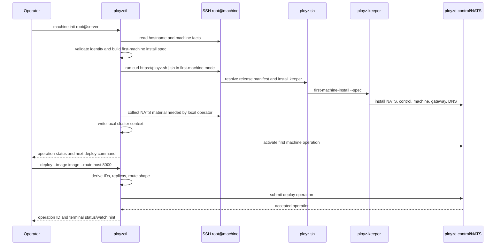

# feat: Alpha quick start ergonomics

## Summary

Make the next alpha install and first deploy feel like a product path:

```bash
curl -fsSL https://ployz.sh | sh
ployzctl machine init root@your-server-ip
ployzctl deploy --image ghcr.io/acme/web:latest --route app.example.com:8000
```

The implementation should keep Ployz's explicit-operation model intact. The new CLI layer derives IDs, names, role defaults, release artifacts, and local client context so the operator does not have to supply internal machinery for the first successful cluster.

---

## Problem Frame

The current alpha proves the control plane, keeper install, NATS auth, machine join, and deploy path, but the user-facing commands still expose proof-harness details. First-machine init requires explicit machine names and install specs. Machine add requires operation IDs, idempotency keys, machine IDs, machine names, and a printed shell command. Deploy requires internal operation fields plus split route flags.

That is the wrong first impression for a `0.0.1` alpha. The product should still be primitives and durable operations, but the default CLI workflow should present the primitives through a terse operator path.

---

## Requirements

**Install and release**

- R1. `curl -fsSL https://ployz.sh | sh` installs `ployzctl` for the local operator machine without requiring keeper, NATS material, or a cluster URL.
- R2. The installer supports the local operator platforms needed for the alpha quick start, including macOS and Linux on `amd64` and `arm64`.
- R3. Release manifests continue to carry verified artifact URLs and SHA-256 values, and machine bootstrap modes use those manifests without requiring users to pass keeper URLs or SHAs.

**Machine bootstrap**

- R4. `ployzctl machine init root@your-server-ip` forms a first-machine cluster on the remote machine through SSH and records local client context for later commands.
- R5. First-machine identity defaults to the remote machine's system hostname; the resulting `MachineId` and `MachineName` are the same value.
- R6. Invalid hostname-derived identities fail before install with a clear message, and `--name NAME` is the explicit override.
- R7. Duplicate hostname-derived identities fail through the existing machine reservation and operation path; the CLI does not auto-rename machines.
- R8. Gateway and DNS roles are installed and enabled by default for first-machine init and joined machines.
- R9. `ployzctl machine add root@your-server-ip` redeems the normal machine-add operation, joins the remote machine through SSH, and uses the remote hostname by default.

**Deploy happy path**

- R10. `ployzctl deploy --image ghcr.io/acme/web:latest --route app.example.com:8000` is sufficient to submit a one-replica deploy through the current cluster context.
- R11. The deploy shorthand derives operation ID, idempotency key, service ID, revision ID, replica count, route hostname, route port, and endpoint port without requiring operator flags.
- R12. Existing explicit deploy flags remain available for tests, automation, and expert workflows, but they are not required for the alpha happy path.

**Observability and failure**

- R13. Mutating quick-start commands still create operations and surface operation IDs, durable progress, and terminal status.
- R14. Remote bootstrap failures include the failed SSH phase or keeper failure output and leave enough command output to diagnose the machine state.
- R15. The quick-start docs tell operators to create DNS records pointing at the gateway IP; external DNS-provider automation is not part of this alpha slice.

---

## Key Technical Decisions

- KTD1. Keep the CLI ergonomic layer above the operation model: `machine init`, `machine add`, and deploy shorthand derive values, but they still call the same operation services and keeper flows.
- KTD2. Use the remote hostname as identity by default: this matches the operator's mental model and the existing subject-token ID rules. Invalid names fail early; `--name` is the manual escape hatch.
- KTD3. Put SSH orchestration in `ployzctl`: keeper remains the machine-local actor that prepares and installs Ployz services, while the CLI owns connecting to the remote machine and invoking the installer.
- KTD4. Make `scripts/ployz.sh` mode-aware but thin: default mode installs local `ployzctl`; machine bootstrap modes download verified keeper artifacts and hand off to keeper.
- KTD5. Store local client context after first-machine init: subsequent commands should load NATS URL, CA path, and operator seed path from a local config before falling back to env vars and `--nats`.
- KTD6. Default gateway and DNS in the role model, not as CLI sugar: installed process sets should include the roles by default so local, DinD, and Hetzner paths behave the same.
- KTD7. Treat DNS default as built-in DNS service availability, not registrar automation: the alpha should run the DNS role, but operators still create external A or CNAME records manually.
- KTD8. Parse `--route host:port` as hostname plus container endpoint port: for alpha HTTP routing, the public route port defaults to `80` and the endpoint port is the suffix after the colon.
- KTD9. Generate deterministic-enough IDs in the client: operation IDs and idempotency keys should be collision-resistant, readable, and tied to command intent without requiring a server round trip before submission.

---

## High-Level Technical Design



The first-machine path should converge the current DinD proof shape into a real product command. The CLI still builds an install spec, but the operator does not see it. The remote machine still runs `ployz.sh` and keeper, but the operator does not copy generated commands by hand.

The joined-machine path mirrors first-machine orchestration after the cluster exists: read the remote hostname, submit `machine add` with derived identity, receive the join bundle, SSH to the machine, run the real installer join mode, and wait for the operation to complete or fail.

---

## Implementation Units

### U1. Release Manifests and Local Installer

- **Goal:** Make `https://ployz.sh` usable as the default CLI installer and keep release artifact verification centralized.
- **Files:** `scripts/ployz.sh`, `scripts/package-release.sh`, `.github/workflows/`, `crates/ployzctl/tests/cli_contract.rs`.
- **Approach:** Split installer behavior into default local CLI install and machine bootstrap modes. Add macOS artifact naming to release manifests, keep Linux keeper bootstrap gated to machine modes, and make install location work for non-root local CLI installs.
- **Test scenarios:** Local install resolves `ployzctl` from a manifest without keeper fields; Linux join mode still requires join material; unsupported OS or arch fails with a clear message; missing manifest key reports the key and URL.
- **Verification:** Package a local release manifest for all alpha platforms and run installer contract tests with overridden manifest URLs.

### U2. Local Cluster Context

- **Goal:** Let later commands connect to the cluster created by `machine init` without `PLOYZ_NATS_URL` or repeated flags.
- **Files:** `crates/ployzctl/src/runtime.rs`, new `crates/ployzctl/src/config.rs`, `crates/ployzctl/tests/init_binary_nats.rs`, `crates/ployzctl/tests/cli_contract.rs`.
- **Approach:** Add a small on-disk config that stores the active cluster's NATS URL, CA file path, and operator seed file path. Load config before env fallback where appropriate, with `--nats` and env vars retaining precedence.
- **Test scenarios:** Commands load config when env is absent; env vars override config; missing config gives the current clear connection error; first-machine init writes usable config atomically.
- **Verification:** Existing NATS binary tests pass with config-backed clients and with env-backed clients.

### U3. SSH Target and Hostname Identity

- **Goal:** Add the reusable remote-machine target layer that `machine init` and `machine add` both use.
- **Files:** `crates/ployzctl/src/commands/machine.rs`, new `crates/ployzctl/src/ssh.rs`, `crates/ployzctl/tests/machine_cli_contract.rs`.
- **Approach:** Parse `user@host` targets, run bounded SSH commands, read `hostname`, validate it as `MachineId` and `MachineName`, and support `--name` as the only quick-start identity override.
- **Test scenarios:** Valid hostname derives machine and machine name; invalid hostname fails before remote install; `--name` overrides hostname; SSH command failures include phase and stderr.
- **Verification:** CLI contract tests cover parsing and error messages without requiring live SSH.

### U4. First-Machine `machine init`

- **Goal:** Replace visible first-machine install specs with `ployzctl machine init root@host`.
- **Files:** `crates/ployzctl/src/commands.rs`, `crates/ployzctl/src/commands/machine.rs`, `crates/ployzctl/src/runtime.rs`, `crates/ployzctl/src/keeper_install.rs`, `crates/ployz-e2e/tests/support/dind/formation.rs`, `crates/ployz-e2e/tests/dind_cluster.rs`.
- **Approach:** Add `MachineCli::Init`, build the existing first-machine install spec internally, run `ployz.sh` on the remote host in first-machine mode, collect operator material, write local context, and call the existing first-machine activation API.
- **Test scenarios:** The generated install spec includes hostname-derived machine ID, gateway install, DNS install, bootstrap URL, release artifacts, and NATS server descriptor; failed keeper install exits non-zero with output; successful init writes local context and activates the first machine.
- **Verification:** DinD formation switches from direct `ployzctl init --run-keeper-install` to product `ployzctl machine init` against a container SSH target or equivalent local SSH harness.

### U5. Default Gateway and DNS Roles

- **Goal:** Make gateway and DNS part of the default alpha machine shape.
- **Files:** `crates/ployz-core/src/roles.rs`, keeper install planning modules, `crates/ployz-keeper/tests/bootstrap.rs`, `crates/ployzd/src/daemon_runtime.rs`, `crates/ployzd/src/app.rs`, `crates/ployzd/tests/role_process.rs`, `crates/ployzd/tests/dns_projection.rs`, `crates/ployzd/tests/dns_source_nats.rs`.
- **Approach:** Replace gateway-only booleans with an install role policy that defaults to machine, gateway, and DNS. Wire the DNS role runtime so `ployzd dns` is a runnable supervised process instead of returning `RoleRuntimePending`.
- **Test scenarios:** First-machine process sets include control, machine, gateway, and DNS; joined-machine process sets include machine, gateway, and DNS; `--no-gateway` and `--no-dns` skip only the requested roles; DNS runtime can start and observe NATS route state.
- **Verification:** Role process tests assert rendered systemd units, and DNS source/projection tests prove the running DNS role consumes cluster state.

### U6. Joined-Machine `machine add`

- **Goal:** Make adding a second machine a one-command remote operation.
- **Files:** `crates/ployzctl/src/commands/machine.rs`, `crates/ployzctl/src/runtime.rs`, `crates/ployzctl/tests/machine_add_binary_nats.rs`, `crates/ployz-e2e/tests/support/dind/join.rs`, `crates/ployz-e2e/tests/dind_cluster.rs`.
- **Approach:** Keep the existing low-level `machine add` operation path, but add a remote target mode that derives identity, submits the operation, runs the real installer join mode through SSH, and watches the operation to completion by default.
- **Test scenarios:** Remote add submits the expected request; duplicate machine fails through operation status; installer failure after token redemption records `MachineAddFailure::BootstrapFailed`; gateway and DNS default into the join bundle.
- **Verification:** DinD two-machine e2e deploys a workload after joining the second machine through the new command.

### U7. Deploy Shorthand

- **Goal:** Make the deploy command match the alpha happy path while preserving explicit expert flags.
- **Files:** `crates/ployzctl/src/commands/deploy.rs`, `crates/ployzctl/src/runtime.rs`, `crates/ployzctl/tests/deploy_cli_contract.rs`, `crates/ployz-e2e/tests/dind_cluster.rs`.
- **Approach:** Add optional derived fields to `DeployCli`, parse `--route host:port`, default replicas to `1`, derive service ID from the image repository leaf, derive revision ID from image reference plus timestamp or hash, and generate operation/idempotency IDs client-side.
- **Test scenarios:** `--image` plus `--route` parses into a valid `DeploySubmitRequest`; explicit flags override derived values; malformed route syntax fails clearly; no local cluster context reports how to run `machine init`.
- **Verification:** DinD e2e submits the exact quick-start deploy command and verifies the route reaches the workload.

### U8. Alpha Quick-Start Documentation and Smoke Proof

- **Goal:** Document and prove the operator path planned for the next alpha release.
- **Files:** `README.md`, `docs/operations/`, `docs/plans/2026-06-04-001-refactor-nats-greenfield-control-plane-plan.md`, `crates/ployz-e2e/tests/dind_cluster.rs`.
- **Approach:** Add a compact quick start modeled on the intended product flow: install CLI, initialize first machine, deploy image with route, create DNS record, inspect status, add a machine, and remove or clean up a service if supported.
- **Test scenarios:** Docs examples are copied into CLI contract tests where possible; a DinD e2e scenario runs first-machine init, joined-machine add, and deploy with only the documented commands.
- **Verification:** Release checklist for the next alpha includes the DinD quick-start scenario and one Hetzner smoke where Docker is not preinstalled.

---

## Acceptance Examples

- AE1. Given a fresh macOS operator machine, when the user runs `curl -fsSL https://ployz.sh | sh`, then `ployzctl` is installed and no cluster connection is attempted.
- AE2. Given a fresh Ubuntu server with hostname `sg-core-1`, when the user runs `ployzctl machine init root@203.0.113.10`, then the first active machine has machine ID `sg-core-1`, machine name `sg-core-1`, gateway role, and DNS role.
- AE3. Given a server whose hostname is `sg.core.1`, when the user runs `ployzctl machine init root@203.0.113.10`, then the command fails before installing with a message that the hostname is not a valid Ployz identity and suggests `--name`.
- AE4. Given a cluster context created by `machine init`, when the user runs `ployzctl deploy --image ghcr.io/acme/web:latest --route app.example.com:8000`, then Ployz creates a deploy operation for one replica and routes `app.example.com` on public HTTP port `80` to container endpoint port `8000`.
- AE5. Given a second fresh Ubuntu server with hostname `sg-edge-1`, when the user runs `ployzctl machine add root@203.0.113.11`, then the existing machine-add operation path issues a join token, the remote installer redeems it, and the machine reaches completed state with gateway and DNS roles installed.

---

## Scope Boundaries

- Deferred: automatic DNS-provider integration, wildcard hosted zones, and managed names under a Ployz-owned domain.
- Deferred: automatic HTTPS certificate issuance for route shorthand unless the current gateway/cert path is already production-ready during implementation.
- Deferred: uninstall and upgrade commands, including an `uncloud-uninstall` equivalent.
- Deferred: nightly channel ergonomics, rollback of local CLI versions, and channel switching.
- Deferred: non-root SSH bootstrap, cloud-init integration, and package-manager-specific Docker hardening.
- Included: keeping lower-level explicit flags and commands available for tests and agent automation.

---

## System-Wide Impact

This plan changes the default product surface, but not the authority boundary. The cluster still mutates through NATS operations and keeper-reported bootstrap progress. The CLI gains responsibility for remote orchestration, release artifact resolution, and local context persistence.

Gateway and DNS defaults affect every installed machine. That increases the process supervision surface, so the role model, keeper install planning, systemd rendering, runtime start behavior, and e2e proof all need to agree on the default process set.

The local context file introduces operator-machine credential storage. It should use restrictive permissions, avoid printing seeds in normal output, and keep env-var overrides for automation.

---

## Risks & Dependencies

- SSH behavior can vary across hosts. Keep remote commands POSIX-shaped, bounded, and phase-labeled in errors.
- macOS local install requires release assets that do not exist in the current Linux-only release packaging flow.
- DNS being default may expose unfinished runtime behavior. The current code has DNS role planning, but runtime dispatch must be completed before this is marketed as on by default.
- Route shorthand may over-promise HTTPS if docs copy Uncloud's examples too closely. Alpha docs should say HTTP routing unless HTTPS is proven in the same release.
- Hostname-derived identity is convenient but brittle on generic VPS hostnames. The explicit `--name` override must be visible in the error path.

---

## Documentation / Operational Notes

The alpha quick start should be written as the primary README path, not as an advanced appendix. The first screen should show the three-command path, then short prerequisites:

- a local macOS or Linux operator machine,
- a fresh Linux server reachable by SSH as root,
- a public IP for gateway traffic,
- a DNS A record pointing the route hostname at the gateway IP after init.

The docs should name the lower-level commands as troubleshooting and automation tools, not the happy path.

---

## Sources / Research

- `VISION.md` anchors the explicit-operation requirement and the terse, observable product experience.
- `AGENTS.md` defines the current NATS-first architecture and role ownership boundaries.
- `scripts/ployz.sh` is currently Linux/root-only and defaults to installing `ployzctl` from release manifests.
- `crates/ployzctl/src/commands/machine.rs` currently requires explicit machine, name, operation ID, idempotency key, and gateway flag for machine add.
- `crates/ployzctl/src/commands/deploy.rs` currently requires explicit operation ID, idempotency key, service, revision, replicas, and split route flags.
- `crates/ployz-core/src/roles.rs` currently models gateway as optional and does not include DNS in process sets.
- `crates/ployzd/src/daemon_runtime.rs` currently returns `RoleRuntimePending` for DNS.
- `crates/ployz-e2e/tests/support/dind/formation.rs` contains the proof-harness first-machine formation flow that `machine init` should encapsulate.
- [Uncloud CLI install docs](https://uncloud.run/docs/getting-started/install-cli/) show the prior-art shape for a curl installer, GitHub release binary install, and nightly channel.
- [Uncloud deploy demo docs](https://uncloud.run/docs/getting-started/deploy-demo-app/) show the prior-art operator path of local CLI install, `machine init root@host`, Docker prep, proxy setup, app deploy, and manual DNS record creation.
