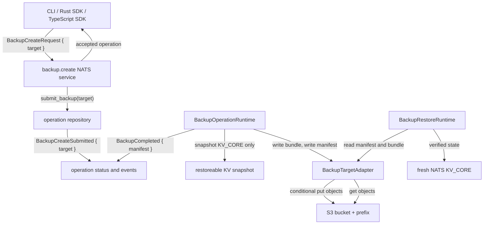
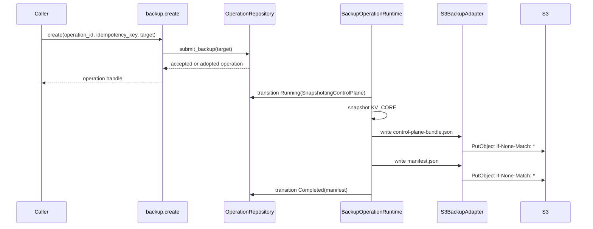

# refactor: Move backups to S3 adapter targets

## Summary

Backup currently writes its artifact into the same disposable NATS core it is trying to protect, and the restoreable bundle includes operation and observation buckets. That makes a restored core recover the backup operation that created the backup, including its running status. This refactor removes the internal NATS backup object store, makes backup create write through a typed backup target adapter, and ships S3 as the first adapter.

The backup operation remains an explicit operation with submitted, running, completed, and failed evidence in the source control plane. The durable restore source becomes the adapter target: `manifest.json` and `control-plane-bundle.json` under an S3 bucket and prefix supplied per operation. The first restoreable bundle captures current cluster authority only; disposable operation and observation state stay out of the artifact.

---

## Requirements

- R1. `backup.create` accepts a typed backup target per operation. S3 is the first target. There is no daemon-wide default in this refactor.
- R2. Backup artifacts are written outside the NATS core through a backup adapter. The `PLZ_BACKUPS` NATS Object Store bucket, bootstrap resource, and permissions are removed.
- R3. Public backup target, artifact location, and manifest types are stable, generated into the TypeScript SDK, and do not contain credentials or secret material.
- R4. Backup remains an explicit bounded operation: validate preconditions, create or adopt an operation, emit durable progress, perform bounded snapshot/write work, and finish with one terminal result.
- R5. S3 writes are deterministic and non-destructive. A retry of the same operation can complete from matching existing objects; a different payload at the same key fails with typed evidence.
- R6. Restore reads from a typed adapter-backed manifest source, verifies the recorded bundle byte count and SHA-256 digest, and restores only the current control-plane authority for this version.
- R7. The first restoreable bundle excludes `KV_OPS` and `KV_OBS`, so restoring a backup never recreates the backup operation that created it.
- R8. CLI, Rust API, TypeScript SDK, operation repository, runtime, restore tests, bootstrap tests, and architecture docs all agree on the new external-target model.

---

## Context & Research

### Repository Context

- `crates/ployzd/src/backup_runtime.rs` currently snapshots `[KV_CORE_BUCKET, KV_OPS_BUCKET, KV_OBS_BUCKET]`, builds a `BackupBundle`, and writes it through `AsyncNatsBackupObjectStore`.
- `crates/ployz-nats/src/objects.rs` owns `PLZ_BACKUPS_BUCKET` and `AsyncNatsBackupObjectStore`; bootstrap and permissions provision access to that object store.
- `crates/ployz-core/src/backup.rs` models backup scope, manifests, artifacts, and bundles. `BackupArtifact` is currently tied to a NATS object store shape with `bucket` and `object_name`.
- `crates/ployz-core/src/ops/backup.rs` and `crates/ployz-core/src/ops/events.rs` carry backup operation state and events. `BackupCreateSubmitted` currently has no target payload.
- `crates/ployz-nats/src/operations/repository/submission.rs` already supports payload-bearing submissions for deploy, but backup submission currently stores `()`.
- `crates/ployz-sdk-types/src/lib.rs`, `packages/ployz-sdk/src/index.ts`, and `crates/ployzctl/src/commands/backup.rs` expose a targetless backup create API.
- `crates/ployzd/tests/backup_restore.rs` currently proves the unwanted behavior: restoring a backup recreates the backup operation in a running stage.
- `VISION.md` and `docs/architecture/nats-control-plane.md` still say Object Store holds backup manifests. That text needs to change with the implementation.

### External Sources

- AWS S3 conditional writes support `If-None-Match: *` on `PutObject`, `CopyObject`, and `CompleteMultipartUpload`, which fits non-destructive deterministic backup keys: <https://docs.aws.amazon.com/AmazonS3/latest/userguide/conditional-writes.html>
- AWS SDK for Rust has no default operation or attempt timeout. The S3 adapter must set explicit operation and attempt timeouts for control-plane external I/O: <https://docs.aws.amazon.com/sdk-for-rust/latest/dg/timeouts.html>
- AWS SDK for Rust requires a behavior version. Use an explicit behavior version or the current behavior-version feature in the `ployzd` adapter crate dependency: <https://docs.aws.amazon.com/sdk-for-rust/latest/dg/behavior-versions.html>
- The AWS SDK default credential provider chain can load credentials from environment, shared config, and roles. Keep credentials out of Ployz request, event, status, and manifest types: <https://docs.aws.amazon.com/sdk-for-rust/latest/dg/credproviders.html>
- The AWS SDK S3 client supports endpoint overrides, which lets one adapter target AWS S3 first and S3-compatible endpoints as a documented best-effort path: <https://docs.aws.amazon.com/sdk-for-rust/latest/dg/endpoints.html>
- S3 `PutObject` supports integrity metadata and checksum validation; Ployz should also compute and record its own SHA-256 digest in the manifest because restore verification must be adapter-neutral: <https://docs.aws.amazon.com/AmazonS3/latest/API/API_PutObject.html>

---

## Key Technical Decisions

- Backup targets are caller-supplied operation input, not daemon configuration. The target belongs to the operation evidence and idempotency record, which keeps backup behavior explicit and lets different backups choose different storage without hidden daemon policy.
- The public target model starts as `BackupTarget::S3(S3BackupTarget)`. `S3BackupTarget` includes bucket, key prefix, region, optional endpoint URL, and an `S3AddressingStyle` enum for virtual-hosted or path addressing. It does not include access keys, secret keys, session tokens, profile names, or assume-role data.
- Credentials stay in the adapter environment. `ployzd` uses the AWS SDK credential provider chain and its process environment or instance role. Request, event, status, manifest, logs, and TypeScript fixtures must not serialize secrets.
- Artifact identity becomes adapter-neutral. Replace NATS-shaped `{ bucket, object_name }` with a typed location such as `BackupArtifactLocation::S3 { bucket, key, region, endpoint, addressing_style }` and keep `kind`, `byte_count`, and `sha256_digest`.
- The S3 adapter writes `control-plane-bundle.json` first and `manifest.json` last under deterministic keys derived from the target prefix and operation id. Restore starts from the manifest. A completed manifest therefore means the bundle write was verified.
- `KV_CORE` is the only restoreable bucket in this first external-target bundle. `KV_OPS` and `KV_OBS` are disposable runtime evidence and remain visible in the source cluster until that cluster is discarded, but they are not cluster authority to restore.
- The adapter trait is justified as a hard test seam and the path for future adapters. Keep the trait in `ployzd`, not `ployz-core`; core owns typed targets and manifest data, while `ployzd` owns external I/O.
- Do not introduce scheduling, recurring backups, app volume/image backups, or NATS server config capture in this refactor. The backup target abstraction should leave room for those later without pretending they are implemented now.

---

## High-Level Technical Design

This is a design sketch, not implementation code. It shows the intended component boundaries and durable handoff points.





Target and artifact wire shape should be explicit and variant-specific:

```text
BackupCreateRequest
  operation_id
  idempotency_key
  target: BackupTarget

BackupTarget
  s3:
    bucket
    key_prefix
    region
    endpoint_url?
    addressing_style: virtual_hosted | path

BackupArtifact
  kind: control_plane_bundle
  location: BackupArtifactLocation
  byte_count
  sha256_digest

BackupRestoreSource
  s3:
    bucket
    manifest_key
    region
    endpoint_url?
    addressing_style: virtual_hosted | path
```

---

## Implementation Units

### U1. Core backup target and manifest contract

**Goal:** Make the product model express external backup targets and adapter-neutral artifact locations.

**Files:**

- `crates/ployz-core/src/backup.rs`
- `crates/ployz-core/src/ops/backup.rs`
- `crates/ployz-core/src/ops/events.rs`
- `crates/ployz-core/src/ops/classification.rs`
- `crates/ployz-core/tests/backup_scope.rs`
- `crates/ployz-core/tests/operation_projection.rs`

**Approach:** Add `BackupTarget`, `S3BackupTarget`, `S3AddressingStyle`, and `BackupArtifactLocation`. Replace the NATS object-store-shaped `BackupArtifact` constructor and fixtures with adapter-neutral locations. Add `target` to `BackupCreateSubmitted`. Keep operation stages clear: snapshotting, writing bundle if useful, writing manifest, completed.

**Test scenarios:**

- A backup submitted event projects only when the target is present and valid.
- Writing-manifest-before-snapshot and completion-before-manifest invariants still fail.
- A manifest fixture serializes S3 artifact locations without credential fields.
- `control_plane_backup_scope()` reports the reduced restoreable scope honestly and does not list operation or observation buckets as captured artifacts.

**Verification:** Core tests prove operation projection, stable wire shape, and backup scope invariants before runtime code changes rely on them.

### U2. Public API, SDK, and operation submission payload

**Goal:** Carry the caller-supplied target from public API through durable operation submission.

**Files:**

- `crates/ployz-sdk-types/src/lib.rs`
- `crates/ployz-sdk-types/src/typescript.rs`
- `crates/ployz-sdk-types/src/operation_api.rs`
- `crates/ployz-sdk-types/tests/exports.rs`
- `packages/ployz-sdk/src/generated.ts`
- `packages/ployz-sdk/src/index.ts`
- `packages/ployz-sdk/test/fixtures/operation-contract.json`
- `packages/ployz-sdk/test/operations.test.ts`
- `crates/ployz-nats/src/operations/repository/submission.rs`
- `crates/ployz-nats/tests/operations_nats/submission.rs`
- `crates/ployz-nats/tests/operations_nats/fixtures.rs`

**Approach:** Add `target` to `BackupCreateRequest` and `PloyzBackupCreateInput`. Make backup submission payload-bearing like deploy submission. Duplicate idempotency continues to adopt the first accepted operation and its original target; it must not silently replace the target on a later request.

**Test scenarios:**

- Rust and TypeScript fixtures include an S3 target and no credential fields.
- TypeScript `backupCreateRequest` maps camelCase input into the wire target.
- Repeating a backup create with the same idempotency key returns the original operation and preserves the first target.
- Repeating with the same idempotency key and a different target does not create a second operation or mutate the stored submitted event.

**Verification:** Generated TypeScript and repository submission tests agree on the target payload shape.

### U3. Remove internal NATS backup object store

**Goal:** Delete backup artifacts from disposable NATS resources.

**Files:**

- `crates/ployz-nats/src/objects.rs`
- `crates/ployz-nats/src/bootstrap.rs`
- `crates/ployz-nats/tests/bootstrap.rs`
- `crates/ployz-core/src/permissions.rs`
- `crates/ployz-core/tests/permissions.rs`
- `crates/ployzd/src/control_runtime.rs`
- `crates/ployzd/tests/control_runtime.rs`
- `VISION.md`
- `docs/architecture/nats-control-plane.md`

**Approach:** Remove `PLZ_BACKUPS_BUCKET`, `AsyncNatsBackupObjectStore`, bootstrap resource entries, and `$O.PLZ_BACKUPS.>` permissions. Keep Object Store language for other large control-plane artifacts only. `control_runtime` should no longer open a backup object store when wiring backup runtime.

**Test scenarios:**

- Bootstrap manifest no longer includes `PLZ_BACKUPS`.
- Controller permissions no longer grant backup object-store publish/subscribe access.
- Control runtime startup succeeds without opening a backup object store.
- Architecture docs no longer describe backup manifests as NATS Object Store resources.

**Verification:** NATS bootstrap and permissions tests prove the internal backup target is gone.

### U4. S3 backup adapter and bounded write runtime

**Goal:** Write backup bundle and manifest through the first external adapter.

**Files:**

- `crates/ployzd/Cargo.toml`
- `Cargo.lock`
- `crates/ployzd/src/backup_adapters.rs`
- `crates/ployzd/src/backup_adapters/s3.rs`
- `crates/ployzd/src/backup_runtime.rs`
- `crates/ployzd/src/lib.rs`
- `crates/ployzd/tests/backup_restore.rs`

**Approach:** Add a `BackupTargetAdapter` seam in `ployzd` with an S3 implementation and a fake test implementation. The S3 implementation constructs an AWS SDK client with explicit behavior version, operation timeout, attempt timeout, default credential chain, optional endpoint URL, and addressing style. Runtime computes the serialized bundle, byte count, and SHA-256 digest before writing. The adapter uses deterministic keys, conditional create, and match-existing-object behavior for same-operation retries.

**Test scenarios:**

- A fake adapter records `control-plane-bundle.json` before `manifest.json`.
- Same operation retry with matching existing object metadata completes.
- Existing object with a different digest fails with a typed write failure.
- Adapter errors become `BackupOperationFailure` evidence and leave one terminal failed status.
- No credential field is included in operation events, status, manifest, or logs asserted by tests.

**Verification:** Runtime tests cover success, retry, conflict, and bounded failure behavior without requiring live AWS. A live AWS or MinIO integration test can be added behind an opt-in feature after this refactor.

### U5. Restore from adapter-backed manifest and reduced scope

**Goal:** Restore a fresh NATS core from a typed external manifest source and bundle without restoring disposable runtime state.

**Files:**

- `crates/ployzd/src/backup_restore.rs`
- `crates/ployzd/src/backup_runtime.rs`
- `crates/ployzd/tests/backup_restore.rs`
- `crates/ployz-core/src/backup.rs`
- `crates/ployz-core/tests/backup_scope.rs`

**Approach:** Add a `BackupRestoreSource` shape that names the external manifest object directly. Change restore to resolve that manifest through the backup target adapter, read the bundle from the artifact locations in that manifest, verify byte count and SHA-256 digest, and restore only `KV_CORE`. Keep restore preconditions strict for this version: restoring into a nonempty authoritative KV target should fail unless a later explicit replace mode is added.

**Test scenarios:**

- Restoring a backup recreates a known core state entry.
- Restoring a backup does not recreate the backup operation status that created it.
- Restoring from an S3 source reads the named manifest key before reading the bundle location recorded in that manifest.
- Restoring a bundle with mismatched digest or byte count fails before any state is committed.
- Restoring into nonempty `KV_CORE` fails with clear evidence.
- A manifest that names unsupported artifact kinds or target variants is rejected.

**Verification:** The current self-backup assertion in `backup_restore.rs` is replaced with a negative assertion that `KV_OPS` and `KV_OBS` are absent from the restored cluster.

### U6. CLI surface and user-facing operation output

**Goal:** Make `ployzctl backup create` expose the target clearly, make restore source input concrete, and make operation output useful with adapter-neutral locations.

**Files:**

- `crates/ployzctl/src/commands/backup.rs`
- `crates/ployzctl/src/commands/ops.rs`
- `crates/ployzctl/src/api_client.rs`
- `crates/ployzctl/tests/cli_contract.rs`
- `crates/ployzctl/tests/api_client_nats.rs`
- `crates/ployzctl/tests/ops_watch_binary_nats.rs`

**Approach:** Add explicit S3 flags to backup create, for example `--s3-bucket`, `--s3-prefix`, `--s3-region`, optional `--s3-endpoint-url`, and `--s3-addressing-style`. Add restore source flags for the manifest object, for example `--s3-bucket`, `--s3-manifest-key`, `--s3-region`, optional endpoint URL, and addressing style. Render completed backup artifact locations by target kind instead of assuming `object_name`. Keep restore planning text aligned with the new external manifest source if the current restore command is still a dry-run plan.

**Test scenarios:**

- Missing required S3 target fields is rejected by CLI contract tests.
- A complete S3 target parses into the expected `BackupCreateRequest`.
- A complete S3 manifest source parses into the expected restore source model.
- Operation watch output renders S3 artifact key and bucket without NATS object-store terminology.
- API client NATS tests send the target payload unchanged.

**Verification:** CLI and API-client tests prove the public command path produces the same request shape as SDK fixtures.

---

## System-Wide Impact

- **Control-plane durability:** Backup artifacts no longer depend on the same NATS core they protect. The source cluster still contains operation evidence, but restoreable authority is in S3.
- **Operation lifecycle:** Backup remains explicit and observable, but completed status now points to adapter-neutral artifact locations. Operation projection must preserve existing terminal-state rules.
- **Authorization:** NATS subject permissions lose `$O.PLZ_BACKUPS.>`. S3 authorization moves to the daemon environment and IAM policy for the configured bucket/prefix.
- **Public contract:** `BackupCreateRequest`, generated TypeScript types, SDK helper inputs, CLI flags, and fixtures change together. This is a breaking API shape for backup create.
- **Restore semantics:** Restore becomes stricter and cleaner: only current authoritative state is restored, not operation history or passive observations.
- **Testing:** Most behavior can be covered with fake adapter tests. Live S3 compatibility should be gated because CI may not have AWS credentials or a MinIO service.
- **Docs:** Architecture text must stop implying NATS Object Store is a backup destination. It can still say Object Store is available for deploy bundles, diagnostics, rendered specs, and cert material.

---

## Risks & Mitigations

- **Risk: Credentials leak into durable product evidence.** Mitigation: public S3 target types exclude credential fields; tests assert generated fixtures and manifests contain no credential-shaped fields.
- **Risk: External S3 I/O hangs operation workers.** Mitigation: configure AWS SDK operation and attempt timeouts in the adapter and convert timeout failures into typed backup failure evidence.
- **Risk: Partial writes leave a manifest that points to a missing or corrupt bundle.** Mitigation: write and verify the bundle first, then write the manifest last. Restore starts only from a manifest and revalidates byte count and SHA-256 digest.
- **Risk: Deterministic keys conflict with an unrelated object.** Mitigation: use conditional writes and fail with a typed conflict unless existing object metadata and digest match the current operation payload.
- **Risk: S3-compatible endpoint behavior differs from AWS S3.** Mitigation: support endpoint URL and addressing style as best-effort configuration, but ground correctness on AWS S3 behavior. Add gated integration coverage separately if S3-compatible support becomes a release promise.
- **Risk: Public contract churn misses one surface.** Mitigation: make SDK fixtures the cross-language contract and update Rust, TypeScript, CLI, and NATS repository tests in the same unit sequence.

---

## Scope Boundaries

### In Scope

- S3 target model, request/event/status/manifest serialization, and SDK generation.
- S3 backup adapter in `ployzd`.
- Removal of NATS Object Store as a backup target.
- Backup create runtime writing external bundle and manifest.
- Restore runtime reading an explicitly named external manifest and restoring `KV_CORE`.
- Tests and docs for the new external-target model.

### Out of Scope

- Application volume backups.
- Docker image backups.
- NATS server config and credential backup.
- Recurring or scheduled backups.
- Background backup loops.
- First-class GCS, Azure Blob, local filesystem, R2, or MinIO adapters.
- Full interactive restore UX beyond typed manifest source input.
- Migrating historical `PLZ_BACKUPS` objects.

---

## Open Questions

### Resolved During Planning

- **Should the backup target be daemon-wide or per operation?** Per operation. The user confirmed caller-provided target selection, which fits explicit operation evidence and avoids hidden daemon policy.
- **Should the first bundle include operation and observation state?** No. Those buckets are disposable runtime evidence. Excluding them removes backup self-restore.
- **Should the existing NATS Object Store backup target remain as an adapter?** No. The confirmed scope removes it.
- **Should app volumes and images be included now?** No. They are deferred.
- **Should restore accept a concrete manifest source in this refactor?** Yes. Restore must be able to name the external manifest object directly; fuller operator UX can come later.

### Deferred to Implementation

- **Exact S3 key layout under the supplied prefix.** Recommended default is `<prefix>/<operation_id>/control-plane-bundle.json` and `<prefix>/<operation_id>/manifest.json`; implementation can adjust only if tests pin a clearer scheme.
- **Exact timeout values.** The adapter must set bounded operation and attempt timeouts; choose conservative values near existing external I/O timeout patterns in `ployzd`.

---

## Verification Plan

- Core unit tests validate backup target serialization, manifest scope, and operation projection invariants.
- NATS repository tests validate payload-bearing backup submission and idempotent adoption.
- Bootstrap and permissions tests validate `PLZ_BACKUPS` is gone.
- `ployzd` backup/restore tests validate adapter write order, retry/conflict handling, digest verification, and no restored backup operation.
- SDK export and TypeScript tests validate generated request/manifest types and helper mapping.
- CLI contract and NATS API-client tests validate S3 flags and request payloads.
- Documentation review confirms architecture docs no longer describe backup manifests as internal NATS Object Store artifacts.

---

## Suggested Implementation Order

1. U1 core target and manifest contract.
2. U2 public API, SDK, and repository submission payload.
3. U3 remove internal NATS backup object store wiring.
4. U4 S3 adapter and bounded backup write runtime.
5. U5 restore from adapter-backed manifest with reduced scope.
6. U6 CLI and operation output polish.

This order keeps schema changes ahead of runtime changes, removes the old destination before the new runtime depends on adapter behavior, and leaves user-facing command output until the underlying contract is stable.
