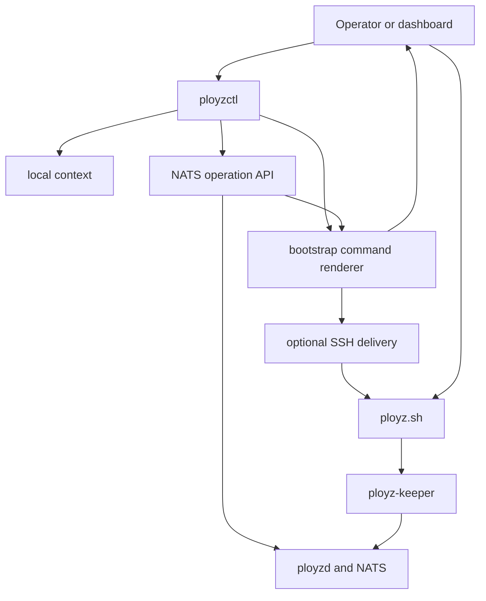
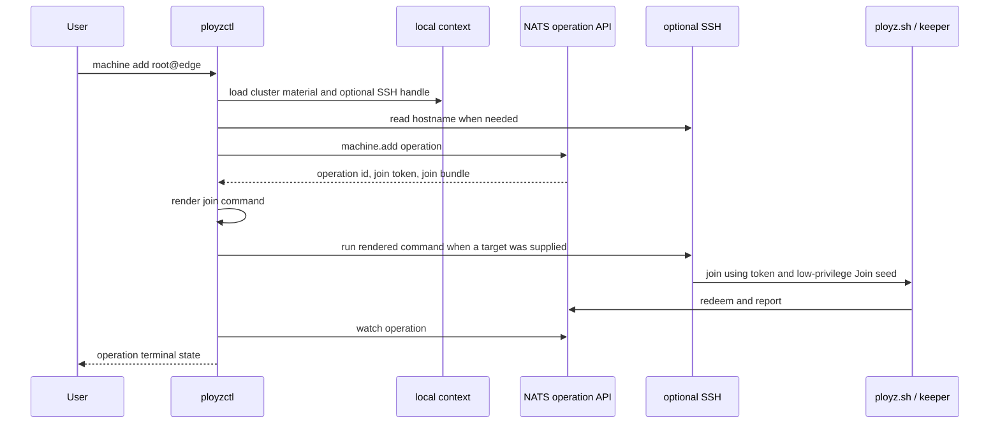
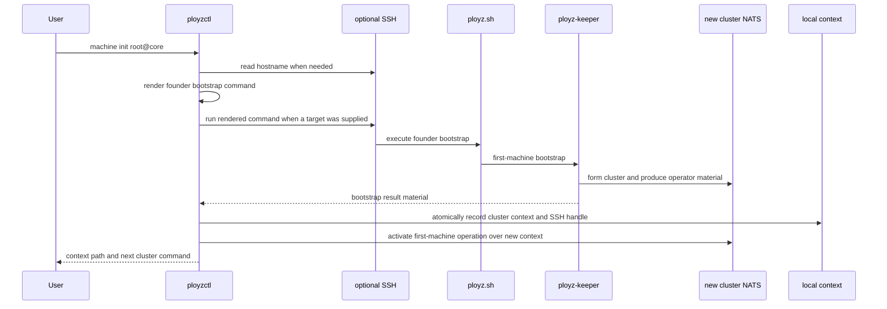

# refactor: Simplify bootstrap around context-backed delivery

## Summary

Make `ployzctl` a cluster client first: ordinary commands load the current cluster context and talk to NATS, while SSH is an optional delivery method stored in that context. Bootstrap should reduce to rendering founder and joiner commands, optionally running them over SSH, and recording connection material after the machine-local bootstrap boundary has produced it.

This supersedes the SSH-first parts of `docs/plans/2026-06-12-002-feat-alpha-quick-start-ergonomics-plan.md`. The product authority remains NATS credentials, subject permissions, and explicit operations.

---

## Problem Frame

`crates/ployzctl/src/remote_bootstrap.rs` and `crates/ployzctl/src/remote_machine_runtime.rs` currently make the CLI the installer brain for `machine init`. The CLI resolves remote release manifests, installs or verifies `nats-server`, builds first-machine specs, writes join templates twice, restarts control, reads CA and seed files back over SSH, writes local context, and then activates the first machine.

That is too much ownership for the client. The desired shape is closer to the useful part of Uncloud's context model: connection methods belong to local context, while product commands talk to the cluster. For Ployz, that means NATS remains the control-plane connection, and SSH becomes a delivery handle for bootstrapping a command onto a machine.

---

## Requirements

**Context and connection**

- R1. `ployzctl` commands that need a cluster must continue to load NATS URL, CA, operator seed, and Join seed from local context when flags and environment variables are absent.
- R2. Local context must support optional machine connection handles, starting with SSH destinations, without making SSH part of the product authority boundary.
- R3. Existing precedence must remain intact: `--nats` and environment variables override context values, and a corrupt context remains a loud error for cluster commands.
- R4. Context files use the current explicit shape; alpha migration/backward compatibility is out of scope.

**Bootstrap primitives**

- R5. Founder bootstrap and joiner bootstrap must both have a renderable command surface that can be printed without opening SSH.
- R6. Optional SSH delivery must run the same rendered command that copy/paste and future cloud-init delivery use.
- R7. `machine add` must keep NATS `machine.add` as the operation owner; SSH delivery happens only after the operation returns join material.
- R8. `machine init USER@HOST` must become a thin founder-delivery convenience, not a multi-phase remote installer orchestrator.

**Ownership cleanup**

- R9. `ployzctl` must stop owning release manifest parsing, first-machine spec assembly from release artifacts, remote `nats-server` setup, join-template rewrites, control restarts, and remote seed collection as SSH phases.
- R10. Machine-local installation details must belong to `scripts/ployz.sh`, `ployz-keeper`, or a future bootstrap endpoint, with `ployzctl` passing typed inputs instead of hand-preparing remote files.
- R11. Bootstrap failures must still preserve useful evidence: the rendered command path, optional SSH phase output, operation ID when one exists, and keeper/bootstrap terminal output.
- R12. Bootstrap result handling must not echo operator seeds or Join seeds in normal user-facing output.

**Future escape hatches**

- R13. Existing explicit operation commands can remain as current expert surfaces, but the old remote bootstrap/spec-preparation path does not need compatibility branches.
- R14. The shape must remain compatible with a future dashboard/cloud-init bootstrap-token envelope, but this plan does not implement dashboard workflows.

---

## Key Technical Decisions

- KTD1. `ployzctl` is a NATS client plus bootstrap command renderer: This keeps the client focused on context loading, operation submission, output rendering, and optional delivery.
- KTD2. Context grows minimally before becoming a full context product: Add optional machine connection metadata to the existing active context rather than introducing `context list/use/connect` UX in this pass.
- KTD3. Render once, deliver many ways: `machine add`, `machine init`, copy/paste, SSH, and future cloud-init should consume the same command-rendering functions.
- KTD4. SSH errors stay transport evidence, not product state: For joined machines, the accepted operation is the durable evidence; for founder bootstrap, no local context is recorded until usable cluster material is available.
- KTD5. Convert `machine add` first because it already has the right boundary: It submits a NATS operation, receives bootstrap material, renders an install command, and only then uses SSH.
- KTD6. Treat founder init as the only hard boundary gap: The current founder path has no clean bootstrap response that hands local context material to the CLI, so implementation should introduce or reuse a narrow result contract before deleting the thick SSH path.

---

## High-Level Technical Design

### Joiner Flow

### Founder Flow

---

## Scope Boundaries

### In Scope

- Simplify the Rust CLI/core bootstrap surface in this repository.
- Extend current local context with optional machine SSH handles.
- Create shared renderers for founder and joiner bootstrap commands.
- Convert SSH delivery to run rendered commands rather than owning installer substeps.
- Retire or quarantine the thick SSH-first helper surface after tests cover the new behavior.

### Deferred

- Dashboard implementation in `ployz-dashboard`.
- Full multi-context UX such as `context list`, `context use`, `context rename`, or connection probing.
- Provider-specific bootstrap adapters.
- Non-SSH connection methods beyond leaving the context model open for them.
- Hosted or self-hosted Cloud import/adopt flows beyond keeping this bootstrap contract compatible.

### Out of Scope

- Reintroducing SSH as the control-plane transport.
- Background reconciliation that mutates cluster truth without an operation owner.
- Changing NATS subject authority, credential authority, or operation state semantics.

---

## Implementation Units

### U1. Context v2 with optional machine delivery handles

- **Goal:** Extend local context so it remains the cluster connection record and can also remember how to deliver bootstrap commands to known machines.
- **Requirements:** R1, R2, R3, R4
- **Files:** `crates/ployzctl/src/config.rs`, `crates/ployzctl/src/runtime.rs`, `crates/ployzctl/src/ssh.rs`, `crates/ployzctl/tests/init_binary_nats.rs`, `crates/ployzctl/tests/cli_contract.rs`.
- **Approach:** Add a strict current serde shape with cluster material plus optional machine records keyed by machine ID or name. Each record starts with an optional SSH destination string and can be absent for dashboard/cloud-init/manual bootstraps. Keep `ClusterContext` validation for NATS URL and path fields, and add narrow parsing for SSH handles at the edge.
- **Test scenarios:** Current-shape context files with SSH handles round-trip; env and `--nats` still override context; corrupt context still errors for cluster commands; commands that do not need cluster context still ignore corrupt context where they do today.

### U2. Bootstrap command renderer module

- **Goal:** Make founder and joiner bootstrap commands first-class renderable values.
- **Requirements:** R5, R6, R10, R14
- **Files:** `crates/ployzctl/src/commands/machine.rs`, new `crates/ployzctl/src/bootstrap_command.rs`, `crates/ployzctl/src/shell.rs`, `crates/ployzctl/tests/machine_cli_contract.rs`, `crates/ployz-keeper/tests/bootstrap_script.rs`.
- **Approach:** Move command-string construction out of ad hoc remote flows into typed renderer structs. Keep shell quoting centralized. Joiner rendering should reuse `MachineAddOutput` material. Founder rendering should express the smallest input set the machine-local bootstrap needs, even if the first implementation still delegates to the current keeper first-machine mode behind the script.
- **Test scenarios:** Printed and SSH-run join commands are byte-for-byte the same; bootstrap URLs, tokens, seeds, CA material, and paths are safely quoted; founder command can be emitted without SSH; future token-envelope fields have an obvious renderer entry point without affecting current join behavior.

### U3. Convert `machine add USER@HOST` to context-backed delivery

- **Goal:** Keep the existing good NATS boundary and make SSH a delivery method sourced from the command target or context.
- **Requirements:** R2, R5, R6, R7, R11
- **Files:** `crates/ployzctl/src/remote_machine_runtime.rs`, `crates/ployzctl/src/commands/machine.rs`, `crates/ployzctl/src/runtime.rs`, `crates/ployzctl/tests/machine_remote_nats.rs`, `crates/ployzctl/tests/machine_add_binary_nats.rs`.
- **Approach:** Preserve the current sequence of deriving identity, submitting `machine.add`, rendering the join command, and watching the operation. Replace direct installer-command assembly with the shared renderer. When a target is supplied, store or update that SSH handle in context after the cluster operation succeeds far enough to identify the machine.
- **Test scenarios:** Remote add submits the same `MachineAddRequest`; install command rendering still matches printed output; SSH failure after operation acceptance includes the operation ID; context gets the SSH handle without changing NATS material; explicit non-remote `machine add` still only prints the command.

### U4. Define the founder bootstrap result boundary

- **Goal:** Replace remote seed collection with a narrow result contract that tells `ployzctl` what cluster context to record.
- **Requirements:** R8, R9, R10, R11, R12
- **Files:** `crates/ployzctl/src/commands/machine.rs`, `crates/ployzctl/src/remote_machine_runtime.rs`, `crates/ployzctl/src/config.rs`, `crates/ployz-keeper/src/main.rs`, `crates/ployz-keeper/src/cli.rs`, `crates/ployz-keeper/tests/bootstrap_script.rs`, `crates/ployzctl/tests/machine_remote_nats.rs`.
- **Approach:** Introduce a typed founder bootstrap output shape for NATS URL, CA, operator seed, optional Join seed, and machine identity. Prefer structured JSON emitted by the machine-local bootstrap boundary over `cat`-ing fixed keeper paths through SSH. `ployzctl` records local context only after parsing and validating that result, then calls the explicit first-machine activation API through the new context.
- **Test scenarios:** Successful founder SSH delivery writes context from parsed bootstrap output; failed founder delivery writes no context; malformed CA or seed material fails before context publish; normal stdout does not print seeds; missing config root remains explicit; `MachineInitOutput` still reports operation ID, context path, and next command.

### U5. Delete `remote_bootstrap.rs`

- **Goal:** Remove the CLI-owned installer substeps that conflict with the new boundary.
- **Requirements:** R8, R9, R10, R13
- **Files:** `crates/ployzctl/src/remote_bootstrap.rs`, `crates/ployzctl/src/remote_machine_runtime.rs`, `crates/ployzctl/src/lib.rs`, `crates/ployzctl/tests/machine_cli_contract.rs`, `crates/ployzctl/tests/machine_remote_nats.rs`.
- **Approach:** After U2-U4 land, delete release-manifest parsing, default manifest URL construction for remote SSH phases, first-machine spec construction, join-template construction, remote file write/read helpers, `ensure_nats_server_command`, and control restart helpers from `ployzctl`. Move still-current constants and renderers to the bootstrap command module.
- **Test scenarios:** `rg "ensure_nats_server_command|write_remote_file_command|read_remote_file_command|CollectOperatorMaterial|RestartControl" crates/ployzctl/src` returns no product path references; remaining tests assert rendered bootstrap commands and result parsing rather than remote file surgery.

### U6. Keep current explicit operation commands

- **Goal:** Keep explicit NATS operation commands available while replacing the product-facing bootstrap path.
- **Requirements:** R13
- **Files:** `crates/ployzctl/src/commands/init.rs`, `crates/ployzctl/tests/cli_contract.rs`, `crates/ployzctl/tests/init_binary_nats.rs`, `crates/ployz-e2e/tests/dind_cluster.rs`.
- **Approach:** Keep `ployzctl init --emit-keeper-install`, `ployzctl init --run-keeper-install`, `init activate-first-machine`, and explicit `machine add --machine ...` as explicit expert/NATS-facing commands. Do not preserve deleted remote SSH bootstrap compatibility.
- **Test scenarios:** Existing binary NATS tests continue to pass; low-level commands still parse; missing context messages point users at the new product path; e2e can move one scenario at a time.

### U7. Documentation and e2e proof

- **Goal:** Pin the simpler mental model in docs and prove the command surface end to end.
- **Requirements:** R5, R6, R7, R8, R14
- **Files:** `CONTEXT.md`, `README.md`, `docs/plans/2026-06-12-002-feat-alpha-quick-start-ergonomics-plan.md`, `crates/ployz-e2e/tests/dind_cluster.rs`, `crates/ployzctl/tests/deploy_cli_contract.rs`.
- **Approach:** Document the boundary as "bootstrap delivery" and "cluster context" rather than "remote SSH bootstrap." Update the old quick-start plan or downstream docs to state that SSH is optional delivery. Add e2e coverage for `machine init` and `machine add` using the new rendered command path.
- **Test scenarios:** Docs examples map to CLI contract tests where feasible; DinD uses product-facing commands; a no-SSH print-only bootstrap path has at least command contract coverage.

---

## Acceptance Examples

- AE1. Given an existing context with only `nats_url`, `nats_ca_file`, `operator_seed_file`, and `join_seed_file`, when `ployzctl machine list` runs without env or `--nats`, then it connects through that context.
- AE2. Given a cluster context and a fresh machine target, when `ployzctl machine add root@203.0.113.11` runs, then the CLI submits `machine.add` over NATS, renders the join command, delivers that exact command over SSH, and watches the operation.
- AE3. Given the same accepted join material, when the user runs explicit `ployzctl machine add --machine ...`, then the CLI prints the same join command without opening SSH.
- AE4. Given a founder target, when `ployzctl machine init root@203.0.113.10` succeeds, then the CLI records context from parsed bootstrap output, records the SSH handle as optional machine metadata, activates the first machine through NATS, and does not print seeds.
- AE5. Given a founder SSH delivery failure, when the installer exits non-zero, then no context is written and the error includes the failed delivery phase plus bootstrap output.

---

## System-Wide Impact

This plan tightens the authority boundary. NATS remains the cluster control plane, `ployz-keeper` remains the machine-local bootstrap actor, and `ployzctl` stops preparing machine internals over SSH. The local context file becomes more important because it carries both cluster credentials and optional delivery metadata, so its current shape and permissions remain part of the product contract.

The largest behavioral change is founder bootstrap. Joiner bootstrap is already close to the target shape, while founder bootstrap needs a result boundary before the old remote seed collection can disappear.

---

## Risks & Dependencies

- Founder bootstrap needs a small keeper/script output contract before `remote_bootstrap.rs` can be deleted. Implement that before removing the old path.
- Embedding the low-privilege Join seed in rendered commands is already the current model; renderer tests must keep quoting and output redaction decisions explicit.
- Context can grow into a context-management product too early. Keep this pass to active context plus optional machine handles.
- Dashboard/cloud-init compatibility can tempt a token service into this refactor. Keep the Rust shape compatible, but leave dashboard workflows to a later plan.

---

## Sources / Research

- `CONTEXT.md`: Current domain language for Machine Bootstrap, Founder Bootstrap, Joiner Bootstrap, and Bootstrap Delivery.
- `crates/ployzctl/src/config.rs`: Existing active cluster context, atomic writes, material generation directories, and precedence assumptions.
- `crates/ployzctl/src/runtime.rs`: Current NATS connection loading, command dispatch, and cluster-context fallback.
- `crates/ployzctl/src/commands/machine.rs`: Current `machine init`, `machine add`, identity derivation, and join install command rendering.
- `crates/ployzctl/src/remote_machine_runtime.rs`: Current thick SSH runtime for founder bootstrap and nearly-correct joiner flow.
- `crates/ployzctl/src/remote_bootstrap.rs`: Current release/spec/template/remote-command helper surface targeted for deletion or shrinkage.
- `scripts/ployz.sh`: Current local install, join mode, and first-machine mode handoff to keeper.
- `crates/ployz-keeper/src/cli.rs` and `crates/ployz-keeper/src/main.rs`: Current keeper first-machine and join execution boundaries.
- `crates/ployzd/src/operation_api/submit.rs`: Current `machine.add` operation acceptance and bootstrap material boundary.
- Local Uncloud prior art: context-owned connection methods and command routing through the selected context.
