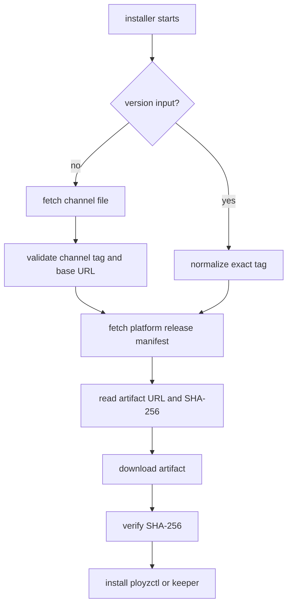
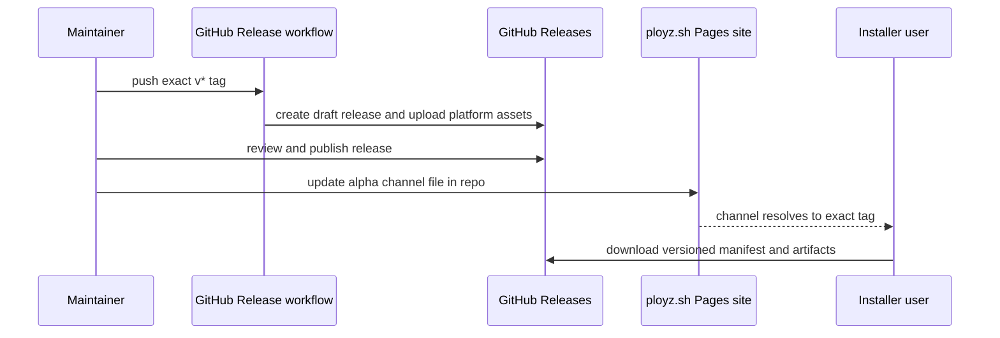

# feat: Add release channel installer

## Summary

Add a named release channel for the default installer path without making channels part of machine updates. `https://ployz.sh` serves the installer and mutable channel files, GitHub Releases remain the immutable host for versioned binaries and platform manifests, and every install resolves to one exact tag before downloading verified artifacts.

---

## Problem Frame

`scripts/ployz.sh` currently carries `default_version="v0.0.1-alpha.1"`, and `crates/ployzctl/src/remote_bootstrap.rs` duplicates that value as `DEFAULT_RELEASE_VERSION`. That makes ordinary `curl -fsSL https://ployz.sh | sh` installs depend on editing and redeploying the installer script for every promoted release.

Using GitHub's `latest` pointer would be convenient, but it does not match Ployz's update model. `docs/architecture/machine-updates.md` requires exact versions for keeper and substrate updates, and rejects channels or `latest` for those operations. The safe split is to use a mutable channel only as an installer convenience, then carry exact tags, exact manifest URLs, and SHA-256 values into bootstrap and update flows.

---

## Requirements

**Installer behavior**

- R1. Running `curl -fsSL https://ployz.sh | sh` resolves the default `alpha` channel to one exact release tag before fetching a platform release manifest.
- R2. `--version` and `PLOYZ_VERSION` continue to install an exact release and bypass channel lookup.
- R3. `--channel` and `PLOYZ_CHANNEL` select a named channel, and the installer rejects channel and version inputs when both are supplied.
- R4. `PLOYZ_RELEASE_MANIFEST_URL` remains an explicit override for tests, local artifact mirrors, and emergency operator use.
- R5. Channel resolution output names the selected channel and exact tag so operators can see what was installed.
- R6. Local CLI install and Linux machine bootstrap modes keep the existing artifact SHA-256 verification path.

**Release and hosting**

- R7. Versioned binaries and `ployz-release-<os>-<arch>.env` manifests remain GitHub Release assets under exact `v*` tags.
- R8. Channel files are mutable repo-tracked site files served from `https://ployz.sh/channels/<channel>.env`, not clobbered assets on versioned releases.
- R9. Channel promotion updates a channel file only after the exact GitHub release exists and its platform manifests are present.
- R10. The `ployz.sh` domain serves the current installer script without duplicating the script by hand in a second source file.
- R11. The release workflow keeps creating draft releases with all assets attached before publication, matching GitHub's immutable release guidance.

**Machine boundaries**

- R12. Founder and joiner bootstrap may accept a channel at delivery time, but the resolved bootstrap inputs use an exact tag and versioned manifest.
- R13. Keeper update, substrate update, and machine release source behavior continue to reject channels, ranges, and `latest`.
- R14. `ployzctl` remote bootstrap defaults stop depending on a hard-coded release version; current compatibility code resolves the same channel contract as the installer until the bootstrap simplification plan removes CLI-owned manifest parsing.

**Documentation and verification**

- R15. The release runbook documents exact release publishing, channel promotion, rollback by channel-file revert, and the non-use of GitHub `latest`.
- R16. Contract tests cover channel parsing, exact-version bypass, channel/version conflicts, missing channel keys, resolved manifest URL shape, and machine bootstrap exact-version preservation.

---

## Key Technical Decisions

- KTD1. Mutable channel files live outside immutable versioned releases: GitHub immutable releases protect tags and assets after publication, while the channel pointer is intentionally mutable. Keeping channel files in the repo-backed `ployz.sh` site preserves auditability without weakening versioned release immutability.
- KTD2. GitHub Releases remain the binary authority: The project already packages platform assets into GitHub Releases, and the installer already verifies SHA-256 values from versioned manifests. No R2, package registry, or custom binary host is added in this pass.
- KTD3. `ployz.sh` resolves channels before artifact selection: The installer normalizes `channel -> release tag -> platform manifest -> verified artifact`, so downstream machine-local code receives exact artifact metadata.
- KTD4. Exact version still wins over channel: Operator-specified `--version` and `PLOYZ_VERSION` are the reproducibility escape hatch and must bypass mutable channel state.
- KTD5. Channel promotion is a repo change, not an asset clobber: Updating `site/channels/alpha.env` through the normal default-branch path gives review, history, and rollback through git.
- KTD6. GitHub `latest` stays unused: It is a moving release label and does not express the explicit alpha channel decision or the exact-version rule used by machine updates.
- KTD7. The Pages deployment stages from source files: The workflow copies `scripts/ployz.sh` into the Pages artifact root as both the root installer response and `install.sh`, then copies tracked channel files into `channels/`. The custom domain is configured in GitHub Pages settings or API, not inferred from the workflow artifact.

---

## High-Level Technical Design

### Install Resolution



### Promotion Boundary



The channel file should be small and shell-parseable:

```text
PLOYZ_CHANNEL=alpha
PLOYZ_RELEASE_TAG=v0.0.2-alpha.1
PLOYZ_VERSION=0.0.2-alpha.1
PLOYZ_RELEASE_BASE_URL=https://github.com/getployz/ployz/releases/download/v0.0.2-alpha.1
```

The platform manifest remains the per-release artifact contract and continues to carry `PLOYZCTL_URL`, `PLOYZCTL_SHA256`, and Linux machine artifact keys.

---

## Implementation Units

### U1. Installer channel resolution

- **Goal:** Replace the hard-coded installer default version with a default channel that resolves to an exact tag.
- **Requirements:** R1, R2, R3, R4, R5, R6
- **Dependencies:** None
- **Files:** `scripts/ployz.sh`, `crates/ployz-keeper/tests/bootstrap_script.rs`.
- **Approach:** Add `default_channel="alpha"`, `--channel`, and `PLOYZ_CHANNEL`. Treat `--version`/`PLOYZ_VERSION`, `--channel`/`PLOYZ_CHANNEL`, and `PLOYZ_RELEASE_MANIFEST_URL` as mutually clear resolution modes: manifest override wins for tests, exact version bypasses channel lookup, otherwise the selected channel file is fetched from `https://ployz.sh/channels/<channel>.env`. Parse channel files with the same simple `KEY=VALUE` approach as release manifests and validate `PLOYZ_RELEASE_TAG`, `PLOYZ_VERSION`, and `PLOYZ_RELEASE_BASE_URL` before building the platform manifest URL.
- **Patterns to follow:** Keep the script POSIX `sh`, mirror the current `manifest_value` and missing-key error style in `scripts/ployz.sh`, and extend the existing fake `curl`, `uname`, and checksum test harness in `crates/ployz-keeper/tests/bootstrap_script.rs`.
- **Test scenarios:** Default local install fetches `channels/alpha.env`, reports `alpha` and the resolved tag, fetches the platform manifest under that tag, verifies `ployzctl`, and installs it; `--version v0.0.2-alpha.1` never fetches a channel file; `--channel beta` fetches `channels/beta.env`; passing both channel and version fails before network access; a channel file missing `PLOYZ_RELEASE_TAG` names the key and URL; `PLOYZ_RELEASE_MANIFEST_URL` continues to bypass channel and version resolution.
- **Verification:** Installer contract tests prove local mode and machine modes still install only the expected binary, and no test depends on the old hard-coded default version.

### U2. Repo-backed `ployz.sh` site

- **Goal:** Serve the installer and channel files from the owned domain while keeping GitHub Releases as the artifact host.
- **Requirements:** R8, R10
- **Dependencies:** U1
- **Files:** `site/channels/alpha.env`, `site/.nojekyll`, new `scripts/stage-ployz-sh-site.sh`, new `.github/workflows/ployz-sh.yml`, `docs/operations/release.md`.
- **Approach:** Add a static site staging script that copies `scripts/ployz.sh` into a Pages artifact root as `index.html` and `install.sh`, then copies `site/channels/` unchanged. The Pages workflow publishes from the default branch and does not upload binaries. DNS, custom domain, and HTTPS setup stay in repository/operator configuration because GitHub Pages custom workflows do not configure the domain from a copied `CNAME` file.
- **Patterns to follow:** Keep shell staging helpers alongside existing release helpers in `scripts/`; keep workflow logic thin like `.github/workflows/release.yml`.
- **Test scenarios:** The staging script produces `index.html`, `install.sh`, `.nojekyll`, and `channels/alpha.env`; staged root installer content matches `scripts/ployz.sh`; channel files are copied without modification; the workflow does not run on release tags and does not require release build artifacts; the runbook covers custom-domain and HTTPS setup outside the artifact.
- **Verification:** A staged site directory can be inspected locally, and the workflow definition uses GitHub Pages deployment rather than release upload.

### U3. Release promotion and hardening

- **Goal:** Make the release workflow and channel promotion match the immutable-release split.
- **Requirements:** R7, R8, R9, R11, R15
- **Dependencies:** U2
- **Files:** `.github/workflows/release.yml`, `scripts/package-release.sh`, new `scripts/verify-release-assets.sh`, `docs/operations/release.md`.
- **Approach:** Keep the tag-triggered workflow focused on versioned assets and draft releases. Add a verification helper that checks the published release has all four platform manifests and required binaries before a channel file points at it. Document channel promotion as a repo change to `site/channels/alpha.env` after release review, not as `gh release upload --clobber` on a channel release. Where available, generate GitHub artifact attestations in the platform packaging jobs that built the staged assets; if the repo can only attest downloaded publish-job artifacts, document those attestations as release metadata rather than build provenance. Installer enforcement remains on SHA-256 until attestation verification becomes part of the installer contract.
- **Patterns to follow:** Reuse `sha256_of` and platform slug vocabulary from `scripts/lib.sh` and `scripts/package-release.sh`.
- **Test scenarios:** Verification fails when any platform manifest is missing; verification fails when a manifest points at a non-existent asset; verification accepts a release whose manifests and assets are complete; generated channel content points to the same exact tag and base URL verified by the helper; release workflow permissions include only the scopes needed for contents and attestations; attestation metadata, when enabled, is produced by the packaging job that built the asset rather than only by the publish job.
- **Verification:** A dry-run promotion against locally staged release assets proves the channel file can be generated and validated before commit.

### U4. `ployzctl` remote bootstrap compatibility

- **Goal:** Remove duplicated hard-coded release defaults from the CLI bootstrap path and preserve exact-version bootstrap inputs.
- **Requirements:** R12, R13, R14, R16
- **Dependencies:** U1
- **Files:** `crates/ployzctl/src/remote_bootstrap.rs`, `crates/ployzctl/src/commands/machine.rs`, `crates/ployzctl/src/remote_machine_runtime.rs`, `crates/ployzctl/tests/machine_cli_contract.rs`, `crates/ployzctl/tests/machine_remote_nats.rs`.
- **Approach:** Replace `DEFAULT_RELEASE_VERSION` with channel-aware input modeling. In the current thick remote-bootstrap path, resolve the selected channel to an exact tag before fetching the platform release manifest and building the first-machine install spec. When the bootstrap simplification plan removes CLI-owned release manifest parsing, carry the same contract into the rendered installer command instead of the local Rust parser.
- **Patterns to follow:** Preserve current explicit error style from `RemoteBootstrapError::ManifestMissingKey` and command parsing conflicts in `machine_cli_contract.rs`.
- **Test scenarios:** `machine init` with no version uses the default channel and resolves it before building artifact specs; `machine init --version v0.0.2-alpha.1` bypasses channel lookup; `machine init --channel alpha --version v0.0.2-alpha.1` fails at parse time; resolved first-machine specs contain `PLOYZ_VERSION=0.0.2-alpha.1` artifact versions and versioned GitHub asset URLs; `machine add` install commands continue to receive exact versions from accepted join material.
- **Verification:** CLI contract tests no longer assert the old default release tag, and machine update docs remain accurate: update commands reject channels.

### U5. Release documentation and operator runbook

- **Goal:** Make publishing, promotion, rollback, and install behavior clear enough to operate without re-deriving the model.
- **Requirements:** R5, R11, R13, R15
- **Dependencies:** U1, U2, U3, U4
- **Files:** `README.md`, new `docs/operations/release.md`, `docs/architecture/machine-updates.md`.
- **Approach:** Document the user install commands, exact install commands, channel promotion flow, and rollback by reverting the channel file. State that GitHub `latest` is not used by the installer or updates. Add the repo settings checklist for immutable releases, tag rulesets, GitHub Pages custom domain, and HTTPS provisioning as operator prerequisites.
- **Patterns to follow:** Keep README terse like the alpha quick-start plan; put operational detail in `docs/operations/`.
- **Test scenarios:** Documentation examples for `sh -s -- --channel alpha` and `sh -s -- --version v0.0.2-alpha.1` are mirrored by installer contract tests; docs mention that keeper/substrate updates require exact versions; release runbook describes the failure path when asset verification blocks promotion.
- **Verification:** A reviewer can follow the runbook from tag push through published channel without using undocumented commands.

---

## Acceptance Examples

- AE1. Given `site/channels/alpha.env` points to `v0.0.2-alpha.1`, when a macOS user runs `curl -fsSL https://ployz.sh | sh`, then the installer reports `alpha -> v0.0.2-alpha.1`, downloads `ployz-release-darwin-<arch>.env` from that release, verifies `ployzctl`, and installs it.
- AE2. Given the same channel file, when a user runs `curl -fsSL https://ployz.sh | sh -s -- --version v0.0.1-alpha.1`, then the installer does not fetch `alpha.env` and installs from the `v0.0.1-alpha.1` platform manifest.
- AE3. Given a channel file missing `PLOYZ_RELEASE_TAG`, when the default installer runs, then it exits non-zero and names the broken channel file URL and missing key.
- AE4. Given a reviewed release missing `ployz-release-linux-arm64.env`, when the operator tries to promote `alpha` to that tag, then release verification fails before `site/channels/alpha.env` is changed.
- AE5. Given a machine update command, when the requested version is `alpha` or `latest`, then the update path still rejects it as not an exact Ployz version.

---

## Scope Boundaries

### In Scope

- Default installer channel resolution.
- `ployz.sh` static site and GitHub Pages deployment from this repository.
- GitHub Releases as the versioned binary and platform-manifest host.
- Channel promotion through a repo-tracked channel file.
- Compatibility with current `ployzctl` remote bootstrap behavior.

### Deferred to Follow-Up Work

- Installer-side artifact attestation verification.
- A custom R2/S3/package-registry binary mirror.
- Multiple release channels beyond adding the contract and `alpha`.
- Automatic multi-machine rollout or update policy.
- Package-manager installers such as Homebrew, apt, or yum.

### Out of Scope

- Using GitHub `latest` as the installer default.
- Allowing keeper or substrate update commands to target channels, ranges, or `latest`.
- Moving machine-local release source authority into Cloud or the public website.

---

## System-Wide Impact

This change improves install ergonomics without changing cluster authority. The mutable surface is the channel pointer before installation; once resolved, the bootstrap path still uses exact artifact metadata and SHA-256 verification. Machine updates remain explicit single-machine operations targeting exact versions.

The main new operational surface is the `ployz.sh` static site. It should be treated as release infrastructure: protected default branch, verified custom domain, HTTPS, and small files that are easy to audit.

---

## Risks & Dependencies

- Channel files are intentionally mutable. Mitigation: keep them in git, review changes through default-branch protections, and document rollback as reverting the channel file.
- GitHub immutable releases conflict with mutable channel assets. Mitigation: never host channel pointers as assets on immutable versioned releases.
- GitHub Pages root serving uses a staged `index.html` copy of the shell script. Mitigation: generate it from `scripts/ployz.sh` in workflow and test that the staged copy matches source.
- Custom-domain configuration can drift from the repository source because Pages custom workflows do not configure it from the artifact. Mitigation: document the Pages settings/API setup and include a post-deploy check that `https://ployz.sh/channels/alpha.env` resolves over HTTPS.
- Current `ployzctl` remote bootstrap still owns release manifest parsing. Mitigation: keep channel compatibility small and align it with `docs/plans/2026-06-16-002-refactor-bootstrap-context-simplification-plan.md`, which moves bootstrap delivery back toward the script and keeper boundary.
- Artifact attestations may not be available for every repository visibility or plan combination. Mitigation: treat attestations as release metadata in this pass and keep installer enforcement on existing SHA-256 checks.
- Attesting only from the publish job could mislead readers about build provenance. Mitigation: either attest in the platform packaging jobs or document publish-job attestations as release metadata only.

---

## Documentation / Operational Notes

The release runbook should say:

- publish exact `v*` releases through the existing draft-release workflow,
- review and publish the exact release,
- verify all platform manifests and assets,
- update `site/channels/alpha.env` in git,
- let GitHub Pages deploy `https://ployz.sh`,
- roll back a bad channel promotion by reverting the channel-file change.

Repository settings should include immutable releases for `v*` releases, tag rulesets for release tags, GitHub Pages configured for Actions, and the `ployz.sh` custom domain with HTTPS enabled.

---

## Sources / Research

- `scripts/ployz.sh`: current hard-coded default version, exact release manifest resolution, local install, join mode, first-machine mode, and SHA-256 verification.
- `scripts/package-release.sh`: current platform artifact and release manifest packaging.
- `.github/workflows/release.yml`: current tag-triggered draft release workflow.
- `crates/ployz-keeper/tests/bootstrap_script.rs`: current installer contract coverage and fake network/checksum harness.
- `crates/ployzctl/src/remote_bootstrap.rs`: duplicated default release version and current remote manifest parsing.
- `crates/ployzctl/tests/machine_cli_contract.rs`: current release manifest parsing and default URL tests.
- `docs/architecture/machine-updates.md`: exact-version update rule and rejection of channels or `latest`.
- `docs/plans/2026-06-12-002-feat-alpha-quick-start-ergonomics-plan.md`: original local installer and release manifest ergonomics plan.
- `docs/plans/2026-06-16-002-refactor-bootstrap-context-simplification-plan.md`: planned cleanup of CLI-owned release manifest parsing.
- [GitHub immutable releases](https://docs.github.com/en/code-security/concepts/supply-chain-security/immutable-releases): versioned releases can protect tags and assets after publication and recommend draft -> attach assets -> publish.
- [GitHub Pages custom workflows](https://docs.github.com/en/pages/getting-started-with-github-pages/configuring-a-publishing-source-for-your-github-pages-site): Pages can publish from GitHub Actions and deploy a static artifact.
- [GitHub Pages HTTPS](https://docs.github.com/en/pages/getting-started-with-github-pages/securing-your-github-pages-site-with-https): custom domains can receive HTTPS certificates when DNS is configured correctly.
- [GitHub rulesets](https://docs.github.com/en/repositories/configuring-branches-and-merges-in-your-repository/managing-rulesets/about-rulesets): rulesets can target branches and tags and control deletion or rename behavior.
