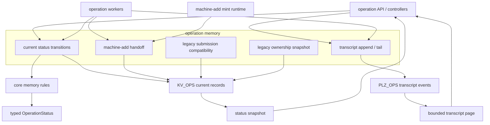
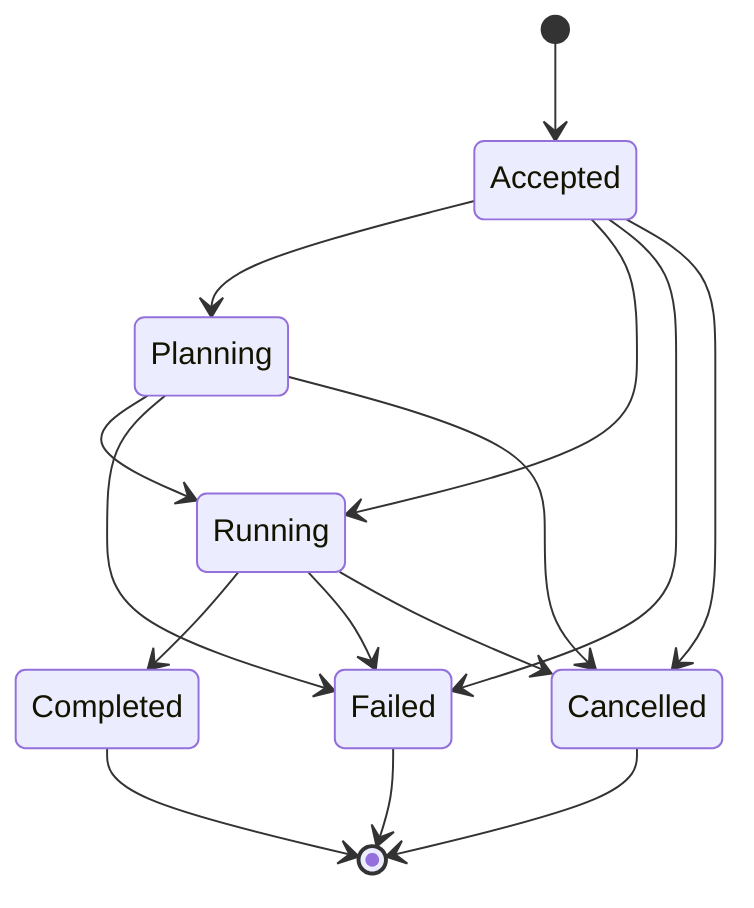

# refactor: Deepen operation memory inside KV_OPS

## Summary

This plan consolidates operation status, terminal-state rules, bounded transcript replay, ownership reporting, and typed failure details behind an operation-memory boundary. `KV_OPS` remains disposable operation memory: useful while JetStream survives, but not workflow state and not cluster truth after loss.

---

## Problem Frame

Operation behavior is still split across `crates/ployz-nats/src/operations/status_store.rs`, `crates/ployz-nats/src/operations/repository.rs`, `crates/ployz-nats/src/operations/repository/submission.rs`, and `crates/ployz-core/src/ops/projection.rs`. Callers coordinate current status writes, event append decisions, replay terminal cursors, owner leases, and projection errors directly.

The June 7 operations requirements moved Ployz toward succeed-or-die operations: status is the user-facing contract, events are transcript evidence, and future operations plan from runtime state rather than operation logs. This refactor keeps that product boundary while giving operation memory one local home for the state and evidence contract.

---

## Requirements

**Memory Boundary**

- R1. Operation memory must own direct current-status transition writes, terminal-state enforcement, status snapshots, bounded transcript replay, and typed operation-memory errors.
- R2. Operation memory must preserve ADR-0003: it may record what happened, but it must not become a workflow engine, takeover mechanism, retry scheduler, or source of deploy correctness.
- R3. `KV_OPS` records must remain classified as disposable current status, machine-add pending join material, machine-add mint claims, temporary secret-bearing handoff, legacy submission compatibility records, or transitional ownership evidence.

**Status And Transcript**

- R4. Operation status must remain the public read contract, with event history exposed only as best-effort transcript evidence (origin R2, R3, R4, R5).
- R5. Operation status must be written by the operation owner through a status-transition API; transcript append, transcript tail, and replay must not advance current status.
- R6. Terminal operation states must be final across deploy, cert, machine-add, and backup operations, including typed failure details and cancellation reasons.
- R7. Transcript replay must enforce the typed replay limit and terminal cursor behavior inside the operation-memory API rather than in callers.

**Submission And Ownership**

- R8. Deploy, cert, and backup duplicate mutation handling must move toward explicit locks and `resource_busy`; legacy idempotency/adoption behavior may remain only as compatibility outside the operation-memory core.
- R9. Machine-add pending join material, token indexes, mint claims, and secret delivery records must have explicit redaction, retention, deletion, and redemption rules.
- R10. Owner leases must not be part of the new memory core; remove execution lease claims where resource locks or worker ownership already fence work, and keep only transitional read-only ownership snapshots when required by an existing API contract.
- R11. Public status, transcript, submit/adopt, and machine-add redemption APIs must preserve existing typed error categories, enforce the existing NATS authority boundary, and return non-leaking unauthorized or not-found responses.

**Scope Control**

- R12. The refactor must reduce caller knowledge of how `KV_OPS` and `PLZ_OPS` fit together without adding a generic operation engine (origin R47, R48, R49).
- R13. Broader namespace deploy simplification, CLI `ops watch` to `ops tail` naming, and deletion of transitional compatibility adapters are deferred unless required to keep the memory boundary coherent.

---

## High-Level Technical Design

Operation memory should sit between callers and the two persistence surfaces. Core rules decide whether a direct status transition, evidence cursor update, or terminal result is valid. The NATS memory layer performs bounded KV and stream I/O, exposes narrow machine-add secret handoff methods, and returns typed outcomes that controllers can map without reimplementing store/event relationships.

New transition recording is status-first: the operation owner attempts a current-status write against the latest `KV_OPS` revision, terminal finality is enforced there, and transcript append records evidence after the accepted status write. Replay and tailing read `PLZ_OPS` as transcript evidence only. Compatibility code may validate an already stored duplicate event or recover an already accepted write, but transcript replay cannot become the correctness path.

The diagram is intentionally generic. Each operation kind keeps its typed state and allowed stage sequence; the shared memory rule is terminal finality plus typed transition rejection. Evidence may be included in direct status updates as a cursor or freshness marker, but transcript tailing must not reopen or advance current status.

---

## Key Technical Decisions

- KTD1. **Direct status writes are the correctness path:** `crates/ployz-core/src/ops/projection.rs` should shrink into a pure operation-memory rule surface for attempted current-status transitions, terminal finality, evidence cursor validation, and typed rejection. Legacy duplicate-event handling may compare stored payloads with already accepted status, but it must not project transcript history into current status.
- KTD2. **Split the memory facade into stable sub-boundaries:** `crates/ployz-nats/src/operations/status_store.rs` should expose current status, transcript, machine-add handoff, legacy submission compatibility, and legacy ownership snapshot methods rather than low-level `KV_OPS` helpers.
- KTD3. **Treat `PLZ_OPS` as transcript backing, not source of correctness:** operation memory can append events and page transcripts, but transcript append failure must not erase an accepted status write, and replay must not advance current status.
- KTD4. **Stop hardening deploy/cert/backup idempotency as core memory:** duplicate mutation correctness belongs to explicit locks and `resource_busy`. Existing adoption behavior can be preserved as a compatibility adapter while callers are migrated.
- KTD5. **Keep machine-add secrets behind separate handoff APIs:** pending join material, token indexes, mint claims, and secret delivery records must not cross public status, transcript, SDK, error, or log boundaries except through the token-redemption path.
- KTD6. **Preserve wire compatibility and authority boundaries:** existing SDK/API error families such as status-store unavailable, event-log unavailable, duplicate sequence mismatch, no such operation, unauthorized, and status read failures should keep their serialized shape unless a contract change is deliberately scoped.
- KTD7. **Defer broad operation-kind redesign:** deploy, cert, machine-add, and backup should reuse one memory boundary while keeping their variant-specific state and failure details.

---

## Implementation Units

### U1. Core Operation Memory Rules

**Goal:** Make core operation-memory rules explicit around direct current-status transitions, terminal finality, evidence cursor validation, and typed failure detail validation.

**Requirements:** R1, R2, R4, R5, R6, R12.

**Dependencies:** None.

**Files:**

- `crates/ployz-core/src/ops/projection.rs`
- `crates/ployz-core/src/ops/backup.rs`
- `crates/ployz-core/src/ops.rs`
- `crates/ployz-core/tests/operation_projection.rs`
- `crates/ployz-core/tests/wire_contract.rs`

**Approach:** Reshape projection vocabulary away from event replay and toward operation-memory transition rules. Keep exported compatibility only where callers still need a legacy duplicate-event validator, but make the internal concepts read as current status, attempted status transition, terminal result, evidence cursor, and typed rejection. Keep failure data variant-specific: deploy failures stay deploy-shaped, cert failures stay cert-shaped, machine-add failures stay machine-add-shaped, and backup failures stay backup-shaped.

**Patterns to follow:** Existing exhaustive matches in `crates/ployz-core/src/ops/projection.rs`; `OperationStatus` accessors in `crates/ployz-core/src/ops/accessors.rs`; backup-specific transition rules in `crates/ployz-core/src/ops/backup.rs`.

**Test scenarios:**

- A deploy accepted status records planning, then running, then completed through direct status transitions, and the resulting current status carries the completed outcome.
- A completed, failed, or cancelled deploy rejects a later running transition with a terminal-state error that includes both current and attempted typed states.
- A cert transition whose subject cert does not match the current cert status returns a typed subject-mismatch error and does not synthesize a new status.
- A machine-add failure is accepted only from the state where that failure class is valid; bootstrap failures from pending state and credential failures from joining state are rejected.
- A backup running stage cannot skip directly from accepted to manifest writing, and a failed backup cannot later complete.
- A stale or duplicate compatibility event returns an already-satisfied outcome only when it matches an already accepted status transition and does not alter status.
- Wire contract tests continue to serialize existing public operation states, terminal failure details, replay request limits, and replay cursors without shape drift.

**Verification:** Core operation-memory tests describe the direct transition rules without referencing NATS storage, and public wire tests fail if typed failure details or replay-limit serialization changes.

### U2. KV_OPS Operation Memory Store

**Goal:** Make `KV_OPS` record families feel like operation memory instead of unrelated status-store helpers.

**Requirements:** R1, R3, R7, R8, R9, R10, R12.

**Dependencies:** U1.

**Files:**

- `crates/ployz-nats/src/operations/status_store.rs`
- `crates/ployz-nats/src/operations/keys.rs`
- `crates/ployz-nats/src/operations.rs`
- `crates/ployzd/src/nats_authorization/mint.rs`
- `crates/ployz-nats/tests/operations_nats/status.rs`
- `crates/ployz-nats/tests/operations_nats/machine_add_submission.rs`
- `crates/ployzd/tests/machine_add_mint.rs`

**Approach:** Keep the existing bucket and key names, but group behavior by memory responsibility: current status, machine-add pending join material, join-token indexes, mint claims, temporary secret delivery, legacy submission compatibility records, and transitional ownership evidence. Prefer a compatibility wrapper or re-export over a disruptive public rename in the first pass. Move stale-write classification, current-status CAS writes, machine-add sequence finalization, token redemption, unfinished-mint listing, mint-claim adoption, secret delivery, and read-only ownership snapshots behind methods whose names describe memory intent.

Secret-bearing methods must be separate from public status and transcript methods. Public DTOs, generated SDK types, typed errors, logs, and transcript pages must never include join tokens, mint material, machine credentials, or secret-delivery payloads. Only the token-redemption path may read secret delivery, and it must delete the temporary handoff after successful read or terminal join reporting.

Machine-add lifecycle rules should land with this refactor:

- Pending join material is retained only while the operation is non-terminal and waiting for redemption; completed, failed, cancelled, or expired joins delete the secret-bearing record and keep only redacted operation status.
- Join-token indexes are deleted when redeemed into a mint claim or when the operation becomes terminal or expires.
- Mint claims are retained only while material is being minted and handed off; completed, failed, cancelled, or expired joins delete the claim.
- Secret delivery records are one-time handoffs and are deleted after successful read or after any terminal join report, whichever comes first.

**Patterns to follow:** The existing `get_record` and `create_or_adopt` helpers in `status_store.rs`; `AdoptPolicy::RequireEqual` for token, mint-claim, and secret-delivery conflicts; current mint-runtime handling in `crates/ployzd/src/nats_authorization/mint.rs`.

**Test scenarios:**

- A newer current-status write stores and a lower compatibility event sequence is classified as stale without changing the stored status.
- A create conflict on a legacy submission compatibility key re-reads and adopts the first stored record without making adoption part of the core memory API.
- A create conflict on a join-token fingerprint rejects mismatched operation or idempotency key data.
- A machine-add submission sequence can be recorded once, repeated idempotently with the same sequence, and rejected with a different sequence.
- Mint-runtime resume lists unfinished mint claims through operation memory rather than direct `KV_OPS` access.
- Secret-delivery deletion removes only the temporary handoff record and leaves current operation status and redacted submission memory intact.
- Completed, failed, cancelled, and expired machine-add operations delete or redact pending join, token index, mint claim, and secret delivery records according to the lifecycle rules above.
- A status snapshot can include a transitional ownership view when an existing API requires it, but no memory-core method depends on an owner lease to accept or execute an operation.

**Verification:** NATS-backed tests prove `KV_OPS` key behavior, conflict adoption compatibility, machine-add secret lifecycle, mint-runtime resume, and read-only ownership snapshots through the new operation-memory surface while preserving existing key names.

### U3. Submission Compatibility And Machine-Add Handoff

**Goal:** Move accepted-status creation and machine-add handoff behind operation memory while keeping deploy, cert, and backup idempotency adoption as a transitional compatibility adapter.

**Requirements:** R2, R4, R8, R9, R10, R11, R12.

**Dependencies:** U1, U2.

**Files:**

- `crates/ployz-nats/src/operations/repository/submission.rs`
- `crates/ployz-nats/src/operations/repository.rs`
- `crates/ployz-nats/src/operations/repository/machine_join.rs`
- `crates/ployzd/src/nats_authorization/mint.rs`
- `crates/ployz-nats/tests/operations_nats/submission.rs`
- `crates/ployz-nats/tests/operations_nats/machine_add_submission.rs`
- `crates/ployz-nats/tests/operations_nats/machine_join.rs`
- `crates/ployzd/tests/machine_add_mint.rs`

**Approach:** Keep the existing per-kind submission adapter shape, but narrow what belongs in operation memory:

- Deploy, cert, and backup submission should call operation memory to create the accepted status for the winning operation.
- Duplicate deploy, cert, and backup mutation correctness should be handled by resource or namespace locks and `resource_busy` where that boundary exists. Legacy idempotency adoption can preserve the current wire behavior as a compatibility adapter, but it should not be part of the core memory contract.
- Machine-add pending join material, join-token indexes, mint claims, and secret delivery remain operation memory because they are the handoff contract for a bounded machine-add attempt.
- Owner lease claims should be removed from submission acceptance where worker ownership or resource locks already fence execution. A lease-claim failure must not invalidate an accepted operation.

Define the non-atomic submit boundary explicitly. For deploy, cert, and backup, the accepted point is the successful current-status create. If a transcript append fails after that point, the operation remains accepted and callers receive the existing typed transcript/event-log failure where applicable. If legacy append-before-status compatibility sees an ambiguous or duplicate event, it may validate the stored payload and create the missing accepted status only when the direct-transition rules allow it; otherwise it returns the existing indeterminate or duplicate-mismatch category. For machine-add, retries may adopt only identical pending join material; missing or mismatched secret-bearing records return typed conflict or incomplete-memory errors without synthesizing replacement secrets.

**Patterns to follow:** Existing `SubmitKind` adapter in `repository/submission.rs`; current machine-add idempotency comparison in `ensure_machine_add_retry_matches`; join redemption consistency checks in `repository/machine_join.rs`.

**Test scenarios:**

- Deploy submit under an active namespace/resource lock returns `resource_busy` and does not create an operation record solely to report the rejected submit.
- Legacy duplicate deploy submit keeps the current wire behavior through the compatibility adapter, but tests name it as compatibility and do not require the new memory API to expose adoption as a first-class primitive.
- Duplicate backup or cert submit follows the same compatibility boundary without operation-kind-specific storage code in callers.
- A transcript append failure after accepted-status creation does not erase or downgrade the accepted status.
- A legacy append-before-status retry creates missing accepted status only when the stored event payload matches the attempted submit and direct-transition rules accept it.
- Machine-add retry with identical join material adopts the existing pending submission and indexed join token.
- Machine-add retry with the same idempotency key but different join material returns the existing typed conflict path.
- Join redemption reads pending join memory through the memory API and rejects an index that points at a missing or mismatched submission.
- Mint runtime lists unfinished mints, adopts mint claims, writes secret delivery, and reads pending machine-add status through the operation-memory API.
- Submission acceptance does not depend on successful owner-lease creation when resource locks or worker ownership already fence execution.

**Verification:** Submission tests show that operation memory owns accepted status and machine-add handoff, while legacy idempotency and ownership behavior remain isolated compatibility instead of new core memory surface.

### U4. Status-First Recording And Transcript Replay Boundary

**Goal:** Centralize direct status-transition writes, transcript append, replay limits, and terminal cursor behavior behind operation memory.

**Requirements:** R1, R2, R4, R5, R6, R7, R12.

**Dependencies:** U1, U2.

**Files:**

- `crates/ployz-nats/src/operations/repository.rs`
- `crates/ployz-nats/src/operations/events.rs`
- `crates/ployz-core/src/ops/replay.rs`
- `crates/ployz-nats/tests/operations_nats/transitions.rs`
- `crates/ployz-nats/tests/operations_nats/evidence.rs`
- `crates/ployz-nats/tests/operations_nats/evidence_rejection.rs`
- `crates/ployz-nats/tests/operations_nats/event_log.rs`

**Approach:** Replace the current event-first recording path with status-first recording. The operation owner submits an attempted current-status transition or evidence-cursor update. Operation memory loads the latest status and `KV_OPS` revision, asks core rules whether the attempt is valid, writes the new status with CAS, and reloads/retries on CAS contention. If the latest status is terminal, terminal finality wins before any transcript append. Only after the status write is accepted should operation memory append transcript evidence to `PLZ_OPS`.

Keep a failure-window matrix in the implementation and tests:

- Status write succeeds, transcript append fails: current status remains the public source of truth; return or record the existing typed transcript/event-log failure without rolling back status.
- Status CAS collides with another terminal write: reload latest status, reject or satisfy the attempted transition against the terminal status, and preserve the first terminal detail.
- Transcript append timeout is ambiguous: re-read by expected sequence or idempotency marker before appending again; duplicate append with matching payload is already satisfied.
- Duplicate transcript payload mismatch: return stored-event mismatch and preserve current status.
- Legacy append-before-status event exists: validate the stored payload and write missing status only if it represents the same direct transition and terminal rules still allow it; otherwise return typed indeterminate or contended memory.
- Replay of transcript pages reads `PLZ_OPS` with typed limits and cursors only; it must not mutate `KV_OPS`.

Keep deploy evidence handling local to the memory boundary: evidence can be reflected in status only when the operation owner writes an explicit status/evidence-cursor update, and transcript tailing cannot reopen terminal status.

**Patterns to follow:** Existing `record_operation_event_with_validator` pre-check flow; `StoredEventMismatchKind` for deploy-plan duplicate classification; `OperationEventReplayLimit` and cursor types in `ops/replay.rs`.

**Test scenarios:**

- Recording a deploy transition updates current status first, then appends transcript evidence; duplicate transition recording returns already satisfied when it matches the stored status and transcript payload.
- Racing completed, failed, and cancelled writes use a reload/CAS retry loop so only the first terminal status is stored.
- A transcript append failure after a successful status write leaves status accepted and returns the existing typed transcript failure.
- Recording deploy evidence at the correct current stage stores an explicit status/evidence-cursor update before transcript append.
- Deploy evidence from an earlier stage is treated as already satisfied after the operation has progressed beyond that stage.
- Deploy evidence after a terminal status is accepted only when it matches an already stored duplicate event or satisfies the current evidence freshness rules without mutating terminal status.
- Duplicate failed or cancelled transition events with different payloads return stored-event mismatch and preserve the first terminal detail.
- Replay of a missing operation returns no-such-operation through the typed repository error.
- Replay of a terminal operation that is caught up returns a terminal cursor; replay of a non-terminal operation returns caught-up or more according to the event log.
- Replay rejects zero or too-large limits through the existing typed replay-limit validation.

**Verification:** Repository transition, evidence, and event-log tests prove status-first recording, terminal CAS behavior, and transcript paging without letting replay become correctness machinery.

### U5. API And SDK Error Mapping Stay Typed

**Goal:** Keep operation-memory failures typed through `ployzd` and generated SDK surfaces while hiding storage/event-layout details from callers.

**Requirements:** R4, R6, R7, R9, R10, R11.

**Dependencies:** U1, U2, U3, U4.

**Files:**

- `crates/ployzd/src/operation_api/error_map.rs`
- `crates/ployzd/src/operation_api/queries.rs`
- `crates/ployz-sdk-types/src/lib.rs`
- `crates/ployz-sdk-types/src/typescript.rs`
- `packages/ployz-sdk/src/generated.ts`
- `crates/ployzd/src/controllers.rs`
- `crates/ployzd/tests/cert_operation.rs`
- `crates/ployz-sdk-types/tests/exports.rs`
- `crates/ployz-core/tests/wire_contract.rs`

**Approach:** Map new operation-memory errors to the current public categories unless the implementation exposes a deliberate new error. Preserve serialized error names for status-store unavailable, event-log unavailable, duplicate sequence mismatch, no such operation, unauthorized, and replay failure. Keep terminal operation failure details in operation status payloads rather than flattening them into generic API errors.

Status, watch/tail, replay, submit/adopt compatibility, and machine-add redemption must enforce the existing NATS subject-permission and actor boundary before returning operation data. Unauthorized callers should receive a non-leaking unauthorized or not-found response, and secret-bearing machine-add fields must never appear in public status, transcript pages, SDK generated types, typed errors, or logs.

**Patterns to follow:** Existing `operation_api/error_map.rs` tests for submit, status, and watch errors; SDK export tests that pin generated TypeScript shape.

**Test scenarios:**

- Store read failure during status lookup maps to the existing status-read unavailable source.
- Event replay read failure maps to the existing event-log unavailable source.
- Duplicate sequence mismatch from submission preserves the operation id and sequence in the public submit error.
- Core memory invalid-transition and terminal-state errors continue to map to operation execution failures without erasing typed terminal details already stored in status.
- Unauthorized status, transcript replay, submit/adopt compatibility, and machine-add redemption calls return non-leaking unauthorized or not-found responses.
- Public status, replay output, SDK generated types, errors, and logs do not include join tokens, mint claims, machine credentials, or secret-delivery payloads.
- Generated TypeScript still exports existing operation submit, status, watch, replay, and failure-detail types.

**Verification:** API and SDK tests prove callers see stable typed failure categories while repository code no longer exposes low-level `KV_OPS` and `PLZ_OPS` composition.

### U6. Documentation And Audit Alignment

**Goal:** Update architecture notes so future work treats operation memory as a bounded evidence module, not a workflow engine.

**Requirements:** R2, R3, R4, R8, R9, R10, R12, R13.

**Dependencies:** U1, U2, U3, U4, U5.

**Files:**

- `docs/architecture/jetstream-data-audit.md`
- `docs/adr/0003-operations-are-informational-records-not-workflows.md`
- `docs/operations/dind-e2e.md`

**Approach:** Refresh `KV_OPS` documentation to name operation memory as the owning module for current status, transcript cursor behavior, machine-add pending join material, mint claims, secret delivery, and transitional compatibility evidence. Keep the disposable-state classification explicit. Document that direct status writes are the correctness path and `PLZ_OPS` transcript replay is evidence only. Note that CLI/API naming cleanup such as `ops tail` can build on this boundary but is outside this refactor unless the implementation already touches the command surface.

**Patterns to follow:** Current `KV_OPS` classification table in `docs/architecture/jetstream-data-audit.md`; ADR-0003 wording that operations are records, not workflows.

**Test scenarios:** Test expectation: none -- documentation-only unit. The behavioral coverage belongs to U1 through U5.

**Verification:** Documentation uses the same terms as `CONTEXT.md`, distinguishes operation memory from workflow state, and names deferred cleanup work clearly.

---

## Scope Boundaries

- This plan does not make operation memory rebuildable after JetStream loss.
- This plan does not introduce durable workflow takeover, automatic retry, durable consumers for operation resumption, or a generic operation engine.
- This plan does not complete the larger namespace lock rollout, but it removes new dependence on owner leases from the operation-memory core and confines any remaining ownership reads to transitional compatibility.
- This plan does not rename public `ops watch` APIs or CLI commands unless implementation already has to touch that surface for replay-boundary cleanup.
- This plan does not redesign namespace deploy phases, serving target promotion, or deploy cleanup.

### Deferred to Follow-Up Work

- Delete transitional submission-adoption and ownership-snapshot compatibility after namespace/resource lock behavior fully replaces those contracts.
- Rename `ops watch` framing to `ops tail` and update CLI/API docs after transcript semantics are fully settled.
- Continue the larger namespace succeed-or-die simplification: observed-runtime deploy planning, serving target promotion, and cleanup policy.
- Tune machine-add retention durations and audit reporting after the deletion/redaction rules in this plan are implemented.

---

## System-Wide Impact

- **Operations API:** Status and transcript queries should call a narrower memory API, reducing duplication in `ployzd` error mapping and query handlers while enforcing authorization before data leaves the service.
- **SDK contracts:** Public TypeScript and Rust SDK types should stay stable unless the implementation deliberately scopes a wire change.
- **Machine add:** Pending join material, token indexes, mint claims, and secret delivery remain secret-bearing operation memory with explicit deletion/redaction rules and no public status or transcript exposure.
- **Submission:** Deploy, cert, and backup idempotency adoption becomes compatibility, while resource-lock `resource_busy` becomes the intended duplicate-mutation boundary.
- **Testing:** Core rule tests and NATS repository tests become the main safety net because operation memory sits on a cross-crate boundary.

---

## Risks And Dependencies

- **Risk: module rename churn leaks into public exports.** Mitigation: add compatibility re-exports or wrappers for the first pass and rename only private concepts aggressively.
- **Risk: memory boundary accidentally becomes workflow control.** Mitigation: keep worker start decisions, retries, runtime planning, and lock acquisition outside operation memory.
- **Risk: transcript append failure looks like status failure.** Mitigation: make status-first failure windows explicit and test status-write success with transcript failure separately from replay errors.
- **Risk: duplicate event adoption changes terminal failure detail.** Mitigation: preserve stored-event mismatch tests for failed and cancelled payload conflicts.
- **Risk: machine-add secret-bearing records get treated like normal status.** Mitigation: keep pending join, token index, mint claim, and secret delivery as named memory families with separate secret APIs, redacted DTOs, lifecycle tests, and docs.
- **Risk: compatibility adapters outlive their purpose.** Mitigation: document them as transitional, test that the memory core does not depend on them, and track deletion in follow-up work.
- **Dependency:** Existing NATS-backed tests require a real test NATS setup, so implementation should keep unit tests in core fast and use repository tests for storage semantics.

---

## Sources And Research

- `docs/brainstorms/2026-06-07-namespace-succeed-or-die-operations-requirements.md`
- `docs/adr/0003-operations-are-informational-records-not-workflows.md`
- `docs/adr/0001-jetstream-disposable-or-explicitly-durable.md`
- `docs/architecture/jetstream-data-audit.md`
- `crates/ployz-nats/src/operations/status_store.rs`
- `crates/ployz-nats/src/operations/repository.rs`
- `crates/ployz-nats/src/operations/repository/submission.rs`
- `crates/ployz-core/src/ops/projection.rs`
- `crates/ployz-core/tests/operation_projection.rs`
- `crates/ployz-nats/tests/operations_nats/`
