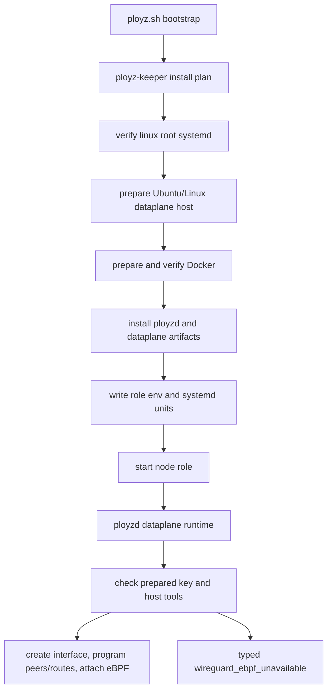

# refactor: Move dataplane host prep into keeper

## Summary

Move WireGuard/eBPF host substrate preparation out of deploy-time `ployzd` runtime code and into keeper-managed machine bootstrap. The immediate implementation supports fresh alpha installs on Ubuntu/Linux, uses a conventional WireGuard-owned path under `/etc/wireguard/ployz/`, deletes the current deploy-time AppArmor mutation, and intentionally provides no compatibility path for `/etc/ployz/wireguard.key`.

This is an alpha reset plan: one live server can be reinstalled or reset. There are no migration branches, no fallback key lookup, and no old-path shims.

---

## Problem Frame

`crates/ployzd/src/dataplane_runtime.rs` currently does more than runtime dataplane projection. During deploy preparation it creates the WireGuard key directory, generates the private key, mutates an AppArmor local profile, creates the interface, applies the private key, configures peers, and attaches eBPF forwarding.

That unblocked the first alpha server, but it puts host-specific substrate work in the deploy runtime. A deploy operation should prepare WireGuard/eBPF state for the namespace deploy using already-prepared machine capabilities. It should not edit host security policy or install host prerequisites while trying to run a workload.

The repo already has the right owner for machine-local substrate changes: `ployz-keeper`. Keeper install plans are typed, ordered, idempotent, and already own Linux root/systemd checks, Docker preparation, artifact installation, role environment files, and supervisor units. Dataplane host prep should become another keeper step that runs before role processes start.

---

## Requirements

- R1. `ployzd` deploy/runtime code must not modify AppArmor, SELinux, package manager state, WireGuard key directories, or host prerequisite installation state.
- R2. The current Ubuntu/Linux adapter WireGuard private-key path is `/etc/wireguard/ployz/private.key`, but the path is adapter-private implementation detail, not a product contract.
- R3. No code path may read, migrate, copy, or fall back to `/etc/ployz/wireguard.key`.
- R4. `ployz-keeper` must own fresh-install dataplane host prep before node role startup.
- R5. The Ubuntu/Linux host prep must be idempotent: rerunning bootstrap should preserve an existing key only after validating file type, ownership, permissions, link count, and WireGuard key validity.
- R6. Host prep must install missing required Linux dataplane tools and then verify readiness for the supported Ubuntu path: WireGuard tools, `ip`/`tc` from iproute2, iptables support when needed, `sysctl`, `/dev/net/tun`, and a durable BPF filesystem mount.
- R7. Unsupported platforms, missing root, missing systemd, unsupported package managers, package timeout/failure, missing kernel capability, failed key preparation, invalid existing key material, or security-module denial must produce typed keeper step failures with useful messages.
- R8. Deploy-time WireGuard/eBPF preparation must still create/configure the interface, set the prepared private key on the interface, program peers/routes, validate eBPF bytecode, and attach eBPF forwarding.
- R9. If the prepared key or host capability is missing at deploy time, deploy must fail as `wireguard_ebpf_unavailable` with component and node evidence.
- R10. First-node and joined-machine install plans must prepare dataplane substrate before writing/starting role units that can expose node runtime services.
- R11. Tests must prove the AppArmor command is gone from runtime plans and the old key path is not referenced by production defaults.
- R12. Multi-distro support must have an explicit design seam, and every supported adapter must own installing or enforcing its required host substrate. This slice implements only the Ubuntu/Linux adapter.
- R13. The Ubuntu/Linux adapter must verify the selected key path from keeper's root execution context by deriving a public key with `wg pubkey`. Alpha does not require a separate systemd/role-context security probe before node role startup.
- R14. WireGuard private-key bytes are Local Dataplane Material and must never appear in keeper progress, command display text, failure messages, captured output, tests, operation evidence, release material, or JetStream state.
- R15. When a future exact-version substrate update requires new or changed Dataplane Host Preparation, keeper must install or enforce those prerequisites and verify readiness before activating the version.
- R16. NATS may record Dataplane Host Preparation progress, terminal result, and typed evidence, but those records are usability surfaces, not authority over Local Dataplane Material.
- R17. Dataplane-Capable Machine must remain derived from fresh machine-local facts and recent observations, not from a stored JetStream capability flag; this slice does not implement broader reindex adoption rules.
- R18. The alpha implementation must not add a standalone user-facing Dataplane Host Preparation operation, operation API endpoint, or `ployzctl` command. Preparation runs inside keeper bootstrap/join now, and inside a future exact-version substrate update when that operation exists.
- R19. The alpha Ubuntu/Linux adapter must not write ad hoc AppArmor local-profile overrides. It must choose a platform-native private material location and verify it from keeper's root execution context. If the actual `ployzd` runtime command context is later denied by the host security module, deploy must fail with typed `wireguard_ebpf_unavailable` evidence.
- R20. Product semantics must refer to prepared Local Dataplane Material, not a globally fixed WireGuard private-key path. Runtime code may consume the adapter-prepared path for this slice, but callers and durable cluster state must not depend on that exact path.
- R21. Keeper must pass the adapter-selected WireGuard private-key path to node roles through local role configuration, and `ployzd` must consume that configured path. Node runtime code must not independently choose the product's material path.
- R22. Runtime denial or missing prepared material must fail the owning deploy operation only. This slice must not add Dataplane-Capable Machine observation writes, placement gating, machine health mutation, or stored capability state.
- R23. Joined-machine bootstrap must run Dataplane Host Preparation before storing redeemed long-lived machine credentials or join material on disk. If preparation fails, keeper reports the join failure and must not persist those credentials locally.

---

## Key Technical Decisions

- KTD1. Keeper owns Dataplane Host Preparation. `ployzd` consumes prepared machine capabilities and reports typed runtime failures when they are absent.
- KTD2. The alpha release takes a clean break. Delete the old key path and update tests/docs; do not preserve a migration branch.
- KTD3. Use the conventional WireGuard configuration area for the current Ubuntu/Linux adapter. `/etc/wireguard` is the normal Linux WireGuard configuration path, but the selected material path stays behind the adapter boundary. Keeper verifies the material from its own root context; `ployzd` remains the first true probe of the role's runtime command context.
- KTD4. Keep the first implementation concrete. Add a typed Ubuntu/Linux prep shape now, with an exhaustive unsupported-host failure for everything else. Do not introduce a trait, platform matrix enum, or broad distro framework until a second real adapter is implemented.
- KTD5. Host security policy is a platform access contract, not an inline workaround. Each adapter chooses platform-native material locations and labels, verifies the access it can prove locally, and reports typed denial evidence when runtime access fails. Future policy, label, or same-context probe behavior must be modeled as named adapter behavior with tests, not shell snippets hidden in deploy or bootstrap flow.
- KTD6. Runtime provisioning remains responsible for live dataplane projection. Interface creation, `wg set`, peer programming, route programming, and eBPF attachment are still runtime operations because they project current cluster/deploy state onto the local machine.
- KTD7. Installer/bootstrap ordering is the current safety boundary, and substrate-update ordering is the future safety boundary. Dataplane Host Preparation must finish before a node service starts or before an updated node role version activates when that version adds host requirements.
- KTD8. NATS is the audience for preparation status, not the owner of prepared host material. This keeps the future recovery direction open without making alpha Dataplane Host Preparation responsible for a full reindex architecture.
- KTD9. Alpha does not expose Dataplane Host Preparation as its own product operation. The extra operation/API/CLI surface is only justified once operators need remote repair or manual rerun on already-running machines.
- KTD10. Supported host-prep adapters are installer/enforcer adapters, not preflight-only checkers. They install missing normal packages and own host-service/security-module setup for their platform, then verify readiness. Immutable or declarative operating systems need a platform-specific enforcement contract before support is claimed.
- KTD11. Security-module denials are abstraction feedback. The response is to improve the adapter's material placement/access model or declare the host unsupported, not to add another path-specific workaround.
- KTD12. Alpha keeps runtime denial local to the failed operation. Derived Dataplane-Capable Machine views can use fresh observations later, but this implementation does not emit or persist a new capability signal.
- KTD13. Joined-machine credential persistence happens after host preparation. A host that cannot satisfy alpha substrate requirements should not retain machine NATS credentials just because token redemption succeeded.

---

## High-Level Technical Design



The important split is:

- Keeper Dataplane Host Preparation creates durable host prerequisites and Local Dataplane Material; it does not create live WireGuard interfaces, routes, peers, or eBPF attachments.
- `ployzd` deploy prep applies current operation state to the local dataplane and emits deploy evidence.

---

## Multi-Distro Shape

The future shape should be explicit platform adapters selected from host facts, not a pile of shell conditionals inside deploy runtime.

### Current Slice Model

The implementation seam for this slice should stay as small as the current need:

```text
DataplaneHostPrepTarget
  SupportedUbuntuLinux
  UnsupportedHost { evidence }
```

The Ubuntu/Linux detection may read `/etc/os-release`, systemd availability, package-manager availability, and active security-module signals, but it should not expose a broad platform matrix in public types. A full `HostPlatform` model becomes justified when a second real adapter lands.

### Adapter Responsibilities

Each future host-prep adapter owns:

- package names and installation/enforcement method,
- service/init integration assumptions,
- kernel capability checks,
- `/dev/net/tun` readiness,
- BPF filesystem readiness,
- WireGuard private-key directory and file permissions,
- security-module access model and probe strategy,
- security-module-specific labels or named policy assets when a platform genuinely requires them,
- operator-facing failure messages.

### Future Adapter Examples

| Platform family | Prep behavior |
| --- | --- |
| Ubuntu/Debian | Install with apt, use systemd assumptions, choose an adapter-private path under the conventional WireGuard configuration area, verify keeper-context access, and let runtime report typed AppArmor denial if the actual role context is blocked. |
| Fedora/RHEL | Install with dnf/yum, apply required SELinux file contexts as named adapter behavior, choose an adapter-private WireGuard material path, and run explicit kernel/module checks. |
| Alpine | Install with apk and handle OpenRC-specific service setup; unsupported until role supervision is not systemd-only. |
| NixOS | Use a declarative enforcement path; unsupported until Ployz has an adapter that can apply or validate the required NixOS configuration. |
| macOS | Separate future worker/dataplane adapter, not a Linux distro adapter. Linux eBPF and kernel WireGuard assumptions do not apply. |

The project should not implement a generic "20 distro" framework in advance. Add the next adapter only when there is a real target distro and a real smoke host.

---

## Implementation Units

### U1. Implement keeper dataplane host prep

- **Goal:** Add a compile-tested keeper step and local effect for Ubuntu/Linux Dataplane Host Preparation.
- **Requirements:** R4, R5, R6, R7, R10, R12, R13, R14, R15, R18, R19, R20, R21, R23
- **Dependencies:** None
- **Files:** `crates/ployz-keeper/src/steps.rs`, `crates/ployz-keeper/src/local.rs`, `crates/ployz-keeper/src/command.rs`, `crates/ployz-keeper/src/fsx.rs`, `crates/ployz-keeper/src/report.rs`, `crates/ployz-keeper/tests/bootstrap_first_node.rs`, `crates/ployz-keeper/tests/bootstrap_join.rs`, `crates/ployz-keeper/tests/bootstrap_executor.rs`, `crates/ployz-keeper/tests/local.rs`.
- **Approach:** Add a `PrepareDataplaneHost` keeper step with a concrete `SupportedUbuntuLinux` target and an unsupported-host failure path. Add the matching `KeeperStepLabel`, `KeeperStepFailureReason::DataplaneHostPrepareFailed`, text rendering, `KeeperLocalEffects::apply_step` arm, `KeeperCommandRunner` surface, and recording-runner tests in the same unit so the crate remains compiling after the new enum variant lands. In `first_node_install_plan`, run `VerifyHost(HostPrerequisite::LinuxRootSystemd)`, then `PrepareDataplaneHost`, then Docker/artifact work. In joined-machine local install planning, run typed `VerifyHost`, then `PrepareDataplaneHost`, then `StoreJoinMaterial`, then Docker/artifacts/role units so unsupported hosts fail before machine credentials are persisted. Carry the adapter-selected private-key path into `PloyzdRoleEnvironmentTarget` and render it for node roles as `PLOYZ_WIREGUARD_PRIVATE_KEY`. This slice wires the step into bootstrap; future substrate update must call the same preparation boundary before activating a version whose substrate requirements changed.
- **Host prep behavior:** Detect supported Ubuntu/Linux through local host facts, install missing apt packages with a bounded install timeout longer than short readiness probes, then verify `wg`, `ip`, `tc`, iptables support when needed, `sysctl`, `/dev/net/tun`, and a durable bpffs mount. For `/sys/fs/bpf`, either verify an existing persistent systemd-managed mount or install/enable a persistent systemd mount unit; do not rely on a one-shot bootstrap mount as durable substrate. Create or verify the Ployz eBPF pin subtree as a root-owned non-symlink path with restrictive permissions, and reject unexpected foreign or stale Ployz pins before runtime attach.
- **WireGuard key behavior:** For the current Ubuntu adapter, ensure `/etc/wireguard/ployz` is a root-owned non-symlink directory with private mode. Create `/etc/wireguard/ployz/private.key` only through a staged secret file with `0600` permissions and atomic install. Preserve an existing key only after `lstat` proves it is a root-owned regular non-symlink `0600` file with one link and its contents derive a valid public key through `wg pubkey`. Treat absent or empty files as generation cases; treat unreadable, symlinked, multiply-linked, wrong-owner, or invalid files as `DataplaneHostPrepareFailed`. Keep this path adapter-private; product state and API surfaces talk about prepared Local Dataplane Material.
- **Security-module behavior:** Verify that keeper's root execution context can use the packaged `wg` command to derive the public key from the adapter-selected private-key path before role startup. The alpha Ubuntu adapter must not write `/etc/apparmor.d/local` overrides, other ad hoc AppArmor snippets, or a separate systemd/role-context probe. If AppArmor denies the actual `ployzd` runtime command later, deploy fails with `wireguard_ebpf_unavailable` evidence naming the denied material path and command.
- **Secret handling:** Key bytes must not appear in command display strings, captured stdout/stderr, `FailureMessage`, keeper recorder output, or test assertion output. Prefer command shapes that redirect secret output directly into staged files. Add sentinel-key regression tests proving keeper events and failures do not leak key material.
- **Patterns to follow:** Mirror the existing `PrepareContainerRuntime(ContainerRuntime::Docker)` shape for step modeling and failure mapping, but use host-prep-specific runner methods rather than embedding long script strings in step planning. Keep file creation durable and private using existing `fsx` helpers where they fit.
- **Test scenarios:** First-node plans include dataplane host prep before Docker and role unit writes; joined-machine plans verify Linux/root/systemd and prepare dataplane host before `StoreJoinMaterial`; executor events render the new step name; unsupported platforms fail before credentials are stored; a host-prep failure after token redemption reports join failure without storing `nats.creds`; missing packages are installed; package timeout/failure maps to `DataplaneHostPrepareFailed`; prep creates a missing or empty key without leaking bytes; prep preserves a valid existing key; prep rejects invalid, symlinked, wrong-owner, multiply-linked, or unreadable key material; prep verifies `wg`, `ip`, `tc`, iptables support, `sysctl`, `/dev/net/tun`, durable bpffs readiness, Ployz pin-subtree ownership, and keeper-context key access; node role environment renders `PLOYZ_WIREGUARD_PRIVATE_KEY` with the adapter-selected path; tests prove host prep does not write local-profile overrides or run a systemd/role-context probe.
- **Verification:** Keeper tests compile and pass as one unit, with plan ordering tests plus recording-runner tests for idempotence, failure mapping, private file mode, key validation, and secret redaction.

### U2. Strip host substrate mutation from `ployzd` runtime

- **Goal:** Make deploy-time dataplane runtime consume the prepared key and host tools without creating host substrate or touching AppArmor.
- **Requirements:** R1, R2, R3, R8, R9, R11, R20, R21, R22
- **Dependencies:** U1
- **Files:** `crates/ployzd/src/dataplane_runtime.rs`, `crates/ployzd/src/config.rs`, `crates/ployzd/tests/wireguard_dataplane.rs`, `crates/ployzd/src/node/process.rs`.
- **Approach:** Load `PLOYZ_WIREGUARD_PRIVATE_KEY` into node dataplane config and pass it into `HostDataplaneConfig`; keep `/etc/wireguard/ployz/private.key` as the current Ubuntu adapter value rendered by keeper, not as a product API or durable cluster truth. Remove `DEFAULT_WIREGUARD_KEY_DIR` if it becomes unused. Delete the AppArmor local-profile command. Delete runtime private-key directory creation and key generation. Add a readiness path check for the configured prepared private key before the `wg set ... private-key` step. Update standalone public-key reads to derive the public key from the configured prepared private key without creating the interface, generating keys, or editing policy. Keep interface creation, listen-port configuration, peer programming, route programming, bytecode validation, and eBPF attachment in full dataplane preparation.
- **Patterns to follow:** Preserve the existing `HostCommandPlan` distinction between `ReadinessCheck` and `ProvisioningStep`. Missing prepared key should be a `WireGuardEbpfComponent::WireGuard` unavailable failure using the current `WireGuardEbpfPrepareError::Unavailable` type.
- **Test scenarios:** Current Ubuntu runtime command plans contain a readiness check for the configured `/etc/wireguard/ployz/private.key`; `PLOYZ_WIREGUARD_PRIVATE_KEY` overrides that path in node config tests; no runtime plan contains `/etc/ployz/wireguard.key`; no runtime plan contains `apparmor_parser`, `/etc/apparmor.d/local`, key generation, or AppArmor profile edits; `wg set private-key` uses the configured prepared path; standalone public-key reads do not create the interface, generate keys, or edit AppArmor; missing key or runtime command denial returns `wireguard_ebpf_unavailable` evidence and does not write machine capability observations or state.
- **Verification:** `ployzd` unit tests cover the default plan shape, and the gated privileged dataplane proof still validates real interface/eBPF behavior in a fresh proof environment.

### U3. Update bootstrap/install documentation and release smoke expectations

- **Goal:** Make operator docs match the new Dataplane Host Preparation boundary.
- **Requirements:** R3, R6, R7, R10
- **Dependencies:** U1, U2
- **Files:** `docs/architecture/machine-updates.md`, `docs/operations/release.md`, `docs/operations/dind-e2e.md`, `README.md`.
- **Approach:** Document that fresh machine bootstrap performs Dataplane Host Preparation before starting node roles, and that future substrate updates must enforce new host requirements before activating versions that need them. Document that alpha has no standalone `ployzctl` prep command or operation API endpoint and no ad hoc AppArmor local-profile override. Update release smoke guidance so a release that changes host prep is validated by a fresh machine install, not by relying on an already-mutated alpha host. Remove any release-doc reference that still points at the deleted runtime AppArmor/key-generation behavior.
- **Patterns to follow:** Keep long operational detail in `docs/operations/`; keep README pointers short.
- **Test scenarios:** Documentation examples describe fresh install behavior, exact release/channel behavior remains unchanged, and the no-compat alpha reset is explicit for this change.
- **Verification:** Docs no longer mention the old WireGuard key path as an active default or recommend runtime-level security-profile mutation.

### U4. Fresh alpha validation and cleanup

- **Goal:** Prove the clean-break install path works on a fresh Ubuntu host and leaves no old-path behavior in production defaults.
- **Requirements:** R1, R3, R9, R10, R11
- **Dependencies:** U1, U2, U3
- **Files:** `scripts/local-dataplane-proof.sh`, `crates/ployz-keeper/tests/local.rs`, `crates/ployz-keeper/tests/dataplane_host_prep.rs`, `crates/ployzd/src/dataplane_runtime.rs`, `crates/ployzd/tests/wireguard_dataplane.rs`.
- **Approach:** Run focused unit tests for keeper bootstrap/local effects and `ployzd` dataplane runtime, then run the gated local WireGuard/eBPF proof in a supported Ubuntu proof container. Before the `ployzd` proof runs, execute a privileged keeper dataplane-host-prep integration test that uses the same keeper effect path as production host prep and creates the prepared key material. Update privileged proof cleanup so it removes the current Ubuntu proof key at `/etc/wireguard/ployz/private.key`, the proof key directory when empty, and any proof-only bpffs state. Then validate a fresh Ubuntu alpha server bootstrap, reboot or otherwise prove the bpffs mount remains durable, and run an nginx routed deploy. The existing live server can be reset rather than migrated.
- **Patterns to follow:** Keep privileged proof scripts gated. Do not make normal tests require root, Docker-in-Docker, or host package-manager mutation.
- **Test scenarios:** Fresh install prepares key and tools before node role starts; keeper host prep succeeds in the Ubuntu proof container before `ployzd` dataplane tests; routed nginx deploy completes without AppArmor mutation; reboot or equivalent service restart preserves bpffs readiness; missing prepared key on a deliberately broken machine fails with `wireguard_ebpf_unavailable`; repository search finds no production references to `/etc/ployz/wireguard.key`.
- **Verification:** A release candidate passes unit tests, the privileged dataplane proof, and one fresh Ubuntu alpha smoke before channel promotion.

---

## External Grounding

- WireGuard documents Linux setup around `wg`, `ip`, and `wg-quick`; `wg-quick` looks in `/etc/wireguard/INTERFACE.conf` before distro-specific paths. Source: https://www.wireguard.com/quickstart/ and https://man7.org/linux/man-pages/man8/wg-quick.8.html
- WireGuard's install page shows package names vary by distribution: Ubuntu uses `wireguard`, while Fedora/Arch/OpenSUSE/Alpine use `wireguard-tools` variants. Source: https://www.wireguard.com/install/
- Ubuntu AppArmor profiles are path-based and live under `/etc/apparmor.d`; local overrides exist, but profile mutation is a host policy concern and profiles must be reloaded after edits. Source: https://ubuntu.com/server/docs/how-to/security/apparmor/
- SELinux uses labels/contexts for process and file access decisions, which is a different model from AppArmor path entries. Future RHEL/Fedora support should handle labels in its adapter rather than sharing Ubuntu/AppArmor assumptions. Source: https://docs.redhat.com/en/documentation/red_hat_enterprise_linux/8/html/using_selinux/getting-started-with-selinux_using-selinux

---

## Out Of Scope

- Migrating `/etc/ployz/wireguard.key`.
- Looking up both old and new private-key paths.
- Preserving old alpha installer behavior.
- Supporting Debian, Fedora, RHEL, Alpine, NixOS, or macOS in this implementation slice.
- Creating a generic distro plugin framework before a second real adapter exists.
- Moving live WireGuard peer/route/eBPF projection out of `ployzd`.
- Adding a standalone Dataplane Host Preparation product operation, operation API endpoint, or `ployzctl` command for alpha.
- Writing ad hoc AppArmor local-profile overrides as part of alpha host prep.
- Adding Dataplane-Capable Machine observation writes, placement gating, health mutation, or stored capability state for alpha.
- Implementing full substrate update operations, beyond documenting that they must enforce Dataplane Host Preparation before version activation.
- Implementing reindex or machine-local adoption rules.

---

## Risks And Mitigations

- **Risk:** Package installation behavior in keeper grows large and shell-heavy.
  **Mitigation:** Keep package-manager behavior behind narrow `KeeperCommandRunner` methods and test with a recording runner; avoid embedding long script strings in step planning.
- **Risk:** Moving key generation out of runtime breaks the current live alpha machine.
  **Mitigation:** Treat the server as resettable alpha infrastructure and reinstall or rerun fresh host prep. Do not add compatibility code.
- **Risk:** `/sys/fs/bpf` readiness differs across container proof, VPS hosts, and distros.
  **Mitigation:** Make Ubuntu/Linux prep verify the expected state and fail loudly with keeper evidence; defer non-Ubuntu behavior until a target host exists.
- **Risk:** The first adapter turns into an accidental multi-distro framework.
  **Mitigation:** Implement one concrete Ubuntu/Linux path and one typed unsupported-host failure. Add a second adapter only when there is a second smoke target.

---

## Acceptance Examples

- AE1. On a fresh supported Ubuntu host, first-node bootstrap runs keeper host prep, creates `/etc/wireguard/ployz/private.key` with private permissions, starts node roles, and a routed nginx deploy completes without AppArmor profile edits.
- AE2. On a machine missing the prepared private key, deploy preparation fails with `wireguard_ebpf_unavailable`, `component=wireguard`, and a message naming the missing prepared key path.
- AE3. On runtime command denial, deploy preparation fails with `wireguard_ebpf_unavailable` and no machine capability observation, placement gate, or machine health state is written.
- AE4. On a joined-machine bootstrap where Dataplane Host Preparation fails after token redemption, keeper reports the join failure and no `nats.creds` or trusted CA material is stored under the join-material directory.
- AE5. Repository current Ubuntu defaults contain `/etc/wireguard/ployz/private.key` as adapter-private material path and contain no `/etc/ployz/wireguard.key` reference outside historical docs or changelog context.
- AE6. On an unsupported distro, keeper install fails before role startup with `dataplane-host-prepare-failed` and a message naming the unsupported platform or package manager.

---

## Implementation Order

1. Implement the keeper step, local effect, command-runner surface, joined-machine precondition ordering, and recording-runner tests as one compile-tested unit.
2. Change `ployzd` default key path and remove runtime AppArmor/key-generation commands.
3. Update docs and release smoke expectations.
4. Run unit, privileged dataplane, reboot/durable-bpffs, and fresh alpha smoke validation.
