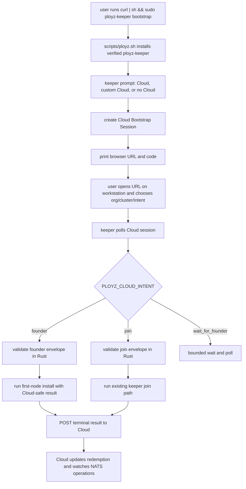
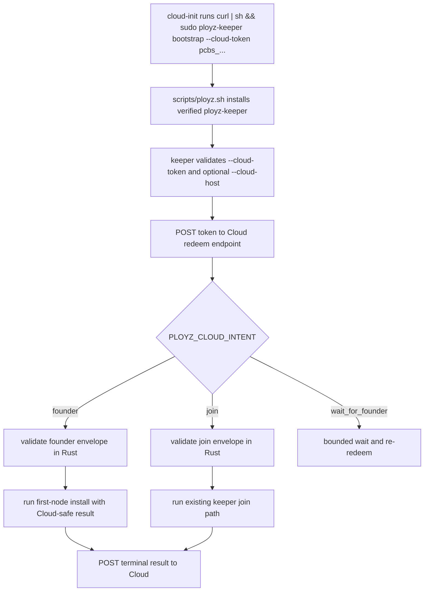
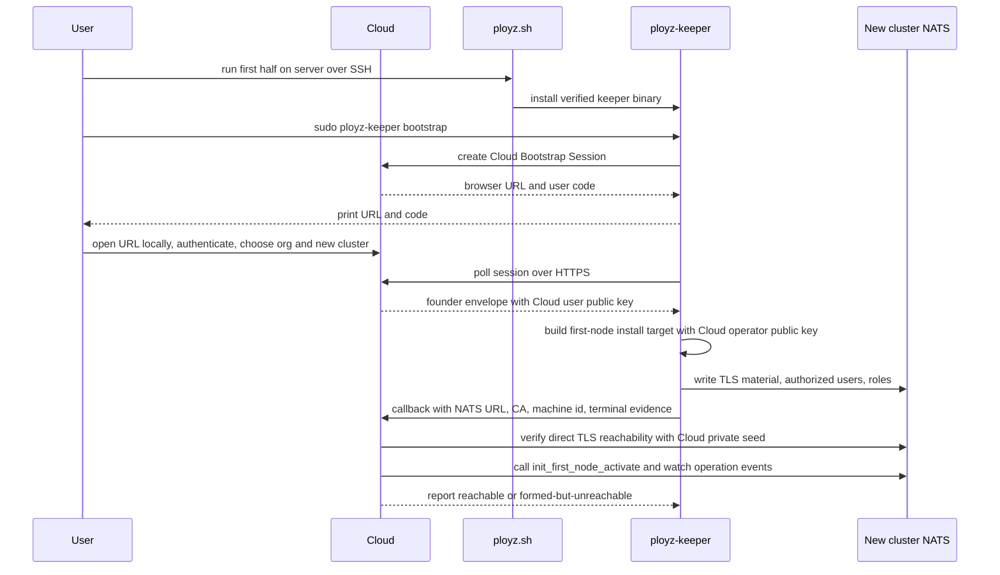
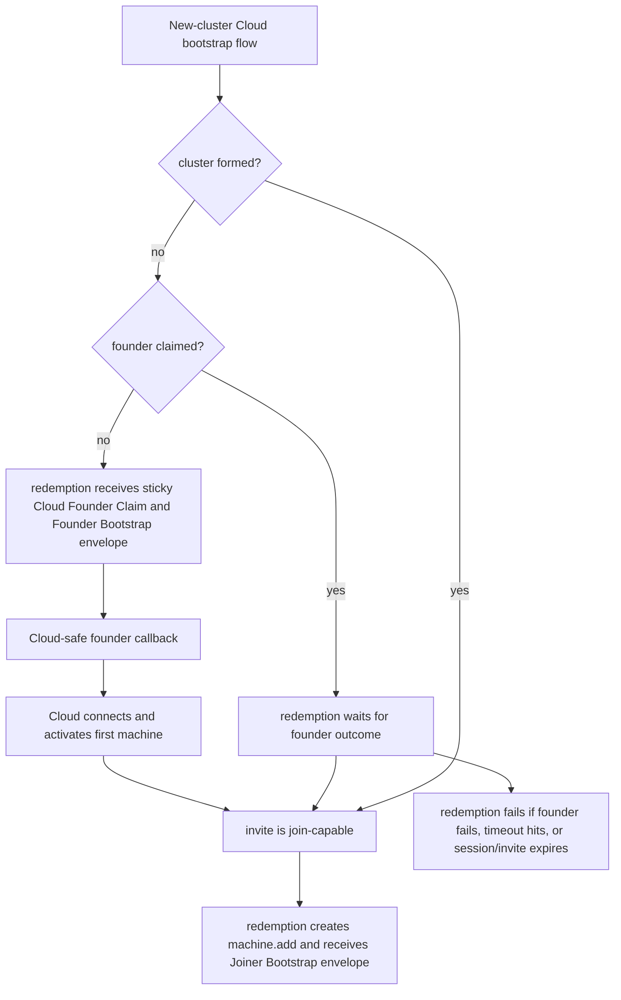
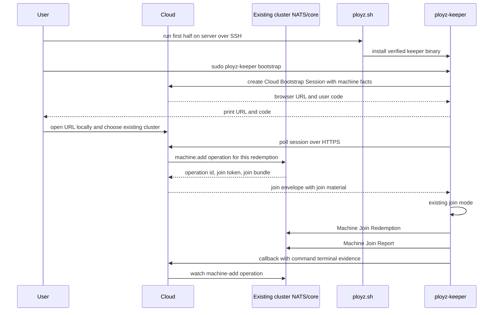

# feat: Add interactive Cloud bootstrap adoption flow

## Summary

Add a Ployz Cloud bootstrap mode where a user SSHes to a server, runs one simple command, and completes Cloud selection through a browser/device-code flow:

```bash
curl -fsSL https://ployz.sh | sh && sudo ployz-keeper bootstrap
```

`ployz.sh` installs only `ployz-keeper`. `ployz-keeper bootstrap` owns the interactive prompt, Cloud session, typed bootstrap envelope, founder/joiner handoff, callbacks, local-only already-bootstrapped refusal, and no-Cloud path.

The noninteractive token form remains available for cloud-init and pre-rendered automation:

```bash
curl -fsSL https://ployz.sh | sh && sudo ployz-keeper bootstrap --cloud-token pcbs_abc123
```

`ployzctl machine init USER@HOST` remains the workstation-driven noninteractive path for creating a local/direct cluster over SSH. Later, `ployzctl machine init USER@HOST --link-cloud` and `ployzctl cloud link` should connect clusters to Cloud once the NATS authority model supports multiple operator credentials.

---

## Recorded Decisions

- Human target-machine bootstrap uses `curl -fsSL https://ployz.sh | sh && sudo ployz-keeper bootstrap` with no required arguments.
- `ployz-keeper bootstrap` is interactive by default and offers: connect to Ployz Cloud, connect to custom/self-hosted Cloud, or continue without Cloud.
- Cloud interactive bootstrap uses a device-code/browser-link flow, not a localhost browser callback, because the browser usually runs on the user's workstation while keeper runs on the SSH target.
- `--cloud-token` and optional `--cloud-host` remain supported for noninteractive automation, cloud-init, and pre-rendered fleet bootstrap.
- A Cloud Bootstrap Token may be valid for one or more servers during its TTL; the default TTL is 1 hour and redemption count is not bounded while valid.
- One Cloud flow covers Founder Bootstrap and Joiner Bootstrap. New-cluster redemptions serialize a sticky Cloud Founder Claim; after the founder is usable, later redemptions become joiners.
- Cloud does not need to know machine IPs before bootstrap. It learns machine facts and candidate endpoint data during session/redemption and callback.
- Founder public reachability is proven by Cloud's outside-in direct TLS NATS probe. Local public-IP checks are advisory diagnostics only.
- Duplicate reported hostnames are allowed as machine facts. Cloud derives unique current Machine Names for core operations.
- `ployz.sh` is keeper-only release delivery. It does not install `ployzctl`, parse Cloud protocol data, receive Cloud tokens, branch founder/joiner, or inspect local bootstrap markers.
- `ployz.sh` always installs or replaces `/usr/local/bin/ployz-keeper` with the resolved verified keeper artifact and may use `sudo install` only for that placement.
- `ployz-keeper bootstrap` refuses on a Bootstrapped Machine before any Cloud redemption or callback. This refusal is local-only and Cloud does not receive a failed-attempt record.
- `ployzctl machine init USER@HOST` stays deterministic and noninteractive: it generates a local operator credential, SSHes to the target, runs keeper first-node install, activates the first machine, and writes local Operator Context.
- `ployzctl machine init USER@HOST --link-cloud` is deferred until multi-operator direct NATS credentials exist; it should authorize both the local `ployzctl` public key and Cloud's public key during founder bootstrap.
- `ployzctl cloud link` is a later explicit workflow for connecting an existing local cluster to Cloud.
- Direct TLS NATS remains the v1 control-plane transport. Cloud bootstrap does not introduce Cloud SSH, tunnels, or private overlay transport.

## Problem Frame

The current machine bootstrap surfaces are technically correct but too exposed for Cloud adoption. Founder Bootstrap and Joiner Bootstrap can already be rendered as shell commands, and `scripts/ployz.sh` can install `ployzctl`, install keeper, and hand off to `--first-node` or `--join-token`. Cloud adoption needs a smaller command surface: the user SSHes to a server themselves, pastes one command, and the server asks Cloud what to do.

The public shell script should be the smallest possible Bootstrap Delivery shim. It should install only the verified `ployz-keeper` binary into an idiomatic command path, then stop. The Cloud token, Cloud redemption, callback protocol, bootstrap material writing, founder/joiner branching, and terminal reporting belong in `ployz-keeper bootstrap`, where they can be typed and tested in Rust.

For the human path, keeper should create a short-lived Cloud Bootstrap Session and print a browser URL/code. The user authenticates in the browser, chooses org/cluster/intent, and keeper polls Cloud for the typed founder or joiner envelope. For automation, keeper can redeem a pre-rendered Cloud Bootstrap Token without prompts.

Cloud does not know the machine IP before bootstrap. It should learn candidate endpoint and machine facts from each Cloud Bootstrap Session or Cloud Bootstrap Redemption, decide the bootstrap intent from Cloud-side state, and return a typed envelope that `ployz-keeper bootstrap` maps into the existing machine-local bootstrap paths. Reported hostnames are facts, not Machine Names. Core cluster truth remains owned by NATS operations and operation events.

---

## Adoption Story

### New Cluster

1. A user SSHes to a server and runs:

   ```bash
   curl -fsSL https://ployz.sh | sh && sudo ployz-keeper bootstrap
   ```

2. `ployz.sh` installs or updates `ployz-keeper`.
3. `ployz-keeper bootstrap` prompts for Cloud, custom/self-hosted Cloud, or no Cloud.
4. For Ployz Cloud, keeper creates a short-lived Cloud Bootstrap Session and prints a URL/code.
5. The user opens the URL locally, authenticates, and chooses org plus new-cluster intent.
6. Keeper polls Cloud, receives a Founder Bootstrap envelope, forms the first machine, and posts a Cloud-safe result.
7. Cloud uses its private NATS user seed plus the returned NATS URL and CA to call `init_first_node_activate`, then watches operation events.

### Additional Machine

1. A user SSHes to another server and runs the same no-arg command.
2. `ployz-keeper bootstrap` creates a Cloud Bootstrap Session and prints a URL/code.
3. The user opens the URL locally and chooses an existing Cloud-connected cluster.
4. Cloud accepts a fresh `machine.add` operation for that session using a unique Machine Name and returns a Joiner Bootstrap envelope.
5. Keeper joins through the existing Machine Join Redemption and Machine Join Report path.
6. Cloud receives terminal command evidence and watches the machine-add operation for cluster truth.

### Noninteractive Or Cloud-Init

```bash
curl -fsSL https://ployz.sh | sh && sudo ployz-keeper bootstrap --cloud-token pcbs_abc123 --cloud-host cloud.example.com
```

`--cloud-token` is for cloud-init, automation, and pre-rendered fleet bootstrap. `--cloud-host` changes only the Cloud HTTPS endpoint used for invite redemption and result callbacks. It does not identify the target machine, org, or cluster.

### Workstation CLI

```bash
ployzctl machine init root@server
```

`ployzctl machine init` is the noninteractive local/direct path. It generates the operator credential locally, delivers typed first-node install material over SSH, activates the first machine, and writes local Operator Context. `ployzctl machine init root@server --link-cloud` and `ployzctl cloud link` are deferred until Cloud and the local operator can both be authorized as distinct direct NATS operator clients.

---

## Requirements

**Copy command UX**

- R1. The primary human command is exactly one copy/paste shell command that installs keeper first, then runs interactive keeper bootstrap without arguments: `curl -fsSL https://ployz.sh | sh && sudo ployz-keeper bootstrap`.
- R1a. The noninteractive automation command installs keeper first, then passes the token explicitly to the local keeper binary: `curl -fsSL https://ployz.sh | sh && sudo ployz-keeper bootstrap --cloud-token <token>`.
- R2. `ployz-keeper bootstrap` offers interactive choices for Ployz Cloud, custom/self-hosted Cloud, and no Cloud. `--cloud-host <host-or-https-url>` remains an optional noninteractive flag and defaults to the production Ployz Cloud host.
- R3. The human command contains no token, org ID, cluster ID, machine IP, join token, NATS URL, CA material, or NATS seed. The noninteractive command contains only the Cloud Bootstrap Token and optional Cloud host; the token is not passed to `ployz.sh`.
- R4. One Cloud bootstrap mode covers Founder Bootstrap and Joiner Bootstrap whether the run starts from an interactive Cloud Bootstrap Session or a noninteractive Cloud Bootstrap Token; a new-cluster flow serializes founder selection so one redemption receives a sticky Cloud Founder Claim and later redemptions wait until Cloud can return Joiner Bootstrap or a terminal founder failure.
- R5. `ployz.sh` is keeper-only Bootstrap Delivery: it does not install `ployzctl`, does not accept Cloud tokens, and does not expose founder or joiner bootstrap modes. It may use `sudo install` only to place the verified keeper binary at `/usr/local/bin/ployz-keeper` so the follow-on `sudo ployz-keeper bootstrap ...` command resolves reliably.
- R6. Existing low-level first-node and joiner machine bootstrap behavior remains available behind keeper commands or internal test seams, not as public `ployz.sh` modes.
- R6a. `ployz.sh` always installs or replaces `/usr/local/bin/ployz-keeper` with the resolved verified keeper artifact, even when a keeper already exists; it should report previous and new versions when available and must not prompt for replacement policy.

**Cloud contract and security**

- R7. Cloud Bootstrap Sessions are short-lived device-code-style sessions for interactive bootstrap. Cloud Bootstrap Tokens are opaque, high-entropy bearer secrets for time-limited noninteractive Cloud Bootstrap Invites; the default invite expires after 1 hour and is not bounded by redemption count while it remains valid.
- R8. Session secrets and Cloud Bootstrap Tokens are sent to Cloud over HTTPS in a header or request body, never in the request URL.
- R9. Each Cloud Bootstrap Redemption may send non-authoritative machine facts such as hostname, OS, and architecture, and returns a strict bootstrap envelope with an intent enum, redemption id, callback endpoint, callback credential, release selection, and intent-specific machine bootstrap material.
- R10. `ployz-keeper bootstrap` validates every required Cloud envelope field before mutating the machine.
- R11. Callback posts terminal command evidence to Cloud for success and failure through a separate idempotent callback token, with a bounded timeout and no unbounded retry loop.
- R12. Founder callbacks never upload the existing local operator seed or Join seed as normal Cloud credentials.
- R13. Cloud redemption and callback bodies use typed JSON generated and consumed by `ployz-keeper`; the shell script does not parse Cloud protocol data or make security decisions.
- R14. Error output redacts Cloud tokens, callback credentials, NATS seeds, and join tokens.
- R15. Neither the human command nor the noninteractive command pins a keeper version; `ployz.sh` installs the default compatible keeper, and `ployz-keeper bootstrap` sends its keeper version and Cloud bootstrap protocol version in the session/redeem request so Cloud can reject unsupported clients before mutation.

**Cluster and machine boundaries**

- R16. Founder Bootstrap authorizes a Cloud-owned NATS user public key as the cluster's initial `User` principal for Cloud-mediated clusters.
- R17. Existing local founder bootstrap keeps the current minted local operator seed path for CLI-created clusters.
- R18. Cloud calls `init_first_node_activate` after Founder Bootstrap callback material proves the first machine formed, and later redemptions against the same new-cluster flow become Joiner Bootstrap redemptions once Cloud can submit `machine.add`.
- R19. Additional machines still flow through `machine.add`, Machine Join Redemption, and Machine Join Report; Cloud brokers delivery and watches operation events. Duplicate reported hostnames are allowed, but each submitted current Machine Name remains unique.
- R20. Cloud learns a candidate runtime NATS endpoint from the redemption/callback request, returns it in the founder envelope, and verifies direct TLS NATS reachability from Cloud before the founder redemption is considered usable.
- R21. `ployz-keeper bootstrap` verifies local bootstrap completion and waits for Cloud's outside-in reachability verdict; it may show candidate endpoint diagnostics, but it does not treat a local socket check or public-IP preflight as public reachability proof.
- R22. Direct TLS NATS remains the cluster control-plane transport; Cloud bootstrap does not introduce SSH-from-Cloud, tunnels, or background cluster mutation.
- R22a. `ployz-keeper bootstrap` treats a Bootstrapped Machine as not eligible for Cloud bootstrap. It checks for durable local Ployz machine material before Cloud redemption and exits with explicit recovery guidance instead of forming or joining again. This refusal is local-only: keeper does not create a Cloud redemption, callback, or failed attempt record.
- R22b. `ployzctl machine init USER@HOST` remains the workstation-driven local/direct bootstrap path. It generates the local operator credential, delivers typed first-node material over SSH, activates the first machine over direct TLS NATS, and writes local Operator Context.
- R22c. `ployzctl machine init USER@HOST --link-cloud` and `ployzctl cloud link` are deferred until the cluster can authorize Cloud and the local operator as distinct direct NATS operator clients.

**Documentation and verification**

- R23. Shared Cloud bootstrap terms and the HTTPS contract are documented with both founder and joiner examples.
- R24. Tests cover `ployz.sh` keeper-only installation, `ployz-keeper bootstrap` flag parsing, host normalization, token redaction, envelope validation, founder handoff, join handoff, unsupported keeper rejection, and callback failures.
- R25. Keeper/core tests cover Cloud public-key founder authorization and Cloud-safe result emission.
- R26. SDK type export tests cover any public JSON result types introduced for Cloud callback payloads.

---

## Key Technical Decisions

- KTD1. Human bootstrap is interactive and tokenless: The public human machine command is `curl -fsSL https://ployz.sh | sh && sudo ployz-keeper bootstrap`. Cloud org, cluster, and founder-or-joiner intent are chosen through a browser/device-code Cloud Bootstrap Session instead of encoded in the shell command.
- KTD2. Token mode is for automation: `--cloud-token` remains available after `ployz-keeper bootstrap` for cloud-init and pre-rendered automation. It keeps bearer material out of URLs, CDN logs, referrers, and `ployz.sh`, and forwards the token to Cloud only over HTTPS from keeper.
- KTD3. Keep the shell shim tiny: `scripts/ployz.sh` installs only the verified `ployz-keeper` binary into `/usr/local/bin/ployz-keeper` and exits. It may prompt through `sudo install` for that single file placement, but it does not install `ployzctl`, parse Cloud tokens, redeem invites, write join material, or branch between founder and joiner bootstrap.
- KTD3a. Keeper install is deterministic replacement: `ployz.sh` does not skip or ask when `/usr/local/bin/ployz-keeper` already exists. It replaces the binary with the resolved verified artifact so the copied command gets the expected keeper/client behavior before Cloud compatibility negotiation.
- KTD4. Resolve to typed Rust data: Because `ployz-keeper bootstrap` owns Cloud session creation, token redemption, and polling, Cloud can return typed JSON rather than a shell-env manifest. Keeper validates the envelope and maps founder inputs into the current first-machine install path or join inputs into the current join path.
- KTD4a. Do not overclaim `curl | sh` safety: The new shape reduces exposure by keeping the Cloud token out of the streamed script and limiting intended sudo use to installing one verified keeper binary. It still requires trust in the HTTPS `ployz.sh` response and release infrastructure; docs should describe that boundary plainly.
- KTD5. Cloud founder credential is public-key authorization: Cloud supplies a NATS user public key in the founder envelope and keeps the private seed in Cloud. Keeper authorizes that public key as the initial `User` principal instead of sending the local operator seed back to Cloud.
- KTD6. Keep the current single `User` principal for this pass: Current authority storage keys `NatsPrincipal::User` as `user`, so multi-operator direct NATS credentials are a separate auth-model follow-up. Cloud-mediated founder bootstrap uses the initial `User` slot; local CLI founder bootstrap keeps the minted local operator seed slot.
- KTD7. Callback evidence is not cluster truth: Cloud callbacks prove what one redemption did. The callback token is separate from the invite token and remains idempotent until Cloud records one terminal result for that redemption. Current state still comes from KV, operation status, operation events, and machine observations after Cloud connects to NATS.
- KTD8. Endpoint discovery is optimistic but visible: Cloud can infer a candidate public endpoint from the redemption request source and return `tls://<candidate>:4222` to the founder install. If Cloud later cannot connect, it records a Cloud bootstrap failure with an operator hint instead of silently mutating cluster truth.
- KTD9. TTL bounds noninteractive invites, not redemption count: Automation can run the same token command on one or more machines during the invite's validity window. Cloud creates a separate redemption record, callback token, and join operation per machine run.
- KTD10. New-cluster flows transition from founder to joiner: A new-cluster Cloud flow starts founder-capable. After the first machine forms the control plane and Cloud can call the cluster, subsequent redemptions against the same flow resolve to Joiner Bootstrap and create normal machine-add operations.
- KTD11. Founder selection is serialized by Cloud and sticky after material is issued: The first new-cluster redemption to receive founder bootstrap material owns the Cloud Founder Claim. Other concurrent redemptions receive a waiting response and poll until they can join or fail with the founder outcome, session/invite expiry, or a bounded wait timeout. Cloud does not automatically promote another redemption after founder failure because the failed founder may have partially formed an independent cluster.
- KTD12. Cloud owns public NATS reachability verification: `ployz-keeper bootstrap` can prove keeper completed and NATS started locally, but only Cloud can prove the direct TLS NATS endpoint is reachable from the workflow that must use it. A same-machine public-IP preflight is advisory only because it cannot prove outside-in access to the eventual TLS NATS listener before NATS exists. Founder success waits for Cloud to connect and activate the first machine; otherwise the redemption is `formed-but-unreachable`.
- KTD13. Hostname is a fact, Machine Name is a label: Cloud accepts duplicate reported hostnames from redemptions, stores them as machine facts, and derives a unique current Machine Name only when submitting `machine.add` or activating the founder. The copied command never needs a per-server name flag; Cloud can use the hostname as a suggestion and add a short suffix on collision.
- KTD14. Keeper compatibility is negotiated at Cloud session or redemption: The copy commands stay short and do not pin a keeper version. `ployz.sh` installs the default compatible keeper, and keeper includes its binary version plus Cloud bootstrap protocol version when creating an interactive session or redeeming a token. Cloud returns an unsupported-client error before any machine mutation if the keeper is too old or speaks the wrong protocol.
- KTD15. Cloud token in argv is accepted only for noninteractive v1: The automation command passes the Cloud Bootstrap Token as `--cloud-token` to the local keeper binary. This can expose the token through shell history or process arguments, but the token is short-lived, scoped to one invite, never placed in URLs, never passed to `ployz.sh`, redacted from output, and visible/revocable from Cloud. The human default avoids this by using an interactive session.
- KTD16. Cloud bootstrap is first-use only per machine: Before creating a Cloud Bootstrap Session or redeeming a Cloud Bootstrap Token, keeper checks for existing local Ployz machine material such as NATS machine material, keeper join material, role environment files, or managed Ployz systemd units. If any marker is present, keeper exits with a Bootstrapped Machine error and does not call Cloud. Cloud does not learn that the command was attempted, which avoids leaking facts about an already-managed machine to an unrelated org or pasted token. Repair, re-adoption, or forced takeover are separate future commands, not hidden `bootstrap` reruns.
- KTD17. `ployz.sh` stays installer-only even on Bootstrapped Machines: The shell shim does not inspect `/var/lib/ployz`, `/etc/ployz`, or systemd markers before replacing keeper. Existing-machine bootstrap refusal belongs in `ployz-keeper bootstrap`, so the shim remains release delivery rather than machine bootstrap policy.
- KTD18. `ployzctl machine init` is the local/direct CLI path: The workstation CLI remains noninteractive. It generates and retains the local operator private seed, delivers typed first-node install material over SSH, activates the first machine, and writes local Operator Context.
- KTD19. Cloud linking existing/local clusters is explicit follow-up work: `ployzctl machine init --link-cloud` and `ployzctl cloud link` require multi-operator direct NATS credentials so Cloud and the local operator can each hold their own private seed.

---

## High-Level Technical Design

### Interactive Cloud Dispatch



### Noninteractive Token Dispatch



### Founder Bootstrap



### Founder-to-Join Transition



### Joiner Bootstrap



### Cloud Envelope Sketch

Cloud session polling and token redemption return typed JSON to `ployz-keeper bootstrap`. The exact wire DTO should be exported through `ployz-sdk-types`; this sketch uses env-style names only to show field parity with current bootstrap inputs:

```text
PLOYZ_CLOUD_INTENT=founder
PLOYZ_CLOUD_SESSION_ID=bss_123
# token automation uses PLOYZ_CLOUD_INVITE_ID=bsi_123 instead
PLOYZ_CLOUD_REDEMPTION_ID=bsr_123
PLOYZ_KEEPER_VERSION=0.0.2-alpha.1
PLOYZ_CLOUD_BOOTSTRAP_PROTOCOL=1
PLOYZ_CLOUD_CALLBACK_URL=https://cloud.ployz.com/api/bootstrap/redemptions/bsr_123/report
PLOYZ_CLOUD_CALLBACK_TOKEN=pcbr_abc123
PLOYZ_VERSION=0.0.2-alpha.1
PLOYZ_NODE_ID=core_1
PLOYZ_MACHINE_JOIN_NATS_URL=tls://203.0.113.10:4222
PLOYZ_NODE_PUBLIC_IP=203.0.113.10
PLOYZ_CLOUD_NATS_USER_PUBLIC_KEY=UAAAAAAAAAAAAAAAAAAAAAAAAAAAAAAAAAAAAAAAAAAAAAAAAAAAAAAA
```

Join envelopes use the same invite, redemption, and callback keys plus existing join fields:

```text
PLOYZ_CLOUD_INTENT=join
PLOYZ_CLOUD_SESSION_ID=bss_456
# token automation uses PLOYZ_CLOUD_INVITE_ID=bsi_123 instead
PLOYZ_CLOUD_REDEMPTION_ID=bsr_456
PLOYZ_KEEPER_VERSION=0.0.2-alpha.1
PLOYZ_CLOUD_BOOTSTRAP_PROTOCOL=1
PLOYZ_CLOUD_CALLBACK_URL=https://cloud.ployz.com/api/bootstrap/redemptions/bsr_456/report
PLOYZ_CLOUD_CALLBACK_TOKEN=pcbr_def456
PLOYZ_VERSION=0.0.2-alpha.1
PLOYZ_JOIN_TOKEN=join_once_123
PLOYZ_NATS_URL=tls://203.0.113.10:4222
PLOYZ_NATS_CA_B64=...
PLOYZ_JOIN_NKEY_SEED=SUAAAAAAAAAAAAAAAAAAAAAAAAAAAAAAAAAAAAAAAAAAAAAAAAAAAAAAAA
```

Concurrent new-cluster redemptions that did not claim the founder slot receive a waiting envelope:

```text
PLOYZ_CLOUD_INTENT=wait_for_founder
PLOYZ_CLOUD_SESSION_ID=bss_789
# token automation uses PLOYZ_CLOUD_INVITE_ID=bsi_123 instead
PLOYZ_CLOUD_REDEMPTION_ID=bsr_789
PLOYZ_CLOUD_RETRY_AFTER_SECONDS=5
```

---

## Implementation Units

### U1. Shared Cloud bootstrap contract

- **Goal:** Define the Cloud bootstrap session, token, and callback contract in repo docs and shared type surfaces before changing installer behavior.
- **Requirements:** R7, R8, R9, R11, R12, R13, R14, R15, R23, R26
- **Dependencies:** None
- **Files:** `docs/architecture/cloud-bootstrap.md`, `crates/ployz-sdk-types/src/lib.rs`, `crates/ployz-sdk-types/tests/exports.rs`, `packages/ployz-sdk/test/fixtures/operation-contract.json`, `packages/ployz-sdk/src/generated.ts`, `CONTEXT.md`.
- **Approach:** Document the interactive session lifecycle, noninteractive invite lifecycle, token redeem endpoint, typed session/redeem response, callback JSON result shapes, idempotent callback token lifecycle, and failure classes. Add SDK-exported types for request/result payloads that Cloud and tests need to share, such as `CloudBootstrapSessionRequest`, `CloudBootstrapRedeemRequest`, `CloudBootstrapRedeemResponse`, `CloudBootstrapResult`, `CloudBootstrapFailure`, and `CloudBootstrapIntent`. Keeper consumes these types directly; `scripts/ployz.sh` is not part of the Cloud protocol.
- **Patterns to follow:** `crates/ployz-sdk-types/src/lib.rs` owns public schema and type export without orchestration logic; `CONTEXT.md` owns product vocabulary; `crates/ployz-sdk-types/tests/exports.rs` pins JSON wire shapes.
- **Test scenarios:** Serialize a session request with keeper version and Cloud bootstrap protocol version; serialize a token redeem request with keeper version and Cloud bootstrap protocol version; serialize a founder success result with NATS URL and CA but no seeds; serialize a join command result with operation id when present and no join token; serialize a callback failure result without bearer material; serialize a redemption state that distinguishes founder, joiner, wait-for-founder, and unsupported-client outcomes; serialize redemption machine facts separately from the selected Machine Name; reject unknown JSON fields in public result types; generated TypeScript fixtures match Rust wire types.
- **Verification:** The docs name how a Cloud Bootstrap Session or Cloud Bootstrap Invite maps to org/cluster/intent and how each Cloud Bootstrap Redemption maps to one machine run; exported callback types do not expose `NatsUserSeed`, raw join tokens, or local operator seed fields; reported hostname is documented as machine fact rather than Machine Name authority.

### U2. Keeper-only `ployz.sh` and `ployz-keeper bootstrap`

- **Goal:** Make `ployz.sh` install only `ployz-keeper`, then add interactive `ployz-keeper bootstrap` plus noninteractive `--cloud-token` automation.
- **Requirements:** R1, R2, R3, R4, R5, R6, R8, R9, R10, R14, R15, R21, R22a, R24
- **Dependencies:** U1
- **Files:** `scripts/ployz.sh`, `crates/ployz-keeper/src/cli.rs`, `crates/ployz-keeper/src/main.rs`, `crates/ployz-keeper/tests/bootstrap_script.rs`, `crates/ployz-keeper/tests/bootstrap.rs`, `README.md`.
- **Approach:** Remove local `ployzctl`, `--first-node`, and `--join-token` behavior from `scripts/ployz.sh`. Keep channel/exact-version resolution only as needed to download a verified `ployz-keeper` artifact and install it to `/usr/local/bin/ployz-keeper`. Always replace an existing keeper with the resolved verified artifact and print previous/new versions when possible. If the script is not root, it may use `sudo install` for that single root-owned file placement; it must fail clearly if `sudo` is unavailable or denied. Add `ployz-keeper bootstrap` as the interactive command with choices for Ployz Cloud, custom/self-hosted Cloud, and no Cloud. Add `ployz-keeper bootstrap --cloud-token <token> [--cloud-host <host-or-https-url>]` for noninteractive automation. Normalize bare hosts to `https://<host>`, reject non-HTTPS product hosts, and keep a test seam for fake Cloud endpoints. Create interactive sessions or redeem tokens from keeper using a header or body, never a query string. Include cheap machine facts available before bootstrap, such as hostname, OS, and architecture; Cloud treats them as facts, not Machine Name authority. Validate the typed response before any machine mutation.
- **Patterns to follow:** Reuse release channel parsing, release manifest identity checks, SHA-256 artifact verification, temp-file cleanup, fake curl test harnesses, and current missing-key error style from `scripts/ployz.sh`; use keeper's existing `clap` parser and serde spec loading patterns for the new command.
- **Test scenarios:** The exact human copied command installs keeper and then parses `ployz-keeper bootstrap`; the noninteractive command installs keeper and then parses `ployz-keeper bootstrap --cloud-token`; the interactive prompt offers Ployz Cloud, custom/self-hosted Cloud, and no Cloud; Ployz Cloud mode prints a browser URL and code and polls without expecting a localhost browser callback; `ployz.sh` uses plain `install` when already root and `sudo install` when non-root; `ployz.sh` replaces an existing keeper with the resolved verified artifact and reports previous/new versions when version output is available, including when local Ployz machine material already exists; `ployz.sh` fails clearly when `sudo` is unavailable or denied; `ployz.sh --cloud-token` is rejected and does not contact Cloud; `--cloud-host cloud.example.com` calls `https://cloud.example.com/...`; `--cloud-host https://staging.example.com` is accepted; `--cloud-host http://example.com` is rejected outside the test seam; fake curl logs prove the Cloud token is not present in the URL; session creation and token redemption send keeper version, protocol version, and hostname/OS/architecture facts when available and still succeed when hostname is absent; unsupported-client responses exit before machine mutation with update instructions; an existing NATS material directory, keeper join-material directory, Ployz role environment file, or managed Ployz systemd unit makes Cloud bootstrap fail before any Cloud request; `wait_for_founder` sleeps for the returned retry interval and re-polls or re-redeems without running machine mutation; missing intent or unsupported intent fails before machine mutation; usage text shows keeper-only shell install, interactive keeper bootstrap, and keeper Cloud token automation.
- **Verification:** `ployz.sh` installs no `ployzctl` and performs no Cloud request; keeper Cloud mode reaches no machine mutation until the typed Cloud response validates.

### U3. Founder Cloud credential and safe result

- **Goal:** Let Cloud-mediated Founder Bootstrap authorize Cloud's public NATS user key and return only Cloud-safe connection material.
- **Requirements:** R12, R16, R17, R18, R20, R21, R22, R25
- **Dependencies:** U1, U2
- **Files:** `crates/ployz-core/src/install.rs`, `crates/ployz-core/tests/install_contract.rs`, `crates/ployz-keeper/src/cli.rs`, `crates/ployz-keeper/src/main.rs`, `crates/ployz-keeper/src/nats_identity.rs`, `crates/ployz-keeper/src/steps/nats_material.rs`, `crates/ployz-keeper/src/steps.rs`, `crates/ployz-keeper/tests/bootstrap_first_node.rs`, `crates/ployz-keeper/tests/local.rs`, `crates/ployz-keeper/tests/bootstrap_script.rs`, `crates/ployz-core/tests/nats_config.rs`.
- **Approach:** Add an explicit first-machine operator credential mode to `FirstNodeInstallSpec`, such as minted local operator seed versus authorized public user key. In Cloud mode, `ployz-keeper bootstrap` builds a first-node target containing Cloud's `NatsUserPublicKey` and asks the first-node installer path to emit a Cloud-safe result. Keeper writes `authorized-users.conf` with that public key as `NatsPrincipal::User`, skips local operator seed output for this path, and writes a result body containing machine id, runtime NATS URL, CA, and terminal evidence only. Keeper posts that result and waits for Cloud's outside-in TLS NATS reachability verdict before exiting successfully. The existing non-Cloud first-node path keeps minting and printing local operator material for `ployzctl machine init`.
- **Patterns to follow:** `NatsAuthorizedUsersTarget::initial_for_first_node` is the single first-node authority file writer; `NatsUserPublicKey` already validates public user keys; `print_first_node_bootstrap_result` is the current local result boundary and should not be reused for Cloud-safe callback bodies.
- **Test scenarios:** A founder spec with `mint_local` writes controller/operator/join seeds and prints the existing local result; a founder spec with `authorize_public_key` renders the Cloud public key under `NatsPrincipal::User`; Cloud mode does not write or print `operator_seed` or `join_seed` in the Cloud callback result; invalid public NKey values fail spec loading; keeper founder Cloud mode builds a first-node target containing the Cloud public key, candidate NATS URL, node public IP, roles, and exact release artifacts; a Cloud callback response that says NATS is unreachable makes keeper exit non-zero with a redacted endpoint hint.
- **Verification:** Cloud can connect with its private seed after callback, while no test or output path sends an SU-prefixed local operator seed to Cloud.

### U4. Joiner Cloud envelope and callback

- **Goal:** Map Cloud join envelopes into the existing Joiner Bootstrap path and report command terminal evidence back to Cloud.
- **Requirements:** R4, R6, R11, R14, R19, R22, R24
- **Dependencies:** U1, U2
- **Files:** `crates/ployz-keeper/src/cli.rs`, `crates/ployz-keeper/src/main.rs`, `crates/ployz-keeper/tests/bootstrap.rs`, `crates/ployz-keeper/tests/bootstrap_join.rs`.
- **Approach:** For Cloud join intent, require the typed response to provide join token, NATS URL, CA, Join NKey seed, and release selection. Cloud creates the backing `machine.add` before returning the join response, deriving a unique Machine Name from redemption facts such as hostname and adding a suffix when needed. Then run the existing keeper join branch. Wrap the branch so keeper posts a callback after success or failure, including the Cloud redemption id, optional operation id when known, exit class, and a short redacted failure message. Callback posts use the idempotent callback token from the response and retry only within a bounded window. Keep Machine Join Redemption and Machine Join Report as the authoritative cluster-side state transition.
- **Patterns to follow:** Existing join mode already writes `join-token` with `umask 077`, decodes `PLOYZ_NATS_CA_B64`, exports `PLOYZ_NATS_CA_FILE`, and lets keeper redeem/report through NATS.
- **Test scenarios:** A valid join envelope runs keeper with `--join-token-file`; duplicate reported hostnames on two redemptions produce distinct `machine.add` requests with unique Machine Names; missing NATS URL, CA, seed, or join token fails before keeper starts; callback failure after a successful join retries within the bounded window, emits a Cloud-report failure message, and exits non-zero; duplicate callback submission is accepted as the same terminal result; failure output redacts `PLOYZ_JOIN_NKEY_SEED`, `PLOYZ_JOIN_TOKEN`, and callback token; low-level join mode without Cloud still does not callback.
- **Verification:** The joined-machine operation can complete through the existing core APIs, and Cloud receives enough command evidence to distinguish "never reached machine", "installer failed", and "joined but callback failed".

### U5. Cloud command rendering and UI handoff contract

- **Goal:** Give docs, Cloud, and automation one canonical human command string plus one canonical token automation command string.
- **Requirements:** R1, R2, R3, R4, R23, R24
- **Dependencies:** U2
- **Files:** `crates/ployzctl/src/bootstrap_command.rs`, `crates/ployzctl/tests/machine_cli_contract.rs`, `docs/architecture/cloud-bootstrap.md`, `README.md`.
- **Approach:** Add bootstrap command renderers for the human shape `curl -fsSL https://ployz.sh | sh && sudo ployz-keeper bootstrap` and the automation shape `curl -fsSL https://ployz.sh | sh && sudo ployz-keeper bootstrap --cloud-token <token>` plus optional `--cloud-host`. This does not need to add a new CLI command unless implementation finds a real caller in this repo; the renderer exists to pin escaping, ordering, docs examples, and future Cloud UI parity.
- **Patterns to follow:** `JoinBootstrapCommand` and `FounderBootstrapCommand` centralize shell quoting and keep delivery commands byte-for-byte testable.
- **Test scenarios:** Rendering the human command produces `curl -fsSL https://ployz.sh | sh && sudo ployz-keeper bootstrap`; rendering with a token produces `curl -fsSL https://ployz.sh | sh && sudo ployz-keeper bootstrap --cloud-token <token>`; rendering with host appends `--cloud-host <host>` after the keeper bootstrap command; tokens and hosts are shell-quoted; renderer output matches docs examples; no org, cluster, IP, NATS URL, CA, or seed appears in either command string; the token is not in the streamed shell command.
- **Verification:** The copy command shown in docs and tests is the same command `ployz.sh` and `ployz-keeper bootstrap` accept together.

### U5a. `ployzctl` direct init and future Cloud link contract

- **Goal:** Preserve `ployzctl machine init USER@HOST` as deterministic local/direct bootstrap and document later Cloud-link entrypoints.
- **Requirements:** R17, R22, R22b, R22c
- **Dependencies:** U3
- **Files:** `crates/ployzctl/src/commands/machine.rs`, `crates/ployzctl/src/bootstrap_command.rs`, `crates/ployzctl/tests/machine_remote_nats.rs`, `docs/architecture/cloud-bootstrap.md`, `README.md`.
- **Approach:** Keep `ployzctl machine init USER@HOST` noninteractive. It generates the local operator credential on the workstation, authorizes that public key during first-node bootstrap, activates the first machine over direct TLS NATS, and writes local Operator Context. Document `ployzctl machine init USER@HOST --link-cloud` as deferred until founder bootstrap can authorize both the local operator and Cloud public keys. Document `ployzctl cloud link` as the later explicit operation for connecting an existing local cluster to Cloud.
- **Patterns to follow:** Existing `machine init` already records local context after remote first-node install and activation. Do not route this path through keeper's interactive prompt.
- **Test scenarios:** `machine init root@server` does not create a Cloud Bootstrap Session; the local operator private seed remains on the workstation; future `--link-cloud` is rejected or hidden until multi-operator credentials are available; docs state that linking Cloud later is a separate workflow.
- **Verification:** Local/direct init remains usable without Cloud, and no Cloud-owned credential replaces the local operator credential.

### U6. Operations documentation and release-site integration

- **Goal:** Make the adoption story operable across production Cloud, staging Cloud, and release-channel installer hosting.
- **Requirements:** R2, R6, R14, R20, R21, R22, R22b, R22c, R23, R24
- **Dependencies:** U1, U2, U3, U4, U5
- **Files:** `README.md`, `docs/operations/release.md`, `docs/architecture/nats-control-plane.md`, `docs/architecture/cloud-bootstrap.md`, `site/_headers`, `.github/workflows/ployz-sh.yml`, `scripts/stage-ployz-sh-site.sh`, `crates/ployz-keeper/tests/bootstrap_script.rs`.
- **Approach:** Document Cloud's required backend behavior: interactive session creation, device/browser code confirmation, invite issuance for automation, TTL expiry, per-machine redemption records, sticky Cloud Founder Claim assignment, wait-for-founder envelopes, callback endpoint, outside-in TLS NATS reachability verification, founder activation over NATS, founder-to-join transition, per-redemption additional-machine `machine.add`, unique Machine Name derivation from possibly duplicate hostnames, and unreachable endpoint handling. Ensure the staged `https://ployz.sh` installer continues serving the updated script with appropriate shell content headers and short cache windows.
- **Patterns to follow:** `docs/operations/release.md` already describes `ployz.sh` as Bootstrap Delivery convenience and GitHub Releases as exact artifact authority; `site/_headers` already serves the script as shell content.
- **Test scenarios:** Staged site output contains the updated keeper-only installer at `/` and `/install.sh`; README examples use `curl -fsSL https://ployz.sh | sh && sudo ployz-keeper bootstrap` for humans and `curl -fsSL https://ployz.sh | sh && sudo ployz-keeper bootstrap --cloud-token ...` for automation; release docs mention that Cloud tokens are not release channels and do not replace exact artifact resolution; docs state what users see when Cloud rejects an unsupported keeper version; docs state what users see when Cloud cannot reach `tls://<candidate>:4222`; docs state that founder failure does not automatically promote another waiting redemption; docs state that duplicate hostnames are allowed as facts while current Machine Names remain unique; docs state that NATS must be reachable from Cloud over direct TLS in v1; docs distinguish interactive keeper bootstrap from `ployzctl machine init` and later `ployzctl cloud link`.
- **Verification:** A reviewer can follow the new-cluster and additional-machine docs without needing Cloud to know an IP address before the command runs.

---

## Acceptance Examples

- AE1. Given a user wants a Cloud-connected new cluster, when they run `curl -fsSL https://ployz.sh | sh && sudo ployz-keeper bootstrap` on the first server, choose Ployz Cloud, and confirm the browser URL/code into org `acme`, then keeper creates a Cloud Bootstrap Session, receives a Founder Bootstrap envelope, callbacks with NATS URL and CA, and Cloud activates the first machine in the org-bound cluster.
- AE2. Given the first machine is active, when the user runs the same no-arg command on two more servers and confirms each session into the same cluster, then Cloud creates two joiner redemptions, accepts two machine-add operations, both machines join through the existing Machine Join Redemption and Machine Join Report path, and Cloud watches both operations.
- AE3. Given three servers start Cloud bootstrap sessions for the same new-cluster flow before any founder has finished, when Cloud handles the redemptions, then exactly one redemption receives the sticky Cloud Founder Claim and Founder Bootstrap envelope, while the other two wait until they can receive Joiner Bootstrap envelopes or fail with the founder outcome.
- AE4. Given the redemption with the Cloud Founder Claim fails after receiving founder bootstrap material, when two other redemptions are waiting on the same new-cluster flow, then Cloud does not promote them to founder and instead reports the founder failure to those redemptions.
- AE5. Given a Cloud Bootstrap Invite token for an existing cluster, when cloud-init runs the token command shape on three servers within 1 hour, then Cloud creates three redemptions, accepts three machine-add operations, each machine joins through the existing Machine Join Redemption and Machine Join Report path, and Cloud watches all three operations.
- AE6. Given a staging Cloud host, when the user chooses custom Cloud interactively or automation runs `curl -fsSL https://ployz.sh | sh && sudo ployz-keeper bootstrap --cloud-token pcbs_123 --cloud-host staging.example.com`, then keeper uses `https://staging.example.com` and release artifacts still resolve through the normal release flow.
- AE7. Given a fake curl harness that records requested URLs, when Cloud mode redeems a token, then no recorded URL contains the token value.
- AE8. Given Cloud founder bootstrap succeeds locally but Cloud cannot connect to the candidate NATS endpoint, when callback handling completes, then Cloud marks the redemption as formed-but-unreachable with an operator-facing endpoint hint and does not mutate core truth without NATS access.
- AE9. Given a Cloud founder envelope with an invalid NATS user public key, when keeper validates the first-machine target, then bootstrap fails before writing NATS authorization material.
- AE10. Given two additional-machine redemptions both report hostname `ubuntu`, when Cloud creates their `machine.add` operations, then both redemptions are allowed, both raw hostnames are retained as facts, and the submitted current Machine Names are distinct, such as `ubuntu` and `ubuntu-2`.
- AE11. Given `ployz-keeper bootstrap` redeems with an unsupported keeper version or Cloud bootstrap protocol version, when Cloud evaluates the redemption, then Cloud returns an unsupported-client outcome, keeper prints an update instruction, and no machine mutation starts.
- AE12. Given a machine already has durable Ployz machine material, when the user runs either the interactive Cloud bootstrap command or a token automation command, then keeper reports that the machine is already bootstrapped and no Cloud session, redemption, callback, or failed Cloud attempt is created.
- AE13. Given a machine already has durable Ployz machine material and an older keeper binary, when the user runs the copied Cloud bootstrap command, then `ployz.sh` may replace keeper before `ployz-keeper bootstrap` refuses without Cloud redemption.
- AE14. Given a user runs `ployzctl machine init root@server`, then `ployzctl` generates the local operator credential on the workstation, SSHes to the server, runs keeper first-node install without creating a Cloud Bootstrap Session, activates the first machine, and writes local Operator Context.
- AE15. Given a local cluster was created without Cloud, when the user later wants Cloud visibility, then the documented path is a future `ployzctl cloud link` workflow rather than rerunning machine bootstrap.

---

## Scope Boundaries

### In Scope

- `scripts/ployz.sh` keeper-only install behavior.
- `ployz-keeper bootstrap` interactive prompts, Cloud session creation, Cloud token flags, redemption, envelope validation, machine fact collection, founder/join handoff, and callback handling.
- Keeper/core support for Cloud-mediated founder credential authorization and Cloud-safe first-machine result output.
- Existing joiner flow integration through Cloud-delivered join envelopes.
- Shared callback result types and docs needed by Ployz Cloud.
- Command examples and renderer tests that pin the copy/paste UX.
- Documentation of `ployzctl machine init` as the local/direct bootstrap path and `ployzctl cloud link` as follow-up work.

### Deferred to Follow-Up Work

- Multiple simultaneous direct NATS operator credentials per cluster. Current `NatsPrincipal::User` authority storage supports one user principal key.
- A Cloud UI implementation or Cloud backend endpoint implementation if it lives outside this repository.
- Advanced endpoint overrides for NAT, private networks, IPv6, or non-4222 control-plane listeners.
- Browser-based progress streaming beyond Cloud recording callback and operation events.
- Long-running callback retry workers on the machine.
- Token-file or stdin token delivery for environments that forbid bearer tokens in shell history or process arguments.
- Multi-operator direct NATS credentials needed for `ployzctl machine init --link-cloud` and `ployzctl cloud link`.
- Implementation of `ployzctl cloud link`.

### Out of Scope

- Cloud SSHing into user machines.
- Moving core operations behind Cloud-only APIs.
- Replacing direct TLS NATS with tunnels or private overlay transport.
- Embedding org or cluster IDs into the copied shell command.
- Passing the Cloud token in the `curl https://...` URL path or query string.
- Passing the Cloud token to `ployz.sh`.

---

## Alternative Approaches Considered

| Alternative | Decision |
| --- | --- |
| Token in the installer URL, such as `https://ployz.sh/bootstrap/<token>` | Rejected because bearer material in URLs is more likely to leak through logs, referrers, history, and CDN surfaces. |
| `curl -fsSL https://ployz.sh | sudo sh -s -- --cloud-token <token>` | Rejected because it streams remote shell directly into root and passes the Cloud token to the shell script. The accepted command still trusts `ployz.sh`, but with narrower intended authority and no Cloud token exposure to the shell. |
| `--cloud-token` as the primary human UX | Rejected because interactive keeper bootstrap can avoid shell-history/process-argument token exposure and lets the user choose org/cluster in the authenticated browser. Token mode remains for cloud-init and automation. |
| `--cloud-token-file` as the primary automation UX | Deferred because token argv is acceptable for v1 automation. File/stdin token delivery can be added for stricter environments. |
| Separate `--cloud-init` and `--cloud-join` flags | Rejected because the user should not decide founder versus joiner from the copied command; Cloud already knows the invite and redemption intent. |
| Localhost browser callback from Cloud to keeper | Rejected because the browser is usually on the user's workstation while keeper runs on the SSH target. Device-code/browser-link polling matches SSH reality. |
| Cloud SSHes into the machine | Rejected because the user runs the command themselves over SSH and Cloud does not know IPs up front. |
| Cloud redemption response parsed by shell | Rejected because `ployz-keeper bootstrap` can parse typed JSON in Rust and keep Cloud protocol decisions out of POSIX shell. |
| Upload the local founder operator seed to Cloud | Rejected because Cloud should prove control of its own private seed through public-key authorization, not receive a copied local operator credential. |
| Hard public-IP preflight inside `ployz.sh` | Rejected because the machine cannot prove Cloud can reach the eventual direct TLS NATS listener before NATS exists. A temporary listener on `4222` would add root-level port coordination, false confidence, and conflict risk with NATS startup. |
| Allow `ployz-keeper bootstrap` to rerun on a Bootstrapped Machine | Rejected because it risks duplicate machine identities or local material corruption behind the one-copy command. Recovery and re-adoption need explicit commands and operator intent. |
| Make `ployz.sh` refuse on Bootstrapped Machines | Rejected because it moves machine bootstrap policy into the shell shim. The accepted tradeoff is that the shim may replace keeper, while `ployz-keeper bootstrap` refuses before Cloud redemption or machine mutation. |
| Report Bootstrapped Machine refusal to Cloud | Rejected because a mistakenly pasted token should not receive facts or telemetry from an already-managed machine. The accepted tradeoff is that Cloud UI may not know the command was attempted; the SSH output carries the failure. |
| Route `ployzctl machine init` through interactive keeper bootstrap | Rejected because `ployzctl` is the deterministic workstation automation path. It should not require browser interaction unless an explicit future `--link-cloud` flag is requested. |

---

## System-Wide Impact

This plan adds a Cloud-mediated Bootstrap Delivery surface without changing the core control-plane authority. Cloud becomes the workflow owner for issuing invites, rendering copy commands, recording redemptions, and showing progress. Core remains responsible for operation acceptance, durable progress, machine-add credential minting, join redemption, join report, and active machine state.

The most sensitive change is founder credential handling. The current first-machine path mints a local operator seed and prints it as local bootstrap material. Cloud founder bootstrap must use a different result boundary so Cloud receives CA and endpoint material but not local SU-prefixed seeds.

The plan also makes endpoint reachability a product-visible state. Since Cloud does not know the IP before bootstrap, the first candidate endpoint can be wrong behind NAT or firewalls. That must surface as a Cloud bootstrap outcome with remediation, not as silent background reconciliation.

---

## Risks & Dependencies

- Cloud token leakage remains possible in noninteractive automation through shell history or process lists because a bearer token can be used as a command argument. Mitigation: keep invite tokens short-lived, scoped, redacted, never placed in URLs, never passed to `ployz.sh`, visible in Cloud while valid, revocable by the user, and no longer the primary human path.
- The current NATS authority model has one `User` principal. Mitigation: Cloud-mediated founder bootstrap consumes that slot for Cloud-created clusters, local/direct `ployzctl machine init` keeps the local operator slot for local clusters, and multi-operator direct NATS credentials are deferred before Cloud linking.
- The streamed shell script still has to be trusted enough to install keeper, and a malicious script could do more than the intended `sudo install`. Mitigation: keep the security claim narrow, keep `ployz.sh` small, non-secret-bearing, keeper-only, covered by staged-site tests, and limited by implementation to installing the verified keeper binary; the privileged Cloud operation runs through the local keeper binary, not streamed root shell.
- Callback failure after successful machine mutation can confuse Cloud progress. Mitigation: callback delivery uses a separate idempotent callback token with bounded retry, and Cloud reconciles against NATS operation status after it has access.
- Source-IP endpoint inference can fail behind NAT, proxies, or non-standard network policy. Mitigation: report formed-but-unreachable with the candidate endpoint and keep advanced endpoint override as follow-up work.
- Running the copied command on an already bootstrapped machine can happen accidentally during copy/paste rollout. Mitigation: detect existing local Ployz machine material inside `ployz-keeper bootstrap` before Cloud redemption and stop with recovery guidance. The shell shim may still replace keeper as release delivery before that refusal, and Cloud will not have a failed-attempt record for the pasted command.
- Local public-IP preflight can pass while Cloud still cannot reach the final TLS NATS listener, or fail before NATS has anything listening. Mitigation: keep local diagnostics advisory and gate founder success on Cloud's outside-in direct TLS probe.
- Sticky Cloud Founder Claims can force the user to start a new Cloud bootstrap flow after a founder failure that happened before any durable machine mutation. Mitigation: prefer this explicit recovery over risking two clusters from one flow, and make the failure state clear in Cloud.
- This repo may not contain the Cloud backend or UI. Mitigation: define the contract, types, installer behavior, and keeper/core support here, then implement the Cloud service side in the Cloud repository that owns those endpoints.
- `ployzctl machine init --link-cloud` is attractive but blocked by one-user authority. Mitigation: record it as a follow-up gated by multi-operator credentials and provide `ployzctl cloud link` later for existing local clusters.

---

## Documentation / Operational Notes

The Cloud docs should state:

- The human command has no token or org flags; Cloud org and cluster are selected in the authenticated browser/device-code flow.
- The automation token binds the Cloud Bootstrap Invite to a Cloud org and cluster intent, so the automation command does not need org flags.
- The user runs the command on the target machine over their own SSH session.
- The command still trusts `https://ployz.sh`; the improvement over `curl | sudo sh` is that the streamed script is not given Cloud secrets and is intended only to install one verified keeper binary.
- `--cloud-host` is for staging or self-hosted Cloud, not the target machine address.
- Interactive Cloud bootstrap uses a browser URL/code and polling; it does not depend on a localhost callback reaching the SSH target.
- Cloud learns the candidate NATS endpoint from the machine callback and shows a remediation path if it cannot connect.
- Any public-IP or local-listener checks shown by `ployz-keeper bootstrap` are diagnostics, not proof that Cloud can reach the control plane.
- Reported hostnames may collide; Cloud treats them as facts and derives unique current Machine Names for core operations.
- Each additional-machine redemption creates a normal machine-add operation that can be watched, retried, and inspected.
- Running the copied command on a Bootstrapped Machine may still replace keeper through `ployz.sh`, but `ployz-keeper bootstrap` fails locally before Cloud redemption; Cloud does not see the attempt, and recovery, repair, and re-adoption are explicit follow-up workflows.
- Cloud tokens are not release channels; `ployz.sh` resolves and verifies the keeper binary, while machine bootstrap artifacts still resolve from Cloud/operation-provided release material and SHA-256 verification.
- `ployzctl machine init USER@HOST` is the local/direct deterministic path and does not link Cloud by default.
- `ployzctl cloud link` is the future explicit workflow for existing local clusters after multi-operator credentials exist.

---

## Sources / Research

- `VISION.md`: Cloud owns orgs, UI workflow orchestration, and long-running product workflows; core owns runtime truth and operations.
- `CONTEXT.md`: Domain terms for Machine Bootstrap, Bootstrapped Machine, Founder Bootstrap, Joiner Bootstrap, Bootstrap Delivery, Cloud Bootstrap Session, Cloud Bootstrap Invite, Cloud Bootstrap Token, Cloud Link, Machine Join Redemption, Machine Join Report, Operator Credential, and Operator Context.
- `docs/adr/0020-machine-bootstrap-entrypoints.md`: Durable decision record for interactive keeper bootstrap, token automation, `ployzctl machine init`, and future Cloud link.
- `docs/plans/2026-06-16-002-refactor-bootstrap-context-simplification-plan.md`: Render-once/deliver-many bootstrap direction and deferred dashboard/cloud-init bootstrap-token envelope.
- `docs/architecture/nats-control-plane.md` and `docs/adr/0013-v1-uses-direct-tls-nats.md`: Direct TLS NATS is the v1 control-plane transport.
- `scripts/ployz.sh`: Existing POSIX installer, release channel parsing, first-node mode, and join mode.
- `crates/ployzctl/src/bootstrap_command.rs`: Existing renderable founder and joiner bootstrap command patterns.
- `crates/ployz-keeper/src/main.rs`: Current local first-node bootstrap result includes operator and Join seeds.
- `crates/ployz-keeper/src/steps/nats_material.rs` and `crates/ployz-core/src/nats_config.rs`: First-node authorized-user rendering and NATS user public key validation.
- `crates/ployz-core/src/permissions.rs` and `crates/ployz-core/src/security.rs`: Current `User`, `Controller`, `Join`, and `Node` NATS permission profiles.
- `crates/ployzd/src/operation_api/submit.rs` and `crates/ployzd/src/operation_api/machine_join.rs`: Machine-add acceptance, credential minting, join redemption, and join reporting boundaries.
- [OWASP Session Management Cheat Sheet](https://cheatsheetseries.owasp.org/cheatsheets/Session_Management_Cheat_Sheet.html): session-style tokens require strong unpredictability and careful transport handling.
- [OWASP Authentication Cheat Sheet](https://cheatsheetseries.owasp.org/cheatsheets/Authentication_Cheat_Sheet.html): authenticated credential exchange should use TLS or other strong transport.
- [OWASP Transport Layer Security Cheat Sheet](https://cheatsheetseries.owasp.org/cheatsheets/Transport_Layer_Security_Cheat_Sheet.html): API endpoints carrying sensitive material should require encrypted connections.
