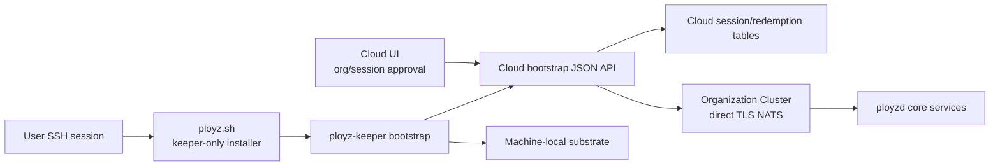
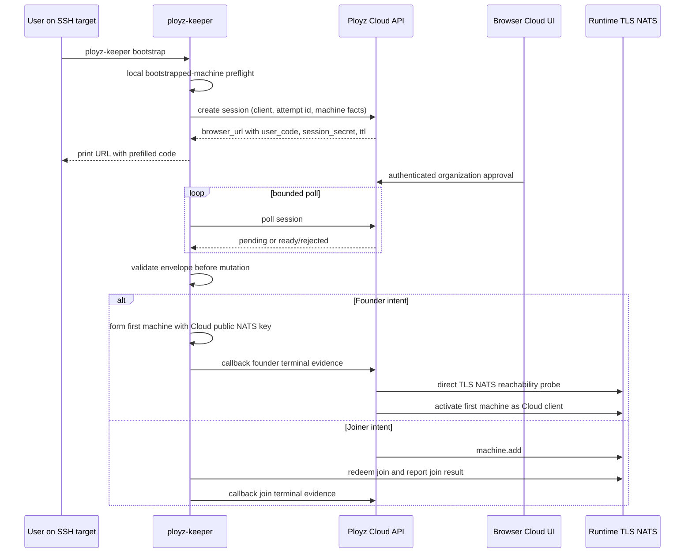
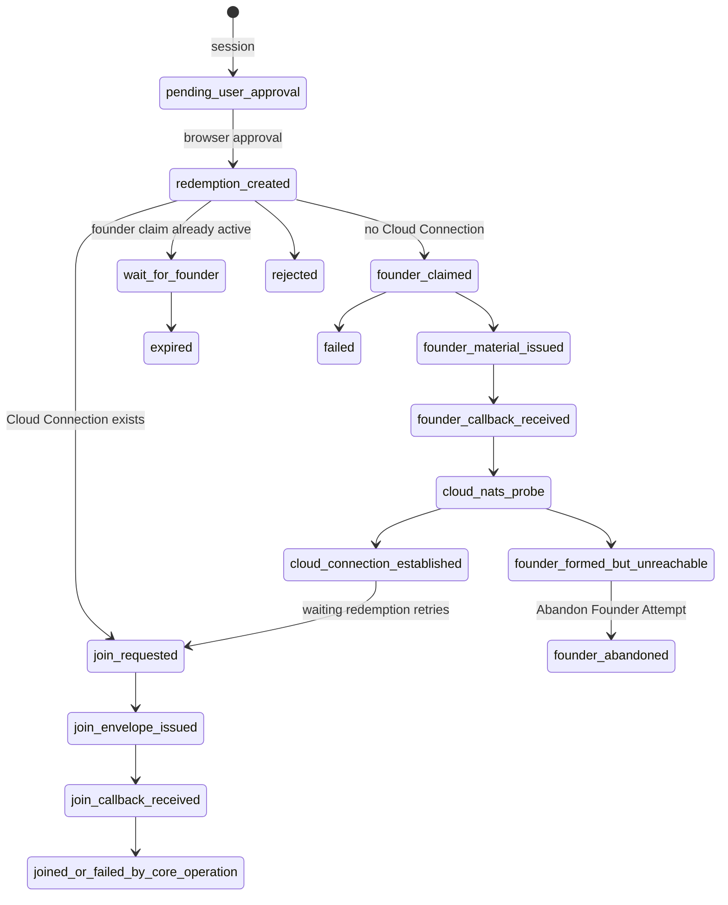

# feat: Add v1 interactive Cloud bootstrap

## Summary

Implement the first Cloud bootstrap adoption flow across `ployz-rust` and
`ployz-cloud`: the generic no-token command creates an interactive Cloud
Bootstrap Session, the user approves it in Cloud, and keeper executes the
returned founder or joiner envelope.

This plan is the implementation source for Cloud Bootstrap Session, Cloud
Bootstrap Redemption, sticky Cloud Founder Claim, keeper-owned session polling,
typed JSON envelopes, Cloud-safe callbacks, and Cloud Lens direct TLS NATS
reachability.

Cloud Bootstrap Invite, Cloud Bootstrap Token, and provider cloud-init support
are intentionally deferred from this first implementation. Their glossary terms
remain because they describe the later noninteractive path, but v1 adoption is
the generic session command only.

It supersedes these same-day plans:

- `ployz-rust: docs/plans/2026-06-26-001-feat-cloud-bootstrap-token-plan.md`
- `ployz-cloud: docs/plans/2026-06-26-001-feat-cloud-bootstrap-invite-adoption-plan.md`

The important correction is that `ployz.sh` does not redeem Cloud tokens and
Cloud does not return a shell env manifest. `ployz.sh` installs only
`ployz-keeper`; `ployz-keeper bootstrap` owns the Cloud HTTPS protocol and
consumes typed JSON from the shared SDK contract.

---

## Problem Frame

Cloud adoption should require one simple command on the target machine:

```sh
curl -fsSL https://ployz.sh | sh && sudo ployz-keeper bootstrap
```

That command is for users already SSHed into the machine. `ployz.sh` remains a
small release-delivery script: Linux-only, keeper-only, verified artifact
install, and no Cloud protocol. The second command runs as root because keeper
mutates local machine substrate.

Cloud is optional to Ployz adoption, but `ployz-keeper bootstrap` does not own
CLI-managed cluster creation in v1. Keeper shows a visible `Use local CLI
setup` choice. If the user chooses it, keeper exits nonzero before machine
mutation without creating a Cloud Bootstrap Session, Cloud Bootstrap
Redemption, callback token, or Cloud Founder Claim, and tells the user to run
`ployzctl machine init USER@HOST` from their workstation. Handoff material from
keeper to a workstation-local `ployzctl` context is deferred.

The organization decision is Cloud-side:

- Interactive mode creates a short-lived Cloud Bootstrap Session. The user
  opens a browser URL, authenticates, and chooses the organization. Cloud
  derives founder, joiner, or wait behavior from that organization's
  Organization Cluster state.
- Future token mode may redeem a single-redemption Cloud Bootstrap Token issued
  by a Cloud Bootstrap Invite. That noninteractive path is not part of this
  first implementation.

Every Cloud-approved machine use becomes a Cloud Bootstrap Redemption. Cloud
decides whether that redemption receives Founder Bootstrap, Joiner Bootstrap,
or wait-for-founder. Cluster truth still comes from NATS operations and
operation events; Cloud callback rows are product workflow evidence.

---

## Current State

### `ployz-rust`

- `scripts/ployz.sh` is already keeper-only release delivery. It installs
  `/usr/local/bin/ployz-keeper`, rejects old `--first-machine`, `--join-token`,
  and `--cloud-token` shell-script modes, and fails on non-Linux platforms.
- `ployz-keeper bootstrap` parses interactive mode, `--cloud-token`, and
  optional `--cloud-host`. The actual Cloud session path is still a stub, and
  token redemption is deferred.
- `ployz-sdk-types` already defines most Cloud bootstrap JSON types:
  session create/poll, future token redeem, decision, envelope, callback,
  founder result, joiner result, failures, protocol version, and TypeScript
  export.
- `ployz-keeper/src/cloud_bootstrap.rs` has safe joiner helper functions, but
  they are not wired into the keeper command.
- Founder groundwork exists for adding Cloud's NATS user public key to the
  authorized users render, but Cloud-mediated founder execution is not wired.
- `ployzctl` has a `CloudBootstrapCommand` renderer, but older remote init/add
  paths still render public script commands with flags that `ployz.sh` now
  rejects.

### `ployz-cloud`

- Cloud still uses the legacy `server_bootstrap_token` table and
  `/api/machine/bootstrap` report route.
- Provider cloud-init writes old `PLOYZ_BOOTSTRAP_ENDPOINT`,
  `PLOYZ_BOOTSTRAP_TOKEN`, and `PLOYZ_PROVISIONING_ID` env material, then runs
  an old installer command that Rust no longer accepts.
- AWS and Hetzner Inngest workflows still wait for old bootstrap reports and
  use SSH-oriented server provisioning helpers.
- There is no implemented Cloud Bootstrap Session, Redemption, Founder Claim,
  callback-token, or Cloud Lens reachability model.
- Cloud does not yet consume the generated Rust Cloud bootstrap TypeScript
  contract.

---

## Requirements

### Command and UX Contract

- R1. The primary human command remains
  `curl -fsSL https://ployz.sh | sh && sudo ployz-keeper bootstrap`.
- R2. The no-token command is the only v1 Cloud adoption command. Existing
  `--cloud-token` parsing may remain, but token redemption is deferred and must
  not be used by provider workflows in this slice.
- R3. `--cloud-host <host-or-https-url>` may point interactive keeper bootstrap
  at staging or self-hosted Cloud. It does not identify the organization,
  cluster, machine, or runtime endpoint.
- R4. `ployz.sh` installs only the verified keeper artifact and never parses
  Cloud protocol data, founder/joiner intent, join tokens, callback tokens, or
  NATS credentials.
- R5. Interactive keeper bootstrap offers Ployz Cloud, custom/self-hosted
  Cloud, and visible `Use local CLI setup` guidance choices.
- R5a. `Use local CLI setup` exits nonzero before machine mutation, creates no
  Cloud session, redemption, callback token, or Cloud Founder Claim, and points
  the user at `ployzctl machine init USER@HOST`.
- R5b. Keeper-to-workstation handoff material is deferred until there is an
  explicit import format, secret-handling story, and cleanup behavior.
- R6. `ployzctl machine init USER@HOST` remains the deterministic local/direct
  SSH path. `ployzctl cloud link` and `machine init --link-cloud` remain
  deferred until Cloud and local operators can be authorized as distinct NATS
  clients.

### Cloud Session Semantics

- R7. Cloud Bootstrap Sessions are short-lived device-code-style sessions for
  interactive bootstrap.
- R8. An unapproved Cloud Bootstrap Session is not a Cloud Bootstrap
  Redemption. Browser approval creates the redemption by binding the session to
  an organization; Cloud derives the bootstrap target from that organization's
  Organization Cluster state.
- R9. Session secrets and callback credentials are sent in HTTPS headers or
  JSON bodies, never URL query strings.
- R9a. The browser URL may include a non-secret user code so the approval page
  opens prefilled. The user code is display and lookup material, not the keeper
  session secret.
- R9b. Keeper terminal output prints one direct approval URL and
  `Waiting for approval...`. It should not add a separate manual code-entry
  instruction unless a future terminal/path fallback needs it.
- R9c. Keeper does not try to open the browser automatically in v1. The target
  machine is usually reached over SSH and the process may run under `sudo`, so
  printing the URL is the only v1 behavior.
- R10. Cloud stores only hashes for session secrets and callback tokens. Private
  NATS seeds and join material are encrypted when they must be retained, and
  are never exposed through UI projections, logs, Inngest events, or public API
  rows.
- R11. Keeper generates and persists a stable per-machine bootstrap attempt id
  before the first Cloud request. Cloud uses `(session, attempt_id)` replay
  semantics so retrying after a keeper crash returns the same redemption and
  envelope instead of creating duplicate `machine.add` operations.
- R12. Cloud exposes revocation/expiry for active sessions and redemptions.

### Typed JSON Protocol

- R13. The Rust `ployz-sdk-types` Cloud bootstrap contract is the source of
  truth for machine-facing JSON payloads and generated TypeScript types.
- R14. The v1 contract includes the protocol version, keeper version, attempt
  id, machine facts, session create/poll requests, typed decisions, typed
  rejection reasons, typed envelopes, callback requests, and callback accepted
  responses.
- R15. Cloud returns `CloudBootstrapDecision::Pending`,
  `CloudBootstrapDecision::Ready`, or `CloudBootstrapDecision::Rejected`.
  It does not return text manifests.
- R16. Keeper validates every envelope before mutating local state. Missing,
  malformed, cross-origin, expired, unsupported, or intent-inconsistent
  envelopes fail before bootstrap mutation.
- R17. Callback URLs must be HTTPS, same-origin with the configured Cloud host,
  non-redirecting, and bound Cloud-side to the redemption id, session,
  organization, Organization Cluster, intent, and terminal state.
- R18. Callback tokens are separate from session secrets, expire, are
  hashed at rest, are sent as authorization credentials, and allow idempotent
  replay of the same terminal payload only.
- R18a. After Cloud has accepted a terminal callback, a keeper rerun for the
  same attempt asks Cloud for terminal status, exits success with current Cloud
  status evidence, and performs no local mutation. This may report a Cloud
  Connection or a formed-but-unreachable founder redemption state.

### Machine and Cluster Boundaries

- R19. Keeper refuses Cloud bootstrap locally on a Bootstrapped Machine before
  it creates a Cloud session or posts any callback.
- R20. The local preflight distinguishes fresh machine, partial same-attempt
  resume, already joined same cluster, and already joined different cluster.
  Cross-cluster reruns must not overwrite local credentials.
- R21. Founder Bootstrap authorizes Cloud by NATS user public key. The Cloud
  private NATS seed stays encrypted in Cloud; the founder envelope gives keeper
  only the public key to authorize.
- R22. Founder callbacks return machine id, runtime NATS URL, and trusted NATS
  material. They never upload the local operator seed or Join seed.
- R22a. If founder bootstrap succeeds locally but the Cloud callback fails,
  keeper exits failed with local evidence and starts no background retry worker.
  Keeper persists the exact Cloud-safe terminal callback payload in root-owned
  attempt state before posting it. Rerunning keeper on the same machine resumes
  the same attempt, replays that persisted payload, and refuses to recompute or
  mutate founder state for the terminal attempt. If Cloud has already accepted
  the terminal callback, rerun exits success with current Cloud status evidence
  and performs no local mutation.
- R23. Cloud performs outside-in direct TLS NATS reachability before a Cloud
  Connection exists and before waiters receive joiner envelopes.
- R23a. Cloud Connection is a durable Organization Cluster-level product
  relationship, separate from per-machine Cloud Bootstrap Redemptions. Bootstrap
  can establish it, and future `ployzctl cloud link` can establish it through a
  different explicit flow. Cloud creates the Cloud Connection only after the
  reachability probe succeeds.
- R23b. Formed-but-unreachable is a founder Cloud Bootstrap Redemption or Cloud
  Founder Claim outcome, not a Cloud Connection state. It means founder
  bootstrap reported local success but did not establish the Organization
  Cluster's Cloud Connection.
- R23c. Before the Cloud Connection exists, Cloud stores callback-reported
  endpoint, CA, and Cloud client material on the founder redemption or Founder
  Claim, not on a pending Cloud Connection row.
- R23d. A formed-but-unreachable founder can be recovered by Abandon Founder
  Attempt. Cloud marks that Founder Claim terminal abandoned, rejects waiting
  redemptions, creates no Cloud Connection, and allows a new Cloud Bootstrap
  Session to claim Founder Bootstrap. Cloud does not clean up or mutate the
  already-formed local machine.
- R23e. The already-formed local machine can be cleaned up with Substrate
  Uninstall through `sudo ployz-keeper uninstall`. Substrate Uninstall removes
  Ployz substrate and machine-local Ployz material only; it does not delete user
  workloads, Docker images, Docker volumes, service containers, arbitrary
  networks, or runtime data by default.
- R23f. `ployz-keeper uninstall` removes the keeper binary as the final step.
  Failure to remove the keeper binary after substrate removal is a
  leftover-binary warning, not a reason to treat the machine as still
  substrate-installed.
- R23g. `ployz-keeper uninstall` requires interactive confirmation by default
  after printing the substrate and machine-local material it will remove. The
  scripted bypass is `--yes`.
- R23h. `ployz-keeper uninstall` refuses by default when local evidence shows
  the machine is still accepted in a cluster. `--force` overrides that local
  refusal and removes local substrate anyway, but it does not perform Force
  Removed Machine, revoke cluster authority in NATS, release endpoint subnets,
  or mutate cluster truth.
- R23i. `--force` and `--yes` are independent uninstall flags. `--force`
  bypasses accepted-machine local refusal but still requires confirmation;
  `--yes` skips confirmation but does not bypass accepted-machine local refusal.
  Automation that wants forced local cleanup must pass both flags.
- R24. Cloud's NATS reachability probe validates public-routable host, allowed
  scheme and port, DNS rebinding protections, TLS trust, and successful auth as
  Cloud's authorized NATS user. Loopback, private, link-local, and metadata IPs
  are rejected.
- R25. New-cluster redemptions serialize one sticky Cloud Founder Claim per
  Organization Cluster. Once founder material is issued, Cloud does not
  auto-promote another waiter to founder after failure.
- R26. Joiner Bootstrap is still core `machine.add`, Machine Join Redemption,
  and Machine Join Report. Cloud brokers delivery and watches operation events;
  it does not make callback evidence cluster truth.
- R26a. If joiner bootstrap succeeds locally but the Cloud callback fails,
  keeper uses the same terminal-payload rule as founder bootstrap: it persists
  the exact Cloud-safe terminal callback payload before posting it, exits failed
  with local evidence and no background retry worker on post failure, and
  replays the persisted payload on rerun. If Cloud has already accepted the
  terminal callback, rerun exits success with current Cloud status evidence and
  performs no local mutation.
- R27. Duplicate reported hostnames are allowed as machine facts. Cloud derives
  a unique current Machine Name before submitting core operations.
- R28. Direct TLS NATS remains the v1 control-plane transport. Cloud bootstrap
  does not add Cloud SSH, tunnels, or private overlay transport.

### Cloud Product and Workflow

- R29. Interactive session browser approval enforces organization membership
  and maps the session to that organization's Organization Cluster. Cloud
  derives founder, joiner, or wait behavior from current cluster state.
- R29a. Joiner decisions depend on the Organization Cluster having a Cloud
  Connection, not on a founder redemption's status.
- R30. V1 approval uses one `Connect this machine` action after organization
  selection. Derived founder, joiner, or wait behavior may be shown as status
  text, but the user does not choose that behavior in v1.
- R31. Cloud UI and public projections redact session secrets, callback tokens,
  join tokens, NATS private seeds, secret hashes, and serialized envelopes while
  showing actionable states.

---

## Key Technical Decisions

- KTD1. `ployz-keeper`, not `ployz.sh`, owns the Cloud bootstrap protocol.
- KTD2. Typed JSON from `ployz-sdk-types` replaces shell env manifests.
- KTD3. Cloud Bootstrap Invite and Cloud Bootstrap Token remain glossary terms,
  but are deferred from v1 implementation. The v1 command always starts with a
  Cloud Bootstrap Session.
- KTD4. A per-machine attempt id is required for retry safety and duplicate
  suppression.
- KTD5. The Cloud Founder Claim is sticky and serialized by Cloud storage.
  Founder failure requires explicit user action or a new session, not automatic
  promotion.
- KTD6. Cloud callback evidence is product workflow evidence. NATS operations,
  current state, and operation events remain runtime truth.
- KTD6a. Cloud is optional to Ployz setup, but keeper does not own local
  CLI-managed cluster creation. The visible `Use local CLI setup` choice exits
  nonzero before machine mutation and points at
  `ployzctl machine init USER@HOST`. Handoff material is deferred.
- KTD6b. Callback failure after local founder or joiner success is a visible
  adoption failure, not background work. Keeper exits failed with evidence;
  rerun resumes the same attempt and replays the exact persisted terminal
  callback payload.
- KTD6c. Rerun after Cloud has already accepted the terminal callback is a
  successful no-op: keeper asks Cloud for terminal status, prints current Cloud
  status evidence, and performs no local mutation.
- KTD7. Cloud receives product-client authority by authorizing a Cloud NATS
  user public key during founder bootstrap. Cloud's private seed is encrypted
  server-side and is not recovery authority.
- KTD7a. Cloud Connection is the durable Organization Cluster-level product
  relationship. Redemptions are per-machine bootstrap attempts; they may
  establish a Cloud Connection but do not become the connection themselves.
- KTD7b. Abandon Founder Attempt is the explicit escape hatch for the wrong
  first machine. It is Cloud-side founder coordination cleanup, not machine
  cleanup or waiter promotion.
- KTD7c. Substrate Uninstall is the local cleanup path for abandoned or
  unwanted bootstrap material. Keeper owns it as `sudo ployz-keeper uninstall`
  because keeper owns machine-local substrate mutation. It is substrate-only by
  default; destructive runtime wiping is a separate future action. Keeper
  self-removal happens last and can leave a warning-only leftover binary.
- KTD7d. Uninstall is confirmed by default because it removes local Ployz auth,
  config, and state. `--yes` exists only for explicit scripting.
- KTD7e. `--force` on uninstall is local-only. It means "remove local substrate
  despite accepted-machine evidence"; it does not mean Force Removed Machine.
- KTD7f. `--force` and `--yes` stay independent because they acknowledge
  different risks: cluster-membership evidence and interactive confirmation.
- KTD8. Provider cloud-init stays on the legacy path for this slice; migrating
  it to Cloud Bootstrap Invites is deferred.
- KTD9. `ployzctl cloud link` stays out of this implementation because the
  multi-operator NATS credential model is not ready.

---

## High-Level Technical Design

### Component Map



### Interactive Session Flow



### Redemption State Machine



---

## Implementation Units

### U1. Align the Shared Cloud Bootstrap Contract

- **Goal:** Make the Rust contract the exact machine-facing JSON API that
  Cloud consumes.
- **Repos and files:**
  - `ployz-rust: crates/ployz-sdk-types/src/lib.rs`
  - `ployz-rust: crates/ployz-sdk-types/src/typescript.rs`
  - `ployz-rust: crates/ployz-sdk-types/tests/exports.rs`
  - `ployz-rust: packages/ployz-sdk/src/generated.ts`
  - `ployz-rust: packages/ployz-sdk/test/fixtures/operation-contract.json`
  - `ployz-rust: docs/architecture/cloud-bootstrap.md`
  - `ployz-cloud: package.json`
  - `ployz-cloud: pnpm-lock.yaml`
  - `ployz-cloud: src/models/servers/bootstrap-contract.ts` or an equivalent
    generated-type import boundary
- **Approach:** Add the missing stable attempt id type and fields to session
  create and poll requests. Tighten callback URL/origin expectations, rejection
  variants, wait-for-founder retry hints, and failure shapes. Generate
  TypeScript from Rust and wire Cloud to consume those DTOs instead of retyping
  the protocol by hand. Leave token DTOs marked as future if they remain in the
  shared type surface.
- **Test scenarios:**
  - Rust and TypeScript fixtures include session create/poll, pending,
    rejected, founder, joiner, wait-for-founder, callback success, idempotent
    replay, and failure examples.
  - Unknown JSON fields are rejected where the contract says they should be.
  - Secret wrapper debug output redacts tokens, callback credentials, join
    tokens, and NATS seeds.
- **Verification:** Run Rust SDK export tests and Cloud typecheck for the
  imported/generated contract boundary.

### U2. Implement Keeper Prompt, Cloud Client, and Session Flow

- **Goal:** Turn `ployz-keeper bootstrap` from a prompt/stub into the actual
  Cloud session driver while preserving no-Cloud guidance.
- **Repos and files:**
  - `ployz-rust: crates/ployz-keeper/Cargo.toml`
  - `ployz-rust: crates/ployz-keeper/src/cli.rs`
  - `ployz-rust: crates/ployz-keeper/src/main.rs`
  - `ployz-rust: crates/ployz-keeper/src/cloud_bootstrap.rs`
  - `ployz-rust: crates/ployz-keeper/src/cloud_client.rs` (new)
  - `ployz-rust: crates/ployz-keeper/tests/bootstrap_cloud.rs` (new or
    equivalent)
- **Approach:** Add a narrow HTTPS client module with timeouts,
  no-secret-in-URL behavior, redacted errors, JSON serialization, and test
  fakes. The Cloud choice creates a session, prints the browser URL with the
  non-secret user code prefilled, and polls. The `Use local CLI setup` choice
  skips Cloud client creation, exits nonzero before machine mutation, and prints
  `ployzctl machine init USER@HOST` guidance. The Cloud flow creates or loads a
  persisted attempt id before Cloud contact, honors pending/wait retry hints
  with bounded backoff, and surfaces typed rejections.
- **Test scenarios:**
  - Session secrets never appear in request URLs, logs, panic/debug
    output, or user-facing errors.
  - Browser URLs may contain the user code, and tests prove the user code is
    not accepted as the keeper polling secret.
  - Keeper prints `Open this link to connect this machine:`, the prefilled URL,
    and `Waiting for approval...` without extra Cloud-token or manual-code
    instructions.
  - Keeper does not invoke `xdg-open`, `open`, or another browser launcher in
    v1.
  - The prompt includes a visible `Use local CLI setup` choice.
  - `Use local CLI setup` performs no session create, session poll, callback,
    Cloud host request, local bootstrap, or Operator Context write, exits
    nonzero, and prints `ployzctl machine init USER@HOST` guidance.
  - `--cloud-host` accepts bare HTTPS hosts through normalization and rejects
    insecure hosts outside an explicit local-test seam.
  - Retry after crash with the same attempt id reuses the same redemption.
  - Unsupported client, expired session, unauthorized session, malformed
    envelope, and wait-for-founder all produce explicit terminal or retry
    behavior.
- **Verification:** Run keeper Cloud bootstrap tests plus existing CLI parser
  and installer tests.

### U3. Add Keeper Local Bootstrap Preflight and Attempt Resume

- **Goal:** Refuse unsafe reruns locally before any Cloud mutation and resume
  partial same-attempt work safely.
- **Repos and files:**
  - `ployz-rust: crates/ployz-keeper/src/local.rs`
  - `ployz-rust: crates/ployz-keeper/src/main.rs`
  - `ployz-rust: crates/ployz-keeper/src/cloud_bootstrap.rs`
  - `ployz-rust: crates/ployz-keeper/tests/bootstrap.rs`
  - `ployz-rust: crates/ployz-keeper/tests/bootstrap_cloud.rs`
- **Approach:** Add explicit local bootstrap states for fresh, partial
  same-attempt, already joined same cluster, and already joined different
  cluster. Check durable Ployz machine-local material, role env, NATS material,
  join material, and managed units before Cloud session/redeem. Store attempt
  state under keeper-owned local state with root-only permissions.
- **Test scenarios:**
  - Fresh machines proceed to Cloud request.
  - Existing NATS material, join material, or role units refuse before any
    fake Cloud request is observed.
  - Partial same-attempt state resumes without generating a second attempt id.
  - Different-cluster material refuses without overwriting credentials.
- **Verification:** Run keeper local/bootstrap tests.

### U3a. Implement Keeper Substrate Uninstall

- **Goal:** Add `sudo ployz-keeper uninstall` as the local cleanup path for
  abandoned or unwanted bootstrap material.
- **Repos and files:**
  - `ployz-rust: crates/ployz-keeper/src/cli.rs`
  - `ployz-rust: crates/ployz-keeper/src/main.rs`
  - `ployz-rust: crates/ployz-keeper/src/local.rs`
  - `ployz-rust: crates/ployz-keeper/tests/bootstrap.rs`
  - `ployz-rust: crates/ployz-keeper/tests/bootstrap_cloud.rs`
  - `ployz-rust: crates/ployz-keeper/tests/uninstall.rs` (new or equivalent)
- **Approach:** Add a keeper-owned uninstall command that prints the Ployz
  substrate units, machine-local Ployz material, and keeper binary path it will
  remove. Require typing `uninstall` by default and support `--yes` for
  scripts. Refuse by default when local evidence shows the machine is still an
  accepted cluster member; support `--force` to override that local refusal
  without contacting Cloud or mutating cluster truth. Keep `--force` and
  `--yes` independent, so forced automation passes `--force --yes`. Stop and
  remove Ployz-owned units and substrate material, remove machine-local Ployz
  material, then remove the keeper binary last. Do not remove user workloads,
  Docker images, Docker volumes, service containers, arbitrary networks, or
  runtime data. Treat final keeper self-removal failure as a warning after
  substrate uninstall has otherwise completed.
- **Test scenarios:**
  - Uninstall without confirmation exits before mutation.
  - `--yes` bypasses the prompt and runs the same removal plan.
  - `--yes` does not bypass accepted-machine refusal without `--force`.
  - `--force` still requires confirmation unless `--yes` is also present.
  - Accepted-machine evidence refuses uninstall unless `--force` is present.
  - `--force` does not call Cloud, submit machine removal, revoke cluster NATS
    authority, release endpoint subnets, or mutate cluster truth.
  - The removal plan does not include workloads, Docker images, Docker volumes,
    service containers, arbitrary networks, or runtime data.
  - Keeper self-removal runs last and failure produces a leftover-binary
    warning without marking substrate uninstall failed.
  - After successful substrate uninstall, keeper bootstrap preflight treats the
    machine as fresh unless unrelated Ployz evidence remains.
- **Verification:** Run keeper CLI, local/bootstrap, and uninstall tests.

### U4. Wire Cloud-Mediated Founder Bootstrap and Callback

- **Goal:** Execute a founder envelope locally, authorize Cloud's public NATS
  key, and post a Cloud-safe callback.
- **Repos and files:**
  - `ployz-rust: crates/ployz-core/src/install.rs`
  - `ployz-rust: crates/ployz-core/tests/install_contract.rs`
  - `ployz-rust: crates/ployz-core/tests/nats_config.rs`
  - `ployz-rust: crates/ployz-keeper/src/main.rs`
  - `ployz-rust: crates/ployz-keeper/src/steps.rs`
  - `ployz-rust: crates/ployz-keeper/src/steps/nats_material.rs`
  - `ployz-rust: crates/ployz-keeper/tests/bootstrap_first_machine.rs`
  - `ployz-rust: crates/ployz-keeper/tests/bootstrap_cloud.rs`
- **Approach:** Extend serializable first-machine install material so Cloud's
  public NATS user key is an explicit founder input. Validate the public key
  before writing auth files. Keep local/direct founder output unchanged for
  `ployzctl machine init`, but Cloud callback output only includes machine id,
  runtime NATS URL, and trusted NATS material.
- **Test scenarios:**
  - Valid Cloud public key appears as an authorized `User` with least-privilege
    subject permissions.
  - Invalid Cloud public key fails before local NATS auth mutation.
  - Founder Cloud callback excludes local operator seed and Join seed.
  - Cloud-mediated founder bootstrap does not emit the local operator seed,
    Join seed, or Operator Context that belong to the `ployzctl machine init`
    path.
  - Callback timeout after local success leaves explicit evidence, exits failed,
    starts no background retry worker, persists the exact terminal callback
    payload before posting, and a rerun replays that payload without recomputing
    or mutating founder state.
- **Verification:** Run core install contract tests and keeper first-machine Cloud
  tests.

### U5. Wire Cloud-Mediated Joiner Bootstrap and Wait Handling

- **Goal:** Execute joiner envelopes through the existing Machine Join
  Redemption and Machine Join Report flow.
- **Repos and files:**
  - `ployz-rust: crates/ployz-keeper/src/cloud_bootstrap.rs`
  - `ployz-rust: crates/ployz-keeper/src/main.rs`
  - `ployz-rust: crates/ployz-keeper/tests/bootstrap_join.rs`
  - `ployz-rust: crates/ployz-keeper/tests/bootstrap_cloud.rs`
- **Approach:** Validate runtime NATS URL, trusted CA, join token, Join
  credential delivery, release selection, and callback fields before mutation.
  Reuse the existing join executor. Implement wait-for-founder as bounded
  retry/poll behavior that respects Cloud retry hints and session expiry.
- **Test scenarios:**
  - Valid joiner envelope writes trusted CA, connects as Join, redeems the join
    token, reports the join result, and posts a Cloud-safe callback.
  - Missing CA, bad URL, bad Join seed, expired join token, and callback failure
    each produce typed evidence.
  - Callback timeout after local join success persists the exact terminal
    callback payload before posting, exits failed, starts no background retry
    worker, and a rerun replays that payload.
  - Joiner callback excludes join token and Join credential.
  - Wait-for-founder retries until ready, rejected, or expired.
- **Verification:** Run keeper join and Cloud bootstrap tests.

### U6. Add Cloud Session, Redemption, and Secret Handling

- **Goal:** Add the Cloud-side state needed for interactive session adoption.
- **Repos and files:**
  - `ployz-cloud: src/db/schema.ts`
  - `ployz-cloud: drizzle/*/migration.sql`
  - `ployz-cloud: src/models/servers/bootstrap-sessions.server.ts` (new)
  - `ployz-cloud: src/models/servers/bootstrap-redemptions.server.ts` (new)
  - `ployz-cloud: src/models/servers/machine-bootstrap.server.ts`
  - `ployz-cloud: src/models/servers/bootstrap-*.test.ts`
- **Approach:** Add tables for sessions, redemptions, founder claims, callback
  credentials, callback outcomes, Cloud Connections, and Cloud NATS client
  material. Enforce organization scoping after browser approval, session secret
  hash storage, callback token hash storage, expiry, revocation, idempotent
  terminal callback semantics, transactional founder claim uniqueness, and one
  durable Cloud Connection relationship per Organization Cluster created only
  after reachability succeeds. Pre-connection endpoint, CA, and Cloud client
  material remains on the founder redemption or Founder Claim. Keep the legacy
  provider bootstrap table unchanged for this slice.
- **Test scenarios:**
  - Session secrets and callback tokens are hashed and compared safely.
  - Unapproved sessions do not create redemptions.
  - Same attempt id replays the same redemption and envelope.
  - Cloud Connection rows are Organization Cluster-level records and are not
    modeled as redemptions.
  - No Cloud Connection row is created before reachability succeeds.
  - Concurrent founder requests produce exactly one founder claim; losers wait.
  - Abandon Founder Attempt marks the formed-but-unreachable Founder Claim
    terminal abandoned and permits a later new session to become founder.
  - Replayed identical callbacks are accepted; conflicting callbacks are
    rejected without mutating the original terminal result.
- **Verification:** Run Cloud model tests for bootstrap sessions, redemptions,
  callbacks, and legacy compatibility.

### U7. Add Cloud Machine-Facing JSON Routes and Decision Service

- **Goal:** Expose the typed JSON API that keeper calls.
- **Repos and files:**
  - `ployz-cloud: src/routes/api/bootstrap/sessions.ts` (new)
  - `ployz-cloud: src/routes/api/bootstrap/sessions/poll.ts` (new or
    route-convention equivalent)
  - `ployz-cloud: src/routes/api/bootstrap/redemptions/$redemptionId/callback.ts`
    (new or route-convention equivalent)
  - `ployz-cloud: src/models/servers/bootstrap-decisions.server.ts` (new)
  - `ployz-cloud: src/lib/result-http.ts`
  - `ployz-cloud: src/inggest/events.ts`
- **Approach:** Use TanStack Start raw server routes returning JSON `Response`
  objects with `Cache-Control: no-store`. Parse request bodies against the
  shared generated DTOs or narrow Zod adapters. Translate domain errors through
  existing result/http helpers. Decision service returns pending, rejected,
  ready founder, ready joiner, or wait-for-founder.
- **Test scenarios:**
  - Session create returns browser URL with prefilled user code, session secret,
    and no cache.
  - Session poll enforces session secret and returns typed pending/ready/reject.
  - Callback route validates authorization header, redemption id, origin-bound
    URL assumptions, expiry, and idempotent terminal replay.
  - Unauthorized session operations fail generically where machine clients
    should not learn approval state beyond typed pending/rejected decisions.
- **Verification:** Run route handler tests and Cloud typecheck.

### U8. Implement Cloud NATS Client, Reachability, and Core Operation Bridge

- **Goal:** Let Cloud prove founder usability and request joins as a scoped
  product client over direct TLS NATS.
- **Repos and files:**
  - `ployz-cloud: src/models/runtime/runtime.server.ts`
  - `ployz-cloud: src/models/servers/cloud-lens-reachability.server.ts` (new)
  - `ployz-cloud: src/models/servers/bootstrap-decisions.server.ts`
  - `ployz-cloud: src/env.ts`
  - `ployz-cloud: package.json`
  - `ployz-cloud: pnpm-lock.yaml`
- **Approach:** Add a narrow server-side TLS NATS client wrapper for the
  Ployz core operations needed by bootstrap: founder activation,
  `machine.add`, operation status/watch, and minimal observations. Use Cloud's
  encrypted NATS user seed and callback-reported CA/endpoint. Validate endpoint
  candidates against SSRF rules before dialing. Keep timeouts tight and
  failures typed.
- **Test scenarios:**
  - Founder callback success without Cloud NATS reachability marks the founder
    redemption or Founder Claim formed-but-unreachable, not connected.
  - Callback-reported endpoint, CA, and Cloud client material remain on the
    founder redemption or Founder Claim until reachability succeeds.
  - Abandon Founder Attempt after formed-but-unreachable does not dial NATS,
    does not create a Cloud Connection, and does not mutate the local machine.
  - Cloud rejects loopback, private, link-local, metadata IP, bad DNS rebinding,
    bad TLS CA, wrong NATS principal, and TCP-only reachability.
  - Successful founder reachability establishes the Organization Cluster's
    Cloud Connection and unblocks waiting redemptions.
  - Join decision calls `machine.add`, derives a unique Machine Name, and
    returns joiner envelope only after the operation produces join material.
- **Verification:** Run mocked NATS reachability and decision-service tests.

### U9. Add Cloud Session Approval UI and Status Projections

- **Goal:** Let a signed-in Cloud user approve a keeper session and see the
  resulting bootstrap status without exposing secrets.
- **Repos and files:**
  - `ployz-cloud: src/models/servers/bootstrap-sessions.server.ts`
  - `ployz-cloud: src/models/servers/bootstrap-redemptions.server.ts`
  - `ployz-cloud: src/models/servers/servers.ts`
  - `ployz-cloud: src/models/servers/servers.server.ts`
  - `ployz-cloud: src/routes/_protected/$organizationSlug/_org/servers/-components/provisioning-display.ts`
  - `ployz-cloud: src/routes/_protected/$organizationSlug/_org/servers/provisioning.$provisioningId.tsx`
  - `ployz-cloud: src/routes/_protected/$organizationSlug/_org/servers/bootstrap-session.$sessionId.tsx`
    (new or route-convention equivalent)
- **Approach:** Add the browser approval surface for a session URL with the
  non-secret user code prefilled. The user chooses the organization, then Cloud
  turns the session into a redemption for that organization's Organization
  Cluster when they click `Connect this machine`. The page can show derived
  founder, joiner, or wait context as status text, but it does not make that
  behavior a v1 choice.
  Update public projections and UI statuses for waiting-for-founder, founder
  installing, Cloud Connection verifying, founder formed-but-unreachable, join
  requested, joining, connected, failed, cancelled, and expired. Do not
  introduce client-side navigation network requests in `beforeLoad`, and
  project TanStack DB live rows before strict schema parsing.
- **Test scenarios:**
  - Browser approval creates a redemption only after organization selection and
    `Connect this machine`.
  - Approval page opens with the user code prefilled and still rejects missing,
    expired, or unknown session codes.
  - Formed-but-unreachable founder status offers `Retry reachability` and
    `Abandon founder attempt` actions with copy that says the original machine
    remains local/unmanaged unless the user cleans it up.
  - Derived founder, joiner, or wait context is informational and is not a
    user-selectable v1 option.
  - Session detail/list projections show actionable status without exposing the
    session secret, callback token, join token, NATS private seed, secret hashes,
    or serialized envelopes.
  - UI/API list and detail projections do not expose callback tokens, join
    tokens, NATS private seeds, secret hashes, or serialized envelopes.
- **Verification:** Run Cloud session approval, projection, and UI tests.
  Before PR, run `pnpm pr:check`.

---

## Implementation Ordering

1. Land U1 in `ployz-rust` and wire Cloud to the generated TypeScript
   contract before either side implements route behavior.
2. Land U6 and U7 in `ployz-cloud` with fake decision outputs so keeper can
   integration-test against stable routes.
3. Land U2, U3, and U3a in `ployz-rust` to make keeper session polling real,
   locally safe, and locally cleanup-capable.
4. Land U4 and U5 in `ployz-rust` to execute founder/joiner envelopes.
5. Land U8 in `ployz-cloud` so founder usability and join requests use direct
   TLS NATS.
6. Land U9 in `ployz-cloud` to expose session approval and status UI.
7. Run a cross-repo smoke test with one founder plus one joiner using the
   generic copied command.

---

## Acceptance Examples

- AE1. Given a user SSHes to a fresh server and runs the no-arg command, when
  they approve the browser session for an organization with no Cloud
  Connection, then keeper forms the founder, Cloud receives a
  Cloud-safe callback, Cloud proves direct TLS NATS reachability, and the
  Organization Cluster has a Cloud Connection.
- AE2. Given a user SSHes to a second fresh server and runs the same no-arg
  command, when they approve an organization whose Organization Cluster has a
  Cloud Connection, then Cloud submits `machine.add`, keeper joins through
  Machine Join Redemption, and Cloud watches the core operation to terminal
  state.
- AE3. Given three users run the same generic no-token command on three fresh
  machines and approve each browser session into the same new Organization
  Cluster, when no founder exists, then one redemption receives founder
  material and the others wait until founder reachability is proven, after
  which they receive joiner material.
- AE4. Given a founder reports local success but Cloud cannot authenticate to
  its direct TLS NATS endpoint, when the reachability timeout expires, then the
  founder redemption or Founder Claim is formed-but-unreachable and waiting
  redemptions are not promoted to founder.
- AE4a. Given the founder is formed-but-unreachable because the user chose an
  internal machine, when the user abandons the founder attempt, then Cloud marks
  that Founder Claim terminal abandoned, rejects waiting redemptions, creates no
  Cloud Connection, and a later new Cloud Bootstrap Session can become founder.
- AE5. Given keeper crashes after session approval but before callback, when it
  restarts on the same machine, then it resumes the same attempt id and Cloud
  returns the same redemption/envelope instead of creating another machine add.
- AE5a. Given founder bootstrap succeeds locally but the Cloud callback times
  out or is unavailable, when keeper handles the failure, then keeper exits
  failed with local evidence and no background retry worker; rerunning keeper
  resumes the same attempt and replays the exact terminal callback payload that
  was persisted before the first post attempt.
- AE6. Given the same callback payload is retried after a network timeout, when
  Cloud receives it again, then Cloud accepts it idempotently; a different
  terminal payload for the same redemption is rejected.
- AE6a. Given joiner bootstrap succeeds locally but the Cloud callback times
  out or is unavailable, when keeper handles the failure, then keeper exits
  failed with local evidence and no background retry worker; rerunning keeper
  resumes the same attempt and replays the exact terminal callback payload that
  was persisted before the first post attempt.
- AE6b. Given Cloud has already accepted the terminal callback for a persisted
  attempt, when keeper reruns on the same machine, then keeper asks Cloud for
  terminal status, exits success with current Cloud status evidence, and
  performs no local mutation.
- AE7. Given a machine already contains Ployz NATS or join material, when
  `ployz-keeper bootstrap` runs, then keeper refuses before contacting Cloud
  and does not overwrite local credentials.
- AE8. Given a user chooses `Use local CLI setup`, when keeper handles that
  choice, then no Cloud session, redemption, callback token, Cloud Founder
  Claim, local founder bootstrap, or Operator Context is created, keeper exits
  nonzero, and the user sees `ployzctl machine init USER@HOST` guidance.
- AE9. Given a user runs `sudo ployz-keeper uninstall`, when they do not
  confirm the prompt, then no local mutation occurs. Given they type the
  confirmation or pass `--yes`, then keeper removes Ployz substrate and
  machine-local Ployz material, attempts keeper self-removal last, does not
  remove workload/runtime data, and reports leftover keeper binary as a warning
  if self-removal fails.
- AE9a. Given local evidence says the machine is still an accepted cluster
  member, when the user runs `sudo ployz-keeper uninstall`, then keeper refuses
  before mutation and explains that uninstall is local-only. Given the user
  reruns with `--force`, keeper still requires confirmation before removing
  local substrate. Given the user reruns with `--force --yes`, keeper removes
  local substrate without prompting but does not perform Force Removed Machine
  or mutate cluster truth.

---

## Risks and Mitigations

- **Session approval confusion:** Keep the copied command tokenless and require
  browser approval to bind the machine to an organization and Organization
  Cluster. Show enough machine facts for the user to recognize the target, but
  do not treat hostname as identity.
- **Duplicate redemptions on keeper retry:** Require persisted attempt id and
  Cloud-side replay semantics before any `machine.add` side effects.
- **Split founder authority:** Enforce a transactional founder claim and never
  auto-promote another founder after material is issued.
- **Callback replay or confusion:** Bind callback token, redemption id, intent,
  organization, cluster, and terminal state; accept identical replay and reject
  conflict.
- **SSRF through runtime endpoint facts:** Reject unsafe endpoint targets before
  dialing and require a real TLS NATS auth check as Cloud's scoped principal.
- **Secret exposure through Cloud projections:** Project public rows before Zod
  parsing, redact all secret fields, and add tests for forbidden prefixes and
  private seed shapes.
- **Cross-repo contract drift:** Generated TypeScript fixtures and Cloud route
  tests must consume the Rust contract directly.

---

## Out of Scope

- Cloud SSHing into customer machines for branded provider bootstrap.
- Cloud Bootstrap Invite, Cloud Bootstrap Token, and provider cloud-init
  migration.
- Founder bootstrap option UI for cluster initialization.
- Browser auto-open from keeper; a future explicit `--open` or local desktop
  flow can add that behavior.
- Tunnels, private overlay transport, or NAT traversal.
- Automatic public-IP preflight in keeper as proof of Cloud reachability.
- `ployzctl cloud link` and `ployzctl machine init --link-cloud`.
- Destructive runtime wipe during uninstall.
- Control-Plane Core recovery UX.
- Re-adoption, repair, or takeover of already Bootstrapped Machines.
- Multi-region Cloud reachability probes.
- Removing the legacy `/api/machine/bootstrap` route before all callers are
  known to be migrated.

---

## Verification Matrix

| Area | Command or suite |
| --- | --- |
| Rust format | `cargo fmt --check` |
| Rust SDK contract | `cargo test -p ployz-sdk-types` |
| Keeper installer | `cargo test -p ployz-keeper --test bootstrap_script` |
| Keeper Cloud flow | `cargo test -p ployz-keeper --test bootstrap_cloud` |
| Keeper founder/joiner | `cargo test -p ployz-keeper --test bootstrap_first_machine --test bootstrap_join` |
| Core install contract | `cargo test -p ployz-core --test install_contract --test nats_config` |
| Ployzctl boundaries | `cargo test -p ployzctl --test machine_cli_contract --test machine_remote_nats` |
| Cloud typecheck/lint/test | `pnpm pr:check` |
| Cloud bootstrap models/routes | `pnpm test -- src/models/servers/bootstrap-*.test.ts src/routes/api/bootstrap` |
| Cross-repo smoke | Founder plus joiner copied-command run against staging Cloud and direct TLS NATS |

---

## Plan Confidence Check

- The plan keeps the planning boundary intact: it records implementation units
  and tests, but does not change runtime code.
- The biggest correction from previous plans is explicit: Cloud and keeper use
  typed JSON, not shell env manifests, and `ployz.sh` never redeems tokens.
- The security state machine is explicit enough for implementation: attempt
  replay, callback authority, founder claiming, already-bootstrapped refusal,
  Cloud NATS reachability, and secret retention are all requirements.
- The sequencing reduces contract drift risk by landing the shared SDK contract
  before keeper and Cloud route work.
- The only open technical selection is the exact narrow HTTP/NATS client
  dependency choice in implementation. The plan constrains behavior and tests
  without forcing a premature library decision.
