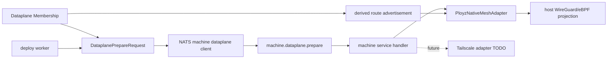

# Refactor Dataplane Prepare Adapters Plan

## Summary

Refactor the current WireGuard/eBPF-specific dataplane preparation path into a provider-neutral Dataplane Prepare seam shaped around minimal Dataplane Membership. Rename the first implemented provider to `PloyzNativeMesh`; its initial implementation remains the existing WireGuard/eBPF path, but the deploy worker stops assembling a WireGuard peer graph as the outer contract. Route advertisement is derived from membership and provider facts rather than declared as separate request data. Tailscale is captured as a future docs-only adapter TODO, with its security and lifecycle shape documented, but no Tailscale install, authentication, route advertisement implementation, Cloud integration, API calls, or selectable provider is added in this implementation.

This is an alpha schema refactor. Prefer clear generic names over compatibility shims unless a live consumer proves the old `wireguard_ebpf` names still need a migration window.

## Problem

The current networking code makes WireGuard/eBPF the outer product concept:

- Core operation stages, failures, evidence, events, and SDK exports use WireGuard/eBPF names.
- Machine-scoped RPC subjects and protocol types expose `wireguard_ebpf.prepare`.
- The deploy worker builds a WireGuard/eBPF request to discover target machines for endpoint network setup.
- The deploy command carries `wireguard_peer_endpoints`, and the NATS machine client expands them into a WireGuard peer graph before final prepare.
- `crates/ployzd/src/dataplane_runtime.rs` mixes adapter behavior, host command planning, public-key reads, route programming, peer programming, and evidence mapping in one large module.
- Tests and generated SDK types pin the provider-specific names as product vocabulary.

That shape makes a future Tailscale data-plane adapter look like a second special case instead of another provider behind the same operation boundary. Tailscale's better shape is membership first: machines join a mesh, advertise reachable routes derived from desired membership/provider facts, and produce evidence that the data-plane intent is usable.

## Goals

1. Make Dataplane Prepare the outer operation seam.
2. Make Dataplane Membership the minimum declared generic adapter contract.
3. Keep current WireGuard/eBPF behavior equivalent under the `PloyzNativeMesh` provider.
4. Move WireGuard/eBPF details, including public-key exchange and peer graph assembly, behind the native mesh adapter.
5. Keep direct TLS NATS as the control-plane path and leave `ployz-transport` out of scope.
6. Make the code easy to extend with a future Tailscale adapter without adding a fake unimplemented provider today.
7. Preserve explicit operations, bounded work, visible progress, and typed failure evidence.
8. Keep security-sensitive material adapter-private and out of KV/events/logs.

## Non-Goals

- Implementing Tailscale.
- Implementing Tailnet Integration, Tailnet Access Bridge, Tailnet Subnet Access, or Tailnet Egress Bridge.
- Implementing Closed Public Ingress, Private Control-Plane Path, or Tunnel Ingress.
- Adding a Tailscale config knob, active enum variant, CLI flag, or env var.
- Installing or supervising `tailscaled`.
- Creating Tailscale auth keys, OAuth clients, tags, ACLs, routes, route approvals, MagicDNS records, or tailnet devices.
- Implementing Dataplane Traffic Observation, eBPF flow analytics, service traffic attribution, or billing/usage metrics.
- Changing Ployz control-plane connectivity from direct TLS NATS.
- Moving live Dataplane Projection into keeper.
- Adding a standalone Dataplane Host Preparation operation.
- Implementing Dataplane Provider Transition.
- Replacing bounded deploy-time machine calls with a controller/watch-only architecture in this refactor.
- Adding background loops that mutate cluster truth without an operation owner.
- Rewriting Docker, gateway, DNS, or eBPF internals beyond names and adapter boundaries required by this refactor.

## Requirements

- R1. External deploy operation language says "dataplane prepare", not "WireGuard/eBPF", except inside `PloyzNativeMesh` implementation payloads and evidence.
- R2. Current WireGuard/eBPF runtime behavior remains equivalent under `PloyzNativeMesh`: interface provisioning, peer programming, endpoint route programming, eBPF readiness, evidence, timeout behavior, and failure classification are preserved.
- R3. `DataplanePrepareRequest` carries only operation id and operation-derived provider-neutral dataplane membership. Membership is the prepare fanout set; the request does not carry a provider selector, provider input, separate target-machine list, generic route-advertisement list, or WireGuard peer graph as the outer contract.
- R4. `PloyzNativeMesh` owns any required translation from membership into provider facts, WireGuard public-key reads, peers, endpoint routes, interface setup, and eBPF attachment.
- R5. Endpoint network setup derives machines from `DataplanePrepareRequest.membership`, not by constructing a WireGuard-specific request or reading a separate target-machine field.
- R6. Machine-scoped RPC exposes a generic dataplane endpoint and generic request/response names. Provider-specific phases are internal to the provider request payload or machine client implementation.
- R7. Core operation stages, failures, events, and evidence use generic dataplane names at the outer surface and provider-specific variant data where needed.
- R8. SDK exports and generated TypeScript types match the generic surface and still expose the `PloyzNativeMesh` evidence variant.
- R9. Runtime code is split so `PloyzNativeMesh` has its own adapter module and route/command helpers are not mixed into a single top-level file.
- R10. The adapter seam does not expose a public/core `Tailscale` variant, config value, CLI flag, env var, SDK type, or operation payload until there is a real implementation and acceptance coverage.
- R11. No private WireGuard key bytes, future Tailscale auth material, OAuth secret, or machine key material is written into operation events, KV state, generated SDK fixtures, or test snapshots.
- R12. This refactor does not add a durable dataplane membership store or durable route advertisement registry. Membership is derived for one operation attempt from existing machine truth and observations; route advertisement and provider facts are derived by the provider from membership and existing observations.
- R13. Generic dataplane membership supports IPv4 and IPv6 endpoint subnets through a typed CIDR value. The current `PloyzNativeMesh` implementation may reject IPv6 with a typed unsupported-address-family failure until eBPF route programming supports it.
- R14. Ployz DNS remains the route-binding DNS authority. MagicDNS is optional tailnet machine-name DNS for future Tailscale use and is not a replacement backend for Ployz route bindings.
- R15. Public endpoint requirements are provider-specific. `PloyzNativeMesh` can require public endpoint observations, but those observations are loaded inside the adapter path; generic Dataplane Membership and `DataplanePrepareRequest` must not require public IPs.
- R16. Future eBPF analytics or traffic flow work belongs to Dataplane Traffic Observation, not Dataplane Prepare. It must be passive and must not decide routing, access, placement, deploy success, or cluster truth.
- R17. Process config groups current native mesh fields under `PloyzNativeMesh` naming but does not add a user-facing provider selector, config enum, CLI option, or env selector until a second provider is implemented.
- R18. Provider reports remain visible operation evidence, but they are sanitized: no peer graphs, public keys, private keys, auth material, raw provider config, or future Tailscale device/auth secrets.
- R19. Dataplane provider choice is a cluster-level concern. Deploys declare membership only, and machines do not choose or advertise their own provider.
- R20. Changing dataplane providers is a future explicit cluster operation, not a deploy side effect. Deploy execution should not silently change provider behavior.
- R21. Tailnet Integration is a separate future family, not a Dataplane Provider and not part of Dataplane Prepare. The native mesh can remain the cluster dataplane while selected Ployz surfaces or, after explicit Tailnet Subnet Access enablement, active Machine Endpoint Subnets are exposed to a tailnet through future integration work.
- R22. Closed Public Ingress, Private Control-Plane Path, and Tunnel Ingress are future topology/access work. This refactor should not add new public inbound port requirements, but it also does not implement closed public ingress.
- R23. Private Control-Plane Path and Tailnet Access Bridge remain separate future concepts. Private reachability to NATS must not imply user/operator access to machine surfaces, and tailnet access exposure must not imply control-plane authority.

## High-Level Design

Use Dataplane Prepare as the deploy-operation seam. The deploy worker asks member machines to make dataplane projection usable for one operation attempt through bounded operation-owned NATS machine calls. The request is expressed as operation-derived dataplane membership only. Membership is the machine RPC fanout set and the endpoint-network ensure set. The machine-local projection remains eventually consistent and non-authoritative; these calls request or verify projection work for one deploy attempt rather than making dataplane state cluster truth.

Membership and route advertisements are not new durable cluster truth. For this refactor membership is computed for the deploy attempt from existing durable machine identity, Machine Endpoint Subnet assignment, machine lifecycle/authority, and fresh provider/machine observations as needed. Provider facts and route advertisement are provider-derived effects or evidence from that membership. If a future Tailscale adapter needs provider-side approval or tailnet state, that belongs in the Tailscale adapter design, not in a new generic core registry now.

Membership derivation should preserve current fanout behavior while making it explicit. Unrouted deploys prepare the machines targeted by the deploy plan. Routed deploys prepare the active dataplane machine set, falling back to the configured observed machine scope when active machine state is unavailable, because route-serving machines may need endpoint reachability even when they are not placement targets for this deploy.

Use a typed CIDR for Machine Endpoint Subnets at the generic dataplane seam. The idiomatic Rust shape is a newtype around `ipnet::IpNet`, serialized as a string for public schemas. Public machine endpoints remain `SocketAddr`, which already supports IPv4 and IPv6. The generic dataplane model should not be IPv4-only just because the current `PloyzNativeMesh` WireGuard/eBPF route path is IPv4-only.

DNS stays separate from mesh membership. The existing Ployz DNS role projects route-binding DNS from active route state, gateway observations, and machine public IP observations, and it already handles A and AAAA answers. Future Tailscale/MagicDNS support should treat MagicDNS as optional tailnet machine-name DNS and possibly document split DNS pointing to Ployz DNS over the tailnet. MagicDNS should not become the Ployz route-binding DNS backend.

Dataplane Traffic Observation is a future separate track. If Ployz later uses eBPF for analytics over native mesh or Tailscale traffic, it should observe flows passively and then map observed addresses/interfaces back to machines and services. It should not become route authority, access authority, deploy gating, or cluster truth. For Tailscale specifically, observation quality will depend on runtime mode: a kernel tunnel/interface path can expose useful post-decryption flow metadata, while userspace networking or physical-NIC-only observation may expose less service-level detail.

The first adapter is `PloyzNativeMesh`, initially implemented with the existing WireGuard/eBPF machinery. Its job is to translate the generic membership into public endpoint observation reads, WireGuard public-key reads, peer configuration, endpoint routes, interface setup, and eBPF forwarding. Future Tailscale can map the same membership model to tailnet device enrollment and advertised routes without making the deploy worker understand Tailscale mechanics or public IP observations.

Provider choice is cluster-level. This refactor should not introduce per-deploy provider selection or mixed-provider machine membership. A future Tailscale implementation can add a Dataplane Provider Transition operation with explicit preparation, cutover, rollback, and cleanup evidence, but deploy execution should continue to see only membership.

Tailnet Integration is separate from Tailscale as a Dataplane Provider. Future integrations can expose selected gateway/admin surfaces, automatically advertise active Machine Endpoint Subnets after Tailnet Subnet Access is explicitly enabled, provide private control-plane reachability, or support service egress while `PloyzNativeMesh` remains the internal dataplane. Subnet access should be cluster-level opt-in with visible integration evidence, not a deploy side effect, machine-add side effect, route-binding DNS replacement, or silent default on a fresh cluster.

Closed Public Ingress is also separate future work. The target is no public inbound service ports, with tightly allowlisted outbound egress for the chosen control-plane, tailnet, tunnel, and dependency paths. A future Private Control-Plane Path could move machine-to-NATS connectivity onto a tailnet or private mesh. A future Tunnel Ingress option could avoid opening public 80/443 by routing selected external traffic through an outbound connector such as Cloudflare Tunnel to Ployz gateway surfaces.

Private Control-Plane Path, Tailnet Access Bridge, and Tailnet Subnet Access should not collapse into one feature. The first changes how `ployzd` reaches NATS. The second exposes selected Ployz gateway/admin surfaces to tailnet users/devices. The third advertises selected Machine Endpoint Subnets for operator/debug access. NATS credentials and subject permissions remain the control authority even if packets travel over a tailnet.

Public and domain-facing names should use Machine language. Any remaining `node` or `NodeId`-named code is implementation naming debt and should only appear in this plan when referring to current files or current types that the refactor touches.



Core owns typed request, response, provider evidence, and failure shapes. `ployzd` owns adapter traits and process wiring. `ployz-transport` remains reserved for future private control-plane connectivity and is not used for this dataplane refactor.

The concrete model should look roughly like this, adjusted to the surrounding code while implementing:

```rust
pub struct DataplanePrepareRequest {
    pub operation_id: OperationId,
    pub membership: Vec<DataplaneMember>,
}

pub struct DataplaneMember {
    pub machine_id: MachineId,
    pub endpoint_subnet: MachineEndpointSubnet,
}

pub struct MachineEndpointSubnet(ipnet::IpNet);

pub enum DataplanePrepareProviderReport {
    PloyzNativeMesh(PloyzNativeMeshPrepareReport),
}
```

Do not add `DataplanePrepareProviderReport::Tailscale`, generated SDK Tailscale types, config values, env vars, CLI flags, or operation payloads until the adapter can be constructed, applied, observed, and tested end to end. The future Tailscale shape belongs in docs/TODOs for now.

## Future Tailscale Record

The Tailscale investigation is complete for this refactor. Its purpose was to shape a clean adapter seam, not to design or implement Tailscale now. The current work should land the generic Dataplane Prepare boundary with minimal Dataplane Membership and `PloyzNativeMesh` as the only implemented provider.

Future Tailscale work should split into two separate tracks:

- **Tailscale Dataplane Provider:** a future cluster-level provider implementation that maps Dataplane Membership to tailnet device participation, advertised endpoint subnet or connector routes, daemon readiness, and sanitized provider evidence. It should be introduced through a Dataplane Provider Transition operation, not a deploy flag, machine-local choice, or hidden migration.
- **Tailnet Integration:** future access/topology integrations that can coexist with `PloyzNativeMesh`, including Tailnet Access Bridge, Tailnet Subnet Access, Private Control-Plane Path, and Tailnet Egress Bridge. These are not Dataplane Prepare inputs and should not change the current adapter contract.

The durable design constraints learned from Tailscale are:

- Membership remains the generic input. Provider-specific route approval, ACLs, tags, auth keys, OAuth clients, daemon state, and tailnet identity stay behind the provider or future integration boundary.
- Generic membership carries typed Machine Endpoint Subnets and supports IPv4 and IPv6 at the schema level.
- Public IP observations are not generic membership data. Native mesh may require them; Tailscale should not.
- Ployz route-binding DNS remains separate from MagicDNS. MagicDNS may be useful for tailnet machine names, not Ployz route authority.
- Tailscale auth material, OAuth secrets, machine keys, peer graphs, raw provider config, and route approval tokens must not appear in operation events, KV state, SDK fixtures, or logs.
- Tailnet Subnet Access is future cluster-level opt-in. After enablement, active Machine Endpoint Subnets may sync automatically with visible integration evidence, but no subnet is exposed before enablement.
- Closed Public Ingress, Private Control-Plane Path, and Tunnel Ingress are future topology work. They can reduce public inbound ports later without changing the current direct TLS NATS control-plane assumption.

## Proposed Module Shape

Split the large runtime module into a folder:

```text
crates/ployzd/src/dataplane_runtime/
  mod.rs
  command.rs
  ployz_native_mesh.rs
  ployz_native_mesh_routes.rs
```

Suggested responsibilities:

- `mod.rs`: public exports, `DataplanePreparer` implementation wrapper, shared runtime config types.
- `command.rs`: bounded command plan execution, timeout/error/evidence conversion helpers that are genuinely shared by the implemented adapter.
- `ployz_native_mesh.rs`: membership-to-peer translation, WireGuard interface, public key, peers, eBPF readiness, and adapter-specific report assembly.
- `ployz_native_mesh_routes.rs`: current endpoint route programming formerly in `host_routes.rs`.

If the split becomes too mechanical, land it in two passes: first rename the seam while keeping behavior stable, then split the runtime module.

## Key Technical Decisions

- KTD1. The public operation concept is `DataplanePrepare`; `PloyzNativeMesh` is the first implemented adapter/provider behind that concept.
- KTD2. The declared adapter contract is Dataplane Membership only, not deploy-time peer programming, provider input, or a separate route-advertisement request list.
- KTD3. Keep generic Dataplane Membership clean. Provider-specific facts such as native mesh public endpoints are loaded inside the provider adapter path, not declared on the generic member or request.
- KTD4. Put adapter traits in `ployzd`, not `ployz-core`. Core defines data. `ployzd` wires behavior.
- KTD5. Use enum variants for core report/evidence schemas, not trait objects or dynamic registries. This keeps public API and TypeScript export shapes explicit without adding provider selection to the prepare request.
- KTD6. Keep WireGuard public-key exchange and peer graph assembly inside the `PloyzNativeMesh` adapter client path. The deploy worker should not know that this provider needs public keys before final projection.
- KTD7. Rename alpha subjects and serialized strings to generic dataplane names now. Compatibility shims are not planned unless a live consumer requires one.
- KTD8. Keep Tailscale docs-only until the implementation exists. Invalid or non-working cluster configuration should be unrepresentable.
- KTD9. Keep Dataplane Host Preparation as the keeper/substrate concern defined by the existing host-prep plan. Live projection remains `ployzd` for this refactor.
- KTD10. Membership is an operation-derived view, not a durable core registry. Route advertisement is derived provider behavior/evidence, not a declared generic prepare-request list or durable registry.
- KTD11. Use a typed dual-stack CIDR newtype for Machine Endpoint Subnet in core schemas. Adapter capability decides whether IPv6 is currently accepted.
- KTD12. Keep Ployz route-binding DNS and Tailscale MagicDNS separate. MagicDNS may help users resolve machines on a tailnet; Ployz DNS continues to serve route bindings.
- KTD13. Public endpoints are provider facts. `PloyzNativeMesh` may require them and should load them inside the adapter; future Tailscale should not require public IP observations.
- KTD14. Keep Dataplane Traffic Observation separate from Dataplane Prepare. Flow analytics can be adapter-aware later, but it is passive evidence, not authority.
- KTD15. Avoid a process-config provider selector for now. Use a direct `PloyzNativeMeshConfig` grouping for current WireGuard/eBPF settings; the one-variant provider enum belongs only in operation report/evidence schemas where the adapter evidence is public.
- KTD16. Do not duplicate membership with a separate prepare target list. `DataplanePrepareRequest.membership` is the source for machine RPC fanout, endpoint-network ensure, and provider translation.
- KTD17. Keep declared prepare data minimal. `DataplanePrepareRequest` has no provider selector and no provider-specific input; process config chooses the implemented adapter, and the adapter loads provider facts.
- KTD18. Keep provider reports as sanitized evidence. Operators need component-level proof and failures; secrets and provider mechanics stay out of reports.
- KTD19. Treat dataplane provider choice as cluster-level. No per-deploy provider selection and no per-machine provider mixing in this refactor.
- KTD20. Provider migration is future explicit operation work. Deploy should fail or wait when the cluster provider is unavailable or mid-transition; it should not perform provider migration.
- KTD21. Keep Tailnet Integration separate from Dataplane Provider. Tailnet Access Bridge, Tailnet Subnet Access, Private Control-Plane Path, and Tailnet Egress Bridge are future integration modes, not internal dataplane membership.
- KTD22. Model the firewall goal as Closed Public Ingress plus explicit egress allowlists. The intent is no public inbound service ports, not a fully disconnected machine.
- KTD23. Keep Tunnel Ingress separate from Dataplane Prepare and gateway authority. A Cloudflare Tunnel-style connector may carry route traffic to gateway surfaces later, but Route Binding and route protection remain Ployz concepts and tunnels must not target service containers directly.
- KTD24. Separate private control-plane reachability from tailnet access exposure and subnet access. Tailnet routing is not control authority; NATS credentials and subject permissions remain the authority boundary.
- KTD25. Tailnet Subnet Access should be explicit cluster-level enablement followed by automatic sync of active Machine Endpoint Subnets. The sync should leave visible integration evidence and must not be hidden inside deploy, machine add, Dataplane Prepare, or route binding behavior.

## Implementation Units

### U1. Core Dataplane Models And Operation Language

- **Goal:** Move outer operation/request/evidence language from WireGuard/eBPF to provider-neutral dataplane membership with provider-derived route behavior.
- **Files:** `crates/ployz-core/src/dataplane.rs`, `crates/ployz-core/src/ops.rs`, `crates/ployz-core/src/subjects.rs`, `crates/ployz-core/Cargo.toml`, any split operation modules under `crates/ployz-core/src/ops/`.
- **Approach:** Introduce `DataplanePrepareRequest`, `DataplaneMember`, `DataplanePrepareReport`, `DataplaneMachinePrepared`, `MachineEndpointSubnet`, and provider report/evidence enums with a `PloyzNativeMesh` variant. Add `ipnet` to `ployz-core` and model `MachineEndpointSubnet` as a validated dual-stack CIDR newtype serialized as a string. Do not add a generic route-advertisement request type, provider-input request enum, durable membership store, or durable route-advertisement registry. Keep `WireGuardPeer`, `WireGuardPeerEndpoint`, WireGuard public-key, public endpoint observations, and eBPF evidence types only inside the `PloyzNativeMesh` provider module or variant data. Rename deploy running stage and failure/event constructors to `PreparingDataplane`, `DataplanePrepared`, `DataplaneUnavailable`, `DataplanePrepareTimedOut`, and `DataplanePrepareInvalidReport` style names, with provider/component details inside variant data.
- **Tests:** Core tests cover membership derivation, IPv4/IPv6 CIDR parsing and serialization, membership validation, provider report validation, operation event projection, serialized stage/failure/event names, and exhaustive provider matching.
- **Verification:** `cargo test -p ployz-core`.

### U2. Deploy Worker Seam

- **Goal:** Make deploy execution call a generic dataplane preparer and stop using WireGuard-specific request construction as a side channel.
- **Files:** `crates/ployzd/src/deploy_worker.rs`, `crates/ployzd/src/deploy_worker/ports.rs`, `crates/ployzd/src/deploy_worker/types.rs`, `crates/ployzd/src/deploy_worker/failure.rs`, `crates/ployzd/tests/deploy_operation.rs`, `crates/ployzd/tests/deploy_command_preparation.rs`, `crates/ployz-e2e/tests/operations.rs`.
- **Approach:** Rename `WireGuardEbpfPreparer` to `DataplanePreparer`. Remove `wireguard_peer_endpoints` from `DeployExecutionCommand` as an outer deploy-worker concern. Add helpers that produce membership from the deploy plan, machine endpoint subnet assignments, and route presence. Unrouted membership should be the deploy plan target machines. Routed membership should be the active dataplane machine set, falling back to the configured observed machine scope when active machine state is unavailable, matching current request fanout. Do not load public endpoint observations in deploy command preparation. Build one provider-neutral `DataplanePrepareRequest` and pass it to the port. The `PloyzNativeMesh` adapter path loads public endpoint observations and keeps missing-public-endpoint errors classified as provider failures. Map prepare timeout/unavailable/invalid-report failures to generic dataplane failures carrying provider/component context.
- **Tests:** Deploy operation tests expect `PreparingDataplane` and `DataplanePrepared` style events. Command-preparation tests verify endpoint networks use the same member machine set and Machine Endpoint Subnets as the dataplane prepare request. Tests should fail if generic membership requires public IPs, if the request has a provider input field, if the request has a separate target-machine list, or if the deploy worker constructs `WireGuardPeer` or `WireGuardPeerEndpoint` directly.
- **Verification:** `cargo test -p ployzd deploy_operation deploy_command_preparation`.

### U3. Machine-Scoped RPC And NATS Client Adapter

- **Goal:** Make machine-scoped RPC generic while keeping `PloyzNativeMesh` public-key collection and peer graph assembly inside the adapter client.
- **Files:** `crates/ployzd/src/machine_runtime/protocol.rs`, `crates/ployzd/src/machine_runtime/client.rs`, `crates/ployzd/src/machine_runtime/service.rs`, `crates/ployzd/tests/machine_rpc.rs`, `crates/ployz-core/src/subjects.rs`.
- **Approach:** Rename the current `NodeWireGuardEbpfPrepareRpcRequest/Response` surface to a machine/dataplane prepare request/response surface. If the broader `MachineServiceEndpoint` type remains until the future machine rename, use `MachineServiceEndpoint::DataplanePrepare` as a temporary implementation name only. Replace subject string `wireguard_ebpf.prepare` with a generic dataplane prepare subject. The NATS adapter translates generic membership into provider payloads, including public endpoint observation reads, public-key reads, peer graph construction, and derived endpoint routes. Reuse the same bounded request/response and error mapping style as other machine-scoped RPCs where practical.
- **Tests:** Machine RPC tests prove single-machine and multi-machine prepare still call public-key reads before final `PloyzNativeMesh` prepare, missing responders map to generic dataplane unavailable failures, subject lookup uses the new endpoint, and the deploy-worker-facing request contains no WireGuard peer graph.
- **Verification:** `cargo test -p ployzd machine_rpc`.

### U4. Runtime Adapter Split

- **Goal:** Make the implemented adapter obvious and keep host command mechanics separate from product-level dataplane naming.
- **Files:** `crates/ployzd/src/dataplane_runtime.rs`, `crates/ployzd/src/dataplane_runtime/host_routes.rs`, new files under `crates/ployzd/src/dataplane_runtime/`, `crates/ployzd/tests/wireguard_dataplane.rs`.
- **Approach:** Move current `HostWireGuardEbpfPreparer` behavior into a `PloyzNativeMeshDataplaneAdapter` or similarly clear type. Preserve command plans and evidence semantics. Move route programming to `ployz_native_mesh_routes.rs`. Make the adapter consume membership or the adapter-owned provider payload derived from it, then translate to current WireGuard/eBPF route and peer programming internally. Keep shared command execution helpers small and adapter-driven. Validate IPv6 member endpoint subnets as an unsupported address family for this adapter until `ployz-ebpf-ctl` and route keys support IPv6.
- **Tests:** Existing WireGuard dataplane tests move or rename only as needed and prove identical command plans, route programming, peer programming, evidence, and failure behavior. Add adapter tests for translating membership into the same peer/route commands the old path produced, and for rejecting IPv6 member endpoint subnets with a typed `PloyzNativeMesh` unsupported-family failure.
- **Verification:** `cargo test -p ployzd wireguard_dataplane`.

### U5. Config And Process Wiring

- **Goal:** Make machine process config provider-ready without adding a selectable second provider.
- **Files:** `crates/ployzd/src/config.rs`, `crates/ployzd/src/machine_runtime/process.rs`, keeper role/env rendering tests if they mention dataplane env names, including `crates/ployz-keeper/tests/bootstrap_script.rs` and related bootstrap fixtures.
- **Approach:** Group current WireGuard/eBPF process config under a direct `PloyzNativeMeshConfig` shape while preserving current env names unless there is a strong reason to break them. Do not add `DataplaneProviderConfig`, `PLOYZ_DATAPLANE_PROVIDER`, CLI selection, or a config value that can name `Tailscale` in this refactor. Keep eBPF artifact paths and WireGuard interface/private-key paths inside native mesh config, not generic machine artifacts. Wire the machine-scoped service with the generic `DataplanePreparer` port backed by the native mesh adapter.
- **Tests:** Config tests verify default and overridden env values still produce the same runtime behavior. Keeper tests verify rendered role environments still include the required native mesh WireGuard/eBPF material and no Tailscale envs.
- **Verification:** `cargo test -p ployzd config` and focused keeper bootstrap/env tests.

### U6. SDK Types, Generated Types, And Docs

- **Goal:** Make public exported types and operator docs match the new generic seam.
- **Files:** `crates/ployz-sdk-types/src/lib.rs`, `crates/ployz-sdk-types/src/typescript.rs`, `crates/ployz-sdk-types/tests/exports.rs`, `packages/ployz-sdk/src/generated.ts`, `docs/architecture/nats-control-plane.md`, `docs/architecture/jetstream-data-audit.md`, `docs/operations/release.md`, `docs/operations/dind-e2e.md`.
- **Approach:** Export generic dataplane prepare, membership, typed CIDR, report, event, and failure types plus `PloyzNativeMesh` provider evidence. Regenerate TypeScript using the existing repo process. Update current docs to say `ployzd` performs Dataplane Projection through Dataplane Membership, with provider-derived route advertisement evidence where needed, `PloyzNativeMesh` as the only implemented adapter, and WireGuard/eBPF as its current implementation. Document that Ployz DNS serves route bindings and MagicDNS is only optional tailnet machine-name DNS for future Tailscale integration. Keep historical `wireguard_ebpf` references only in prior dated plans or changelog context.
- **Tests:** SDK export test snapshots cover generic membership names, CIDR string exports, and provider variant shape; they should not add a generic route-advertisement request type.
- **Verification:** `cargo test -p ployz-sdk-types` and any repo script that verifies generated TypeScript is current.

### U7. Deferred Tailscale Adapter TODO

- **Goal:** Capture enough future shape to avoid painting the adapter seam into a corner, without adding dead code.
- **Files:** Add or update an architecture doc such as `docs/architecture/dataplane-adapters.md`; this plan is the initial TODO source if no doc is added during implementation.
- **Approach:** Document Tailscale as a future Dataplane Prepare adapter that maps Dataplane Membership to tailnet device participation and derives advertised subnet/app connector routes from membership and provider-specific facts. Capture these likely responsibilities:
  - Authenticate machines using short-lived or tagged auth material issued from a Cloud Bootstrap Invite flow.
  - Prefer non-reusable auth material where possible; if reusable keys are needed for churn, keep them in a vault-like Cloud boundary, not machine config or operation state.
  - Decide whether machines are ephemeral or stable based on whether changing tailnet identity/IP is acceptable for that machine role.
  - Advertise endpoint subnets or connector routes with explicit route-approval and ACL/tag ownership semantics.
  - Emit operation evidence for daemon readiness, identity, route advertisement, and tailnet reachability without logging secrets.
  - Keep NATS credentials and subject permissions as Ployz authority; Tailscale is only the data-plane mesh.
  - Treat MagicDNS as optional tailnet machine-name DNS. Route bindings continue to use Ployz DNS; split DNS to Ployz DNS over the tailnet can be a future operator-facing integration.
  - Do not require machine public IP observations for basic mesh membership; NAT traversal and tailnet identity are adapter concerns.
- **Prior art to reference:** Tailscale's Kubernetes Operator uses Connector resources for subnet routers/exit nodes/app connectors, egress proxies for cluster-to-tailnet access, ProxyGroup for HA, workload identity federation for secret reduction, auth keys for automated machine registration, and ephemeral nodes for churn-heavy infrastructure.
- **Verification:** Docs state that Tailscale is not selectable yet and no repo search finds active `PLOYZ_TAILSCALE_*` config, Tailscale SDK exports, Tailscale operation payloads, or unimplemented provider branches.

### U8. Deferred Dataplane Traffic Observation TODO

- **Goal:** Keep future analytics/flow-observation work from leaking into the prepare adapter contract.
- **Files:** Add or update an architecture doc such as `docs/architecture/dataplane-adapters.md` or `docs/architecture/dataplane-traffic-observation.md`; this plan and `CONTEXT.md` are the initial TODO sources if no doc is added during implementation.
- **Approach:** Document Dataplane Traffic Observation as passive. It can use adapter-specific observation points later, including eBPF for native mesh traffic or Tailscale traffic, but it must not own mesh membership, route advertisements, ACLs, route bindings, placement, deploy completion, or durable cluster truth. For future Tailscale, document that observation depends on Tailscale runtime mode: tunnel/interface paths are better for post-decryption flow metadata; userspace networking or physical-NIC-only observation can be more limited.
- **Verification:** Docs state that traffic observation is future-only and no current `DataplanePrepareRequest`, provider request data, or operation event includes flow metrics or traffic analytics.

### U9. Deferred Tailnet Integration TODO

- **Goal:** Preserve the option to use Tailscale idiomatically around Ployz without confusing tailnet access with the cluster dataplane provider.
- **Files:** Add or update architecture docs such as `docs/architecture/tailnet-integration.md`, `docs/architecture/tailnet-subnet-access.md`, or `docs/architecture/tailnet-access-bridge.md`; this plan and `CONTEXT.md` are the initial TODO sources if no doc is added during implementation.
- **Approach:** Document Tailnet Integration as a future family:
  - Tailnet Access Bridge: selected private access to Ployz gateway, admin, or machine-access surfaces.
  - Tailnet Subnet Access: explicit cluster-level enablement followed by automatic advertisement and withdrawal of active Machine Endpoint Subnets for operator/debug access to endpoint networks and containers.
  - Private Control-Plane Path: NATS reachability over a tailnet/private path while NATS auth remains authority.
  - Tailnet Egress Bridge: selected service or namespace egress to tailnet resources or SaaS targets.
- **Prior art to reference:** Tailscale subnet routers let a tailnet reach devices or networks that do not run the Tailscale client; Kubernetes Operator Connector resources can act as subnet routers, exit nodes, or app connectors; Kubernetes ingress/egress proxies expose selected resources rather than making every pod address public by default.
- **Verification:** Docs state that Tailnet Integration is not a Dataplane Provider, is not selectable in this refactor, and does not alter `DataplanePrepareRequest`. Docs also state that Tailnet Subnet Access has no implicit exposure before cluster-level enablement, and after enablement active Machine Endpoint Subnets are synced with visible integration evidence.

### U10. Deferred Closed Public Ingress And Tunnel Ingress TODO

- **Goal:** Preserve future topology options where machines need no public inbound service ports while keeping this adapter refactor focused.
- **Files:** Add or update architecture docs such as `docs/architecture/closed-public-ingress.md`, `docs/architecture/private-control-plane-path.md`, or `docs/architecture/tunnel-ingress.md`; this plan and `CONTEXT.md` are the initial TODO sources if no doc is added during implementation.
- **Approach:** Document three separate future tracks:
  - Closed Public Ingress: machine firewall posture with no public inbound service ports and explicit outbound allowlists.
  - Private Control-Plane Path: machine-to-NATS connectivity over a tailnet or private mesh rather than a public NATS endpoint.
  - Tunnel Ingress: optional outbound connector ingress, such as Cloudflare Tunnel, to selected gateway surfaces instead of public 80/443.
- **Prior art to reference:** Tailscale usually needs no inbound firewall ports and uses NAT traversal/DERP when direct connectivity is unavailable. Cloudflare Tunnel is outbound-only from the origin and can publish selected HTTP/S, TCP, SSH, RDP, SMB, or private-network access patterns depending on product mode.
- **Verification:** Docs state that this refactor does not implement firewall closure, Cloudflare Tunnel, private NATS-over-tailnet, or any `cloudflared` process supervision.

## System-Wide Impact

- **Control plane:** unchanged. Product commands still use direct TLS-authenticated NATS.
- **Dataplane model:** new generic membership types replace WireGuard peer graph construction at the deploy-worker boundary; route advertisement is derived by the provider.
- **Address families:** generic subnet types become dual-stack; current `PloyzNativeMesh` remains IPv4-only until the eBPF route path supports IPv6.
- **Provider facts:** public endpoints move out of deploy command preparation and generic membership; `PloyzNativeMesh` loads them inside the adapter path.
- **DNS:** Ployz route-binding DNS remains separate from Tailscale MagicDNS.
- **Traffic analytics:** future eBPF or flow analytics are explicitly separate from Dataplane Prepare.
- **Operations:** deploy progress and failures get generic dataplane prepare names, with provider details inside evidence.
- **Machine-scoped services:** one subject rename and protocol rename from WireGuard/eBPF to dataplane.
- **SDK/API:** generated public type names change. This is acceptable for alpha if all downstream packages are updated together.
- **Runtime:** `PloyzNativeMesh` remains the only implemented adapter, backed by WireGuard/eBPF.
- **Keeper:** host preparation boundary stays intact. Any keeper changes are env/config naming alignment only.
- **Security:** the refactor should reduce accidental provider leakage into operation state and make future Tailscale secret handling explicit.

## Acceptance Expectations

- AE1. A normal deploy records generic dataplane prepare running and completion events while preserving `PloyzNativeMesh` WireGuard/eBPF evidence.
- AE2. Missing machine responders or runtime command failures map to generic dataplane failures that still identify the `PloyzNativeMesh` component that failed.
- AE3. Endpoint network preparation uses the `DataplanePrepareRequest.membership` machine set.
- AE4. Machine RPC tests prove the `PloyzNativeMesh` adapter still performs public-key collection and peer graph assembly before final prepare.
- AE5. SDK exports and generated TypeScript no longer expose WireGuard/eBPF as the top-level operation/event/failure language.
- AE6. Repo search finds no active Tailscale config, env vars, SDK exports, API calls, operation payloads, or unimplemented provider variant.
- AE7. Existing privileged WireGuard/eBPF proof still passes after renames and module split.
- AE8. `DeployExecutionCommand` and generic `DataplanePrepareRequest` contain no `WireGuardPeer` or `WireGuardPeerEndpoint`; those types are adapter-owned.
- AE9. No new durable KV bucket, stream, or Object Store collection is added for dataplane membership or route advertisements.
- AE10. `MachineEndpointSubnet` accepts valid IPv4 and IPv6 CIDRs and rejects invalid strings; `PloyzNativeMesh` rejects IPv6 member endpoint subnets with a typed unsupported-family failure while its route implementation is IPv4-only.
- AE11. Docs state that MagicDNS is optional tailnet machine-name DNS and not the route-binding DNS backend.
- AE12. Generic `DataplaneMember` and `DataplanePrepareRequest` have no public endpoint field or provider input field. Missing public IP observations are `PloyzNativeMesh` provider failures, not generic dataplane membership failures.
- AE13. No `DataplanePrepareRequest`, SDK export, or operation event includes flow metrics, traffic analytics, or Dataplane Traffic Observation data.
- AE14. Process config contains a direct native mesh config grouping and no provider selector, `DataplaneProviderConfig`, `PLOYZ_DATAPLANE_PROVIDER`, selectable `Tailscale` value, or equivalent CLI flag.
- AE15. `DataplanePrepareRequest` has no `target_machines` or equivalent duplicate fanout field; membership is the single prepare machine set.
- AE16. `DataplanePrepareRequest` has no `route_advertisements` or equivalent generic declared route list; advertised routes are provider-derived from membership and provider facts.
- AE17. `DataplanePrepareRequest` has no provider selector, `provider`, `PloyzNativeMeshPrepareInput`, or equivalent provider-specific request data.
- AE18. Membership derivation preserves current fanout: unrouted deploys use deploy plan target machines; routed deploys use the active dataplane machine set or the configured observed machine fallback.
- AE19. Provider reports include machine/component readiness and typed failure context, but no peer graph, public key, private key, auth material, raw config, or future Tailscale device/auth secret.
- AE20. No deploy request, deploy operation payload, machine membership record, or machine-local prepare request can select a dataplane provider.
- AE21. No deploy worker path, deploy command preparation path, or machine prepare RPC performs provider migration, cutover, rollback, or cleanup.
- AE22. Docs distinguish Tailnet Integration from Tailscale as Dataplane Provider, and no current config, CLI flag, SDK type, operation payload, or prepare request exposes a tailnet integration.
- AE23. Docs distinguish Closed Public Ingress, Private Control-Plane Path, and Tunnel Ingress from Dataplane Prepare; no current config, CLI flag, SDK type, operation payload, or prepare request exposes Cloudflare Tunnel, NATS-over-tailnet, or firewall closure.
- AE24. Docs state that Private Control-Plane Path does not grant tailnet user access and Tailnet Access Bridge or Tailnet Subnet Access does not grant NATS control authority.
- AE25. Docs state that Tailnet Subnet Access is future cluster-level opt-in: no subnet is exposed before enablement, and after enablement active Machine Endpoint Subnets are automatically synced with visible integration evidence.

## Risks And Mitigations

- **Large rename churn:** Land in compiler-driven slices: core models, deploy worker, machine-scoped RPC, runtime split, SDK/docs. Keep behavior changes separate from file moves where possible.
- **Generated SDK drift:** Run SDK generation and export tests in the same unit that changes core public types.
- **Subject compatibility:** This plan treats alpha subjects as breakable. If a live cluster must be migrated, add a short-lived alias service for old `wireguard_ebpf.prepare` before shipping.
- **One-variant enum discomfort:** The operation report/evidence provider enum will have one constructible variant for now. That is intentional because the user-requested adapter seam is real, while Tailscale is not implemented. The prepare request and process config should not copy this shape into provider selection.
- **Security regression by generic naming:** Keep provider-specific failure context in typed variant data so operators still see which component failed.
- **Runtime split hiding behavior changes:** Move tests before or during the split and compare command-plan assertions before changing names.
- **Overfitting to Tailscale:** Keep Dataplane Membership provider-neutral. Do not introduce tailnet-specific terms into core until the Tailscale adapter is real.
- **IPv6 surface before IPv6 implementation:** Support IPv6 in generic types while making current adapter rejection explicit and typed. Do not silently drop IPv6 member endpoint subnets.
- **DNS confusion:** Keep route-binding DNS, Ployz DNS process behavior, and MagicDNS documented as separate planes.
- **Traffic observation creep:** Keep analytics and flow attribution in a future passive observation track. Do not use flow data as deploy success, access control, or routing authority.
- **Tailnet exposure creep:** Keep Tailnet Integration out of Dataplane Prepare. Automatic Tailnet Subnet Access begins only after explicit cluster-level enablement and should keep visible evidence for advertised or withdrawn Machine Endpoint Subnets.

## Verification Plan

Run focused tests after each slice:

```text
cargo test -p ployz-core
cargo test -p ployzd machine_rpc
cargo test -p ployzd deploy_operation deploy_command_preparation
cargo test -p ployzd wireguard_dataplane
cargo test -p ployz-sdk-types
```

Then run broader checks:

```text
cargo test --workspace
bash scripts/local-dataplane-proof.sh
```

The local dataplane proof is still the real behavior check for the `PloyzNativeMesh` WireGuard/eBPF implementation.

## Sources And Context

- `VISION.md`: Ployz is explicit operation orchestration; direct TLS NATS is the v1 control plane.
- `CONTEXT.md`: Dataplane Projection is machine-local application into WireGuard/eBPF/routes, driven by watches or bounded operation-owned NATS machine calls; host preparation is a separate bounded substrate step.
- `docs/architecture/nats-control-plane.md`: NATS credentials and subject permissions remain the authority boundary.
- `docs/adr/0013-v1-uses-direct-tls-nats.md`: v1 machine connectivity uses direct TLS NATS; private overlay transport is deferred.
- `docs/plans/2026-06-22-001-refactor-dataplane-host-prep-plan.md`: keeper owns Dataplane Host Preparation; live projection remains separate.
- Tailscale Kubernetes Operator Connector docs: https://tailscale.com/docs/kubernetes-operator/connector
- Tailscale Kubernetes Operator Egress docs: https://tailscale.com/docs/kubernetes-operator/egress
- Tailscale Kubernetes Operator HA docs: https://tailscale.com/docs/kubernetes-operator/manage-and-configure/high-availability
- Tailscale Workload Identity Federation docs: https://tailscale.com/docs/kubernetes-operator/manage-and-configure/workload-identity-federation
- Tailscale auth key docs: https://tailscale.com/docs/features/access-control/auth-keys
- Tailscale ephemeral machine docs: https://tailscale.com/docs/features/ephemeral-nodes
- Tailscale subnet router docs: https://tailscale.com/docs/features/subnet-routers
- Tailscale firewall docs: https://tailscale.com/docs/reference/faq/firewall-ports
- Cloudflare Tunnel docs: https://developers.cloudflare.com/tunnel/
- Cloudflare Tunnel firewall docs: https://developers.cloudflare.com/cloudflare-one/networks/connectors/cloudflare-tunnel/configure-tunnels/tunnel-with-firewall/
- Tailscale userspace networking docs: https://tailscale.com/docs/concepts/userspace-networking
- Tailscale netfilter modes docs: https://tailscale.com/docs/reference/netfilter-modes
- Tailscale kernel vs userspace subnet routing docs: https://tailscale.com/docs/reference/kernel-vs-userspace-routers
- Tailscale CLI docs: https://tailscale.com/docs/reference/tailscale-cli

## Suggested Execution Order

1. Land U1 and U2 together so operation language and deploy-worker seam compile against each other.
2. Land U3 to complete the generic machine-scoped RPC boundary.
3. Land U4 as a runtime file split with behavior-preserving tests.
4. Land U5 to clean up config/process wiring after names settle.
5. Land U6 to regenerate SDK types and docs.
6. Land U7 as docs-only future Tailscale TODO, or keep this plan as the durable TODO until implementation starts.
