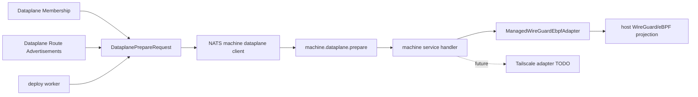

# Refactor Dataplane Prepare Adapters Plan

## Summary

Refactor the current WireGuard/eBPF-specific dataplane preparation path into a provider-neutral Dataplane Prepare seam shaped around Dataplane Membership and Dataplane Route Advertisement. The first implemented adapter remains the existing managed WireGuard/eBPF path, but the deploy worker stops assembling a WireGuard peer graph as the outer contract. Tailscale is captured as a future docs-only adapter TODO, with its security and lifecycle shape documented, but no Tailscale install, authentication, route advertisement implementation, Cloud integration, API calls, or selectable provider is added in this implementation.

This is an alpha schema refactor. Prefer clear generic names over compatibility shims unless a live consumer proves the old `wireguard_ebpf` names still need a migration window.

## Problem

The current networking code makes WireGuard/eBPF the outer product concept:

- Core operation stages, failures, evidence, events, and SDK exports use WireGuard/eBPF names.
- Machine-scoped RPC subjects and protocol types expose `wireguard_ebpf.prepare`.
- The deploy worker builds a WireGuard/eBPF request to discover target machines for endpoint network setup.
- The deploy command carries `wireguard_peer_endpoints`, and the NATS machine client expands them into a WireGuard peer graph before final prepare.
- `crates/ployzd/src/dataplane_runtime.rs` mixes adapter behavior, host command planning, public-key reads, route programming, peer programming, and evidence mapping in one large module.
- Tests and generated SDK types pin the provider-specific names as product vocabulary.

That shape makes a future Tailscale data-plane adapter look like a second special case instead of another provider behind the same operation boundary. Tailscale's better shape is membership plus route advertisement: machines join a mesh, advertise reachable routes, and produce evidence that the data-plane intent is usable.

## Goals

1. Make Dataplane Prepare the outer operation seam.
2. Make Dataplane Membership and Dataplane Route Advertisement the generic adapter contract.
3. Keep managed WireGuard/eBPF behavior equivalent to today's behavior.
4. Move WireGuard/eBPF details, including public-key exchange and peer graph assembly, behind the managed adapter.
5. Keep direct TLS NATS as the control-plane path and leave `ployz-transport` out of scope.
6. Make the code easy to extend with a future Tailscale adapter without adding a fake unimplemented provider today.
7. Preserve explicit operations, bounded work, visible progress, and typed failure evidence.
8. Keep security-sensitive material adapter-private and out of KV/events/logs.

## Non-Goals

- Implementing Tailscale.
- Adding a Tailscale config knob, active enum variant, CLI flag, or env var.
- Installing or supervising `tailscaled`.
- Creating Tailscale auth keys, OAuth clients, tags, ACLs, routes, route approvals, MagicDNS records, or tailnet devices.
- Changing Ployz control-plane connectivity from direct TLS NATS.
- Moving live Dataplane Projection into keeper.
- Adding a standalone Dataplane Host Preparation operation.
- Replacing bounded deploy-time machine calls with a controller/watch-only architecture in this refactor.
- Adding background loops that mutate cluster truth without an operation owner.
- Rewriting Docker, gateway, DNS, or eBPF internals beyond names and adapter boundaries required by this refactor.

## Requirements

- R1. External deploy operation language says "dataplane prepare", not "WireGuard/eBPF", except inside the managed WireGuard/eBPF adapter payloads and evidence.
- R2. Current managed WireGuard/eBPF runtime behavior remains equivalent: interface provisioning, peer programming, endpoint route programming, eBPF readiness, evidence, timeout behavior, and failure classification are preserved.
- R3. `DataplanePrepareRequest` carries an operation-derived provider-neutral target machine set, dataplane membership, and route advertisements. It does not expose a WireGuard peer graph as the outer contract.
- R4. Managed WireGuard/eBPF owns any required translation from membership and route advertisements into public-key reads, peers, routes, interface setup, and eBPF attachment.
- R5. Endpoint network setup derives target machines from the provider-neutral request/target set, not by constructing a WireGuard-specific request.
- R6. Machine-scoped RPC exposes a generic dataplane endpoint and generic request/response names. Provider-specific phases are internal to the provider request payload or machine client implementation.
- R7. Core operation stages, failures, events, and evidence use generic dataplane names at the outer surface and provider-specific variant data where needed.
- R8. SDK exports and generated TypeScript types match the generic surface and still expose the managed WireGuard/eBPF evidence variant.
- R9. Runtime code is split so managed WireGuard/eBPF has its own adapter module and route/command helpers are not mixed into a single top-level file.
- R10. The adapter seam does not expose a public/core `Tailscale` variant, config value, CLI flag, env var, SDK type, or operation payload until there is a real implementation and acceptance coverage.
- R11. No private WireGuard key bytes, future Tailscale auth material, OAuth secret, or machine key material is written into operation events, KV state, generated SDK fixtures, or test snapshots.
- R12. This refactor does not add a durable dataplane membership store or durable route advertisement registry. Membership and route advertisements are derived for one operation attempt from existing machine truth and observations.
- R13. Generic dataplane membership and route advertisements support IPv4 and IPv6 endpoint subnets through a typed CIDR value. The current managed WireGuard/eBPF adapter may reject IPv6 with a typed unsupported-address-family failure until eBPF route programming supports it.
- R14. Ployz DNS remains the route-binding DNS authority. MagicDNS is optional tailnet machine-name DNS for future Tailscale use and is not a replacement backend for Ployz route bindings.
- R15. Public endpoint requirements are provider-specific. Managed WireGuard/eBPF can require public endpoint observations in its provider input; generic Dataplane Membership must not require public IPs.

## High-Level Design

Use Dataplane Prepare as the deploy-operation seam. The deploy worker asks target machines to make dataplane projection usable for one operation attempt through bounded operation-owned NATS machine calls. The request is expressed as target machines, operation-derived dataplane membership, and operation-derived route advertisements. The machine-local projection remains eventually consistent and non-authoritative; these calls request or verify projection work for one deploy attempt rather than making dataplane state cluster truth.

Membership and route advertisements are not new durable cluster truth. For this refactor they are computed for the deploy attempt from existing durable machine identity, Machine Endpoint Subnet assignment, machine lifecycle/authority, and fresh provider/machine observations as needed. If a future Tailscale adapter needs provider-side approval or tailnet state, that belongs in the Tailscale adapter design, not in a new generic core registry now.

Use a typed CIDR for Machine Endpoint Subnets at the generic dataplane seam. The idiomatic Rust shape is a newtype around `ipnet::IpNet`, serialized as a string for public schemas. Public machine endpoints remain `SocketAddr`, which already supports IPv4 and IPv6. The generic dataplane model should not be IPv4-only just because the current managed WireGuard/eBPF route path is IPv4-only.

DNS stays separate from mesh membership. The existing Ployz DNS role projects route-binding DNS from active route state, gateway observations, and machine public IP observations, and it already handles A and AAAA answers. Future Tailscale/MagicDNS support should treat MagicDNS as optional tailnet machine-name DNS and possibly document split DNS pointing to Ployz DNS over the tailnet. MagicDNS should not become the Ployz route-binding DNS backend.

The first adapter is the existing managed WireGuard/eBPF implementation. Its job is to translate the generic membership and route-advertisement model plus provider-specific public endpoint input into WireGuard public-key reads, peer configuration, endpoint routes, interface setup, and eBPF forwarding. Future Tailscale can map the same generic model to tailnet device enrollment and advertised routes without making the deploy worker understand Tailscale mechanics or public IP observations.

Public and domain-facing names should use Machine language. Existing `machine` module paths and `MachineId`-named code are implementation naming debt and should only appear in this plan when referring to current files or current types that the refactor touches.



Core owns typed request, response, provider, evidence, and failure shapes. `ployzd` owns adapter traits and process wiring. `ployz-transport` remains reserved for future private control-plane connectivity and is not used for this dataplane refactor.

The concrete model should look roughly like this, adjusted to the surrounding code while implementing:

```rust
pub struct DataplanePrepareRequest {
    pub operation_id: OperationId,
    pub target_machines: Vec<MachineId>,
    pub membership: Vec<DataplaneMember>,
    pub route_advertisements: Vec<DataplaneRouteAdvertisement>,
    pub provider: DataplanePrepareProviderRequest,
}

pub struct DataplaneMember {
    pub machine_id: MachineId,
    pub endpoint_subnet: MachineEndpointSubnet,
}

pub struct MachineEndpointSubnet(ipnet::IpNet);

pub struct DataplaneRouteAdvertisement {
    pub advertiser: MachineId,
    pub reachable_subnets: Vec<MachineEndpointSubnet>,
}

pub enum DataplanePrepareProviderRequest {
    ManagedWireGuardEbpf(ManagedWireGuardEbpfPrepareInput),
}

pub struct ManagedWireGuardEbpfPrepareInput {
    pub public_endpoints: Vec<ManagedWireGuardEndpoint>,
}

pub struct ManagedWireGuardEndpoint {
    pub machine_id: MachineId,
    pub public_endpoint: SocketAddr,
}

pub enum DataplanePrepareProviderReport {
    ManagedWireGuardEbpf(ManagedWireGuardEbpfPrepareReport),
}
```

Do not add `DataplanePrepareProviderRequest::Tailscale`, generated SDK Tailscale types, config values, env vars, CLI flags, or operation payloads until the adapter can be constructed, applied, observed, and tested end to end. The future Tailscale shape belongs in docs/TODOs for now.

## Proposed Module Shape

Split the large runtime module into a folder:

```text
crates/ployzd/src/dataplane_runtime/
  mod.rs
  command.rs
  managed_wireguard_ebpf.rs
  managed_wireguard_routes.rs
```

Suggested responsibilities:

- `mod.rs`: public exports, `DataplanePreparer` implementation wrapper, shared runtime config types.
- `command.rs`: bounded command plan execution, timeout/error/evidence conversion helpers that are genuinely shared by the implemented adapter.
- `managed_wireguard_ebpf.rs`: membership-to-peer translation, WireGuard interface, public key, peers, eBPF readiness, and adapter-specific report assembly.
- `managed_wireguard_routes.rs`: current endpoint route programming formerly in `host_routes.rs`.

If the split becomes too mechanical, land it in two passes: first rename the seam while keeping behavior stable, then split the runtime module.

## Key Technical Decisions

- KTD1. The public operation concept is `DataplanePrepare`; `ManagedWireGuardEbpf` is an adapter/provider behind that concept.
- KTD2. The adapter contract is Dataplane Membership plus Dataplane Route Advertisement, not deploy-time peer programming.
- KTD3. Keep generic Dataplane Membership clean. Provider-specific facts such as WireGuard public endpoints live in provider input, not on the generic member.
- KTD4. Put adapter traits in `ployzd`, not `ployz-core`. Core defines data. `ployzd` wires behavior.
- KTD5. Use enum variants in core schemas, not trait objects or dynamic registries. This keeps public API and TypeScript export shapes explicit.
- KTD6. Keep WireGuard public-key exchange and peer graph assembly inside the managed WireGuard/eBPF adapter client path. The deploy worker should not know that this provider needs public keys before final projection.
- KTD7. Rename alpha subjects and serialized strings to generic dataplane names now. Compatibility shims are not planned unless a live consumer requires one.
- KTD8. Keep Tailscale docs-only until the implementation exists. Invalid or non-working cluster configuration should be unrepresentable.
- KTD9. Keep Dataplane Host Preparation as the keeper/substrate concern defined by the existing host-prep plan. Live projection remains `ployzd` for this refactor.
- KTD10. Membership and route advertisements are operation-derived views, not durable core registries.
- KTD11. Use a typed dual-stack CIDR newtype for Machine Endpoint Subnet in core schemas. Adapter capability decides whether IPv6 is currently accepted.
- KTD12. Keep Ployz route-binding DNS and Tailscale MagicDNS separate. MagicDNS may help users resolve machines on a tailnet; Ployz DNS continues to serve route bindings.
- KTD13. Public endpoints are provider input. Managed WireGuard/eBPF may require them; future Tailscale should not.

## Implementation Units

### U1. Core Dataplane Models And Operation Language

- **Goal:** Move outer operation/request/evidence language from WireGuard/eBPF to provider-neutral dataplane membership and route advertisement.
- **Files:** `crates/ployz-core/src/dataplane.rs`, `crates/ployz-core/src/ops.rs`, `crates/ployz-core/src/subjects.rs`, `crates/ployz-core/Cargo.toml`, any split operation modules under `crates/ployz-core/src/ops/`.
- **Approach:** Introduce `DataplanePrepareRequest`, `DataplaneMember`, `DataplaneRouteAdvertisement`, `DataplanePrepareReport`, `DataplaneMachinePrepared`, `MachineEndpointSubnet`, and provider report/request enums with a `ManagedWireGuardEbpf` variant. Add `ipnet` to `ployz-core` and model `MachineEndpointSubnet` as a validated dual-stack CIDR newtype serialized as a string. Do not add a durable membership/advertisement store. Keep `WireGuardPeer`, `WireGuardPeerEndpoint`, WireGuard public-key, and eBPF evidence types only inside the managed WireGuard/eBPF provider module or variant data. Rename deploy running stage and failure/event constructors to `PreparingDataplane`, `DataplanePrepared`, `DataplaneUnavailable`, `DataplanePrepareTimedOut`, and `DataplanePrepareInvalidReport` style names, with provider/component details inside variant data.
- **Tests:** Core tests cover target-machine derivation, IPv4/IPv6 CIDR parsing and serialization, membership and route advertisement validation, provider report validation, operation event projection, serialized stage/failure/event names, and exhaustive provider matching.
- **Verification:** `cargo test -p ployz-core`.

### U2. Deploy Worker Seam

- **Goal:** Make deploy execution call a generic dataplane preparer and stop using WireGuard-specific request construction as a side channel.
- **Files:** `crates/ployzd/src/deploy_worker.rs`, `crates/ployzd/src/deploy_worker/ports.rs`, `crates/ployzd/src/deploy_worker/types.rs`, `crates/ployzd/src/deploy_worker/failure.rs`, `crates/ployzd/tests/deploy_operation.rs`, `crates/ployzd/tests/deploy_command_preparation.rs`, `crates/ployz-e2e/tests/operations.rs`.
- **Approach:** Rename `WireGuardEbpfPreparer` to `DataplanePreparer`. Remove `wireguard_peer_endpoints` from `DeployExecutionCommand` as an outer deploy-worker concern. Add helpers that produce target machines, membership, and route advertisements from the deploy plan and machine endpoint subnet assignments. Load public endpoint observations only to populate `ManagedWireGuardEbpfPrepareInput`; keep missing-public-endpoint errors classified as managed WireGuard/eBPF provider failures. Build one provider-neutral `DataplanePrepareRequest` and pass it to the port. Map prepare timeout/unavailable/invalid-report failures to generic dataplane failures carrying provider/component context.
- **Tests:** Deploy operation tests expect `PreparingDataplane` and `DataplanePrepared` style events. Command-preparation tests verify endpoint networks use the same target machine set and Machine Endpoint Subnets as the dataplane prepare request. Tests should fail if generic membership requires public IPs or if the deploy worker constructs `WireGuardPeer` or `WireGuardPeerEndpoint` directly.
- **Verification:** `cargo test -p ployzd deploy_operation deploy_command_preparation`.

### U3. Machine-Scoped RPC And NATS Client Adapter

- **Goal:** Make machine-scoped RPC generic while keeping managed WireGuard/eBPF's public-key collection and peer graph assembly inside the adapter client.
- **Files:** `crates/ployzd/src/machine/protocol.rs`, `crates/ployzd/src/machine/client.rs`, `crates/ployzd/src/machine/service.rs`, `crates/ployzd/tests/machine_rpc.rs`, `crates/ployz-core/src/subjects.rs`.
- **Approach:** Rename the current `NodeWireGuardEbpfPrepareRpcRequest/Response` surface to a machine/dataplane prepare request/response surface. If the broader `MachineServiceEndpoint` type remains until the future machine rename, use `MachineServiceEndpoint::DataplanePrepare` as a temporary implementation name only. Replace subject string `wireguard_ebpf.prepare` with a generic dataplane prepare subject. The NATS adapter translates generic membership, route advertisements, and managed WireGuard/eBPF public endpoint input into provider payloads, including public-key reads and peer graph construction. Reuse the same bounded request/response and error mapping style as other machine-scoped RPCs where practical.
- **Tests:** Machine RPC tests prove single-machine and multi-machine prepare still call public-key reads before final managed WireGuard/eBPF prepare, missing responders map to generic dataplane unavailable failures, subject lookup uses the new endpoint, and the deploy-worker-facing request contains no WireGuard peer graph.
- **Verification:** `cargo test -p ployzd machine_rpc`.

### U4. Runtime Adapter Split

- **Goal:** Make the implemented adapter obvious and keep host command mechanics separate from product-level dataplane naming.
- **Files:** `crates/ployzd/src/dataplane_runtime.rs`, `crates/ployzd/src/dataplane_runtime/host_routes.rs`, new files under `crates/ployzd/src/dataplane_runtime/`, `crates/ployzd/tests/wireguard_dataplane.rs`.
- **Approach:** Move current `HostWireGuardEbpfPreparer` behavior into a `ManagedWireGuardEbpfDataplaneAdapter` or similarly clear type. Preserve command plans and evidence semantics. Move route programming to `managed_wireguard_routes.rs`. Make the adapter consume route advertisements or the adapter-owned provider payload derived from them, then translate to current WireGuard/eBPF route and peer programming internally. Keep shared command execution helpers small and adapter-driven. Validate IPv6 route advertisements as an unsupported address family for this adapter until `ployz-ebpf-ctl` and route keys support IPv6.
- **Tests:** Existing WireGuard dataplane tests move or rename only as needed and prove identical command plans, route programming, peer programming, evidence, and failure behavior. Add adapter tests for translating membership plus route advertisements into the same peer/route commands the old path produced, and for rejecting IPv6 route advertisements with a typed managed WireGuard/eBPF unsupported-family failure.
- **Verification:** `cargo test -p ployzd wireguard_dataplane`.

### U5. Config And Process Wiring

- **Goal:** Make machine process config provider-ready without adding a selectable second provider.
- **Files:** `crates/ployzd/src/config.rs`, `crates/ployzd/src/machine/process.rs`, keeper role/env rendering tests if they mention dataplane env names, including `crates/ployz-keeper/tests/bootstrap_script.rs` and related bootstrap fixtures.
- **Approach:** Group current WireGuard/eBPF process config under a managed provider config shape while preserving current env names unless there is a strong reason to break them. Keep eBPF artifact paths and WireGuard interface/private-key paths inside managed WireGuard/eBPF config, not generic machine artifacts. Wire the machine-scoped service with the generic `DataplanePreparer` port backed by the managed adapter.
- **Tests:** Config tests verify default and overridden env values still produce the same runtime behavior. Keeper tests verify rendered role environments still include the required managed WireGuard/eBPF material and no Tailscale envs.
- **Verification:** `cargo test -p ployzd config` and focused keeper bootstrap/env tests.

### U6. SDK Types, Generated Types, And Docs

- **Goal:** Make public exported types and operator docs match the new generic seam.
- **Files:** `crates/ployz-sdk-types/src/lib.rs`, `crates/ployz-sdk-types/src/typescript.rs`, `crates/ployz-sdk-types/tests/exports.rs`, `packages/ployz-sdk/src/generated.ts`, `docs/architecture/nats-control-plane.md`, `docs/architecture/jetstream-data-audit.md`, `docs/operations/release.md`, `docs/operations/dind-e2e.md`.
- **Approach:** Export generic dataplane prepare, membership, route advertisement, typed CIDR, report, event, and failure types plus managed WireGuard/eBPF provider evidence. Regenerate TypeScript using the existing repo process. Update current docs to say `ployzd` performs Dataplane Projection through Dataplane Membership and Dataplane Route Advertisements, with managed WireGuard/eBPF as the only implemented adapter. Document that Ployz DNS serves route bindings and MagicDNS is only optional tailnet machine-name DNS for future Tailscale integration. Keep historical `wireguard_ebpf` references only in prior dated plans or changelog context.
- **Tests:** SDK export test snapshots cover generic membership/route advertisement names, CIDR string exports, and provider variant shape.
- **Verification:** `cargo test -p ployz-sdk-types` and any repo script that verifies generated TypeScript is current.

### U7. Deferred Tailscale Adapter TODO

- **Goal:** Capture enough future shape to avoid painting the adapter seam into a corner, without adding dead code.
- **Files:** Add or update an architecture doc such as `docs/architecture/dataplane-adapters.md`; this plan is the initial TODO source if no doc is added during implementation.
- **Approach:** Document Tailscale as a future Dataplane Prepare adapter that maps Dataplane Membership to tailnet device participation and Dataplane Route Advertisements to advertised subnet/app connector routes. Capture these likely responsibilities:
  - Authenticate machines using short-lived or tagged auth material issued from a Cloud Bootstrap Invite flow.
  - Prefer non-reusable auth material where possible; if reusable keys are needed for churn, keep them in a vault-like Cloud boundary, not machine config or operation state.
  - Decide whether machines are ephemeral or stable based on whether changing tailnet identity/IP is acceptable for that machine role.
  - Advertise endpoint subnets or connector routes with explicit route-approval and ACL/tag ownership semantics.
  - Emit operation evidence for daemon readiness, identity, route advertisement, and tailnet reachability without logging secrets.
  - Keep NATS credentials and subject permissions as Ployz authority; Tailscale is only the data-plane mesh.
  - Treat MagicDNS as optional tailnet machine-name DNS. Route bindings continue to use Ployz DNS; split DNS to Ployz DNS over the tailnet can be a future operator-facing integration.
  - Do not require machine public IP observations for basic mesh membership; NAT traversal and tailnet identity are adapter concerns.
- **Prior art to reference:** Tailscale's Kubernetes Operator uses Connector resources for subnet routers/exit nodes/app connectors, egress proxies for cluster-to-tailnet access, ProxyGroup for HA, workload identity federation for secret reduction, auth keys for automated machine registration, and ephemeral nodes for churn-heavy infrastructure.
- **Verification:** Docs state that Tailscale is not selectable yet and no repo search finds active `PLOYZ_TAILSCALE_*` config, Tailscale SDK exports, Tailscale operation payloads, or unimplemented provider branches.

## System-Wide Impact

- **Control plane:** unchanged. Product commands still use direct TLS-authenticated NATS.
- **Dataplane model:** new generic membership and route advertisement types replace WireGuard peer graph construction at the deploy-worker boundary.
- **Address families:** generic subnet types become dual-stack; managed WireGuard/eBPF remains IPv4-only until the eBPF route path supports IPv6.
- **Provider facts:** public endpoints move out of generic membership and into managed WireGuard/eBPF provider input.
- **DNS:** Ployz route-binding DNS remains separate from Tailscale MagicDNS.
- **Operations:** deploy progress and failures get generic dataplane prepare names, with provider details inside evidence.
- **Machine-scoped services:** one subject rename and protocol rename from WireGuard/eBPF to dataplane.
- **SDK/API:** generated public type names change. This is acceptable for alpha if all downstream packages are updated together.
- **Runtime:** managed WireGuard/eBPF remains the only implemented adapter.
- **Keeper:** host preparation boundary stays intact. Any keeper changes are env/config naming alignment only.
- **Security:** the refactor should reduce accidental provider leakage into operation state and make future Tailscale secret handling explicit.

## Acceptance Expectations

- AE1. A normal deploy records generic dataplane prepare running and completion events while preserving managed WireGuard/eBPF evidence.
- AE2. Missing machine responders or runtime command failures map to generic dataplane failures that still identify the managed WireGuard/eBPF component that failed.
- AE3. Endpoint network preparation uses the same target machine set as dataplane prepare.
- AE4. Machine RPC tests prove the managed WireGuard/eBPF adapter still performs public-key collection and peer graph assembly before final prepare.
- AE5. SDK exports and generated TypeScript no longer expose WireGuard/eBPF as the top-level operation/event/failure language.
- AE6. Repo search finds no active Tailscale config, env vars, SDK exports, API calls, operation payloads, or unimplemented provider variant.
- AE7. Existing privileged WireGuard/eBPF proof still passes after renames and module split.
- AE8. `DeployExecutionCommand` and generic `DataplanePrepareRequest` contain no `WireGuardPeer` or `WireGuardPeerEndpoint`; those types are adapter-owned.
- AE9. No new durable KV bucket, stream, or Object Store collection is added for dataplane membership or route advertisements.
- AE10. `MachineEndpointSubnet` accepts valid IPv4 and IPv6 CIDRs and rejects invalid strings; managed WireGuard/eBPF rejects IPv6 route advertisements with a typed unsupported-family failure.
- AE11. Docs state that MagicDNS is optional tailnet machine-name DNS and not the route-binding DNS backend.
- AE12. Generic `DataplaneMember` has no public endpoint field. Missing public IP observations are managed WireGuard/eBPF provider failures, not generic dataplane membership failures.

## Risks And Mitigations

- **Large rename churn:** Land in compiler-driven slices: core models, deploy worker, machine-scoped RPC, runtime split, SDK/docs. Keep behavior changes separate from file moves where possible.
- **Generated SDK drift:** Run SDK generation and export tests in the same unit that changes core public types.
- **Subject compatibility:** This plan treats alpha subjects as breakable. If a live cluster must be migrated, add a short-lived alias service for old `wireguard_ebpf.prepare` before shipping.
- **One-variant enum discomfort:** The provider enum will have one constructible variant for now. That is intentional because the user-requested adapter seam is real, while Tailscale is not implemented.
- **Security regression by generic naming:** Keep provider-specific failure context in typed variant data so operators still see which component failed.
- **Runtime split hiding behavior changes:** Move tests before or during the split and compare command-plan assertions before changing names.
- **Overfitting to Tailscale:** Keep Dataplane Membership and Dataplane Route Advertisement provider-neutral. Do not introduce tailnet-specific terms into core until the Tailscale adapter is real.
- **IPv6 surface before IPv6 implementation:** Support IPv6 in generic types while making current adapter rejection explicit and typed. Do not silently drop IPv6 route advertisements.
- **DNS confusion:** Keep route-binding DNS, Ployz DNS process behavior, and MagicDNS documented as separate planes.

## Verification Plan

Run focused tests after each slice:

```text
cargo test -p ployz-core
cargo test -p ployzd machine_rpc
cargo test -p ployzd deploy_operation deploy_command_preparation
cargo test -p ployzd wireguard_dataplane
cargo test -p ployz-sdk-types
```

Then run broader checks:

```text
cargo test --workspace
bash scripts/local-dataplane-proof.sh
```

The local dataplane proof is still the real behavior check for the managed WireGuard/eBPF adapter.

## Sources And Context

- `VISION.md`: Ployz is explicit operation orchestration; direct TLS NATS is the v1 control plane.
- `CONTEXT.md`: Dataplane Projection is machine-local application into WireGuard/eBPF/routes, driven by watches or bounded operation-owned NATS machine calls; host preparation is a separate bounded substrate step.
- `docs/architecture/nats-control-plane.md`: NATS credentials and subject permissions remain the authority boundary.
- `docs/adr/0013-v1-uses-direct-tls-nats.md`: v1 machine connectivity uses direct TLS NATS; private overlay transport is deferred.
- `docs/plans/2026-06-22-001-refactor-dataplane-host-prep-plan.md`: keeper owns Dataplane Host Preparation; live projection remains separate.
- Tailscale Kubernetes Operator Connector docs: https://tailscale.com/docs/kubernetes-operator/connector
- Tailscale Kubernetes Operator Egress docs: https://tailscale.com/docs/kubernetes-operator/egress
- Tailscale Kubernetes Operator HA docs: https://tailscale.com/docs/kubernetes-operator/manage-and-configure/high-availability
- Tailscale Workload Identity Federation docs: https://tailscale.com/docs/kubernetes-operator/manage-and-configure/workload-identity-federation
- Tailscale auth key docs: https://tailscale.com/docs/features/access-control/auth-keys
- Tailscale ephemeral machine docs: https://tailscale.com/docs/features/ephemeral-nodes

## Suggested Execution Order

1. Land U1 and U2 together so operation language and deploy-worker seam compile against each other.
2. Land U3 to complete the generic machine-scoped RPC boundary.
3. Land U4 as a runtime file split with behavior-preserving tests.
4. Land U5 to clean up config/process wiring after names settle.
5. Land U6 to regenerate SDK types and docs.
6. Land U7 as docs-only future Tailscale TODO, or keep this plan as the durable TODO until implementation starts.
