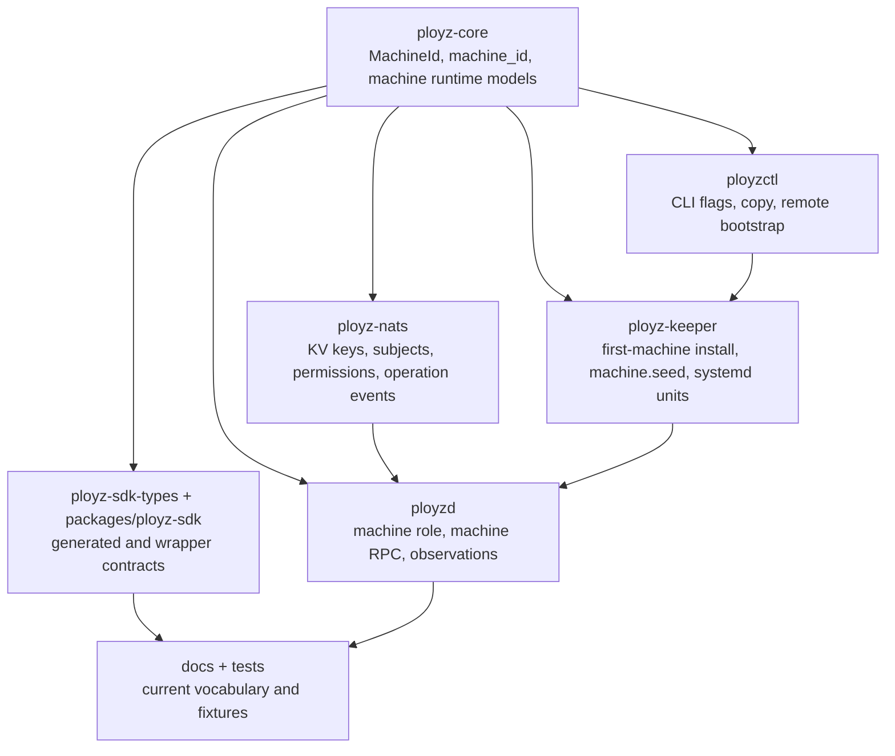

# Refactor Machine Terminology Cutover Plan

## Summary

Replace Ployz domain terminology from `node` to `machine` across code, contracts, generated SDK types, CLI copy, NATS subjects, local credential material, tests, and docs. This is a hard cutover for a greenfield project: no backward compatibility, old `node` aliases, compatibility subjects, parser shims, or deprecation paths are planned.

---

## Problem Frame

`CONTEXT.md` defines **Machine** as the product and control-plane identity for an operator-visible host, with `Node` and `NodeId` listed as avoided terms. The current repository is split: user-facing commands already say `machine`, while core IDs, daemon role names, NATS subjects, principals, fields, fixtures, and several docs still use `node`.

Local research found domain-like `node` usage across 189 files and roughly 4,584 matches before filtering. Some matches are legitimate JavaScript/Node.js platform references in the TypeScript SDK package and must remain untouched. The rest are current product vocabulary debt that should be cut over together so new code does not continue the split model.

---

## Requirements

### Domain Model

- R1. `MachineId` replaces `NodeId` as the typed product/control-plane identity, and `machine_id` replaces `node_id` in serialized Ployz wire contracts.
- R2. Runtime observation, deploy placement, dataplane, operation, active-state, and cleanup models use machine terms without introducing a second host-like entity.
- R3. Test literals and fixtures use machine-shaped values such as `machine_1` and `machine_2`, not `node_1` and `node_2`.

### Contracts And Runtime Surfaces

- R4. NATS API subjects, machine-scoped service subjects, observation subjects, inbox prefixes, and NATS principal authority keys use `machine` tokens.
- R5. The first-cluster bootstrap path becomes first-machine language in API types, subjects, CLI commands, keeper commands, local result markers, docs, and tests.
- R6. Local credential material uses machine language, including seed file names, env vars, writer names, startup states, and error messages.
- R7. `ployzd` role parsing, process roles, systemd unit names, daemon module names, and RPC protocol names use machine terminology.

### Client And Documentation Surfaces

- R8. `ployzctl`, `ployz-sdk-types`, generated TypeScript, the hand-written TypeScript SDK wrapper, and SDK fixtures expose `MachineId` and `machine_id`.
- R9. Current docs, ADRs, operations docs, repo instructions, and active plans use machine terminology for Ployz concepts.
- R10. Legitimate Node.js platform terms remain unchanged, including `node:test`, `node:fs`, `NodeNext`, `@types/node`, and `@nats-io/transport-node`.

### Hard Cutover

- R11. No backward compatibility is retained: old `node` service subjects, field names, CLI flags, parser aliases, seed-file fallbacks, and generated SDK aliases are removed outright.
- R12. The cutover preserves runtime behavior: deploy planning, operation terminality, NATS permission fencing, machine join, first-machine activation, gateway/DNS auth, and DinD e2e behavior remain equivalent apart from names.

---

## High-Level Technical Design

The cutover should start at the core schema and flow outward. Generated and hand-written clients should consume the renamed Rust contract rather than maintain parallel translations.

| Current term | Target term | Notes |
| --- | --- | --- |
| `NodeId`, `node_id` | `MachineId`, `machine_id` | Product identity, not `MachineName`. |
| `NatsPrincipal::Node` | `NatsPrincipal::Machine` | Gateway and DNS still authenticate as their machine's credential. |
| `plz.v1.svc.node` | `plz.v1.svc.machine` | No alias subject. |
| `plz.v1.obs.node` | `plz.v1.obs.machine` | Observation subjects and KV key names move together. |
| `_INBOX_node_<id>` | `_INBOX_machine_<id>` | Permission tests must prove isolation after the rename. |
| `node.seed` | `machine.seed` | Control writes it at first-machine activation. |
| `ployzd node --id` | `ployzd machine --id` | Systemd units render the new argv. |
| `first-node` | `first-machine` | API, CLI, keeper, tests, docs, and result markers. |

---

## Key Technical Decisions

- KTD1. Hard cutover all Ployz domain contracts. Greenfield status means there is no backward-compatibility mode or legacy-client support.
- KTD2. Keep `MachineId` and `MachineName` distinct. `MachineId` is the identity key for storage, subjects, permissions, placement, and observations; `MachineName` remains display/name data.
- KTD3. Rename canonical Rust contracts first, then regenerate TypeScript. The SDK package should reflect the Rust source of truth, not patch old generated names by hand.
- KTD4. Rename the daemon role to `Machine`, not `Agent` or `Runtime`. The role represents the machine-local RPC/observation process for one Machine.
- KTD5. Rename durable alpha KV key prefixes and subject tokens directly. This plan does not preserve old JetStream data because the repo is greenfield.
- KTD6. Exempt only platform-level Node.js references. A final search gate should distinguish JavaScript runtime imports and package names from Ployz domain vocabulary.
- KTD7. Keep behavior changes out of scope. If implementation exposes a functional bug, fix only what blocks the rename and capture larger behavior work separately.
- KTD8. Treat NATS authorized-user recovery as a contract surface. Recovered principals, generated server config, and reload behavior must use `Machine`, `machine_<id>`, and machine-scoped permissions together.

---

## Scope Boundaries

### In Scope

- Rust identifiers, modules, enum variants, fields, serialized names, subjects, KV keys, principal keys, env vars, seed file names, systemd unit names, CLI flags, CLI output, tests, generated TypeScript, SDK wrapper names, docs, and repo instructions that describe Ployz machines.
- Renaming path names such as `crates/ployz-core/src/node.rs`, `crates/ployzd/src/node/`, `crates/ployzd/tests/node_rpc.rs`, and `docs/operations/two-node-acceptance.md`.
- Updating fixture values and snapshots that use `node_` as a Ployz machine id.

### Out Of Scope

- JavaScript and TypeScript platform names such as `node:test`, `node:fs`, `NodeNext`, package `@types/node`, and transport package `@nats-io/transport-node`.
- Redesigning deploy placement, dataplane projection, machine join, route projection, or operation lifecycle behavior.
- Adding backward-compatibility or migration code for old `node` subjects, old `machine_id` JSON fields, old seed paths, or old CLI aliases.

---

## Implementation Units

### U1. Core Machine Identity And Models

- **Goal:** Make `ployz-core` own Machine as the only host identity term.
- **Requirements:** R1, R2, R3, R12.
- **Dependencies:** None.
- **Files:** `crates/ployz-core/src/ids.rs`, `crates/ployz-core/src/lib.rs`, `crates/ployz-core/src/node.rs`, `crates/ployz-core/src/machine.rs`, `crates/ployz-core/src/deploy.rs`, `crates/ployz-core/src/dataplane.rs`, `crates/ployz-core/src/ops.rs`, `crates/ployz-core/src/ops/events.rs`, `crates/ployz-core/src/ops/classification.rs`, `crates/ployz-core/src/ops/projection.rs`, `crates/ployz-core/src/state.rs`, `crates/ployz-core/tests/deploy_planner.rs`, `crates/ployz-core/tests/machine_lifecycle.rs`, `crates/ployz-core/tests/operation_projection.rs`, `crates/ployz-core/tests/wire_contract.rs`.
- **Approach:** Rename `NodeId` to `MachineId` and convert serialized fields from `node_id` to `machine_id`. Move the old node-facing runtime models into a machine-named module shape without making `machine.rs` an unreadable catch-all. Keep deploy, dataplane, operation, and observation invariants unchanged.
- **Execution note:** Start with contract-focused tests for serialized field names and core operation/event JSON.
- **Patterns to follow:** Existing typed ID newtypes in `crates/ployz-core/src/ids.rs`; exhaustive enum matching and variant-specific data in `crates/ployz-core/src/ops.rs`.
- **Test scenarios:** Serialize a machine-add request/status/event and confirm `machine_id` appears and `node_id` does not; compute deploy target machines from existing and new containers with the same ordering as current target-node logic; validate observation snapshot mismatch errors mention machine ownership; verify TypeScript branding will export `MachineId`.
- **Verification:** Core tests pass, and a core-only search finds no Ployz-domain `NodeId`, `node_id`, `node.rs`, or `node` module export.

### U2. NATS Subjects, State Keys, And Permissions

- **Goal:** Rename control-plane authority and routing surfaces from node to machine.
- **Requirements:** R4, R6, R11, R12.
- **Dependencies:** U1.
- **Files:** `crates/ployz-core/src/subjects.rs`, `crates/ployz-core/src/security.rs`, `crates/ployz-core/src/permissions.rs`, `crates/ployz-core/src/nats_config.rs`, `crates/ployz-core/src/state.rs`, `crates/ployz-core/tests/subjects.rs`, `crates/ployz-core/tests/permissions.rs`, `crates/ployz-core/tests/nats_config.rs`, `crates/ployz-nats/src/bootstrap.rs`, `crates/ployz-nats/src/bootstrap/resources.rs`, `crates/ployz-nats/src/bootstrap/assurance.rs`, `crates/ployz-nats/src/core_state/active_machine.rs`, `crates/ployz-nats/src/core_state/nats_authorized_user.rs`, `crates/ployz-nats/src/observations.rs`, `crates/ployz-nats/src/operations/keys.rs`, `crates/ployz-nats/src/operations/events.rs`, `crates/ployz-nats/src/operations/status_store.rs`, `crates/ployz-nats/src/operations/repository/machine_join.rs`, `crates/ployz-nats/tests/bootstrap.rs`, `crates/ployz-nats/tests/secured_connect.rs`, `crates/ployz-nats/tests/observations_nats.rs`, `crates/ployz-nats/tests/core_state_nats.rs`, `crates/ployz-nats/tests/operations_nats/machine_add_submission.rs`, `crates/ployz-nats/tests/operations_nats/machine_join.rs`, `crates/ployz-nats/tests/operations_nats/evidence_rejection.rs`.
- **Approach:** Rename machine-scoped service and observation constructors, subject constants, principal variants, authority keys, inbox prefixes, KV observation prefixes, and permission helpers together. Keep the same publish/subscribe fencing and KV read/write scope semantics.
- **Patterns to follow:** Centralized subject construction in `crates/ployz-core/src/subjects.rs`; permission rendering from `NatsPermissionProfile::render`; current corruption checks in NATS-backed state stores.
- **Test scenarios:** Machine principal renders `machine_<id>` authority keys and parses them back; recovered NATS authorized users preserve machine principal identity after config reload; machine inbox scope is isolated from user/join/system and other machine inboxes; machine credentials can publish only their own observations; controller can publish machine service requests; old `plz.v1.svc.node`, `plz.v1.obs.node`, `_INBOX_node`, and `node_<id>` authority keys are absent from contract tests and not accepted by recovery parsing.
- **Verification:** NATS subject and permission tests prove the renamed subjects and deny scopes, with no old domain tokens accepted.

### U3. `ployzd` Machine Runtime And RPC Cutover

- **Goal:** Rename the daemon's machine-local runtime and RPC seam without changing behavior.
- **Requirements:** R2, R4, R6, R7, R12.
- **Dependencies:** U1, U2.
- **Files:** `crates/ployzd/src/lib.rs`, `crates/ployzd/src/role.rs`, `crates/ployzd/src/config.rs`, `crates/ployzd/src/node_credentials.rs`, `crates/ployzd/src/node/`, `crates/ployzd/src/services.rs`, `crates/ployzd/src/nats_authorization.rs`, `crates/ployzd/src/nats_authorization/node_seed.rs`, `crates/ployzd/src/nats_authorization/writer.rs`, `crates/ployzd/src/nats_authorization/mint.rs`, `crates/ployzd/src/nats_authorization/reload.rs`, `crates/ployzd/src/deploy_worker.rs`, `crates/ployzd/src/deploy_worker/ports.rs`, `crates/ployzd/src/deploy_worker/preparation.rs`, `crates/ployzd/src/deploy_worker/failure.rs`, `crates/ployzd/src/deploy_worker/facts.rs`, `crates/ployzd/src/dataplane_runtime.rs`, `crates/ployzd/tests/node_rpc.rs`, `crates/ployzd/tests/node_service_runtime.rs`, `crates/ployzd/tests/node_runtime.rs`, `crates/ployzd/tests/node_agent.rs`, `crates/ployzd/tests/machine_add_mint.rs`, `crates/ployzd/tests/deploy_operation.rs`, `crates/ployzd/tests/deploy_command_preparation.rs`.
- **Approach:** Rename `crates/ployzd/src/node/` to a machine-named module and update protocol, service, client, runner, and process types. Rename `DaemonProcessRole::Node` to `Machine`, `ployzd node --id` to `ployzd machine --id`, and `NodeCredentialState` to machine credential state. Keep existing bounded retry, request timeout, wrong-responder rejection, Docker runner behavior, and deploy worker sequencing.
- **Execution note:** Use characterization tests around current RPC behavior before broad renames in this unit.
- **Patterns to follow:** Shared RPC envelope in `protocol.rs`; request-side wrong-responder checks in `client.rs`; bounded credential startup in `machine_credentials.rs`.
- **Test scenarios:** `ployzd machine --id machine_1` parses to the machine role; old `ployzd node --id` is rejected; machine RPC returns success only when the responder machine id matches the requested machine; missing machine seed enters awaiting-credentials and later succeeds after the seed appears; NATS credential minting writes a machine principal and machine seed; deploy worker failures and retained evidence use machine ids with unchanged failure classes.
- **Verification:** Daemon runtime and RPC tests pass after file/module renames, with no production `ployzd` node role path left.

### U4. Keeper, Bootstrap, And First-Machine Install

- **Goal:** Cut first-machine install and local credential material over to first-machine language.
- **Requirements:** R5, R6, R7, R11, R12.
- **Dependencies:** U1, U2, U3.
- **Files:** `crates/ployz-core/src/install.rs`, `crates/ployz-core/src/roles.rs`, `crates/ployz-keeper/src/cli.rs`, `crates/ployz-keeper/src/steps.rs`, `crates/ployz-keeper/src/steps/nats_material.rs`, `crates/ployz-keeper/src/systemd.rs`, `crates/ployz-keeper/src/nats_identity.rs`, `crates/ployz-keeper/src/report.rs`, `crates/ployz-keeper/tests/bootstrap.rs`, `crates/ployz-keeper/tests/bootstrap_artifacts.rs`, `crates/ployz-keeper/tests/bootstrap_first_machine.rs`, `crates/ployz-keeper/tests/bootstrap_join.rs`, `crates/ployz-keeper/tests/bootstrap_executor.rs`, `crates/ployz-keeper/tests/bootstrap_script.rs`, `crates/ployz-keeper/tests/local.rs`, `crates/ployz-keeper/tests/support/bootstrap.rs`, `crates/ployz-keeper/tests/systemd.rs`, `crates/ployzctl/src/bootstrap_command.rs`, `crates/ployzctl/src/keeper_install.rs`.
- **Approach:** Rename `FirstNodeInstallSpec`, first-node process sets, keeper command `first-node-install`, bootstrap result markers, role environment values, and systemd unit expectations to first-machine terms. Rename `node.seed` to `machine.seed`, `PLOYZ_NODE_ID` to `PLOYZ_MACHINE_ID`, `PLOYZ_NODE_PUBLIC_IP` to `PLOYZ_MACHINE_PUBLIC_IP`, `PLOYZ_DEPLOY_NODES` to `PLOYZ_DEPLOY_MACHINES`, and any control-owned seed path env to machine terms. Do not support old command names or env vars.
- **Patterns to follow:** Keeper spec loading through one typed JSON spec; `NatsMachineMaterialPaths` as the single owner of local NATS material paths; `DaemonProcessRole::argv` as the supervisor argv source of truth.
- **Test scenarios:** Keeper accepts `first-machine-install --spec` and rejects `first-node-install`; rendered systemd units use `ployzd machine --id machine_1` and unit names such as `ployzd-machine-machine_1.service`; first-machine install omits `machine.seed` until activation; control writes `machine.seed` with `0600`; gateway and DNS role envs point at the same machine seed; old env vars are not read.
- **Verification:** Keeper bootstrap and systemd tests prove first-machine install and join behavior remain equivalent apart from names.

### U5. Operation API, CLI, And SDK Contracts

- **Goal:** Rename user-facing and SDK-facing contracts in one contract slice.
- **Requirements:** R5, R8, R11, R12.
- **Dependencies:** U1, U2, U4.
- **Files:** `crates/ployz-sdk-types/src/lib.rs`, `crates/ployz-sdk-types/src/operation_api.rs`, `crates/ployz-sdk-types/src/typescript.rs`, `crates/ployz-sdk-types/tests/exports.rs`, `crates/ployz-nats/src/operation_api_client.rs`, `crates/ployzd/src/operation_api/first_machine.rs`, `crates/ployzd/src/operation_api/mod.rs`, `packages/ployz-sdk/src/generated.ts`, `packages/ployz-sdk/src/primitives.ts`, `packages/ployz-sdk/src/index.ts`, `packages/ployz-sdk/src/nats.ts`, `packages/ployz-sdk/test/fixtures/operation-contract.json`, `packages/ployz-sdk/test/operations.test.ts`, `packages/ployz-sdk/test/nats-transport.test.ts`, `crates/ployzctl/src/commands.rs`, `crates/ployzctl/src/commands/init.rs`, `crates/ployzctl/src/commands/machine.rs`, `crates/ployzctl/src/commands/logs.rs`, `crates/ployzctl/src/client_ids.rs`, `crates/ployzctl/src/remote_machine_runtime.rs`, `crates/ployzctl/src/runtime.rs`, `crates/ployzctl/tests/cli_contract.rs`, `crates/ployzctl/tests/init_binary_nats.rs`, `crates/ployzctl/tests/machine_add_binary_nats.rs`, `crates/ployzctl/tests/machine_cli_contract.rs`, `crates/ployzctl/tests/machine_remote_nats.rs`.
- **Approach:** Rename operation API structs and endpoint registry entries such as first-machine activation, request/response fields, SDK helper functions, transport methods, CLI command variants, CLI flags, and rendered output. Regenerate `packages/ployz-sdk/src/generated.ts` from `ployz-sdk-types` and update the hand-written wrapper to expose `machineId`, not `nodeId`.
- **Patterns to follow:** Operation API contract registry in `crates/ployz-sdk-types/src/operation_api.rs`; generated TypeScript equality test in `crates/ployz-sdk-types/tests/exports.rs`; CLI output renderers in `crates/ployzctl/src/commands/machine.rs`.
- **Test scenarios:** `machine add` returns a handle with `machineId`; `machine inspect` sends `{ machine_id }`; first-machine activation endpoint subject and method names use first-machine terms; logs tail optional machine id serializes as `machine_id`; old SDK `nodeId` helpers and request fields fail TypeScript tests; CLI output says `machine`, not `node`.
- **Verification:** Rust SDK export tests and TypeScript SDK tests agree with the regenerated contract and fixtures.

### U6. E2E Harness, Test Support, And Fixture Sweep

- **Goal:** Make acceptance tests and shared test helpers enforce the new vocabulary.
- **Requirements:** R3, R7, R10, R11, R12.
- **Dependencies:** U1, U2, U3, U4, U5.
- **Files:** `crates/ployz-test-support/src/ids.rs`, `crates/ployz-test-support/src/nats.rs`, `crates/ployz-e2e/tests/dind_cluster.rs`, `crates/ployz-e2e/tests/operations.rs`, `crates/ployz-e2e/tests/support/dind/formation.rs`, `crates/ployz-e2e/tests/support/dind/assert.rs`, `crates/ployz-e2e/tests/support/dind/join.rs`, `crates/ployzd/tests/support/node.rs`, `crates/ployzd/tests/support/mod.rs`, `crates/ployzd/tests/machine_rpc.rs`, `crates/ployzd/tests/machine_service_runtime.rs`, `crates/ployzd/tests/machine_runtime.rs`, `crates/ployzd/tests/machine_agent.rs`, `packages/ployz-sdk/test/fixtures/operation-contract.json`.
- **Approach:** Rename test helper constructors to `machine_id`, change fixture ids to `machine_1` / `machine_2`, rename support modules and test files, and update DinD scenario names and assertions. Keep Node.js test imports in TypeScript untouched.
- **Patterns to follow:** Test literal constructors in `crates/ployz-test-support/src/ids.rs`; DinD evidence and scenario structure in `crates/ployz-e2e/tests/dind_cluster.rs`.
- **Test scenarios:** DinD formation activates the first machine and joins an edge machine with machine-named units and credentials; auth rejection proves a machine credential cannot access another machine's service scope or inbox; operation replay fixtures contain `machine_id` only; TypeScript tests still import `node:test` and pass.
- **Verification:** Workspace tests and package tests pass, and the e2e harness names current scenarios in machine language.

### U7. Documentation And Repository Search Gate

- **Goal:** Make current repository text match the Machine vocabulary and prevent regression.
- **Requirements:** R9, R10, R11.
- **Dependencies:** U1, U2, U3, U4, U5, U6.
- **Files:** `AGENTS.md`, `VISION.md`, `CONTEXT.md`, `README.md`, `docs/architecture/backbone.md`, `docs/architecture/nats-control-plane.md`, `docs/architecture/jetstream-data-audit.md`, `docs/architecture/cloud-bootstrap.md`, `docs/operations/dind-e2e.md`, `docs/operations/release.md`, `docs/operations/two-node-acceptance.md`, relevant `docs/adr/*.md`, relevant `docs/plans/*.md`, `packages/ployz-sdk/package.json`, `packages/ployz-sdk/pnpm-lock.yaml`, `packages/ployz-sdk/tsconfig.json`.
- **Approach:** Update current product, architecture, operations, and repo-instruction prose to Machine language. Rename retired docs where their title still teaches `node` vocabulary. Add a lightweight documented search gate or test note that checks for Ployz-domain `node` terms while exempting Node.js platform terms.
- **Patterns to follow:** `CONTEXT.md` preferred-term / avoided-term format; `docs/operations/dind-e2e.md` as the current acceptance-harness doc; existing release verification docs.
- **Test scenarios:** A repo search finds no domain `node` terms outside an explicit allowlist for Node.js platform/tooling references; docs still describe direct TLS NATS, explicit operations, machine join, first-machine activation, and DinD flows accurately; `CONTEXT.md` no longer needs to mention `MachineId` as a current avoided implementation leak.
- **Verification:** Documentation review and search gate show only intentional Node.js/platform matches remain.

---

## Acceptance Examples

- AE1. Given a machine-add request fixture, when it is serialized, then it contains `machine_id` and does not contain `node_id`.
- AE2. Given a machine credential, when it connects to NATS, then its authority key and inbox prefix are machine-scoped and it cannot publish another machine's observations.
- AE3. Given first-machine activation, when control writes local machine credentials, then `machine.seed` appears with private permissions and role processes pick it up without restart.
- AE4. Given `ployzd node --id machine_1`, when the role parser runs after the cutover, then the command is rejected because old role aliases are not retained.
- AE5. Given the TypeScript SDK, when package tests build requests through helper functions, then consumers use `machineId` and the generated payload uses `machine_id`.
- AE6. Given the DinD e2e flow, when a two-machine cluster runs deploy and auth-rejection scenarios, then scenario names, units, operation evidence, and assertions use Machine vocabulary.
- AE7. Given a final repository search, when Node.js platform allowlist entries are excluded, then no Ployz-domain `node` tokens remain.

---

## System-Wide Impact

- **Control-plane contracts:** Operation API subjects, request/response JSON, operation events, generated TypeScript, and SDK wrapper names change without aliases.
- **NATS authorization:** Principal keys, inbox prefixes, and permission scopes change to machine terms; this is a security-sensitive slice because subject fencing must remain exact.
- **Authorization recovery:** NATS authorized-user KV records, rendered server config, and reload logic must not preserve `Node` principal parsing or `machine_<id>` authority names.
- **Runtime process model:** The `ployzd` machine role, systemd unit names, seed paths, and role env vars change together.
- **Persistent alpha state:** KV keys and stream payload field names change. No migration is planned because the project is greenfield.
- **Local credential state:** Existing alpha `node.seed` files are intentionally not consumed by the new runtime; first-machine activation and join produce machine-named seed material.
- **Docs and tests:** Historical-looking docs are still repo artifacts and should stop teaching `node` vocabulary unless the term is a JavaScript platform name.

---

## Risks And Mitigations

- **Partial contract rename:** Changing Rust identifiers without serialized names would leave public consumers on `machine_id`. Mitigation: U1 and U5 include JSON and TypeScript fixture checks.
- **Permission regression:** Renaming NATS subjects can accidentally widen or narrow authority. Mitigation: U2 keeps permission tests focused on allowed and denied publish/subscribe scopes.
- **Recovered authority mismatch:** Server config recovery could keep accepting old `node_<id>` principals even after subjects are renamed. Mitigation: U2 and U3 cover authorized-user recovery, config rendering, reload, and old-key rejection.
- **Generated SDK drift:** Hand-written TypeScript wrappers can lag the generated contract. Mitigation: U5 regenerates types and updates wrapper/tests in the same unit.
- **Stale local credentials:** A lingering `node.seed` could hide an incomplete bootstrap rename. Mitigation: U3 and U4 assert only machine seed paths/env vars are read and old env vars are ignored.
- **Platform false positives:** Blind search/replace can corrupt Node.js package imports and TypeScript compiler settings. Mitigation: U7 uses a domain search gate with explicit Node.js allowlist terms.
- **Large mechanical diff hides behavior changes:** A broad rename can mask unintended logic edits. Mitigation: execute in compiler-driven units and keep behavior assertions from existing tests.
- **Stale docs reintroduce old vocabulary:** Existing plans and ADRs contain many current-contract examples. Mitigation: U7 updates current guidance and adds the final search gate.

---

## Sources And Research

- `CONTEXT.md` defines Machine as the product/control-plane identity and lists Node as avoided vocabulary.
- `VISION.md` and `STRATEGY.md` frame Ployz around explicit operations, durable evidence, direct TLS NATS, and machine/control-plane substrate.
- `docs/adr/0020-machine-bootstrap-entrypoints.md` already describes machine bootstrap entrypoints and supports first-machine naming.
- `docs/plans/2026-06-27-001-refactor-dataplane-projection-adapters-plan.md` notes that public and domain-facing names should use Machine language and treats existing node module paths as naming debt.
- Repository inventory found no `docs/solutions/` learnings to carry forward.
- Local grep found domain-like `node` usage in core, NATS, daemon, keeper, CLI, SDK, e2e, docs, and repo instructions, with Node.js platform terms requiring an explicit exemption.
