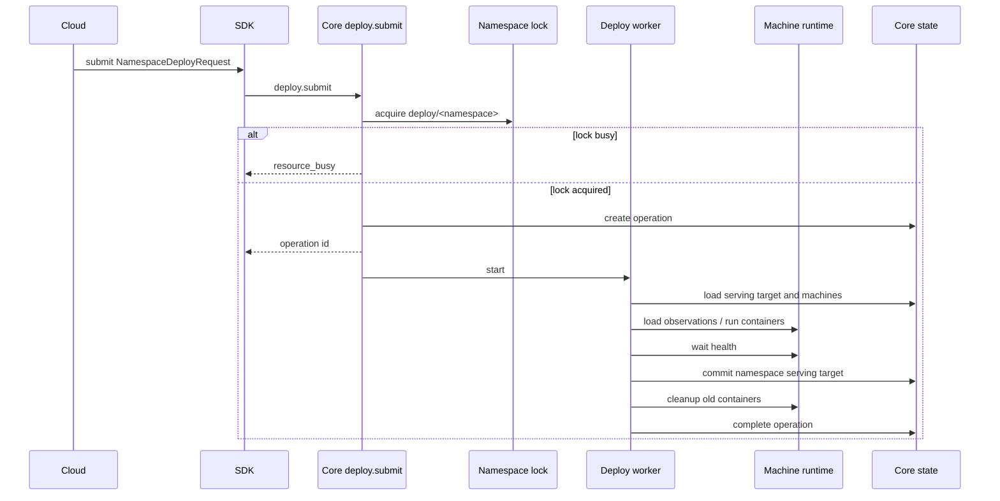
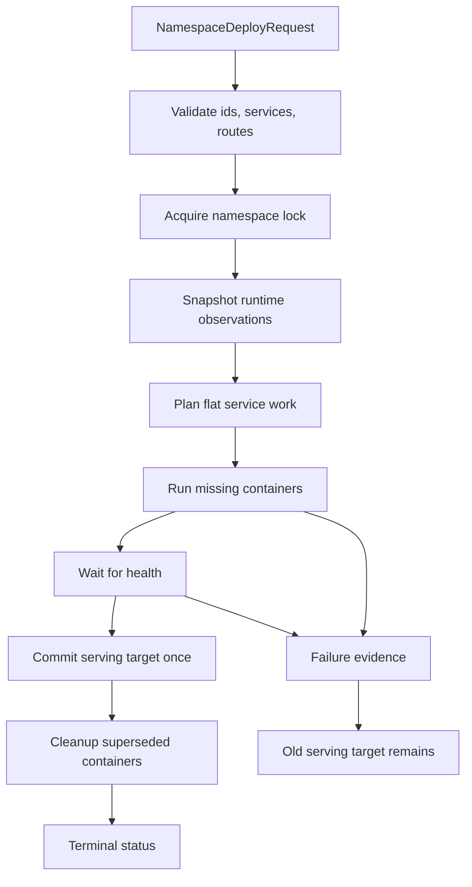

# feat: Add namespace deploy spine

## Goal Capsule

- **Objective:** Replace the public single-service deploy path with a namespace-scoped deploy spine that plans from runtime observations and submits from Cloud without the legacy SSH controller path.
- **Authority:** `VISION.md`, `CONTEXT.md`, `AGENTS.md`, `docs/brainstorms/2026-06-07-namespace-succeed-or-die-operations-requirements.md`, ADR 0004, ADR 0008.
- **Execution profile:** Breaking change allowed. Delete legacy deploy code when it conflicts with the namespace model.
- **Stop conditions:** Stop if the design starts requiring a generic workflow engine, Cloud-side runtime planning, durable takeover machinery, or per-service deploy submits.
- **Tail ownership:** Runtime truth belongs to Rust core. Cloud submits payloads and watches operation status.

---

## Product Contract

### Summary

Ployz deploys should operate at the namespace boundary, not the service boundary. A deploy receives a full namespace revision, acquires one namespace lock, observes runtime state, computes concrete runtime operations, executes the plan, and commits the namespace serving target only when the planned work has reached the chosen promotion boundary.

This plan implements the first shippable spine: one flat namespace deploy operation with simple service specs and one final serving-target commit. It keeps the product direction intact while deferring deeper phase/canary/rebuild behavior that would turn the first pass into a large orchestrator rewrite.

### Problem Frame

The current Rust public deploy API is single-service shaped: `DeployRequest` carries `service_id`, `target_revision`, `image`, `replicas`, and an optional route. The worker is useful but commits active service state per service. Cloud still compiles an environment manifest, selects a legacy controller from the old `server` table, and applies over SSH.

That creates the exact scary gap: Cloud wants to deploy a whole namespace, but core can only accept one service. Looping the current deploy per service would make each service plan from shifting runtime state and would commit partial service truth without a namespace operation boundary.

### Requirements

**First namespace deploy spine**

- R1. Deploy submit accepts one full namespace revision payload, not a single service payload.
- R2. Deploy submit acquires a short namespace lock before creating an operation; if the lock is busy, it returns `resource_busy` and creates no operation.
- R3. Deploy planning loads runtime observations once for the namespace operation and derives the service work from that snapshot.
- R4. Runtime planning reuses matching observed service containers before starting new containers.
- R5. Runtime planning treats containers for services absent from the submitted namespace revision as cleanup candidates.
- R6. The worker records operation status and evidence directly; public Cloud integration watches status, not operation event replay.
- R7. The worker commits namespace serving target state once after the flat plan succeeds.
- R8. If container start or health fails before serving-target commit, the prior serving target remains active and every container started by that attempt is stopped and retained for inspection evidence.
- R9. Cloud compiles its existing environment snapshot into the Rust namespace deploy request and submits to core through the SDK/NATS path.
- R10. Cloud deletes the legacy SSH controller deploy branch from the environment deployment worker after the Rust submit path exists.

### Key Flows

- F1. **Deploy accepted:** A caller submits a namespace revision. Core validates the payload, acquires `deploy/<namespace>`, creates one operation, and starts the worker.
- F2. **Namespace busy:** A caller submits while the namespace lock is active. Core returns `resource_busy`; no operation is created.
- F3. **Flat namespace deploy succeeds:** The worker snapshots runtime state, plans service container work, starts missing containers, waits for health, commits the namespace serving target, cleans superseded containers, and marks the operation completed.
- F4. **Flat namespace deploy fails before commit:** The worker records failure evidence and leaves the previous serving target untouched.
- F5. **Cloud deploy:** Cloud creates its deployment snapshot, compiles the namespace payload, submits it to core, stores the operation id, and reflects status from core instead of running SSH apply.

### Acceptance Examples

- AE1. **Two-service deploy:** Given a namespace payload with `web` and `api`, when both services are missing, then the planner schedules containers for both from one runtime snapshot and commits one namespace serving target after both are healthy.
- AE2. **Removed service cleanup:** Given observed containers for `worker` and a new namespace revision without `worker`, when deploy succeeds, then `worker` containers are cleanup candidates and are not included in the committed serving target.
- AE3. **Busy namespace:** Given `deploy/prod` is held by an active operation, when Cloud retries deploy for `prod`, then core returns `resource_busy` and Cloud does not create a second environment deployment operation in core.
- AE4. **Failed service start:** Given `web` starts and `api` fails health before commit, then the old namespace serving target remains active and the operation stops every container started by the attempt, retaining stopped containers for inspection evidence.
- AE5. **Cloud path:** Given a Cloud environment deployment snapshot, when the worker reaches apply, then it submits a namespace deploy request to Rust core and never calls the legacy SSH controller apply path.

### Scope Boundaries

#### In Scope

- Replace public deploy request/SDK/export shape with namespace deploy input.
- Add namespace lock acquisition around deploy submit.
- Add a flat namespace planner and executor using current machine-runtime ports.
- Add namespace serving-target state sufficient for gateways/DNS/Cloud read paths to consume after deploy.
- Update `ployz` and Cloud deploy worker to submit the new request.
- Delete the Cloud legacy SSH deploy apply path once replaced.

#### Deferred to Follow-Up Work

- Dependency-derived phases, canary mutations, and per-machine rollout concurrency.
- Stop-first/start-first replacement policy beyond what current worker already supports.
- Warning-only role observation windows for gateway/DNS convergence.

#### Out of Scope

- Per-service deploy locking.
- Queueing deploys behind locks.
- Cloud-side runtime planning.
- Durable workflow takeover.
- Backwards compatibility for the old single-service deploy API.

---

## Planning Contract

### Key Technical Decisions

- KTD1. **Namespace request replaces single-service request.** Keeping both preserves the unsafe per-service submit escape hatch.
- KTD2. **Flat phase first.** The first implementation plans one flat phase and commits once. Dependency phases are a real product feature, but adding them now makes the first deploy path harder to inspect and debug.
- KTD3. **Reuse current deploy worker ports.** The existing machine runtime, dataplane, health checker, and recorder traits are useful. Replace their command/input shape before inventing new executor plumbing.
- KTD4. **One lock before one operation.** Namespace lock acquisition happens before operation creation so rejected busy deploys do not leave noise operations.
- KTD5. **Cloud submits; Rust plans.** Cloud remains product workflow owner. Runtime planning, machine selection, cleanup, and serving-target mutation stay in Rust.
- KTD6. **Delete conflicting legacy.** Old Cloud SSH controller apply and old single-service SDK/CLI surfaces should be removed, not bridged.

### High-Level Technical Design

### Assumptions

- Cloud can reach the core NATS endpoint using the existing SDK/NATS client path or a narrow addition to it.
- The first Cloud payload can omit full volume/hook semantics if current Cloud deploys do not require them for the target alpha path.
- Gateway/DNS read paths can temporarily consume a simple namespace serving target without full role observation windows.
- The current dirty `ployz host` changes in the worktree are unrelated and must not be reverted by this work.

### Risks & Dependencies

- **Rust/Cloud package versioning:** Cloud depends on `@ployz/sdk`; Rust type export and package release must happen before Cloud can compile against the new request.
- **Serving target model gap:** Current Rust state is active-service keyed. Namespace serving target needs a small new state shape.
- **Lock store gap:** `KV_LOCKS` exists in the architecture, but deploy lock acquisition needs real code and tests.
- **Watcher gap:** Gateway/DNS processes currently watch active route changes, not namespace serving-target changes; the new state must wake those processes.
- **Cloud status mapping:** Cloud deployment statuses are product workflow statuses. Core operation status must be mapped without making Cloud runtime authority.

### Sources & Research

- `VISION.md`
- `CONTEXT.md`
- `AGENTS.md`
- `docs/brainstorms/2026-06-07-namespace-succeed-or-die-operations-requirements.md`
- `docs/adr/0004-deploys-are-namespace-reconciliation-attempts.md`
- `docs/adr/0008-deploy-replacement-is-explicit-policy-with-failure-evidence.md`
- `.workflow/uncloud-domain-language-research/final-report.md`
- Uncloud deploy references: `pkg/client/compose/deploy.go`, `pkg/client/deploy/deploy.go`, `pkg/client/deploy/strategy.go`, `pkg/client/deploy/operation/container.go`, `pkg/client/deploy/scheduler/state.go`

---

## Implementation Units

### U1. Replace deploy contract with namespace input

- **Goal:** Replace the single-service public deploy request with a namespace deploy request and update generated SDK/export surfaces.
- **Requirements:** R1, R6, KTD1, KTD6.
- **Dependencies:** None.
- **Files:**
  - `crates/ployz-core/src/deploy.rs`
  - `crates/ployz-core/tests/wire_contract.rs`
  - `crates/ployz-sdk-types/src/lib.rs`
  - `crates/ployz-sdk-types/src/typescript.rs`
  - `crates/ployz-sdk-types/tests/exports.rs`
  - `packages/ployz-sdk/src/generated.ts`
  - `packages/ployz-sdk/src/index.ts`
  - `packages/ployz-sdk/test/operations.test.ts`
  - `packages/ployz-sdk/test/fixtures/operation-contract.json`
- **Approach:** Introduce namespace-oriented ids/specs in `ployz-core` and make `DeploySubmitRequest.target` carry the new namespace request. Keep the first service spec small: service id, image, replicas, env, endpoint/route data, and explicit update-order field only if current worker needs it.
- **Patterns to follow:** Existing typed id and `serde(deny_unknown_fields)` patterns in `DeployRequest`, `ReplicaCount`, and SDK export tests.
- **Test scenarios:**
  - Deserialize a valid namespace deploy request with two services and assert every typed id survives round-trip serialization.
  - Reject an empty services array.
  - Reject duplicate service ids in one namespace request.
  - Reject unknown JSON fields.
  - Verify generated TypeScript fixture includes the namespace request and no old single-service `DeployRequest` shape.
- **Verification:** Rust and TypeScript contract tests prove the old public shape is gone and the new one is exported.

### U2. Add namespace deploy lock

- **Goal:** Ensure only one deploy can mutate a namespace at a time and busy submits do not create operations.
- **Requirements:** R2, F1, F2, AE3, KTD4.
- **Dependencies:** U1.
- **Files:**
  - `crates/ployz-core/src/subjects.rs`
  - `crates/ployz-core/src/permissions.rs`
  - `crates/ployz-nats/src/locks.rs`
  - `crates/ployz-nats/src/lib.rs`
  - `crates/ployz-nats/tests/operations_nats/submission.rs`
  - `crates/ployzd/src/deploy_runtime.rs`
  - `crates/ployzd/src/controllers.rs`
  - `crates/ployzd/src/operation_api/submit.rs`
  - `crates/ployzd/src/operation_api/error_map.rs`
  - `crates/ployzd/tests/control_runtime.rs`
- **Approach:** Add the smallest KV lock helper for `deploy/<namespace>` with 60 second TTL, backed by an explicitly bootstrapped lock bucket. Submit acquires the lock first, then creates the operation. The lock value carries operation id plus owner token so refresh and release are owner-checked while the worker is active.
- **Patterns to follow:** Existing NATS core-state store error mapping and subject construction helpers; do not create a generic distributed-lock framework.
- **Test scenarios:**
  - Bootstrap creates the lock bucket with TTL support or the selected existing bucket is documented and tested for TTL semantics.
  - First submit for `prod` acquires the lock and creates a deploy operation.
  - Second submit for `prod` while locked returns `resource_busy`.
  - Busy submit does not write operation status or deploy-submitted evidence.
  - Submit for `staging` succeeds while `prod` is locked.
  - Expired lock allows a later submit.
  - Refresh prevents a second submit after the initial TTL during a long but progressing deploy.
  - Release fails when the owner token or operation id does not match.
- **Verification:** NATS submission tests demonstrate lock-before-operation behavior.

### U3. Add namespace serving target state

- **Goal:** Replace active-service commit as deploy completion truth with namespace serving-target state for the first flat namespace deploy.
- **Requirements:** R7, F3, AE1, AE2, KTD1.
- **Dependencies:** U1.
- **Files:**
  - `crates/ployz-core/src/state.rs`
  - `crates/ployz-nats/src/core_state.rs`
  - `crates/ployz-nats/src/core_state/namespace_serving_target.rs`
  - `crates/ployz-nats/tests/operations_nats/transitions.rs`
  - `crates/ployzd/src/operation_api/queries.rs`
  - `crates/ployzd/src/gateway_source.rs`
  - `crates/ployzd/src/dns_source.rs`
  - `crates/ployzd/src/gateway_process_runtime.rs`
  - `crates/ployzd/src/dns_process_runtime.rs`
  - `crates/ployzd/tests/gateway_runtime.rs`
  - `crates/ployzd/tests/dns_process_runtime.rs`
- **Approach:** Add a compact `NamespaceServingTargetState` keyed by namespace with namespace revision id and service entries. For v1, commit once after health succeeds. Add watch APIs so gateway and DNS processes rebuild their views when the serving target changes. Update service list/inspect to read from namespace serving targets or intentionally remove the stale active-service read path.
- **Patterns to follow:** `ActiveRouteStateKey`, `AsyncNatsCoreStateStore::commit_active_route`, and watch helpers.
- **Test scenarios:**
  - Commit creates serving target for an absent namespace.
  - Commit updates target when the expected current revision matches.
  - Commit rejects when current namespace revision differs.
  - Serving-target watch wakes gateway and DNS process runtimes.
  - Gateway source ignores containers not present in the namespace serving target.
  - DNS source handles missing namespace serving target as no serveable services.
  - Service list/inspect reports namespace serving-target data or is removed from the public API contract.
- **Verification:** Core-state and gateway/DNS tests show namespace target is the serving read model.

### U4. Replace service planner with flat namespace planner

- **Goal:** Plan all services from one runtime snapshot and produce one namespace deploy plan.
- **Requirements:** R3, R4, R5, R8, F3, F4, AE1, AE2, AE4, KTD2, KTD3.
- **Dependencies:** U1, U3.
- **Files:**
  - `crates/ployz-core/src/deploy.rs`
  - `crates/ployz-core/tests/deploy_planner.rs`
  - `crates/ployzd/src/deploy_worker/preparation.rs`
  - `crates/ployzd/src/deploy_worker/facts.rs`
  - `crates/ployzd/tests/deploy_command_preparation.rs`
  - `crates/ployzd/tests/deploy_command_preparation_nats.rs`
- **Approach:** Build `NamespaceDeployPlan` with per-service entries and cleanup candidates. Use typed request/state shapes that make empty service sets and duplicate service ids invalid. Existing matching containers satisfy replicas first. Missing replicas are spread over eligible machines using the current round-robin behavior. Containers for services omitted from the namespace request become cleanup candidates.
- **Execution note:** Implement planner tests first; this is the easiest place to prevent the unsafe per-service-loop shape.
- **Patterns to follow:** Current `plan_service_deploy` behavior and Uncloud's `InspectClusterState -> Plan -> Execute` shape, but keep planning in Rust core.
- **Test scenarios:**
  - Two missing services create run steps for both from the same eligible machine list.
  - Existing matching container for `web` is reused while `api` gets new run steps.
  - Duplicate observations count once.
  - Empty eligible machine list succeeds when observations already satisfy every replica.
  - Containers for a service absent from the namespace request are planned for cleanup.
  - Planning fails when a missing replica has no eligible machine.
- **Verification:** Planner tests prove one namespace plan covers multiple services and removed-service cleanup.

### U5. Execute flat namespace deploy with one commit

- **Goal:** Run the namespace plan through existing machine runtime ports and commit serving target only after successful health.
- **Requirements:** R6, R7, R8, F3, F4, AE1, AE4, KTD3.
- **Dependencies:** U2, U3, U4.
- **Files:**
  - `crates/ployzd/src/deploy_worker.rs`
  - `crates/ployzd/src/deploy_worker/types.rs`
  - `crates/ployzd/src/deploy_worker/failure.rs`
  - `crates/ployzd/src/deploy_worker/ports.rs`
  - `crates/ployzd/src/deploy_runtime.rs`
  - `crates/ployzd/tests/deploy_operation.rs`
  - `crates/ployzd/tests/deploy_runtime_nats.rs`
  - `crates/ployzd/tests/control_runtime.rs`
- **Approach:** Reuse `MachineContainerRuntime`, `DeployHealthChecker`, `DataplanePreparer`, and recorder traits. Replace the service-shaped active commit port with a narrow `NamespaceServingTargetCommitter`. Iterate the flat plan, record namespace-level evidence, wait health across all planned containers, commit namespace serving target, then cleanup superseded/removed containers. On failure or shutdown, stop started containers and release the namespace lock by matching owner.
- **Patterns to follow:** Existing failure evidence, retained container stop, cleanup result, and timeout code in `deploy_worker.rs`.
- **Test scenarios:**
  - Successful two-service plan starts containers, waits health once, commits namespace serving target once, and completes.
  - Health failure before commit records failure and does not call serving-target commit.
  - Run-container failure retains created container evidence where available.
  - Cleanup failure after serving-target commit records a failed or partially-completed namespace outcome, not completed-with-warnings.
  - Busy lock is released by matching owner after terminal failure.
  - Shutdown before commit preserves the old serving target and stops started containers.
- **Verification:** Worker tests prove no per-service commit and old serving target survives pre-commit failure.

### U6. Update CLI and API client surfaces

- **Goal:** Make `ployz` and API client tests submit namespace deploys.
- **Requirements:** R1, R6, F1.
- **Dependencies:** U1, U2, U5.
- **Files:**
  - `crates/ployz/src/commands/deploy.rs`
  - `crates/ployz/src/runtime.rs`
  - `crates/ployz/tests/deploy_cli_contract.rs`
  - `crates/ployz/tests/api_client_nats.rs`
  - `crates/ployz/tests/deploy_binary_nats.rs`
  - `crates/ployz-nats/src/operation_api_client.rs`
- **Approach:** Keep the CLI minimal: update existing deploy flags only enough to build a namespace-shaped request. Defer new CLI ergonomics and expert flag expansion.
- **Patterns to follow:** Current `derive_service_id`, `derive_revision_id`, and API client request handling.
- **Test scenarios:**
  - CLI `deploy --image nginx:latest --namespace prod` builds a namespace request with one service.
  - CLI rejects missing namespace when no default is implemented.
  - API client sends the namespace request to the same deploy submit endpoint.
  - Binary NATS smoke test accepts the namespace request over real NATS.
- **Verification:** CLI/API tests no longer mention the old single-service request fields.

### U7. Switch Cloud deployment apply to core submit

- **Goal:** Replace Cloud's legacy SSH controller apply with SDK/NATS namespace deploy submit.
- **Requirements:** R9, R10, F5, AE5, KTD5, KTD6.
- **Dependencies:** U1, U5, U6.
- **Files:**
  - `src/models/services/environment-deployments.ts` in `ployz-cloud`
  - `src/models/services/environment-deployments.server.ts` in `ployz-cloud`
  - `src/inggest/functions/environment-deployments/deploy.ts` in `ployz-cloud`
  - `src/inggest/functions/environment-deployments/deploy.test.ts` in `ployz-cloud`
  - `src/models/services/environment-deployments.server.test.ts` in `ployz-cloud`
  - `src/models/runtime/runtime-machines.server.ts` in `ployz-cloud`
  - `package.json` in `ployz-cloud`
  - `pnpm-lock.yaml` in `ployz-cloud`
- **Approach:** Keep snapshot and preview persistence. Load the existing Cloud NATS connection material used by runtime machine reads, submit through the updated `@ployz/sdk`, persist the returned operation id, and map terminal core status back to Cloud deployment status. Remove controller selection and SSH apply from this deploy path. Touch old server guards only if a failing deploy test proves they block the new path.
- **Patterns to follow:** Existing Inngest step boundaries and realtime publish functions; recent runtime server subscription path for Cloud-as-lens behavior.
- **Test scenarios:**
  - Deploy worker compiles namespace request from two service snapshots.
  - Deploy context loads and decrypts Cloud NATS connection material.
  - Missing or unreachable Cloud NATS connection fails with a clear Cloud deployment failure.
  - Apply calls SDK submit and never calls `selectReadyController` or `runDeployApplyOnController`.
  - `resource_busy` marks Cloud deployment failed or waiting using the chosen existing status semantics, without retrying SSH.
  - Successful core operation id is persisted on the environment deployment.
  - Package dependency points at the SDK build/release that contains the namespace request.
- **Verification:** Cloud tests prove the Inngest deploy apply path is no longer SSH/controller based.

---

## Verification Contract

| Gate | Applies to | Done signal |
|---|---|---|
| `cargo test -p ployz-core deploy_planner` | U1, U4 | Namespace deploy request and planner behavior pass focused core tests. |
| `cargo test -p ployz-nats operations_nats` | U2, U3 | Locking, serving-target watch, and state commit behavior pass NATS-backed tests. |
| `cargo test -p ployzd deploy_operation deploy_runtime_nats control_runtime` | U5 | Worker executes flat namespace plan, refreshes locks, handles shutdown, and preserves failure semantics. |
| `cargo test -p ployz deploy_cli_contract api_client_nats deploy_binary_nats` | U6 | CLI/API submit the namespace request. |
| `cargo test -p ployz-sdk-types` plus SDK package tests | U1, U6 | Generated TypeScript contract matches Rust. |
| `pnpm test src/inggest/functions/environment-deployments/deploy.test.ts src/models/services/environment-deployments.server.test.ts` in `ployz-cloud` | U7 | Cloud deploy uses core submit and not SSH controller apply. |
| `pnpm typecheck` in `ployz-cloud` | U7 | Cloud compile surface accepts the new SDK shape. |

---

## Definition of Done

- The public deploy API is namespace-shaped and the old single-service shape is removed.
- Deploy submit acquires a namespace lock before operation creation.
- Active deploys refresh the namespace lock and terminal paths release it by matching owner.
- The worker plans all services from one runtime snapshot.
- The worker commits namespace serving target once after successful health.
- Failed or cancelled pre-commit deploys leave the old serving target untouched and stop/retain started containers as useful evidence.
- Cloud environment deploys submit to Rust core and no longer select a legacy SSH controller for deploy apply.
- Tests named in the Verification Contract pass or any failure is explained as unrelated pre-existing work.
- Abandoned compatibility shims and dead-end implementation attempts are removed from the final diff.
