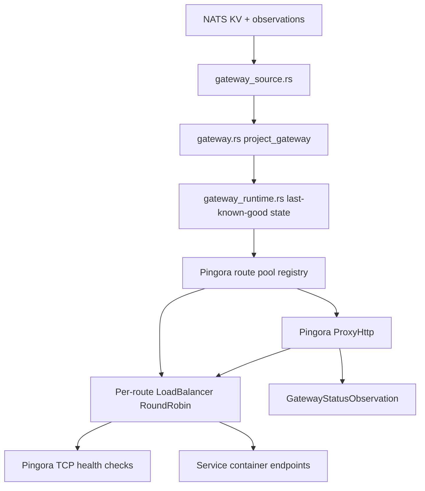

# Pingora Gateway Replacement

## Goal Capsule

| Field | Value |
|---|---|
| Objective | Replace the temporary hand-rolled HTTP gateway with an idiomatic Pingora gateway for port 80. |
| Scope | Plain HTTP ingress, host-based route projection, per-route load balancing, active health checks, retry/failover, WebSocket/upgrade pass-through, Pingora-owned server lifecycle, and existing NATS observation semantics. |
| Non-goals | TLS, route protection, cache/compression, custom load-balancing policy, passive ejection tuning, graceful binary upgrade mechanics beyond Pingora lifecycle alignment. |
| Authority hierarchy | Ployz route projection and NATS state decide route membership; Pingora decides proxy serving mechanics for healthy upstreams. |
| Stop conditions | Existing routed deploy tests pass through Pingora, two-upstream routes load balance, unhealthy upstreams are avoided, route changes apply without gateway restart, and gateway observations remain diagnostic only. |

## Product Contract

### Summary

The current gateway has enough behavior to make routed deploys work, but its HTTP proxy path is intentionally temporary. The replacement should be a real gateway foundation: Pingora owns serving, load balancing, health checks, connection handling, retry/failover, and lifecycle; Ployz continues to own route projection from NATS and the product semantics around route bindings, serving targets, and gateway observations.

### Problem Frame

Ployz needs a gateway that can become Caddy-level ingress infrastructure without growing a custom proxy engine. The implementation should lean on Pingora's native server, proxy, and load-balancing APIs rather than preserving placeholder behavior such as selecting the first upstream. The first deliverable is port 80 only.

### Requirements

- R1. The gateway process must serve plain HTTP on the configured gateway listen address, defaulting to the current port-80 posture.
- R2. Pingora must own HTTP server lifecycle, worker lifecycle, request parsing, upstream connection handling, and graceful shutdown behavior.
- R3. Ployz must keep its current route projection model: active route state plus fresh machine container observations produce per-route route projections.
- R4. A route target must map to a per-route Pingora load-balancer pool, not to one selected upstream.
- R5. Requests must route by HTTP authority/Host to the matching `RouteTarget`; missing or invalid authority returns `400`.
- R6. Unknown route targets return `404`.
- R7. Route targets with no currently healthy upstream return `503`.
- R8. Healthy upstreams for the same route must receive balanced traffic through Pingora load balancing.
- R9. Upstream health must be checked through Pingora's health-check infrastructure, with dead upstreams skipped during normal selection.
- R10. Connect failures must be retryable to another eligible upstream when the request can safely be retried.
- R11. Midstream failures must not blindly replay unsafe requests after bytes may have reached an upstream.
- R12. NATS route and observation changes must update Pingora route pools without restarting the gateway process.
- R13. Gateway status observations must remain diagnostic feedback: current, last-known-good, or unavailable, with route counts from the served projection.
- R14. Route projection apply failures must be isolated per route where possible: one unroutable route must not stop other valid routes from serving, and gateway observations must report failed route projections as diagnostic feedback.
- R15. Existing deploy and e2e behavior must continue to work through gateway HTTP.
- R16. WebSocket and HTTP upgrade traffic must pass through the gateway for valid routes.
- R17. The gateway must not enable Pingora cache or any cache-related hooks in this phase.
- R18. Pingora must be pinned to a version at or above the first release that fixed the 2026 ingress request-smuggling issues, and dependency audit must fail on known vulnerable Pingora versions.

### Scope Boundaries

- Deferred for later: TLS certificate loading, SNI, HTTP-to-HTTPS redirect policy, route protection, access-provider callbacks, same-origin `/.ployz/*` reserved paths, cache, compression, custom load-balancing weights, and graceful socket transfer for substrate update.
- Outside this work: changing deploy promotion rules, changing route binding authority, replacing NATS as the gateway state source, or making gateway convergence a deploy success gate.

### Acceptance Examples

- AE1. Given one route with two healthy upstream containers, when twenty HTTP requests with the route Host header arrive, then both upstreams receive traffic.
- AE2. Given one route with two upstreams and one upstream stops accepting TCP connections, when health checks observe the failure, then new requests route to the healthy upstream without returning `503`.
- AE3. Given a route's selected upstream fails to connect during a safe request, when another healthy upstream exists, then Pingora retries/fails over to the other upstream.
- AE4. Given all upstreams for a route are unhealthy, when a request arrives, then the gateway returns `503`.
- AE5. Given a missing Host header, when a request arrives, then the gateway returns `400`.
- AE6. Given an unknown Host header, when a request arrives, then the gateway returns `404`.
- AE7. Given NATS publishes a changed route projection, when the watch wakes the gateway, then new requests use the new pool without restarting the gateway process.
- AE8. Given NATS becomes temporarily unavailable after a valid projection, when requests arrive, then the gateway serves last-known-good route pools and publishes degraded gateway observation.
- AE9. Given one route has no healthy upstreams and another route has healthy upstreams, when requests arrive for both hosts, then the failed route returns `503` and the healthy route still proxies.
- AE10. Given a valid WebSocket upgrade request for a routed host, when the upstream returns `101 Switching Protocols`, then Pingora tunnels the upgraded connection.
- AE11. Given a malformed HTTP/1.0 or ambiguous transfer-encoding request covered by Pingora's request-smuggling advisories, when it reaches the gateway, then Pingora rejects or normalizes it according to the patched upstream behavior and Ployz does not add cache behavior that reintroduces unread-body risk.

## Planning Contract

### Key Technical Decisions

- KTD1. **Use Pingora as the server, not a TCP helper.** `gateway_process_runtime.rs` should construct a Pingora `Server`, register proxy/background services, and let Pingora own serving lifecycle. This avoids keeping the current ad hoc accept loop around a real proxy engine.
- KTD2. **Keep Ployz projection outside Pingora.** `gateway.rs`, `gateway_runtime.rs`, and `gateway_source.rs` remain the source of truth for route projection and last-known-good semantics. Pingora consumes a prepared serving view.
- KTD3. **Use one load-balancer pool per route target.** A `RouteTarget` maps to a Pingora `LoadBalancer<RoundRobin>` containing that route's upstream endpoints. This keeps host routing explicit and avoids a global pool with route metadata.
- KTD4. **Use Pingora health checks for upstream liveness.** Active TCP health checks are the v1 minimum because current route projection exposes container endpoints, not HTTP health policy. HTTP health can be added later when service-level health semantics exist.
- KTD5. **Retry connect failures, not unsafe streamed failures.** Pingora retry hooks should retry connect failures to another healthy upstream. Midstream retry should be limited to requests Pingora can safely replay, and unsafe method replay is out of scope for v1.
- KTD6. **Update route pools from projection refresh.** NATS watch events stay invalidation signals. On every change, reload the current view and update the per-route Pingora pools. Use Pingora service discovery or a background service only if the API requires it; do not add a Ployz pool manager unless implementation proves it is the smallest working shape.
- KTD7. **Split production lifecycle from test lifecycle only where needed.** Production daemon startup should call Pingora `Server::run`/`run_forever` as the final process step. Tests should preserve the current `RunningGatewayProcessRuntime` surface with concrete listen addresses and explicit shutdown; add a separate harness only if the existing surface cannot support Pingora.
- KTD8. **Keep public-ingress security narrow.** The first implementation must not enable `Session.cache`, cache hooks, or custom request-body buffering. It must pin `pingora >= 0.8.1` and include a dependency-audit check because Pingora versions before `0.8.0` were affected by ingress request-smuggling issues.
- KTD9. **Delete the hand-rolled HTTP parser/proxy after parity.** `httparse` and `gateway_http.rs` should disappear once Pingora tests cover authority validation, route selection, error responses, balancing, failover, and upgrades.

### High-Level Technical Design

The gateway process should have a shared serving registry that is cheap to read from request paths and replace from projection refresh paths. Request handling should not call NATS and should not hold the runtime lock while proxying.

Recommended in-memory split:

- `GatewayRuntime` keeps current/last-known-good projection state.
- `PingoraRouteRegistry` owns a read-optimized `RouteTarget -> LoadBalancer<RoundRobin>` snapshot used by request paths.
- `PloyzGatewayProxy` implements `ProxyHttp`, reads Host, finds the route pool, selects a healthy backend, and returns a Pingora `HttpPeer`.
- The existing gateway process refresh/watch path updates `GatewayRuntime`, updates `PingoraRouteRegistry`, and publishes gateway observations. Move that path into a Pingora background service only if Pingora lifecycle requires it.

### Dependencies

- Add `pingora = { version = "0.8.1", features = ["lb"] }` to `crates/ployzd/Cargo.toml`.
- Add `async-trait = "0.1"` if required by the local Pingora trait implementation style.
- Remove direct `httparse` dependency from `crates/ployzd/Cargo.toml` after `gateway_http.rs` is removed.
- Keep `tokio` features already used by the daemon.
- Add a dependency-audit command to CI/local verification before release if the repo does not already have one.

### Research Notes

- Pingora `0.8.1` exposes the proxy and load-balancing APIs through the crate feature set; `lb` includes load balancing support and proxy support. Source: `https://docs.rs/crate/pingora/latest/features`.
- `ProxyHttp::upstream_peer` is the routing hook for choosing the upstream peer, and `request_filter` is the early request validation/response hook. Source: `https://docs.rs/pingora/latest/pingora/prelude/trait.ProxyHttp.html`.
- `LoadBalancer` is Pingora's intended load-balancing abstraction and combines discovery, health, and selection. Source: `https://docs.rs/pingora-load-balancing/latest/pingora_load_balancing/struct.LoadBalancer.html`.
- Pingora `ServiceDiscovery::discover` returns the current discovered backend set plus optional enabled state if implementation needs a discovery seam for NATS-backed route membership. Source: `https://docs.rs/pingora-load-balancing/latest/pingora_load_balancing/discovery/trait.ServiceDiscovery.html`.
- Pingora `Server` is process-level: it can hold multiple services, handles signals and zero-downtime upgrade behavior, and `run` waits for shutdown signals before services exit. Source: `https://docs.rs/pingora/latest/pingora/server/struct.Server.html`.
- Cloudflare disclosed Pingora OSS HTTP request-smuggling issues affecting ingress proxy deployments and says the fixes landed in Pingora `0.8.0`; the plan pins `0.8.1` and keeps cache disabled. Source: `https://blog.cloudflare.com/pingora-oss-smuggling-vulnerabilities/`.
- Current project entry points: `crates/ployzd/src/gateway_http.rs`, `crates/ployzd/src/gateway_process_runtime.rs`, `crates/ployzd/src/gateway_runtime.rs`, `crates/ployzd/src/gateway.rs`, and `crates/ployzd/src/gateway_source.rs`.

### Sequencing

1. Introduce Pingora route registry and proxy types behind tests without removing current gateway serving.
2. Port process runtime to start Pingora services and keep NATS projection refresh behavior.
3. Preserve the existing runtime test surface for concrete loopback port discovery and shutdown.
4. Replace the hand-rolled HTTP serving path.
5. Add load-balancing, health-check, failover, and WebSocket/upgrade tests.
6. Delete obsolete parser/proxy code and dependencies.
7. Run focused gateway tests, then routed deploy/e2e tests.

## Implementation Units

### U1. Add Pingora Gateway Types And Registry

- **Goal:** Create the internal serving model that maps Ployz route projections to dynamic Pingora route pools.
- **Requirements:** R3, R4, R8, R12, R14
- **Files:**
  - `crates/ployzd/Cargo.toml`
  - `crates/ployzd/src/gateway_pingora.rs`
  - `crates/ployzd/src/lib.rs`
  - `crates/ployzd/tests/gateway_pingora.rs`
- **Approach:** Add a new module with `PingoraRouteRegistry` and conversion from `GatewayProjection`. Keep this independent from NATS and request handling. Store route targets directly to Pingora load balancers until the code proves a handle or discovery abstraction is needed.
- **Test Scenarios:**
  - A projection with two route targets creates two independent route pools.
  - A projection with two upstreams for one route creates one pool with two backends.
  - Replacing the registry removes deleted routes and adds new routes.
  - Removed routes disappear from request selection immediately.
  - Empty projections produce no route pools and no panic.
- **Verification:** `cargo test -p ployzd --test gateway_pingora`

### U2. Implement Pingora ProxyHttp Routing

- **Goal:** Route HTTP requests by Host through Pingora and return correct gateway errors.
- **Requirements:** R1, R2, R5, R6, R7, R8, R16, R17
- **Files:**
  - `crates/ployzd/src/gateway_pingora.rs`
  - `crates/ployzd/tests/gateway_pingora.rs`
  - `crates/ployzd/tests/gateway_http.rs`
- **Approach:** Implement `ProxyHttp` for `PloyzGatewayProxy`. Use Pingora request parsing to read authority/Host, reuse `route_target_from_authority` logic or move that small function into the Pingora module, select from the per-route load balancer, and return a Pingora `HttpPeer`. Preserve the existing user-visible error classes: `400`, `404`, `503`. Do not enable cache hooks or request-body buffering.
- **Test Scenarios:**
  - Missing Host returns `400`.
  - Invalid authority returns `400`.
  - Unknown route returns `404`.
  - Known route with no available upstream returns `503`.
  - Known route with one available upstream proxies the request and response.
  - Explicit authority port maps to the matching `RouteTarget`.
  - WebSocket upgrade reaches the upstream and receives `101 Switching Protocols`.
  - Cache hooks remain disabled and `Session.cache` is not enabled.
- **Verification:** `cargo test -p ployzd --test gateway_pingora --test gateway_http`

### U3. Add Load Balancing And Health Behavior

- **Goal:** Use Pingora's load-balancing and health infrastructure for real multi-upstream serving.
- **Requirements:** R4, R8, R9, R10, R11, R12, R14
- **Files:**
  - `crates/ployzd/src/gateway_pingora.rs`
  - `crates/ployzd/tests/gateway_pingora.rs`
  - `crates/ployzd/tests/gateway_process_runtime.rs`
- **Approach:** Use `LoadBalancer<RoundRobin>` per route with active TCP health checks. Projection refresh updates each route's load balancer and drops removed routes from the registry. Implement retry/failover hooks for connect failures so another healthy upstream can be tried. Keep unsafe midstream replay out of v1 and document that behavior in code-level tests.
- **Test Scenarios:**
  - Two healthy upstreams both receive traffic over repeated requests.
  - An upstream that refuses connections is skipped after health checks run.
  - A connect failure on the initially selected upstream retries another healthy upstream.
  - All unhealthy upstreams return `503`.
  - One route with no healthy upstreams does not affect another route with healthy upstreams.
  - Adding and removing a route updates that route's pool without restarting Pingora.
  - Non-idempotent request bodies are not replayed after a midstream failure.
- **Verification:** `cargo test -p ployzd --test gateway_pingora --test gateway_process_runtime`

### U4. Move Gateway Process Runtime Onto Pingora Lifecycle

- **Goal:** Make Pingora own the gateway server lifecycle while preserving Ployz projection refresh, watch, health, and observation behavior.
- **Requirements:** R2, R12, R13, R15
- **Files:**
  - `crates/ployzd/src/gateway_process_runtime.rs`
  - `crates/ployzd/src/gateway_pingora.rs`
  - `crates/ployzd/tests/gateway_process_runtime.rs`
  - `crates/ployzd/tests/control_runtime.rs`
  - `crates/ployz-e2e/tests/operations.rs`
- **Approach:** Replace the Tokio `TcpListener` accept loop with a Pingora server containing an HTTP proxy service and the existing projection refresh/watch behavior. Production startup should call Pingora `Server::run`/`run_forever` as the final process step. Tests should keep `RunningGatewayProcessRuntime`: resolve `127.0.0.1:0` to a concrete free loopback port before clients connect, and preserve `listen_addr`, `health`, `served_projection`, and `shutdown`.
- **Test Scenarios:**
  - Gateway starts before NATS buckets exist and later begins serving after buckets/routes/observations appear.
  - Gateway publishes current status after serving a projection.
  - Gateway serves last-known-good routes when source becomes unavailable.
  - NATS route changes update served pools before the next long poll interval.
  - Runtime shutdown stops Pingora serving and background refresh tasks.
  - A `127.0.0.1:0` test listen address reports the actual concrete port before clients connect.
- **Verification:** `cargo test -p ployzd --test gateway_process_runtime --test control_runtime`

### U5. Remove Temporary HTTP Proxy Code

- **Goal:** Delete obsolete hand-rolled HTTP proxy code after Pingora covers its behavior.
- **Requirements:** R2, R15, R18
- **Files:**
  - `crates/ployzd/src/gateway_http.rs`
  - `crates/ployzd/src/gateway_process_runtime.rs`
  - `crates/ployzd/src/lib.rs`
  - `crates/ployzd/Cargo.toml`
  - `crates/ployzd/tests/gateway_http.rs`
- **Approach:** Delete `gateway_http.rs` and migrate useful authority parsing tests to `gateway_pingora.rs`. Remove `httparse` if no longer directly used by `ployzd`.
- **Test Scenarios:**
  - All former authority parsing cases still pass through Pingora-facing tests.
  - Routed HTTP smoke tests still pass.
  - `cargo tree -p ployzd -i httparse` no longer shows direct `ployzd -> httparse` usage.
  - `cargo audit` or the repo's chosen equivalent fails on vulnerable Pingora versions.
- **Verification:** `cargo test -p ployzd --test gateway_pingora --test gateway_process_runtime`

### U6. Validate Routed Deploy And E2E Behavior

- **Goal:** Prove the Pingora gateway remains compatible with deploy, DNS, and multi-machine assumptions.
- **Requirements:** R12, R13, R15
- **Files:**
  - `crates/ployzd/tests/control_runtime.rs`
  - `crates/ployz-e2e/tests/operations.rs`
  - `crates/ployz-e2e/tests/dind_cluster.rs`
  - `crates/ployz-e2e/tests/support/http.rs`
  - `crates/ployz-e2e/tests/support/dind/assert.rs`
- **Approach:** Keep existing e2e helper APIs stable where possible. Update only assumptions tied to exact response formatting if Pingora normalizes headers differently. Do not weaken body/route assertions.
- **Test Scenarios:**
  - Single-machine routed deploy serves through gateway.
  - Two-machine routed deploy serves through both gateways.
  - Gateway continues serving after control runtime shutdown using passive projection/last-known-good state.
  - Gateway route updates apply after deploy route changes.
  - Dind cluster smoke route answers through published gateway ports.
- **Verification:** `cargo test -p ployz-e2e --test operations` and `PLOYZ_DIND_E2E=1 cargo test -p ployz-e2e --test dind_cluster -- --test-threads=1` when Docker-in-Docker is available.

## Verification Contract

| Check | Command | Covers |
|---|---|---|
| Formatting | `cargo fmt --all --check` | All units |
| Lints | `cargo clippy --workspace --all-targets -- -D warnings` | All units |
| Gateway unit/integration tests | `cargo test -p ployzd --test gateway_pingora --test gateway_process_runtime --test gateway_runtime --test gateway_projection` | U1-U5 |
| Control runtime routed deploy | `cargo test -p ployzd --test control_runtime` | U4-U6 |
| E2E operations | `cargo test -p ployz-e2e --test operations` | U6 |
| Dind acceptance | `PLOYZ_DIND_E2E=1 cargo test -p ployz-e2e --test dind_cluster -- --test-threads=1` | U6 |
| Dependency audit | `cargo audit` or the repo's chosen dependency-audit equivalent | U2, U5 |

## Definition of Done

- Pingora owns HTTP gateway serving lifecycle for port 80.
- Gateway request routing uses per-route Pingora load-balancer pools.
- Active health checks prevent routing to known-dead upstreams.
- Connect failure can fail over to another eligible healthy upstream.
- Unsafe midstream replay is not introduced.
- WebSocket/upgrade requests pass through for valid routes.
- Pingora cache is not enabled and known vulnerable Pingora versions are rejected by dependency audit.
- NATS route/observation changes update gateway serving without process restart.
- Gateway observations keep current/last-known-good/unavailable semantics.
- Existing routed deploy and e2e gateway behavior passes.
- `gateway_http.rs` and direct `httparse` usage are removed unless a remaining direct use is justified.
- Abandoned spike code, duplicate proxy paths, and compatibility shims are removed before merge.
