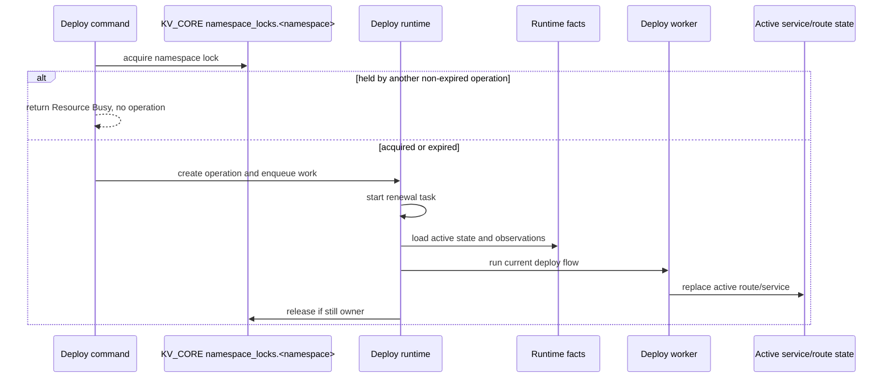
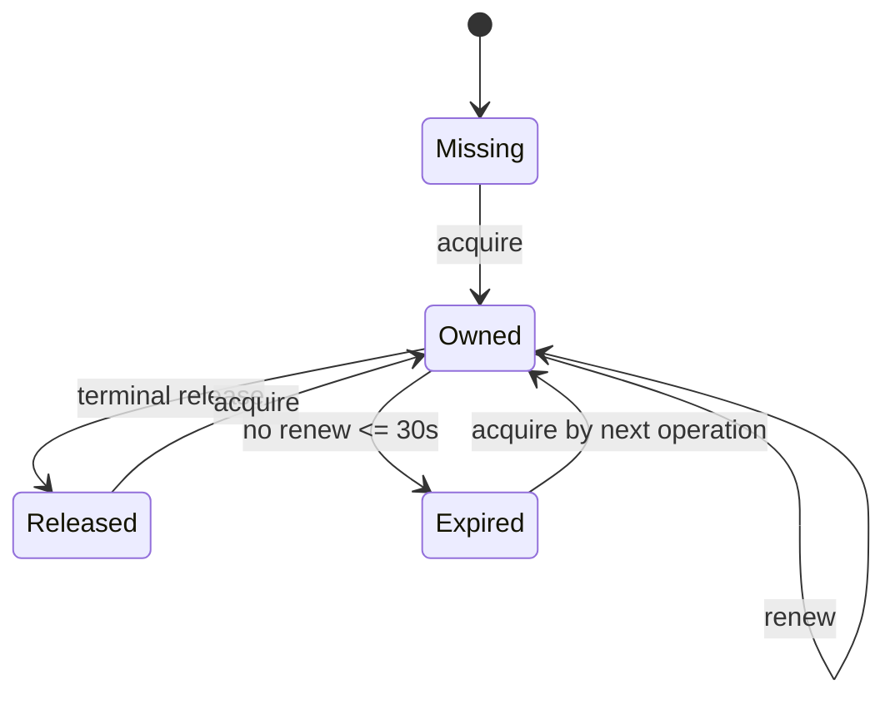

# Deploy Namespace Lock - Plan

## Goal Capsule

- **Objective:** Make deploy concurrency boring by adding a short namespace lock, rejecting same-namespace deploy conflicts before operation creation, and simplifying active service/route writes under that lock.
- **Authority:** `VISION.md`, `CONTEXT.md`, `AGENTS.md`, ADR 0004, ADR 0015, ADR 0021.
- **Execution profile:** Greenfield alpha. Prefer deletion and simpler invariants over defensive CAS layers.
- **Stop conditions:** Stop if the fix grows into the serving-target redesign, parallel deploy semantics, DB migration policy, or a generic lock framework.
- **Tail ownership:** Rust core owns runtime deploy safety. Cloud only submits deploys and renders operation status.

---

## Product Contract

### Summary

Deploy should be one namespace mutation at a time for now. A deploy that cannot obtain the namespace lock should return `Resource Busy` before an operation row exists. Once the deploy owns the lock, active service and route commits can be plain current-state replacement writes instead of late stale-CAS rejection paths.

### Problem Frame

The current deploy runtime only claims execution by operation id. Two deploy operations for the same namespace can both load facts, start containers, wait for health, and race at route or active-service commit. That makes conflicts late, produces extra artifacts, and leaves hidden complexity in the deploy worker through stale commit rejection branches.

The short-term fix is not Vercel-style parallel deploys. It is a small safety fence that makes current alpha deploys predictable while leaving the future serving-target redesign untouched.

### Requirements

**Namespace lock**

- R1. A deploy command must acquire a namespace lock before creating the deploy operation.
- R2. The lock key is namespace-scoped and stores the owning operation id plus an expiry timestamp.
- R3. A held lock owned by another non-expired operation returns `Resource Busy` and creates no operation record.
- R4. A lock expires within 30 seconds if the worker dies or stops renewing it.
- R5. A running deploy renews its lock often enough to survive the current deploy step timeout.
- R6. Terminal success or failure releases the lock only if the releasing operation still owns it.
- R7. A retry with the same operation id as the lock owner is idempotent and continues through the existing duplicate-submit recovery path.
- R8. If submit acquires the lock but operation creation fails, submit releases the lock immediately if it still owns it.

**Simplified commit model**

- R9. Under a held namespace lock, active service commits replace current service state without stale active-service CAS rejection.
- R10. Under a held namespace lock, active route commits replace current route state without stale route CAS rejection.
- R11. Active service/route recreate after a KV delete marker must work without decoding tombstones as product JSON.
- R12. Existing runtime read paths must continue to reject corrupt current product records rather than silently migrating or ignoring them.

**Scope control**

- R13. The plan must not implement parallel deploys, namespace serving targets, or DB migration/pre-start hook policy.
- R14. Lock contention must not create an operation record.

### Acceptance Examples

- AE1. **Same namespace conflict:** Given deploy A owns `prod`, when deploy B for `prod` starts, then B returns `Resource Busy`, creates no operation row, and starts no containers.
- AE1b. **Same operation retry:** Given deploy A's operation id owns `prod`, when the same operation id is submitted again, then submit follows the existing duplicate-submit recovery path instead of returning `Resource Busy`.
- AE1c. **Submit write failure:** Given submit acquires `prod` and operation creation fails, when submit returns the error, then the `prod` lock is released if still owned by that operation.
- AE2. **Crash recovery:** Given deploy A owns `prod` and dies, when at most 30 seconds pass, then deploy B can acquire `prod` and proceed.
- AE3. **Long deploy renewal:** Given a deploy runs longer than 30 seconds, when the worker is healthy, then lock renewal keeps ownership until terminal state.
- AE4. **Terminal release:** Given deploy A finishes, when it still owns the lock, then the lock is released; if another operation has taken the lock, A does not delete it.
- AE5. **Simplified active commit:** Given a deploy holds the namespace lock, when active service state already points at another revision, then commit replaces it with the deploy revision instead of returning stale rejection.
- AE6. **Tombstone recreate:** Given an active service key was deleted and has a JetStream KV tombstone, when a locked deploy writes that service again, then the write succeeds and later reads return the new product record.

### Scope Boundaries

#### In Scope

- Namespace lock state and NATS-backed acquire, renew, release behavior.
- Deploy command wiring before operation creation.
- Deploy-owned active service and active route replacement writes.
- Tombstone-safe current-state write behavior for active service/route recreate.
- Tests for lock ownership, expiry, contention, renewal, and simplified deploy commits.

#### Deferred to Follow-Up Work

- Full namespace serving target state.
- Parallel A/B/C deploy semantics where latest namespace intent wins.
- Pre-start hook and database migration safety policy.
- Namespace-scoped active service keys and route ownership redesign.

#### Out of Scope

- Generic lock service or reusable lock framework.
- Queueing deploys behind an active lock.
- Silent background recovery of abandoned deploys.
- Legacy decoder or migration behavior for old active-service record shapes.

---

## Planning Contract

### Key Technical Decisions

- KTD1. **Use one namespace lock, not per-service locks.** This trades parallelism for predictable alpha deploys and removes late conflict behavior from the hot path.
- KTD2. **Keep the lock in `KV_CORE`.** Current control-plane state already lives there, and adding a new bucket is ceremony for one current-state claim.
- KTD3. **Use app-level expiry.** Store `expires_at_unix_ms`; do not depend on bucket TTL because ownership, renewal, and stale-owner checks need product-visible fields.
- KTD4. **Use atomic KV operations only for lock ownership.** CAS belongs where two workers might acquire or steal the lock; active service/route writes happen only after ownership.
- KTD5. **Add deploy-owned replacement methods instead of broad CAS cleanup first.** This keeps the change small and lets implementation delete stale deploy branches without breaking non-deploy store tests all at once.
- KTD6. **Reject contention before operation creation.** This matches the glossary and avoids queued or failed deployment rows that never had a chance to run.

### High-Level Technical Design

### Assumptions

- `ServiceId` and active route keys remain effectively global in the current alpha state model. This plan does not make duplicate service ids or the same hostname safe across independent namespaces.
- There is one active control-plane core in the current architecture, so wall-clock lock expiry is acceptable for this alpha safety fence.

### Risks & Dependencies

- **Lock renewal leak:** A renewal task that survives terminal state can hold the namespace open. Implementation must stop renewal when deploy execution exits.
- **Clock skew:** App-level expiry relies on the control-plane clock. This is acceptable while the core is not replicated.
- **Cross-namespace key collisions:** Current active state keys are not namespace-scoped. The plan must not claim full multi-namespace concurrency.
- **Test churn:** Existing deploy-worker tests that expect stale active commit rejection need to move down to store-level legacy coverage or be deleted if no public caller remains.

### Sources & Research

- `VISION.md`
- `CONTEXT.md`
- `STRATEGY.md`
- `docs/adr/0004-deploys-are-namespace-reconciliation-attempts.md`
- `docs/adr/0015-prefer-atomic-resource-claims-over-broad-locks.md`
- `docs/adr/0021-state-compatibility-lives-in-migrations.md`
- `crates/ployzd/src/deploy_runtime.rs`
- `crates/ployzd/src/deploy_worker.rs`
- `crates/ployz-nats/src/core_state/active_service.rs`
- `crates/ployz-nats/src/core_state/active_route.rs`
- `crates/ployz-nats/src/operations/status_store.rs`

---

## Implementation Units

### U1. Add Namespace Lock State

- **Goal:** Add the minimal state model and NATS store methods for namespace lock ownership.
- **Requirements:** R1, R2, R4, R6, R7, R8, AE1b, AE1c, AE2, AE4.
- **Dependencies:** None.
- **Files:**
  - `crates/ployz-core/src/state.rs`
  - `crates/ployz-nats/src/core_state.rs`
  - `crates/ployz-nats/src/core_state/namespace_lock.rs`
  - `crates/ployz-nats/tests/core_state_nats.rs`
- **Approach:** Add `NamespaceLockState` with `namespace_id`, `operation_id`, and `expires_at_unix_ms`, plus a key prefix such as `namespace_locks`. Implement acquire, renew, and release on `AsyncNatsCoreStateStore`. Use KV `create` for missing keys and revisioned `update` for same-owner renew or expired-owner takeover.
- **Patterns to follow:** `AsyncNatsOperationStatusStore::create_or_adopt` and `put_if_newer` for conflict reread shape; active-state store modules for file organization.
- **Test scenarios:**
  - Acquire succeeds when the lock key is missing.
  - Acquire returns busy when another operation owns a non-expired lock.
  - Acquire by the current owning operation succeeds as idempotent ownership.
  - Acquire takes over when another operation owns an expired lock.
  - Renew succeeds for the owning operation and extends expiry.
  - Renew fails or returns lost ownership for a different operation.
  - Release deletes only when the operation still owns the lock.
  - A delete tombstone on the lock key does not block later acquire.
- **Verification:** Store tests prove ownership, expiry, renewal, and owner-only release without any deploy worker involvement.

### U2. Gate Deploy Submit Before Operation Creation

- **Goal:** Ensure same-namespace deploy conflicts return `Resource Busy` before an operation row exists.
- **Requirements:** R1, R3, R5, R6, R7, R8, R14, AE1, AE1b, AE1c, AE3.
- **Dependencies:** U1.
- **Files:**
  - `crates/ployzd/src/controllers.rs`
  - `crates/ployzd/src/operation_api/error_map.rs`
  - `crates/ployzd/src/operation_api/submit.rs`
  - `crates/ployz-nats/src/operations/repository/submission.rs`
  - `crates/ployzd/src/deploy_runtime.rs`
  - `crates/ployz-core/src/ops.rs`
  - `crates/ployzd/tests/deploy_command_preparation_nats.rs`
  - `crates/ployzd/tests/deploy_runtime_nats.rs`
- **Approach:** Acquire the namespace lock in `OperationControllers::submit_deploy` before `repository.submit_deploy`. The API request already carries the operation id, so the lock can name the would-be operation before the operation row is created. Start a renewal loop with a 10 second interval for the 30 second lock when the accepted runtime starts, stop it when `run_deploy_operation` exits, and release the lock in a best-effort terminal cleanup path.
- **Patterns to follow:** Backup target validation already fails before operation creation; existing `claim_deploy_execution` runtime gate remains worker-only execution ownership.
- **Test scenarios:**
  - Same namespace conflict returns `Resource Busy` and does not create an operation row.
  - Same operation id retry continues into duplicate-submit recovery.
  - Submit write failure releases the lock if the submitter still owns it.
  - Different namespace locks can be acquired independently when service and route keys do not overlap.
  - A deploy running longer than 30 seconds keeps its lock renewed.
  - If renewal loses ownership after containers started, the operation fails and records retained artifacts through existing failure handling.
  - Terminal success releases the lock.
  - Terminal failure releases the lock.
- **Verification:** Command preparation tests prove conflict creates no operation; runtime tests prove long-running deploys do not self-expire.

### U3. Add Deploy-Owned Active State Replacement Writes

- **Goal:** Remove late stale active-service/route rejection from the deploy path once the namespace lock owns serialization.
- **Requirements:** R7, R8, R9, AE5, AE6.
- **Dependencies:** U1, U2.
- **Files:**
  - `crates/ployz-nats/src/core_state/active_service.rs`
  - `crates/ployz-nats/src/core_state/active_route.rs`
  - `crates/ployzd/src/deploy_worker/ports.rs`
  - `crates/ployzd/src/deploy_worker.rs`
  - `crates/ployz-nats/tests/core_state_nats.rs`
  - `crates/ployzd/tests/deploy_operation.rs`
- **Approach:** Add replacement helpers that write the current active service/route state with `bucket.put` after the deploy runtime owns the namespace lock. Point deploy worker ports at those helpers. Delete deploy-worker branches that convert `ActiveServiceChanged` or `ActiveRouteChanged` into late failures if no longer reachable from deploy-owned ports.
- **Patterns to follow:** `replace_active_machine` for plain current-state replacement; deploy worker fake ports in `deploy_operation/fixtures.rs` for test updates.
- **Test scenarios:**
  - Active service replacement overwrites an existing different revision.
  - Active route replacement overwrites an existing different route target state for the same route key.
  - Active service replacement succeeds after `remove_active_service` wrote a delete marker.
  - Active route replacement succeeds after a route delete marker if route removal exists or is added.
  - Deploy worker no longer fails with stale active-service rejection under its normal active-state port.
- **Verification:** Store tests cover replacement semantics and deploy-worker tests no longer expect stale active commit failures.

### U4. Simplify Tombstone Handling For Current-State Lists And Removes

- **Goal:** Ensure deleted KV entries are absent for product reads and do not poison later writes.
- **Requirements:** R9, R10.
- **Dependencies:** U3.
- **Files:**
  - `crates/ployz-nats/src/kv.rs`
  - `crates/ployz-nats/src/core_state/active_service.rs`
  - `crates/ployz-nats/src/core_state/active_route.rs`
  - `crates/ployz-nats/tests/core_state_nats.rs`
- **Approach:** Keep `list_current` focused on current `Put` entries and add coverage that deleted keys are skipped. For removes, avoid read-then-decode where tombstones can be returned by `entry`; use current value reads for product state and owner/revision-aware delete helpers only where needed.
- **Patterns to follow:** Existing `Keys` behavior in async-nats skips delete/purge operations; do not make tombstones product state.
- **Test scenarios:**
  - `active_services()` skips deleted service keys.
  - `active_routes()` skips deleted route keys.
  - Removing an already deleted active service is idempotent.
  - Corrupt non-deleted active service payloads still fail loudly.
- **Verification:** KV tombstone tests pass without introducing legacy decoders.

### U5. Return Resource Busy From Deploy Submit

- **Goal:** Make lock contention visible without creating deploy operation status.
- **Requirements:** R3, R12, AE1.
- **Dependencies:** U2.
- **Files:**
  - `crates/ployz-core/src/ops.rs`
  - `crates/ployz-sdk-types/src/lib.rs`
  - `crates/ployz-sdk-types/src/typescript.rs`
  - `packages/ployz-sdk/src/generated.ts`
  - `crates/ployzd/src/controllers.rs`
  - `crates/ployzd/src/operation_api/error_map.rs`
  - `crates/ployzd/tests/deploy_command_preparation_nats.rs`
- **Approach:** Reuse the existing command validation/error path if it already has a resource-busy shape. If not, add the smallest typed `ResourceBusy` response at the deploy command boundary only.
- **Patterns to follow:** Existing command preparation validation errors that do not create operation rows.
- **Test scenarios:**
  - Lock contention returns a stable `Resource Busy` response.
  - SDK generated types compile if a new variant is added.
  - Cloud-visible JSON remains `serde(deny_unknown_fields)` compatible with the chosen shape.
- **Verification:** Command response tests and SDK export checks prove Cloud can render the rejection.

---

## Verification Contract

| Gate | Scope | Done signal |
|---|---|---|
| `cargo test -p ployz-nats core_state_nats` | Lock store, active state writes, tombstones | Namespace lock and KV current-state behavior pass. |
| `cargo test -p ployzd deploy_runtime_nats` | Runtime lock renewal and release | Long deploy renews. |
| `cargo test -p ployzd deploy_operation` | Deploy worker simplification | Worker no longer depends on stale active commit rejection. |
| `cargo test -p ployzd deploy_command_preparation_nats` | Submit lock acquisition and existing fact-load behavior | Same-namespace conflict returns `Resource Busy`; preparation behavior is unchanged once a lock is held. |
| `cargo test -p ployz-nats -p ployzd` | Regression sweep | NATS stores and deploy runtime remain green together. |

---

## Definition of Done

- A same-namespace concurrent deploy returns `Resource Busy` and creates no operation while another non-expired deploy owns the namespace lock.
- A crashed deploy stops blocking retry within 30 seconds.
- A healthy long deploy renews its lock and does not expire itself.
- Active service and route commits in the deploy worker use deploy-owned replacement writes under the lock.
- KV delete markers no longer cause active service/route recreate to fail by decoding tombstones as JSON.
- Existing stale-CAS deploy-worker failure branches are removed or unreachable from the deploy-owned path.
- The plan's deferred serving-target and parallel deploy semantics are not implemented in this patch.
- Abandoned experimental code from implementing the lock is removed before landing.
